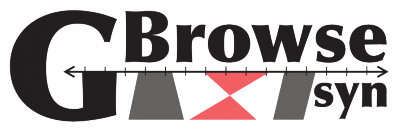
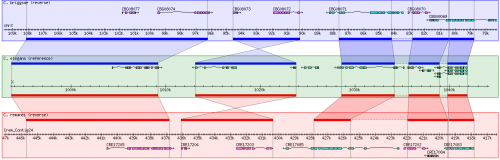

# GBrowse syn

From GMOD

Jump to: [navigation](#mw-navigation), [search](#p-search)

Status

- Beta release
- Development: active
- Support: active

Resources

- <a href="https://github.com/GMOD/GBrowse" class="external text"
  rel="nofollow">Download</a>
- <a href="../extras/2008GMODCommunitySurvey.html#GBrowse_syn"
  class="external text" rel="nofollow">2008 Survey</a>

[Cloud component](Cloud.1 "Cloud")

Included in

## Contents

- [1 About Generic
  Synteny Browser
  (GBrowse_syn)](#About_Generic_Synteny_Browser_.28GBrowse_syn.29)
  - [1.1
    Screenshots](#Screenshots)
- [2
  Downloads](#Downloads)
- [3 Using
  GBrowse_syn](#Using_GBrowse_syn)
  - [3.1
    Configuration](#Configuration)
  - [3.2
    Documentation](#Documentation)
    - [3.2.1
      Alignment data](#Alignment_data)
    - [3.2.2 User
      interface](#User_interface)
- [4 Publications,
  Tutorials, and
  Presentations](#Publications.2C_Tutorials.2C_and_Presentations)
  - [4.1
    Publications on or mentioning
    GBrowse_syn](#Publications_on_or_mentioning_GBrowse_syn)
  - [4.2
    Tutorials](#Tutorials)
  - [4.3
    Presentations](#Presentations)
- [5 Contacts and
  Mailing Lists](#Contacts_and_Mailing_Lists)
- [6 GBrowse_syn in
  the wild](#GBrowse_syn_in_the_wild)
- [7 GBrowse_syn
  Development](#GBrowse_syn_Development)
  - [7.1 Current
    status](#Current_status)
- [8 See
  also](#See_also)
- [9 More on
  GBrowse_syn](#More_on_GBrowse_syn)
  - [9.1
    GBrowse_syn Logo](#GBrowse_syn_Logo)

## About Generic Synteny Browser (GBrowse_syn)

GBrowse_syn, or the Generic Synteny Browser, is a
[GBrowse](GBrowse.1 "GBrowse")-based
<a href="Synteny" class="mw-redirect" title="Synteny">synteny</a>
browser designed to display multiple genomes, with a central reference
species compared to two or more additional species. It can be used to
view multiple sequence alignment data, synteny or co-linearity data from
other sources against genome annotations provided by GBrowse.
GBrowse_syn is included with the standard GBrowse package (version 1.69
and later).

  

### Screenshots

GBrowse_syn, as implemented at WormBase

## Downloads

- Download GBrowse_syn:
  <a href="https://github.com/GMOD/GBrowse" class="external free"
  rel="nofollow">https://github.com/GMOD/GBrowse</a>

  

- The development version of GBrowse_syn is found at
  <a href="https://github.com/GMOD/GBrowse" class="external free"
  rel="nofollow">https://github.com/GMOD/GBrowse</a>. Please be aware
  that development versions may have new features that are not fully
  tested.

  

## Using GBrowse_syn

GBrowse_syn has been part of the [GBrowse](GBrowse.1 "GBrowse")
distribution since version 1.69; we recommend using the most up-to-date
version of GBrowse 2. Please follow the [installation instructions for
GBrowse](GBrowse_2.0_Install_HOWTO.1 "GBrowse 2.0 Install HOWTO").

  

### Configuration

Configuration of GBrowse_syn is much the same as for
[GBrowse](GBrowse.1 "GBrowse"), with database and display options
controlled by a configuration file. GBrowse_syn uses a main
configuration file for general options plus an individual configuration
for each species represented in the multiple sequence alignments.

More information on [GBrowse_syn
configuration](GBrowse_syn_Configuration "GBrowse syn Configuration")

### Documentation

See the [help for GBrowse_syn](GBrowse_syn_Help "GBrowse syn Help")

#### Alignment data

- GBrowse_syn uses a central 'joining' database that contains
  information about the multiple sequence alignments
- There is an additional GBrowse database for each species represented
  in the alignments
- The databases for each species are configured in the same way as a
  regular GBrowse installations
- [Details on the GBrowse_syn
  database](GBrowse_syn_Database "GBrowse syn Database")

#### User interface

The overall look of Gbrowse_syn resembles GBrowse but has some key
differences to accomodate the more complex comparative genome data (see
the <a
href="http://gmod.org/mediawiki/index.php?title=Screenshot&amp;action=edit&amp;redlink=1"
class="new" title="Screenshot (page does not exist)">screenshot</a>
above).

GBrowse_syn uses a central "reference species" panel, with inset panels
above and below for two or more aligned species. There is no upper limit
to the number of species that can be displayed.

## Publications, Tutorials, and Presentations

### Publications on or mentioning GBrowse_syn

Please refer to the following paper when citing GBrowse_syn:

- Using the Generic Synteny Browser (GBrowse_syn)
  [\[1\]](#cite_note-PMID:20836076-1)

### Tutorials

<a href="GBrowse_syn_Tutorial" class="mw-redirect"
title="GBrowse syn Tutorial">GBrowse syn Tutorial</a>  
Installing and configuring GBrowse_syn; from the [2013 GMOD Summer
School](2013_GMOD_Summer_School "2013 GMOD Summer School")

### Presentations

- <a href="../mediawiki/images/d/d4/GBrowse_syn_EBI2009.pdf"
  class="internal" title="GBrowse syn EBI2009.pdf">Challenges in
  Comparative Genome Browsing</a> - Presented by [Sheldon
  McKay](User:Mckays "User:Mckays") at the
  <a href="http://www.ebi.ac.uk" class="external text"
  rel="nofollow">European Bioinformatics Institute</a>, Hinxton, UK.
- <a href="../mediawiki/images/d/d8/GBrowse_synSMBE2009.pdf"
  class="internal" title="GBrowse synSMBE2009.pdf">Comparative Genomics
  with GBrowse_syn</a> - Presentation by [Sheldon
  McKay](User:Mckays "User:Mckays") at the <a
  href="http://ccg.biology.uiowa.edu/smbe/symposia.php?action=view&amp;sym_ID=27"
  class="external text" rel="nofollow">SMBE 2009 GMOD Workshop</a> on
  using **GBrowse_syn** for [comparative
  genomics](Category:Comparative_Genomics "Category:Comparative Genomics").
- [GBrowse_syn at
  PAG](GBrowse_syn_PAG_2009_Workshop "GBrowse syn PAG 2009 Workshop") -
  Presentation by [Sheldon McKay](User:Mckays "User:Mckays") at the
  Plant and Animal Genomes meeting, San Diego, CA, USA.
- <a href="../mediawiki/images/5/58/Gbrowse_syn.pdf" class="internal"
  title="Gbrowse syn.pdf">November 2007</a> - [Sheldon
  McKay](User:Mckays "User:Mckays")'s presentation on GBrowse_syn at the
  [November 2007 GMOD
  Meeting](November_2007_GMOD_Meeting#GBrowse_Syn "November 2007 GMOD Meeting").

## Contacts and Mailing Lists

Support is via the GBrowse mailing list:

|  |  |  |  |
|----|----|----|----|
|  | Mailing List Link | Description | Archive(s) |
| [GBrowse](GBrowse.1 "GBrowse") & **GBrowse_syn** | <a href="https://lists.sourceforge.net/lists/listinfo/gmod-gbrowse"
class="external text" rel="nofollow">gmod-gbrowse</a> | [GBrowse](GBrowse.1 "GBrowse") and **GBrowse_syn** users and developers. | <a href="http://dir.gmane.org/gmane.science.biology.gmod.gbrowse"
class="external text" rel="nofollow">Gmane</a>, <a href="http://gmod.827538.n3.nabble.com/GBrowse-f815907.html"
class="external text" rel="nofollow">Nabble (2010/05+)</a>, <a href="https://lists.sourceforge.net/lists/listinfo/gmod-gbrowse"
class="external text" rel="nofollow">Sourceforge</a> |
|  | <a href="https://lists.sourceforge.net/lists/listinfo/gmod-gbrowse-cmts"
class="external text" rel="nofollow">gmod-gbrowse-cmts</a> | Code updates. | <a
href="http://sourceforge.net/mailarchive/forum.php?forum_name=gmod-gbrowse-cmts"
class="external text" rel="nofollow">Sourceforge</a> |

## GBrowse_syn in the wild

Public installations of GBrowse_syn:

- <a
  href="http://www.arabidopsis.org/cgi-bin/gbrowse_syn/arabidopsis/?name=Chr1%3A8367000..8370501"
  class="external text" rel="nofollow">The Arabidopsis Information
  Resource</a>
- <a
  href="http://dev.wormbase.org/db/seq/gbrowse_syn/compara?search_src=Cele;name=X:1050001..1150000"
  class="external text" rel="nofollow">WormBase</a>
- <a href="http://solgenomics.net/gbrowse2/bin/gbrowse_syn/sol3/"
  class="external text" rel="nofollow">Sol Genomics</a>

## GBrowse_syn Development

### Current status

See the [discussion page](Talk:GBrowse_syn "Talk:GBrowse syn") for notes
on further GBrowse_syn development.

## See also

The focus of this documentation is the GBrowse_syn application. However,
the generation of whole genome alignments and identification of
orthologous regions are the subject of considerable interest, so some
background reading is listed below:

- <a
  href="http://www.eecs.berkeley.edu/Pubs/TechRpts/2006/EECS-2006-104.html"
  class="external text" rel="nofollow">Primer on Hierarchical Genome
  Alignment Strategies</a>
- <a href="http://www.ncbi.nlm.nih.gov/pmc/articles/PMC2577869/"
  class="external text" rel="nofollow">article on PECAN and ENREDO</a>
- <a href="http://www.ebi.ac.uk/~bjp/pecan/" class="external text"
  rel="nofollow">all about PECAN</a>
- <a href="http://www.ensembl.org/info/website/archives/index.html"
  class="external text" rel="nofollow">Information about EnsEMBL's compara
  pipeline</a>

## More on GBrowse_syn

See [Category:GBrowse_syn](Category:GBrowse_syn "Category:GBrowse syn")

### GBrowse_syn Logo

The [GBrowse_syn
logo](File:GBrowse_syn_logo.png "File:GBrowse syn logo.png") was created
by
<a href="mailto:NextLevelDesignStudios@gmail.com" class="external text"
rel="nofollow">Darek Lakey</a>, a participant in the [Spring 2010 Logo
Program](Spring_2010_Logo_Program "Spring 2010 Logo Program"), while a
design student at
<a href="http://www.linnbenton.edu" class="external text"
rel="nofollow">Linn-Benton Community College</a>.

  

1.  [↑](#cite_ref-PMID:20836076_0)
    **Cite error: Invalid `<ref>` tag; no text was provided for refs
    named `PMID:20836076`**

Raw tool data at [GBrowse_syn/tool
data](GBrowse_syn/tool_data "GBrowse syn/tool data")

Retrieved from
"<http://gmod.org/mediawiki/index.php?title=GBrowse_syn&oldid=24704>"

[Categories](Special:Categories "Special:Categories"):

- [GMOD Component](Category:GMOD_Component "Category:GMOD Component")
- <a
  href="http://gmod.org/mediawiki/index.php?title=Category:Template&amp;action=edit&amp;redlink=1"
  class="new" title="Category:Template (page does not exist)">Template</a>
- [GMOD in the
  Cloud](Category:GMOD_in_the_Cloud "Category:GMOD in the Cloud")
- [GMOD Components](Category:GMOD_Components "Category:GMOD Components")
- [Tool data](Category:Tool_data "Category:Tool data")
- [GBrowse syn](Category:GBrowse_syn "Category:GBrowse syn")
- [GMOD Developers](Category:GMOD_Developers "Category:GMOD Developers")
- [GBrowse](Category:GBrowse "Category:GBrowse")
- [Comparative
  Genomics](Category:Comparative_Genomics "Category:Comparative Genomics")
- [WormBase](Category:WormBase "Category:WormBase")
- <a
  href="http://gmod.org/mediawiki/index.php?title=Category:SemanticLink&amp;action=edit&amp;redlink=1"
  class="new"
  title="Category:SemanticLink (page does not exist)">SemanticLink</a>

Facts about
"[GBrowse
syn](Special:Browse/GBrowse-20syn "Special:Browse/GBrowse-20syn")"[RDF
feed](http://gmod.org/wiki/Special:ExportRDF/GBrowse_syn "Special:ExportRDF/GBrowse syn")

|  |  |
|----|----|
| [Available on platform](Property:Available_on_platform "Property:Available on platform") | web [+](Special:SearchByProperty/Available-20on-20platform/web "Special:SearchByProperty/Available-20on-20platform/web") |
| [Has URL](Property:Has_URL "Property:Has URL") | <a href="https://github.com/GMOD/GBrowse" class="external free"
rel="nofollow">https://github.com/GMOD/GBrowse</a> [+](Special:SearchByProperty/Has-20URL/https:-2F-2Fgithub.com-2FGMOD-2FGBrowse "Special:SearchByProperty/Has-20URL/https:-2F-2Fgithub.com-2FGMOD-2FGBrowse"), <a
href="http://mckay.cshl.edu/cgi-bin/gbrowse_syn/mercator/?search_src=Cbri%3Bname=chrX:620000..670000"
class="external free"
rel="nofollow">http://mckay.cshl.edu/cgi-bin/gbrowse_syn/mercator/?search_src=Cbri%3Bname=chrX:620000..670000</a> [+](Special:SearchByProperty/Has-20URL/http:-2F-2Fmckay.cshl.edu-2Fcgi-2Dbin-2Fgbrowse_syn-2Fmercator-2F-3Fsearch_src=Cbri-253Bname=chrX:620000..670000 "Special:SearchByProperty/Has-20URL/http:-2F-2Fmckay.cshl.edu-2Fcgi-2Dbin-2Fgbrowse syn-2Fmercator-2F-3Fsearch src=Cbri-253Bname=chrX:620000..670000"), <a
href="http://www.arabidopsis.org/cgi-bin/gbrowse_syn/arabidopsis/?name=Chr1%3A8367000..8370501"
class="external free"
rel="nofollow">http://www.arabidopsis.org/cgi-bin/gbrowse_syn/arabidopsis/?name=Chr1%3A8367000..8370501</a> [+](Special:SearchByProperty/Has-20URL/http:-2F-2Fwww.arabidopsis.org-2Fcgi-2Dbin-2Fgbrowse_syn-2Farabidopsis-2F-3Fname=Chr1-253A8367000..8370501 "Special:SearchByProperty/Has-20URL/http:-2F-2Fwww.arabidopsis.org-2Fcgi-2Dbin-2Fgbrowse syn-2Farabidopsis-2F-3Fname=Chr1-253A8367000..8370501"), <a
href="http://dev.wormbase.org/db/seq/gbrowse_syn/compara?search_src=Cele%3Bname=X:1050001..1150000"
class="external free"
rel="nofollow">http://dev.wormbase.org/db/seq/gbrowse_syn/compara?search_src=Cele%3Bname=X:1050001..1150000</a> [+](Special:SearchByProperty/Has-20URL/http:-2F-2Fdev.wormbase.org-2Fdb-2Fseq-2Fgbrowse_syn-2Fcompara-3Fsearch_src=Cele-253Bname=X:1050001..1150000 "Special:SearchByProperty/Has-20URL/http:-2F-2Fdev.wormbase.org-2Fdb-2Fseq-2Fgbrowse syn-2Fcompara-3Fsearch src=Cele-253Bname=X:1050001..1150000") and <a href="http://solgenomics.net/gbrowse2/bin/gbrowse_syn/sol3/"
class="external free"
rel="nofollow">http://solgenomics.net/gbrowse2/bin/gbrowse_syn/sol3/</a> [+](Special:SearchByProperty/Has-20URL/http:-2F-2Fsolgenomics.net-2Fgbrowse2-2Fbin-2Fgbrowse_syn-2Fsol3-2F "Special:SearchByProperty/Has-20URL/http:-2F-2Fsolgenomics.net-2Fgbrowse2-2Fbin-2Fgbrowse syn-2Fsol3-2F") |
| [Has description](Property:Has_description "Property:Has description") | GBrowse_syn, or the Generic Synteny Browse … GBrowse_syn, or the Generic Synteny Browser, is a [GBrowse](GBrowse.1 "GBrowse")-based <a href="Synteny" class="mw-redirect" title="Synteny">synteny</a> browser designed to display multiple genomes, with a central reference species compared to two or more additional species. It can be used to view multiple sequence alignment data, synteny or co-linearity data from other sources against genome annotations provided by GBrowse. GBrowse_syn is included with the standard GBrowse package (version 1.69 and later). GBrowse package (version 1.69 and later). <a
href="http://gmod.org/mediawiki/index.php?title=Special:SearchByProperty&amp;x=Has-20description%2FGBrowse_syn%2C-20or-20the-20Generic-20Synteny-20Browser%2C-20is-20a-20-5B-5BGBrowse-5D-5D-2Dbased-20-5B-5Bsynteny-5D-5D-20browser-20designed-20to-20display-20multiple-20genomes%2C-20with-20a-20central-20reference-20species-20compared-20to-20two-20or-20more-20additional-20species.-20It-20can-20be-20used-20to-20view-20multiple-20sequence-20alignment-20data%2C-20synteny-20or-20co-2Dlinearity-20data-20from-20other-20sources-20against-20genome-20annotations-20provided-20by-20GBrowse.-20GBrowse_syn-20is-20included-20with-20the-20standard-20GBrowse-20package-20%28version-201.69-20and-20later%29."
class="external text" rel="nofollow">+</a> |
| [Has development status](Property:Has_development_status "Property:Has development status") | active [+](Special:SearchByProperty/Has-20development-20status/active "Special:SearchByProperty/Has-20development-20status/active") |
| [Has download URL](Property:Has_download_URL "Property:Has download URL") | <a href="https://github.com/GMOD/GBrowse" class="external free"
rel="nofollow">https://github.com/GMOD/GBrowse</a> [+](Special:SearchByProperty/Has-20download-20URL/https:-2F-2Fgithub.com-2FGMOD-2FGBrowse "Special:SearchByProperty/Has-20download-20URL/https:-2F-2Fgithub.com-2FGMOD-2FGBrowse") |
| <a
href="http://gmod.org/mediawiki/index.php?title=Property:Has_full_name&amp;action=edit&amp;redlink=1"
class="new"
title="Property:Has full name (page does not exist)">Has full name</a> | Generic Synteny Browser [+](Special:SearchByProperty/Has-20full-20name/Generic-20Synteny-20Browser "Special:SearchByProperty/Has-20full-20name/Generic-20Synteny-20Browser") |
| [Has logo](Property:Has_logo "Property:Has logo") | GBrowse_syn_logo.png [+](Special:SearchByProperty/Has-20logo/GBrowse_syn_logo.png "Special:SearchByProperty/Has-20logo/GBrowse syn logo.png") |
| [Has software maturity status](Property:Has_software_maturity_status "Property:Has software maturity status") | beta release [+](Special:SearchByProperty/Has-20software-20maturity-20status/beta-20release "Special:SearchByProperty/Has-20software-20maturity-20status/beta-20release") |
| [Has support status](Property:Has_support_status "Property:Has support status") | active [+](Special:SearchByProperty/Has-20support-20status/active "Special:SearchByProperty/Has-20support-20status/active") |
| [Has title](Property:Has_title "Property:Has title") | The Arabidopsis Information Resource [+](Special:SearchByProperty/Has-20title/The-20Arabidopsis-20Information-20Resource "Special:SearchByProperty/Has-20title/The-20Arabidopsis-20Information-20Resource"), WormBase [+](Special:SearchByProperty/Has-20title/WormBase "Special:SearchByProperty/Has-20title/WormBase") and Sol Genomics [+](Special:SearchByProperty/Has-20title/Sol-20Genomics "Special:SearchByProperty/Has-20title/Sol-20Genomics") |
| [Has topic](Property:Has_topic "Property:Has topic") | **GBrowse syn** [+](Special:SearchByProperty/Has-20topic/GBrowse-20syn "Special:SearchByProperty/Has-20topic/GBrowse-20syn") |
| [Is open source](Property:Is_open_source "Property:Is open source") | Yes [+](Special:SearchByProperty/Is-20open-20source/Yes "Special:SearchByProperty/Is-20open-20source/Yes") |
| [Link type](Property:Link_type "Property:Link type") | download [+](Special:SearchByProperty/Link-20type/download "Special:SearchByProperty/Link-20type/download"), source code [+](Special:SearchByProperty/Link-20type/source-20code "Special:SearchByProperty/Link-20type/source-20code"), demo server [+](Special:SearchByProperty/Link-20type/demo-20server "Special:SearchByProperty/Link-20type/demo-20server") and wild URL [+](Special:SearchByProperty/Link-20type/wild-20URL "Special:SearchByProperty/Link-20type/wild-20URL") |
| [Release date](Property:Release_date "Property:Release date") | 1 January 2007 [+](Special:SearchByProperty/Release-20date/1-20January-202007 "Special:SearchByProperty/Release-20date/1-20January-202007") |
| [Tool functionality or classification](Property:Tool_functionality_or_classification "Property:Tool functionality or classification") | Comparative genome visualization [+](Special:SearchByProperty/Tool-20functionality-20or-20classification/Comparative-20genome-20visualization "Special:SearchByProperty/Tool-20functionality-20or-20classification/Comparative-20genome-20visualization") |
| [Written in language](Property:Written_in_language "Property:Written in language") | Perl [+](Special:SearchByProperty/Written-20in-20language/Perl "Special:SearchByProperty/Written-20in-20language/Perl") |
| [Has subobject](Property:Has_subobject "Property:Has subobject")This property is a special property in this wiki. | [GBrowse syn#https://github.com/GMOD/GBrowse](GBrowse_syn.1#https:.2F.2Fgithub.com.2FGMOD.2FGBrowse "GBrowse syn") [+](Special:SearchByProperty/Has-20subobject/GBrowse-20syn-23https:-2F-2Fgithub.com-2FGMOD-2FGBrowse "Special:SearchByProperty/Has-20subobject/GBrowse-20syn-23https:-2F-2Fgithub.com-2FGMOD-2FGBrowse"), [GBrowse syn](GBrowse_syn.1#_3f191793107a24a15ada3afac9cf75ac "GBrowse syn") [+](Special:SearchByProperty/Has-20subobject/GBrowse-20syn-23_3f191793107a24a15ada3afac9cf75ac "Special:SearchByProperty/Has-20subobject/GBrowse-20syn-23 3f191793107a24a15ada3afac9cf75ac"), [GBrowse syn](GBrowse_syn.1#_96d0639ca7bbe782fb4a48f637423eca "GBrowse syn") [+](Special:SearchByProperty/Has-20subobject/GBrowse-20syn-23_96d0639ca7bbe782fb4a48f637423eca "Special:SearchByProperty/Has-20subobject/GBrowse-20syn-23 96d0639ca7bbe782fb4a48f637423eca"), [GBrowse syn](GBrowse_syn.1#_59b6f51594a7b5445e19637374761ae9 "GBrowse syn") [+](Special:SearchByProperty/Has-20subobject/GBrowse-20syn-23_59b6f51594a7b5445e19637374761ae9 "Special:SearchByProperty/Has-20subobject/GBrowse-20syn-23 59b6f51594a7b5445e19637374761ae9") and [GBrowse syn#http://solgenomics.net/gbrowse2/bin/gbrowse_syn/sol3/](GBrowse_syn.1#http:.2F.2Fsolgenomics.net.2Fgbrowse2.2Fbin.2Fgbrowse_syn.2Fsol3.2F "GBrowse syn") [+](Special:SearchByProperty/Has-20subobject/GBrowse-20syn-23http:-2F-2Fsolgenomics.net-2Fgbrowse2-2Fbin-2Fgbrowse_syn-2Fsol3-2F "Special:SearchByProperty/Has-20subobject/GBrowse-20syn-23http:-2F-2Fsolgenomics.net-2Fgbrowse2-2Fbin-2Fgbrowse syn-2Fsol3-2F") |

## Navigation menu

### Namespaces

- <a href="GBrowse_syn.1" accesskey="c"
  title="View the content page [c]">Page</a>
- <a href="Talk:GBrowse_syn" accesskey="t"
  title="Discussion about the content page [t]">Discussion</a>

### 

### Variants

### Navigation

- [GMOD Home](Main_Page)
- [Software](GMOD_Components)
- [Categories /
  Tags](Categories)
- [View all pages](Special:AllPages)

### Documentation

- [Overview](Overview)
- [FAQs](Category:FAQ)
- [HOWTOs](Category:HOWTO)
- [Glossary](Glossary)

### Community

- [GMOD News](GMOD_News)
- [Training /
  Outreach](Training_and_Outreach)
- [Support](Support)
- [GMOD Promotion](GMOD_Promotion)
- [Meetings](Meetings)
- [Calendar](Calendar)

### Tools

- <a href="Special:Browse/GBrowse_syn" rel="smw-browse">Browse
  properties</a>
- [Print as
  PDF](http://gmod.org/mediawiki/index.php?title=Special:PdfPrint&page=GBrowse_syn)

- Last updated at 21:39 on 15 October
  2013.
<!-- - 642,141 page views. -->
- Content is available under
  <a href="http://www.gnu.org/licenses/fdl-1.3.html" class="external"
  rel="nofollow">a GNU Free Documentation License</a> unless otherwise
  noted.

<!-- -->

- [About
  GMOD](GMOD:About "GMOD:About")

<!-- -->

- 

