

# GBrowse syn AGS Tutorial

From GMOD

Jump to: [navigation](#mw-navigation), [search](#p-search)

  

This [GBrowse_syn](GBrowse_syn.1 "GBrowse syn") tutorial was presented
by [Sheldon McKay, iPlant Collaborative, University of
Arizona](User:Mckays "User:Mckays") at the
<a href="http://www.k-state.edu/agc/symp2011/" class="external text"
rel="nofollow">Arthropod Genomics Symposium 2011</a>, June 2011. The
most recent GBrowse_syn tutorial can be found at the
<a href="GBrowse_syn_Tutorial" class="mw-redirect"
title="GBrowse syn Tutorial">GBrowse_syn Tutorial</a> page.  
[GBrowse_syn](GBrowse_syn.1 "GBrowse syn") is a
[GBrowse](GBrowse.1 "GBrowse")-based
<a href="Synteny" class="mw-redirect" title="Synteny">synteny</a>
browser designed to display multiple genomes, with a central reference
species compared to two or more additional species. It is included with
the standard GBrowse package (version 1.69 and later).

  

<a href="File:Gbrowse_syn2.png" class="image">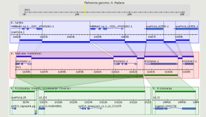</a>

GBrowse_syn as it looks at The Arabidopsis Information Resource (TAIR)

Working examples of GBrowse_syn can be seen at <a
href="http://www.arabidopsis.org/cgi-bin/gbrowse_syn/arabidopsis/?name=Chr1%3A8367000..8370501;search_src=thaliana"
class="external text" rel="nofollow">TAIR</a> and <a
href="http://dev.wormbase.org/db/seq/gbrowse_syn/compara?search_src=Cele;name=X:1050001..1150000"
class="external text" rel="nofollow">WormBase</a>.

  

## Contents

- [1 GBrowse_syn
  Introduction](#GBrowse_syn_Introduction)
- [2 Installing
  GBrowse_syn](#Installing_GBrowse_syn)
- [3 Setting up the
  sample data](#Setting_up_the_sample_data)
  - [3.1 Setting up
    the Alignment Database](#Setting_up_the_Alignment_Database)
  - [3.2 Setting up
    the Configuration Files](#Setting_up_the_Configuration_Files)
    - [3.2.1
      Activating the Oryza Data
      Source](#Activating_the_Oryza_Data_Source)
  - [3.3 Speeding
    up the Browser](#Speeding_up_the_Browser)
- [4 Using
  Non-alignment Data](#Using_Non-alignment_Data)
- [5
  Mercator](#Mercator)
- [6 Further
  Reading](#Further_Reading)
  - [6.1
    Citation](#Citation)
  - [6.2 A Note on
    Whole Genome Alignments](#A_Note_on_Whole_Genome_Alignments)
  - [6.3
    Documentation](#Documentation)

## GBrowse_syn Introduction

- An introductory talk will be presented using the slides below. Click
  the section to open.

<a href="File:GBrowse_synSlide1.png" class="image">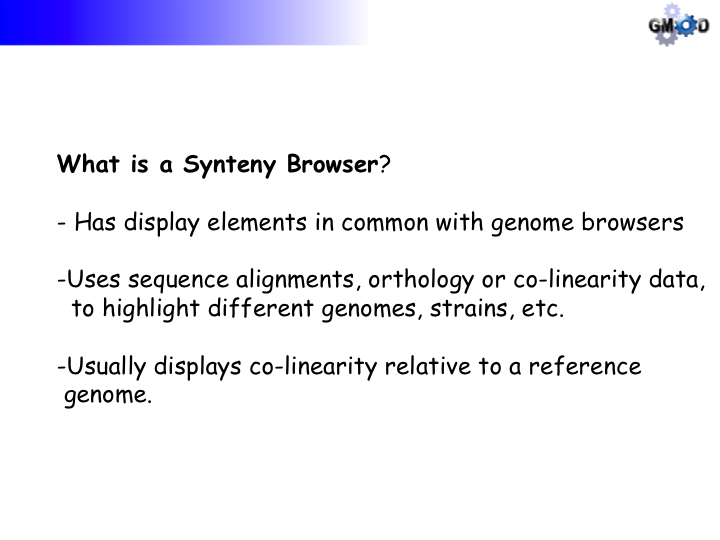</a>  
  
<a href="File:GBrowse_synSlide7.png" class="image">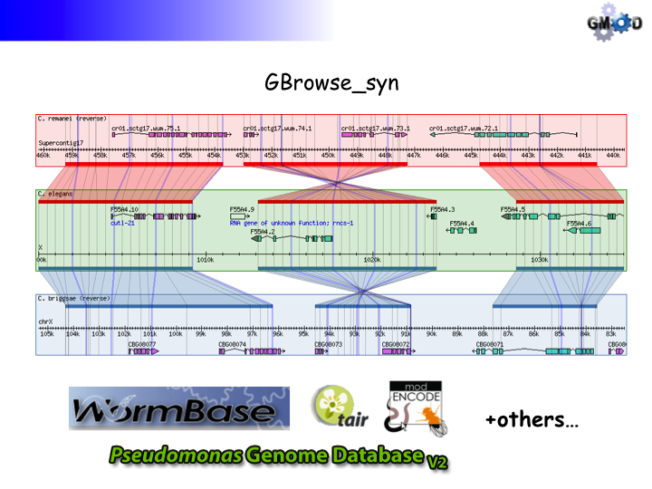</a>  
  
<a href="File:GBrowse_synSlide13.png" class="image">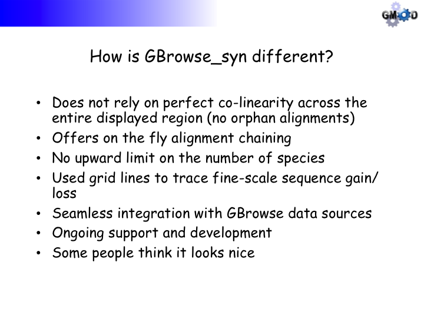</a>  
  
<a href="File:GBrowse_synSlide14.png" class="image">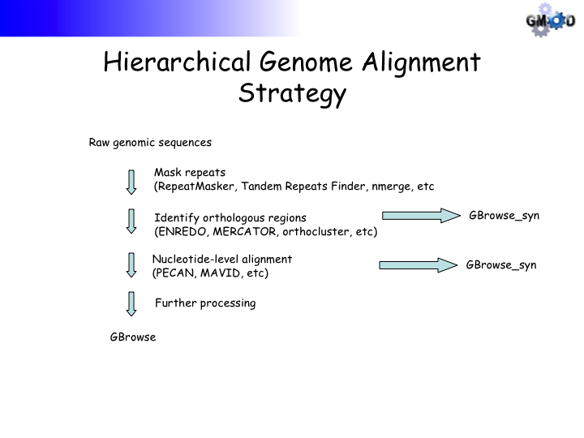</a>  
  
<a href="File:GBrowse_synSlide15.png" class="image">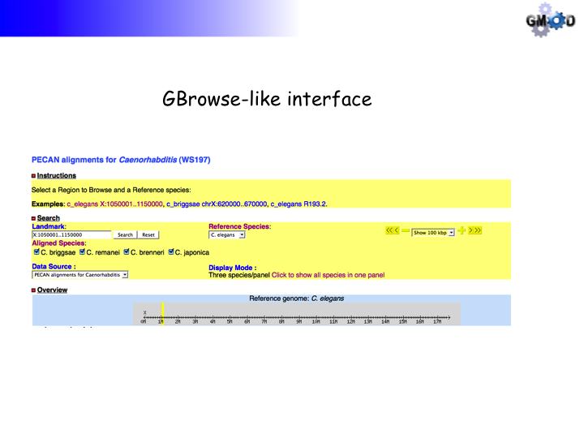</a>  
  
<a href="File:GBrowse_synSlide16.png" class="image">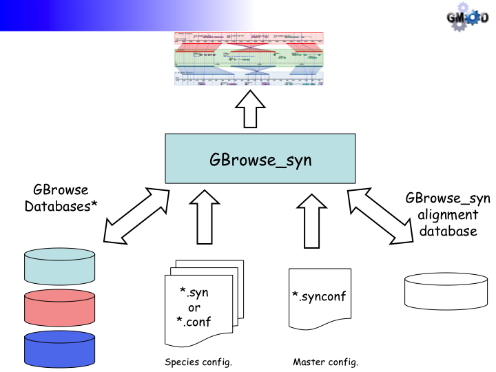</a>  
  
<a href="File:GBrowse_synSlide17.png" class="image">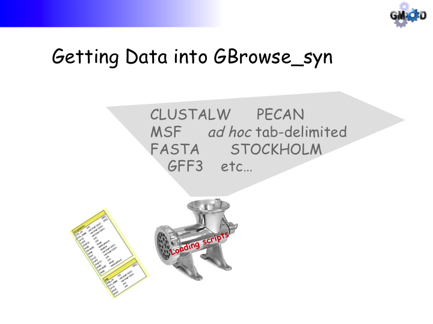</a>  
  
<a href="File:GBrowse_synSlide18.png" class="image">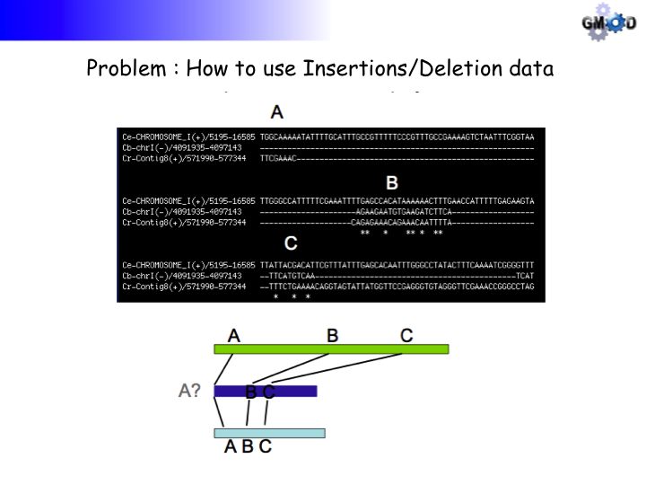</a>  
  
<a href="File:GBrowse_synSlide19.png" class="image">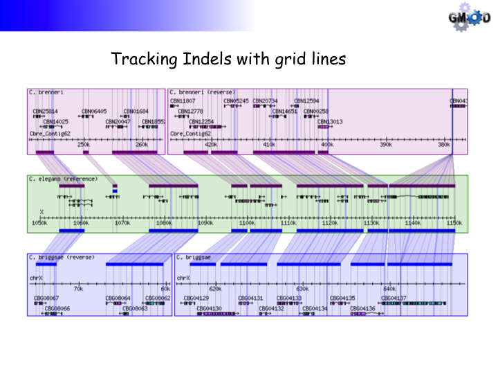</a>  
  
<a href="File:GBrowse_synSlide20.png" class="image">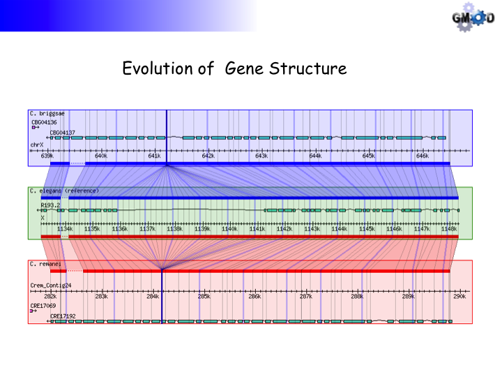</a>  
  
<a href="File:GBrowse_synSlide21.png" class="image">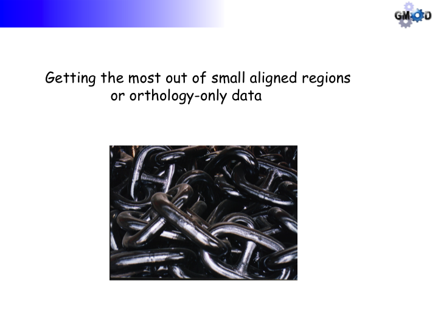</a>  
  
<a href="File:GBrowse_synSlide22.png" class="image">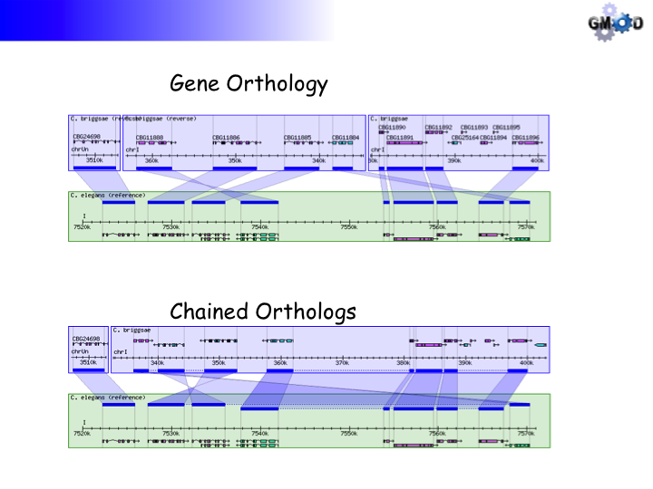</a>  
  
<a href="File:GBrowse_synSlide23.png" class="image">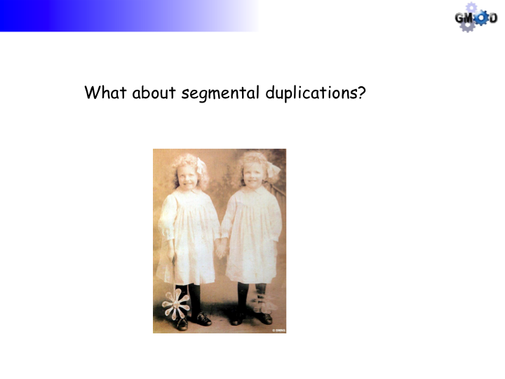</a>  
  
<a href="File:GBrowse_synSlide24.png" class="image">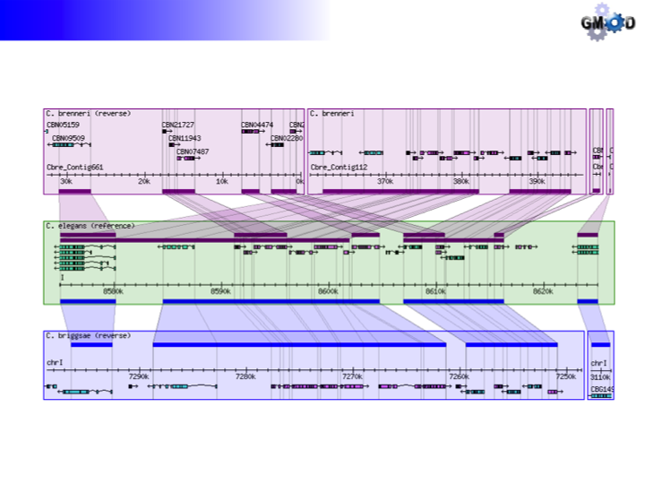</a>  

## Installing GBrowse_syn

GBrowse_syn is part of the GBrowse 2.0 package and will be pre-installed
with [GBrowse 2.0 installation](GBrowse_2.0_HOWTO "GBrowse 2.0 HOWTO").

    $ sudo cpan -i Bio::Graphics::Browser2

Note: Gbrowse 2 has been pre-installed for this demonstration

- Now point your browser to
  <a href="http://localhost/cgi-bin/gb2/gbrowse" class="external free"
  rel="nofollow">http://localhost/cgi-bin/gb2/gbrowse</a> to see that
  GBrowse was installed correctly. You should see a page similar to the
  one below, which is the default yeast data source.

<a href="File:GBrowse2_installed.png" class="image">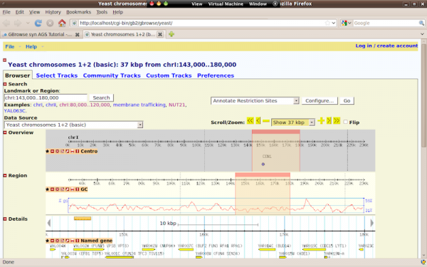</a>

This is the welcome screen you should see after installing a new copy of
GBrowse

  

- Point your browser to
  <a href="http://localhost/cgi-bin/gb2/gbrowse_syn" class="external free"
  rel="nofollow">http://localhost/cgi-bin/gb2/gbrowse_syn</a>

<a href="File:GBrowse_synWelcom.png" class="image">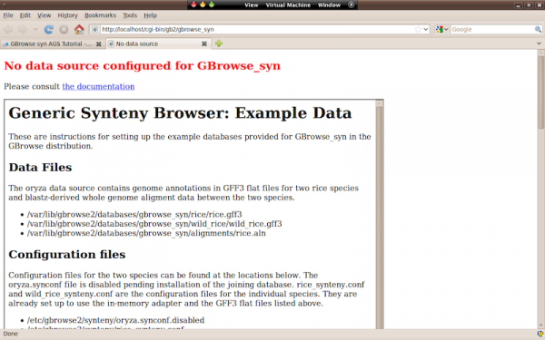</a>

This is the welcome screen you should see after installing a new copy of
GBrowse_syn with no configured data sources. It contains instructions on
how to set up the example data source provided with the distribution.

  

## Setting up the sample data

- Sample data and configuration information for GBrowse_syn come
  pre-packaged with GBrowse.
- The example we will use is a two-species comparison of rice (*Oryza
  sativa*) and one of its wild relatives\*

*\*Data courtesy of Bonnie Hurwitz; sequences and names have been
obfuscated to protect unpublished data*

### Setting up the Alignment Database

The alignment, or joining database will contain the sequence alignments
between the two rice species. It will be in a [MySQL](MySQL "MySQL")
database.

1\) Create a MySQL database to hold the alignment data On the virtual
disk, the MySQL root password is gmod

    $ mysql -u root -p
    Enter password: ****
    Welcome to the MySQL monitor.  Commands end with ; or \g.
    Your MySQL connection id is 37
    Server version: 5.1.37-1ubuntu5.1 (Ubuntu)

    Type 'help;' or '\h' for help. Type '\c' to clear the current input statement.

    mysql> create database rice_synteny;
    Query OK, 1 row affected (0.00 sec)

    mysql>

2\) Give read-only (SELECT privileges in SQL) to the default apache user
`www-data`. We can do this for all of the MySQL databases, since they
are all for web applications

    mysql> GRANT SELECT on *.* TO 'www-data'@'localhost';
    Query OK, 0 rows affected (0.00 sec)

    mysql> quit

3\) Decompress the sample alignment data and load the database. You need
to have root-level access (be a sudoer) for some of the steps below.

    $ cd /var/lib/gbrowse2/databases/gbrowse_syn/alignments/
    $ sudo gunzip rice.aln.gz

Have a look at the first few lines of the data:

    $ head -20 rice.aln
    CLUSTAL W(1.81) multiple sequence alignment W(1.81)

    rice-3(+)/16598648-16600199      ggaggccggccgtctgccatgcgtgagccagacggggcgggccggagacaggccacgtgg
    wild_rice-3(+)/14467855-14469373 gggggccgg------------------------------------agacaggccacgtgg
                                     ** ******                                    ***************

    rice-3(+)/16598648-16600199      ccctgccccgggctgttgacccactggcacccctgtcccgggttgtcgccctcctttccc
    wild_rice-3(+)/14467855-14469373 ccctgccccgggctgttgacccactggcacccctgtcccgggttgtcgccctcctttccc
                                     ************************************************************

    rice-3(+)/16598648-16600199      cgccatgctctaagtttgctcctcttctcgaacttctctctttgattcttcacgtcctct
    wild_rice-3(+)/14467855-14469373 cgccatgctctaagtttgctcctcttctcgaacttctctctttgattcttcacgtcctct
                                     ************************************************************

    rice-3(+)/16598648-16600199      tggagcctccccttctagctcgatcacgctctgctcttccgcttggaggctggcaaaact
    wild_rice-3(+)/14467855-14469373 tggagcctccccttctagctcgatcgcgctctgctcttccgcttggaggctggcaaaact

The format is CLUSTALW. This is a formatting convention; it does not
mean CLUSTALW was used to generate the alignment data. See [Further
Reading](#Further_Reading) below for more information on data loading
and the meta-data in the sequence names

4\) Load the database with the script
`gbrowse_syn_load_alignments_msa.pl`, which is automatically installed
along with GBrowse. See the
<a href="GBrowse_syn_Scripts" class="external text"
rel="nofollow">GBrowse_syn scripts</a> page for details on the
options for the script.

    $ gbrowse_syn_load_alignments_msa.pl -u root -p gmod -d rice_synteny -c -v rice.aln

There are 1800 alignment blocks, so this will take a little while to
run.

### Setting up the Configuration Files

- The configuration files required for this data source are
  pre-installed with [GBrowse](GBrowse.1 "GBrowse"), in
  `/etc/gbrowse2/synteny/`.
- There are two species' config files, `rice_synteny.conf` and
  `wild_rice_synteny.conf`, and the joining config file,
  `oryza.synconf`. The latter file has been disabled by appending a
  '.disabled' extension to the file name.

The joining config file, `oryza.synconf`:

    [GENERAL]
    description =  BLASTZ alignments for Oryza sativa

    ====Sample Configuration Files====
    # The synteny database
    join        = dbi:mysql:database=rice_synteny;host=localhost

    # This option maps the relationship between the species data sources, names and descriptions
    # The value for "name" (the first column) is the symbolic name that gbrowse_syn users to identify each species.
    # This value is also used in two other places in the gbrowse_syn configuration:
    # the species name in the "examples" directive and the species name in the .aln file
    # The value for "conf. file" is the basename of the corresponding gbrowse .conf files.
    # This value is also used to identify the species configuration stanzas at the bottom of the configuration file.

    #                 name          conf. file            Description
    source_map =      rice          rice_synteny          "Domesic Rice (O. sativa)"
                      wild_rice     wild_rice_synteny     "Wild Rice"

    tmpimages     = /tmp/gbrowse2
    imagewidth    = 800
    stylesheet    = /gbrowse2/css/gbrowse_transparent.css
    cache time    = 1

    config_extension = conf

    # example searches to display
    examples = rice 3:16050173..16064974
               wild_rice 3:1..400000

    zoom levels = 5000 10000 25000 50000 100000 200000 400000

    # species-specific databases
    [rice_synteny]
    tracks    = EG
    color     = blue

    [wild_rice_synteny]
    tracks    = EG
    color     = red

A sample species config file, `rice_synteny.conf`:

    [GENERAL]
    description   = Domestic rice chromosome 3
    db_adaptor    = Bio::DB::SeqFeature::Store
    db_args       = -adaptor memory
                    -dir    /var/www/gbrowse2/databases/gbrowse_syn/rice

    # Web site configuration info
    tmpimages   = /tmp/gbrowse2

    [EG]
    feature      = gene:ensembl
    glyph        = gene
    height       = 10
    bgcolor      = peachpuff
    fgcolor      = hotpink
    description  = 0
    label        = 0
    category     = Transcripts
    key          = ensembl gene
    balloon hover = Hello, my name is $name!

Note: the species databases are actually using the [GFF3](GFF3 "GFF3")
flat file, in-memory adapter

#### Activating the Oryza Data Source

1\) Make sure the temporary image directory specified in the config
files exists and is world-writable

    $ sudo mkdir /var/www/tmp
    $ sudo mkdir /var/www/tmp/gbrowse2
    $ sudo chmod 777 /var/www/tmp/gbrowse2

2\) Renaming the configuration file

    $ cd /etc/gbrowse2/synteny
    $ sudo mv oryza.synconf.disabled oryza.synconf

3\) Point your browser to
<a href="http://localhost/cgi-bin/gb2/gbrowse_syn/oryza"
class="external free"
rel="nofollow">http://localhost/cgi-bin/gb2/gbrowse_syn/oryza</a>. You
should see:

<a href="File:GBrowse_synWe_made_it1.png" class="image">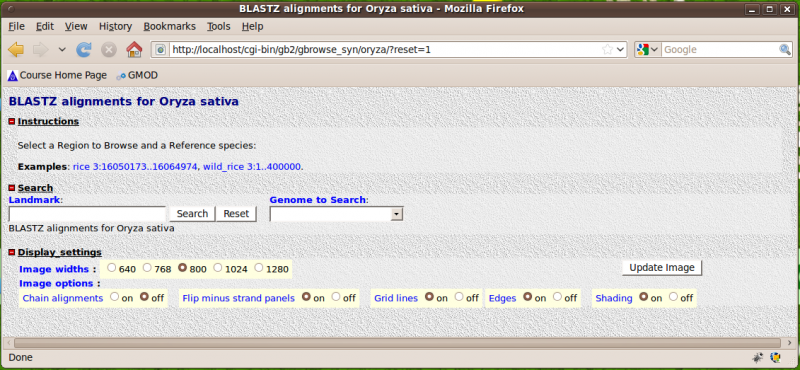</a>

  

4\) Click on the first example, you should (eventually) see:

<a href="File:GBrowse_synWe_made_it2.png" class="image">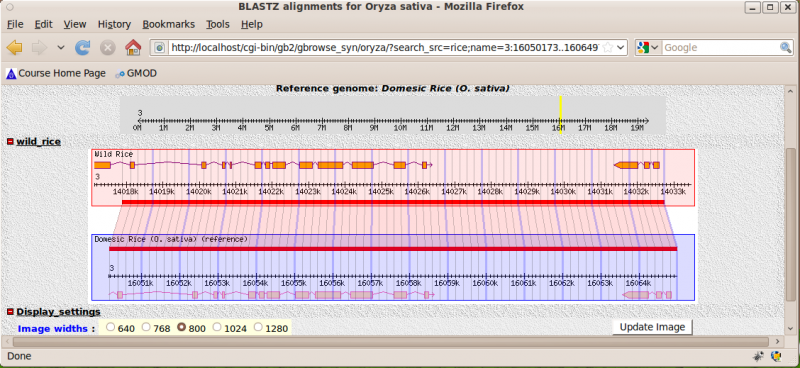</a>

  

### Speeding up the Browser

You can speed up the image loading time by putting your species'
[GFF3](GFF3 "GFF3") data into relational MySQL databases.

1\) Create a database for each of the GFF data files (`rice.gff3` and
`wild_rice.gff3`).

    $ mysql -uroot -pgmod

    mysql> create database rice;
    Query OK, 1 row affected (0.00 sec)

    mysql> create database wild_rice;
    Query OK, 1 row affected (0.00 sec)

    mysql> quit

2\) Populate the databases using the [loading script
`bp_seqfeature_load.pl`](GBrowse_Install_HOWTO#GFF3 "GBrowse Install HOWTO")
(pre-installed as part of [BioPerl](BioPerl "BioPerl") with
[GBrowse](GBrowse.1 "GBrowse")). This will load the GFF3 data into a
MySQL relational database. Note the MySQL user will root-level
privileges.

    $ cd /var/www/gbrowse2/databases/gbrowse_syn/rice
    $ bp_seqfeature_load.pl -u root -p gmod -d rice -c -f rice.gff3
    loading rice.gff3...
    Building object tree...
    0.55s0s

    Loading bulk data into database... 0.73s
    load time: 11.99s

     $ cd ../wild_rice
    $ bp_seqfeature_load.pl -u root -p gmod -d wild_rice -c -f wild_rice.gff3
    loading wild_rice.gff3...
    Building object tree...
    0.55s7a

    Loading bulk data into database... 0.69s
    load time: 12.02s

3\) Modify the following stanza in the file `rice_synteny.conf`. This
will convert your data source from a flat file database to a MySQL
relational database.

    # from
    db_args       = -adaptor memory
                    -dir    /var/www/html/gbrowse/databases/gbrowse_syn/rice

  
  

    # to
    db_args       = -dsn dbi:mysql:rice

4\) repeat for `wild_rice_synteny.conf`

## Using Non-alignment Data

This example uses gene orthology-based synteny blocks\* based created by
<a href="http://genome.sfu.ca/orthoclusterdb" class="external text"
rel="nofollow">OrthoCluster</a> for three nematode species, *C.
elegans*, *C. briggsae* and *P. pacificus*.

*\*Data courtesy of Jack Chen and Ismael Vergera*

1\) Download and unpack the data archive file `orthocluster.tar.gz`.

    $ cd ~/Documents/Data/gbrowse_syn
    $ tar zxf orthocluster.tar.gz

2\) Examine the contents of the `ORTHOCLUSTER` directory tree using the
Unix `tree` command. It is not installed by default, so we will have to
get it first.

    $ sudo apt-get install tree
    [sudo] password for gmod:
    Reading package lists... Done
    Building dependency tree
    Reading state information... Done
    The following NEW packages will be installed:
      tree
    0 upgraded, 1 newly installed, 0 to remove and 37 not upgraded.
    Need to get 31.1kB of archives.
    After this operation, 98.3kB of additional disk space will be used.
    Get:1 http://us.archive.ubuntu.com karmic/universe tree 1.5.2.2-1 [31.1kB]
    Fetched 31.1kB in 0s (37.0kB/s)
    Selecting previously deselected package tree.
    (Reading database ... 135915 files and directories currently installed.)
    Unpacking tree (from .../tree_1.5.2.2-1_i386.deb) ...
    Processing triggers for man-db ...
    Setting up tree (1.5.2.2-1) ...

Now we can use it

    $ tree ORTHOCLUSTER/
    ORTHOCLUSTER/
    |-- conf
    |   |-- bri.conf
    |   |-- ele.conf
    |   |-- orthocluster.synconf
    |   `-- ppa.conf
    |-- gff
    |   |-- bri.gff
    |   |-- ele.gff
    |   `-- ppa.gff
    `-- orthocluster.txt

    2 directories, 8 files

In the `conf` directory, there are configuration files for the joining
database and each of the three species. They are similar in structure to
the examples shown above, except that the database adapter
<a href="http://search.cpan.org/perldoc?Bio::DB::GFF"
class="external text" rel="nofollow">Bio::DB::GFF</a> and a gene
aggregator are used because the [GFF is version 2](GFF2 "GFF2"). For
example:

    [GENERAL]
    description   = C. briggsae
    db_adaptor    = Bio::DB::GFF
    db_args       = -dsn dbi:mysql:bri

    # This is the GFF2 aggregator that assembles gene models
    # from coding exon features with the same parent
    aggregators = gene{coding_exon}

  
The `gff` directory contains gene annotations for each of the three
species, derived from
<a href="http://www.wormbase.org" class="external text"
rel="nofollow">WormBase</a> (release WS204). The files are in
[GFF2](GFF2 "GFF2") format, which is why the
<a href="http://search.cpan.org/perldoc?Bio::DB::GFF"
class="external text" rel="nofollow">Bio::DB::GFF</a> adapter is
required. A sample is shown here:

    ##gff-version 2
    ##sequence-region I 1 15072421
    ##sequence-region II 1 15279324
    ##sequence-region III 1 13783685
    ##sequence-region IV 1 17493784
    ##sequence-region V 1 20924143
    ##sequence-region X 1 17718854
    I   curated coding_exon 11641   11689   .   +   0   CDS "Y74C9A.2"
    I   curated coding_exon 14951   15160   .   +   2   CDS "Y74C9A.2"
    I   curated coding_exon 16473   16585   .   +   2   CDS "Y74C9A.2"
    I   curated coding_exon 43733   43961   .   +   0   CDS "Y74C9A.1"
    I   curated coding_exon 44030   44234   .   +   2   CDS "Y74C9A.1"
    I   curated coding_exon 44281   44324   .   +   1   CDS "Y74C9A.1"
    I   curated coding_exon 44372   44468   .   +   2   CDS "Y74C9A.1"
    I   curated coding_exon 44521   44677   .   +   1   CDS "Y74C9A.1"
    I   curated coding_exon 47472   47610   .   +   0   CDS "Y48G1C.12"
    I   curated coding_exon 47696   47858   .   +   2   CDS "Y48G1C.12"
    I   curated coding_exon 48348   48530   .   +   1   CDS "Y48G1C.12"
    I   curated coding_exon 49251   49416   .   +   1   CDS "Y48G1C.12"

The file `orthocluster.txt` contains the synteny data. The first few
lines are shown below. The first 12 fields in each row specify
information about the synteny block in each species and the series of
numbers are orthologous gene coordinate pairs that are used for linking
orthologs with grid-lines in the GBrowse_syn display. See 'Alignment
Data' under [Further Reading](#Further_Reading) below for more details
of this loading format.

    bri chrI    176154  183558  +   .   ppa Ppa_Contig88    27212   30786   +   .   176154  27212   177594  30786   182118  27212   183558  30786   |   30786   183558  27212   182118  30786   177594  27212   176154
    bri chrI    778780  799223  +   .   ppa Ppa_Contig88    533454  542961  -   .   778780  539924  786778  542961  789497  533454  799223  538726  |   538726  799223  533454  789497  542961  786778  539924  778780
    bri chrI    986150  994698  +   .   ppa Ppa_Contig77    29481   45600   -   .   986150  37055   989649  45600   991428  29481   994698  36608   |   36608   994698  29481   991428  45600   989649  37055   986150
    bri chrI    1453793 1461931 +   .   ppa Ppa_Contig132   156183  165414  -   .   1453793 163110  1456404 165414  1456712 160849  1457637 162712  1458361 160204  1459245 160815  1459468 159346  1459854 160000  1459962 156183  1461931 159022  |   159022  1461931 156183  1459962 160000  1459854 159346  1459468 160815  1459245 160204  1458361 162712  1457637 160849  1456712 165414  1456404 163110  1453793

  
3) Set the `$TMP` environmental variable so that the database loading
script knows where to put its temp files.

    $ export TMP=/tmp

4\) Create and load a Bio::DB:GFF database for *C. elegans* (ele). Use
screen so that we can get the time-consuming loading script started
**and then use `Ctrl-A D` to set the screen running in the background**
and move on to other steps.

    $ cd ORTHOCLUSTER/gff
    $ mysql -uroot -pgmod -e 'create database ele'
    $ screen bp_fast_load_gff.pl -u root -p gmod -d ele -c ele.gff

5\) Repeat step 4 for the other two species (bri and ppa).

  
6) Create and load the alignment the alignment database. The
`gbrowse_syn_load_alignment_database.pl` script is pre-installed with
[GBrowse](GBrowse.1 "GBrowse").

    $ cd ..
    $ mysql -uroot -pgmod -e 'create database orthocluster'
    $ gbrowse_syn_load_alignment_database.pl -u root -p gmod -d orthocluster -c -v orthocluster.txt

7\) Copy the configuration files to the required location

    $ cd conf
    $ sudo cp *conf /etc/gbrowse2/synteny

8\) Go back to your browser and reload the rice page. There should now
be a second data source in a pull-down menu.  

<a href="File:GBrowse_synPulldown1.png" class="image">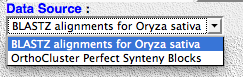</a>  

9\) Select the other data source and start browsing!  

<a href="File:Gbrowse_synEtfinit.png" class="image">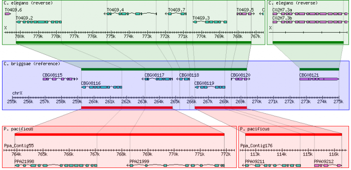</a>

  

## Mercator

MERCATOR facilitates whole-genome alignments using protein-coding exons
as anchors in the alignment procedure. It creates a map of the synteny
blocks among the genomes compared and can be used for pairwise or
multi-way alignments. The nucleotide sequence for the synteny blocks is
then aligned using alignment software (in this cased Mavid) This
exampled assumes the MERCATOR pipeline has already been run to produce
nucleotide alignment blocks. The results of MERCATOR include several
files and directories. The necessary folder for this procedure is the
alignments directory.

One advantage of MERCATOR is that it can also assemble Contigs into
"Ultracontigs" based on orthology data. For example:

The picture below shows a fragmentary nematode genome aligned with the
complete *C. elegans* genome using PECAN.
<a href="File:JaponicsPEACAN.png" class="image">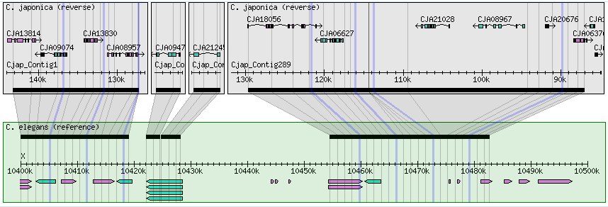</a>

The Picture below is the same genomic region aligned using a MERCATOR
pipeline. <a href="File:JaponicaMERCATOR.png" class="image">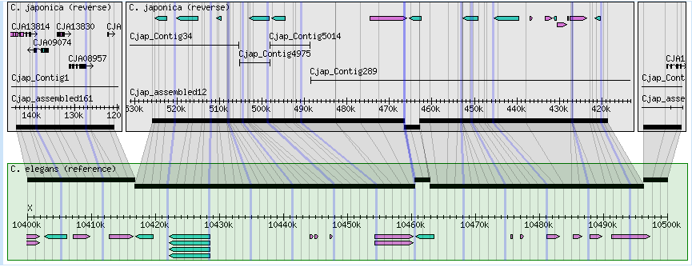</a>

  
Example data are taken from pairwise alignments for the species
*Drosophila yakuba* and *D. melanogaster* from the Web site
<a href="http://www.biostat.wisc.edu/∼cdewey/fly" class="external free"
rel="nofollow">http://www.biostat.wisc.edu/∼cdewey/fly</a> CAF1.

1\) Go to the sample data

    $ cd ~/Documents/Data/gbrowse_syn/
    $ tar zxf DroYak_CAF1-DroMel_CAF1.tar.gz

IN this case, DroYak_CAF1-DroMel_CAF is the alignments directory.

    $ \ls -1 DroYak_CAF1-DroMel_CAF
    1
    10
    100
    101
    102
    ---  truncated for display purposes
    94
    95
    96
    97
    98
    99
    genomes
    map
    treefile

There are 112 synteny blocks, one directory for each alignment named
"mavid.mfa". The alignments are converted to a format suitable for
loading:

    $ gbrowse_syn_mercatoraln_to_synhits.pl -d DroYak_CAF1-DroMel_CAF1 -a mavid.mfa >mercator.txt

These data are the result of a MERCATOR and MAVID alignment between
these two fly species. Although MAVID is used for the example data,
other DNA sequence alignment software could be used on the synteny
blocks identified by MERCATOR.

The file mercator.txt is in a tab delimited format designed for direct
loading into the GBrowse syn alignment (or joining) database. The format
has one tab-delimited record/line. Each line represents a synteny block,
or alignment, with 13 fields:

1.  Reference Species
2.  Reference Seqid
3.  Reference Start
4.  Reference End
5.  Reference Strand
6.  Reference Cigar-string (not used; reserved for future use)
7.  Target Species
8.  Target Seqid
9.  Target Start
10. Target End
11. Target Strand
12. Target Cigar-string (not used; reserved for future use)
13. Coordinate map (optional)

The coordinate map is used to save pair-wise nucleotide residue
coordinates for columns in the aligned sequences. It is not necessary to
store coordinates for every column. GBrowse syn usually uses multiples
of 10, typically 100. The purpose of storing the coordinate information
is to position grid lines in the graphical display that will make large
insertions and deletions in the sequences visible and intuitive.

**NOTE:** calculating the coordinate map is computationally intensive
and the script will take a long time to run for the whole genomes

Load the GBrowse syn alignment database with the script gbrowse_syn_load
alignment database.pl, which is preinstalled and can be run without
specifying the path.

\$ load alignment database.pl -u root -p gmod -d
mercator -v -c mercator.txt

## Further Reading

### Citation

McKay SJ, Vergara IA and Stajich, J. 2010. "Using the Generic Synteny
Browser (Gbrowse_syn)" in Current Protocols in Bioinformatics (Wiley
Interscience) doi: 10.1002/0471250953.bi0912s31

### A Note on Whole Genome Alignments

The focus of the section of the course is on dealing with alignment or
synteny data and using [GBrowse_syn](GBrowse_syn.1 "GBrowse syn").
However, how to generate whole genome alignments, identify orthologous
regions, etc, are the subject of considerable interest, so some
background reading is listed below:

- <a
  href="http://www.eecs.berkeley.edu/Pubs/TechRpts/2006/EECS-2006-104.html"
  class="external text" rel="nofollow">Primer on Hierarchical Genome
  Alignment Strategies</a>
- <a
  href="http://www.pubmedcentral.nih.gov/articlerender.fcgi?artid=2577869"
  class="external text" rel="nofollow">article on PECAN and ENREDO</a>
- <a href="http://www.ebi.ac.uk/~bjp/pecan/" class="external text"
  rel="nofollow">all about PECAN</a>
- The gene annotations for each species are in [GFF](GFF "GFF") files.
- The alignment data are in a [constrained CLUSTALW
  format](GBrowse_syn_Database#Clustal_alignment_format "GBrowse syn Database")
  (They were not generated by the program CLUSTALW, which is not
  necessarily suitable for whole genome alignments)
- There are processing steps for the alignment data but it is very
  computationally intensive and we will load pre-processed data to get a
  head start.

### Documentation

There is detailed documentation on the GMOD wiki for how to install,
configure and use GBrowse_syn. To get started, browse these pages:

- [GBrowse_syn overview](GBrowse_syn.1 "GBrowse syn")
- [Installation](GBrowse_syn.1#Installation "GBrowse syn")
- [Configuration](GBrowse_syn_Configuration "GBrowse syn Configuration")
- [Alignment Data](GBrowse_syn_Database "GBrowse syn Database")
- [The user interface](GBrowse_syn_Help "GBrowse syn Help")
- [Presentations and
  workshops](GBrowse_syn.1#Presentations_and_Workshops "GBrowse syn")

Retrieved from
"<http://gmod.org/mediawiki/index.php?title=GBrowse_syn_AGS_Tutorial&oldid=21877>"

[Categories](Special:Categories "Special:Categories"):

- [Tutorials](Category:Tutorials "Category:Tutorials")
- [GMOD Components](Category:GMOD_Components "Category:GMOD Components")
- [GBrowse syn](Category:GBrowse_syn "Category:GBrowse syn")

Facts about
"[GBrowse syn AGS
Tutorial](Special%3ABrowse/GBrowse-20syn-20AGS-20Tutorial "Special%3ABrowse/GBrowse-20syn-20AGS-20Tutorial")"[RDF
feed](http://gmod.org/wiki/Special:ExportRDF/GBrowse_syn_AGS_Tutorial "Special:ExportRDF/GBrowse syn AGS Tutorial")

|  |  |
|----|----|
| [Has topic](Property:Has_topic "Property:Has topic") | [GBrowse syn](GBrowse_syn.1 "GBrowse syn") [+](Special%3ASearchByProperty/Has-20topic/GBrowse-20syn "Special%3ASearchByProperty/Has-20topic/GBrowse-20syn") |

## Navigation menu

### Namespaces

- <a
  href="http://gmod.org/mediawiki/index.php?title=Talk:GBrowse_syn_AGS_Tutorial&amp;action=edit&amp;redlink=1"
  accesskey="t"
  title="Discussion about the content page [t]">Discussion</a>

### 

### Variants

### Navigation

- [GMOD Home](Main_Page)
- [Software](GMOD_Components)
- [Categories /
  Tags](Categories)

### Documentation

- [Overview](Overview)
- [FAQs](Category:FAQ)
- [HOWTOs](Category:HOWTO)
- [Glossary](Glossary)

### Community

- [GMOD News](GMOD_News)
- [Training /
  Outreach](Training_and_Outreach)
- [Support](Support)
- [GMOD Promotion](GMOD_Promotion)
- [Meetings](Meetings)
- [Calendar](Calendar)

### Tools

- <a href="Special%3ABrowse/GBrowse_syn_AGS_Tutorial"
  rel="smw-browse">Browse properties</a>

- Last updated at 20:52 on 3 October
  2012.
<!-- - 106,119 page views. -->
- Content is available under
  <a href="http://www.gnu.org/licenses/fdl-1.3.html" class="external"
  rel="nofollow">a GNU Free Documentation License</a> unless otherwise
  noted.

<!-- -->

- [About
  GMOD](GMOD:About "GMOD:About")

<!-- -->

