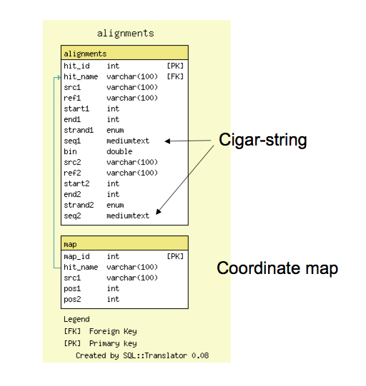

# GBrowse syn Database

From GMOD

Jump to: [navigation](#mw-navigation), [search](#p-search)

[GBrowse_syn](GBrowse_syn.1 "GBrowse syn") is a
[GBrowse](GBrowse.1 "GBrowse") based
<a href="Synteny" class="mw-redirect" title="Synteny">synteny</a>
viewer. This page describes the database that GBrowse_syn uses, and how
to get syntenic data into that database.

- Sample data and configuration files can be downloaded from the <a
  href="ftp://ftp.gmod.org/pub/gmod/Courses/2009/SummerSchoolEurope/rice.tar.bz2"
  class="external text" rel="nofollow">GMOD FTP site</a>; the sample
  data are for two rice species (courtesy of Bonnie Hurwitz)

  

## Contents

- [1 Example
  Alignment Data](#Example_Alignment_Data)
  - [1.1 Note on
    formats](#Note_on_formats)
  - [1.2 Note on
    the sequence ID syntax](#Note_on_the_sequence_ID_syntax)
- [2 Loading the
  alignment database](#Loading_the_alignment_database)
  - [2.1 Create a
    MySQL database](#Create_a_MySQL_database)
  - [2.2 Loading
    from multiple sequence
    alignments](#Loading_from_multiple_sequence_alignments)
  - [2.3 Loading
    from other sources](#Loading_from_other_sources)
    - [2.3.1 Data
      loading format](#Data_loading_format)
- [3 GBrowse_syn
  Database Schema](#GBrowse_syn_Database_Schema)

# Example Alignment Data

The sample below is in CLUSTALW format. Other formats are also supported
(see below).

**NOTE:** The sequence naming convention
"[species-seqid(strand)/start-end](#Note_on_the_sequence_ID_syntax)"
shown in the example below contains meta-data about the alignment that
is essential for the data to be loaded correctly with strand and
coordinate information

    CLUSTAL W(1.81) multiple sequence alignment

    c_briggsae-chrII(+)/43862-46313           ATGAGCTTCCACAAAAGCATGAGCTTTCTCAGCTTCTGCCACATCAGCATTCAAATGATC
    c_remanei-Crem_Contig172(-)/123228-124941 ATGAGCCTCTACAACCGCATGATTCTTTTCAGCCTCTGCCACGTCCGCATTCAAATGCTC
    c_brenneri-Cbre_Contig60(+)/627772-630087 ATGAGCCTCCACAACAGCATGATTTTTCTCGGCTTCCGCCACATCCGCATTCAAATGATC
    c_elegans-II(+)/9706834-9708803           ATGAGCCTCTACTACAGCATGATTCTTCTCAGCTTCTGCAACGTCAGCATTCAGATGATC
                                              ****** ** ** *  ******   ** ** ** ** ** ** ** ******* *** **

    c_briggsae-chrII(+)/43862-46313           CGCACAAATATGATGCACAAATCCACAACCTAAAGCATCTCCGATAACGTTGACCGAAGT
    c_remanei-Crem_Contig172(-)/123228-124941 AGCACAAATGTAATGAACGAATCCGCATCCCAACGCATCGCCAATCACATTCACAGATGT
    c_brenneri-Cbre_Contig60(+)/627772-630087 CGCACAAATGTAGTGGACAAATCCGCATCCCAAAGCGTCTCCGATAACATTTACCGAAGT
    c_elegans-II(+)/9706834-9708803           TGCACAAATGTGATGAACGAATCCACATCCCAATGCATCACCGATCACATTGACAGATGT
                                               ******** *  ** ** ***** ** ** ** ** ** ** ** ** ** ** ** **
    c_briggsae-chrII(+)/43862-46313           CCGGAGTCGATCCCTGAAT-----------------------------------------
    c_remanei-Crem_Contig172(-)/123228-124941 ACGAAGTCGGTCCCTATAAGGTATGATTTTATATGA----TGTACCATAAGGAAATAGTC
    c_brenneri-Cbre_Contig60(+)/627772-630087 ACGAAGTCGATCCCTGAAA---------TCAGATGAGCGGTTGACCA---GAGAACAACC
    c_elegans-II(+)/9706834-9708803           ACGAAGTCGGTCCCTGAAC--AATTATTT----TGA----TATA---GAAAGAAACGGTA
                                               ** ***** *****  *

## Note on formats

These example data are in clustalw format. The scripts used to process
these data will recognize clustalw and other commonly used formats
recognized by BioPerl's
<a href="http://www.bioperl.org/wiki/Module:Bio::AlignIO"
class="external text" rel="nofollow">AlignIO parser</a>. ***This does
not mean that clustalw is the program used to generate the alignment
data***.

- This particular alignment file in clustalw *format* was generated
  using a part of the <a
  href="http://feb2006.archive.ensembl.org/info/software/compara/compara_tutorial.html"
  class="external text" rel="nofollow">compara pipeline</a>.
- See <a
  href="https://www.nescent.org/wg/courses_gmod_09/images/c/cf/WGA_data.png"
  class="external text" rel="nofollow">this generalized hierarchical whole
  genome alignment workflow</a> for general information on how
  whole genome alignment data can be generated.

## Note on the sequence ID syntax

The sequence ID is this clustal file is overloaded to contain
information about the species, strand and coordinates. This information
is essential:

     rice-3(+)/16598648-16600199

The general format is species-refseq(strand)/start-end

species  
name of species, genome, strain, etc (string with no '-' characters)

sequence  
name of reference sequence (string with no '/' characters)

(strand)  
orientation of the alignment (relative to the reference sequence; + or
-)

start  
start coordinate of the alignment relative to the reference sequence
(integer)

end  
end coordinate of the alignment relative to the reference sequence
(integer)

Examples:

       c_elegans-I(+)/1..2300
       myco_bovis-chr1(-)/15000..25000

  

# Loading the alignment database

## Create a MySQL database

Before you load the database, make sure that a database of that name
already exists; if not, create one from scratch using the following
MySQL command:

    mysql -uroot -ppassword -e 'create database my_database'

  

## Loading from multiple sequence alignments

Multiple sequence alignments can be loaded directly into the GBrowse_syn
alignment database with the script
[load_alignments_msa.pl](GBrowse_syn_Scripts#load_alignments_msa.pl "GBrowse syn Scripts").
This script will process alignment data in a number of formats
recognized by BioPerl, such as CLUSTAL and FASTA. Note that these are
file formatting conventions used by a variety of different applications
and use of one of the formats that do not imply that a particular
program is the method of choice for generating your alignments. Whole
genome alignments for multiple species are generally more complex than
simple multiple sequence alignments with clustalw.

- More information on
  [load_alignments_msa.pl](GBrowse_syn_Scripts#load_alignments_msa.pl "GBrowse syn Scripts")
- See the GBrowse_syn page for more on [whole genome alignment
  approaches](GBrowse_syn.1#See_also "GBrowse syn")

  

## Loading from other sources

The script
[load_alignment_database.pl](GBrowse_syn_Scripts#load_alignment_database.pl "GBrowse syn Scripts")
can be used to load the alignment database from a tab-delimited
alignment data files (format described below). This format can either be
an intermediate for parsed alignment data or can be used for data that
does not come from multiple sequence alignments, for example gene
orthology data, defined regions of co-linearity, etc. The tab-delimited
format requires start and end coordinates for each reference sequence.
Any features that have start end and strand information can be used.

- More information on
  [load_alignment_database.pl](GBrowse_syn_Scripts#load_alignment_database.pl "GBrowse syn Scripts")

  

### Data loading format

A tab-delimited intermediate format that encodes the alignment
coordinates plus optional 1:1 mapping of coordinates within the
alignment (to facilitate accurate grid-lines in GBrowse_syn). Each
record is a single line (wrapped here for display only). Note that a
reciprocal alignment is also created during database loading.

    #species1       seqid1  start1   end1   strand1  reserved  species2      seqid2         start2   end2  strand2 reserved \
    # pos1-1  pos1-2  ...  posn-1  posn-2  |  pos1-2  pos1-1  ...  posn-2  posn-1
    c_briggsae      chrI    1583997 1590364 +       .       c_remanei       Crem_Contig24   631879  634679  -       .       \
    1584000 634676  1584100 634584  (truncated...)  |     631900  1590333 632000  1590233  (truncated ...)

  

# GBrowse_syn Database Schema

- The alignment database [schema](Glossary#Schema "Glossary") is very
  simple; it has a tables for all reciprocal 'hits,' or alignment
  features, and a table for (optional) 1:1 coordinate maps
- The alignments table contains coordinate information and also support
  cigar-line representations and the alignment to facilitate future
  reconstruction of the alignment within
  [GBrowse_syn](GBrowse_syn.1 "GBrowse syn").

  

Retrieved from
"<http://gmod.org/mediawiki/index.php?title=GBrowse_syn_Database&oldid=21064>"

[Categories](Special:Categories "Special:Categories"):

- [GBrowse syn](Category:GBrowse_syn "Category:GBrowse syn")
- [Documentation](Category:Documentation "Category:Documentation")

## Navigation menu

### Namespaces

- <a href="GBrowse_syn_Database" accesskey="c"
  title="View the content page [c]">Page</a>
- <a
  href="http://gmod.org/mediawiki/index.php?title=Talk:GBrowse_syn_Database&amp;action=edit&amp;redlink=1"
  accesskey="t"
  title="Discussion about the content page [t]">Discussion</a>

### 

### Variants

### Navigation

- [GMOD Home](Main_Page)
- [Software](GMOD_Components)
- [Categories /
  Tags](Categories)
- [View all pages](Special:AllPages)

### Documentation

- [Overview](Overview)
- [FAQs](Category:FAQ)
- [HOWTOs](Category:HOWTO)
- [Glossary](Glossary)

### Community

- [GMOD News](GMOD_News)
- [Training /
  Outreach](Training_and_Outreach)
- [Support](Support)
- [GMOD Promotion](GMOD_Promotion)
- [Meetings](Meetings)
- [Calendar](Calendar)

### Tools

- <a href="Special:Browse/GBrowse_syn_Database" rel="smw-browse">Browse
  properties</a>

- Last updated at 21:27 on 14 August
  2012.
<!-- - 149,303 page views. -->
- Content is available under
  <a href="http://www.gnu.org/licenses/fdl-1.3.html" class="external"
  rel="nofollow">a GNU Free Documentation License</a> unless otherwise
  noted.

<!-- -->

- [About
  GMOD](GMOD:About "GMOD:About")

<!-- -->

- 

