

# GBrowse syn Help

From GMOD

Jump to: [navigation](#mw-navigation), [search](#p-search)

[GBrowse_syn](GBrowse_syn.1 "GBrowse syn") is a
[GBrowse](GBrowse.1 "GBrowse") based
<a href="Synteny" class="mw-redirect" title="Synteny">synteny</a>
viewer. This page provides help on using GBrowse_syn. See the
[GBrowse_syn](GBrowse_syn.1 "GBrowse syn") page for other information on
GBrowse_syn.

## Contents

- [1 Search
  Section](#Search_Section)
  - [1.1
    Landmark](#Landmark)
  - [1.2 Reference
    Species](#Reference_Species)
  - [1.3 Aligned
    Species](#Aligned_Species)
  - [1.4 Data
    Source](#Data_Source)
  - [1.5 Display
    Mode](#Display_Mode)
- [2 Display
  Settings](#Display_Settings)
  - [2.1 Image
    Widths](#Image_Widths)
  - [2.2 Image
    Options](#Image_Options)
    - [2.2.1 Chain
      Alignments](#Chain_Alignments)
    - [2.2.2 Flip
      Minus Strand Panels](#Flip_Minus_Strand_Panels)
    - [2.2.3 Grid
      Lines](#Grid_Lines)
    - [2.2.4
      Edges](#Edges)
    - [2.2.5
      Shading](#Shading)

# Search Section

<a href="File:GBS_Search_Section.png" class="image">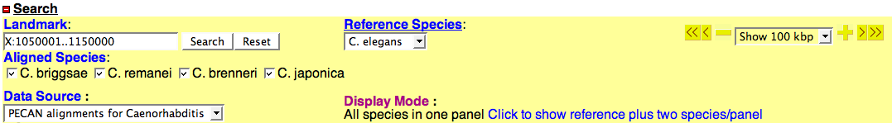</a>

## Landmark

<a href="File:GBS_Landmark.png" class="image">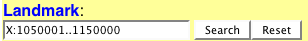</a>

- The landmark input box accepts segment labels in the form:

<!-- -->

    reference sequence:start..end

- In some cases, gene names and other landmarks can also be entered.
  Support for searching other classes depends on the configuration for
  the species' data source.
- Note, make sure you have selected the correct reference species before
  clicking the 'Search' button.

## Reference Species

- This is the species that occupies the center panel in the alignment
  display.
- Alignments for other species are shown with reference to this
  coordinate system.
- Select the species from the pull-down menu and check boxes (see below)
  to select which species should be aligned to the reference sequence.

## Aligned Species

<a href="File:GBS_aln_Species.png" class="image">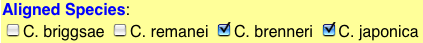</a>

- Configured species (except for the reference species) for the selected
  data source will be listed here.
- By checking each box, you indicate that alignments for this species,
  if available, should be displayed relative to the reference species.

## Data Source

<a href="File:GBS_Datasource.png" class="image">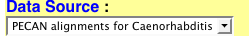</a>

- This pull-down menu lists all available data sets configured for the
  synteny browser.
- Each item in this list corresponds to a ***sourcename.synconf***
  configuration file.
- If only one data source is available this menu will not appear.

## Display Mode

<a href="File:GBS_Display_Mode1.png" class="image">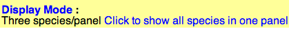</a>   <a href="File:GBS_Display_Mode2.png" class="image">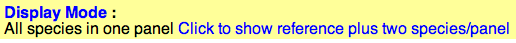</a>

- The default display mode shows the reference species plus two aligned
  species per panel and repeats the display panel as many times as
  required to display all aligned species relative to the reference
  species.
  - This mode is best suited to displaying all sequences on roughly the
    same scale.
- The other display mode is a summary view that shows all species in a
  single panel.
- The display mode can be toggled between expanded and compact by
  clicking the link shown above or via a pull-down menu on the "Display
  Settings" section

<a href="File:GBS_expanded.png" class="image">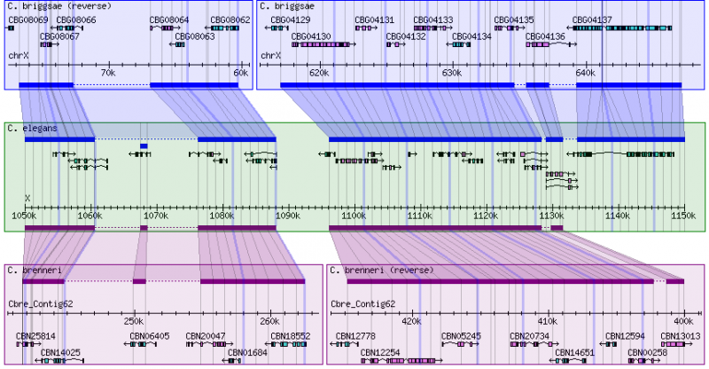</a>

Display mode: Refence species plus two aligned species/panel; repaeted
until all aligned species are shown

<a href="File:GBS_compact.png" class="image">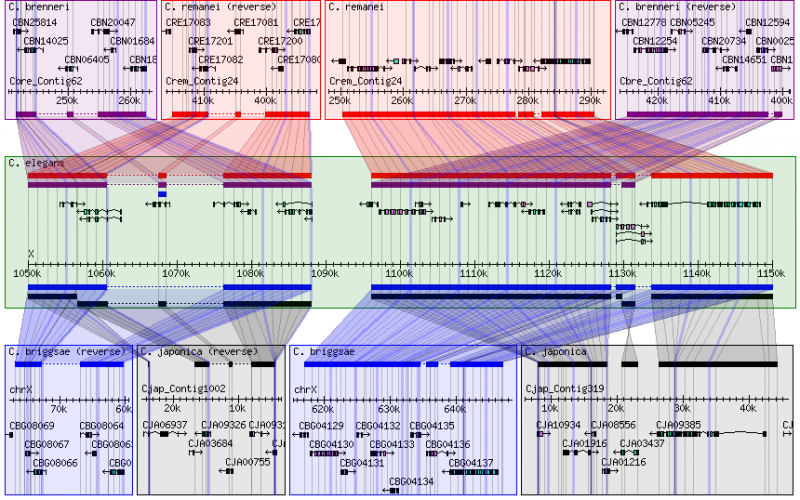</a>

Display mode: All species on a single panel

  

# Display Settings

<a href="File:GBS_Display_Settings.png" class="image">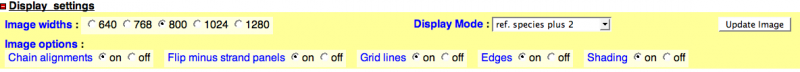</a>

## Image Widths

- the total width of the displayed reference sequence panel.

## Image Options

### Chain Alignments

<a href="File:GBS_chain.png" class="image">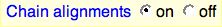</a>

- GBrowse_syn uses a dynamic programming algorithm to assembled aligned
  regions into chains.
  - If alignments are on the same strand on the same reference sequence
    and their coordinates increase (or decrease) monotonically, they are
    assembled into a meta-alignment, which is indicated by dashed
    connectors.
  - Chained alignments may have other alignments in the intervening
    gaps.
- This feature is useful for displaying small rearrangements, such as
  translocations, nested inversions, etc.

<a href="File:GBS_chained.png" class="image">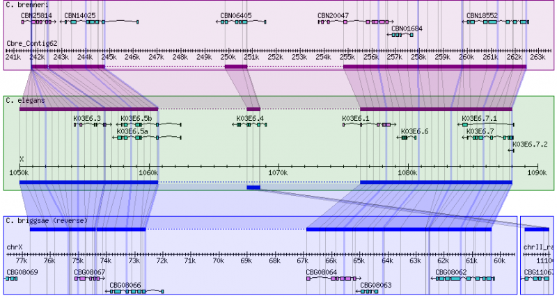</a>

Chained aligments

  
<a href="File:GBS_nochain.png" class="image">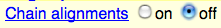</a>

<a href="File:GBS_unchained.png" class="image">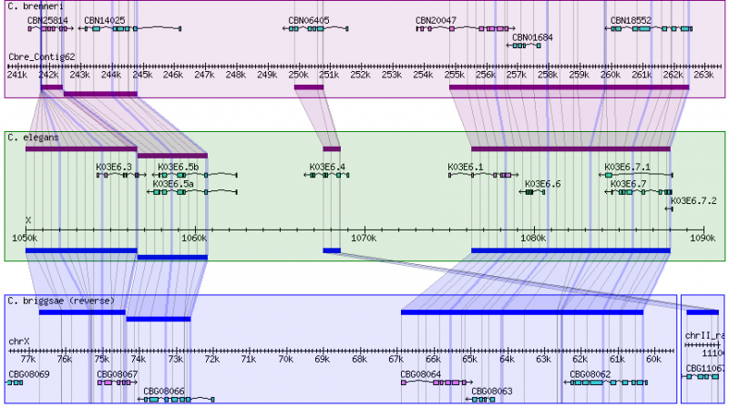</a>

Unchained aligments

  

### Flip Minus Strand Panels

<a href="File:GBS_flip.png" class="image">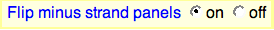</a>

- Choosing the flip option makes it easier directly compare the aligned
  regions.
- Otherwise, in alignments is on the negative strand, relative to the
  reference, the grid lines and shaded polygon will cross-over to
  indicate inversion
- Unless the flip option is turned off, the decision to flip a panel is
  determined by the number of (+) vs (-) aligned base pairs.

<a href="File:GBS_flipped.png" class="image">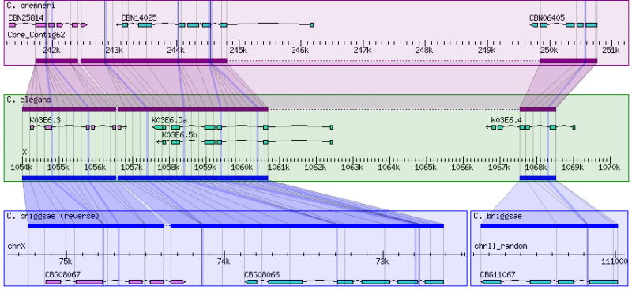</a>

Reverse strand panel (*C. briggsae*) flipped to facilitate direct
comparison of gene order

<a href="File:GBS_unflipped.png" class="image">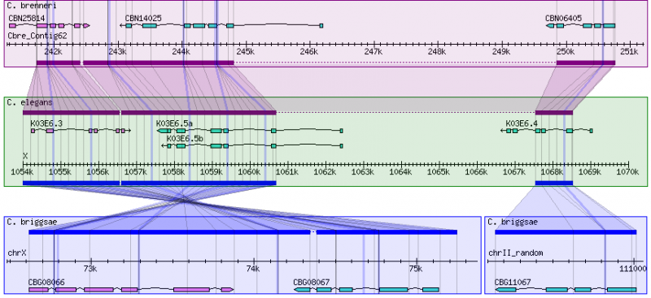</a>

Reverse strand panel keo in original orientation

  

### Grid Lines

<a href="File:GBS_lines.png" class="image">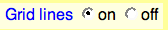</a>

- Grid lines use insertion/deletion data from the multiple sequence
  alignments to provide a visual representation of sequence loss or gain
- This feature is useful because it provides fine-grained information
  about the underlying sequence changes within aligned regions.
- Every fifth line is thicker to provide a visual cue help trace the
  lines between species.

<a href="File:GBS_noglines.png" class="image">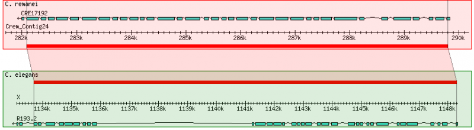</a>

Alignment of *C. elegans* and *C. remanei*, showing the R193.2 gene

<a href="File:GBS_glines.png" class="image">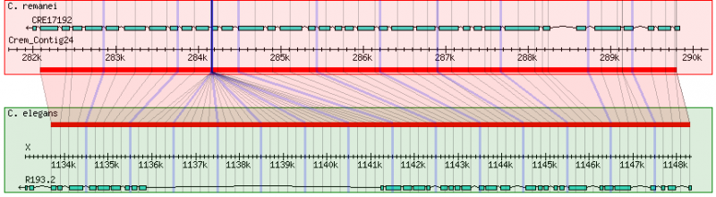</a>

The same alignment with grid-lines turned on. Note the large gain/loss
of intron sequence

  

### Edges

<a href="File:GBS_edges.png" class="image">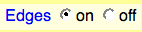</a>

- This option is on by default, it outlines the polygons that connect
  aligned blocks

<a href="File:GBS_edgeson.png" class="image">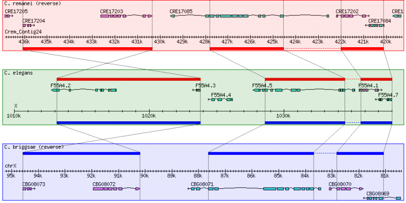</a>

An alignment view with edges on grid-lines and shading off

  

### Shading

<a href="File:GBS_shading.png" class="image">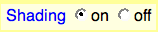</a>

<a href="File:GBS_shadingon.png" class="image">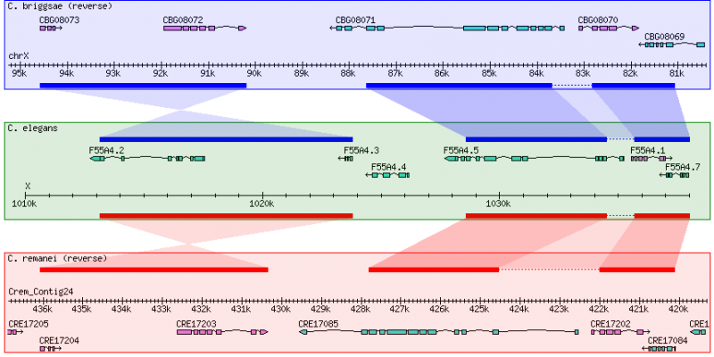</a>

An alignment view with shading on and grid-lines and edges off

  

Retrieved from
"<http://gmod.org/mediawiki/index.php?title=GBrowse_syn_Help&oldid=9100>"

[Category](Special:Categories "Special:Categories"):

- [GBrowse syn](Category:GBrowse_syn "Category:GBrowse syn")

## Navigation menu

### Namespaces

- <a href="GBrowse_syn_Help" accesskey="c"
  title="View the content page [c]">Page</a>
- <a
  href="http://gmod.org/mediawiki/index.php?title=Talk:GBrowse_syn_Help&amp;action=edit&amp;redlink=1"
  accesskey="t"
  title="Discussion about the content page [t]">Discussion</a>

### 

### Variants

### Navigation

- [GMOD Home](Main_Page)
- [Software](GMOD_Components)
- [Categories /
  Tags](Categories)
- [View all pages](Special:AllPages)

### Documentation

- [Overview](Overview)
- [FAQs](Category:FAQ)
- [HOWTOs](Category:HOWTO)
- [Glossary](Glossary)

### Community

- [GMOD News](GMOD_News)
- [Training /
  Outreach](Training_and_Outreach)
- [Support](Support)
- [GMOD Promotion](GMOD_Promotion)
- [Meetings](Meetings)
- [Calendar](Calendar)

### Tools

- <a href="Special:Browse/GBrowse_syn_Help" rel="smw-browse">Browse
  properties</a>
- [Print as
  PDF](http://gmod.org/mediawiki/index.php?title=Special:PdfPrint&page=GBrowse_syn_Help)

- Last updated at 12:40 on 22 August
  2009.
<!-- - 163,154 page views. -->
- Content is available under
  <a href="http://www.gnu.org/licenses/fdl-1.3.html" class="external"
  rel="nofollow">a GNU Free Documentation License</a> unless otherwise
  noted.

<!-- -->

- [About
  GMOD](GMOD:About "GMOD:About")

<!-- -->

- 

