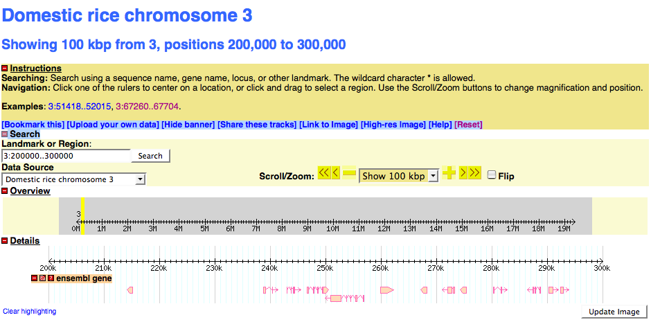
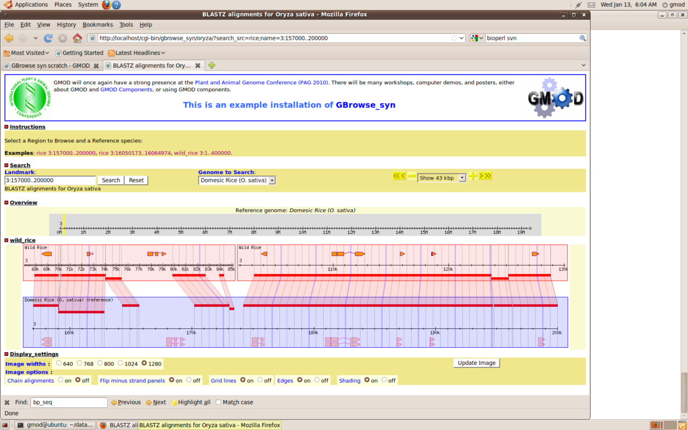

# GBrowse syn PAG tutorial

From GMOD

Jump to: [navigation](#mw-navigation), [search](#p-search)

  

This [tutorial](Category%3ATutorials "Category%3ATutorials") walks you
through how to install and configure the
[GBrowse_syn](GBrowse_syn.1 "GBrowse syn") comparative genomics viewer.
This tutorial was originally taught by [Sheldon
McKay](User%3AMckays "User%3AMckays") at the 2009 [GMOD
Schools](GMOD_Schools "GMOD Schools") -
[Europe](2009_GMOD_Summer_School_-_Europe "2009 GMOD Summer School - Europe")
&
[Americas](2009_GMOD_Summer_School_-_Americas "2009 GMOD Summer School - Americas").
The notes and [VMware image](#VMware) used on this page are from the
Europe course.

  

## Contents

- [1
  VMware](#VMware)
- [2
  Caveats](#Caveats)
- [3 The Generic
  Synteny Browser](#The_Generic_Synteny_Browser)
  - [3.1
    Gbrowse_syn
    Introduction](#Gbrowse_syn_Introduction)
  - [3.2
    GBrowse_syn
    Documentation](#GBrowse_syn_Documentation)
  - [3.3 Whole
    Genome Alignments](#Whole_Genome_Alignments)
- [4 Installing
  GBrowse_syn](#Installing_GBrowse_syn)
- [5 Installing
  Gbrowse_syn](#Installing_Gbrowse_syn_2)
- [6 Configuration
  of GBrowse_syn](#Configuration_of_GBrowse_syn)
  - [6.1 Create a
    MySQL database](#Create_a_MySQL_database)
  - [6.2 Loading
    the alignment data](#Loading_the_alignment_data)
    - [6.2.1 The
      alignment data file](#The_alignment_data_file)
      - [6.2.1.1
        **Note on
        CLUSTALW**](#Note_on_CLUSTALW)
      - [6.2.1.2
        Note on the sequence ID
        syntax](#Note_on_the_sequence_ID_syntax)
    - [6.2.2 The
      database loading script](#The_database_loading_script)
      - [6.2.2.1
        Running in the background with the linux
        *screen*
        command](#Running_in_the_background_with_the_linux_screen_command)
  - [6.3 Setting up
    the species' databases](#Setting_up_the_species.27_databases)
    - [6.3.1
      GFF3](#GFF3)
    - [6.3.2
      Loading](#Loading)
  - [6.4 Setting up
    the Configuration Files](#Setting_up_the_Configuration_Files)
  - [6.5 A Species
    Config File](#A_Species_Config_File)
  - [6.6 The
    GBrowse_syn Config File](#The_GBrowse_syn_Config_File)
  - [6.7 Testing
    the rice and wild_rice data sources in
    GBrowse](#Testing_the_rice_and_wild_rice_data_sources_in_GBrowse)
  - [6.8 Viewing
    the data in GBrowse_syn](#Viewing_the_data_in_GBrowse_syn)
- [7 Optional
  Advanced Section](#Optional_Advanced_Section)

  

# VMware

<table>
<colgroup>
<col style="width: 50%" />
<col style="width: 50%" />
</colgroup>
<tbody>
<tr class="odd">
<td data-valign="top">This tutorial was taught using a <a
href="http://gmod.org/mediawiki/index.php?title=VMware&amp;action=edit&amp;redlink=1"
class="new" title="VMware (page does not exist)">VMware</a> system image
as a starting point. If you want to start with that same system,
download and install the <em>Starting</em> image.

<em><strong>See <a
href="http://gmod.org/mediawiki/index.php?title=VMware&amp;action=edit&amp;redlink=1"
class="new" title="VMware (page does not exist)">VMware</a> for what
software you need to use a VMware system image, and for directions on
how to get the image setup and running on your
machine.</strong></em>
</td>
<td><table class="wikitable" style="margin-left: 1em; margin-top: 0;">
<thead>
<tr class="header">
<th>Download Links will be added here</th>
</tr>
</thead>
&#10;</table></td>
</tr>
</tbody>
</table>

# Caveats

**Important Note**

This [tutorial](Category%3ATutorials "Category%3ATutorials") describes the
world as it existed on the day the tutorial was given. Please be aware
that things like CPAN modules, Java libraries, and Linux packages change
over time, and that the instructions in the tutorial will slowly drift
over time. Newer versions of tutorials will be posted as they become
available.

# The Generic Synteny Browser

GBrowse_syn, as implemented at WormBase

[GBrowse_syn](GBrowse_syn.1 "GBrowse syn"), or the Generic Synteny
Browser, is a [GBrowse](GBrowse.1 "GBrowse")-based
<a href="Synteny" class="mw-redirect" title="Synteny">synteny</a>
browser designed to display multiple genomes, with a central reference
species compared to two or more additional species.  It can be used to
view multiple sequence alignment data, synteny or co-linearity data from
other sources against genome annotations provided by GBrowse.
GBrowse_syn is included with the standard GBrowse package (version 1.69
and later).  Working examples can be seen at <a
href="http://www.arabidopsis.org/cgi-bin/gbrowse_syn/arabidopsis/?name=Chr1%3A8367000..8370501"
class="external text" rel="nofollow">TAIR</a>, <a
href="http://dev.wormbase.org/db/seq/gbrowse_syn/compara?search_src=Cele;name=X:1050001..1150000"
class="external text" rel="nofollow">WormBase</a>, and
<a href="http://solgenomics.net/gbrowse2/bin/gbrowse_syn/sol3/"
class="external text" rel="nofollow">SGN</a>.

## Gbrowse_syn Introduction

- <a href="../mediawiki/images/0/0a/GBS_PAG10.pdf" class="internal"
  title="GBS PAG10.pdf">View introductory presentation in GBrowse_syn</a>
- It would be a good idea to download or acquire the sample data during
  the above presentation.

## GBrowse_syn Documentation

There is detailed documentation on the GMOD wiki for how to install,
configure and use GBrowse_syn. To get started, browse these pages:

- [GBrowse_syn
  overview](GBrowse_syn.1 "GBrowse syn")
- [Installation](GBrowse_syn.1#Installation "GBrowse syn")
- [Configuration](GBrowse_syn_Configuration "GBrowse syn Configuration")
- [Alignment
  Data](GBrowse_syn_Database "GBrowse syn Database")
- [The user
  interface](GBrowse_syn_Help "GBrowse syn Help")
- [Presentations and
  workshops](GBrowse_syn.1#Presentations_and_Workshops "GBrowse syn")

## Whole Genome Alignments

The focus of the section of the course is on dealing with alignment or
synteny data and using GBrowse_syn. However, how to generate whole
genome alignments, identify orthologous regions, etc, are the subject of
considerable interest, so some background reading is listed below:

- <a
  href="http://www.eecs.berkeley.edu/Pubs/TechRpts/2006/EECS-2006-104.html"
  class="external text" rel="nofollow">Primer on Hierarchical Genome
  Alignment Strategies</a>
- <a
  href="http://www.pubmedcentral.nih.gov/articlerender.fcgi?artid=2577869"
  class="external text" rel="nofollow">article on PECAN and ENREDO</a>
- <a href="http://www.ebi.ac.uk/~bjp/pecan/" class="external text"
  rel="nofollow">all about PECAN</a>
- The gene annotations for each species are in GFF files.
- The alignment data are in a
  <a href="GBrowse_syn_Database#Clustal_alignment_format"
  class="external text" rel="nofollow">constrained CLUSTALW format</a>
  (They were not generated by the program CLUSTALW, which is not
  necessarily suitable for whole genome alignments)
- There are processing steps for the alignment data but it is very
  computationally intensive and we may load pre-processed data to get a
  head start.

# Installing GBrowse_syn

[GBrowse_syn](GBrowse_syn.1 "GBrowse syn") is
part of the [GBrowse](GBrowse.1 "GBrowse")
package and was pre-installed when you went through the GBrowse
installation.

# Installing Gbrowse_syn

This is the same as installing GBrowse, most of the prerequisites are
loaded. We will use the script gbrowse_netinstall.pl to load
bioperl-live, Gbrowse 1.7 and Bio::Graphics.

    $ cd ~/build
    $ sudo perl gbrowse_netinstall.pl -d

NOTE: the -d flag is essential to get the latest code.

# Configuration of GBrowse_syn

The example we will use is a two-species comparison of rice (*Oryza
sativa*) and one of its wild relatives\*

*\*Data courtesy of Bonnie Hurwitz; sequences and names have been
obfuscated to protect unpublished data*

The instructions for downloading these data to the Ubuntu virtual disk:

    $ tar xjvf gbrowse_syn_PAG.tar.bz2
    $ cd ~/data/gbrowse_syn

## Create a MySQL database

- GBrowse_syn uses a "joining" database to store all of the alignment
  data

<!-- -->

- The first thing we need to do is create a
  [MySQL](MySQL "MySQL") alignment database
  using the command-line incantation below:

<!-- -->

    $ mysql -uroot -e 'create database rice_synteny'

- Then make sure the web user "nobody" can read the database. Pay
  special attention to the quotes!

<!-- -->

    $ mysql -uroot -e "GRANT SELECT on rice_synteny.* to 'nobody'@'localhost'"

## Loading the alignment data

### The alignment data file

Have a look at the input data in clustalw format:

     $ cd ~/data/gbrowse_syn/rice
     $ more data/rice.aln

    CLUSTAL W(1.81) multiple sequence alignment W(1.81)

    rice-3(+)/16598648-16600199      ggaggccggccgtctgccatgcgtgagccagacggggcgggccggagacaggccacgtgg
    wild_rice-3(+)/14467855-14469373 gggggccgg------------------------------------agacaggccacgtgg
                                     ** ******                                    ***************

    rice-3(+)/16598648-16600199      ccctgccccgggctgttgacccactggcacccctgtcccgggttgtcgccctcctttccc
    wild_rice-3(+)/14467855-14469373 ccctgccccgggctgttgacccactggcacccctgtcccgggttgtcgccctcctttccc
                                     ************************************************************

    rice-3(+)/16598648-16600199      cgccatgctctaagtttgctcctcttctcgaacttctctctttgattcttcacgtcctct
    wild_rice-3(+)/14467855-14469373 cgccatgctctaagtttgctcctcttctcgaacttctctctttgattcttcacgtcctct
                                     ************************************************************

    rice-3(+)/16598648-16600199      tggagcctccccttctagctcgatcacgctctgctcttccgcttggaggctggcaaaact
    wild_rice-3(+)/14467855-14469373 tggagcctccccttctagctcgatcgcgctctgctcttccgcttggaggctggcaaaact
                                     ************************* **********************************

#### **Note on CLUSTALW**

These data are in clustalw format. The scripts used to process these
data will recognize clustalw and other commonly used formats recognized
by BioPerl's
<a href="http://search.cpan.org/~birney/bioperl-1.2.3/Bio/AlignIO.pm"
class="external text" rel="nofollow">AlignIO parser</a>. ***This does
not mean that clustalw is the actual program used to generate the
alignment data***.

- These particular alignment file in clustalw *format* was generated
  using a part of the <a
  href="http://feb2006.archive.ensembl.org/info/software/compara/compara_tutorial.html"
  class="external text" rel="nofollow">compara pipeline</a>.
- See
  <a href="../mediawiki/images/c/cf/WGA_data.png" class="internal"
  title="WGA data.png">this generalized hierarchical whole genome
  alignment workflow</a> for general information on how whole
  genome alignment data ca be generated.

#### Note on the sequence ID syntax

The sequence ID is this clustal file is overloaded to contain
information about the species, strand and coordinates. This information
is essential:

     rice-3(+)/16598648-16600199
     speciesv-refseq(strand)/start-end

### The database loading script

Then, we will load the database.

- We will use the loading script
  <a
  href="http://gmod.svn.sourceforge.net/viewvc/gmod/Generic-Genome-Browser/branches/stable/bin/gbrowse_syn/load_alignments_msa.pl"
  class="external text" rel="nofollow">load_alignments_msa.pl</a>, which
  will accept clustalw as an input format.

<!-- -->

    we are using the options:
    -u root          -- username is root
    -d rice_synteny  -- use database rice_synteny
    -f clustalw      -- use clustalw format
    -c               -- initialize a new (or overwrite the old) database
    -v               -- print information about what is happening

    other available options that we do not need here:
    -p password      -- not used because the root user has no password
                        in this implementation
    -n               -- do not calculate map coordinates (faster)

  
We will be running the script with this command line incantation (see
below):

    $ ../bin/load_alignments_msa.pl -u root -d rice_synteny -format clustalw -v data/rice.aln

#### Running in the background with the linux *screen* command

**Using screen:** Running the script as we are below is time-consuming,
so we will use a screen session to run it in the background while we
turn our attention to downstream tasks. 
\[<a
href="http://www.rackaid.com/resources/linux-tutorials/general-tutorials/using-screen/"
class="external text" rel="nofollow">more information on 'screen'...</a>\]

- When entering screen mode, hit 'space' to clear the first screen if a
  message appears.
- If your backspace key does not work in screen mode, use ^H (ctrl key +
  H key).

<!-- -->

    gmod@ubuntu:~/data/gbrowse_syn/rice/data$ screen -S load1
    gmod@ubuntu:~/data/gbrowse_syn/rice/data$ ~/data/gbrowse_syn/bin/load_alignments_msa.pl -u root -d rice_synteny -format clustalw -v rice.aln -c
    Processing alignment file rice.aln...
    Processing Multiple Sequence Alignment 1 (length 1557)
    Processing Multiple Sequence Alignment 2 (length 11275)
    Processing Multiple Sequence Alignment 3 (length 3526)
    Processing Multiple Sequence Alignment 4 (length 5992)
    Processing Multiple Sequence Alignment 5 (length 24267)
    Processing Multiple Sequence Alignment 6 (length 697)
    Processing Multiple Sequence Alignment 7 (length 6798)
    Processing Multiple Sequence Alignment 8 (length 4760)
    Processing Multiple Sequence Alignment 9 (length 4595)
    Processing Multiple Sequence Alignment 10 (length 95)
    Processing Multiple Sequence Alignment 11 (length 479)
    Processing Multiple Sequence Alignment 12 (length 9123)
    Processing Multiple Sequence Alignment 13 (length 80)
    Processing Multiple Sequence Alignment 14 (length 11864)
    Processing Multiple Sequence Alignment 15 (length 775)
    etc...

- This will go on for some time (there are 1800 alignments), so we will
  let the screen run in the background and work on our other tasks. We
  do this like so:

1.  hit ^A (ctrl key + A key), then release
2.  hit the D key, which will detach the screen (continues to run in the
    background)

- We can check back later like so:

<!-- -->

    $ screen -r load1

- If the job is done, we can exit the session by typing 'exit' at the
  command prompt.

## Setting up the species' databases

### [GFF3](GFF3 "GFF3")

- Each of the species' databases will be installed in
  [MySQL](MySQL "MySQL") using the
  <a href="Gbrowse.1#About_Databases" class="external text"
  rel="nofollow">Bio::DB::SeqFeature::Store</a> adapter for
  <a href="http://www.sequenceontology.org/gff3.shtml"
  class="external text" rel="nofollow">GFF3</a>

Let's have a look at the GFF3 data:

    $ more rice.gff3
    ##gff-version 3
    ##sequence-region 3 1 19401704
    3       ensembl gene    78      1849    .       -       .       ID=3_FG2548;Name=3_FG2548;biotype=protein_coding
    3       ensembl mRNA    78      1849    .       -       .       ID=3_FGT2548;Parent=3_FG2548;Name=3_FGT2548;biotype=protein_coding
    3       ensembl CDS     1645    1849    .       -       0       Parent=3_FGT2548;Name=CDS.12
    3       ensembl CDS     1444    1547    .       -       1       Parent=3_FGT2548;Name=CDS.13
    3       ensembl CDS     999     1144    .       -       0       Parent=3_FGT2548;Name=CDS.14
    3       ensembl CDS     799     913     .       -       2       Parent=3_FGT2548;Name=CDS.15
    3       ensembl CDS     646     786     .       -       0       Parent=3_FGT2548;Name=CDS.16
    3       ensembl CDS     78      215     .       -       0       Parent=3_FGT2548;Name=CDS.17
    3       ensembl gene    4910    5518    .       +       .       ID=3_FG2546;Name=3_FG2546;biotype=protein_coding
    3       ensembl mRNA    4910    5518    .       +       .       ID=3_FGT2546;Parent=3_FG2546;Name=3_FGT2546;biotype=protein_coding
    3       ensembl CDS     4910    5518    .       +       0       Parent=3_FGT2546;Name=CDS.19
    3       ensembl gene    5743    6351    .       -       .       ID=3_FG2565;Name=3_FG2565;biotype=protein_coding
    3       ensembl mRNA    5743    6351    .       -       .       ID=3_FGT2565;Parent=3_FG2565;Name=3_FGT2565;biotype=protein_coding
    3       ensembl CDS     5743    6351    .       -       0       Parent=3_FGT2565;Name=CDS.21
    3       ensembl gene    10979   16914   .       +       .       ID=3_FG2570;Name=3_FG2570;biotype=protein_coding
    3       ensembl mRNA    10979   16914   .       +       .       ID=3_FGT2570;Parent=3_FG2570;Name=3_FGT2570;biotype=protein_coding
    3       ensembl CDS     10979   11592   .       +       0       Parent=3_FGT2570;Name=CDS.29
    3       ensembl CDS     11670   13317   .       +       2       Parent=3_FGT2570;Name=CDS.30
    3       ensembl CDS     13390   14204   .       +       0       Parent=3_FGT2570;Name=CDS.31
    3       ensembl CDS     14433   16914   .       +       2       Parent=3_FGT2570;Name=CDS.32

Some key things to note:

The \##sequence-region directive   
is used to create a reference sequence named 3, which is the scaffold on
which all of the other features in the file are located

The 'gene' features   
are the top-level parent featured. The 'mRNA' and 'CDS' features are
children of the gene. The containement hierarchy is organized using the
'Parent' tag. The CDSs are children of the mRNA, which is in turn a
child of the gene. For display purposes, we only need to worry about the
gene.

### Loading

- Loading the [GFF3](GFF3 "GFF3") into the
  [MySQL](MySQL "MySQL") database is the same
  procedure that is used for loading GFF3 databases for
  [GBrowse](GBrowse.1 "GBrowse").
- It uses the bioperl script
  [`bp_seqfeature_load.pl`](GBrowse_Install_HOWTO#GFF3_Loading "GBrowse Install HOWTO").

**Note:** before we load the GFF3 databases, we need to create a
database for each species and give the web user 'nobody' read
privileges. Let's create a little SQL script to make this easier:

- This is just a list of SQL commands that give instructions to the
  mysql database manager, which we can pass via STDIN
- create a file create_species_dbs.sql with the contents below.

<!-- -->

    CREATE DATABASE rice;
    CREATE DATABASE wild_rice;
    GRANT SELECT on rice.* TO 'nobody'@'localhost';
    GRANT SELECT on wild_rice.* TO 'nobody'@'localhost';

- Then we can run the commands like so:

<!-- -->

    gmod@ubuntu:~/data/gbrowse_syn/rice/data$ mysql -uroot <create_species_dbs.sql

- Make sure we are in the location of the GFF data files

<!-- -->

    $ cd ~/data/gbrowse_syn/rice/data

- The script we need is bp_seqfeature_load.pl, which come pre-installed
  with bioperl-live
- The `-f` options means "fast load"
- The `-c` option means complete (or destructive) load. It would
  overwrite previously loaded 'rice' databases

Load the rice data...

    gmod@ubuntu:~/data/gbrowse_syn/rice/data$ bp_seqfeature_load.pl -u root -d rice -c -f rice.gff3
    loading rice.gff3...
    Building object tree... 0.53s4s
    Loading bulk data into database... 0.65s
    load time: 11.74s

and repeat for wild rice...

    gmod@ubuntu:~/data/gbrowse_syn/rice/data$ bp_seqfeature_load.pl -u root -d wild_rice -c -f wild_rice.gff3
    loading wild_rice.gff3...
    Building object tree... 0.55s7s
    Loading bulk data into database... 0.66s
    load time: 11.98s

- The alignment database loading should also be done by now, we can
  check like so:

<!-- -->

    gmod@ubuntu:~/data/gbrowse_syn/rice/data$screen -r load1

## Setting up the Configuration Files

Copy the configuration file to the installation directory. Note that you
will need root privileges to do this.

Change to the conf directory and make sure we have the files...

    gmod@ubuntu:~/data/gbrowse_syn/rice/conf$ cd ../conf
    gmod@ubuntu:~/data/gbrowse_syn/rice/conf$ ls
    header.txt  oryza.synconf  rice_synteny.conf  wild_rice_synteny.conf
    <pre>

    * The default configuration location for Ubuntu Linux is /etc/apache2/gbrowse.conf, copy the files there

    gmod@ubuntu:~/data/gbrowse_syn/rice/conf$ sudo cp *conf /etc/apache2/gbrowse.conf
    [sudo] password for gmod:

## A Species Config File

File: rice_synteny.conf

    [GENERAL]
    description   = Domestic rice chromosome 3
    db_adaptor    = Bio::DB::SeqFeature::Store
    db_args       = -adaptor DBI::mysql
                         -dsn     dbi:mysql:rice;host=localhost
                         -user    nobody

    # examples to show in the introduction
    examples = 3:51418..52015
               3:67260..67704

    # what image widths to offer
    image widths  = 450 640 800 1024

    # default width of detailed view (pixels)
    default width = 1024

    initial landmark = 3:200000..300000

    # Web site configuration info
    stylesheet  = /gbrowse/gbrowse.css
    buttons     = /gbrowse/images/buttons
    tmpimages   = /gbrowse/tmp

    # max and default segment sizes for detailed view
    max segment      = 5000000
    default segment  = 5000

    # zoom levels
    zoom levels      = 50 100 200 1000 2000 5000 10000 20000 40000 50000 100000 500000 1000000 5000000

    # colors of the overview, detailed map and key
    overview bgcolor = lightgrey
    detailed bgcolor = lightgoldenrodyellow
    key bgcolor      = beige
    default features = EG
    balloon tips     = 1

    [TRACK DEFAULTS]
    glyph         = generic
    height        = 10
    bgcolor       = lightgrey
    fgcolor       = black
    font2color    = blue
    label density = 25
    link          = AUTO
    link_target   = _blank
    title         = Hello, my name is $name!

    ################## TRACK CONFIGURATION ####################
    # the remainder of the sections configure individual tracks
    ###########################################################

    [EG]
    feature      = gene:ensembl
    glyph        = gene
    height       = 10
    bgcolor      = peachpuff
    fgcolor      = hotpink
    description  = 0
    label        = 0
    category     = Transcripts
    key          = ensembl gene

## The GBrowse_syn Config File

File: oryza.synconf

    #include header.txt

    # example searches to display
    examples = rice 3:157000..200000
               rice 3:16050173..16064974
               wild_rice 3:1..400000

    zoom levels = 5000 10000 25000 50000 100000 200000 400000

    # species-specific databases
    [rice_synteny]
    tracks    = EG
    color     = blue

    [wild_rice_synteny]
    tracks    = EG
    color     = red
    #Note the include statement below.
    #include header.txt

    # example searches to display
    examples = rice 3:157000..200000
               rice 3:16050173..16064974
               wild_rice 3:1..400000

    zoom levels = 5000 10000 25000 50000 100000 200000 400000

    # species-specific databases
    [rice_synteny]
    tracks    = EG
    color     = blue

    [wild_rice_synteny]
    tracks    = EG
    color     = red

This should complete the installation. Time to test it out...

## Testing the rice and wild_rice data sources in [GBrowse](GBrowse.1 "GBrowse")

- If things have worked out, you should see something like the image
  below when you point you browser to:

<!-- -->

    http://localhost/cgi-bin/gbrowse/rice

Note you will use 'localhost' if you are running your browser within the
[VMware](#VMware) player.

## Viewing the data in GBrowse_syn

- Cross you fingers

<!-- -->

    http://localhost/cgi-bin/gbrowse_syn/oryza

  

# Optional Advanced Section

We will setup up a five-genome database if time permits.

Retrieved from
"<http://gmod.org/mediawiki/index.php?title=GBrowse_syn_PAG_tutorial&oldid=21971>"

## Navigation menu

### Namespaces

- <a
  href="http://gmod.org/mediawiki/index.php?title=Talk%3AGBrowse_syn_PAG_tutorial&amp;action=edit&amp;redlink=1"
  accesskey="t"
  title="Discussion about the content page [t]">Discussion</a>

### 

### Variants

### Navigation

- [GMOD Home](Main_Page)
- [Software](GMOD_Components)
- [Categories /
  Tags](Categories)

### Documentation

- [Overview](Overview)
- [FAQs](Category%3AFAQ)
- [HOWTOs](Category%3AHOWTO)
- [Glossary](Glossary)

### Community

- [GMOD News](GMOD_News)
- [Training /
  Outreach](Training_and_Outreach)
- [Support](Support)
- [GMOD Promotion](GMOD_Promotion)
- [Meetings](Meetings)
- [Calendar](Calendar)

### Tools

- <a href="Special%3ABrowse/GBrowse_syn_PAG_tutorial"
  rel="smw-browse">Browse properties</a>

- Last updated at 18:53 on 8 October
  2012.
<!-- - 42,788 page views. -->
- Content is available under
  <a href="http://www.gnu.org/licenses/fdl-1.3.html" class="external"
  rel="nofollow">a GNU Free Documentation License</a> unless otherwise
  noted.

<!-- -->

- [About
  GMOD](GMOD%3AAbout "GMOD%3AAbout")

<!-- -->

