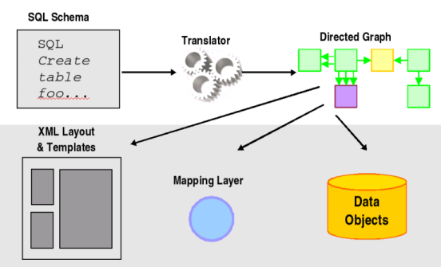

# GMODWeb

From GMOD

Jump to: [navigation](#mw-navigation), [search](#p-search)

> The item described in this page is not (or is no longer) supported by
> the GMOD project.  
> This page is included only for reference purposes.

GMODWeb is a Web application that uses
<a href="Chado" class="mw-redirect" title="Chado">Chado</a>, a flexible
and modular schema for representing biological data. GMODWeb is based on
[Turnkey](Turnkey "Turnkey"), a generic Web framework built on
<a href="http://apache.org" class="external text"
rel="nofollow">Apache</a>, mod_perl, and
<a href="http://sqlfairy.sourceforge.net/" class="external text"
rel="nofollow">SQLFairy</a>. GMODWeb takes a basic Turnkey site built
with the Chado schema and adds to the default templates to create a
custom look and feel for GMOD. This GMODWeb *skin* includes code to
display information using a variety of GMOD applications, including
[GBrowse](GBrowse.1 "GBrowse"). New model organism databases can use the
GMODWeb skin as a starting point for creating a new organism website.
See <a
href="http://radius.genomics.ctrl.ucla.edu/turnkey/pmwiki.php?n=Main.NewMod"
class="external text" rel="nofollow">Making a New MOD</a> for more
information about his process.

## Turnkey

[Turnkey](Turnkey "Turnkey") takes a relational schema of a given
database as input and transforms it into a fully-functional and
customizable website within minutes. This automated process frees
developers to work on the content of a website rather than the
underlying architectural details. For more detailed information see the
"About Turnkey" section of the
<a href="http://genome.ucla.edu/turnkey/" class="external text"
rel="nofollow">Turnkey home page</a>.

  

  

## Installation

For site administrators installing GMODWeb we recommend using the
<a href="http://biopackages.net" class="external free"
rel="nofollow">http://biopackages.net</a> RPM packages or
[CVS](Glossary#CVS "Glossary") repository located at
<a href="http://sourceforge.net/projects/turnkey" class="external free"
rel="nofollow">http://sourceforge.net/projects/turnkey</a>.

## Documentation

<a href="http://genomebiology.com/2008/9/6/R102" class="external text"
rel="nofollow">GMODWeb: a web framework for the generic model organism
database</a>,  
by Brian D O'Connor, Allen Day, [Scott Cain](User:Scott "User:Scott"),
Olivier Arnaiz, [Linda Sperling](User:Sperling "User:Sperling") and
[Lincoln D Stein](User:Lstein "User:Lstein"), Genome Biology 2008,
9:R102. The publication describing GMODWeb

[GMODWeb and Package Management](File:Jan2009GMODWebAndPackages.pdf "File:Jan2009GMODWebAndPackages.pdf")  
presentation by Brian O'Connor at the [January 2009 GMOD
Meeting](January_2009_GMOD_Meeting#GMODWeb_and_Package_Management "January 2009 GMOD Meeting").

Retrieved from
"<http://gmod.org/mediawiki/index.php?title=GMODWeb&oldid=17512>"

[Categories](Special:Categories "Special:Categories"):

- [Unsupported](Category:Unsupported "Category:Unsupported")
- [GMODWeb](Category:GMODWeb "Category:GMODWeb")
- [Turnkey](Category:Turnkey "Category:Turnkey")

## Navigation menu

### Namespaces

- <a href="GMODWeb" accesskey="c"
  title="View the content page [c]">Page</a>
- <a
  href="http://gmod.org/mediawiki/index.php?title=Talk:GMODWeb&amp;action=edit&amp;redlink=1"
  accesskey="t"
  title="Discussion about the content page [t]">Discussion</a>

### 

### Variants

### Navigation

- [GMOD Home](Main_Page)
- [Software](GMOD_Components)
- [Categories /
  Tags](Categories)
- [View all pages](Special:AllPages)

### Documentation

- [Overview](Overview)
- [FAQs](Category:FAQ)
- [HOWTOs](Category:HOWTO)
- [Glossary](Glossary)

### Community

- [GMOD News](GMOD_News)
- [Training /
  Outreach](Training_and_Outreach)
- [Support](Support)
- [GMOD Promotion](GMOD_Promotion)
- [Meetings](Meetings)
- [Calendar](Calendar)

### Tools

- <a href="Special:Browse/GMODWeb" rel="smw-browse">Browse properties</a>
- [Print as
  PDF](http://gmod.org/mediawiki/index.php?title=Special:PdfPrint&page=GMODWeb)

- Last updated at 19:30 on 4 April
  2011.
- 59,265 page views.
- Content is available under
  <a href="http://www.gnu.org/licenses/fdl-1.3.html" class="external"
  rel="nofollow">a GNU Free Documentation License</a> unless otherwise
  noted.

<!-- -->

- [About
  GMOD](GMOD:About "GMOD:About")

<!-- -->

- 
- 
  

