

# GMOD Cloud Tutorial

From GMOD

Jump to: [navigation](#mw-navigation), [search](#p-search)

See also the [AWS walkthrough](AWS_walkthrough "AWS walkthrough"), a
screenshot guide to registering with Amazon Web Services, setting up a
GMOD in the Cloud instance, connecting to it using SSH, and shutting
down.

  

## Contents

- [1 Amazon Web
  Services](#Amazon_Web_Services)
- [2 Amazon Web
  Services: Registration](#Amazon_Web_Services:_Registration)
- [3 Credit Where
  Credit's Due](#Credit_Where_Credit.27s_Due)
- [4 Finding and
  Starting a GMOD Cloud
  AMI](#Finding_and_Starting_a_GMOD_Cloud_AMI)
  - [4.1 Launch an
    Instance](#Launch_an_Instance)
  - [4.2 Directory
    Structure](#Directory_Structure)
- [5 Interacting
  with the Server](#Interacting_with_the_Server)
  - [5.1 Logging
    in](#Logging_in)
  - [5.2 Instance
    Access](#Instance_Access)
  - [5.3 Resizing
    your data partition](#Resizing_your_data_partition)
- [6 Working with
  the GMOD Software on the
  Server](#Working_with_the_GMOD_Software_on_the_Server)
  - [6.1 Loading
    Data into Chado](#Loading_Data_into_Chado)
  - [6.2
    Configuring
    GBrowse](#Configuring_GBrowse)
  - [6.3 Getting
    Data into JBrowse](#Getting_Data_into_JBrowse)
  - [6.4
    Configuring
    Tripal](#Configuring_Tripal)
- [7 Leaving the
  Cloud](#Leaving_the_Cloud)
  - [7.1 Shutting
    Down](#Shutting_Down)
  - [7.2 Getting
    your data off the Cloud](#Getting_your_data_off_the_Cloud)
  - [7.3 Volume
    Deletion](#Volume_Deletion)

## Amazon Web Services

Amazon has a set of guides for
<a href="http://aws.amazon.com/documentation/gettingstarted/"
class="external text" rel="nofollow">getting started with Amazon Web
Services</a>. At a minimum, we recommend reading <a
href="http://docs.amazonwebservices.com/gettingstarted/latest/awsgsg-intro"
class="external text" rel="nofollow">Getting Started with AWS</a> and <a
href="http://docs.amazonwebservices.com/gettingstarted/latest/awsgsg-freetier/"
class="external text" rel="nofollow">Getting Started with AWS Free Usage
Tier</a>.

You will need to create an AWS account, regardless of whether you
already have an Amazon account. The following screenshots take you
through the registration process step by step.

[Skip down to the next section](#Finding_and_Starting_a_GMOD_Cloud_AMI)

## Amazon Web Services: Registration

Start off at <a href="http://aws.amazon.com" class="external text"
rel="nofollow">aws.amazon.com</a>

<a href="File:Screen_shot_2012-08-25_at_10.38.41.png" class="image"
title="Amazon Web Services welcome screen">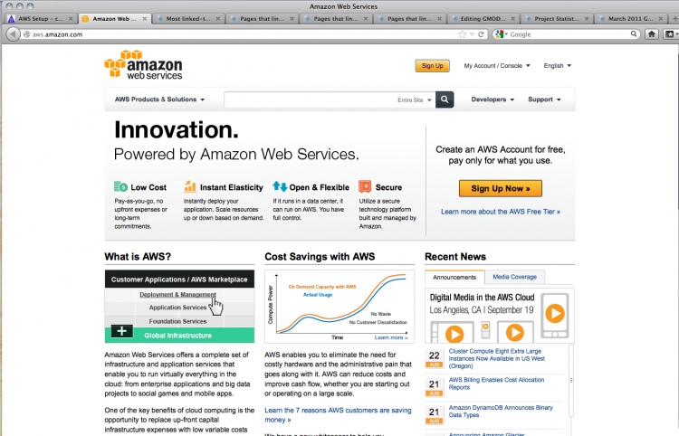</a>

  
Log in with your regular Amazon account (if you don't have an Amazon
account, you'll need to create one)

<a href="File:Screen_shot_2012-08-25_at_10.39.02.png" class="image"
title="Amazon Web Services login">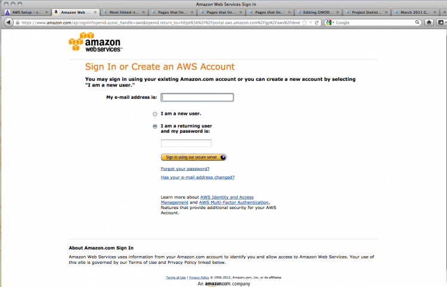</a>

  
Theoretically Amazon already knows this stuff, but you have to enter it
all again...

<a href="File:Screen_shot_2012-08-25_at_10.40.59.png" class="image"
title="AWS login">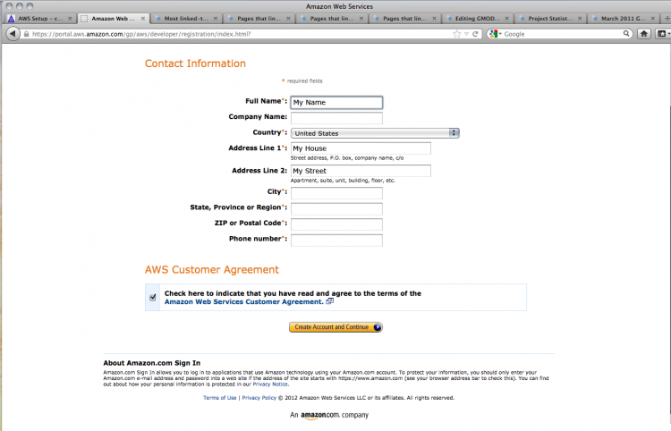</a>

  
You'll need to enter your credit card information to pay for your cloud
usage; GMOD has a grant from AWS to allow users a certain amount of
compute credit.

<a href="File:Screen_shot_2012-08-25_at_10.46.17.png" class="image"
title="AWS login">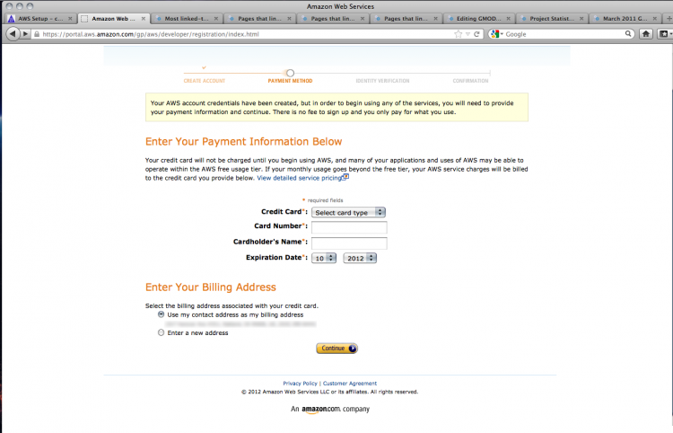</a>

  
Amazon's billing system requires phone verification. Once you have done
this, you'll get this confirmation screen:

<a href="File:Screen_shot_2012-08-25_at_10.46.48.png" class="image"
title="AWS login">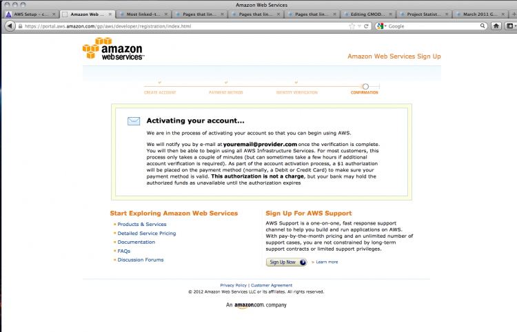</a>

  

## Credit Where Credit's Due

If you have a voucher for free compute credit, you can apply it at
<a href="http://aws.amazon.com/awscredits" class="external free"
rel="nofollow">http://aws.amazon.com/awscredits</a>.

<a href="File:Screen_shot_2012-08-25_at_10.58.30.png" class="image"
title="AWS credit applied - woohoo!">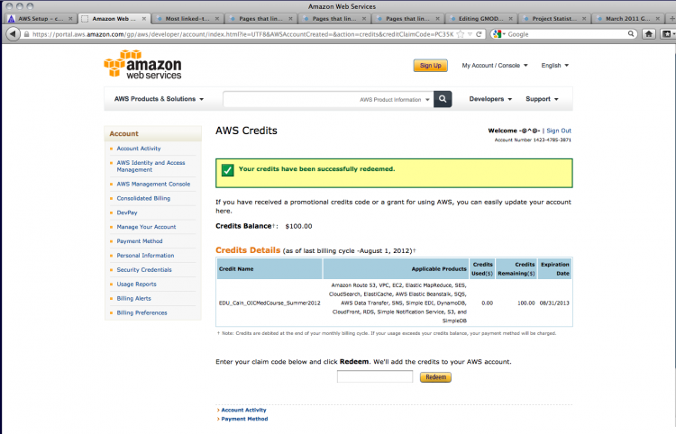</a>

  

## Finding and Starting a GMOD Cloud AMI

The next job is to find and launch a GMOD in the Cloud instance. The
current GMOD in the Cloud instance is as follows:

- Amazon AMI ID: ami-a9d7f9c0 (in the US East-Virgina zone);
- Name: **GMOD in the Cloud 2.05**

(as of December 16, 2013)

Read on for text instructions, [skip down to the screenshot
guide](#Starting_Your_Instance), or [skip to the next
section](#Directory_Structure).

To find it in Amazon's management page, go to **AMIs** section under
**Images** in the EC2 Management Console. Search public images for that
ID or "GMOD in the Cloud" and right or control click on the most recent
version. This will bring up a menu; select **launch image** from this
menu. You will be presented with a pop up window to configure the image.
You can accept all of the defaults unless you really want a more
powerful machine. If not, select the "micro" instance, which, if you
don't have any other micro instances available, and you're still new to
AWS, will be free for a year. For a more powerful machine, select
something else. Press continue.

In the next window, you should be able to accept all of the defaults.
Press continue.

In the next window, you might want to give your instance a name so you
can easily identify it later. You could try something like "first GMOD
in the Cloud instance". Press continue.

In the next window, you are asked to provide or create a key pair so
that you may remotely log in. If you don't already have one, select
**Create key pair**. Give it a name and down load the key pair. Remember
where you downloaded it to, because you'll need it later to log into
your machine. Press continue.

Next you'll be asked to configure the firewall. You'll need access on
ports 22 (ssh) and 80 (http) If there is a "default" option, you can
probably accept it. If not, select **Create new security group** and
select **SSH** and **HTTP** from the drop down list, clicking "add rule"
for each. Give it a useful name like "default". Press continue and close
until your instance gets created.

### Launch an Instance

Return to the
<a href="http://aws.amazon.com" class="external text" rel="nofollow">AWS
home page</a> (confusingly, the "sign up" link is still present and
there's no indication that you're logged in). Select the **AWS
Management Console** link under **My Account/Console**.

<a href="File:Screen_shot_2012-08-25_at_11.02.47.png" class="image"
title="Accessing the console">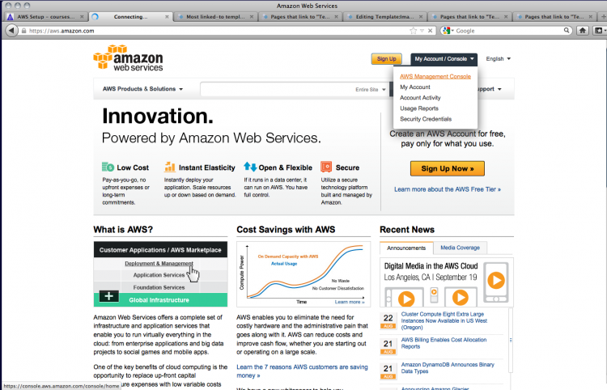</a>

  
This takes you to the console. Click on **EC2** to access cloud
computing services.

<a href="File:Screen_shot_2012-08-25_at_11.03.24.png" class="image"
title="Console screen">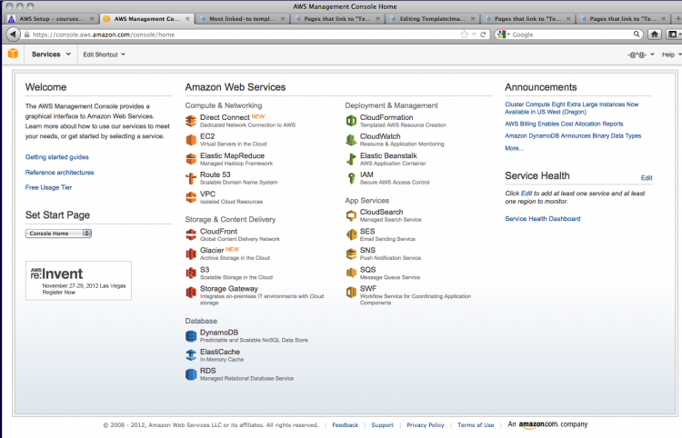</a>

  
At present, GMOD in the Cloud 1.3 is only available in the US East area.
You may need to change the setting in the **Navigation** section on the
left.

<a href="File:Screen_shot_2012-08-25_at_11.05.34.png" class="image"
title="Regions">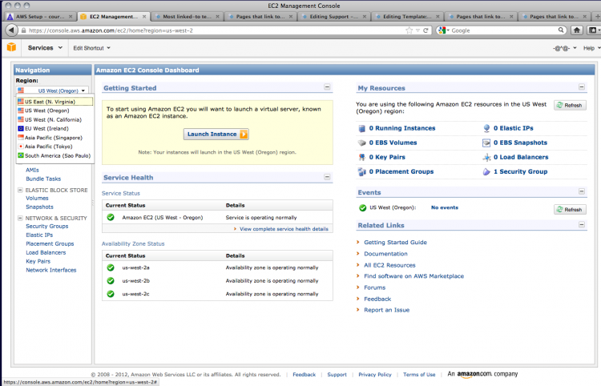</a>

  
Once you have set the region, you can search for the AMI you want.

<a href="File:Screen_shot_2012-08-25_at_11.24.57.png" class="image"
title="Getting ready for launch">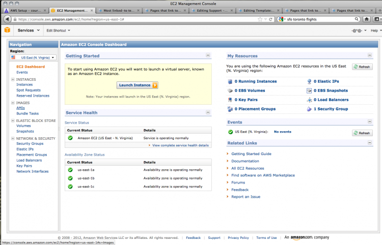</a>

  
Click on **AMIs** in the left-hand menu to view or search for Amazon
Machine Images, AMIs. You can find the GMOD image by searching **public
images**.

<a href="File:Screen_shot_2012-08-25_at_11.26.12.png" class="image"
title="Search public AMIs">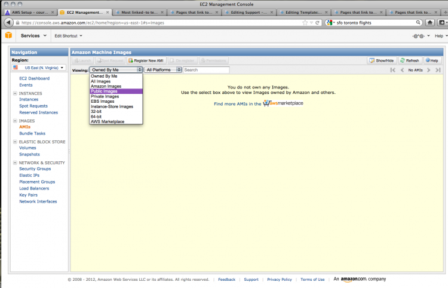</a>

  
A search for *gmod* brings up a number of AMIs; choose the most recent
GMOD in the Cloud image (1.3 as of August 2012).

<a href="File:Screen_shot_2012-08-25_at_11.27.32.png" class="image"
title="Find your cloud">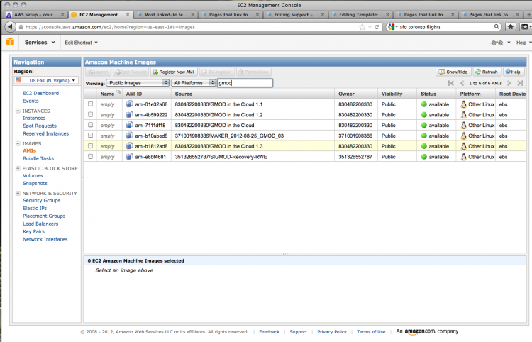</a>

  
Right-clicking on the AMI of your choice brings up a contextual menu;
choose **Launch Instance** to create your instance.

<a href="File:Screen_shot_2012-08-25_at_11.27.45.png" class="image"
title="Context: launch!">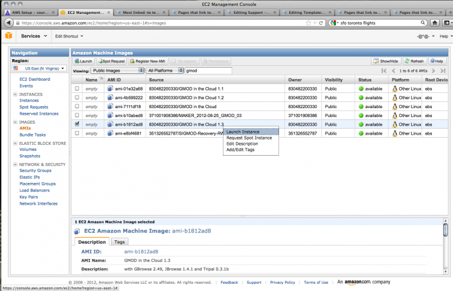</a>

  
There are a number of options for your instance. You can choose the
capabilities of your cloud computer; in this case, only the lowest spec
computer is available for users of the free services. The defaults are
fine for our purposes.

  
<a href="File:Screen_shot_2012-08-25_at_11.32.39.png" class="image"
title="AMI options, II">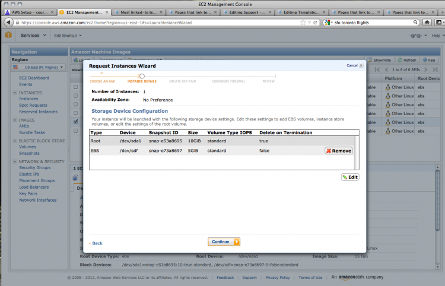</a>

  
You can add information for your instance in the form of key-value
pairs. Give your instance a name by adding 'Name' to the key field and
an appropriate name in the value field.

<a href="File:Screen_shot_2012-08-25_at_11.33.51.png" class="image"
title="Name your AMI">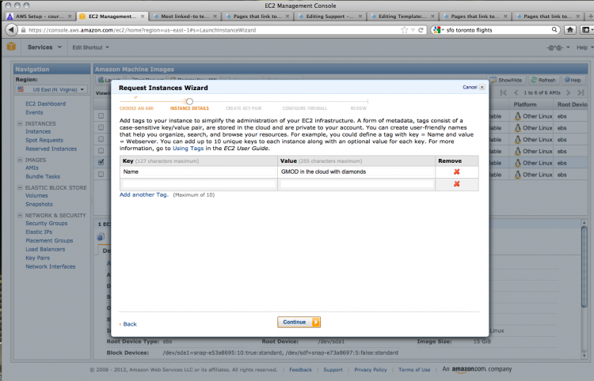</a>

  
To be able to access your AMI, you'll need to create a key pair. Choose
a key word and Amazon will generate a private key for you.

<a href="File:Screen_shot_2012-08-25_at_11.34.27.png" class="image"
title="Create a key pair">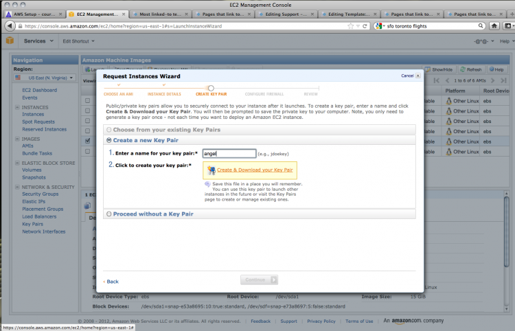</a>

  
Save this to disk for later use.

<a href="File:Screen_shot_2012-08-25_at_11.34.48.png" class="image"
title="Saving your private key">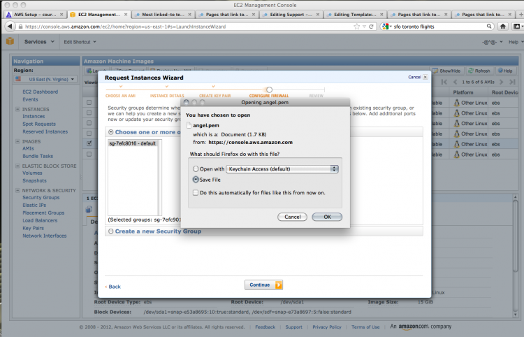</a>

  
You can now configure the security options for your instance. These
settings will allow you to access the AMI using various protocols.

<a href="File:Screen_shot_2012-08-25_at_11.35.42.png" class="image"
title="Security!!">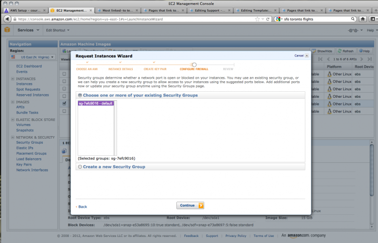</a>

  
The default settings do not allow any access, but we want to use SSH
(secure shell) and HTTP (standard browser-based web protocol) to get
into our instance. To do this, create a new security group; give it a
name and a description.

<a href="File:Screen_shot_2012-08-25_at_15.21.18.png" class="image"
title="Adding a new security setting">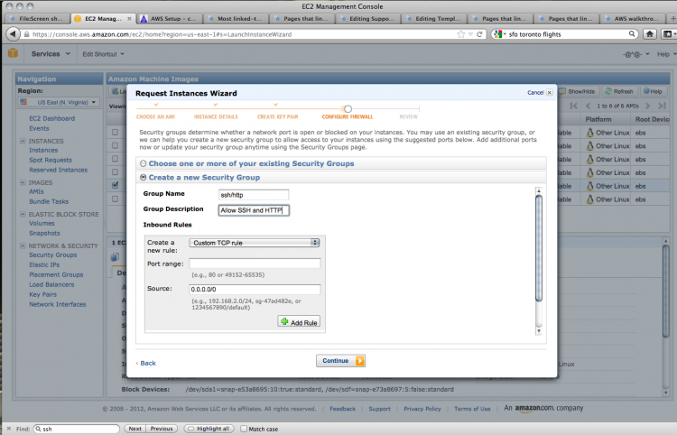</a>

  
You can then add the two kinds of connections that we want to allow.
Choose **SSH** from the drop-down menu. The **source** field dictates
the IP addresses that can contact the instance using SSH. Unless you
need to restrict access to certain IP addresses, this can be left as is.

<a href="File:Screen_shot_2012-08-25_at_15.21.35.png" class="image"
title="Adding SSH access">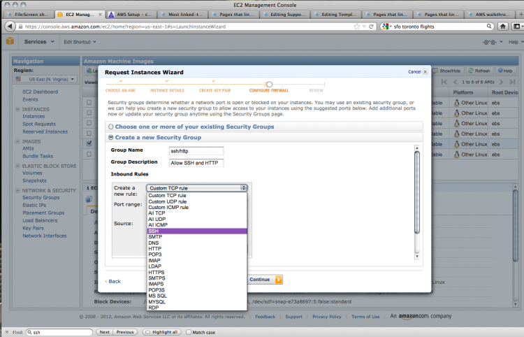</a>

  
Use **Add rule** to create another rule for HTTP access. Once again,
choose **HTTP** from the drop-down menu and leave the source field as it
is.

<a href="File:Screen_shot_2012-08-25_at_15.22.18.png" class="image"
title="Adding HTTP access">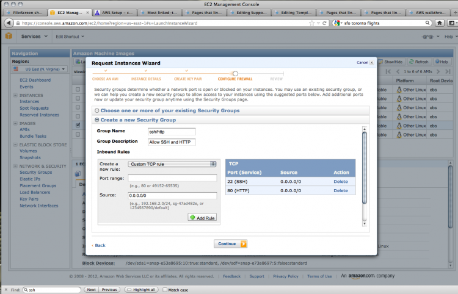</a>

  
With the security settings done, we can check over our options; if all
looks well, click launch!

<a href="File:Screen_shot_2012-08-25_at_11.36.06.png" class="image"
title="Are we finally ready to go?">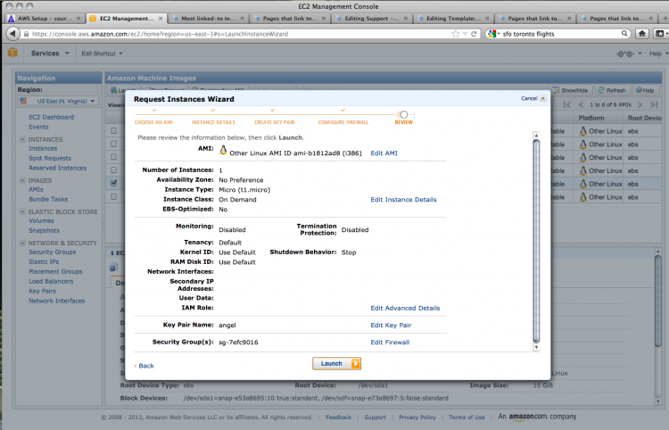</a>

  
Houston, we have blast off!

<a href="File:Screen_shot_2012-08-25_at_11.36.25.png" class="image"
title="Blast off!">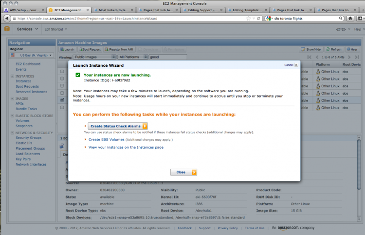</a>

### Directory Structure

When you log into your GMOD Cloud instance, you will be in the ubuntu
user's home directory, /home/ubuntu, which is part of the root partition
of the machine, and so, if you save anything in this directory, it will
be deleted when you move to a new version of the GMOD Cloud. To save
items from one machine to the next, it must be saved on your EBS
partition, and to make that easier from the home directory, we've put in
a link to the /data partition in the home directory named "dataHome", so
you can "cd /home/ubuntu/dataHome" or "cd ~/dataHome" to save files in a
convenient spot relative to your home directory. Already in this
dataHome directory is a file called "bashrc" which is automatically
included in your .bashrc when you log in, so if you have changes you'd
like to make to your shell environment, you can add those changes here.

There are several other directories that are on the /data partition so
they will be saved when you go to a new instance as well. These are:

|  |  |
|----|----|
| /data/etc/gbrowse | The config directory for GBrowse. |
| /data/etc/postgresql | The config directory for PostgreSQL |
| /data/opt | A good place to install any other software you want to use |
| /data/var/lib/gbrowse | Other GBrowse files that might be modifed on your instance, including user session data and flat file databases. |
| /data/var/lib/postgresql | Files for the PostgreSQL database |
| /data/var/www/.htaccess | The htaccess file for the main Drupal site |
| /data/var/www/jbrowse/data | All of the data files needed for running JBrowse |
| /data/var/www/sites/default | Site-specific files and directories for Drupal; modules and themes go here (though Tripal is in /var/www/sites/all) |

In all instances, the original files and directories where moved to the
/data partition and replaced with symlinks to their new locations. Note
that changes made to files in any other locations will be lost. If you
find that you must have other files or directories saved, please send an
email to gmod-devel@lists.sourceforge.net to request that symlinks be
added to future releases.

## Interacting with the Server

### Logging in

Amazon provides a web-based command line client for interacting with
your instance, but you may prefer to use a client on your own computer.

The Amazon documentation includes <a
href="http://docs.amazonwebservices.com/AWSEC2/latest/GettingStartedGuide/ConnectToInstanceLinux.html"
class="external text" rel="nofollow">instructions on connecting to an
EC2 machine</a>; note that rather than "root" or "ec2-user", you need to
use "ubuntu" as the user name, so an ssh command would typically looks
something like this:

     ssh -i my_key.pem ubuntu@ec2-184-72-204-112.compute-1.amazonaws.com

The following screenshots walk you through logging into an AMI using a
command line tool. [Skip to the next
section](#Resizing_your_data_partition)

### Instance Access

We can now test out our instance. Clicking on **Instances** shows us the
list of all the instances we have running.

  
Go to the instance and right-click to bring up a contextual menu. Choose
**Connect**.

  
We can test the HTTP connection using the information from the dialogue
box that comes up. Copy the public DNS address, found under the open
heading **Connect from your browser using the Java SSH Client (Java
Required)**.

  
Open that address in a new browser window. If everything has gone
correctly, you should see the following screen:

  
Now let's check the SSH connection. You can do this through your browser
using the built-in Java client. You will need to change the user name to
**ubuntu** and set the private key path to the location where you saved
the private key that was generated earlier. Click **Launch SSH Client**
to get connected.

  
Most bioinformaticists worth their salt prefer a nice command line
option, so click on **Connect with a standalone SSH client** to view the
connection information. The first task is to change the file access
permissions on the downloaded private key file.

  
As with the Java browser-based SSH client, you'll need to change the
user name from **root** to **ubuntu**. Copy the command given,
substituting in the correct path to your private key file and the user
name **ubuntu**.

  
If all goes well, you should log in to the server and get a welcome
message:

### Resizing your data partition

For the moment,
<a href="http://tomotvos.ca/cloud/how-to-resize-an-aws-volume/"
class="external text" rel="nofollow">this tutorial</a> is a good guide
to resizing EBS partitions on EC2 machines.

  

  

## Working with the GMOD Software on the Server

### Loading Data into Chado

### Configuring GBrowse

### Getting Data into JBrowse

### Configuring Tripal

## Leaving the Cloud

Once you have finished working on your GMOD in the Cloud instance, you
should remove your data and shut it down (instances can be left running,
but be aware that this may be costing you money). This can be achieved
in a number of different ways, depending on what we want to happen to
the server once we've stopped it.

**Stop** an instance: instance shuts down; changes are saved; instance
stays in list of instances.

**Terminate** an instance: instance shuts down; changes discarded;
instance removed from list of instances.

Using `sudo /sbin/shudown`: depends on the configuration; for GMOD in
the Cloud, the default is the **stop** behaviour above.

Unless you have a reserved IP address for your instance, you will lose
the IP address associated with your GMOD in the Cloud installation when
you stop the machine.

  

### Shutting Down

To stop an instance from the command line, type the following:

     sudo /sbin/shutdown now

<a href="File:Screen_shot_2012-08-25_at_11.59.27.png" class="image"
title="Shut down">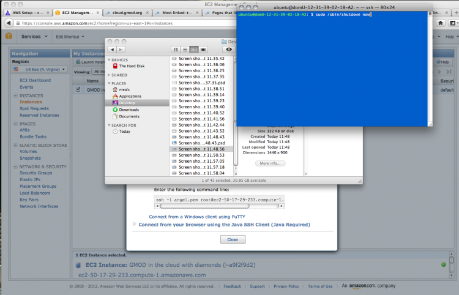</a>

  
Your instance will start shutting down and your connection with be
terminated.

<a href="File:Screen_shot_2012-08-25_at_11.59.40.png" class="image"
title="Terminating...">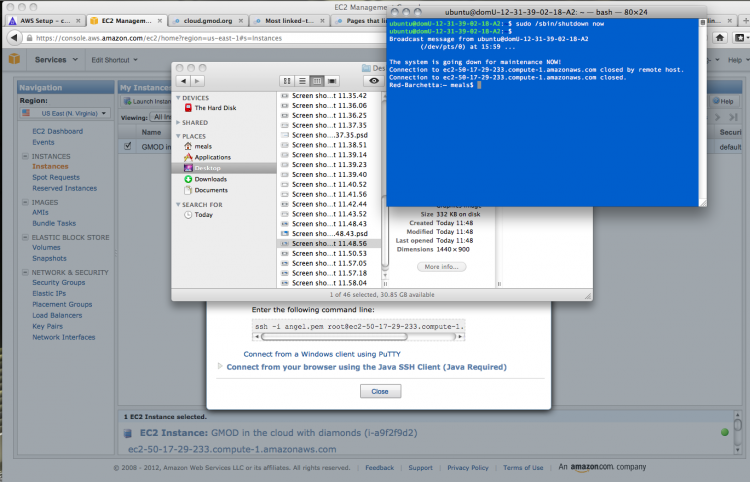</a>

  
If you return to the **Instances** window in your browser, your instance
will change to the status **stopped**.

<a href="File:Screen_shot_2012-08-25_at_12.40.52.png" class="image"
title="Instance stopped">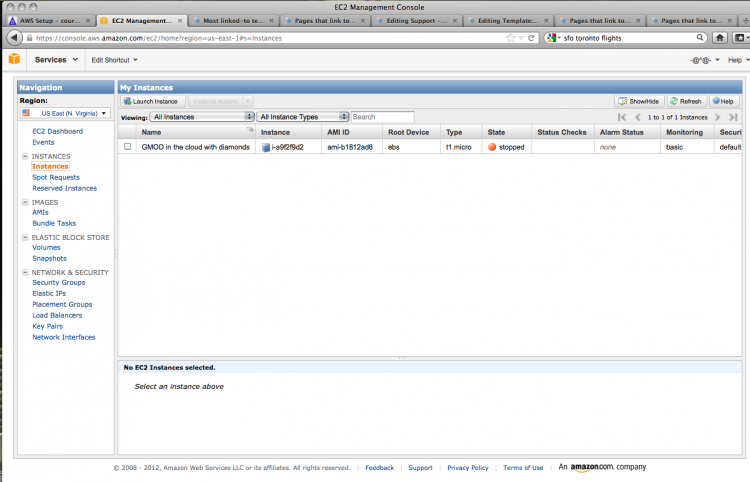</a>

### Getting your data off the Cloud

To archive, compress, and securely transfer directory DIR to remote host
HOST without writing the archive to your localhost:

     $ tar -cjvf - DIR | ssh HOST 'cat > DIR.tar.bz2' 

or, using pax:

     $ pax -w DIR | bzip2 | ssh HOST 'cat > DIR.tar.bz2' 

You can also decompress/untar the archive on-the-fly on the remote host
as well (note that the "v" option was omitted from the first tar command
to avoid echoing each file twice):

     $ tar -cjf - DIR | ssh HOST 'tar -xjvf -' 

The default SSH2 cipher, 3des, is somewhat slow; if the data transfer is
occurring over a high-speed network, a faster SSH cipher (e.g.,
blowfish-cbc or arcfour256) may speed up the transfer:

     $ tar -cjvf - DIR | ssh -o 'Ciphers blowfish-cbc' HOST 'cat > DIR.tar.bz2'

*Thanks to Nathan Weeks for these tips*

  

### Volume Deletion

Every GMOD in the Cloud instance uses two volumes (disks), one for
applications and the other for data.

<a href="File:16.55.png" class="image"
title="Volumes with a running machine">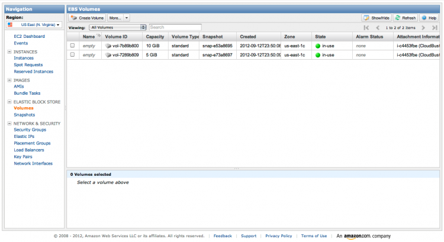</a>

  
As these screenshot suggest, only the **Root** volume is deleted when
you shut down your AMI.

<a href="File:12.40.png" class="image" title="Volume setup">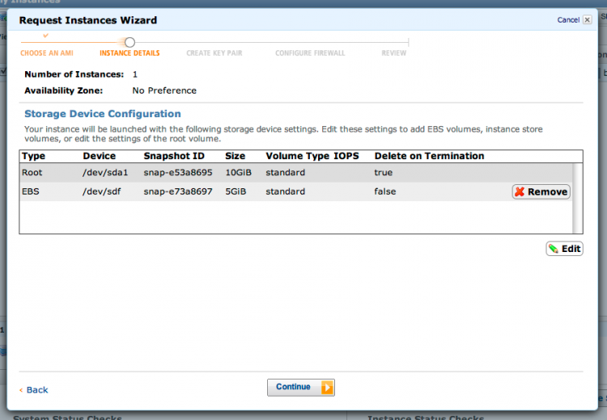</a>

  
Amazon charges for data storage, so unless you need to keep the data on
the Amazon servers, it is best to transfer the data elsewhere and delete
the volume.

<a href="File:16.58.56.png" class="image"
title="Terminate dialog box">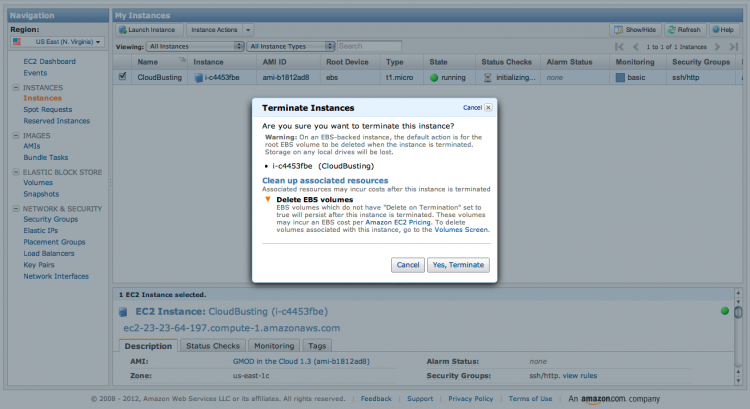</a>

  
Terminate your instance by choosing **Terminate** from **Instance
Actions** or by right-/command-clicking on the instance name and
selecting **Terminate** from the menu.

<a href="File:16.59.17.png" class="image" title="Termination...">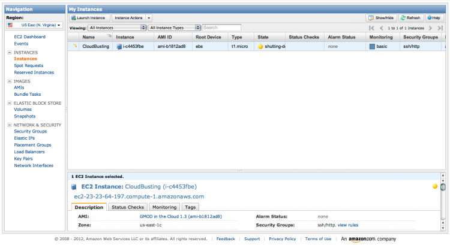</a>

  
When the instance has terminated, click on **Volumes**. The Root volume
has been deleted but EBS volume remains. Its status is available as it
is no longer in use by the instance.

<a href="File:17.00.13.png" class="image" title="Volume remaining">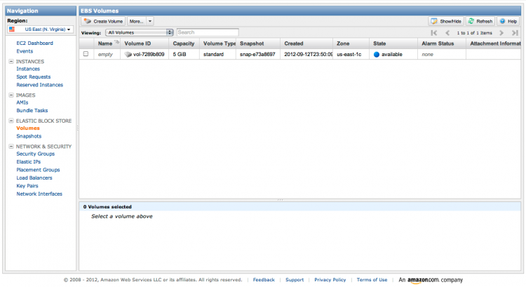</a>

  
To delete the volume, select it and either choose **Delete volume** or
right-/command-click on the volume name and select **Delete**.

<a href="File:17.00.22.png" class="image" title="Deletion">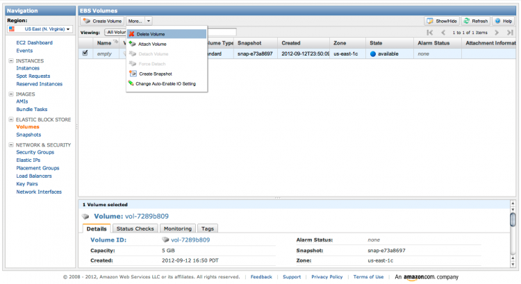</a>

  
All done!

<a href="File:17.04.00.png" class="image" title="Tabula rasa">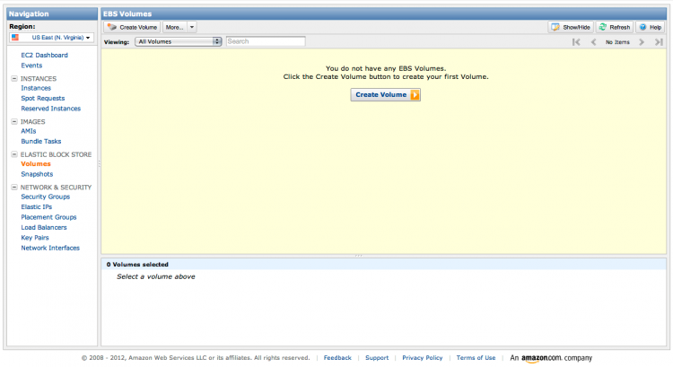</a>

Retrieved from
"<http://gmod.org/mediawiki/index.php?title=GMOD_Cloud_Tutorial&oldid=21713>"

[Categories](Special%3ACategories "Special%3ACategories"):

- [GMOD in the
  Cloud](Category%3AGMOD_in_the_Cloud "Category%3AGMOD in the Cloud")
- [Tutorials](Category%3ATutorials "Category%3ATutorials")

## Navigation menu

### Namespaces

- <a
  href="http://gmod.org/mediawiki/index.php?title=Talk:GMOD_Cloud_Tutorial&amp;action=edit&amp;redlink=1"
  accesskey="t"
  title="Discussion about the content page [t]">Discussion</a>

### 

### Variants

### Navigation

- [GMOD Home](Main_Page)
- [Software](GMOD_Components)
- [Categories /
  Tags](Categories)

### Documentation

- [Overview](Overview)
- [FAQs](Category%3AFAQ)
- [HOWTOs](Category%3AHOWTO)
- [Glossary](Glossary)

### Community

- [GMOD News](GMOD_News)
- [Training /
  Outreach](Training_and_Outreach)
- [Support](Support)
- [GMOD Promotion](GMOD_Promotion)
- [Meetings](Meetings)
- [Calendar](Calendar)

### Tools

- <a href="Special%3ABrowse/GMOD_Cloud_Tutorial" rel="smw-browse">Browse
  properties</a>

- Last updated at 01:26 on 13 September
  2012.
<!-- - 45,179 page views. -->
- Content is available under
  <a href="http://www.gnu.org/licenses/fdl-1.3.html" class="external"
  rel="nofollow">a GNU Free Documentation License</a> unless otherwise
  noted.

<!-- -->

- [About
  GMOD](GMOD%3AAbout "GMOD%3AAbout")

<!-- -->

