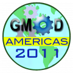
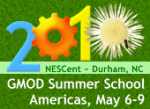
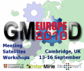

# GMOD Community Support

From GMOD

Jump to: [navigation](#mw-navigation), [search](#p-search)

## Contents

- [1 Roles of
  GMOD's Community Support](#Roles_of_GMOD.27s_Community_Support)
  - [1.1 Help
    Desk](#Help_Desk)
  - [1.2 Grant
    Review Service](#Grant_Review_Service)
  - [1.3 Training
    and Outreach](#Training_and_Outreach)
  - [1.4 GMOD for
    Evolutionary Biology](#GMOD_for_Evolutionary_Biology)
- [2 Please share
  your feedback](#Please_share_your_feedback)
- [3
  Acknowledgements and
  History](#Acknowledgements_and_History)

## Roles of GMOD's Community Support

GMOD comprises not only of a collection of intercompatible software
components, but equally importantly a large, globally distributed, and
diverse community. The community includes users and developers, as well
as experts with ample experience in GMOD and newbies who just discovered
GMOD. The community interacts remotely through an array of mailing
lists, issue trackers, and other channels that can be dazzling even to
GMOD veterans.

To broaden GMOD's outreach and to facilitate effective uptake of its
technology and continuing growth of its community, GMOD maintains
infrastructure and staff devoted to community support. Broadly speaking,
GMOD's Community Support aims to grow a healthy, vibrant, and supportive
distributed community of users and developers; to provide training in
using, extending, and deploying GMOD software; and to promote GMOD to
new communities and research applications.

### Help Desk

The community support includes the [GMOD Help
Desk](GMOD_Help_Desk "GMOD Help Desk"), which liaises between users and
developers so that questions, and those who ask them, quickly find the
people who are best able to answer. Also, as the diversity and
complexity of the GMOD suite of software tools can be bewildering even
to more experienced users, the Help Desk maintains the community's
website (this wiki), as well as a large body of documentation on GMOD
components and best practices for extending GMOD.

### Grant Review Service

As part of the aim to promote GMOD adoption, Community Support staff can
aid investigators with grant proposals that include using and/or
extending GMOD components. Consultancy on grant proposals focuses on

- How [GMOD Components](GMOD_Components "GMOD Components") can be used
  to their fullest extent in the grant, and
- Finding opportunities to fund support and extension of the GMOD
  project as a part of grants that use GMOD.

### Training and Outreach

  

The Community Support organizes and provides GMOD [training events and
outreach activities](Training_and_Outreach "Training and Outreach").
These include the following:

- Running multi-day hands-on [GMOD Schools](GMOD_Schools "GMOD Schools")
  for new GMOD users.
- Giving in person
  [tutorials](Training_and_Outreach#Other_Training_and_Tutorials "Training and Outreach")
  and [workshops at
  conferences](Training_and_Outreach#Conference_Workshops "Training and Outreach")
  and at GMOD user sites.
- Presenting [posters at
  conferences](Training_and_Outreach#Outreach:_Posters_and_Presentations "Training and Outreach")
  to increase awareness of GMOD and its capabilities.

### GMOD for Evolutionary Biology

The primary Community Support staff is located at and managed by
<a href="http://www.nescent.org" class="external text"
rel="nofollow">NESCent</a>, as the result of a collaboration between
GMOD and NESCent. One of NESCent's goals is to promote the adoption of
GMOD for data management, analysis, and visualization needs for the
genome-scale information being generated in [evolutionary
research](Category:Evolution "Category:Evolution"), in particular for
emerging model organisms. This initiative includes extending the
functionality of GMOD tools for evolutionary applications, particularly
in the areas of managing and visualizing information about genotypic
variation, [phenotypic
variation](Category:Phenotypes "Category:Phenotypes"), and
phylogenetics.

## Please share your feedback

The Community Support staff needs your feedback to help guide their
priorities. Please <a href="mailto:help@gmod.org" class="external text"
rel="nofollow">contact the support staff</a> if:

- You have a suggestion for a tutorial topic.
- You are interested in attending a tutorial either at a conference or
  at <a href="http://www.nescent.org" class="external text"
  rel="nofollow">NESCent</a>.
- You have suggestions on conferences or meetings where a GMOD tutorial
  or poster should be presented.
- You have a suggestion for improving the documentation or web site.
- You want the GMOD Help Desk to send someone to your organization to
  help with training, setup, or debugging. (Note that the host needs to
  pay travel expenses.)

## Acknowledgements and History

The GMOD Community Support began as a collaboration between GMOD and the
<a href="http://www.nescent.org" class="external text"
rel="nofollow">National Evolutionary Synthesis Center</a> (NESCent), and
was initially managed by NESCent.

<a href="http://www.bioperl.org/wiki/Brian" class="extiw"
title="bp:Brian">Brian Osborne</a> started the [GMOD Help
Desk](GMOD_Help_Desk "GMOD Help Desk") in 2006 and, among other things,
created this wiki. In 2007 [Dave
Clements](User:Clements "User:Clements") took over, who held the
position until the end of 2010 (when he moved to the
[Galaxy](Galaxy.1 "Galaxy") project). [Amelia
Ireland](User:Girlwithglasses "User:Girlwithglasses") was Community
Support Specialist from July 2012 to May 2014, when grant funding ran
out.

Some community support functions are also provided by several other
members of the GMOD community, notably [Scott
Cain](User:Scott "User:Scott"), the GMOD Project Coordinator.

The GMOD Help Desk was funded by <a
href="http://crisp.cit.nih.gov/crisp/CRISP_LIB.getdoc?textkey=7234938&amp;p_grant_num=1R01HG004483-01&amp;p_query=&amp;ticket=&amp;p_audit_session_id=&amp;p_keywords="
class="external text" rel="nofollow">NIH grant 1R01HG004483-01</a> under
<a href="http://biowiki.org/IanHolmes" class="external text"
rel="nofollow">Ian Holmes</a> and <a
href="http://crisp.cit.nih.gov/crisp/CRISP_LIB.getdoc?textkey=7237890&amp;p_grant_num=5U24GM077905-02&amp;p_query=&amp;ticket=55662137&amp;p_audit_session_id=288899622&amp;p_keywords="
class="external text" rel="nofollow">NIH grant 5U24GM077905-02</a> under
<a href="http://hulab.tamu.edu/" class="external text"
rel="nofollow">Jim Hu</a>. Brian's work was funded by a
<a href="http://www.ars.usda.gov/" class="external text"
rel="nofollow">USDA ARS</a> grant under
<a href="http://www.ars.usda.gov/pandp/docs.htm?docid=11095"
class="external text" rel="nofollow">Doreen Ware</a>. We thank
<a href="http://pages.uoregon.edu/pphil/" class="external text"
rel="nofollow">Patrick Phillips</a> and
<a href="http://creskolab.uoregon.edu/" class="external text"
rel="nofollow">Bill Cresko</a> of the
<a href="http://ie2.uoregon.edu/" class="external text"
rel="nofollow">Institute of Ecology and Evolution (IE2)</a>
at the <a href="http://uoregon.edu" class="external text"
rel="nofollow">University of Oregon</a> for hosting Dave Clements during
his 3 years.

Retrieved from
"<http://gmod.org/mediawiki/index.php?title=GMOD_Community_Support&oldid=26746>"

[Category](Special:Categories "Special:Categories"):

- [Help](Category:Help "Category:Help")

## Navigation menu

### Personal tools

- <a
  href="http://gmod.org/mediawiki/index.php?title=Special:UserLogin&amp;returnto=GMOD+Community+Support"
  accesskey="o"
  title="You are encouraged to log in; however, it is not mandatory [o]">Log
  in / create account</a>

### Namespaces

- <a href="GMOD_Community_Support" accesskey="c"
  title="View the content page [c]">Page</a>
- <a
  href="http://gmod.org/mediawiki/index.php?title=Talk:GMOD_Community_Support&amp;action=edit&amp;redlink=1"
  accesskey="t"
  title="Discussion about the content page [t]">Discussion</a>

### 

### Variants

### Views

- [Read](GMOD_Community_Support)
- <a
  href="http://gmod.org/mediawiki/index.php?title=GMOD_Community_Support&amp;action=edit"
  accesskey="e" title="This page is protected.
  You can view its source [e]">View source</a>
- <a
  href="http://gmod.org/mediawiki/index.php?title=GMOD_Community_Support&amp;action=history"
  accesskey="h" title="Past revisions of this page [h]">View history</a>

### Actions

### Search

### Navigation

- [GMOD Home](Main_Page)
- [Software](GMOD_Components)
- [Categories /
  Tags](Categories)
- [View all pages](Special:AllPages)

### Documentation

- [Overview](Overview)
- [FAQs](Category:FAQ)
- [HOWTOs](Category:HOWTO)
- [Glossary](Glossary)

### Community

- [GMOD News](GMOD_News)
- [Training /
  Outreach](Training_and_Outreach)
- [Support](Support)
- [GMOD Promotion](GMOD_Promotion)
- [Meetings](Meetings)
- [Calendar](Calendar)

### Tools

- <a href="Special:WhatLinksHere/GMOD_Community_Support" accesskey="j"
  title="A list of all wiki pages that link here [j]">What links here</a>
- <a href="Special:RecentChangesLinked/GMOD_Community_Support"
  accesskey="k"
  title="Recent changes in pages linked from this page [k]">Related
  changes</a>
- <a href="Special:SpecialPages" accesskey="q"
  title="A list of all special pages [q]">Special pages</a>
- <a
  href="http://gmod.org/mediawiki/index.php?title=GMOD_Community_Support&amp;printable=yes"
  rel="alternate" accesskey="p"
  title="Printable version of this page [p]">Printable version</a>
- [Permanent
  link](http://gmod.org/mediawiki/index.php?title=GMOD_Community_Support&oldid=26746 "Permanent link to this revision of the page")
- [Page
  information](http://gmod.org/mediawiki/index.php?title=GMOD_Community_Support&action=info)
- <a href="Special:Browse/GMOD_Community_Support" rel="smw-browse">Browse
  properties</a>
- [Print as
  PDF](http://gmod.org/mediawiki/index.php?title=Special:PdfPrint&page=GMOD_Community_Support)

- Last updated at 17:51 on 18 June
  2015.
- 54,488 page views.
- Content is available under
  <a href="http://www.gnu.org/licenses/fdl-1.3.html" class="external"
  rel="nofollow">a GNU Free Documentation License</a> unless otherwise
  noted.

<!-- -->

- [About
  GMOD](GMOD:About "GMOD:About")

<!-- -->

- 
- 
  

