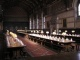

# GMOD Europe 2009

From GMOD

Jump to: [navigation](#mw-navigation), [search](#p-search)

<table style="vertical-align: middle; border: 2px solid #A6A6BC"
data-cellpadding="10">
<colgroup>
<col style="width: 50%" />
<col style="width: 50%" />
</colgroup>
<tbody>
<tr class="odd">
<td>

</td>
<td><strong>GMOD Europe
2009</strong> 
3-7 August, 2009 
Oxford UK

 
3 - 6 Aug: <a
href="2009_GMOD_Summer_School_-_Europe"
title="2009 GMOD Summer School - Europe">Summer School</a> 
6 - 7 Aug: <a href="August_2009_GMOD_Meeting"
title="August 2009 GMOD Meeting">Community Meeting</a>
</td>
</tr>
</tbody>
</table>

***GMOD Europe 2009*** was a weeklong event starting with a 3 ½ day
[GMOD Summer
School](2009_GMOD_Summer_School_-_Europe "2009 GMOD Summer School - Europe")
and finishing with a 1 ½ day [GMOD Community
Meeting](August_2009_GMOD_Meeting "August 2009 GMOD Meeting"). GMOD
Europe 2009 was generously hosted by the
<a href="http://www.molbiol.ox.ac.uk/" class="external text"
rel="nofollow">Computational Biology Research Group</a> at the
University of Oxford, 3-7 August, 2009. This was the first time a [GMOD
Community Meeting](Meetings "Meetings") or a
<a href="GMOD_Summer_School" class="mw-redirect"
title="GMOD Summer School">GMOD Summer School</a> has been held in
Europe.

  

## Contents

- [1 GMOD Summer
  School, 3-6 August](#GMOD_Summer_School.2C_3-6_August)
- [2 GMOD Community
  Meeting, 6-7 August](#GMOD_Community_Meeting.2C_6-7_August)
- [3
  Registration](#Registration)
- [4
  Transportation](#Transportation)
- [5
  Lodging](#Lodging)
- [6 Things to do
  in Oxford](#Things_to_do_in_Oxford)
- [7
  Sponsor](#Sponsor)

  

## GMOD Summer School, 3-6 August

The week started with a 3 ½ day, hands-on course where participants
installed and configured popular [GMOD
Components](GMOD_Components "GMOD Components"). The course requires some
level of comfort with Linux systems administration, but did not require
any programming experience.

See the [2009 GMOD Summer School -
Europe](2009_GMOD_Summer_School_-_Europe "2009 GMOD Summer School - Europe")
page for full details.

## GMOD Community Meeting, 6-7 August

The week ended with a 1 ½ day [GMOD Community
Meeting](Meetings "Meetings") where participants heard updates on the
GMOD project and components, learned how other users are implementing
GMOD at their sites, and networked with fellow GMOD users and
developers.

See the [August 2009 GMOD
Meeting](August_2009_GMOD_Meeting "August 2009 GMOD Meeting") page for
full details.

## Registration

There were separate registrations for the school and the meeting. Due to
sponsorship from our host, the
<a href="http://www.molbiol.ox.ac.uk/" class="external text"
rel="nofollow">Computational Biology Research Group (CBRG)</a> of the
University of Oxford, registration for both events was below actual
cost.

## Transportation

<a
href="http://www.ox.ac.uk/visitors_friends/maps_and_directions/directions.html"
class="external text" rel="nofollow">How to Get to Oxford University</a>
provides details on how to get to Oxford from several (but not all)
London airports, or from major cities via train (also try
<a href="http://www.thetrainline.com" class="external text"
rel="nofollow">TheTrainline.com</a>), and by coach. To use any
combination of coach, train, and walking, from anywhere in the UK, try
<a href="http://www.transportdirect.info" class="external text"
rel="nofollow">Transport Direct</a>.

## Lodging

Keble Dining Room

We recommended that participants in GMOD Europe 2009 events stay at
<a href="http://www.keble.ox.ac.uk/conferences" class="external text"
rel="nofollow">Keble College</a>. Keble is close to the MSTC, where all
GMOD Europe 2009 events are being held.

## Things to do in Oxford

There are lots of things to <a
href="http://www.visitoxford.org/thedms.asp?dms=11&amp;groupid=2&amp;p1=see"
class="external text" rel="nofollow">see and do</a> in this historic
city. If you have to time try and check out a few <a
href="http://www.visitoxford.org/thedms.asp?dms=11&amp;itemtype=173&amp;p1=see"
class="external text" rel="nofollow">famous colleges</a>.

## Sponsor

We would like to thank the
<a href="http://www.molbiol.ox.ac.uk/" class="external text"
rel="nofollow">Computational Biology Research Group (CBRG)</a> of the
University of Oxford for hosting and sponsoring this event.

Retrieved from
"<http://gmod.org/mediawiki/index.php?title=GMOD_Europe_2009&oldid=22756>"

[Category](Special:Categories "Special:Categories"):

- [Events](Category%3AEvents "Category%3AEvents")

## Navigation menu

### Namespaces

- <a
  href="http://gmod.org/mediawiki/index.php?title=Talk:GMOD_Europe_2009&amp;action=edit&amp;redlink=1"
  accesskey="t"
  title="Discussion about the content page [t]">Discussion</a>

### 

### Variants

### Navigation

- [GMOD Home](Main_Page)
- [Software](GMOD_Components)
- [Categories /
  Tags](Categories)

### Documentation

- [Overview](Overview)
- [FAQs](Category%3AFAQ)
- [HOWTOs](Category%3AHOWTO)
- [Glossary](Glossary)

### Community

- [GMOD News](GMOD_News)
- [Training /
  Outreach](Training_and_Outreach)
- [Support](Support)
- [GMOD Promotion](GMOD_Promotion)
- [Meetings](Meetings)
- [Calendar](Calendar)

### Tools

- <a href="Special%3ABrowse/GMOD_Europe_2009" rel="smw-browse">Browse
  properties</a>

- Last updated at 06:15 on 10 January
  2013.
<!-- - 158,592 page views. -->
- Content is available under
  <a href="http://www.gnu.org/licenses/fdl-1.3.html" class="external"
  rel="nofollow">a GNU Free Documentation License</a> unless otherwise
  noted.

<!-- -->

- [About
  GMOD](GMOD:About "GMOD:About")

<!-- -->

