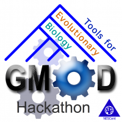

# GMOD Evo Hackathon Proposal Supplemental Information

From GMOD

Jump to: [navigation](#mw-navigation), [search](#p-search)

  

<table style="vertical-align: middle; border: 2px solid #A6A6BC"
data-cellpadding="10">
<colgroup>
<col style="width: 50%" />
<col style="width: 50%" />
</colgroup>
<tbody>
<tr class="odd">
<td>

</td>
<td><strong><a
href="GMOD_Evo_Hackathon" title="GMOD Evo Hackathon">Tools for
Evolutionary Biology Hackathon</a></strong> 
November 8-12, 2010 
<a href="http://nescent.org/" class="external text"
rel="nofollow">NESCent</a>, Durham, North Carolina, USA</td>
</tr>
</tbody>
</table>

  
On this page you will find additional information related to the [GMOD
Evo Hackathon
Proposal](GMOD_Evo_Hackathon_Proposal "GMOD Evo Hackathon Proposal").

## Contents

- [1 Other topics
  of Secondary Importance](#Other_topics_of_Secondary_Importance)
  - [1.1 Natural
    Diversity / Population Genetics / Multidimensional Data
    Visualization in a Genomic
    Context](#Natural_Diversity_.2F_Population_Genetics_.2F_Multidimensional_Data_Visualization_in_a_Genomic_Context)
  - [1.2 Web-based
    display of Chado Phenotype/Natural Diversity
    data](#Web-based_display_of_Chado_Phenotype.2FNatural_Diversity_data)
  - [1.3 Support
    for pangenomes and core
    genomes](#Support_for_pangenomes_and_core_genomes)
  - [1.4 Support
    for annotation tools based on phylogenetic analysis, such as
    PAINT](#Support_for_annotation_tools_based_on_phylogenetic_analysis.2C_such_as_PAINT)
  - [1.5 Linking
    xrate (and other phylo-aware annotation tools) to
    jbrowse](#Linking_xrate_.28and_other_phylo-aware_annotation_tools.29_to_jbrowse)
- [2 Discussion /
  Development Topics](#Discussion_.2F_Development_Topics)
  - [2.1
    Post-Reference Genome
    Tools](#Post-Reference_Genome_Tools)
  - [2.2
    High-throughput Imaging /
    Phenotyping](#High-throughput_Imaging_.2F_Phenotyping)
  - [2.3
    Third-generation
    Sequencing](#Third-generation_Sequencing)
  - [2.4 Evo-Devo
    Support](#Evo-Devo_Support)
  - [2.5 Tree /
    Graph Visualization](#Tree_.2F_Graph_Visualization)

### Other topics of Secondary Importance

#### Natural Diversity / Population Genetics / Multidimensional Data Visualization in a Genomic Context

The Barley1K project (Eyal Fridman group, The Hebrew University) is an
example dataset that should be supportable by GMOD. They gathered a
thousand wild samples of barley in a hierarchical mode of collection (51
sites that include 5 microsite on different slopes or niches within the
site). They also recorded many local environmental conditions and
collected detailed phenotype data on portion of this collection,
including that of a diverse set of interspecifc hybrids derived from a
genetically well-defined core collection (by Illumina Golden Gate
platform, the Barley OPA array\[BOPA1\]). The Natural Diversity module
will allow us to store this type of data including also accumulated
allelic variation obtained from the microsatellites (SSRs) and BOPA1
array, as well as from next generation sequencing of cDNA libraries .
However, we lack tools to visualize such multi-dimensional data in a
genomic context (e.g., in GBrowse, JBrowse, and GBrowse_syn) including
the association of genome-phenotype (phenome). This could be solved
either with specific new glyphs and plugins, or with generic interfaces
to statistical/geolocation/image based visualization packages.

There is also work currently under way to extend [GFF3](GFF3 "GFF3") to
handle variant information. Several existing GMOD tools will need to be
modified to recognize this data.

#### Web-based display of Chado Phenotype/Natural Diversity data

[Tripal](Tripal.1 "Tripal") is a
<a href="http://drupal.org" class="external text"
rel="nofollow">Drupal</a>-based web interface to Chado databases. It
supports interfaces for several popular data types, but does not
currently support phylogenies, phenotypes, expression, or natural
diversity data. We could extend it to evolutionary data types as part of
the hackathon.

  

#### Support for pangenomes and core genomes

The concept of the pangenome and core genomes is becoming common in the
analysis of bacterial genomes, but is more broadly applicable. The
pangenome is the union of all genes found in all strains of a species,
while the core genome is the intersection of those sets. In both cases,
a gene or feature is a generalization of the instances of the feature in
multiple genomes. The gene in a pangenome, like a gene in an inferred
ancestor, does not have a physical location, but it may have one or more
contextual locations in a syntenic block of sequence found in some or
all of the strains.

#### Support for annotation tools based on phylogenetic analysis, such as PAINT

The RefGenome project of the GO consortium is working on
<a href="http://wiki.geneontology.org/index.php/PAINT"
class="external text" rel="nofollow">PAINT</a>, a system for doing
inference of GO annotations based on the distribution of curated
annotations within clades and outgroups. GMOD tools and schemas need to
be prepared to handle this kind of annotation. For example, ancestor
nodes in PANTHER trees will have accessions; these will require
versioning to deal with changes in the analysis as annotations to
descendants and the addition/placement of descendants changes with the
addition of new genomes or revision of the orthology analysis.

#### Linking xrate (and other phylo-aware annotation tools) to jbrowse

The conservation track is a staple of the UCSC browser. Evofold
predictions form another useful track. Tools like xrate
(<a href="http://biowiki.org/XRATE" class="external free"
rel="nofollow">http://biowiki.org/XRATE</a>) allow automation and
generalization of these kinds of phylogenetic HMM or SCFG model.
Development would focus on linking these into existing GMOD browsers
(e.g. JBrowse).

## Discussion / Development Topics

This section contains early-stage ideas that merit discussion and
serious consideration by the attendees of the hackathon, but are not yet
developed enough for specific implementation objectives.

### Post-Reference Genome Tools

This is a great example of how evolutionary biology can help lead the
rest of the GMOD community.

The concept of a reference genome has been an extremely valuable tool in
model organisms. The importance of a reference genome is not
diminishing, but the need for an additional framework is on the rise.

To explain this, lets contrast evolutionary and developmental
biologists. Developmental biologists embrace and strive for similarity
as a means of controlling experimental conditions. Inbred lines of
organisms do not usually occur in nature, but are usually preferred for
developmental biology work. Developmental biology has anatomy ontologies
and staging series based on stereotypic progression of anatomical
development in single inbred lines. Developmental biologists strive to
eliminate genetic and environmental diversity in order to create
controlled experimental conditions. The concept of a reference genome
historically has fit very well into this paradigm.

In contrast, evolutionary biologists embrace and study genetic and
environmental diversity. Evolutionary biologists typically study
populations rather than individual lines. They characterize and analyze
differences, rather than eliminate them. For evolutionary biologists, a
reference genome is much less of a central tool than it is for
developmental biologists.

Second-generation sequencing now allows evolutionary biologists to
exploit *genomic* data for populations or large numbers of individuals.
It also allows every other kind of biologist to do the same. We
currently have tools to show linkage disequilibrium, and genotype and
allele frequencies, but these still typically show data in the context
of a reference genome.

By some estimates, three years from now many projects will have
thousands of full genomes. In such an environment, does the concept of a
reference genome still remain relevant? How should GMOD tools change,
grow, and adapt?

### High-throughput Imaging / Phenotyping

Adoption of high-throughput imaging and phenotyping technologies is
increasing. What software exists for working with this type of data, and
how should the GMOD community participate?

### Third-generation Sequencing

What challenges will the GMOD community face in handling
third-generation (single-molecule) sequencing data, and how can we
prepare for them? Second generation sequencing technologies typically
produce many short reads at very high coverage. The high coverage is
necessary to compensate for lower accuracy. Challenges with 2nd gen data
include 1) dealing with the huge amount of data that comes with the high
coverage, 2) distinguishing read and amplification errors from signal,
and 3) assembling short reads.

Third generation technologies will have some commonalities and some key
differences. First, they will continue to produce large volumes of data.
The nature of the data will change significantly, though. Third
generation technologies are expected to be significantly less
error-prone, thus reducing the need for high coverage. This will also
reduce cost and turnaround time. While the average *depth* of the data
will decrease, the *width* of the data will greatly increase. The
technology will enable more samples to be sequenced, and at greater
accuracy. The improved accuracy and longer read length will also make
assembly easier.

Areas of discussion include:

- data modeling and storage
- graphical visualization
- online display and searching

### Evo-Devo Support

Add the ability to compare the developmental programs between organisms
at different levels: anatomy, genomics, expression patterns, gene
regulatory networks and their architecture, and phenotypes. This
objective, with the exception of gene regulatory networks, overlaps with
several others.

  

### Tree / Graph Visualization

GMOD's Chado database schema already includes strong support for storing
trees and graphs. This capability has been in Chado since its beginning.
GMOD, however, lacks visualization support for tree and graph based
data. This includes phylogeny, gene orthology, lineage (anatomy and
breeding), ontologies, and breeding data. Several GMOD users have
developed their own visualization tools for this type of data. We could
integrate one of those solutions, or an outside solution, for
visualization.

Retrieved from
"<http://gmod.org/mediawiki/index.php?title=GMOD_Evo_Hackathon_Proposal_Supplemental_Information&oldid=13439>"

[Category](Special:Categories "Special:Categories"):

- [GMOD Evo
  Hackathon](Category:GMOD_Evo_Hackathon "Category:GMOD Evo Hackathon")

## Navigation menu

### Namespaces

- <a
  href="http://gmod.org/mediawiki/index.php?title=Talk:GMOD_Evo_Hackathon_Proposal_Supplemental_Information&amp;action=edit&amp;redlink=1"
  accesskey="t"
  title="Discussion about the content page [t]">Discussion</a>

### 

### Variants

### Navigation

- [GMOD Home](Main_Page)
- [Software](GMOD_Components)
- [Categories /
  Tags](Categories)

### Documentation

- [Overview](Overview)
- [FAQs](Category:FAQ)
- [HOWTOs](Category:HOWTO)
- [Glossary](Glossary)

### Community

- [GMOD News](GMOD_News)
- [Training /
  Outreach](Training_and_Outreach)
- [Support](Support)
- [GMOD Promotion](GMOD_Promotion)
- [Meetings](Meetings)
- [Calendar](Calendar)

### Tools

- <a
  href="Special%3ABrowse/GMOD_Evo_Hackathon_Proposal_Supplemental_Information"
  rel="smw-browse">Browse properties</a>

- Last updated at 20:44 on 7 July
  2010.
<!-- - 12,487 page views. -->
- Content is available under
  <a href="http://www.gnu.org/licenses/fdl-1.3.html" class="external"
  rel="nofollow">a GNU Free Documentation License</a> unless otherwise
  noted.

<!-- -->

- [About
  GMOD](GMOD:About "GMOD:About")

<!-- -->

