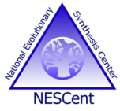
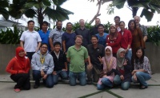

# GMOD Malaysia 2014

From GMOD

Jump to: [navigation](#mw-navigation), [search](#p-search)

Enabled by a generous grant from the
<a href="http://ambassadors.nescent.org/" class="external text"
rel="nofollow">NESCent Ambassador Program</a>

**February 26-28, 2014, Kuala Lumpur, Malaysia.**

GMOD Malaysia offers an introduction to, and training in, the
bioinformatics software offered by the Generic Model Organism Database
project. Over three days, participants will learn about GMOD's free,
open-source tools for visualising, storing, and disseminating genetic
and genomic data. These include:

- [Galaxy](Galaxy.1 "Galaxy") analysis pipeline
- [GBrowse](GBrowse.1 "GBrowse") and [JBrowse](JBrowse.1 "JBrowse")
  genome browsers
- [InterMine](InterMine "InterMine") data warehouse
- [MAKER](MAKER.1 "MAKER") and MAKER-P genome annotation pipelines
- [Tripal](Tripal.1 "Tripal") website generator and database interface
- <a href="Chado" class="mw-redirect" title="Chado">Chado</a> database
  schema

Instruction is by experienced instructors and developers with deep
knowledge of the tools and their applications.

By the end of the course, participants will have hands-on experience of
setting up and using core components needed for a modern genomics
project.

Applications have now closed for the course. GMOD will be holding a
summer school in Durham, North Carolina, in summer 2014; the date has
yet to be confirmed. Please subscribe to the
<a href="https://lists.sourceforge.net/lists/listinfo/gmod-announce"
class="external text" rel="nofollow">GMOD announce mailing list</a> to
be kept apprised on updates on the summer school.

## Contents

- [1
  Feedback](#Feedback)
- [2
  Schedule](#Schedule)
- [3
  Details](#Details)
- [4
  Participants](#Participants)
- [5 Course
  Sponsor](#Course_Sponsor)

## Feedback

Please provide <a
href="https://docs.google.com/forms/d/1BB1PUjlEH7NGcUVIWbDC2FBfu1DGMBILARzVNJdzw_4/viewform"
class="external text" rel="nofollow">feedback on the course</a>.

## Schedule

[Course
Schedule](GMOD_Malaysia_2014/Schedule "GMOD Malaysia 2014/Schedule")

## Details

Date: 26-28 February 2014; starting 9am and finishing at 6pm each day.

Venue: <a
href="http://www.ibis.com/gb/hotel-8552-ibis-styles-kuala-lumpur-fraser-business-park/index.shtml"
class="external text" rel="nofollow">Hotel Ibis Styles Kuala Lumpur
Fraser Business Park</a>, Kuala Lumpur, Malaysia.

Cost and registration: the cost for the course is to be confirmed, but
will include lunch and refreshments for the three days of the course.

Discounted accommodation (including wifi and breakfast) is available at
the Hotel Ibis; please contact the hotel manager,
<a href="mailto:h8552-sl2@accor.com" class="external text"
rel="nofollow">Hazwani Sharif (h8552-sl2@accor.com)</a>, to book your
room and mention that you are attending the GMOD training course to
secure the discounted rate.

  

## Participants

 See
<a href="../mediawiki/images/7/74/GMODMalaysia2014GroupPhoto.jpg"
class="internal" title="GMODMalaysia2014GroupPhoto.jpg">the group
photo</a>.

## Course Sponsor

GMOD Malaysia 2014 is made possible by the extremely generous support of
**<a href="http://nescent.org" class="external text"
rel="nofollow">National Evolutionary Synthesis Center (NESCent)</a>**
and the
**<a href="http://ambassadors.nescent.org/" class="external text"
rel="nofollow">NESCent Ambassador program</a>**. NESCent promotes the
synthesis of information, concepts and knowledge to address significant,
emerging, or novel questions in evolutionary science and its
applications. NESCent supports research and education across
disciplinary, institutional, geographic, and demographic boundaries. The
NESCent Ambassador Program is NESCent’s primary international outreach
program, and is supported by a three-year grant from the NSF. GMOD is
very grateful to be a beneficiary of this generous program.

Retrieved from
"<http://gmod.org/mediawiki/index.php?title=GMOD_Malaysia_2014&oldid=25650>"

[Category](Special:Categories "Special:Categories"):

- [GMOD Schools](Category:GMOD_Schools "Category:GMOD Schools")

## Navigation menu

### Namespaces

- <a href="GMOD_Malaysia_2014.1" accesskey="c"
  title="View the content page [c]">Page</a>
- <a
  href="http://gmod.org/mediawiki/index.php?title=Talk:GMOD_Malaysia_2014&amp;action=edit&amp;redlink=1"
  accesskey="t"
  title="Discussion about the content page [t]">Discussion</a>

### 

### Variants

### Navigation

- [GMOD Home](Main_Page)
- [Software](GMOD_Components)
- [Categories /
  Tags](Categories)
- [View all pages](Special:AllPages)

### Documentation

- [Overview](Overview)
- [FAQs](Category:FAQ)
- [HOWTOs](Category:HOWTO)
- [Glossary](Glossary)

### Community

- [GMOD News](GMOD_News)
- [Training /
  Outreach](Training_and_Outreach)
- [Support](Support)
- [GMOD Promotion](GMOD_Promotion)
- [Meetings](Meetings)
- [Calendar](Calendar)

### Tools

- <a href="Special:Browse/GMOD_Malaysia_2014" rel="smw-browse">Browse
  properties</a>
- [Print as
  PDF](http://gmod.org/mediawiki/index.php?title=Special:PdfPrint&page=GMOD_Malaysia_2014)

- Last updated at 20:59 on 26 March
  2014.
- 118,791 page views.
- Content is available under
  <a href="http://www.gnu.org/licenses/fdl-1.3.html" class="external"
  rel="nofollow">a GNU Free Documentation License</a> unless otherwise
  noted.

<!-- -->

- [About
  GMOD](GMOD:About "GMOD:About")

<!-- -->

- 
- 
  

