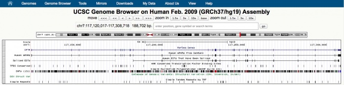
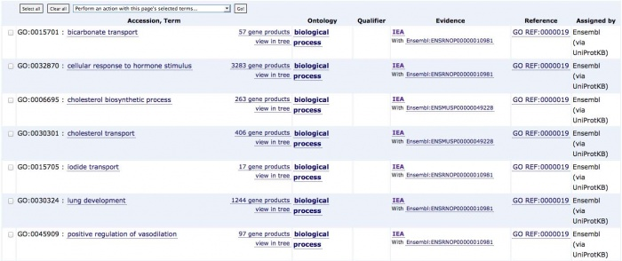
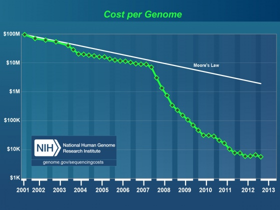
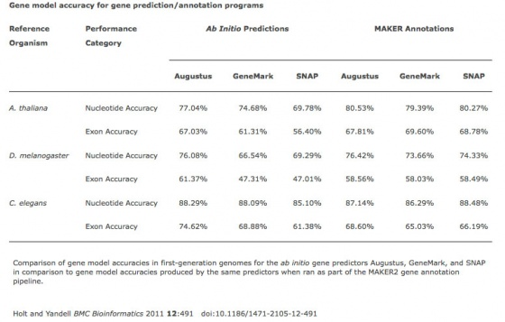
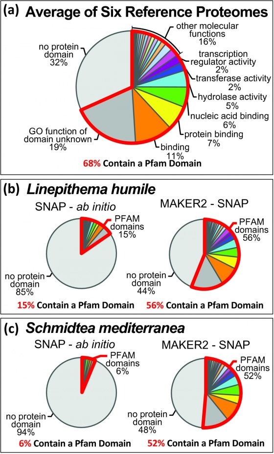
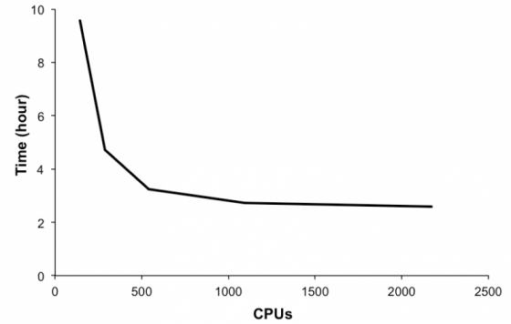
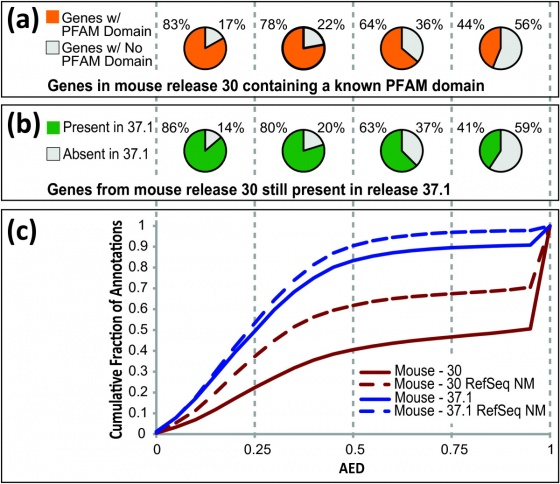
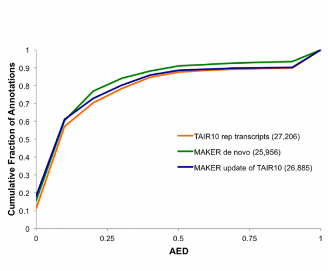

<div id="mw-page-base" class="noprint">

</div>

<div id="mw-head-base" class="noprint">

</div>

<div id="content" class="mw-body" role="main">

<span id="top"></span>

<div id="mw-js-message" style="display:none;">

</div>


# <span dir="auto">GMOD Malaysia 2014/MAKER Tutorial</span>

<div id="bodyContent">

<div id="siteSub">

From GMOD

</div>

<div id="contentSub">

</div>

<div id="jump-to-nav" class="mw-jump">

Jump to: [navigation](#mw-navigation), [search](#p-search)

</div>

<div id="mw-content-text" class="mw-content-ltr" lang="en" dir="ltr">

This [MAKER](../MAKER.1 "MAKER") tutorial was presented by [Michael
Campbell](../User:Michael_Campbell "User:Michael Campbell") at [GMOD
Malaysia 2014](../GMOD_Malaysia_2014.1 "GMOD Malaysia 2014"), February
2014. This tutorial requires MAKER version 2.x.

The most recent MAKER tutorial can be found at the
<a href="../MAKER_Tutorial" class="mw-redirect"
title="MAKER Tutorial">MAKER Tutorial</a> page.

This tutorial uses the AWS AMI ' ***named '*** in the '

.

<a href="http://www.cafepress.com/+maker-genome-annotation+gifts"
class="external text" rel="nofollow">Get MAKER Bling!</a>

  

<div id="toc" class="toc">

<div id="toctitle">

## Contents

</div>

- [<span class="tocnumber">1</span> <span class="toctext">About
  MAKER</span>](#About_MAKER)
- [<span class="tocnumber">2</span> <span class="toctext">Introduction
  to Genome Annotation</span>](#Introduction_to_Genome_Annotation)
  - [<span class="tocnumber">2.1</span> <span class="toctext">What Are
    Annotations?</span>](#What_Are_Annotations.3F)
  - [<span class="tocnumber">2.2</span> <span class="toctext">Importance
    of Genome Annotations</span>](#Importance_of_Genome_Annotations)
  - [<span class="tocnumber">2.3</span> <span class="toctext">Effect of
    NextGen Sequencing on the Annotation
    Process</span>](#Effect_of_NextGen_Sequencing_on_the_Annotation_Process)
- [<span class="tocnumber">3</span> <span class="toctext">MAKER
  Overview</span>](#MAKER_Overview)
  - [<span class="tocnumber">3.1</span> <span class="toctext">What does
    MAKER do?</span>](#What_does_MAKER_do.3F)
  - [<span class="tocnumber">3.2</span> <span class="toctext">What sets
    MAKER apart from other tools (*ab initio* gene predictors
    etc.)?</span>](#What_sets_MAKER_apart_from_other_tools_.28ab_initio_gene_predictors_etc..29.3F)
  - [<span class="tocnumber">3.3</span> <span class="toctext">Emerging
    vs. Classic Model
    Genomes</span>](#Emerging_vs._Classic_Model_Genomes)
  - [<span class="tocnumber">3.4</span> <span class="toctext">Comparison
    of Algorithm Performance on Model vs. Emerging
    Genomes</span>](#Comparison_of_Algorithm_Performance_on_Model_vs._Emerging_Genomes)
- [<span class="tocnumber">4</span>
  <span class="toctext">MAKER-P</span>](#MAKER-P)
  - [<span class="tocnumber">4.1</span>
    <span class="toctext">Performance on large computing
    clusters</span>](#Performance_on_large_computing_clusters)
  - [<span class="tocnumber">4.2</span> <span class="toctext">Tutorials
    for custom repeat library
    generation</span>](#Tutorials_for_custom_repeat_library_generation)
  - [<span class="tocnumber">4.3</span> <span class="toctext">Pseudogene
    identification pipeline</span>](#Pseudogene_identification_pipeline)
  - [<span class="tocnumber">4.4</span> <span class="toctext">Non-coding
    RNA annotation</span>](#Non-coding_RNA_annotation)
- [<span class="tocnumber">5</span>
  <span class="toctext">Installation</span>](#Installation)
  - [<span class="tocnumber">5.1</span>
    <span class="toctext">Prerequisites</span>](#Prerequisites)
  - [<span class="tocnumber">5.2</span> <span class="toctext">The MAKER
    Package</span>](#The_MAKER_Package)
- [<span class="tocnumber">6</span> <span class="toctext">Getting
  Started with MAKER</span>](#Getting_Started_with_MAKER)
  - [<span class="tocnumber">6.1</span>
    <span class="toctext">Note</span>](#Note)
  - [<span class="tocnumber">6.2</span> <span class="toctext">Running
    MAKER with example data</span>](#Running_MAKER_with_example_data)
- [<span class="tocnumber">7</span> <span class="toctext">Details of
  What is Going on Inside of
  MAKER</span>](#Details_of_What_is_Going_on_Inside_of_MAKER)
  - [<span class="tocnumber">7.1</span> <span class="toctext">Repeat
    Masking</span>](#Repeat_Masking)
  - [<span class="tocnumber">7.2</span> <span class="toctext">*Ab
    Initio* Gene Prediction</span>](#Ab_Initio_Gene_Prediction)
  - [<span class="tocnumber">7.3</span> <span class="toctext">RNA and
    Protein Evidence
    Alignment</span>](#RNA_and_Protein_Evidence_Alignment)
  - [<span class="tocnumber">7.4</span> <span class="toctext">Polishing
    Evidence Alignments</span>](#Polishing_Evidence_Alignments)
  - [<span class="tocnumber">7.5</span>
    <span class="toctext">Integrating Evidence to Synthesize
    Annotations</span>](#Integrating_Evidence_to_Synthesize_Annotations)
  - [<span class="tocnumber">7.6</span> <span class="toctext">Selecting
    and Revising the Final Gene
    Model</span>](#Selecting_and_Revising_the_Final_Gene_Model)
  - [<span class="tocnumber">7.7</span> <span class="toctext">Quality
    Control</span>](#Quality_Control)
- [<span class="tocnumber">8</span> <span class="toctext">MAKER's
  Output</span>](#MAKER.27s_Output)
- [<span class="tocnumber">9</span> <span class="toctext">Viewing MAKER
  Annotations</span>](#Viewing_MAKER_Annotations)
  - [<span class="tocnumber">9.1</span>
    <span class="toctext">Apollo</span>](#Apollo)
  - [<span class="tocnumber">9.2</span> <span class="toctext">GAL
    (genome annotation
    library)</span>](#GAL_.28genome_annotation_library.29)
- [<span class="tocnumber">10</span> <span class="toctext">Advanced
  MAKER Configuration, Re-annotation Options, and Improving Annotation
  Quality</span>](#Advanced_MAKER_Configuration.2C_Re-annotation_Options.2C_and_Improving_Annotation_Quality)
  - [<span class="tocnumber">10.1</span>
    <span class="toctext">Configuration Files in
    Detail</span>](#Configuration_Files_in_Detail)
    - [<span class="tocnumber">10.1.1</span>
      <span class="toctext">Genome Options
      (Required)</span>](#Genome_Options_.28Required.29)
    - [<span class="tocnumber">10.1.2</span>
      <span class="toctext">Re-annotation Using MAKER Derived
      GFF3</span>](#Re-annotation_Using_MAKER_Derived_GFF3)
    - [<span class="tocnumber">10.1.3</span> <span class="toctext">RNA
      (EST) Evidence</span>](#RNA_.28EST.29_Evidence)
    - [<span class="tocnumber">10.1.4</span>
      <span class="toctext">Protein Homology
      Evidence</span>](#Protein_Homology_Evidence)
    - [<span class="tocnumber">10.1.5</span>
      <span class="toctext">Repeat Masking</span>](#Repeat_Masking_2)
    - [<span class="tocnumber">10.1.6</span> <span class="toctext">Gene
      Prediction</span>](#Gene_Prediction)
    - [<span class="tocnumber">10.1.7</span> <span class="toctext">Other
      Annotation Feature Types</span>](#Other_Annotation_Feature_Types)
    - [<span class="tocnumber">10.1.8</span>
      <span class="toctext">External Application Behavior
      Options</span>](#External_Application_Behavior_Options)
    - [<span class="tocnumber">10.1.9</span> <span class="toctext">MAKER
      Behavior Options</span>](#MAKER_Behavior_Options)
  - [<span class="tocnumber">10.2</span> <span class="toctext">Training
    *ab initio* Gene
    Predictors</span>](#Training_ab_initio_Gene_Predictors)
  - [<span class="tocnumber">10.3</span> <span class="toctext">Improving
    Annotation Quality with MAKER's AED
    score</span>](#Improving_Annotation_Quality_with_MAKER.27s_AED_score)
  - [<span class="tocnumber">10.4</span>
    <span class="toctext">Merge/Resolve Legacy
    Annotations</span>](#Merge.2FResolve_Legacy_Annotations)
  - [<span class="tocnumber">10.5</span> <span class="toctext">MPI
    Support</span>](#MPI_Support)
  - [<span class="tocnumber">10.6</span> <span class="toctext">MAKER
    Accessory Scripts</span>](#MAKER_Accessory_Scripts)

</div>

## <span id="About_MAKER" class="mw-headline">About MAKER</span>

MAKER is an easy-to-use genome annotation pipeline designed for small
research groups with little bioinformatics experience. However, MAKER is
also designed to be scalable and is thus appropriate for projects of any
size including use by large sequence centers. MAKER can be used for *de
novo* annotation of newly sequenced genomes, for updating existing
annotations to reflect new evidence, or just to combine annotations,
evidence, and quality control statistics for use with other GMOD
programs like [GBrowse](../GBrowse.1 "GBrowse"),
[JBrowse](../JBrowse.1 "JBrowse"),
<a href="../Chado" class="mw-redirect" title="Chado">Chado</a>, and
[Apollo](../Apollo.1 "Apollo").

MAKER has been used in many genome annotation projects:

- *Schmidtea mediterranea* - planaria (A Alvarado, Stowers Institute)
  <a href="http://www.ncbi.nlm.nih.gov/pubmed/18025269"
  class="external text" rel="nofollow">PubMed</a>
- *Pythium ultimum* oomycete (R Buell, Michigan State Univ.)
  <a href="http://www.ncbi.nlm.nih.gov/pubmed/20626842"
  class="external text" rel="nofollow">PubMed</a>
- *Pinus taeda* - Loblolly pine (A Stambolia-Kovach, Univ. California
  Davis) <a href="http://www.ncbi.nlm.nih.gov/pubmed/20609256"
  class="external text" rel="nofollow">PubMed</a>
- *Atta cephalotes* - leaf-cutter ant (C Currie, Univ. Wisconsin,
  Madison) <a href="http://www.ncbi.nlm.nih.gov/pubmed/21347285"
  class="external text" rel="nofollow">PubMed</a>
- *Linepithema humile* - Argentine ant (CD Smith, San Francisco State
  Univ.) <a href="http://www.ncbi.nlm.nih.gov/pubmed/21282631"
  class="external text" rel="nofollow">PubMed</a>
- *Pogonomyrmex barbatus* - red harvester Ant (J Gadau, Arizona State
  Univ.) <a href="http://www.ncbi.nlm.nih.gov/pubmed/21282651"
  class="external text" rel="nofollow">PubMed</a>
- *Conus bullatus* - cone snail (B Olivera Univ. Utah)
  <a href="http://www.ncbi.nlm.nih.gov/pubmed/21266071"
  class="external text" rel="nofollow">PubMed</a>
- *Petromyzon marinus* - Sea lamprey (W Li, Michigan State)
  <a href="http://www.ncbi.nlm.nih.gov/pubmed/23435085"
  class="external text" rel="nofollow">PubMed</a>
- *Fusarium circinatum* - pine pitch canker (B Wingfield, Univ.
  Pretoria) - Manuscript in preparation
- *Cardiocondyla obscurior* - tramp ant (J Gadau, Arizona State Univ.) -
  Manuscript in preparation
- *Columba livia* - pigeon (M Shapiro, Univ. Utah) - Manuscript in
  preparation
- *Megachile routundata* alfalfa leafcutter bee () - Manuscript in
  preparation
- *Latimeria menadoensis* - african coelacanth () -
  <a href="http://www.ncbi.nlm.nih.gov/pubmed/23598338"
  class="external text" rel="nofollow">PubMed</a>
- *Nannochloropsis* - micro algae (SH Shiu, Michigan State Univ.)
  <a href="http://www.ncbi.nlm.nih.gov/pubmed/23166516"
  class="external text" rel="nofollow">PubMed</a>
- *Arabidopsis* thale cress re-annotation (E Huala, TAIR) - Manuscript
  in preparation
- *Cronartium quercuum* - rust fungus (JM Davis, Univ. Florida) -
  Annotation in progress
- *Ophiophagus hannah* - King cobra (T. Castoe, Univ. Colorado) -
  Annotation in progress
- *Python molurus* - Burmese python (T. Castoe, Univ. Colorado) -
  Annotation in progress
- *Lactuca sativa* - Lettuce (RW Michelmore) - Annotation in progress
- parasitic nematode genomes (M Mitreva, Washington Univ)
- *Diabrotica virgifera* - corn rootworm beetle (H Robertson, Univ.
  Illinois)
- *Oryza sativa* - rice re-annotation (R Buell, MSU)
- *Zea mays* - maize re-annotation (C Lawrence, MaizeGDP)
- *Cephus cinctus* - wheat stem sawfly (H Robertson, Univ. Illinois)
- *Rhagoletis pomonella* - apple maggot fly (H Robertson, Univ.
  Illinois)

## <span id="Introduction_to_Genome_Annotation" class="mw-headline">Introduction to Genome Annotation</span>

### <span id="What_Are_Annotations.3F" class="mw-headline">What Are Annotations?</span>

Annotations are descriptions of different features of the genome, and
they can be structural or functional in nature.

Examples:

- Structural Annotations: exons, introns, UTRs, splice forms
  (<a href="http://www.sequenceontology.org/" class="external text"
  rel="nofollow">Sequence Onotology</a>)

<a href="../File:Structural.png" class="image"></a>

<div class="thumb tnone">

<div class="thumbinner" style="width:702px;">

<a href="../File:MAKER_UCSC_Genome_Browser.jpg" class="image"></a>

<div class="thumbcaption">

<div class="magnify">

<a href="../File:MAKER_UCSC_Genome_Browser.jpg" class="internal"
title="Enlarge"></a>

</div>

Structural Annotations

</div>

</div>

</div>

- Functional Annotations: process a gene is involved in (metabolism),
  molecular function (hydrolase), location of expression (expressed in
  the mitochondria), etc.
  (<a href="http://www.geneontology.org/" class="external text"
  rel="nofollow">Gene Ontology</a>)

<div class="thumb tnone">

<div class="thumbinner" style="width:702px;">

<a href="../File:MAKER_GO_Screenshot.jpg" class="image"></a>

<div class="thumbcaption">

<div class="magnify">

<a href="../File:MAKER_GO_Screenshot.jpg" class="internal"
title="Enlarge"></a>

</div>

Functional Annotations

</div>

</div>

</div>

It is especially important that all genome annotations include an
evidence trail that describes in detail the evidence that was used to
both suggest and support each annotation. This assists in curation,
quality control and management of genome annotations.

Examples of evidence supporting a structural annotation:

- *Ab initio* gene predictions
- Transcribed RNA (mRNA-Seq/ESTs/cDNA/transcript)
- Proteins

### <span id="Importance_of_Genome_Annotations" class="mw-headline">Importance of Genome Annotations</span>

Why should the average biologist care about genome annotations?

<div class="thumb tnone">

<div class="thumbinner" style="width:562px;">

<a href="../File:Process.png" class="image"></a>

<div class="thumbcaption">

<div class="magnify">

<a href="../File:Process.png" class="internal" title="Enlarge"></a>

</div>

Genome project from sequencing to experimental application of
annotations

</div>

</div>

</div>

  
Genome sequence itself is not very useful. The first question that
occurs to most of us when a genome is sequenced is, "where are the
genes?" To identify the genes we need to annotate the genome. And while
most researchers probably don't give annotations a lot of thought, they
use them everyday.

  
Examples of Annotation Databases:

- <a href="http://uswest.ensembl.org/index.html" class="external text"
  rel="nofollow">Ensembl</a>
- <a href="http://www.ncbi.nlm.nih.gov/RefSeq/" class="external text"
  rel="nofollow">RefSeq</a>
- <a href="http://flybase.org/" class="external text"
  rel="nofollow">FlyBase</a>
- <a href="http://www.wormbase.org/" class="external text"
  rel="nofollow">WormBase</a>
- <a href="http://www.informatics.jax.org/" class="external text"
  rel="nofollow">Mouse Genome Informatics</a>

  
Every time we use techniques such as RNAi, PCR, gene expression arrays,
targeted gene knockout, or ChIP we are basing our experiments on the
information derived from a digitally stored genome annotation. If an
annotation is correct, then these experiments should succeed; however,
if an annotation is incorrect then the experiments that are based on
that annotation are bound to fail. Which brings up a major point:

- **Incorrect and incomplete genome annotations poison every experiment
  that uses them.**

Quality control and evidence management are therefore essential
components to the annotation process.

### <span id="Effect_of_NextGen_Sequencing_on_the_Annotation_Process" class="mw-headline">Effect of NextGen Sequencing on the Annotation Process</span>

<a href="../File:MAKER_Nhgri_cost_per_genome.jpg" class="image"
title="Cost per Megabase of DNA Sequence"></a>

It’s generally accepted that within the next few years it will be
possible to sequence even human sized genomes for as little as \$1,000.
As costs have drop, read lengths have increased, and assembly and
alignment algorithms have matured, the genome project paradigm is
shifting. Even small research groups are turning their focus from the
individual reference genome to the population. This shift in focus has
already lead to great insights into the genomic effects of domestication
and is very promising in helping us understand multiple host-pathogen
relationships. Importantly, these population-based studies still require
a well-annotated reference genome. Unfortunately, advances in annotation
technology have not kept pace with genome sequencing, and annotation is
rapidly becoming a major bottleneck affecting modern genomics research.

For example:

- As of August 2012, 2,555 eukaryote and 11,099 prokaryote genome
  projects were underway.
- If we assume 10,000 genes per genome, that’s over 255,000,000 new
  annotations (with this many new annotations, quality control and
  maintenance is a major issue).
- While there are organizations dedicated to producing and distributing
  genome annotations (i.e ENSEMBL, JGI, Broad), the shear volume of
  newly sequenced genomes exceeds both their capacity and stated
  purview.
- Small research groups are affected disproportionately by the
  difficulties related to genome annotation, primarily because they
  often lack bioinformatics resources and must confront the difficulties
  associated with genome annotation on their own.

MAKER is an easy-to-use annotation pipeline designed to help smaller
research groups convert the coming tsunami of genomic data provided by
next generation sequencing technologies into a usable resource.

## <span id="MAKER_Overview" class="mw-headline">MAKER Overview</span>

<a href="../File:MAKERLogo.png" class="image"></a> The easy-to-use
annotation pipeline.

|  |  |
|----|----|
| User Requirements: | Can be run by small groups (single individual) with a little linux experience |
| System Requirements: | Can run on desktop computers running Linux or Mac OS X (but also scales to large clusters and we're working on the iPhone App) |
| Program Output: | Output is compatible with popular GMOD annotation tools like [Apollo](../Apollo.1 "Apollo"), [GBrowse](../GBrowse.1 "GBrowse") [JBrowse](../JBrowse.1 "JBrowse") |
| Availability: | Free, open-source application (academic use) |

  

### <span id="What_does_MAKER_do.3F" class="mw-headline">What does MAKER do?</span>

- Identifies and masks out repeat elements
- Aligns ESTs to the genome
- Aligns proteins to the genome
- Produces *ab initio* gene predictions
- Synthesizes these data into final annotations
- Produces evidence-based quality values for downstream annotation
  management

  

<div class="thumb tnone">

<div class="thumbinner" style="width:502px;">

<a href="../File:MAKER_Apollo_view.jpg" class="image"></a>

<div class="thumbcaption">

<div class="magnify">

<a href="../File:MAKER_Apollo_view.jpg" class="internal"
title="Enlarge"></a>

</div>

MAKER-generated annotations, shown in [Apollo](../Apollo.1 "Apollo")

</div>

</div>

</div>

  

### <span id="What_sets_MAKER_apart_from_other_tools_.28ab_initio_gene_predictors_etc..29.3F" class="mw-headline">What sets MAKER apart from other tools (*ab initio* gene predictors etc.)?</span>

MAKER is an annotation pipeline, not a gene predictor. MAKER does not
predict genes, rather MAKER leverages existing software tools (some of
which are gene predictors) and integrates their output to produce what
MAKER finds to be the best possible gene model for a given location
based on evidence alignments.

  
<a href="../File:Comparison.png" class="image"></a>

gene prediction ≠ gene annotation

- gene predictions are partial gene models.
- gene annotations are gene models but should include a documented
  evidence trail supporting the model in addition to quality control
  metrics.

  
This may seem like a matter of semantics since the output for both *ab
initio* gene predictors and the MAKER pipeline are conceptually the
same - a collection of gene models. However there are significant
differences that are discussed below.

### <span id="Emerging_vs._Classic_Model_Genomes" class="mw-headline">Emerging vs. Classic Model Genomes</span>

Not all genomes are created equal - each comes with its own set of
issues that are not necessarily found in classic model organism genomes.
These include difficulties associated with repeat identification, gene
finder training, and other complex analyses. Emerging model organisms
are often studied by small research communities which may lack the
infrastructure and bioinformatics expertise necessary to 'roll-ther-own'
annotation solution.

| 'Old School' Model Organism Annotation | 'New Cool' Emerging Organism Annotation |
|----|----|
| Well developed experimental systems | The genome will be a central resource for experimental design |
| Much prior knowledge about genome/transcriptome/proteome | Limited prior knowledge about genome |
| Large community | Small communities |
| \$\$\$ | \$ |
| Examples: *D. melanogaster*, *C. elegans*, human | Examples: oomycetes, flat worms, cone snail |

### <span id="Comparison_of_Algorithm_Performance_on_Model_vs._Emerging_Genomes" class="mw-headline">Comparison of Algorithm Performance on Model vs. Emerging Genomes</span>

If you have looked at a comparison of gene predictor performance on
classic model organisms such as *C. elegans* you might conclude that *ab
initio* gene predictors match or even outperform state of the art
annotation pipelines, and the truth is that, with enough training data,
they do very well. It is important to keep in mind, however, that *ab
initio* gene predictors have been specifically optimized to perform well
on model organisms such as *Drosophila* and *C. elegans*, organisms for
which we have large amount of pre-existing data to both train and tweak
the prediction parameters.

<div class="thumb tnone">

<div class="thumbinner" style="width:562px;">

<a href="../File:MAKER2_Table1.jpg" class="image"></a>

<div class="thumbcaption">

<div class="magnify">

<a href="../File:MAKER2_Table1.jpg" class="internal"
title="Enlarge"></a>

</div>

Comparison of gene accuracies for MAKER vs. *ab initio* gene predictors

</div>

</div>

</div>

What about emerging model organisms for which little data is available?
Gene prediction in classic model organisms is relatively simple because
there are already a large number of experimentally determined and
verified gene models, but with emerging model organisms, we are lucky to
have a handful of gene models to train with. As a result *ab initio*
gene predictors generally perform very poorly on emerging genomes.

<div class="thumb tnone">

<div class="thumbinner" style="width:562px;">

<a href="../File:MAKER2_Figure1.jpg" class="image"></a>

<div class="thumbcaption">

<div class="magnify">

<a href="../File:MAKER2_Figure1.jpg" class="internal"
title="Enlarge"></a>

</div>

MAKER's performance on the *S. mediterranea* emerging model organism
genome. Pfam domain content of gene models determined using rpsblast

</div>

</div>

</div>

By using *ab inito* gene predictors within the MAKER pipeline you get
several key benefits:

- MAKER provides gene models together with an evidence trail - useful
  for manual curation and quality control.
- MAKER provides a framework within which you can train and retrain gene
  predictors for improved performance.
- MAKER's output (including supporting evidence) can easily be loaded
  into a GMOD compatible database for annotation distribution.
- MAKER's annotations can be easily updated with new evidence by passing
  existing annotation sets back though MAKER.

## <span id="MAKER-P" class="mw-headline">MAKER-P</span>

MAKER-P was recently published in Plant Physiology. The original purpose
of the MAKER-P project was to produce a genome annotation pipeline for
annotating plants. Plants are notoriously hard annotation targets. Plant
genomes commonly large and highly repetitive; they contain a large
number of pseudogenes, and novel protein coding and non-coding genes. To
address these challenges we optimized MAKER's performance on large
computing clusters such at TACC, developed tutorials for custom repeat
library generation, optimized current pseudogene identification
pipelines for use with standard MAKER outputs, and incorporated
non-coding RNA annotation capabilities into MAKER. This ultimately
resulted in a version of MAKER could annotate the most challenging of
plant genomes and showed no performance loss on animal genomes.
Originally the '-P' in MAKER-P stood for 'Plant', in reality it can be
thought of as MAKER-Plus, MAKER-parallelized , or MAKER-Plant depending
on your needs.

### <span id="Performance_on_large_computing_clusters" class="mw-headline">Performance on large computing clusters</span>

MAKER is fully MPI compliant and plays well with Open MPI and MPICH2.
MAKER is installed and available for iPlant users on the lonestar
cluster at the Texas Advanced Computing Center (TACC). Here you can see
the entire maize v2 genome can be annotated in a few hours using as few
as 500 cpus.

<div class="thumb tnone">

<div class="thumbinner" style="width:562px;">

<a href="../File:01_Structural.png" class="image"></a>

<div class="thumbcaption">

<div class="magnify">

<a href="../File:01_Structural.png" class="internal"
title="Enlarge"></a>

</div>

MAKER-P run times on the maize V2 genome assembly versus number of
processors used

</div>

</div>

</div>

### <span id="Tutorials_for_custom_repeat_library_generation" class="mw-headline">Tutorials for custom repeat library generation</span>

Many of the interesting genomes we are currently sequencing as a
genomics community are not being sequenced because of their similarities
to previously sequenced genomes but because of their dis-similarities.
These phylogenetically distant organisms not only present unique protein
coding genes but also a multitude of previously unseen repetitive
elements. For the best annotation results a species specific repeat
library should be used in masking the genome prior to annotation. We
have provided basic <a
href="http://weatherby.genetics.utah.edu/MAKER/wiki/index.php/Repeat_Library_Construction--Basic"
class="external text" rel="nofollow">Repeat Library
Construction--Basic</a> and advanced <a
href="http://weatherby.genetics.utah.edu/MAKER/wiki/index.php/Repeat_Library_Construction--Advanced"
class="external text" rel="nofollow">Repeat Library
Construction--Advanced</a> tutorials for creating these libraries. A
pipeline that automates this process is currently in development.

### <span id="Pseudogene_identification_pipeline" class="mw-headline">Pseudogene identification pipeline</span>

The current pseudogene pipeline utilized by MAKER defines pseudogenes as
intergenic sequences with significant resemblance to annotated proteins
in that genome. instructions for running this pipeline can be found here
<a
href="http://shiulab.plantbiology.msu.edu/wiki/index.php/Protocol:Pseudogene"
class="external text" rel="nofollow">Protocol:Pseudogene</a>. This
protocol can be adapted to find pseudogenes without similarity to
protein coding genes in the organism but similar to genes in closely
related species by modifying the input sequences to the pipeline.

### <span id="Non-coding_RNA_annotation" class="mw-headline">Non-coding RNA annotation</span>

<a href="http://selab.janelia.org/software.html" class="external text"
rel="nofollow">tRNAscan-SE</a> and
<a href="http://lowelab.ucsc.edu/snoscan/" class="external text"
rel="nofollow">snoscan</a> are now part of the MAKER framework.
Annotating tRNAs is now as simple as setting a single option in the
maker_opts.ctl file. tRNAscan-SE runs quickly and accurately. Annotating
snoRNAs requires the user to pass a file containing annotated rRNAs for
the organism of interest in fasta format to MAKER through the
maker_opts.ctl file. Currently all snoscan annotations are being
promoted to the final annotation set. To increase specificity and
overall accuracy, a filter based on AED will soon be implemented.
<a href="https://github.com/hangelwen/miR-PREFeR" class="external text"
rel="nofollow">miR-PREFeR</a> was developed for miRNA annotation as part
of the MAKER-P tool kit and has yet to be incorporated into the MAKER
framework. At this time miR-PREFeR is run as a stand-alone tool and the
output can be passed to MAKER in the maker_opts.ctl as 'other_gff=' for
inclusion in the final gff3 file.

## <span id="Installation" class="mw-headline">Installation</span>

### <span id="Prerequisites" class="mw-headline">Prerequisites</span>

Perl Modules

- <a href="http://search.cpan.org/~cjfields/BioPerl-1.6.901/BioPerl.pm"
  class="external text" rel="nofollow">BioPerl</a>
- <a href="http://search.cpan.org/~timb/DBI-1.627/DBI.pm"
  class="external text" rel="nofollow">DBI</a>
- <a href="http://search.cpan.org/~shlomif/Error-0.17020/lib/Error.pm"
  class="external text" rel="nofollow">Error</a>
- <a
  href="http://search.cpan.org/~shlomif/Error-0.17020/lib/Error/Simple.pm"
  class="external text" rel="nofollow">Error::Simple</a>
- <a
  href="http://search.cpan.org/~bbb/File-NFSLock-1.21/lib/File/NFSLock.pm"
  class="external text" rel="nofollow">File::NFSLock</a>
- <a
  href="http://search.cpan.org/~adamk/File-Which-1.09/lib/File/Which.pm"
  class="external text" rel="nofollow">File::Which</a>
- <a href="http://search.cpan.org/~sisyphus/Inline-0.53/Inline.pod"
  class="external text" rel="nofollow">Inline</a>
- <a
  href="http://search.cpan.org/~rgarcia/Perl-Unsafe-Signals-0.02/Signals.pm"
  class="external text" rel="nofollow">Perl::Unsafe::Signals</a>
- <a href="http://search.cpan.org/perldoc?Proc::Signal"
  class="external text" rel="nofollow">Proc::Signal</a>
- <a href="http://search.cpan.org/~gaas/URI-1.60/URI/Escape.pm"
  class="external text" rel="nofollow">URI::Escape</a>
- <a href="http://search.cpan.org/~stbey/Bit-Vector-7.3/Vector.pod"
  class="external text" rel="nofollow">Bit::Vector</a>
- <a href="http://search.cpan.org/~sisyphus/Inline-0.53/C/C.pod"
  class="external text" rel="nofollow">Inline::C</a>
- <a href="http://search.cpan.org/~nwclark/PerlIO-gzip-0.18/gzip.pm"
  class="external text" rel="nofollow">PerlIO::gzip</a>
- <a href="http://search.cpan.org/~rybskej/forks-0.34/lib/forks.pm"
  class="external text" rel="nofollow">forks</a>
- <a href="http://search.cpan.org/~rybskej/forks-0.34/lib/forks/shared.pm"
  class="external text" rel="nofollow">forks::shared</a>
- <a href="http://search.cpan.org/~ingy/IO-All-0.46/lib/IO/All.pod"
  class="external text" rel="nofollow">IO::All</a>(Optional, for
  accessory scripts)
- <a
  href="http://search.cpan.org/~dconway/IO-Prompt-0.997002/lib/IO/Prompt.pm"
  class="external text" rel="nofollow">IO::Prompt</a>(Optional, for
  accessory scripts)

  
External Programs

- <a href="http://www.perl.org/" class="external text"
  rel="nofollow">Perl</a> 5.8.0 or Higher
- <a href="http://homepage.mac.com/iankorf/" class="external text"
  rel="nofollow">SNAP</a> version 2009-02-03 or higher
- <a href="http://www.repeatmasker.org/" class="external text"
  rel="nofollow">RepeatMasker</a> 3.1.6 or higher
- <a href="http://www.ebi.ac.uk/~guy/exonerate/" class="external text"
  rel="nofollow">Exonerate</a> 1.4 or higher
- <a href="http://www.ncbi.nlm.nih.gov/Ftp/" class="external text"
  rel="nofollow">NCBI BLAST</a> 2.2.X or higher

Optional Components:

- <a href="http://augustus.gobics.de/" class="external text"
  rel="nofollow">Augustus</a> 2.0 or higher
- <a href="http://exon.biology.gatech.edu/" class="external text"
  rel="nofollow">GeneMark-ES</a> 2.3a or higher
- <a href="http://www.softberry.com/" class="external text"
  rel="nofollow">FGENESH</a> 2.6 or higher

  
Required for optional MPI support:

- <a href="http://www.mcs.anl.gov/research/projects/mpich2/"
  class="external text" rel="nofollow">MPICH2</a>

### <span id="The_MAKER_Package" class="mw-headline">The MAKER Package</span>

<div class="attn">

MAKER can be downloaded from:

- <a href="http://www.yandell-lab.org/" class="external free"
  rel="nofollow">http://www.yandell-lab.org/</a> - but it should already
  be on the image

</div>

MAKER is already installed on the Amazon Machine Image that we will be
using today, so let's start an instance of that AMI. Navigate your
browser to:

<a href="https://console.aws.amazon.com/ec2/" class="external text"
rel="nofollow">The AWS EC2 Management Console</a>

Search for the AMI named **ami-ea661f83**

Launch and instance of that AMI with the following parameters:

- Instance Type: Small (m1.small)
- Use a security group with:
  - Allow SSH (port 22)
  - Allow HTTP (port 80)

When the machine is running connect to it with SSH (puTTY):

``` enter
ssh -i ~/.ec2/my_private_key.pem ubuntu@ec2-##-##-##-##.compute-1.amazonaws.com
```

Ensure you change the user name from root to ubuntu

Now that we're on our MAKER annotation server let's look at our MAKER
installation:

``` enter
cd /home/ubuntu/applications/maker
ls -1
```

Note: That is a *dash one*, not a *dash L*, on the `ls` command.

You should now see the following:

    bin
    data
    exe
    GMOD
    INSTALL
    lib
    LICENSE
    MWAS
    perl
    README
    src

There are two files in particular that you would want to look at when
installing MAKER - `INSTALL` and `README`. `INSTALL` gives a brief
overview of MAKER and prerequisite installation. Let's take a look at
this.

``` enter
less INSTALL
```

You shouldn't need to do this if MAKER is pre-installed or if MAKER
installed all the prerequisites. But for the sake of documentation...

    ***Installation Documentation***

    How to Install Standard MAKER

    **IMPORTANT FOR MAC OS X USERS**
    You will need to install developer tools (i.e. Xcode) from your installation
    disk. If you are on a 32-bit system also install Rosetta from your instalation
    disk. If you are using a 64-bit system, install fink (http://www.finkproject.org/)
    and then install glib2-dev via fink (i.e. fink install glib2-dev). Make sure to
    install fink as 64-bit when asked (32-bit is the default).


    EASY INSTALL

    1. Go to the .../maker/src/ directory and run 'perl Build.PL' to configure.

    2. Accept default configuration options by just pressing enter.

    3. type './Build install' to complete the installation.

    4. If anything fails, either use the ./Build file commands to retry the
      failed section or follow the detailed install instructions below to
      manually install missing modules or programs. Use ./Build status to see
      available commands.

        ./Build status      #Shows a status menu
        ./Build installdeps   #installs missing PERL dependencies
        ./Build installexes   #installs missing external programs
        ./Build install     #installs MAKER

      Note: When using ./Build to install missig external programs, MAKER will use
      the maker/src/locations file to identify download URLs. You can edit this file
      to point at alternate locations.


    DETAILED INSTALL

    1. You need to have perl 5.8.0 or higher installed. You can verify this by
      typing perl -v on the command line in a terminal.

      You will also need to install the following perl modules from CPAN.
       *DBI
       *DBD::SQLite
       *Proc::ProcessTable
       *threads (Required by MPI and accessory scripts)
       *IO::All (Required by accessory scripts)
       *IO::Prompt (Required by accessory scripts)
       *File::Which
       *Perl::Unsafe::Signals
       *Bit::Vector
       *Inline::C
       *PerlIO::gzip

      a. Type 'perl -MCPAN -e shell' to access the CPAN shell. You may
        have to answer some configuration questions if this is your first time
        starting CPAN. You can normally just hit enter to accept defaults.
        Also you may have to be logged in as 'root' or use sudo to install
        modules via CPAN.

      b. Type 'install DBI' to install the first module, then type
       'install DBD::SQLite' to install the next, and so on.

      c. Alternatively you can download moadules from http://www.cpan.org/.
        Just follow the instructions that come with each module to install.

    2. Install BioPerl 1.6 or higher. Download the Core Package from
      http://www.bioperl.org

     -quick and dirty installation-
     (with this option, not all of bioperl will work, but what MAKER uses will)

     a. Download and unpack the most recent BioPerl package to a directory of your
       choice, or use Git to access the most current version of BioPerl. See
       http://www.bioperl.org for details on how to download using Git.
       You will then need to set PERL5LIB in your .bash_profile to the location
       of bioperl (i.e. export PERL5LIB="/usr/local/bioperl-live:$PERL5LIB").

     -full BioPerl instalation via CPAN-
     (you will need sudo privileges, root access, or CPAN configured for local
      installation to continue with this option)

     a. Type perl -MCPAN -e shell into the command line to set up CPAN on your
       computer before installing bioperl (CPAN helps install perl dependencies
       needed to run bioperl). For the most part just accept any default options
       by hitting enter during setup.
     b. Type install Bundle::CPAN on the cpan command line. Once again just press
       enter to accept default installation options.
     c. Type install Module::Build on the cpan command line. Once again just
       press enter to accept default installation options.
     d. Type install Bundle::BioPerl on the cpan command line. Once again press
       enter to accept default installation options.

     -full BioPerl instalation from download-
     a. Unpack the downloaded bioperl tar file to the directory of your choice or
       use Git to get the most up to date version. Then use the terminal
       to find the directory and type perl Build.PL in the command line, then
       type ./Build test, then if all tests pass, type ./Build install. This
       will install BioPerl where perl is installed. Press enter to accept all
       defaults.

    3. Install either WuBlast or NCBI-BLAST using instruction in 3a and 3b

    3a. Install WuBlast 2.0 or higher (Alternatively install NCBI-BLAST in 3b)
      (WuBlast has become AB-Blast and is no longer freely available, so if you
      are not lucky enough to have an existing copy of WuBlast, you can use NCBI
      BLAST or BLAST+ instead)

     a. Unpack the tar file into the directory of your choice (i.e. /usr/local).
     b. Add the following in your .bash_profile (value depend on where you chose
       to install wublast):
            export WUBLASTFILTER="/usr/local/wublast/filter"
            export WUBLASTMAT="/usr/local/wublast/matrix"
     c. Add the location where you installed WuBlast to your PATH variable in
       .bash_profile (i.e. PATH="/usr/local/wublast:$PATH").

    3b. Install NCBI-BLAST 2.2.X or higher (Alternatively install WuBlast in 3a)

     a. Unpack the tar file into the directory of your choice (i.e. /usr/local).
     b. Add the location where you installed NCBI-BLAST to your PATH variable in
       .bash_profile (i.e. PATH="/usr/local/ncbi-blast:$PATH").

    4. Install SNAP. Download from http://homepage.mac.com/iankorf/

     a. Unpack the SNAP tar file into the directory of your choice (ie /usr/local)
     b. Add the following to your .bash_profile file (value depends on where you
       choose to install snap): export ZOE="/usr/local/snap/Zoe"
     c. Navigate to the directory where snap was unpacked (i.e. /usr/local/snap)
       and type make
     d. Add the location where you installed SNAP to your PATH variable in
       .bash_profile (i.e. export PATH="/usr/local/snap:$PATH").


    5. Install RepeatMasker. Download from http://www.repeatmasker.org

     a. The most current version of RepeatMasker requires a program called TRF.
       This can be downloaded from http://tandem.bu.edu/trf/trf.html
     b. The TRF download will contain a single executable file. You will need to
       rename the file from whatever it is to just 'trf' (all lower case).
     c. Make TRF executable by typing chmod +x+u trf. You can then move this file
       wherever you want. I just put it in the /RepeatMasker directory.
     d. Unpack RepeatMasker to the directory of your choice (i.e. /usr/local).
     e. If you do not have WuBlast installed, you will need to install RMBlast.
       We do not recomend using cross_match, as RepeatMasker performance will suffer.
     f. Now in the RepeatMasker directory type perl ./configure in the command
       line. You will be asked to identify the location of perl, wublast, and
       trf. The script expects the paths to the folders containing the
       executables (because you are pointing to a folder the path must end in a
       '/' character or the configuration script throws a fit).
     g. Add the location where you installed RepeatMasker to your PATH variable in
       .bash_profile (i.e. export PATH="/usr/local/RepeatMasker:$PATH").
     h. You must register at http://www.girinst.org and download the Repbase
       repeat database, Repeat Masker edition, for RepeatMasker to work.
     i. Unpack the contents of the RepBase tarball into the RepeatMasker/Libraries
       directory.


    6. Install Exonerate 1.4 or higher. Download from
      http://www.ebi.ac.uk/~guy/exonerate

     a. Exonerate has pre-comiled binaries for many systems; however, for Mac OS-X
       you will have to download the source code and complile it yourself by
       following steps b though d.
     b. You need to have Glib 2.0 installed. The easiest way to do this on a Mac
       is to install fink and then type fink install glib2-dev. For 64-bit systems
       make sure fink is in 64-bit mode (which is not the default).
     c. Change to the directory containing the Exonerate package to be compiled.
     d. To install exonerate in the directory /usr/local/exonerate, type:
       ./configure -prefix=/usr/local/exonerate -> then type make -> then type
       make install
     e. Add the location where you installed exonerate to your PATH variable in
       .bash_profile (i.e. export PATH="/usr/local/exonerate/bin:$PATH").


    7. Install MAKER. Download from http://www.yandell-lab.org

     a. Unpack the MAKER tar file into the directory of your choice (i.e.
       /usr/local).
     b. Go to the MAKER src/ directory.
     c. Configure using --> perl Build.PL
     D. Install using --> ./Build install
     b. Remember to add the following to your .bash_profile if you haven't already:
        export ZOE="where_snap_is/Zoe"
        export AUGUSTUS_CONFIG_PATH="where_augustus_is/config
     c. Add the location where you installed MAKER to your PATH variable in
       .bash_profile (i.e. export PATH=/usr/local/maker/bin:$PATH).
     d. You can now run a test of MAKER by following the instructions in the MAKER
       README file.

    (OPTIONAL COMPONENTS)

    1. If you want to install the MPI version of MAKER, you need to have Perl
      compiled for threads and install threads 1.67 or higher.

     a. Install standard MAKER and verify that it runs.
     b. Install MPICH2 with the --enable-sharedlibs flag set to the
       appropriate value for your OS (See MPICH2 documentation)
     c. Use cd to change to the maker/src subdirectory in the MAKER
       instalation folder.
     d. Run Build.PL by typing: perl Build.PL
     e. If MPICH2 is installed and configured correctly, it will be
       detected by MAKER and Build.PL will ask if you want to intall
       MPI MAKER. Select 'yes'.
     f. run ./Build install


    2. Augustus 2.0 or higher. Download from http://augustus.gobics.de

     a. Change to the directory containing the Augustus package to be compiled.
     b. Unpack Augustus to the directory of your choice (i.e. /usr/local).
     c. Change to the src/ directory inside the extracted augustus folder.
     d. Install and compile Augustus by typing: make
     e. Add the following to your .bash_profile file (value depends on where you
       install augutus): export AUGUSTUS_CONFIG_PATH=/usr/local/augustus/config
     f. Add the location where you installed augustus to your PATH variable in
       .bash_profile (i.e. export PATH=/usr/local/augustus/bin:$PATH).


    3. GeneMark-ES. Download from http://exon.biology.gatech.edu

     a. See GeneMark-ES installation documentation.

    4. FGENESH 2.4 or higher. Purchase from http://www.softberry.com

     a. See FGENESH installation documentation.

    5. GeneMarkS. Used for prokaryotic genomes only.
      Download from http://exon.biology.gatech.edu

     a. See GeneMarkS installation documentation.

## <span id="Getting_Started_with_MAKER" class="mw-headline">Getting Started with MAKER</span>

### <span id="Note" class="mw-headline">Note</span>

Before we begin with example data I want everyone to note that there are
finished examples are located in example data folder, so if you fall
behind you can always find MAKER control files datasets and final
results in there.

First let's test our MAKER executable and look at the usage statement:

``` enter
maker -h
```

    MAKER version 2.26

    Usage:

       maker [options] <maker_opts> <maker_bopts> <maker_exe>


    Description:

       MAKER is a program that produces gene annotations in GFF3 file format using
       evidence such as EST alignments and protein homology. MAKER can be used to
       produce gene annotations for new genomes as well as update annotations from
       existing genome databases.

       The three input arguments are user control files that specify how MAKER
       should behave. All options for MAKER should be set in the control files,
       but a few can also be set on the command line. Command line options provide
       a convenient machanism to override commonly altered control file values.
       MAKER will automatically search for the control files in the current working
       directory if they are not specified on the command line.

       Input files listed in the control options files must be in fasta format
       unless otherwise specified. Please see MAKER documentation to learn more
       about control file configuration. MAKER will automatically try and locate
       the user control files in the current working directory if these arguments
       are not supplied when initializing MAKER.

       It is important to note that MAKER does not try and recalculated data that
       it has already calculated. For example, if you run an analysis twice on
       the same dataset you will notice that MAKER does not rerun any of the BLAST
       analyses, but instead uses the blast analyses stored from the previous run.
       To force MAKER to rerun all analyses, use the -f flag.

       MAKER also supports parallelization via MPI on computer clusters. Just
       launch MAKER via mpiexec (Example: mpiexec -n 40 maker). MPI support must be
       configured during the MAKER installation process for this to work though.


    Options:

       -genome|g <file>  Overrides the genome file location in the control files.

       -RM_off|R      Turns all repeat masking options off.

       -datastore/     Forcably turn on/off MAKER's use of a two deep datastore
       nodatastore    directory structure for output. Always on by default.

       -base  <string>  Set the base name MAKER uses to save output files.
                 MAKER uses the input genome file name by default.

       -tries|t <integer> Run contigs up to the specified number of tries.

       -cpus|c <integer> Tells how many cpus to use for BLAST analysis.
                 Note: this is for BLAST and not for MPI!

       -force|f      Forces MAKER to delete old files before running again.
                 This will require all blast analyses to be rerun.

       -again|a      Caculate all annotations and output files again even if
                 no settings have changed. Does not delete old analyses.

       -quiet|q      Regular quiet. Only a handlful of status messages.

       -qq         Even more quit. There are no status messages.

       -dsindex      Quickly generate datastore index file. Note that this
                 will not check if run settings have changed on contigs.

       -CTL        Generate empty control files in the current directory.

       -OPTS        Generates just the maker_opts.ctl file.

       -BOPTS       Generates just the maker_bopts.ctl file.

       -EXE        Generates just the maker_exe.ctl file.

       -MWAS  <option>  Easy way to control mwas_server daemon for web-based GUI

                   options: STOP
                        START
                        RESTART

       -version      Prints the MAKER version.

       -help|?       Prints this usage statement.

Next let's quickly take a look at our data folders

``` enter
 cd ~/maker_course
 ls -1
```

You should see four example folders

    example1_dmel
    example2_pyu
    example3_passthrough
    example4_legacy_update
    GAL_scripts

Let's look inside example1

    ls -1 example1_dmel

    finished.maker.output
    opts.txt

You will see a directory called `finished.maker.output` and a file
called `opts.txt`. The directory contains all the final results for the
example and the file is a MAKER control file that we will discuss in
detail later. Each of the other examples will contain a similar results
directory and control file.

  
Now let's get started!

### <span id="Running_MAKER_with_example_data" class="mw-headline">Running MAKER with example data</span>

MAKER comes with some example input files to test the installation and
to familiarize the user with how to run MAKER. The example files are
found in the `maker/data` directory.

    ls -1 /home/ubuntu/applications/maker/data/
    dpp_contig.fasta
    dpp_est.fasta
    dpp_protein.fasta
    hsap_contig.fasta
    hsap_est.fasta
    hsap_protein.fasta
    pyu-contig.fasta
    pyu-est.fasta
    pyu.hmm
    pyu.mod
    pyu-protein.fasta
    te_proteins.fasta

  
The example files are in FASTA format. MAKER requires FASTA format for
its input files. Let's take a look at one of theses files to see what
the format looks like.

``` enter
less /home/ubuntu/applications/maker/data/dpp_protein.fasta
```

    >dpp-CDS-5
    MRAWLLLLAVLATFQTIVRVASTEDISQRFIAAIAPVAAHIPLASASGSGSGRSGSRSVG
    ASTSTALAKAFNPFSEPASFSDSDKSHRSKTNKKPSKSDANRQFNEVHKPRTDQLENSKN
    KSKQLVNKPNHNKMAVKEQRSHHKKSHHHRSHQPKQASASTESHQSSSIESIFVEEPTLV
    LDREVASINVPANAKAIIAEQGPSTYSKEALIKDKLKPDPSTLVEIEKSLLSLFNMKRPP
    KIDRSKIIIPEPMKKLYAEIMGHELDSVNIPKPGLLTKSANTVRSFTHKDSKIDDRFPHH
    HRFRLHFDVKSIPADEKLKAAELQLTRDALSQQVVASRSSANRTRYQVLVYDITRVGVRG
    QREPSYLLLDTKTVRLNSTDTVSLDVQPAVDRWLASPQRNYGLLVEVRTVRSLKPAPHHH
    VRLRRSADEAHERWQHKQPLLFTYTDDGRHKARSIRDVSGGEGGGKGGRNKRQPRRPTRR
    KNHDDTCRRHSLYVDFSDVGWDDWIVAPLGYDAYYCHGKCPFPLADHFNSTNHAVVQTLV
    NNMNPGKVPKACCVPTQLDSVAMLYLNDQSTVVLKNYQEMTVVGCGCR

FASTA format is fairly simple. It contains a definition line starting
with '\>' that contains a name for a sequence followed by the actual
nucleotide or amino acid sequence on subsequent lines. The file we are
looking at contains protein sequences, so the sequence uses the single
letter code for amino acids.

A minimal input file set for MAKER would generally consist of a FASTA
file for the genomic sequence, a FASTA file of RNA (ESTs/cDNA/mRNA
transcripts) from the organism, and a FASTA file of protein sequences
from the same or related organisms (or a general protein database).

If you're following this tutorial outside of the course you can copy the
example files to the `example1_dmel` directory that is included with the
MAKER distribution in the following location:

``` enter
 cp /path/to/maker/data/dpp* .
```

Next we need to tell MAKER all the details about how we want the
annotation process to proceed. Because there can be many variables and
options involved in annotation, command line options would be too
numerous and cumbersome. Instead MAKER uses a set of configuration files
which guide each run. You can create a set of generic configuration
files in the current working directory by typing the following.

``` enter
cd example1_dmel
maker -CTL
```

This creates three files (type `ls -1` to see).

- `maker_exe.ctl` - contains the path information for the underlying
  executables.
- `maker_bopt.ctl` - contains filtering statistics for BLAST and
  Exonerate
- `maker_opt.ctl` - contains all other information for MAKER, including
  the location of the input genome file.

  
Control files are run-specific and a separate set of control files will
need to be generated for each genome annotated with MAKER. MAKER will
look for control files in the current working directory, so it is
recommended that MAKER be run in a separate directory containing unique
control files for each genome.

Let's take a look at the `maker_exe.ctl` file.

    nano maker_exe.ctl

<div style="font-size: 80%; margin-top: -0.75em; margin-left: 1em">

[A word on text editors such as
nano](../Linux_Text_Editors "Linux Text Editors").

</div>

You will see the names of a number of MAKER supported executables as
well as the path to their location. If you followed the installation
instructions correctly, including the instructions for installing
prerequisite programs, all executable paths should show up automatically
for you. However if the location to any of the executables is not set in
your PATH environment variable, as per installation instructions, you
will have to add these manually to the `maker_exe.ctl` file every time
you run MAKER.

Lines in the MAKER control files have the format `key=value` with no
spaces before or after the equals sign(=). If the value is a file name,
you can use relative paths and environment variables, i.e.
`snap=$HOME/snap`. Note that for all control files the comments written
to help users begin with a pound sign(#). In addition, options before
the equals sign(=) can not be changed, nor should there be a space
before or after the equals sign.

Now let's take a look at the `maker_bopts.ctl` file.

    nano maker_bopts.ctl

In this file you will find values you can edit for downstream filtering
of BLAST and Exonerate alignments. At the very top of the file you will
see that I have the option to tell MAKER whether I prefer to use
WU-BLAST or NCBI-BLAST. We want to set this to NCBI-BLAST, since that is
what is installed. We can just leave the remaining values as the
default.

    blast_type=ncbi+

Now let's take a look at the `maker_opts.ctl` file.

    nano maker_opts.ctl

This is the primary configuration file for MAKER specific options. Here
we need to set the location of the genome, EST, and protein input files
we will be using. These come from the supplied example files. If you are
following this in class you can replace the `maker_opts.ctl` file with
the `opts.txt`. We also need to set repeat masking options, as well as a
number of other configurations. We'll discuss these options in more
detail later on. if you are following this tutorial outside of class
adjust the following values in a text editor.

``` enter
 cp opts.txt maker_opts.ctl
 or
 genome=dpp_contig.fasta
 est=dpp_transcripts.fasta
 protein=dpp_proteins.fasta
 est2genome=1
```

*Note: Do not put spaces on either side of the `=` on the above control
file lines.*

Now let's run MAKER.

    maker

  
You should now see a large amount of status information flowing past
your screen. If you don't want to see this you can run MAKER with the
`-q` option for "quiet" on future runs.

## <span id="Details_of_What_is_Going_on_Inside_of_MAKER" class="mw-headline">Details of What is Going on Inside of MAKER</span>

### <span id="Repeat_Masking" class="mw-headline">Repeat Masking</span>

The first step in the MAKER pipeline is repeat masking. Why do we need
to do this? Repetitive elements can make up a significant portion of the
genome. These repeats fall into to basic classes:

1.  Low-complexity (simple) repeats: These consist of stretches
    (sometimes very long) of tandemly repeated sequences with little
    information content. Examples of low-complexity sequence are
    mononucleotide runs (AAAAAAA, GGGGGG) and the various types of
    satellite DNA.
2.  Interspersed (complex) repeats - Sections of sequence that have the
    ability to change thier location within the genome. These
    transposons and retrotransposons contain real coding genes (reverse
    transcriptase, Gag, Pol) and have the ability to transpose (and
    often duplicate) surrounding sequence with them.

The low information content of the low complexity repeats sequence can
produce sequence alignments with high statistical significance to
low-complexity protein regions creating a false homology (think evidence
for genes) throughout the genome.

Because these complex repeats contain real protein coding genes they
play havoc with *ab initio* gene predictors. For example, a transposable
element that occurs within the intron of one of the organism's own
protein encoding genes might cause a gene predictor to include extra
exons as part of this gene. Thus, sequence which really only belongs to
a transposable element is included in your final gene annotation set.

Analysis of the repeat structure of a new genome is an important goal,
but the presence of those repeats both simple and complex makes it
nearly impossible to generate a useful annotation set of the organisms
own genes. For this reason it is critical to identify and mask these
repetitive regions of the genome.

<div class="thumb tnone">

<div class="thumbinner" style="width:562px;">

<a href="../File:Repeatmask.jpg" class="image"></a>

<div class="thumbcaption">

<div class="magnify">

<a href="../File:Repeatmask.jpg" class="internal" title="Enlarge"></a>

</div>

Identify and mask repetitive elements

</div>

</div>

</div>

MAKER identifies repeats in two steps.

- First MAKER runs a program called RepeatMasker is used to identify
  both all classes of repeats that match entries in the RepBase repeat
  library. You can even create your own species specific repeat library
  and RepeatMasker will use it in addition to its own libraries to mask
  repeats. Species specific repeat libraries can improve the annotation
  tremendously instructions for creating aa repeat library for your
  favorite organism can be found here <a
  href="http://gmod.org/mediawiki/index.php?title=Repeat_Library_Construction--Basic&amp;action=edit&amp;redlink=1"
  class="new"
  title="Repeat Library Construction--Basic (page does not exist)">Repeat
  Library Construction--Basic</a> and here <a
  href="http://gmod.org/mediawiki/index.php?title=Repeat_Library_Construction--Advanced&amp;action=edit&amp;redlink=1"
  class="new"
  title="Repeat Library Construction--Advanced (page does not exist)">Repeat
  Library Construction--Advanced</a>.
- Next MAKER uses RepeatRunner to identify transposable elements and
  viral proteins using the RepeatRunner protein database. Because
  RepeatRunner uses protein sequence libraries and protein sequence
  diverges at a slower rate than nucleotide sequence, this step picks up
  many problematic regions of divergent repeats that are missed by
  RepeatMasker (which searches in nucleotide space).

Regions identified during repeat analysis are masked out in two
different ways:

1.  Complex repeats are hard-masked - the repeat sequence is replaced
    with the letter N. This essentially removes this sequence from any
    further consideration at any later point of the annotation process.
2.  Simple repeats are soft-masked - sequences are transformed to lower
    case. This prevents alignment programs such as Blast from seeding
    any new alignments in the soft-masked region, however alignments
    that begin in a nearby (non-masked) region of the genome can extend
    into the soft-masked region. This is important because
    low-complexity regions are found within many real genes, they just
    don't make up the majority of the gene.

Masking sequence from the annotation pipeline (especially hard masking)
may seem like it might cause us to lose real protein coding genes that
are important for the organism's biology. It is true that repeat derived
genes can be co-opted and expressed by the organism and repeat masking
will affect our ability to annotate these genes. However, these genes
are rare and the number of gene models and sequence alignments improved
by the repeat masking step far outweighs the few gene models that may be
negatively affected. You do have the option to run *ab initio* gene
predictors on both the masked and unmasked sequence if repeat masking
worries you though. You do this by setting unmask:1 in the
`maker_opt.ctl` configuration file.

### <span id="Ab_Initio_Gene_Prediction" class="mw-headline">*Ab Initio* Gene Prediction</span>

Following repeat masking, MAKER runs *ab initio* gene predictors
specified by the user to produce preliminary gene models. *Ab initio*
gene predictors produce gene predictions based on underlying
mathematical models describing patterns of intron/exon structure and
consensus start signals. Because the patterns of gene structure are
going to differ from organism to organism, you must train gene
predictors before you can use them. I will discuss how to do this later
on.

<a href="../File:Prediction.jpg" class="image"
title="Generate ab initio gene predictions"></a>

  
MAKER currently supports:

- SNAP (Works good, easy to train, not as good as others especially on
  longer intron genomes).
- Augustus (Works great, hard to train, but getting better)
- GeneMark (Self training, no hints, buggy, not good for fragmented
  genomes or long introns).
- FGENESH (Works great, costs money even for training)

  
You must specify in the maker_opts.ctl file the training parameters file
you want to use use when running each of these algorithms.

### <span id="RNA_and_Protein_Evidence_Alignment" class="mw-headline">RNA and Protein Evidence Alignment</span>

A simple way to indicate if a sequence region is likely associated with
a gene is to identify (A) if the region is actively being transcribed or
(B) if the region has homology to a known protein. This can be done by
aligning Expressed Sequence Tags (ESTs) and proteins to the genome using
alignment algorithms.

- ESTs are sequences derived from a cDNA library. In recent years ESTs
  have been largely replaced by mRNA-seq data, which have decreases
  costs but have may of same challenges as traditional EST libraries.
  Because of the difficulties associated with working with mRNA and
  depending on how the cDNA library was prepared, EST databases and
  mRNA-seq assemblies usually represent bits and pieces of transcribed
  RNA with only a few full length transcripts. MAKER aligns these
  sequences to the genome using BLASTN. If ESTs/mrNA-seq from the
  organism being annotated are unavailable or sparse, you can use
  ESTs/mRNA-seq from a closely related organism. However, RNA from
  closely related organisms are unlikely to align using BLASTN since
  nucleotide sequences can diverge quite rapidly. For these RNAs, MAKER
  uses TBLASTX to align them in protein space.
- Protein sequence generally diverges quite slowly over large
  evolutionary distances, as a result proteins from even evolutionarily
  distant organisms can be aligned against raw genomic sequence to try
  and identify regions of homology. MAKER does this using BLASTX.

<div class="thumb tnone">

<div class="thumbinner" style="width:562px;">

<a href="../File:Evidence.jpg" class="image"></a>

<div class="thumbcaption">

<div class="magnify">

<a href="../File:Evidence.jpg" class="internal" title="Enlarge"></a>

</div>

Align EST and protein evidence

</div>

</div>

</div>

Remember now that we are aligning against the repeat-masked genomic
sequence. How is this going to affect our alignments? For one thing we
won't be able to align against low-complexity regions. Some real
proteins contain low-complexity regions and it would be nice to identify
those, but if I let anything align to a low-complexity region, then I
will get spurious alignments all over the genome. Wouldn't it be nice if
there was a way to allow BLAST to extend alignments through
low-complexity regions, but only if there is is already alignment
somewhere else? You can do this with soft-masking. If you remember
soft-masking is using lower case letters to mask sequence without losing
the sequence information. BLAST allows you to use soft-masking to keep
alignments from seeding in low-complexity regions, but allows you to
extend through them. This of course will allow some of the spurious
alignments you were trying to avoid, but overall you still end up
suppressing the majority of poor alignments while letting through enough
real alignments to justify the cost. You can turn this behavior off
though if it bothers you by setting `softmask=0` in the `maker_bopt.ctl`
file.

### <span id="Polishing_Evidence_Alignments" class="mw-headline">Polishing Evidence Alignments</span>

Because of oddities associated with how BLAST statistics work, BLAST
alignments are not as informative as they could be. BLAST will align
regions any where it can, even if the algorithm aligns regions out of
order, with multiple overlapping alignments in the exact same region, or
with slight overhangs around splice sites.

  
To get more informative alignments MAKER uses the program Exonerate to
polish BLAST hits. Exonerate realigns each sequences identified by BLAST
around splice sites and forces the alignments to occur in order. The
result is a high quality alignment that can be used to suggest near
exact intron/exon positions. Polished alignments are produced using the
est2genome and protein2genome options for Exonerate.

<div class="thumb tnone">

<div class="thumbinner" style="width:562px;">

<a href="../File:Polish.jpg" class="image"></a>

<div class="thumbcaption">

<div class="magnify">

<a href="../File:Polish.jpg" class="internal" title="Enlarge"></a>

</div>

Polish BLAST alignments with Exonerate

</div>

</div>

</div>

  
One of the benefits of polishing EST alignments is the ability to
identify the strand an EST derives from. Because of amplification steps
involved in building an EST library and limitations involved in some
high throughput sequencing technologies, you don't necessarily know
whether you're really aligning the forward or reverse transcript of an
mRNA. However, if you take splice sites into account, you can only align
to one strand correctly.

  

### <span id="Integrating_Evidence_to_Synthesize_Annotations" class="mw-headline">Integrating Evidence to Synthesize Annotations</span>

Once you have *ab initio* predictions, EST alignments, and protein
alignments you can integrate this evidence to produce even better gene
predictions. MAKER does this by communicating with the gene prediction
programs. MAKER takes all the evidence, generates "hints" to where
splice sites and protein coding regions are located, and then passes
these "hints" to programs that will accept them.

<div class="thumb tnone">

<div class="thumbinner" style="width:562px;">

<a href="../File:Hint.jpg" class="image"></a>

<div class="thumbcaption">

<div class="magnify">

<a href="../File:Hint.jpg" class="internal" title="Enlarge"></a>

</div>

Pass gene finders evidence-based ‘hints’

</div>

</div>

</div>

MAKER produces hint based predictors for:

- SNAP
- Augustus
- FGENESH
- GeneMark (under development)

### <span id="Selecting_and_Revising_the_Final_Gene_Model" class="mw-headline">Selecting and Revising the Final Gene Model</span>

MAKER then takes the entire pool of *ab initio* and evidence informed
gene predictions, updates features such as 5' and 3' UTRs based on EST
evidence, tries to determine alternative splice forms where EST data
permits, produces quality control metrics for each gene model (this is
included in the output), and then MAKER chooses from among all the gene
model possibilities the one that best matches the evidence. This is done
using a modified sensitivity/specificity distance metric.

<div class="thumb tnone">

<div class="thumbinner" style="width:562px;">

<a href="../File:Select.jpg" class="image"></a>

<div class="thumbcaption">

<div class="magnify">

<a href="../File:Select.jpg" class="internal" title="Enlarge"></a>

</div>

Identify gene model most consistent with evidence\*

</div>

</div>

</div>

MAKER can use evidence from EST alignments to revise gene models to
include features such as 5' and 3' UTRs.

<div class="thumb tnone">

<div class="thumbinner" style="width:562px;">

<a href="../File:Revise.jpg" class="image"></a>

<div class="thumbcaption">

<div class="magnify">

<a href="../File:Revise.jpg" class="internal" title="Enlarge"></a>

</div>

Revise model further if necessary; create new annotation

</div>

</div>

</div>

### <span id="Quality_Control" class="mw-headline">Quality Control</span>

Finally MAKER calculates quality control statistics to assist in
downstream management and curation of gene models outside of MAKER.

<div class="thumb tnone">

<div class="thumbinner" style="width:562px;">

<a href="../File:Statistics.jpg" class="image"></a>

<div class="thumbcaption">

<div class="magnify">

<a href="../File:Statistics.jpg" class="internal" title="Enlarge"></a>

</div>

Compute support for each portion of the gene model

</div>

</div>

</div>

## <span id="MAKER.27s_Output" class="mw-headline">MAKER's Output</span>

If you look in the current working directory, you will see that MAKER
has created an output directory called `dpp_contig.maker.output`. The
name of the output directory is based on the input genomic sequence
file, which in this case was `dpp_contig.fasta`.

  
Now let's see what's inside the output directory.

``` enter
 cd dpp_contig.maker.output
 ls -1
```

You should now see a list of directories and files created by MAKER.

    dpp_contig_datastore
    dpp_contig_master_datastore_index.log
    maker_bopts.log
    maker_exe.log
    maker_opts.log
    mpi_blastdb
    seen.dbm

- The `maker_opts.log`, `maker_exe.log`, and `maker_bopts.log` files are
  logs of the control files used for this run of MAKER.
- The `mpi_blastdb` directory contains FASTA indexes and BLAST database
  files created from the input EST, protein, and repeat databases.
- The `dpp_contig_master_datastore_index.log` contains information on
  both the run status of individual contigs and information on where
  individual contig data is stored.
- The `dpp_contig_datastore` directory contains a set of subfolders,
  each containing the final MAKER output for individual contigs from the
  genomic fasta file.

  
Once a MAKER run is finished the most important file to look at is the
`dpp_contig_master_datastore_index.log` to see if there were any
failures.

``` enter
less -S dpp_contig_master_datastore_index.log
```

  
If everything proceeded correctly you should see the following:

    contig-dpp-500-500      dpp_contig_datastore/05/1F/contig-dpp-500-500/  STARTED
    contig-dpp-500-500      dpp_contig_datastore/05/1F/contig-dpp-500-500/  FINISHED

  
There are only entries describing a single contig because there was only
one contig in the example file. These lines indicate that the contig
`contig-dpp-500-500` STARTED and then FINISHED without incident. Other
possible entries include:

- FAILED - indicates a failed run on this contig, MAKER will retry these
- RETRY - indicates that MAKER is retrying a contig that failed
- SKIPPED_SMALL - indicates the contig was too short to annotate
  (minimum contig length is specified in `maker_opt.ctl`)
- DIED_SKIPPED_PERMANENT - indicates a failed contig that MAKER will not
  attempt to retry (number of times to retry a contig is specified in
  `maker_opt.ctl`)

The entries in the `dpp_contig_master_datastore_index.log` file also
indicate that the output files for this contig are stored in the
directory `dpp_contig_datastore/contig-dpp-500-500/`. Knowing where the
output is stored may seem trivial, however, input genome fasta files can
contain thousands even hundreds-of-thousands of contigs, and many
file-systems have performance problems with large numbers of
sub-directories and files within a single directory. Even when the
underlying file-system handles things gracefully, access via network
file-systems can still be an issue. To deal with this problem, MAKER
creates a hierarchy of nested sub-directory layers, starting from a
'base', and places the results for a given contig within these datastore
of possibly thousands of nested directories. The
`master_datastore_index.log` file this is essential for identifying
where the output for a given contig is stored.

Now let's take a look at what MAKER produced for the contig
'contig-dpp-500-500'.

``` enter
 cd dpp_contig_datastore/05/1F/contig-dpp-500-500/
 ls -1
```

The directory should contain a number of files and a directory.

    contig-dpp-500-500.gff
    contig-dpp-500-500.maker.proteins.fasta
    contig-dpp-500-500.maker.transcripts.fasta
    contig-dpp-500-500.maker.trnascan.transcripts.fasta
    run.log
    theVoid.contig-dpp-500-500

  

- The `contig-dpp-500-500.gff` contains all annotations and evidence
  alignments in [GFF3](../GFF3 "GFF3") format. This is the important
  file for use with [Apollo](../Apollo.1 "Apollo") or
  [GBrowse](../GBrowse.1 "GBrowse").
- The `contig-dpp-500-500.maker.transcripts.fasta` and
  `contig-dpp-500-500.maker.proteins.fasta` files contain the transcript
  and protein sequences for MAKER produced gene annotations.
- The `run.log` file is a log file. If you change settings and rerun
  MAKER on the same dataset, or if you are running a job on an entire
  genome and the system fails, this file lets MAKER know what analyses
  need to be deleted, rerun, or can be carried over from a previous run.
  One advantage of this is that rerunning MAKER is extremely fast, and
  your runs are virtually immune to all system failures.
- The directory `theVoid.contig-dpp-500-500` contains raw output files
  from all the programs MAKER runs (Blast, SNAP, RepeatMasker, etc.).
  You can usually ignore this directory and its contents.

## <span id="Viewing_MAKER_Annotations" class="mw-headline">Viewing MAKER Annotations</span>

Let's take a look at the GFF3 file produced by MAKER.

    less contig-dpp-500-500.gff

As you can see, manually viewing the raw GFF3 file produced by MAKER
really isn't that meaningful. While you can identify individual features
such as genes, mRNAs, and exons, trying to interpret those features in
the context of thousands of other genes and thousands of bases of
sequence really can't be done by directly looking at the GFF3 file.

  
For sanity check purposes it would be nice to have a graphical view of
what's in the GFF3 file. To do that, GFF3 files can be loaded into
programs like [Apollo](../Apollo.1 "Apollo") and
[GBrowse](../GBrowse.1 "GBrowse").

### <span id="Apollo" class="mw-headline">Apollo</span>

While genome browsers like Gbrowse and JBrowse are very useful for
displaying and distributing our annotations to the broader scientific
community, since we've created and maintain these annotations we'll want
to be able to manually curate them. \[Apollo\] is the tool for this job!

Apollo comes in two flavors a desktop application and a web-application.
For a quick look at the annotations the Apollo desktop application is
about as easy to use as it gets. We could run Apollo on our AWS server
to view our annotations on our laptop by setting up X-11 forwarding, but
with a roomful of us running GUIS on a remote server over a shared
wireless connection is asking for trouble. So let's copy our genome
files to our laptop and view them there. If you don't have Apollo
installed on your local machine just follow along for a while on the
main screen or a neighbor's computer.

``` enter
scp -i .ssh/summerschool.pem ubuntu@ec2-107-22-1-182.compute-1.amazonaws.com:\
/home/ubuntu/maker/maker_course/example1_dmel/dpp_contig.maker.output/\
dpp_contig_datastore/05/1F/contig-dpp-500-500/contig-dpp-500-500.gff
```

Your AWS connection string will be different.

Before starting Apollo let's configure it for MAKER output. MAKER comes
with a configuration file that will allow Apollo to display MAKER
annotations and evidence in nice color (otherwise everything will be the
same color of white). Put a copy of this
<a href="http://topaz.genetics.utah.edu/gff3.tiers"
class="external text" rel="nofollow">configuration file</a> `~/.apollo`
directory. If you are on a mac this files goes here
`/Applications/Apollo.app/Contents/Resources/app/`

Now start Apollo and load the `contig-dpp-500-500.gff` into
[Apollo](../Apollo.1 "Apollo") and take a look at what MAKER produced.
We put the `contig-dpp-500-500.gff` file in our home directory to make
it easy to locate.

You will notice that there are a number of bars representing the gene
annotations and the evidence alignments supporting those annotations.
Annotations are in the middle light colored panel, and evidence
alignments are in the dark panels at the top and bottom. As you have
probably realized, this view is much easier to interpret than looking
directly at the GFF3 file.

Now click on each piece of evidence and you will see its source in the
table at the bottom of the Apollo screen.

Possible Sources Include:

- BLASTN - BLASTN alignment of EST evidence
- BLASTX - BLASTX alignment of protein evidence
- TBLASTX - TBLASTX alignment of EST evidence from closely related
  organisms
- EST2Genome - Polished EST alignment from Exonerate
- Protein2Genome - Polished protein alignment from Exonerate
- SNAP - SNAP *ab inito* gene prediction
- GENEMARK - GeneMark*ab inito* gene prediction
- Augustus - Augustus *ab inito* gene prediction
- FgenesH - FGENESH *ab inito* gene prediction
- Repeatmasker - RepeatMasker identified repeat
- RepeatRunner - RepeatRunner identified repeat from the repeat protein
  database
- tRNAScan - tRNAScan-SE tRNA predictions (coming soon)
- PASA - PASA gene predictions (coming soon)

  

### <span id="GAL_.28genome_annotation_library.29" class="mw-headline">GAL (genome annotation library)</span>

In addition to visualizing our annotations we also want some basic
statistics. We are interested in information such as number of genes,
average exon length, average intron length, and fraction of splice sites
confirmed by mRNA-seq data can give us insights into the quality of our
annotations. These data also give us a way to compare multiple
annotations of the same genome. The genome analysis library
(<a href="http://www.sequenceontology.org/software/GAL.html"
class="external text" rel="nofollow">GAL</a>) is an object oriented perl
library designed to simplify writing code to analyze data in gff3
format. Lets look at a script that takes a MAKER generated gff3 file,
and using GAL, returns some basic statistics from our annotation.

``` enter
nano ~/maker_course/GAL_scripts/Simple_GAL_script.pl
```

  

``` enter
#!/usr/bin/perl  

# Use the module in GAL that lets you make the annotation object
use GAL::Annotation;

#-----------------------------------------------------------------------------
#----------------------------------- MAIN ------------------------------------
#-----------------------------------------------------------------------------
my $usage = "\n\n\t
This is to get you started using GAL. This script will return
the total number and average lengths of specified features in
a gff3 file
Simple_GAL_script.pl GFF3.gff FASTA.fa
\n\n";

die($usage) unless $ARGV[1];
my ( $GFF3, $FASTA ) = @ARGV;

# Make an annotation object
my $ANNOTATION = GAL::Annotation->new( $GFF3, $FASTA );

# Make a Features object using the annotation object
my $FEATURES = $ANNOTATION->features;

get_length_and_count($FEATURES);
#-----------------------------------------------------------------------------
#---------------------------------- SUBS -------------------------------------
#-----------------------------------------------------------------------------
sub get_length_and_count{
    my $features_obj = shift;
    my $mRNA_count    =0;
    my $mRNA_length   =0;
    my $exon_count    =0;
    my $exon_length   =0;
    my $intron_count  =0;
    my $intron_length =0;

# Do a search of the feature object and get an iterator object for all of the mRNAs
    my $mRNAs = $features_obj->search( { type => 'mRNA' } );

# Get the number of mRNAs
    $mRNA_count = $mRNAs->count;

# Go through the mRNAs one at a time
    while ( my $mRNA  = $mRNAs->next ) {

# Get the length of the mRNA
        $mRNA_length += $mRNA->length;

# Get an iterator object for the exons
        my $exons     = $mRNA->exons;

# Get the number of exons in the mRNA
        $exon_count   += $exons->count;

# Do a search of the mRNA object and get an iterator object for all of the exons
        while (my $exon   = $exons->next){
            $exon_length += $exon->length;
        }

# Even though introns do not technically exist in the gff3 file, GAL will infer them
        my $introns    = $mRNA->introns;
        $intron_count += $introns->count;
        while (my $intron   = $introns->next){
            $intron_length += $intron->length;
        }
    }

# Print out what you found
 print "\n\nfeature type\tcount\taverage_length\n";
    print "mRNA\t$mRNA_count\t". int($mRNA_length/$mRNA_count)."\n";
    print "exon\t$exon_count\t". int($exon_length/$exon_count)."\n";
    print "intron\t$intron_count\t". int($intron_length/$intron_count)."\n";
}
```

  
Now lets see what happens when we run it on our data

``` enter
~/maker_course/GAL_scripts/Simple_GAL_script.pl  \
contig-dpp-500-500.gff                                          \
~/applications/maker/data/dpp_contig.fasta
```

``` enter
INFO : fasta_database_loading_indexing : Loading (and possibly indexing) /home/ubuntu/applications/maker/data/dpp_contig.fasta
WARN : resetting_attribute_values : GAL::Base is about to reset the value of fasta on behalf of a GAL::Annotation object.  This may be a bad idea.
INFO : fasta_database_loading_indexing : Loading (and possibly indexing) /home/ubuntu/applications/maker/data/dpp_contig.fasta
INFO : loading_database : contig-dpp-500-500.gff
INFO : finished_loading_database : contig-dpp-500-500.gff
INFO : indexing_database : contig-dpp-500-500.sqlite
INFO : indexing_feature_id : contig-dpp-500-500.sqlite
INFO : indexing_locus : contig-dpp-500-500.sqlite
INFO : indexing_feature_type : contig-dpp-500-500.sqlite
INFO : indexing_feature_attributes : contig-dpp-500-500.sqlite
INFO : indexing_relationships : contig-dpp-500-500.sqlite
INFO : analyzing_database : contig-dpp-500-500.sqlite
INFO : finished_indexing_database : contig-dpp-500-500.sqlite


feature type    count   average_length
mRNA    3   3777
exon    9   1259
intron  6   2117
```

In addition to our expected output GAL did a couple of other things that
you should be aware of. Namely, GAL created an sqlite database for us
out of the gff3 file, and indexed the fasta file. We can see them here.

``` enter
ls -1

contig-dpp-500-500.gff
contig-dpp-500-500.maker.proteins.fasta
contig-dpp-500-500.maker.transcripts.fasta
contig-dpp-500-500.sqlite  <- This is the database
run.log
```

and here

``` enter
ls -1 ~/applications/maker/data/dpp* 

/home/ubuntu/applications/maker/data/dpp_contig.fasta
/home/ubuntu/applications/maker/data/dpp_contig.fasta.index <- This is the fasta index
/home/ubuntu/applications/maker/data/dpp_est.fasta
/home/ubuntu/applications/maker/data/dpp_protein.fasta
```

Saving these files allows GAL scripts to run much faster in subsequent
runs. That being said, the GAL library was written under the assumption
that user time is more valuable than computation time. The intuitive
object oriented nature of GAL can dramatically decrease development
time, but there is a cost in run time. If you are iterating over
thousands of genes and descending the sequence ontology to capture
exons, infer introns, and translate CDSs into proteins; you are going to
want to write the script, start it running, and go to lunch.

# <span id="Advanced_MAKER_Configuration.2C_Re-annotation_Options.2C_and_Improving_Annotation_Quality" class="mw-headline">Advanced MAKER Configuration, Re-annotation Options, and Improving Annotation Quality</span>

The remainder of this page addresses issues that can be encountered
during the annotation process. I then describe how MAKER can be used to
resolve each issue.

## <span id="Configuration_Files_in_Detail" class="mw-headline">Configuration Files in Detail</span>

Let's take a closer look at the configuration options in the
`maker_opt.ctl` file.

``` enter
 cd /home/ubuntu/maker_course/example1_dmel
 nano maker_opts.ctl
```

### <span id="Genome_Options_.28Required.29" class="mw-headline">Genome Options (Required)</span>

    genome=dpp_contig.fasta #genome sequence (fasta file or fasta embeded in GFF3 file)
    organism_type=eukaryotic #eukaryotic or prokaryotic. Default is eukaryotic

### <span id="Re-annotation_Using_MAKER_Derived_GFF3" class="mw-headline">Re-annotation Using MAKER Derived GFF3</span>

    maker_gff= #MAKER derived GFF3 file
    est_pass=0 #use ESTs in maker_gff: 1 = yes, 0 = no
    altest_pass=0 #use alternate organism ESTs in maker_gff: 1 = yes, 0 = no
    protein_pass=0 #use protein alignments in maker_gff: 1 = yes, 0 = no
    rm_pass=0 #use repeats in maker_gff: 1 = yes, 0 = no
    model_pass=0 #use gene models in maker_gff: 1 = yes, 0 = no
    pred_pass=0 #use ab-initio predictions in maker_gff: 1 = yes, 0 = no
    other_pass=0 #passthrough anyything else in maker_gff: 1 = yes, 0 = no

### <span id="RNA_.28EST.29_Evidence" class="mw-headline">RNA (EST) Evidence</span>

    est=dpp_transcripts.fasta #set of ESTs or assembled mRNA-seq in fasta format
    altest= #EST/cDNA sequence file in fasta format from an alternate organism
    est_gff= #aligned ESTs or mRNA-seq from an external GFF3 file
    altest_gff= #aligned ESTs from a closly relate species in GFF3 format

### <span id="Protein_Homology_Evidence" class="mw-headline">Protein Homology Evidence</span>

    protein=dpp_proteins.fasta #protein sequence file in fasta format (i.e. from mutiple oransisms)
    protein_gff= #aligned protein homology evidence from an external GFF3 file

### <span id="Repeat_Masking_2" class="mw-headline">Repeat Masking</span>

    model_org=all #select a model organism for RepBase masking in RepeatMasker
    rmlib= #provide an organism specific repeat library in fasta format for RepeatMasker
    repeat_protein=/usr/local/maker/data/te_proteins.fasta #provide
    # [cont'd]  a fasta file of transposable element proteins for RepeatRunner
    rm_gff= #pre-identified repeat elements from an external GFF3 file
    prok_rm=0 #forces MAKER to repeatmask prokaryotes
    # [cont'd]  (no reason to change this), 1 = yes, 0 = no
    softmask=1 #use soft-masking rather than hard-masking in BLAST
    # [cont'd]  (i.e. seg and dust filtering)

### <span id="Gene_Prediction" class="mw-headline">Gene Prediction</span>

    snaphmm= #SNAP HMM file
    gmhmm= #GeneMark HMM file
    augustus_species= #Augustus gene prediction species model
    fgenesh_par_file= #FGENESH parameter file
    pred_gff= #ab-initio predictions from an external GFF3 file
    model_gff= #annotated gene models from an external GFF3 file (annotation pass-through)
    est2genome=1 #infer gene predictions directly from ESTs, 1 = yes, 0 = no
    protein2genome=0 #infer predictions from protein homology, 1 = yes, 0 = no
    trna=0 #find tRNAs with tRNAscan, 1 = yes, 0 = no
    snoscan_rrna= #rRNA file to have Snoscan find snoRNAs
    unmask=0 #also run ab-initio prediction programs on unmasked sequence, 1 = yes, 0 = no

### <span id="Other_Annotation_Feature_Types" class="mw-headline">Other Annotation Feature Types</span>

    other_gff= #extra features to pass-through to final MAKER generated GFF3 file

### <span id="External_Application_Behavior_Options" class="mw-headline">External Application Behavior Options</span>

    alt_peptide=C #amino acid used to replace non-standard amino acids in BLAST databases
    cpus=1 #max number of cpus to use in BLAST and RepeatMasker (not for MPI, leave 1 when using MPI)

### <span id="MAKER_Behavior_Options" class="mw-headline">MAKER Behavior Options</span>

    max_dna_len=100000 #length for dividing up contigs into chunks (increases/decreases memory usage)
    min_contig=1 #skip genome contigs below this length (under 10kb are often useless)

    pred_flank=200 #flank for extending evidence clusters sent to gene predictors
    pred_stats=0 #report AED and QI statistics for all predictions as well as models
    AED_threshold=1 #Maximum Annotation Edit Distance allowed (bound by 0 and 1)
    min_protein=0 #require at least this many amino acids in predicted proteins
    alt_splice=0 #Take extra steps to try and find alternative splicing, 1 = yes, 0 = no
    always_complete=0 #extra steps to force start and stop codons, 1 = yes, 0 = no
    map_forward=0 #map names and attributes forward from old GFF3 genes, 1 = yes, 0 = no
    keep_preds=0 #Concordance threshold to add unsupported gene prediction (bound by 0 and 1)

    split_hit=10000 #length for the splitting of hits (expected max intron size for evidence alignments)
    single_exon=0 #consider single exon EST evidence when generating annotations, 1 = yes, 0 = no
    single_length=250 #min length required for single exon ESTs if 'single_exon is enabled'
    correct_est_fusion=0 #limits use of ESTs in annotation to avoid fusion genes

    tries=2 #number of times to try a contig if there is a failure for some reason
    clean_try=0 #remove all data from previous run before retrying, 1 = yes, 0 = no
    clean_up=0 #removes theVoid directory with individual analysis files, 1 = yes, 0 = no
    TMP= #specify a directory other than the system default temporary directory for temporary files

## <span id="Training_ab_initio_Gene_Predictors" class="mw-headline">Training *ab initio* Gene Predictors</span>

**Using the `finished.maker.output` didn't work in class because of a
soft link that made the blast indexes unusable. I executed the command
lines for the rest of the tutorial on the class machine. The image named
GMOD 2014 Malaysia end of day 1 has all of the MAKER output on it.**

If you are involved in a genome project for an emerging model organism,
you should already have an EST database, or more likely now mRANA-Seq
data, which would have been generated as part of the original sequencing
project. A protein database can be collected from closely related
organism genome databases or by using the UniProt/SwissProt protein
database or the NCBI NR protein database. However a trained *ab initio*
gene predictor is a much more difficult thing to generate. Gene
predictors require existing gene models on which to base prediction
parameters. However, with emerging model organisms you are not likely to
have any pre-existing gene models. So how then are you supposed to train
your gene prediction programs?

  
MAKER gives the user the option to produce gene annotations directly
from the EST evidence. You can then use these imperfect gene models to
train gene predictor program. Once you have re-run MAKER with the newly
trained gene predictor, you can use the second set of gene annotations
to train the gene predictors yet again. This boot-strap process allows
you to iteratively improve the performance of *ab initio* gene
predictors.

  
I've created an example file set so you can learn to train the gene
predictor SNAP using this procedure.

  
First let's move to the example directory.

``` enter
 cd /home/ubuntu/maker_course/example2_pyu
 ls -1
```

This directory looks just like the one from example1

    finished.maker.output
    opts.txt

We need to build maker configuration files and populate the appropriate
values.

``` enter
 maker -CTL

 cp opts.txt maker_opts.ctl
or
 cp /path/to/maker/data/pyu* .
and edit
 nano maker_opts.ctl
 genome=pyu_contig.fasta
 est=pyu_est.fasta
 protein=pyu_protein.fasta
 est2genome=1
```

  
MAKER is now configured to generate annotations from the EST data, so
start the program (this will take a minute or 20 to run).

``` enter
 maker
```

Once finished load the file
`pyu_contig.maker.output/pyu-contig_datastore/09/14/scf1117875582023/scf1117875582023.gff`
into [Apollo](../Apollo.1 "Apollo"). You will see that there are far
more regions with evidence alignments than there are gene annotations.
This is because there are so few spliced ESTs that are capable of
generating gene models.

  
Now exit Apollo. We now need to convert the GFF3 gene models to ZFF
format. This is the format SNAP requires for training. To do this wee
need to collect all GFF3 files into a single directory.

``` enter
 mkdir snap
 cp pyu-contig.maker.output/pyu-contig_datastore/09/14/scf1117875582023/scf1117875582023.gff snap/
 cd snap
 maker2zff scf1117875582023.gff
 ls -1
```

There should now be two new files. The first is the ZFF format file and
the second is a FASTA file the coordinates can be referenced against.
These will be used to train SNAP.

    genome.ann
    genome.dna

The basic steps for training SNAP are first to filter the input gene
models, then capture genomic sequence immediately surrounding each model
locus, and finally uses those captured segments to produce the HMM. You
can explore the internal SNAP documentation for more details if you
wish.

``` enter
 fathom -categorize 1000 genome.ann genome.dna
 fathom -export 1000 -plus uni.ann uni.dna
 forge export.ann export.dna
 hmm-assembler.pl pyu . > pyu.hmm
 cd ..
```

  
The final training parameters file is `pyu.hmm`. We do not expect SNAP
to perform that well with this training file because it is based on
incomplete gene models; however, this file is a good starting point for
further training.

  
We need to run MAKER again with the new HMM file we just built for SNAP.

``` enter
 nano maker_opts.ctl
```

And set:

``` enter
 snaphmm=snap/pyu.hmm
 est2genome=0
```

And run

``` enter
 maker
```

Now let's look at the output in Apollo. When you examine the annotations
you should notice that final MAKER gene models displayed in light blue,
are more abundant now and are in relatively good agreement with the
evidence alignments. However the SNAP *ab initio* gene predictions in
the evidence tier do not yet match the evidence that well. This is
because SNAP predictions are based solely on the mathematic descriptions
in the HMM; whereas, MAKER models also use evidence alignments to help
further inform gene models. This demonstrates why you get better
performance by running *ab initio* gene predictors like SNAP inside of
MAKER rather than producing gene models by themselves for emerging model
organism genomes. The fact that the MAKER models are in better agreement
with the evidence than the current SNAP models also means I can use the
MAKER models to retrain SNAP in a bootstrap fashion, thereby improving
SNAP's performance and consequentially MAKER's performance.

Alternatively we can run our GAL script to get a quick look.

``` enter
~/maker_course/GAL_scripts/Simple_GAL_script.pl snap/scf1117875582023.gff ~/applications/maker/data/pyu-contig.fasta

feature type    count   average_length
mRNA    164 444
exon    479 152
intron  315 90

 ~/maker_course/GAL_scripts/Simple_GAL_script.pl \
pyu-contig.maker.output/pyu-contig_datastore/09/14/scf1117875582023/scf1117875582023.gff \
~/applications/maker/data/pyu-contig.fasta

feature type    count   average_length
mRNA    367 1622
exon    1574    378
intron  1207    110
```

Close Apollo, retrain SNAP, and run MAKER again.

``` enter
 mkdir snap2
 cp pyu-contig.maker.output/pyu-contig_datastore/09/14/scf1117875582023/scf1117875582023.gff snap2/
 cd snap2
 maker2zff scf1117875582023.gff
 fathom -categorize 1000 genome.ann genome.dna
 fathom -export 1000 -plus uni.ann uni.dna
 forge export.ann export.dna
 hmm-assembler.pl pyu . > pyu2.hmm
 cd ..
 nano maker_opts.ctl
```

Change configuration file.

``` enter
 snaphmm=snap2/pyu2.hmm
```

Run maker.

``` enter
 maker
```

Let's examine the [GFF3](../GFF3 "GFF3") file one last time in
[Apollo](../Apollo.1 "Apollo"). As you can see there, there is now a
marked degree of improvement in both the MAKER and SNAP gene models, and
both models are in more agreement with each other.

Or use the GAL script again

``` enter
 ~/maker_course/GAL_scripts/Simple_GAL_script.pl \
pyu-contig.maker.output/pyu-contig_datastore/09/14/scf1117875582023/scf1117875582023.gff \
~/applications/maker/data/pyu-contig.fasta
 
feature type    count   average_length
mRNA    396 1630
exon    1647    391
intron  1251    108
```

## <span id="Improving_Annotation_Quality_with_MAKER.27s_AED_score" class="mw-headline">Improving Annotation Quality with MAKER's AED score</span>

<div class="thumb tnone">

<div class="thumbinner" style="width:562px;">

<a href="../File:MAKER2_Figure2.jpg" class="image"></a>

<div class="thumbcaption">

<div class="magnify">

<a href="../File:MAKER2_Figure2.jpg" class="internal"
title="Enlarge"></a>

</div>

Re-annotation with MAKER

</div>

</div>

</div>

  

<div class="thumb tnone">

<div class="thumbinner" style="width:562px;">

<a href="../File:MAKER-p_fig2.png" class="image"></a>

<div class="thumbcaption">

<div class="magnify">

<a href="../File:MAKER-p_fig2.png" class="internal" title="Enlarge"></a>

</div>

Re-annotation and update of Arabidopsis with MAKER

</div>

</div>

</div>

## <span id="Merge.2FResolve_Legacy_Annotations" class="mw-headline">Merge/Resolve Legacy Annotations</span>

Legacy annotations

- Many are no longer maintained by original creators
- In some cases more than one group has annotated the same genome, using
  very different procedures, even different assemblies
- Many investigators have their own genome-scale data and would like a
  private set of annotations that reflect these data
- There will be a need to revise, merge, evaluate, and verify legacy
  annotation sets in light of RNA-seq and other data

  
<a href="../File:Legacy.png" class="image"></a>

  
MAKER will:

- Identify legacy annotation most consistent with new data
- Automatically revise it in light of new data
- If no existing annotation, create new one

## <span id="MPI_Support" class="mw-headline">MPI Support</span>

MAKER optionally supports Message Passing Interface (MPI), a parallel
computation communication protocol primarily used on computer clusters.
This allows MAKER jobs to be broken up across multiple nodes/processors
for increased performance and scalability.

  
<a href="../File:Mpi_maker.png" class="image"></a>

  
To use this feature, you must have MPICH2 installed with the the
`--enable-sharedlibs` flag set during installation (See MPICH2
Installer's Guide). Or openmpi and allow shared libraries by adding a
line like this to your profile
`--export LD_PRELOAD=/home/ubuntu/applications/maker/exe/openmpi/lib/libmpi.so:$LD_PRELOAD`
I have installed this for you. So let's set up MPI_MAKER and run the
example file that comes with MAKER.

``` enter
 cd /usr/local/maker/src
 perl Build.PL
```

Say Yes that we want to build for MPI support

``` enter
 ./Build install
```

  
Set values in maker configuration files.

``` enter
 genome=dpp_contig.fasta
 est=dpp_est.fasta
 protein=dpp_protein.fasta
 snap=$PATH_TO_SNAP/HMM/fly
```

We need to set up a few more things for MPI to work. Type `mpd` to see a
list of instructions.

``` enter
 mpd
```

You should see the following.

    configuration file /home/ubuntu/.mpd.conf not found
    A file named .mpd.conf file must be present in the user's home
    directory (/etc/mpd.conf if root) with read and write access
    only for the user, and must contain at least a line with:
    MPD_SECRETWORD=<secretword>
    One way to safely create this file is to do the following:
     cd $HOME
     touch .mpd.conf
     chmod 600 .mpd.conf
    and then use an editor to insert a line like
     MPD_SECRETWORD=mr45-j9z
    into the file. (Of course use some other secret word than mr45-j9z.)

  
Follow the instructions to set this file up, and start the mpi
environment with `mpdboot`. Then run `maker` through the MPI manager
`mpiexec`.

``` enter
 mpdboot
 mpiexec -n 2 maker </dev/null
```

`mpiexec` is a wrapper that handles the MPI environment. The `-n 2` flag
tells `mpiexec` to use 2 cpus/nodes when running `maker`. For a large
cluster, this could be set to something like 100. You should now know
how to start a MAKER job via MPI.

## <span id="MAKER_Accessory_Scripts" class="mw-headline">MAKER Accessory Scripts</span>

MAKER comes with a number of accessory scripts that assist in
manipulations of the MAKER input and output files.

Scripts:

- *cegma2zff' - This script converts the output of a GFF file from CEGMA
  into ZFF format for use in SNAP training. Output files are always
  genome.ann and genome.dna*

<!-- -->

     cegma2zff <cegma_gff> <genome_fasta>

- *chado2gff3* - This script takes default CHADO database content and
  produces GFF3 files for each contig/chromosome.

<!-- -->

     chado2gff3 [OPTION] <database_name>

- *compare* - This script compares the contents of a GFF3 file to a
  CHADO database to look for merged, split and missing genes.

<!-- -->

     compare [OPTION] <database_name> <gff3_file>

- *cufflinks2gff3* - This script converts the cufflinks output
  transcripts.gtf file into GFF3 format for use in MAKER via GFF3
  passthrough. By default strandless features which correspond to single
  exon cufflinks models will be ignored. This is because these features
  can correspond to repetative elements and pseudogenes. Output is to
  STDOUT so you will need to redirect to a file.

<!-- -->

     cufflinks2gff3 <transcripts1.gtf> <transcripts2.gtf> ...

- *evaluator* - Evaluate the the quality of an annotation set.

<!-- -->

     mpi_evaluator [options] <eval_opts> <eval_bopts> <eval_exe>

- *fasta_merge* - Collects all of MAKER's fasta file output for each
  contig and merges them to make genome level fastas

<!-- -->

     fasta_merge -d <datastore_index> -o <outfile>

- *fasta_tool* - The script can search, reformat, and manipulate a fasta
  file in a variety of ways.

<!-- -->

- *fix_fasta* - Deprecated, use fasta_tool

<!-- -->

- *genemark_gtf2gff3* - This converts genemark's GTF output into GFF3
  format. The script prints to STDOUT. Use the '\>' character to
  redirect output into a file.

<!-- -->

     genemark_gtf2gff3 <filename>

- *gff3_merge* - Collects all of MAKER's GFF3 file output for each
  contig and merges them to make a single genome level GFF3

<!-- -->

     gff3_merge -d <datastore_index> -o <outfile>

- *gff3_preds2models* - Deprecated pass the predictions to MAKER in the
  `maker_opts.ctl` in gff3 format here `pred_gff`= and set
  `keep_preds=1`

<!-- -->

- *maker2eval_gtf* - This script converts MAKER GFF3 files into GTF
  formated files for the program EVAL (an annotation
  sensitivity/specificity evaluating program). The script will only
  extract features explicitly declared in the GFF3 file, and will skip
  implicit features (i.e. UTR, start codons, and stop codons). To
  extract implicit features to the GTF file, you will first need to
  expicitly declare them in the GFF3 file. This can be done by calling
  the script add_utr_to_gff3 to add formal declaration lines to the GFF3
  file.

<!-- -->

     maker2eval_gtf <maker_gff3_file>

- *iprscan2gff3* - Takes InerproScan (iprscan) output and generates GFF3
  features representing domains. Interesting tier for GBrowse.

<!-- -->

     iprscan2gff3 <iprscan_file> <gff3_fasta>

- *iprscan_wrap* - A wrapper that will run iprscan

<!-- -->

- *ipr_update_gff* - Takes InterproScan (iptrscan) output and maps
  domain IDs and GO terms to the Dbxref and Ontology_term attributes in
  the GFF3 file.

<!-- -->

     ipr_update_gff <gff3_file> <iprscan_file>

- *maker2chado* - This script takes MAKER produced GFF3 files and dumps
  them into a
  <a href="../Chado" class="mw-redirect" title="Chado">Chado</a>
  database. You must set the database up first according to CHADO
  installation instructions. CHADO provides its own methods for loading
  GFF3, but this script makes it easier for MAKER specific data. You can
  either provide the datastore index file produced by MAKER to the
  script or add the GFF3 files as command line arguments.

<!-- -->

     maker2chado [OPTION] <database_name> <gff3file1> <gff3file2> ...

- *maker2jbrowse* - This script will produce a JBrowse data set from
  MAKER gff3 files.

<!-- -->

      maker2chado [OPTION] <database_name> <gff3file1> <gff3file2> ...

- *maker2zff* - Pulls out MAKER gene models from the MAKER GFF3 output
  and convert them into ZFF format for SNAP training.

<!-- -->

     maker2zff <gff3_file>

- *maker_functional*

<!-- -->

- *maker_functional_fasta* - Maps putative functions identified from
  BLASTP against UniProt/SwissProt to the MAKER produced tarnscript and
  protein fasta files.

<!-- -->

     maker_functional_fasta <uniprot_fasta> <blast_output> <fasta1> <fasta2> <fasta3> ...

- *maker_functional_gff* - Maps putative functions identified from
  BLASTP against UniProt/SwissProt to the MAKER produced GFF3 files in
  the Note attribute.

<!-- -->

     maker_functional_gff <uniprot_fasta> <blast_output> <gff3_1>

- *maker_map_ids* - Build shorter IDs/Names for MAKER genes and
  transcripts following the NCBI suggested naming format.

<!-- -->

     maker_map_ids --prefix PYU1_ --justify 6 genome.all.gff > genome.all.id.map

- *map2assembly* - Maps old gene models to a new assembly where
  possible.

<!-- -->

     map2assembly <genome.fasta> <transcripts.fasta>

- *map_data_ids* - This script takes a id map file and changes the name
  of the ID in a data file. The map file is a two column tab delimited
  file with two columns: old_name and new_name. The data file is assumed
  to be tab delimited by default, but this can be altered with the
  delimit option. The ID in the data file can be in any column and is
  specified by the col option which defaults to the first column.

<!-- -->

     map_data_ids genome.all.id.map data.txt

- *map_fasta_ids* - Maps short IDs/Names to MAKER fasta files.

<!-- -->

     map_fasta_ids <map_file> <fasta_file>

- *map_gff_ids* - Maps short IDs/Names to MAKER GFF3 files, old
  IDs/Names are mapped to to the Alias attribute.

<!-- -->

     map_gff_ids <map_file> <gff3_file>

- *tophat2gff3* - This script converts the juctions file producted by
  TopHat into GFF3 format for use with MAKER.

<!-- -->

     tophat2gff3 <junctions.bed>

</div>

<div class="printfooter">

Retrieved from
"<http://gmod.org/mediawiki/index.php?title=GMOD_Malaysia_2014/MAKER_Tutorial&oldid=25558>"

</div>

<div id="catlinks" class="catlinks">

<div id="mw-normal-catlinks" class="mw-normal-catlinks">

[Categories](../Special:Categories "Special:Categories"):

- [Tutorials](../Category:Tutorials "Category:Tutorials")
- [GMOD Schools](../Category:GMOD_Schools "Category:GMOD Schools")
- [MAKER](../Category:MAKER "Category:MAKER")

</div>

</div>

<div id="mw-data-after-content">

<div class="smwfact">

<span class="smwfactboxhead">Facts about
"<span class="swmfactboxheadbrowse">[GMOD Malaysia 2014/MAKER
Tutorial](../Special:Browse/GMOD-20Malaysia-202014-2FMAKER-20Tutorial "Special:Browse/GMOD-20Malaysia-202014-2FMAKER-20Tutorial")</span>"</span><span class="smwrdflink"><span class="rdflink">[RDF
feed](http://gmod.org/wiki/Special:ExportRDF/GMOD_Malaysia_2014/MAKER_Tutorial "Special:ExportRDF/GMOD Malaysia 2014/MAKER Tutorial")</span></span>

|  |  |
|----|----|
| [Has topic](../Property:Has_topic "Property:Has topic") | [MAKER](../MAKER.1 "MAKER") <span class="smwsearch">[+](../Special:SearchByProperty/Has-20topic/MAKER "Special:SearchByProperty/Has-20topic/MAKER")</span> |

</div>

</div>

<div class="visualClear">

</div>

</div>

</div>

<div id="mw-navigation">

## Navigation menu

<div id="mw-head">


<div id="left-navigation">

<div id="p-namespaces" class="vectorTabs" role="navigation"
aria-labelledby="p-namespaces-label">

### Namespaces

- <span id="ca-nstab-main"><a href="MAKER_Tutorial" accesskey="c"
  title="View the content page [c]">Page</a></span>
- <span id="ca-talk"><a
  href="http://gmod.org/mediawiki/index.php?title=Talk:GMOD_Malaysia_2014/MAKER_Tutorial&amp;action=edit&amp;redlink=1"
  accesskey="t"
  title="Discussion about the content page [t]">Discussion</a></span>

</div>

<div id="p-variants" class="vectorMenu emptyPortlet" role="navigation"
aria-labelledby="p-variants-label">

### 

### Variants[](#)

<div class="menu">

</div>

</div>

</div>

<div id="right-navigation">


</div>

<div id="p-search" role="search">

### Search

<div id="simpleSearch">

</div>

</div>

</div>

</div>

<div id="mw-panel">

<div id="p-logo" role="banner">

<a href="../Main_Page"
style="background-image: url(../../images/GMOD-cogs.png);"
title="Visit the main page"></a>

</div>

<div id="p-Navigation" class="portal" role="navigation"
aria-labelledby="p-Navigation-label">

### Navigation

<div class="body">

- <span id="n-GMOD-Home">[GMOD Home](../Main_Page)</span>
- <span id="n-Software">[Software](../GMOD_Components)</span>
- <span id="n-Categories-.2F-Tags">[Categories /
  Tags](../Categories)</span>
- <span id="n-View-all-pages">[View all
  pages](../Special:AllPages)</span>

</div>

</div>

<div id="p-Documentation" class="portal" role="navigation"
aria-labelledby="p-Documentation-label">

### Documentation

<div class="body">

- <span id="n-Overview">[Overview](../Overview)</span>
- <span id="n-FAQs">[FAQs](../Category:FAQ)</span>
- <span id="n-HOWTOs">[HOWTOs](../Category:HOWTO)</span>
- <span id="n-Glossary">[Glossary](../Glossary)</span>

</div>

</div>

<div id="p-Community" class="portal" role="navigation"
aria-labelledby="p-Community-label">

### Community

<div class="body">

- <span id="n-GMOD-News">[GMOD News](../GMOD_News)</span>
- <span id="n-Training-.2F-Outreach">[Training /
  Outreach](../Training_and_Outreach)</span>
- <span id="n-Support">[Support](../Support)</span>
- <span id="n-GMOD-Promotion">[GMOD Promotion](../GMOD_Promotion)</span>
- <span id="n-Meetings">[Meetings](../Meetings)</span>
- <span id="n-Calendar">[Calendar](../Calendar)</span>

</div>

</div>

<div id="p-tb" class="portal" role="navigation"
aria-labelledby="p-tb-label">

### Tools

<div class="body">

- <span id="t-whatlinkshere"><a href="../Special:WhatLinksHere/GMOD_Malaysia_2014/MAKER_Tutorial"
  accesskey="j" title="A list of all wiki pages that link here [j]">What
  links here</a></span>
- <span id="t-recentchangeslinked"><a
  href="../Special:RecentChangesLinked/GMOD_Malaysia_2014/MAKER_Tutorial"
  accesskey="k"
  title="Recent changes in pages linked from this page [k]">Related
  changes</a></span>
- <span id="t-specialpages"><a href="../Special:SpecialPages" accesskey="q"
  title="A list of all special pages [q]">Special pages</a></span>
- <span id="t-print"><a
  href="http://gmod.org/mediawiki/index.php?title=GMOD_Malaysia_2014/MAKER_Tutorial&amp;printable=yes"
  rel="alternate" accesskey="p"
  title="Printable version of this page [p]">Printable version</a></span>
- <span id="t-permalink">[Permanent
  link](http://gmod.org/mediawiki/index.php?title=GMOD_Malaysia_2014/MAKER_Tutorial&oldid=25558 "Permanent link to this revision of the page")</span>
- <span id="t-info">[Page
  information](http://gmod.org/mediawiki/index.php?title=GMOD_Malaysia_2014/MAKER_Tutorial&action=info)</span>
- <span id="t-smwbrowselink"><a href="../Special:Browse/GMOD_Malaysia_2014-2FMAKER_Tutorial"
  rel="smw-browse">Browse properties</a></span>
- <span id="t-pdf">[Print as
  PDF](http://gmod.org/mediawiki/index.php?title=Special:PdfPrint&page=GMOD_Malaysia_2014/MAKER_Tutorial)</span>

</div>

</div>

</div>

</div>

<div id="footer" role="contentinfo">

- <span id="footer-info-lastmod">Last updated at 00:56 on 27 February
  2014.</span>
- <span id="footer-info-viewcount">24,262 page views.</span>
- <span id="footer-info-copyright">Content is available under
  <a href="http://www.gnu.org/licenses/fdl-1.3.html" class="external"
  rel="nofollow">a GNU Free Documentation License</a> unless otherwise
  noted.</span>

<!-- -->

- <span id="footer-places-about">[About
  GMOD](../GMOD:About "GMOD:About")</span>

<!-- -->

- <span id="footer-copyrightico">[](http://www.gnu.org/licenses/fdl-1.3.html)</span>
- <span id="footer-poweredbyico">[](http://www.mediawiki.org/)
  [](https://www.semantic-mediawiki.org/wiki/Semantic_MediaWiki)</span>

<div style="clear:both">

</div>

</div>
