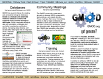

# GMOD Promotion

From GMOD

Jump to: [navigation](#mw-navigation), [search](#p-search)

There are a number of resources available to help spread the word about
the GMOD project. This serves (at least) three interrelated purposes.

1.  It lets people know where tools come from and gives them an idea of
    how they can learn more. Telling people about GMOD can help them
    from being overwhelmed by their data.
2.  This increased visibility leads to increased adoption of tools and
    that leads to more people contributing back to the project.
3.  Increased adoption and development help the project and the
    components get funding.

  

## Contents

- [1 Citing
  GMOD](#Citing_GMOD)
- [2 Powered by
  GMOD](#Powered_by_GMOD)
- [3
  Speakers](#Speakers)
- [4 Presentation
  Material](#Presentation_Material)
  - [4.1
    Graphics](#Graphics)
  - [4.2
    Slides](#Slides)
  - [4.3
    Statistics](#Statistics)
- [5 Presentation
  and Event Promotion](#Presentation_and_Event_Promotion)
- [6 Mugs,
  T-Shirts, Buttons, ...](#Mugs.2C_T-Shirts.2C_Buttons.2C_...)
- [7
  Brochures](#Brochures)

## Citing GMOD

There is not yet a GMOD project paper. It is perpetually on our todo
list. Until that paper comes out, please cite GMOD as

Generic Model Organism Database (GMOD),
<a href="http://gmod.org" class="external free"
rel="nofollow">http://gmod.org</a>

This is an easy way to increase GMOD's visibility and will help
enormously with grants.

If you want to cite a particular page in the wiki, see the <a
href="http://www.ncbi.nlm.nih.gov/bookshelf/br.fcgi?book=citmed&amp;part=A61024#A61262#A61262"
class="external text" rel="nofollow">NCBI guidelines</a> on citing
wikis. The wiki was first 'published' in 2007, although some material
predates that.

## [Powered by GMOD](Powered_by_GMOD "Powered by GMOD")

*"Powered by GMOD"* icons are [available in a number of different
resolutions](Powered_by_GMOD "Powered by GMOD") for inclusion on web
sites, in talks, and on posters and other printed material. This is an
easy way to let people know just how widely used (and how widely useful)
GMOD is.

## Speakers

Speakers are available to give presentations at your institution or
event. Past topics have included project overviews (e.g., [Database
Tools for
Biologists](File:GMODTAMUWorkshop.pdf "File:GMODTAMUWorkshop.pdf") at
Texas A&M), general areas of GMOD (e.g., [GMOD Browser Tools and
Exercises Workshop](ABRF2010_Workshop "ABRF2010 Workshop") at
<a href="http://www.abrf2010.org/" class="external text"
rel="nofollow">ABRF 2010</a> and [GMOD for Comparative
Genomics](File:ISyIPGMODforComparativeGenomics.pdf "File:ISyIPGMODforComparativeGenomics.pdf")
at <a href="https://colloque.inra.fr/isyip" class="external text"
rel="nofollow">ISyIP</a>), and specific [GMOD
Components](GMOD_Components "GMOD Components") (e.g., the
[MAKER](MAKER_PAG_2010_Workshop "MAKER PAG 2010 Workshop") and
[GBrowse_syn](GBrowse_syn_PAG_2010_Workshop "GBrowse syn PAG 2010 Workshop")
workshops at [PAG 2010](PAG_2010 "PAG 2010")). Presentations can range
from short talks (e.g., [Demonstration of Pathway
Tools](File:PathwayToolsTalkISMB2010.pdf "File:PathwayToolsTalkISMB2010.pdf")
at [ISMB 2010](ISMB_2010 "ISMB 2010")), to workshops with multiple
speakers (e.g., <a
href="http://ccg.biology.uiowa.edu/smbe/symposia.php?action=view&amp;sym_ID=27"
class="external text" rel="nofollow">Database tools for evolutionary
genomics</a> at <a href="http://ccg.biology.uiowa.edu/smbe/index.php"
class="external text" rel="nofollow">SMBE 2009</a>), to highly
interactive and hands-on tutorials (e.g., [GBrowse PAG 2010
Workshop](GBrowse_PAG_2010_Workshop "GBrowse PAG 2010 Workshop")). See
[Training and
Outreach](Training_and_Outreach#Workshops.2C_Presentations_and_Posters "Training and Outreach")
for a more complete list of recent topics.

Please contact the [GMOD Help Desk](GMOD_Help_Desk "GMOD Help Desk")
(<a href="mailto:help@gmod.org" class="external text"
rel="nofollow">help@gmod.org</a>) if you are interested in arranging for
a GMOD speaker to present at your institution or event.

## Presentation Material

If you are giving a talk or a poster that either discusses or includes
GMOD related material, then there are a number of resources available
that can help you.

### Graphics

<a
href="http://gmod.org/mediawiki/index.php?title=Special:Upload&amp;wpDestFile=GMOD-three-cogs-200.png"
class="new" title="File:GMOD-three-cogs-200.png">GMOD Logo</a> [GMOD
Project
Logos](Category:GMOD_Project_Logos "Category:GMOD Project Logos") -
Logos related to the project as a whole.

[Logos and Icons](Category:Logos_and_Icons "Category:Logos and Icons") -
Logos and icons, including [GMOD
component](GMOD_Components "GMOD Components") logos.

[Member Logos](Category:Member_Logos "Category:Member Logos") - logos of
organizations that contribute to or use GMOD.

### Slides

- <a href="ftp://ftp.gmod.org/pub/gmod/Resources/GMODProjectSlides.ppt"
  class="external text" rel="nofollow">GMOD Project Slides</a> - this is
  a standard set of slides in PowerPoint format, that can be used to
  describe the GMOD project. Initially, it contains
  - A slide explaining the project
  - Slides showing logos of ~50 GMOD community members
  - Animated slide describing many of the GMOD components
- [Presentations](Category:Presentations "Category:Presentations") and
  [Posters](Category:Posters "Category:Posters") - GMOD.org has an
  extensive collection of GMOD related presentations and posters. As
  well as being informative, these can also be mined for graphics. If
  you do see anything that looks useful to you, please contact the
  author(s) before using it.

### Statistics

A number of GMOD project statistics are recorded on the [Project
Statistics](Project_Statistics "Project Statistics") page. This is
irregularly updated, usually around grant time.

## Presentation and Event Promotion

If you are giving a presentation or event with significant GMOD content,
we can help you spread the word about it in a number of ways:

- Announce it to the appropriate [GMOD Mailing
  Lists](GMOD_Mailing_Lists "GMOD Mailing Lists").
- Post it the [GMOD News](GMOD_News "GMOD News") page and RSS feed.
- Link to it from the appropriate
  [component](GMOD_Components "GMOD Components") pages.
- Add it to the GMOD [Calendar](Calendar "Calendar") and to the
  [Training and
  Outreach](Training_and_Outreach#Workshops.2C_Presentations_and_Posters "Training and Outreach")
  page.

If you are organizing or presenting at an event with significant GMOD
content, then we can help create both a [web
page](Category:Conferences "Category:Conferences"), and a flier for the
event, highlighting that content. We have created fliers in the past for
[ISMB 2010](ISMB_2010 "ISMB 2010"), [PAG 2010](PAG_2010 "PAG 2010"),
[ISMB 2008](ISMB_2008 "ISMB 2008"), and
<a href="../mediawiki/images/2/20/GMODatAGS2008.pdf" class="internal"
title="GMODatAGS2008.pdf">Arthropod Genomics 2008</a>.

Please contact the [GMOD Help Desk](GMOD_Help_Desk "GMOD Help Desk")
(<a href="mailto:help@gmod.org" class="external text"
rel="nofollow">help@gmod.org</a>) if you would like to use this service.

## Mugs, T-Shirts, Buttons, ...

<table>
<colgroup>
<col style="width: 50%" />
<col style="width: 50%" />
</colgroup>
<tbody>
<tr class="odd">
<td>

</td>
<td>
Finally, if you want to let people around you know that you're
keen on GMOD, you can order shirts, mugs, mouse pads, ... from these
online stores:

<ul>
<li><a href="http://www.cafepress.com/GenericMOD" class="external text"
rel="nofollow">GMOD @ CafePress</a></li>
<li><a href="http://www.cafepress.co.uk/sk/JimmyDingo"
class="external text" rel="nofollow">MAKER @ CafePress</a></li>
</ul></td>
</tr>
</tbody>
</table>

## Brochures

A <a href="../mediawiki/images/5/55/GMODTrifoldBrochure2009.ppt"
class="internal" title="GMODTrifoldBrochure2009.ppt">tri-fold
brochure</a> describing the GMOD project and many of its components was
created to give newcomers an overview of the project. If you would like
copies of this brochure:

- Download it and print it yourself
  - <a href="../mediawiki/images/5/55/GMODTrifoldBrochure2009.ppt"
    class="internal" title="GMODTrifoldBrochure2009.ppt">PowerPoint
    format</a>
  - <a href="../mediawiki/images/8/85/GMODTrifoldBrochure2009Page1.png"
    class="internal" title="GMODTrifoldBrochure2009Page1.png">Page 1</a>
    and
    <a href="../mediawiki/images/f/f6/GMODTrifoldBrochure2009Page2.png"
    class="internal" title="GMODTrifoldBrochure2009Page2.png">Page 2</a>
    as high-resolution images, suitable for sending to a printer.

We printed 500 of these in late 2009 and they are all gone.

Retrieved from
"<http://gmod.org/mediawiki/index.php?title=GMOD_Promotion&oldid=22721>"

[Categories](Special:Categories "Special:Categories"):

- <a
  href="http://gmod.org/mediawiki/index.php?title=Category:Pages_with_broken_file_links&amp;action=edit&amp;redlink=1"
  class="new"
  title="Category:Pages with broken file links (page does not exist)">Pages
  with broken file links</a>
- [Conferences](Category:Conferences "Category:Conferences")
- [Education and
  Outreach](Category:Education_and_Outreach "Category:Education and Outreach")
- [Events](Category:Events "Category:Events")
- [GMOD Project](Category:GMOD_Project "Category:GMOD Project")

## Navigation menu

### Namespaces

- <a href="GMOD_Promotion" accesskey="c"
  title="View the content page [c]">Page</a>
- <a href="Talk:GMOD_Promotion" accesskey="t"
  title="Discussion about the content page [t]">Discussion</a>

### 

### Variants

### Navigation

- [GMOD Home](Main_Page)
- [Software](GMOD_Components)
- [Categories /
  Tags](Categories)
- [View all pages](Special:AllPages)

### Documentation

- [Overview](Overview)
- [FAQs](Category:FAQ)
- [HOWTOs](Category:HOWTO)
- [Glossary](Glossary)

### Community

- [GMOD News](GMOD_News)
- [Training /
  Outreach](Training_and_Outreach)
- [Support](Support)
- [GMOD Promotion](GMOD_Promotion)
- [Meetings](Meetings)
- [Calendar](Calendar)

### Tools

- <a href="Special:Browse/GMOD_Promotion" rel="smw-browse">Browse
  properties</a>
- [Print as
  PDF](http://gmod.org/mediawiki/index.php?title=Special:PdfPrint&page=GMOD_Promotion)

- Last updated at 18:14 on 8 January
  2013.
- 422,729 page views.
- Content is available under
  <a href="http://www.gnu.org/licenses/fdl-1.3.html" class="external"
  rel="nofollow">a GNU Free Documentation License</a> unless otherwise
  noted.

<!-- -->

- [About
  GMOD](GMOD:About "GMOD:About")

<!-- -->

- 
- 
  

