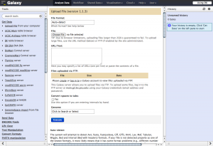
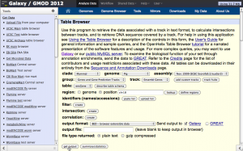
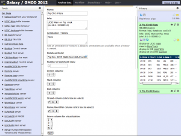

# Galaxy

From GMOD

Jump to: [navigation](#mw-navigation), [search](#p-search)

Status

- Mature release
- Development: active
- Support: active

Licence

<a href="http://opensource.org/licenses/AFL-3.0" class="external text"
rel="nofollow">Academic Free License 3.0</a>

Resources

- <a href="https://galaxyproject.org/" class="external text"
  rel="nofollow">Home page</a>

<!-- -->

- <a href="http://getgalaxy.org/" class="external text"
  rel="nofollow">Download</a>

<!-- -->

- <a href="https://github.com/galaxyproject/galaxy/" class="external text"
  rel="nofollow">Source code</a>

<!-- -->

- <a href="https://galaxyproject.org/use/" class="external text"
  rel="nofollow">Public server</a>

  

## Contents

- [1 About
  Galaxy](#About_Galaxy)
  - [1.1 2019
    Galaxy Community
    Conference](#2019_Galaxy_Community_Conference)
  - [1.2
    Screenshots](#Screenshots)
- [2
  Downloads](#Downloads)
- [3 Using
  Galaxy](#Using_Galaxy)
- [4
  Documentation](#Documentation)
- [5 Publications,
  Tutorials, and
  Presentations](#Publications.2C_Tutorials.2C_and_Presentations)
  - [5.1
    Publications on or mentioning
    Galaxy](#Publications_on_or_mentioning_Galaxy)
  - [5.2
    Tutorials](#Tutorials)
- [6 Contacts and
  Mailing Lists](#Contacts_and_Mailing_Lists)
- [7 Galaxy in the
  wild](#Galaxy_in_the_wild)
- [8 More on
  Galaxy](#More_on_Galaxy)

## About Galaxy

<a href="https://galaxyproject.org/" class="external text"
rel="nofollow">Galaxy</a> is an open, web-based platform for
*accessible, reproducible, and transparent* computational biomedical
research.

- *Accessibility:* Galaxy enables users without programming experience
  to easily specify parameters and run tools and workflows.
- *Reproducibility:* Galaxy captures all information necessary so that
  any user can repeat and understand a complete computational analysis.
- *Transparency:* Galaxy enables users to share and publish analyses via
  the web and create Pages--interactive, web-based documents that
  describe a complete analysis.

Galaxy is open source for all organizations and is
<a href="https://galaxyproject.org/use/" class="external text"
rel="nofollow">available on a wide variety of platforms and publicly
accessible websites</a>. Galaxy servers make analysis tools, genomic
data, tutorial demonstrations, persistent workspaces, and publication
services available to any scientist that has access to the Internet.
Local Galaxy servers can be set up by
<a href="http://getgalaxy.org/" class="external text"
rel="nofollow">downloading the Galaxy application</a> and customizing it
to meet particular needs.

  

### 2019 Galaxy Community Conference

The
<a href="https://galaxyproject.org/events/gcc2019" class="external text"
rel="nofollow">2019 Galaxy Community Conference (GCC2019)</a> will be
held 1-6 July, in Freiburg Germany.
<a href="https://galaxyproejct.org/gcc2" class="external text"
rel="nofollow">Galaxy Community Conferences</a> are an opportunity to
participate in presentations, discussions, poster sessions, lightning
talks and breakouts, all about high-throughput biology and the tools
that support it.  The 2019 conference includes training that offers
in-depth topic coverage across several concurrent sessions, and a
CollaborationFest.

  
Visit the <a href="https://galaxyproject.org/" class="external text"
rel="nofollow">Galaxy website</a>.

### Screenshots

Galaxy 'Upload file' tool

Galaxy 'Table Browser' tool

Editing the attributes of a data set in Galaxy

## Downloads

- <a href="http://getgalaxy.org/" class="external text"
  rel="nofollow">Download Galaxy</a>.

<!-- -->

- <a href="https://github.com/galaxyproject/galaxy/" class="external text"
  rel="nofollow">Download the source code for Galaxy</a>.

## Using Galaxy

Galaxy aims to be a zero configuration entirely self-contained system
that provides a lightweight webserver, an embedded database and a
multi-threaded job manager. All tools (and their parameters) can be
specified via simple XML based configuration files.

Full documentation on all aspects of getting, installing, and using
Galaxy is available from the
<a href="https://galaxyproject.org/" class="external text"
rel="nofollow">Galaxy Community Hub</a>.

  

## Documentation

- <a href="https://galaxyproject.org/learn" class="external text"
  rel="nofollow">User documentation</a>
- <a href="https://docs.galaxyproject.org/" class="external text"
  rel="nofollow">Source code documentation</a>
- <a href="https://galaxyproject.org/search/" class="external text"
  rel="nofollow">Search the whole universe of Galaxy docs</a>

## Publications, Tutorials, and Presentations

### Publications on or mentioning Galaxy

See
<a href="https://galaxyproject.org/citing-galaxy" class="external text"
rel="nofollow">Citing Galaxy</a> for a core list of 25+ papers on
Galaxy, and the <a href="https://www.zotero.org/groups/1732893/galaxy"
class="external text" rel="nofollow">Galaxy publication library</a> for
a fuller list of papers mentioning or using Galaxy.

### Tutorials

  
A wealth of community created and maintained training materials are
available:

- <a href="https://training.galaxyproject.org" class="external text"
  rel="nofollow">Galaxy Training website</a>

  

## Contacts and Mailing Lists

<table class="wikitable">
<colgroup>
<col style="width: 25%" />
<col style="width: 25%" />
<col style="width: 25%" />
<col style="width: 25%" />
</colgroup>
<tbody>
<tr class="odd">
<td></td>
<td>Mailing List Link</td>
<td>Description</td>
<td>Archive(s)</td>
</tr>
<tr class="even">
<td rowspan="3"><strong>Galaxy</strong> 
&#10;(<a href="http://galaxyproject.org/search/" class="external text"
rel="nofollow">Search everything</a>)</td>
<td><a href="http://announce.list.galaxyproject.org/"
class="external text" rel="nofollow">galaxy-announce</a></td>
<td>Announcements of interest to the <strong>Galaxy</strong> community.
<em>Low volume and moderated.</em></td>
<td><a href="http://announce.list.galaxyproject.org/"
class="external text" rel="nofollow">Nabble</a>, <a
href="https://lists.galaxyproject.org/archives/list/galaxy-announce@lists.galaxyproject.org/"
class="external text" rel="nofollow">Mailman</a></td>
</tr>
<tr class="odd">
<td><a href="https://help.galaxyproject.org/" class="external text"
rel="nofollow">Galaxy Help</a></td>
<td>General questions and discussion about using
<strong>Galaxy</strong>. Also used for announcements relevant to the
Galaxy user community. <em>This is not a mailing list, but an online
forum, based on the popular <a href="https://www.discourse.org/"
class="external text" rel="nofollow">Discourse platform</a>.</em> High
volume.</td>
<td></td>
</tr>
<tr class="even">
<td><a href="http://dev.list.galaxyproject.org/" class="external text"
rel="nofollow">galaxy-dev</a></td>
<td>Discussion and questions regarding local installations and
development of <strong>Galaxy</strong>. <em>Medium volume.</em></td>
<td><a href="http://dev.list.galaxyproject.org/" class="external text"
rel="nofollow">Nabble</a>, <a
href="https://lists.galaxyproject.org/archives/list/galaxy-dev@lists.galaxyproject.org/"
class="external text" rel="nofollow">Mailman</a></td>
</tr>
</tbody>
</table>

## Galaxy in the wild

Public installations of Galaxy:

- <a href="http://wiki.galaxyproject.org/PublicGalaxyServers"
  class="external text" rel="nofollow">ully supported, publicly accessible
  platforms for using Galaxy</a>

  

  

## More on Galaxy

See [Category%3AGalaxy](Category%3AGalaxy "Category%3AGalaxy")

  

Retrieved from
"<http://gmod.org/mediawiki/index.php?title=Galaxy&oldid=27720>"

[Categories](Special%3ACategories "Special%3ACategories"):

- [GMOD Component](Category%3AGMOD_Component "Category%3AGMOD Component")
- <a
  href="http://gmod.org/mediawiki/index.php?title=Category%3ASemanticLink&amp;action=edit&amp;redlink=1"
  class="new"
  title="Category%3ASemanticLink (page does not exist)">SemanticLink</a>
- [Analysis](Category%3AAnalysis "Category%3AAnalysis")
- [Annotation](Category%3AAnnotation "Category%3AAnnotation")
- [Comparative
  Genomics](Category%3AComparative_Genomics "Category%3AComparative Genomics")
- [GMOD Components](Category%3AGMOD_Components "Category%3AGMOD Components")
- [Galaxy](Category%3AGalaxy "Category%3AGalaxy")

Facts about
"[Galaxy](Special%3ABrowse/Galaxy "Special%3ABrowse/Galaxy")"[RDF
feed](http://gmod.org/wiki/Special:ExportRDF/Galaxy "Special:ExportRDF/Galaxy")

<table class="smwfacttable">
<colgroup>
<col style="width: 50%" />
<col style="width: 50%" />
</colgroup>
<tbody>
<tr class="odd row-odd">
<td class="smwpropname"><a href="Property%3AAvailable_on_platform"
title="Property:Available on platform">Available on platform</a></td>
<td class="smwprops">web <a
href="Special%3ASearchByProperty/Available-20on-20platform/web"
title="Special%3ASearchByProperty/Available-20on-20platform/web">+</a></td>
</tr>
<tr class="even row-even">
<td class="smwpropname"><a href="Property%3AHas_URL"
title="Property:Has URL">Has URL</a></td>
<td class="smwprops"><a href="http://getgalaxy.org/"
class="external free" rel="nofollow">http://getgalaxy.org/</a> <a
href="Special%3ASearchByProperty/Has-20URL/http%3A-2F-2Fgetgalaxy.org-2F"
title="Special%3ASearchByProperty/Has-20URL/http%3A-2F-2Fgetgalaxy.org-2F">+</a>,
<a href="https://github.com/galaxyproject/galaxy/" class="external free"
rel="nofollow">https://github.com/galaxyproject/galaxy/</a> <a
href="Special%3ASearchByProperty/Has-20URL/https%3A-2F-2Fgithub.com-2Fgalaxyproject-2Fgalaxy-2F"
title="Special%3ASearchByProperty/Has-20URL/https%3A-2F-2Fgithub.com-2Fgalaxyproject-2Fgalaxy-2F">+</a>,
<a href="https://docs.galaxyproject.org" class="external free"
rel="nofollow">https://docs.galaxyproject.org</a> <a
href="Special%3ASearchByProperty/Has-20URL/https%3A-2F-2Fdocs.galaxyproject.org"
title="Special%3ASearchByProperty/Has-20URL/https%3A-2F-2Fdocs.galaxyproject.org">+</a>,
<a href="https://galaxyproject.org/" class="external free"
rel="nofollow">https://galaxyproject.org/</a> <a
href="Special%3ASearchByProperty/Has-20URL/https%3A-2F-2Fgalaxyproject.org-2F"
title="Special%3ASearchByProperty/Has-20URL/https%3A-2F-2Fgalaxyproject.org-2F">+</a>,
<a href="https://twitter.com/galaxyproject" class="external free"
rel="nofollow">https://twitter.com/galaxyproject</a> <a
href="Special%3ASearchByProperty/Has-20URL/https%3A-2F-2Ftwitter.com-2Fgalaxyproject"
title="Special%3ASearchByProperty/Has-20URL/https%3A-2F-2Ftwitter.com-2Fgalaxyproject">+</a>,
<a href="https://www.zotero.org/groups/1732893/galaxy"
class="external free"
rel="nofollow">https://www.zotero.org/groups/1732893/galaxy</a> <a
href="Special%3ASearchByProperty/Has-20URL/https%3A-2F-2Fwww.zotero.org-2Fgroups-2F1732893-2Fgalaxy"
title="Special%3ASearchByProperty/Has-20URL/https%3A-2F-2Fwww.zotero.org-2Fgroups-2F1732893-2Fgalaxy">+</a>,
<a href="https://galaxyproject.org/use/" class="external free"
rel="nofollow">https://galaxyproject.org/use/</a> <a
href="Special%3ASearchByProperty/Has-20URL/https%3A-2F-2Fgalaxyproject.org-2Fuse-2F"
title="Special%3ASearchByProperty/Has-20URL/https%3A-2F-2Fgalaxyproject.org-2Fuse-2F">+</a>,
<a href="http://wiki.galaxyproject.org/PublicGalaxyServers"
class="external free"
rel="nofollow">http://wiki.galaxyproject.org/PublicGalaxyServers</a>
<a
href="Special%3ASearchByProperty/Has-20URL/http%3A-2F-2Fwiki.galaxyproject.org-2FPublicGalaxyServers"
title="Special%3ASearchByProperty/Has-20URL/http%3A-2F-2Fwiki.galaxyproject.org-2FPublicGalaxyServers">+</a>
and <a href="https://galaxyproject.github.io" class="external free"
rel="nofollow">https://galaxyproject.github.io</a> <a
href="Special%3ASearchByProperty/Has-20URL/https%3A-2F-2Fgalaxyproject.github.io"
title="Special%3ASearchByProperty/Has-20URL/https%3A-2F-2Fgalaxyproject.github.io">+</a></td>
</tr>
<tr class="odd row-odd">
<td class="smwpropname"><a href="Property%3AHas_description"
title="Property:Has description">Has description</a></td>
<td class="smwprops"><a href="https://galaxyproject.org/"
class="external text" rel="nofollow">Galaxy</a> is an  … <a href="https://galaxyproject.org/"
class="external text" rel="nofollow">Galaxy</a> is an open, web-based
platform for <em>accessible, reproducible, and transparent</em>
computational biomedical research. 
<ul>
<li><em>Accessibility:</em> Galaxy enables users without programming
experience to easily specify parameters and run tools and
workflows.</li>
<li><em>Reproducibility:</em> Galaxy captures all information necessary
so that any user can repeat and understand a complete computational
analysis.</li>
<li><em>Transparency:</em> Galaxy enables users to share and publish
analyses via the web and create Pages--interactive, web-based documents
that describe a complete analysis.</li>
</ul>

Galaxy is open source for all organizations and is <a
href="https://galaxyproject.org/use/" class="external text"
rel="nofollow">available on a wide variety of platforms and publicly
accessible websites</a>. Galaxy servers make analysis tools, genomic
data, tutorial demonstrations, persistent workspaces, and publication
services available to any scientist that has access to the Internet.
Local Galaxy servers can be set up by <a href="http://getgalaxy.org/"
class="external text" rel="nofollow">downloading the Galaxy
application</a> and customizing it to meet particular needs.

 

<h3 id="galaxy-community-conferenceedit">2019 Galaxy
Community Conference[<a
href="http://gmod.org/mediawiki/index.php?title=Galaxy&amp;action=edit&amp;section=1"
title="Edit section: 2019 Galaxy Community Conference">edit</a>]</h3>
The <a href="https://galaxyproject.org/events/gcc2019"
class="external text" rel="nofollow">2019 Galaxy Community Conference
(GCC2019)</a> will be held 1-6 July, in Freiburg Germany. <a
href="https://galaxyproejct.org/gcc2" class="external text"
rel="nofollow">Galaxy Community Conferences</a> are an opportunity to
participate in presentations, discussions, poster sessions, lightning
talks and breakouts, all about high-throughput biology and the tools
that support it.  The 2019 conference includes training that offers
in-depth topic coverage across several concurrent sessions, and a
CollaborationFest.current sessions, and a CollaborationFest. <a
href="http://gmod.org/mediawiki/index.php?title=Special%3ASearchByProperty&amp;x=Has-20description%2F-5Bhttps%3A-2F-2Fgalaxyproject.org-2F-20Galaxy-5D-20is-20an-20open%2C-20web-2Dbased-20platform-20for-20-27-27accessible%2C-20reproducible%2C-20and-20transparent-27-27-20computational-20biomedical-20research.-0A%2A-20-27-27Accessibility%3A-27-27-20Galaxy-20enables-20users-20without-20programming-20experience-20to-20easily-20specify-20parameters-20and-20run-20tools-20and-20workflows.-0A%2A-20-27-27Reproducibility%3A-27-27-20Galaxy-20captures-20all-20information-20necessary-20so-20that-20any-20user-20can-20repeat-20and-20understand-20a-20complete-20computational-20analysis.-0A%2A-20-27-27Transparency%3A-27-27-20Galaxy-20enables-20users-20to-20share-20and-20publish-20analyses-20via-20the-20web-20and-20create-20Pages-2D-2Dinteractive%2C-20web-2Dbased-20documents-20that-20describe-20a-20complete-20analysis.-0A-0AGalaxy-20is-20open-20source-20for-20all-20organizations-20and-20is-20-5Bhttps%3A-2F-2Fgalaxyproject.org-2Fuse-2F-20available-20on-20a-20wide-20variety-20of-20platforms-20and-20publicly-20accessible-20websites-5D.-20Galaxy-20servers-20make-20analysis-20tools%2C-20genomic-20data%2C-20tutorial-20demonstrations%2C-20persistent-20workspaces%2C-20and-20publication-20services-20available-20to-20any-20scientist-20that-20has-20access-20to-20the-20Internet.-20Local-20Galaxy-20servers-20can-20be-20set-20up-20by-20-5Bhttp%3A-2F-2Fgetgalaxy.org-2F-20downloading-20the-20Galaxy-20application-5D-20and-20customizing-20it-20to-20meet-20particular-20needs.-0A-0A-0A-5B-5BFile%3AGCC2019Logo.png-7Cleft-7C250px-7Clink%3Dhttps%3A-2F-2Fgalaxyproject.org-2Fevents-2Fgcc2019-2F-202019-20Galaxy-20Community-20Conference-5D-5D-0A-0A%3D%3D%3D-202019-20Galaxy-20Community-20Conference-20%3D%3D%3D-0A-0AThe-20-5Bhttps%3A-2F-2Fgalaxyproject.org-2Fevents-2Fgcc2019-202019-20Galaxy-20Community-20Conference-20%28GCC2019%29-5D-20will-20be-20held-201-2D6-20July%2C-20in-20Freiburg-20Germany.-20-5Bhttps%3A-2F-2Fgalaxyproejct.org-2Fgcc2-20Galaxy-20Community-20Conferences-5D-20are-20an-20opportunity-20to-20participate-20in-20presentations%2C-20discussions%2C-20poster-20sessions%2C-20lightning-20talks-20and-20breakouts%2C-20all-20about-20high-2Dthroughput-20biology-20and-20the-20tools-20that-20support-20it.-20%C2%A0The-202019-20conference-20includes-20training-20that-20offers-20in-2Ddepth-20topic-20coverage-20across-20several-20concurrent-20sessions%2C-20and-20a-20CollaborationFest."
class="external text" rel="nofollow">+</a> and Fully supported,
publicly accessible platforms for using Galaxy <a
href="Special%3ASearchByProperty/Has-20description/Fully-20supported,-20publicly-20accessible-20platforms-20for-20using-20Galaxy"
title="Special%3ASearchByProperty/Has-20description/Fully-20supported,-20publicly-20accessible-20platforms-20for-20using-20Galaxy">+</a></td>
</tr>
<tr class="even row-even">
<td class="smwpropname"><a href="Property%3AHas_development_status"
title="Property:Has development status">Has development status</a></td>
<td class="smwprops">active <a
href="Special%3ASearchByProperty/Has-20development-20status/active"
title="Special%3ASearchByProperty/Has-20development-20status/active">+</a></td>
</tr>
<tr class="odd row-odd">
<td class="smwpropname"><a href="Property%3AHas_input_format"
title="Property:Has input format">Has input format</a></td>
<td class="smwprops">Roadmaps <a
href="Special%3ASearchByProperty/Has-20input-20format/Roadmaps"
title="Special%3ASearchByProperty/Has-20input-20format/Roadmaps">+</a>,
Sequences <a
href="Special%3ASearchByProperty/Has-20input-20format/Sequences"
title="Special%3ASearchByProperty/Has-20input-20format/Sequences">+</a>,
ab1 <a
href="Special%3ASearchByProperty/Has-20input-20format/ab1"
title="Special%3ASearchByProperty/Has-20input-20format/ab1">+</a>,
affybatch <a
href="Special%3ASearchByProperty/Has-20input-20format/affybatch"
title="Special%3ASearchByProperty/Has-20input-20format/affybatch">+</a>,
afg <a
href="Special%3ASearchByProperty/Has-20input-20format/afg"
title="Special%3ASearchByProperty/Has-20input-20format/afg">+</a>,
axt <a
href="Special%3ASearchByProperty/Has-20input-20format/axt"
title="Special%3ASearchByProperty/Has-20input-20format/axt">+</a>,
bam <a
href="Special%3ASearchByProperty/Has-20input-20format/bam"
title="Special%3ASearchByProperty/Has-20input-20format/bam">+</a>,
bcf <a
href="Special%3ASearchByProperty/Has-20input-20format/bcf"
title="Special%3ASearchByProperty/Has-20input-20format/bcf">+</a>,
bed <a
href="Special%3ASearchByProperty/Has-20input-20format/bed"
title="Special%3ASearchByProperty/Has-20input-20format/bed">+</a>,
bedgraph <a
href="Special%3ASearchByProperty/Has-20input-20format/bedgraph"
title="Special%3ASearchByProperty/Has-20input-20format/bedgraph">+</a>,
bigbed <a
href="Special%3ASearchByProperty/Has-20input-20format/bigbed"
title="Special%3ASearchByProperty/Has-20input-20format/bigbed">+</a>,
bigwig <a
href="Special%3ASearchByProperty/Has-20input-20format/bigwig"
title="Special%3ASearchByProperty/Has-20input-20format/bigwig">+</a>,
bowtie_base_index <a
href="Special%3ASearchByProperty/Has-20input-20format/bowtie_base_index"
title="Special%3ASearchByProperty/Has-20input-20format/bowtie base index">+</a>,
bowtie_color_index <a
href="Special%3ASearchByProperty/Has-20input-20format/bowtie_color_index"
title="Special%3ASearchByProperty/Has-20input-20format/bowtie color index">+</a>,
chrint <a
href="Special%3ASearchByProperty/Has-20input-20format/chrint"
title="Special%3ASearchByProperty/Has-20input-20format/chrint">+</a>,
cisml <a
href="Special%3ASearchByProperty/Has-20input-20format/cisml"
title="Special%3ASearchByProperty/Has-20input-20format/cisml">+</a>,
csfasta <a
href="Special%3ASearchByProperty/Has-20input-20format/csfasta"
title="Special%3ASearchByProperty/Has-20input-20format/csfasta">+</a>,
csv <a
href="Special%3ASearchByProperty/Has-20input-20format/csv"
title="Special%3ASearchByProperty/Has-20input-20format/csv">+</a>,
eland <a
href="Special%3ASearchByProperty/Has-20input-20format/eland"
title="Special%3ASearchByProperty/Has-20input-20format/eland">+</a>,
elandmulti <a
href="Special%3ASearchByProperty/Has-20input-20format/elandmulti"
title="Special%3ASearchByProperty/Has-20input-20format/elandmulti">+</a>,
encodepeak <a
href="Special%3ASearchByProperty/Has-20input-20format/encodepeak"
title="Special%3ASearchByProperty/Has-20input-20format/encodepeak">+</a>,
eset <a
href="Special%3ASearchByProperty/Has-20input-20format/eset"
title="Special%3ASearchByProperty/Has-20input-20format/eset">+</a>,
fasta <a
href="Special%3ASearchByProperty/Has-20input-20format/fasta"
title="Special%3ASearchByProperty/Has-20input-20format/fasta">+</a>,
fastq <a
href="Special%3ASearchByProperty/Has-20input-20format/fastq"
title="Special%3ASearchByProperty/Has-20input-20format/fastq">+</a>,
fastqcssanger <a
href="Special%3ASearchByProperty/Has-20input-20format/fastqcssanger"
title="Special%3ASearchByProperty/Has-20input-20format/fastqcssanger">+</a>,
fastqillumina <a
href="Special%3ASearchByProperty/Has-20input-20format/fastqillumina"
title="Special%3ASearchByProperty/Has-20input-20format/fastqillumina">+</a>,
fastqsanger <a
href="Special%3ASearchByProperty/Has-20input-20format/fastqsanger"
title="Special%3ASearchByProperty/Has-20input-20format/fastqsanger">+</a>,
fastqsolexa <a
href="Special%3ASearchByProperty/Has-20input-20format/fastqsolexa"
title="Special%3ASearchByProperty/Has-20input-20format/fastqsolexa">+</a>,
fli <a
href="Special%3ASearchByProperty/Has-20input-20format/fli"
title="Special%3ASearchByProperty/Has-20input-20format/fli">+</a>,
fped <a
href="Special%3ASearchByProperty/Has-20input-20format/fped"
title="Special%3ASearchByProperty/Has-20input-20format/fped">+</a>,
fphe <a
href="Special%3ASearchByProperty/Has-20input-20format/fphe"
title="Special%3ASearchByProperty/Has-20input-20format/fphe">+</a>,
fqtoc <a
href="Special%3ASearchByProperty/Has-20input-20format/fqtoc"
title="Special%3ASearchByProperty/Has-20input-20format/fqtoc">+</a>,
gatk_dbsnp <a
href="Special%3ASearchByProperty/Has-20input-20format/gatk_dbsnp"
title="Special%3ASearchByProperty/Has-20input-20format/gatk dbsnp">+</a>,
gatk_interval <a
href="Special%3ASearchByProperty/Has-20input-20format/gatk_interval"
title="Special%3ASearchByProperty/Has-20input-20format/gatk interval">+</a>,
gatk_recal <a
href="Special%3ASearchByProperty/Has-20input-20format/gatk_recal"
title="Special%3ASearchByProperty/Has-20input-20format/gatk recal">+</a>,
gatk_report <a
href="Special%3ASearchByProperty/Has-20input-20format/gatk_report"
title="Special%3ASearchByProperty/Has-20input-20format/gatk report">+</a>,
gatk_tranche <a
href="Special%3ASearchByProperty/Has-20input-20format/gatk_tranche"
title="Special%3ASearchByProperty/Has-20input-20format/gatk tranche">+</a>,
gd_indivs <a
href="Special%3ASearchByProperty/Has-20input-20format/gd_indivs"
title="Special%3ASearchByProperty/Has-20input-20format/gd indivs">+</a>,
gd_ped <a
href="Special%3ASearchByProperty/Has-20input-20format/gd_ped"
title="Special%3ASearchByProperty/Has-20input-20format/gd ped">+</a>,
gd_sap <a
href="Special%3ASearchByProperty/Has-20input-20format/gd_sap"
title="Special%3ASearchByProperty/Has-20input-20format/gd sap">+</a>,
gd_snp <a
href="Special%3ASearchByProperty/Has-20input-20format/gd_snp"
title="Special%3ASearchByProperty/Has-20input-20format/gd snp">+</a>,
<a href="GFF" title="GFF">GFF</a> <a
href="Special%3ASearchByProperty/Has-20input-20format/-5B-5BGFF-5D-5D"
title="Special%3ASearchByProperty/Has-20input-20format/-5B-5BGFF-5D-5D">+</a>,
<a href="GFF3" title="GFF3">GFF3</a> <a
href="Special%3ASearchByProperty/Has-20input-20format/-5B-5BGFF3-5D-5D"
title="Special%3ASearchByProperty/Has-20input-20format/-5B-5BGFF3-5D-5D">+</a>,
gtf <a
href="Special%3ASearchByProperty/Has-20input-20format/gtf"
title="Special%3ASearchByProperty/Has-20input-20format/gtf">+</a>,
interval <a
href="Special%3ASearchByProperty/Has-20input-20format/interval"
title="Special%3ASearchByProperty/Has-20input-20format/interval">+</a>,
lav <a
href="Special%3ASearchByProperty/Has-20input-20format/lav"
title="Special%3ASearchByProperty/Has-20input-20format/lav">+</a>,
ldindep <a
href="Special%3ASearchByProperty/Has-20input-20format/ldindep"
title="Special%3ASearchByProperty/Has-20input-20format/ldindep">+</a>,
len <a
href="Special%3ASearchByProperty/Has-20input-20format/len"
title="Special%3ASearchByProperty/Has-20input-20format/len">+</a>,
linecount <a
href="Special%3ASearchByProperty/Has-20input-20format/linecount"
title="Special%3ASearchByProperty/Has-20input-20format/linecount">+</a>,
lped <a
href="Special%3ASearchByProperty/Has-20input-20format/lped"
title="Special%3ASearchByProperty/Has-20input-20format/lped">+</a>,
maf <a
href="Special%3ASearchByProperty/Has-20input-20format/maf"
title="Special%3ASearchByProperty/Has-20input-20format/maf">+</a>,
malist <a
href="Special%3ASearchByProperty/Has-20input-20format/malist"
title="Special%3ASearchByProperty/Has-20input-20format/malist">+</a>,
memexml <a
href="Special%3ASearchByProperty/Has-20input-20format/memexml"
title="Special%3ASearchByProperty/Has-20input-20format/memexml">+</a>,
nex <a
href="Special%3ASearchByProperty/Has-20input-20format/nex"
title="Special%3ASearchByProperty/Has-20input-20format/nex">+</a>,
nhx <a
href="Special%3ASearchByProperty/Has-20input-20format/nhx"
title="Special%3ASearchByProperty/Has-20input-20format/nhx">+</a>,
pbed <a
href="Special%3ASearchByProperty/Has-20input-20format/pbed"
title="Special%3ASearchByProperty/Has-20input-20format/pbed">+</a>,
phyloxml <a
href="Special%3ASearchByProperty/Has-20input-20format/phyloxml"
title="Special%3ASearchByProperty/Has-20input-20format/phyloxml">+</a>,
picard_interval_list <a
href="Special%3ASearchByProperty/Has-20input-20format/picard_interval_list"
title="Special%3ASearchByProperty/Has-20input-20format/picard interval list">+</a>,
pileup <a
href="Special%3ASearchByProperty/Has-20input-20format/pileup"
title="Special%3ASearchByProperty/Has-20input-20format/pileup">+</a>,
pphe <a
href="Special%3ASearchByProperty/Has-20input-20format/pphe"
title="Special%3ASearchByProperty/Has-20input-20format/pphe">+</a>,
qual454 <a
href="Special%3ASearchByProperty/Has-20input-20format/qual454"
title="Special%3ASearchByProperty/Has-20input-20format/qual454">+</a>,
qualillumina <a
href="Special%3ASearchByProperty/Has-20input-20format/qualillumina"
title="Special%3ASearchByProperty/Has-20input-20format/qualillumina">+</a>,
qualsolexa <a
href="Special%3ASearchByProperty/Has-20input-20format/qualsolexa"
title="Special%3ASearchByProperty/Has-20input-20format/qualsolexa">+</a>,
qualsolid <a
href="Special%3ASearchByProperty/Has-20input-20format/qualsolid"
title="Special%3ASearchByProperty/Has-20input-20format/qualsolid">+</a>,
sam <a
href="Special%3ASearchByProperty/Has-20input-20format/sam"
title="Special%3ASearchByProperty/Has-20input-20format/sam">+</a>,
scf <a
href="Special%3ASearchByProperty/Has-20input-20format/scf"
title="Special%3ASearchByProperty/Has-20input-20format/scf">+</a>,
sff <a
href="Special%3ASearchByProperty/Has-20input-20format/sff"
title="Special%3ASearchByProperty/Has-20input-20format/sff">+</a>,
snpmatrix <a
href="Special%3ASearchByProperty/Has-20input-20format/snpmatrix"
title="Special%3ASearchByProperty/Has-20input-20format/snpmatrix">+</a>,
snptest <a
href="Special%3ASearchByProperty/Has-20input-20format/snptest"
title="Special%3ASearchByProperty/Has-20input-20format/snptest">+</a>,
tabular <a
href="Special%3ASearchByProperty/Has-20input-20format/tabular"
title="Special%3ASearchByProperty/Has-20input-20format/tabular">+</a>,
taxonomy <a
href="Special%3ASearchByProperty/Has-20input-20format/taxonomy"
title="Special%3ASearchByProperty/Has-20input-20format/taxonomy">+</a>,
twobit <a
href="Special%3ASearchByProperty/Has-20input-20format/twobit"
title="Special%3ASearchByProperty/Has-20input-20format/twobit">+</a>,
txt <a
href="Special%3ASearchByProperty/Has-20input-20format/txt"
title="Special%3ASearchByProperty/Has-20input-20format/txt">+</a>,
vcf <a
href="Special%3ASearchByProperty/Has-20input-20format/vcf"
title="Special%3ASearchByProperty/Has-20input-20format/vcf">+</a>,
velvet <a
href="Special%3ASearchByProperty/Has-20input-20format/velvet"
title="Special%3ASearchByProperty/Has-20input-20format/velvet">+</a>,
wig <a
href="Special%3ASearchByProperty/Has-20input-20format/wig"
title="Special%3ASearchByProperty/Has-20input-20format/wig">+</a>
and xml <a
href="Special%3ASearchByProperty/Has-20input-20format/xml"
title="Special%3ASearchByProperty/Has-20input-20format/xml">+</a></td>
</tr>
<tr class="even row-even">
<td class="smwpropname"><a href="Property%3AHas_licence"
title="Property:Has licence">Has licence</a></td>
<td class="smwprops"><a href="http://opensource.org/licenses/AFL-3.0"
class="external text" rel="nofollow">Academic Free License 3.0</a> <a
href="Special%3ASearchByProperty/Has-20licence/-5Bhttp%3A-2F-2Fopensource.org-2Flicenses-2FAFL-2D3.0-20Academic-20Free-20License-203.0-5D"
title="Special%3ASearchByProperty/Has-20licence/-5Bhttp%3A-2F-2Fopensource.org-2Flicenses-2FAFL-2D3.0-20Academic-20Free-20License-203.0-5D">+</a></td>
</tr>
<tr class="odd row-odd">
<td class="smwpropname"><a href="Property%3AHas_logo"
title="Property:Has logo">Has logo</a></td>
<td class="smwprops">GalaxyLogoBigger.png <a
href="Special%3ASearchByProperty/Has-20logo/GalaxyLogoBigger.png"
title="Special%3ASearchByProperty/Has-20logo/GalaxyLogoBigger.png">+</a></td>
</tr>
<tr class="even row-even">
<td class="smwpropname"><a href="Property%3AHas_output_format"
title="Property:Has output format">Has output format</a></td>
<td class="smwprops">zillions! <a
href="Special%3ASearchByProperty/Has-20output-20format/zillions!"
title="Special%3ASearchByProperty/Has-20output-20format/zillions!">+</a></td>
</tr>
<tr class="odd row-odd">
<td class="smwpropname"><a href="Property%3AHas_software_maturity_status"
title="Property:Has software maturity status">Has software maturity
status</a></td>
<td class="smwprops">mature <a
href="Special%3ASearchByProperty/Has-20software-20maturity-20status/mature"
title="Special%3ASearchByProperty/Has-20software-20maturity-20status/mature">+</a></td>
</tr>
<tr class="even row-even">
<td class="smwpropname"><a href="Property%3AHas_support_status"
title="Property:Has support status">Has support status</a></td>
<td class="smwprops">active <a
href="Special%3ASearchByProperty/Has-20support-20status/active"
title="Special%3ASearchByProperty/Has-20support-20status/active">+</a></td>
</tr>
<tr class="odd row-odd">
<td class="smwpropname"><a href="Property%3AHas_title"
title="Property:Has title">Has title</a></td>
<td class="smwprops">Galaxy source code documentation <a
href="Special%3ASearchByProperty/Has-20title/Galaxy-20source-20code-20documentation"
title="Special%3ASearchByProperty/Has-20title/Galaxy-20source-20code-20documentation">+</a>,
Galaxy publication library <a
href="Special%3ASearchByProperty/Has-20title/Galaxy-20publication-20library"
title="Special%3ASearchByProperty/Has-20title/Galaxy-20publication-20library">+</a>,
ully supported, publicly accessible platforms for using Galaxy <a
href="Special%3ASearchByProperty/Has-20title/ully-20supported,-20publicly-20accessible-20platforms-20for-20using-20Galaxy"
title="Special%3ASearchByProperty/Has-20title/ully-20supported,-20publicly-20accessible-20platforms-20for-20using-20Galaxy">+</a>
and List of Galaxy Produced Software <a
href="Special%3ASearchByProperty/Has-20title/List-20of-20Galaxy-20Produced-20Software"
title="Special%3ASearchByProperty/Has-20title/List-20of-20Galaxy-20Produced-20Software">+</a></td>
</tr>
<tr class="even row-even">
<td class="smwpropname"><a href="Property%3AHas_topic"
title="Property:Has topic">Has topic</a></td>
<td class="smwprops"><strong>Galaxy</strong> <a
href="Special%3ASearchByProperty/Has-20topic/Galaxy"
title="Special%3ASearchByProperty/Has-20topic/Galaxy">+</a></td>
</tr>
<tr class="odd row-odd">
<td class="smwpropname"><a href="Property%3AIs_open_source"
title="Property:Is open source">Is open source</a></td>
<td class="smwprops">Yes <a
href="Special%3ASearchByProperty/Is-20open-20source/Yes"
title="Special%3ASearchByProperty/Is-20open-20source/Yes">+</a></td>
</tr>
<tr class="even row-even">
<td class="smwpropname"><a href="Property%3ALink_type"
title="Property:Link type">Link type</a></td>
<td class="smwprops">download <a
href="Special%3ASearchByProperty/Link-20type/download"
title="Special%3ASearchByProperty/Link-20type/download">+</a>,
source code <a
href="Special%3ASearchByProperty/Link-20type/source-20code"
title="Special%3ASearchByProperty/Link-20type/source-20code">+</a>,
documentation <a
href="Special%3ASearchByProperty/Link-20type/documentation"
title="Special%3ASearchByProperty/Link-20type/documentation">+</a>,
website <a
href="Special%3ASearchByProperty/Link-20type/website"
title="Special%3ASearchByProperty/Link-20type/website">+</a>,
social media <a
href="Special%3ASearchByProperty/Link-20type/social-20media"
title="Special%3ASearchByProperty/Link-20type/social-20media">+</a>,
other <a
href="Special%3ASearchByProperty/Link-20type/other"
title="Special%3ASearchByProperty/Link-20type/other">+</a>, public
server <a
href="Special%3ASearchByProperty/Link-20type/public-20server"
title="Special%3ASearchByProperty/Link-20type/public-20server">+</a>
and wild URL <a
href="Special%3ASearchByProperty/Link-20type/wild-20URL"
title="Special%3ASearchByProperty/Link-20type/wild-20URL">+</a></td>
</tr>
<tr class="odd row-odd">
<td class="smwpropname"><a href="Property%3ARelease_date"
title="Property:Release date">Release date</a></td>
<td class="smwprops">2005 <a
href="Special%3ASearchByProperty/Release-20date/2005"
title="Special%3ASearchByProperty/Release-20date/2005">+</a></td>
</tr>
<tr class="even row-even">
<td class="smwpropname"><a
href="Property%3ATool_functionality_or_classification"
title="Property:Tool functionality or classification">Tool functionality or
classification</a></td>
<td class="smwprops">Genome Visualization and Editing <a
href="Special%3ASearchByProperty/Tool-20functionality-20or-20classification/Genome-20Visualization-20and-20Editing"
title="Special%3ASearchByProperty/Tool-20functionality-20or-20classification/Genome-20Visualization-20and-20Editing">+</a>,
Workflow Management <a
href="Special%3ASearchByProperty/Tool-20functionality-20or-20classification/Workflow-20Management"
title="Special%3ASearchByProperty/Tool-20functionality-20or-20classification/Workflow-20Management">+</a>,
Tool Integration <a
href="Special%3ASearchByProperty/Tool-20functionality-20or-20classification/Tool-20Integration"
title="Special%3ASearchByProperty/Tool-20functionality-20or-20classification/Tool-20Integration">+</a>
and Analysis <a
href="Special%3ASearchByProperty/Tool-20functionality-20or-20classification/Analysis"
title="Special%3ASearchByProperty/Tool-20functionality-20or-20classification/Analysis">+</a></td>
</tr>
<tr class="odd row-odd">
<td class="smwpropname"><a href="Property%3AWritten_in_language"
title="Property:Written in language">Written in language</a></td>
<td class="smwprops">Python <a
href="Special%3ASearchByProperty/Written-20in-20language/Python"
title="Special%3ASearchByProperty/Written-20in-20language/Python">+</a>
and XML <a
href="Special%3ASearchByProperty/Written-20in-20language/XML"
title="Special%3ASearchByProperty/Written-20in-20language/XML">+</a></td>
</tr>
<tr class="even row-even">
<td class="smwspecname"><a
href="Property%3AHas_subobject" title="Property:Has subobject">Has
subobject</a>This property is a
special property in this wiki.</td>
<td class="smwspecs"><a href="Galaxy.1#http:.2F.2Fgetgalaxy.org.2F"
title="Galaxy">Galaxy#http://getgalaxy.org/</a> <a
href="Special%3ASearchByProperty/Has-20subobject/Galaxy-23http%3A-2F-2Fgetgalaxy.org-2F"
title="Special%3ASearchByProperty/Has-20subobject/Galaxy-23http%3A-2F-2Fgetgalaxy.org-2F">+</a>,
<a href="Galaxy.1#https:.2F.2Fgithub.com.2Fgalaxyproject.2Fgalaxy.2F"
title="Galaxy">Galaxy#https://github.com/galaxyproject/galaxy/</a> <a
href="Special%3ASearchByProperty/Has-20subobject/Galaxy-23https%3A-2F-2Fgithub.com-2Fgalaxyproject-2Fgalaxy-2F"
title="Special%3ASearchByProperty/Has-20subobject/Galaxy-23https%3A-2F-2Fgithub.com-2Fgalaxyproject-2Fgalaxy-2F">+</a>,
<a href="Galaxy.1#https:.2F.2Fdocs.galaxyproject.org"
title="Galaxy">Galaxy#https://docs.galaxyproject.org</a> <a
href="Special%3ASearchByProperty/Has-20subobject/Galaxy-23https%3A-2F-2Fdocs.galaxyproject.org"
title="Special%3ASearchByProperty/Has-20subobject/Galaxy-23https%3A-2F-2Fdocs.galaxyproject.org">+</a>,
<a href="Galaxy.1#https:.2F.2Fgalaxyproject.org.2F"
title="Galaxy">Galaxy#https://galaxyproject.org/</a> <a
href="Special%3ASearchByProperty/Has-20subobject/Galaxy-23https%3A-2F-2Fgalaxyproject.org-2F"
title="Special%3ASearchByProperty/Has-20subobject/Galaxy-23https%3A-2F-2Fgalaxyproject.org-2F">+</a>,
<a href="Galaxy.1#https:.2F.2Ftwitter.com.2Fgalaxyproject"
title="Galaxy">Galaxy#https://twitter.com/galaxyproject</a> <a
href="Special%3ASearchByProperty/Has-20subobject/Galaxy-23https%3A-2F-2Ftwitter.com-2Fgalaxyproject"
title="Special%3ASearchByProperty/Has-20subobject/Galaxy-23https%3A-2F-2Ftwitter.com-2Fgalaxyproject">+</a>,
<a
href="Galaxy.1#https:.2F.2Fwww.zotero.org.2Fgroups.2F1732893.2Fgalaxy"
title="Galaxy">Galaxy#https://www.zotero.org/groups/1732893/galaxy</a>
<a
href="Special%3ASearchByProperty/Has-20subobject/Galaxy-23https%3A-2F-2Fwww.zotero.org-2Fgroups-2F1732893-2Fgalaxy"
title="Special%3ASearchByProperty/Has-20subobject/Galaxy-23https%3A-2F-2Fwww.zotero.org-2Fgroups-2F1732893-2Fgalaxy">+</a>,
<a href="Galaxy.1#https:.2F.2Fgalaxyproject.org.2Fuse.2F"
title="Galaxy">Galaxy#https://galaxyproject.org/use/</a> <a
href="Special%3ASearchByProperty/Has-20subobject/Galaxy-23https%3A-2F-2Fgalaxyproject.org-2Fuse-2F"
title="Special%3ASearchByProperty/Has-20subobject/Galaxy-23https%3A-2F-2Fgalaxyproject.org-2Fuse-2F">+</a>,
<a
href="Galaxy.1#http:.2F.2Fwiki.galaxyproject.org.2FPublicGalaxyServers"
title="Galaxy">Galaxy#http://wiki.galaxyproject.org/PublicGalaxyServers</a>
<a
href="Special%3ASearchByProperty/Has-20subobject/Galaxy-23http%3A-2F-2Fwiki.galaxyproject.org-2FPublicGalaxyServers"
title="Special%3ASearchByProperty/Has-20subobject/Galaxy-23http%3A-2F-2Fwiki.galaxyproject.org-2FPublicGalaxyServers">+</a>
and <a href="Galaxy.1#https:.2F.2Fgalaxyproject.github.io"
title="Galaxy">Galaxy#https://galaxyproject.github.io</a> <a
href="Special%3ASearchByProperty/Has-20subobject/Galaxy-23https%3A-2F-2Fgalaxyproject.github.io"
title="Special%3ASearchByProperty/Has-20subobject/Galaxy-23https%3A-2F-2Fgalaxyproject.github.io">+</a></td>
</tr>
</tbody>
</table>

## Navigation menu

### Namespaces

- <a
  href="http://gmod.org/mediawiki/index.php?title=Talk:Galaxy&amp;action=edit&amp;redlink=1"
  accesskey="t"
  title="Discussion about the content page [t]">Discussion</a>

### 

### Variants

### Navigation

- [GMOD Home](Main_Page)
- [Software](GMOD_Components)
- [Categories /
  Tags](Categories)

### Documentation

- [Overview](Overview)
- [FAQs](Category%3AFAQ)
- [HOWTOs](Category%3AHOWTO)
- [Glossary](Glossary)

### Community

- [GMOD News](GMOD_News)
- [Training /
  Outreach](Training_and_Outreach)
- [Support](Support)
- [GMOD Promotion](GMOD_Promotion)
- [Meetings](Meetings)
- [Calendar](Calendar)

### Tools

- <a href="Special%3ABrowse/Galaxy" rel="smw-browse">Browse properties</a>

- Last updated at 19:43 on 13 December
  2018.
<!-- - 572,976 page views. -->
- Content is available under
  <a href="http://www.gnu.org/licenses/fdl-1.3.html" class="external"
  rel="nofollow">a GNU Free Documentation License</a> unless otherwise
  noted.

<!-- -->

- [About
  GMOD](GMOD%3AAbout "GMOD%3AAbout")

<!-- -->

