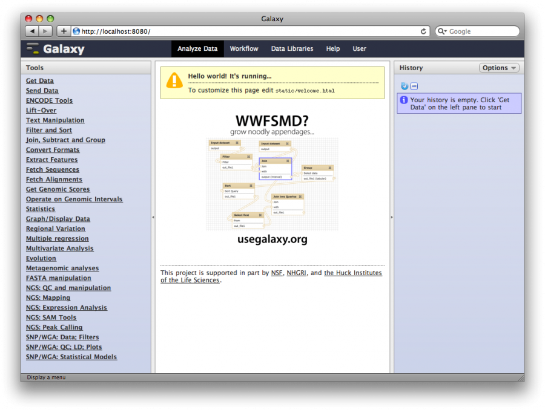

<div id="mw-page-base" class="noprint">

</div>

<div id="mw-head-base" class="noprint">

</div>

<div id="content" class="mw-body" role="main">

<span id="top"></span>

<div id="mw-js-message" style="display:none;">

</div>


# <span dir="auto">Galaxy Tutorial 2013</span>

<div id="bodyContent">

<div id="siteSub">

From GMOD

</div>

<div id="contentSub">

(Redirected from [Galaxy
Tutorial](http://gmod.org/mediawiki/index.php?title=Galaxy_Tutorial&redirect=no "Galaxy Tutorial"))

</div>

<div id="jump-to-nav" class="mw-jump">

Jump to: [navigation](#mw-navigation), [search](#p-search)

</div>

<div id="mw-content-text" class="mw-content-ltr" lang="en" dir="ltr">

This walks you through setting up and running a
[Galaxy](Galaxy.1 "Galaxy") server. This tutorial will be taught by
[Dave Clements](User:Clements "User:Clements") at the [2013 GMOD Summer
School](2013_GMOD_Summer_School "2013 GMOD Summer School").

<div id="toc" class="toc">

<div id="toctitle">

## Contents

</div>

- [<span class="tocnumber">1</span> <span class="toctext">Open Ports
  20-21, 8081</span>](#Open_Ports_20-21.2C_8081)
- [<span class="tocnumber">2</span> <span class="toctext">Starting
  AMI</span>](#Starting_AMI)
- [<span class="tocnumber">3</span> <span class="toctext">Galaxy
  Project</span>](#Galaxy_Project)
  - [<span class="tocnumber">3.1</span> <span class="toctext">Some
    General Galaxy Resources</span>](#Some_General_Galaxy_Resources)
- [<span class="tocnumber">4</span> <span class="toctext">Create a
  Galaxy instance</span>](#Create_a_Galaxy_instance)
  - [<span class="tocnumber">4.1</span>
    <span class="toctext">Prerequisites</span>](#Prerequisites)
    - [<span class="tocnumber">4.1.1</span> <span class="toctext">Galaxy
      needs a newer version of
      bedtools</span>](#Galaxy_needs_a_newer_version_of_bedtools)
  - [<span class="tocnumber">4.2</span> <span class="toctext">Clone the
    Galaxy repository</span>](#Clone_the_Galaxy_repository)
  - [<span class="tocnumber">4.3</span> <span class="toctext">Update
    Galaxy Configuration File</span>](#Update_Galaxy_Configuration_File)
  - [<span class="tocnumber">4.4</span> <span class="toctext">Use a more
    robust database</span>](#Use_a_more_robust_database)
  - [<span class="tocnumber">4.5</span> <span class="toctext">Run,
    Galaxy, Run!</span>](#Run.2C_Galaxy.2C_Run.21)
- [<span class="tocnumber">5</span> <span class="toctext">Running
  analyses with Galaxy</span>](#Running_analyses_with_Galaxy)
  - [<span class="tocnumber">5.1</span> <span class="toctext">1. Access
    your new Galaxy
    instance</span>](#1._Access_your_new_Galaxy_instance)
  - [<span class="tocnumber">5.2</span> <span class="toctext">2. Create
    a user</span>](#2._Create_a_user)
  - [<span class="tocnumber">5.3</span> <span class="toctext">3. Lets
    answer a question</span>](#3._Lets_answer_a_question)
  - [<span class="tocnumber">5.4</span> <span class="toctext">4. Get the
    data into Galaxy</span>](#4._Get_the_data_into_Galaxy)
  - [<span class="tocnumber">5.5</span> <span class="toctext">5.
    Identify genes and TFBSs that
    overlap</span>](#5._Identify_genes_and_TFBSs_that_overlap)
  - [<span class="tocnumber">5.6</span> <span class="toctext">6. Group
    and Count</span>](#6._Group_and_Count)
  - [<span class="tocnumber">5.7</span> <span class="toctext">7. Get
    Gene Info back</span>](#7._Get_Gene_Info_back)
  - [<span class="tocnumber">5.8</span> <span class="toctext">8.
    Visualize Your Analysis</span>](#8._Visualize_Your_Analysis)
    - [<span class="tocnumber">5.8.1</span> <span class="toctext">Define
      this assembly to Galaxy</span>](#Define_this_assembly_to_Galaxy)
- [<span class="tocnumber">6</span> <span class="toctext">Administering
  Galaxy</span>](#Administering_Galaxy)
  - [<span class="tocnumber">6.1</span> <span class="toctext">1. Make
    yourself an admin</span>](#1._Make_yourself_an_admin)
  - [<span class="tocnumber">6.2</span> <span class="toctext">2. Enable
    Tool Shed</span>](#2._Enable_Tool_Shed)
  - [<span class="tocnumber">6.3</span> <span class="toctext">3. Find
    and install a Venn Diagram drawing
    tool</span>](#3._Find_and_install_a_Venn_Diagram_drawing_tool)
- [<span class="tocnumber">7</span> <span class="toctext">Running Galaxy
  on the Cloud</span>](#Running_Galaxy_on_the_Cloud)

</div>

<a href="http://galaxyproject.org/" class="external text"
rel="nofollow">Galaxy</a> is a data integration and analysis framework
for biomedical research. Galaxy allows nearly any tool that can be run
from the command line to be integrated into it.

On top of these tools, Galaxy provides an accessible environment for
interactive analysis that transparently tracks the details of analyses,
a workflow system for convenient reuse, data management, sharing,
publishing, and more.

## <span id="Open_Ports_20-21.2C_8081" class="mw-headline">Open Ports 20-21, 8081</span>

For this tutorial, Galaxy will use port 8081. FTP, which is not used in
this tutorial, but is used in Galaxy to upload large files, is on ports
20-21. Update your security group in AWS to open thee ports. Go to
**Security Groups**, *select* the group you are using, and then *click*
the **Inbound** tab and then add

<div class="indent">

| Create a new rule | Port range | Source    |
|-------------------|------------|-----------|
| Custom TCP Rule   | 8081       | 0.0.0.0/0 |
| Custom TCP Rule   | 20-21      | 0.0.0.0/0 |

</div>

*Click* **+ Add rule** after each, and then **Apply Rule Changes** after
all have been added.

## <span id="Starting_AMI" class="mw-headline">Starting AMI</span>

Get the starting image for this tutorial - **GMOD 2013 Galaxy Install
Training Instance (ami-f1a1d998)**. It needs to be run as
<a href="https://wiki.galaxyproject.org/CloudMan/AWS/CapacityPlanning"
class="external text" rel="nofollow">at least a <strong>large</strong>
instance</a>.

## <span id="Galaxy_Project" class="mw-headline">Galaxy Project</span>

<a href="../mediawiki/images/6/6f/GMOD2013GalaxyIntro.pdf"
class="internal" title="GMOD2013GalaxyIntro.pdf">Slides</a>

### <span id="Some_General_Galaxy_Resources" class="mw-headline">Some General Galaxy Resources</span>

Before we get started, let's highlight some Galaxy resources that may be
useful to us along the way.

<a href="http://galaxyproject.org" class="external free"
rel="nofollow">http://galaxyproject.org</a>  
The Galaxy Project home page

<!-- -->

<a href="https://wiki.galaxyproject.org/" class="external text"
rel="nofollow">GalaxyWiki</a>  
All things Galaxy.

<!-- -->

<a href="http://getgalaxy.org/" class="external free"
rel="nofollow">http://getgalaxy.org/</a>  
Hub page for installing and managing your own Galaxy instance.

<!-- -->

<a href="http://usegalaxy.org/" class="external free"
rel="nofollow">http://usegalaxy.org/</a>  
The Galaxy project's free public server.

<!-- -->

<a href="https://wiki.galaxyproject.org/PublicGalaxyServers"
class="external text" rel="nofollow">Public Galaxy Servers</a>  
Current list of know publicly accessible Galaxy servers.

<!-- -->

<a href="http://galaxyproject.org/search/" class="external text"
rel="nofollow">Galaxy Search</a>  
Integrated searches of all online Galaxy resources. Available searches:

<!-- -->

<a href="http://galaxyproject.org/search/web" class="external text"
rel="nofollow">Pan-Galactic Web Search</a>  
Search everything

<!-- -->

<a href="http://galaxyproject.org/search/mailinglists"
class="external text" rel="nofollow">Galaxy Mailing Lists Search</a>  
Search the (Nabble-powered) mailing list archives

<!-- -->

<a href="http://galaxyproject.org/search/usegalaxy"
class="external text" rel="nofollow">Using Galaxy Search</a>  
Search online resources related to *using* Galaxy

<!-- -->

<a href="http://galaxyproject.org/search/getgalaxy"
class="external text" rel="nofollow">Galaxy Admin and Development
Search</a>  
Search online resources related to *deploying and developing* Galaxy

<div class="indent">

Results from searches are often further broken down into categories

- **All**: give me everything
- **Tools**: show me doc on tools related to my search.
- **Email**: show email threads related to my search.
- **Source code**: show Galaxy source code related to my search
- **Shared**: Show published Galaxy objects related to my search
- **Documentation**: Show documentation (e.g. wiki pages, tool doc, ...)
  related to my search.
- **Abstracts**: Show papers related to my search.
- **Requests**: Should feature requests related to my search.

This is all implemented using Google Custom Search.

</div>

<a href="https://wiki.galaxyproject.org/Mailing%20Lists"
class="external text" rel="nofollow">Mailing Lists</a> and <a href="http://galaxyproject.org/search/mailinglists"
class="external text" rel="nofollow">Mailing Lists Search</a>  
Galaxy has several mailing lists, some of which are
<a href="https://wiki.galaxyproject.org/Statistics"
class="external text" rel="nofollow">very active</a>

<!-- -->

<a href="https://wiki.galaxyproject.org/Learn" class="external text"
rel="nofollow">Learning hub page</a>  
Start here to learn how to use Galaxy.

<!-- -->

<a href="https://wiki.galaxyproject.org/CiteULike" class="external text"
rel="nofollow">Galaxy CiteULike group</a> (<a href="http://www.citeulike.org/group/16008/order/to_read,desc,"
class="external text" rel="nofollow">@ CiteULike</a>)  
Seventeen different <a href="http://www.citeulike.org/group/16008/tags"
class="external text" rel="nofollow">tags/categories</a> on *1066+
publications*

## <span id="Create_a_Galaxy_instance" class="mw-headline">Create a Galaxy instance</span>

<div class="emphasisbox">

See <a href="http://getgalaxy.org" class="external free"
rel="nofollow">http://getgalaxy.org</a>.

</div>

### <span id="Prerequisites" class="mw-headline">Prerequisites</span>

You need a Python interpreter, version 2.6 or greater. Python 3 is a
different language and is currently not supported. The Amazon Machine
Image (AMI) used for this course includes version 2.7.3 of the
interpreter.

    $ python --version
    Python 2.7.3

Galaxy is distributed (and developed) using a distributed version
control system called
<a href="http://mercurial.selenic.com/" class="external text"
rel="nofollow">Mercurial</a>. The AMI already includes mercurial version
2:0.2:

    $ hg --version
    Mercurial Distributed SCM (version 2.0.2)
    ...

#### <span id="Galaxy_needs_a_newer_version_of_bedtools" class="mw-headline">Galaxy needs a newer version of bedtools</span>

<a href="https://code.google.com/p/bedtools/" class="external text"
rel="nofollow">bedtools</a> is installed on this machine, but it's an
<a href="http://packages.ubuntu.com/precise/bedtools"
class="external text" rel="nofollow">older version</a> without the
`bedtools` executable in it, and Galaxy needs that. Remove the existing
bedtools package, and install
<a href="https://code.google.com/p/bedtools/downloads/list"
class="external text" rel="nofollow">a newer one</a>.

<div class="dont">

**DO NOT DO THIS NOW** as it has already been done on your image:

Remove the old version, get the new version, unpack and compile it, and
then put it where it can be found.

``` dont
 $ sudo apt-get remove bedtools
 $ cd ~/Galaxy
 $ curl http://bedtools.googlecode.com/files/BEDTools.v2.17.0.tar.gz > BEDTools.tar.gz
 $ tar -zxf BEDTools.tar.gz
 $ cd bedtools-2.17.0/
 $ make
 $ sudo cp -i bin/* /usr/bin
```

</div>

### <span id="Clone_the_Galaxy_repository" class="mw-headline">Clone the Galaxy repository</span>

The development and release repositories are available through the
<a href="http://bitbucket.org" class="external text"
rel="nofollow">bitbucket hosting service</a>.

<div class="dont">

**DO NOT DO THIS NOW** as it has already been done on your image:

To create a local clone of the release repository run the following:

``` dont
 $ cd ~/Galaxy
 $ hg clone http://bitbucket.org/galaxy/galaxy-dist
 $ cd galaxy-dist
 $ hg update stable
```

</div>

### <span id="Update_Galaxy_Configuration_File" class="mw-headline">Update Galaxy Configuration File</span>

Often you can just fire up Galaxy at this point. However, we want a few
things to be different from the default installation. Galaxy's main
configuration file is `universe_wsgi.ini`. By default, that file is
created at initialization time by copying `universe_wsgi.ini.sample`.
However, if the file already exists it is not copied over. Copy the file
and update it:

    $ cd ~/Galaxy/galaxy-dist
    $ cp universe_wsgi.ini.sample universe_wsgi.ini
    $ nano universe_wsgi.ini

  
Change the port from

    #port = 8080

to this:

    port = 8081

Galaxy, like [WebApollo](WebApollo.1 "WebApollo") and several other
components that are also covered at the course, will listen to port 8080
by default; to avoid stomping on that earlier work, we will configure
Galaxy to listen to a different port.

Change the host from

    #host = 127.0.0.1

to:

    host = 0.0.0.0

This makes Galaxy visible to remote hosts, such as your laptop

  
Set the *brand* to make it obvious that you are working on your Galaxy
instance

Change this:

    #brand = None

to this:

    brand = My Super Cool Brand

Actually use something shorter.

### <span id="Use_a_more_robust_database" class="mw-headline">Use a more robust database</span>

<div class="emphasisbox">

See <a
href="https://wiki.galaxyproject.org/Admin/Config/Performance/Production%20Server"
class="external text" rel="nofollow">Production Server</a>

</div>

Out of the box Galaxy includes the embedded
<a href="http://sqlite.org/" class="external text" rel="nofollow">SQLite
database</a>. This allows Galaxy to run with zero-configuration and
provides an excellent solution for single-user Galaxy installations
being used for tool development. However, for any multi-user scenario a
more robust database will be needed for Galaxy to be reliable. We
**highly** recommend [Postgres](PostgreSQL "PostgreSQL"), although other
databases are known to work. Postgres is already installed on our AMI
(it's the default [DBMS](Glossary#DBMS "Glossary") for
<a href="Chado" class="mw-redirect" title="Chado">Chado</a>)

Update `universe_wsgi.ini` file to use Postgres. Update the
`database_connection` in your Galaxy config file to look like:

    # -- Database                                                                                                                             
     
    # By default, Galaxy uses a SQLite database at 'database/universe.sqlite'.  You                                                           
    # may use a SQLAlchemy connection string to specify an external database                                                                   
    # instead.  This string takes many options which are explained in detail in the                                                          
    # config file documentation.                                                                                                              
    #database_connection = sqlite:///./database/universe.sqlite?isolation_level=IMMEDIATE                                                     
    database_connection = postgres://ubuntu:@localhost:5432/galaxydb

Save the file.

The `ubuntu` user has permission to create databases, so let's create
the database that we told Galaxy to connect to:

    $ createdb galaxydb

### <span id="Run.2C_Galaxy.2C_Run.21" class="mw-headline">Run, Galaxy, Run!</span>

Galaxy includes a script to run it. This script also performs the Galaxy
initialization the first time it is run. Run it now:

    $ sh run.sh
    Initializing external_service_types_conf.xml from external_service_types_conf.xml.sample
    Initializing migrated_tools_conf.xml from migrated_tools_conf.xml.sample
    Initializing reports_wsgi.ini from reports_wsgi.ini.sample
    Initializing shed_tool_conf.xml from shed_tool_conf.xml.sample
    Initializing tool_conf.xml from tool_conf.xml.sample
    ... (several minutes pass while install rolls through database changes) ...
    galaxy.webapps.galaxy.buildapp DEBUG 2013-07-15 18:52:06,052 Enabling 'x-forwarded-host' middleware
    galaxy.webapps.galaxy.buildapp DEBUG 2013-07-15 18:52:06,053 Enabling 'Request ID' middleware
    Starting server in PID 7158.
    serving on 0.0.0.0:8081 view at http://127.0.0.1:8081

This script performs several significant actions the first time it is
run:

- Creates initial configuration files and empty directories for storing
  data files
- Fetches all of the Galaxy framework's
  <a href="https://wiki.galaxyproject.org/Admin/Config/Eggs"
  class="external text" rel="nofollow">dependencies</a>, packaged as
  Python eggs, for the current platform.
- Initializes its database. Galaxy uses a database migration system to
  automatically handle any changes to the database schema. On first load
  it runs all migrations to ensure the database is in a known state,
  which may take a little time.

Once the database is initialized, the normal startup process proceeds,
loading tool configurations, starting the job runner, and finally
initializing the web interface on the requested port. You can now access
your Galaxy at http://ec2-##-##-##-##.compute-1.amazonaws.com:8081.

## <span id="Running_analyses_with_Galaxy" class="mw-headline">Running analyses with Galaxy</span>

<div class="emphasisbox">

See also <a href="http://usegalaxy.org/galaxy101" class="external text"
rel="nofollow">Galaxy 101 tutorial</a>

</div>

Without any additional configuration, there is already a lot we can do
with our first Galaxy instance. As an example, let's work through an
analysis that is based on, but distinct from the
<a href="http://usegalaxy.org/galaxy101" class="external text"
rel="nofollow">Galaxy 101 tutorial</a>.

#### <span id="1._Access_your_new_Galaxy_instance" class="mw-headline">1. Access your new Galaxy instance</span>

Start a web browser and access
http://ec2-##-##-##-##.compute-1.amazonaws.com:8081.

<a href="File:Galaxy_FirstAnalysis_1.png" class="image"></a>

#### <span id="2._Create_a_user" class="mw-headline">2. Create a user</span>

In the top bar, *select* **User → Register**. *Enter* your

- Email address
- Password (use a low-security password, it's going over the net
  unencrypted)
- Public name: Public names must be at least four characters in length
  and contain only lower-case letters, numbers, and the '-' character.

and *click* **Submit**.

Registering is not required in order to use Galaxy. However, to use all
of it, users need to register.

#### <span id="3._Lets_answer_a_question" class="mw-headline">3. Lets answer a question</span>

Now that Galaxy is up and running, let's use it to answer a question

<div class="emphasisbox">

We scooped up an unknown beast out of the slime and sent it off to the
sequencing core to get it sequenced and an assembly so we can study it.
Turns out it's an archaea, and it's new. We have subsequently run the
assembly through a gene prediction pipeline, and have also identified
potential transcription binding sites (TFBSs) using another pipeline.

What we now want to know is: which exons/genes have the most overlapping
/ embedded TFBSs?

</div>

<a href="../mediawiki/images/6/61/GMOD2013Galaxy101.pdf"
class="internal" title="GMOD2013Galaxy101.pdf">Slides</a>

#### <span id="4._Get_the_data_into_Galaxy" class="mw-headline">4. Get the data into Galaxy</span>

Select **Tools → Get Data → Upload Data**. This brings up the upload
data form from which you can

- upload data from your computer, or
- upload data from one or more URLs
- cut and paste data directly
- bring files into your workspace that you have previously send to
  Galaxy via FTP.

We are going to use the URL option. *Cut and paste* these URLs into the
**URL/Text** box

    http://bx.psu.edu/~clements/Events/GMOD2013/m.vannielli.TFBs.bed
    http://bx.psu.edu/~clements/Events/GMOD2013/m.vannielli.sequence.fasta
    http://bx.psu.edu/~clements/Events/GMOD2013/m.vannielli.wholegene.bed 

and *click* **Execute**.

This will import those 4 datasets your history. Let's take a look at the
data. For each dataset,

- *Click on the dataset name* for a preview.
- *Poke the eye* to see the full dataset.
- *Click on pencil icon* and give each dataset a better name (like
  `M vannielli Exons`). *Click* **Save**.
- Change the history name from `unnamed history` (which is true, but not
  useful) to something more meaningful.

#### <span id="5._Identify_genes_and_TFBSs_that_overlap" class="mw-headline">5. Identify genes and TFBSs that overlap</span>

Select **Tools → Operate on Genomic Intervals → Join**.

*Join* **genes** with **TFBS**, with **min overlap of 1 bp**. Return
**Only records that are joined (INNER JOIN)**.

Takes the two bed files and joins them together into double-wide records
where the first *n* columns are from the genes dataset and the last
columns are from the repeats dataset. Furthermore, it only creates
records when an gene and a TFBS overlap.

Take a close look at the dataset. Note that

- Some genes were dropped
- Some TFBS were dropped
- Some genes occur multiple times

*Make sure you understand why.*

#### <span id="6._Group_and_Count" class="mw-headline">6. Group and Count</span>

Now we want to walk through the pairings and count the number of times
each gene occurs. This number is the number of TFBS that overlap with
each gene.

We are going to do another operation that is borrowed from relational
databases. Select **Tools → Join, Subtract, and Group → Group**.

*Select* the **gene-TFBS pairings dataset** and set Group by column to
**c4**, the column in the dataset that contains the gene name.

Then *click* **Add new operation** and then *set* **Type** to **Count**.

  
This tells Galaxy to walk through the dataset, create a group for each
different value of column 4 (the gene name), and then count the number
of records that were in that group (i.e. the number of records that had
each gene name).

This produces a two column dataset. The first column is the value of the
column we grouped by. The second is the number of records in the dataset
that have that gene name.

If we were to now to run **Tools → Filter and Sort → Sort** on this
dataset, we would have the answer to our original question:

<div class="emphasisbox">

Which genes have the most overlapping TFBS?

</div>

We have the list of genes, and the counts in them. We could use this
dataset in further analysis, email it someone, etc..

#### <span id="7._Get_Gene_Info_back" class="mw-headline">7. Get Gene Info back</span>

However, we can do better. We have lost some information about the genes
(like position, strand, and so on) that we had in the original gene
dataset. If we can reclaim that information, and add to it, we can
produce a more useful dataset that we can visualize right now.

The original gene dataset downloaded from UCSC had a meaningless score
column. Let's replace that with the repeat count.

  
First, bring the original gene information together with the counts.

*Select* **Tools → Join, Subtract and Group → Join two Datasets**. *Set*
the first dataset to **Genes with repeat counts** and the second to be
the original **Genes** dataset.

*Join* them using column **c1** and column **c4**, which are the gene
names in both datasets.

  
This produces and a dataset with the gene repeat counts in the first two
columns and the gene information in the rightmost columns.

  
Now, use the **Cut** tool to reshuffle these columns into a valid 6
column BED file with the repeat count in column 5, the score column.

*Select* **Tools → Text Manipulation → Cut**. *Enter*
`c3,c4,c5,c6,c2,c8`

  
Finally, note that even though we now have what is a valid 6 column bed
file, Galaxy doesn't know that. We need to tell it. We should also give
the dataset a better name. *Click* on the datasets' **pencil icon** and
set the dataset name to something meaningful. Then *click* on the
**Datatype** type and select **bed** from the pulldown.

#### <span id="8._Visualize_Your_Analysis" class="mw-headline">8. Visualize Your Analysis</span>

We can now visualize our results in Galaxy. Click on the **visualize
*icon and select*** *Trackster'* from the pulldown, and then click on
**View in new visualization**.

##### <span id="Define_this_assembly_to_Galaxy" class="mw-headline">Define this assembly to Galaxy</span>

You may have noticed that In the preview of each dataset it shows

<div class="indent">

database: ?

</div>

The *database* (also referred to as a *build*) specifies which *genome
assembly* this dataset is associated with. A genome assembly is usually
named with an abbreviation for the species and a version number. For
example, "mm9" represents the *Mus musculus 9" assembly released in
2007, and "mm10" is the more recent assembly released in 2010. If these
datasets had been directly imported into Galaxy from, for example, the
UCSC Table Browser, or [BioMart](BioMart "BioMart") then the database
for these datasets would have been set automatically.*

The "?" means that Galaxy does not know which genome assembly the
datasets (or more precisely, the coordinates in the datasets) are
associated with. Genome assemblies are defined to Galaxy by the
instance's administrators. Most Galaxy servers know about widely used
assemblies, and if our datasets were for mm9 or mm10 (or any of many
other choices), we (as users) could just tell Galaxy that and be done.

  
However, these datasets aren't from a common assembly - they are from
your sequencing center and are for some novel archaea that was pulled
out of a mudflat (that is a bald-faced lie; it is actually *<a
href="http://microbewiki.kenyon.edu/index.php/Methanococcus_vannielii"
class="external text" rel="nofollow">Methanococcus vannielii</a>* and
this data came from the UCSC table browser, but we will pretend not to
know that).

One feature of Galaxy is that users can define their own custom
builds/genomes to the system. Once defined, they will be there every
time that user logs in in the future.

When you create a visualization, you are asked if you want to use a
known build, or if you want to create a custom build. Since we have a
custom build, select that option. Under **New Build** define

- Name (eg: Hamster):
- Key (eg: hamster_v1):

and select the FASTA file from your history. *Click* **Submit**. Now,
every time you log into this server in the future, Galaxy will know
about this assembly. No click on the final datasets visualization icon
again.

  
And ...

Our hopes are crushed:

    Trackster Error
     /bin/sh: 1: bedGraphToBigWig: not found

Do a web search for bedGraphToBigWig. Eventually that will lead you to
UCSC, where you can download it and install it.

    cd ~/Galaxy
    curl http://hgdownload.cse.ucsc.edu/admin/exe/linux.x86_64/bedGraphToBigWig > bedGraphToBigWig
    chmod 555 bedGraphToBigWig 
    sudo cp bedGraphToBigWig /usr/bin/

*Click* **Try again**. *Voillà.*

## <span id="Administering_Galaxy" class="mw-headline">Administering Galaxy</span>

### <span id="1._Make_yourself_an_admin" class="mw-headline">1. Make yourself an admin</span>

On the command line, stop Galaxy by entering \<ctrl-c\>. Then edit
`universe_wsgi.ini` file and add yourself as an administrator:

    # users (email addresses).  These users will have access to the Admin section                                                                                                                                                        
    # of the server, and will have access to create users, groups, roles,                                                                                                                                                                
    # libraries, and more.  For more information, see:                                                                                                                                                                                   
    # http://wiki.g2.bx.psu.edu/Admin/Interface                                                                                                                                                                                          
    #admin_users = None            
    admin_users = your@email.adr

### <span id="2._Enable_Tool_Shed" class="mw-headline">2. Enable Tool Shed</span>

While we are in `universe_wsgi.ini`, lets also enable this server to use
the Galaxy Tool Shed.

Define:

    # Tool config files, defines what tools are available in Galaxy.                                                                                                                                                                     
    # Tools can be locally developed or installed from Galaxy tool sheds.                                                                                                                                                                
    #tool_config_file = tool_conf.xml,shed_tool_conf.xml
    tool_config_file = tool_conf.xml,shed_tool_conf.xml
     
    # Default path to the directory containing the tools defined in tool_conf.xml.                                                                                                                                                       
    # Other tool config files must include the tool_path as an attribute in the <toolbox> tag.                                                                                                                                           
    #tool_path = tools
    tool_path = tools

Save the changes and then in the shell enter

    $ mkdir ../shed_tools

This is the default location for tools installed through the tool shed.

Now, restart Galaxy:

    $ sh run.sh

### <span id="3._Find_and_install_a_Venn_Diagram_drawing_tool" class="mw-headline">3. Find and install a Venn Diagram drawing tool</span>

Once your Galaxy has restarted, reload your web page. You should now see
an **Admin** link in the top menu bar. Click on it, and then **Tool
sheds → Search and browse tool sheds → Galaxy Main Tool Shed**. Search
for "venn".

<div class="indent">

An error occurred with this dataset: Traceback (most recent call last):
File
"/home/ubuntu/Galaxy/shed_tools/toolshed.g2.bx.psu.edu/repos/peterjc/venn_list/c96bef0643dc/venn_list/tools/plotting/venn_list.py",
line 13, in import rpy ImportError: No module named rpy

</div>

Do a web search for rpy debian package

    apt-get -s install python-rpy
    sudo apt-get install python-rpy

An error occurred with this dataset: Requires the R library limma (for
vennDiagram function)

Do a web search for limma debian package. Pick the one that involves R
and biology.

    sudo apt-get install r-bioc-limma

Success.

## <span id="Running_Galaxy_on_the_Cloud" class="mw-headline">Running Galaxy on the Cloud</span>

Go to <a href="http://usegalaxy.org/cloudlaunch" class="external text"
rel="nofollow">CloudLaunch</a>

<a href="../mediawiki/images/2/2b/GMOD2013GalaxyCloud.pdf"
class="internal" title="GMOD2013GalaxyCloud.pdf">Slides</a>

</div>

<div class="printfooter">

Retrieved from
"<http://gmod.org/mediawiki/index.php?title=Galaxy_Tutorial_2013&oldid=25977>"

</div>

<div id="catlinks" class="catlinks">

<div id="mw-normal-catlinks" class="mw-normal-catlinks">

[Categories](Special:Categories "Special:Categories"):

- [Tutorials](Category:Tutorials "Category:Tutorials")
- [Galaxy](Category:Galaxy "Category:Galaxy")

</div>

</div>

<div class="visualClear">

</div>

</div>

</div>

<div id="mw-navigation">

## Navigation menu

<div id="mw-head">


<div id="left-navigation">

<div id="p-namespaces" class="vectorTabs" role="navigation"
aria-labelledby="p-namespaces-label">

### Namespaces

- <span id="ca-nstab-main"><a href="Galaxy_Tutorial_2013" accesskey="c"
  title="View the content page [c]">Page</a></span>
- <span id="ca-talk"><a
  href="http://gmod.org/mediawiki/index.php?title=Talk:Galaxy_Tutorial_2013&amp;action=edit&amp;redlink=1"
  accesskey="t"
  title="Discussion about the content page [t]">Discussion</a></span>

</div>

<div id="p-variants" class="vectorMenu emptyPortlet" role="navigation"
aria-labelledby="p-variants-label">

### 

### Variants[](#)

<div class="menu">

</div>

</div>

</div>

<div id="right-navigation">


</div>


</div>

</div>

</div>

<div id="mw-panel">

<div id="p-logo" role="banner">

<a href="Main_Page"
style="background-image: url(../images/GMOD-cogs.png);"
title="Visit the main page"></a>

</div>

<div id="p-Navigation" class="portal" role="navigation"
aria-labelledby="p-Navigation-label">

### Navigation

<div class="body">

- <span id="n-GMOD-Home">[GMOD Home](Main_Page)</span>
- <span id="n-Software">[Software](GMOD_Components)</span>
- <span id="n-Categories-.2F-Tags">[Categories /
  Tags](Categories)</span>
- <span id="n-View-all-pages">[View all pages](Special:AllPages)</span>

</div>

</div>

<div id="p-Documentation" class="portal" role="navigation"
aria-labelledby="p-Documentation-label">

### Documentation

<div class="body">

- <span id="n-Overview">[Overview](Overview)</span>
- <span id="n-FAQs">[FAQs](Category:FAQ)</span>
- <span id="n-HOWTOs">[HOWTOs](Category:HOWTO)</span>
- <span id="n-Glossary">[Glossary](Glossary)</span>

</div>

</div>

<div id="p-Community" class="portal" role="navigation"
aria-labelledby="p-Community-label">

### Community

<div class="body">

- <span id="n-GMOD-News">[GMOD News](GMOD_News)</span>
- <span id="n-Training-.2F-Outreach">[Training /
  Outreach](Training_and_Outreach)</span>
- <span id="n-Support">[Support](Support)</span>
- <span id="n-GMOD-Promotion">[GMOD Promotion](GMOD_Promotion)</span>
- <span id="n-Meetings">[Meetings](Meetings)</span>
- <span id="n-Calendar">[Calendar](Calendar)</span>

</div>

</div>

<div id="p-tb" class="portal" role="navigation"
aria-labelledby="p-tb-label">

### Tools

<div class="body">

- <span id="t-whatlinkshere"><a href="Special:WhatLinksHere/Galaxy_Tutorial_2013" accesskey="j"
  title="A list of all wiki pages that link here [j]">What links here</a></span>
- <span id="t-recentchangeslinked"><a href="Special:RecentChangesLinked/Galaxy_Tutorial_2013" accesskey="k"
  title="Recent changes in pages linked from this page [k]">Related
  changes</a></span>
- <span id="t-specialpages"><a href="Special:SpecialPages" accesskey="q"
  title="A list of all special pages [q]">Special pages</a></span>
- <span id="t-print"><a
  href="http://gmod.org/mediawiki/index.php?title=Galaxy_Tutorial_2013&amp;printable=yes"
  rel="alternate" accesskey="p"
  title="Printable version of this page [p]">Printable version</a></span>
- <span id="t-permalink">[Permanent
  link](http://gmod.org/mediawiki/index.php?title=Galaxy_Tutorial_2013&oldid=25977 "Permanent link to this revision of the page")</span>
- <span id="t-info">[Page
  information](http://gmod.org/mediawiki/index.php?title=Galaxy_Tutorial_2013&action=info)</span>
- <span id="t-smwbrowselink"><a href="Special:Browse/Galaxy_Tutorial_2013" rel="smw-browse">Browse
  properties</a></span>
- <span id="t-pdf">[Print as
  PDF](http://gmod.org/mediawiki/index.php?title=Special:PdfPrint&page=Galaxy_Tutorial_2013)</span>

</div>

</div>

</div>

</div>

<div id="footer" role="contentinfo">

- <span id="footer-info-lastmod">Last updated at 23:33 on 10 June
  2014.</span>
- <span id="footer-info-viewcount">245,330 page views.</span>
- <span id="footer-info-copyright">Content is available under
  <a href="http://www.gnu.org/licenses/fdl-1.3.html" class="external"
  rel="nofollow">a GNU Free Documentation License</a> unless otherwise
  noted.</span>

<!-- -->

- <span id="footer-places-about">[About
  GMOD](GMOD:About "GMOD:About")</span>

<!-- -->

- <span id="footer-copyrightico">[](http://www.gnu.org/licenses/fdl-1.3.html)</span>
- <span id="footer-poweredbyico">[](http://www.mediawiki.org/)
  [](https://www.semantic-mediawiki.org/wiki/Semantic_MediaWiki)</span>

<div style="clear:both">

</div>

</div>
