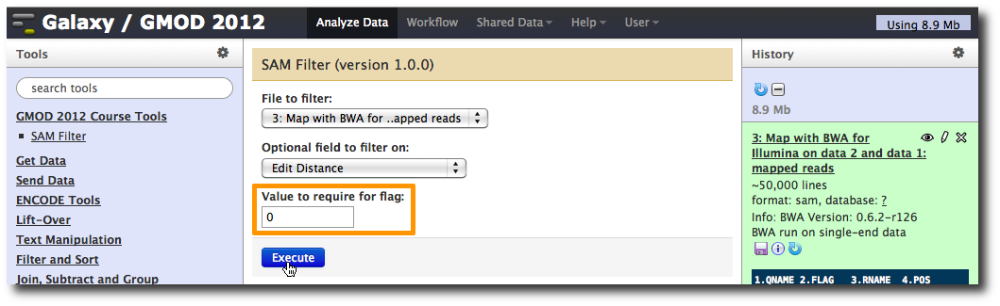
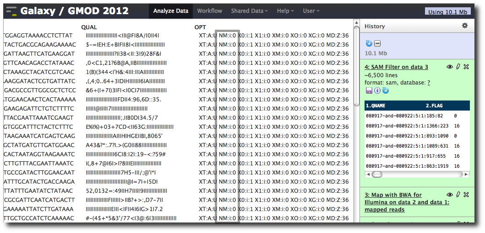
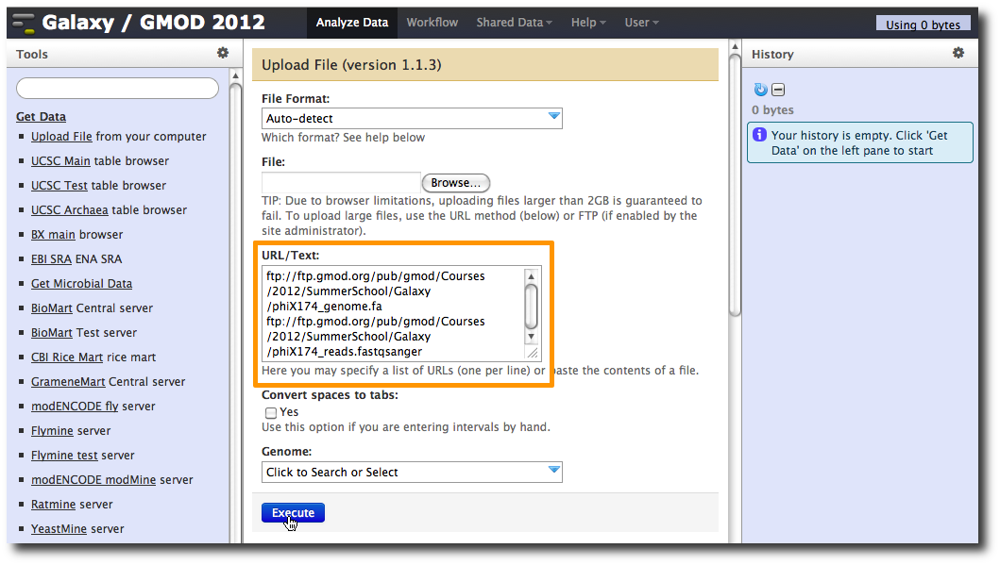
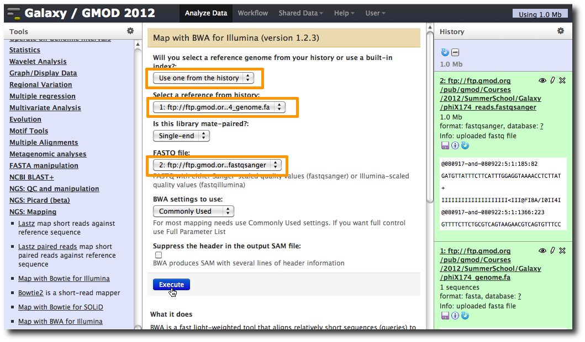
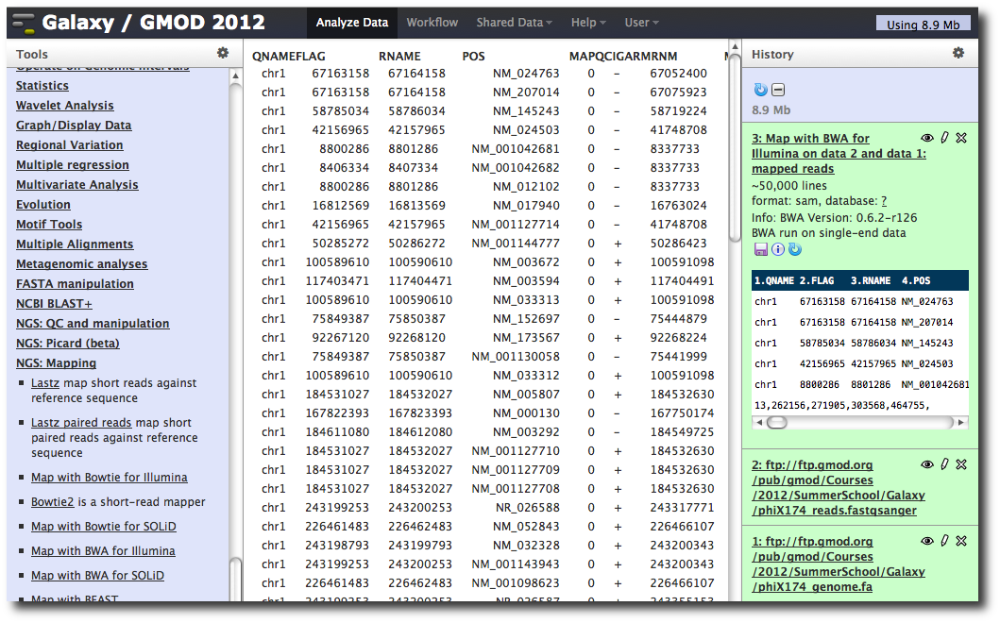
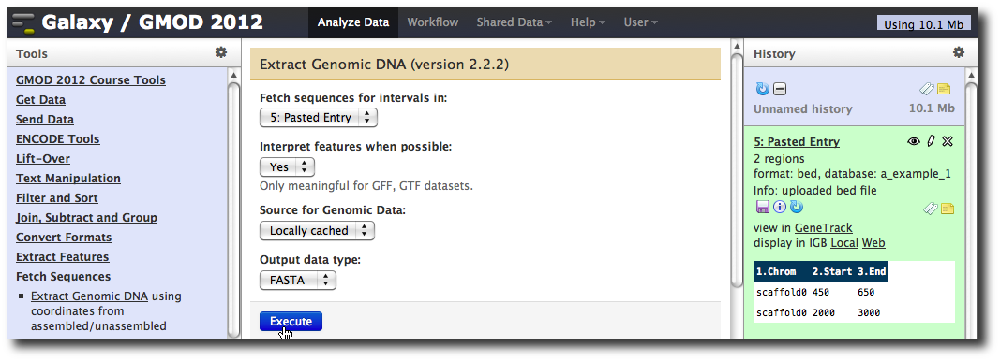
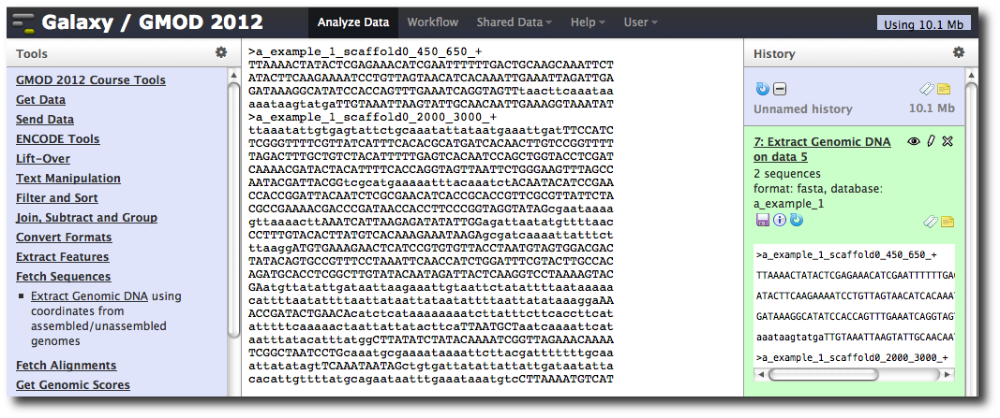
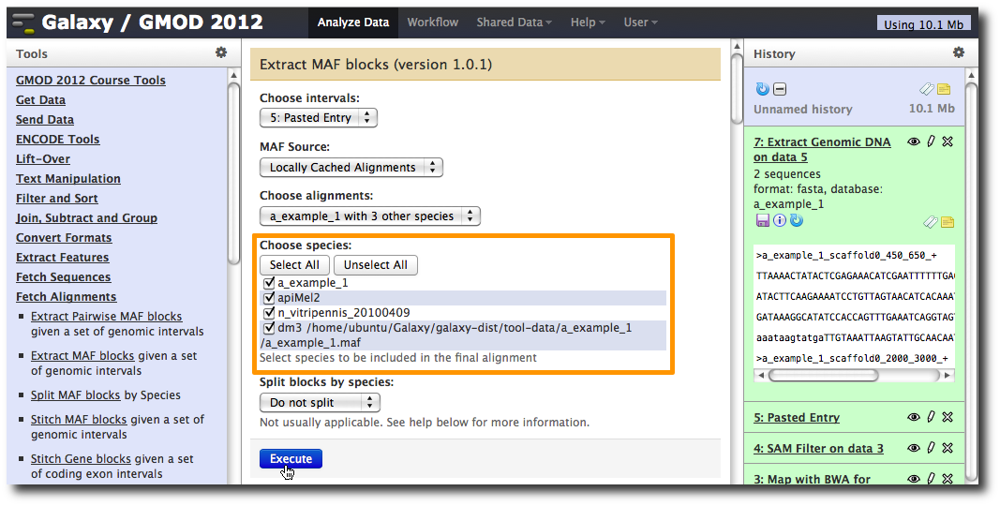
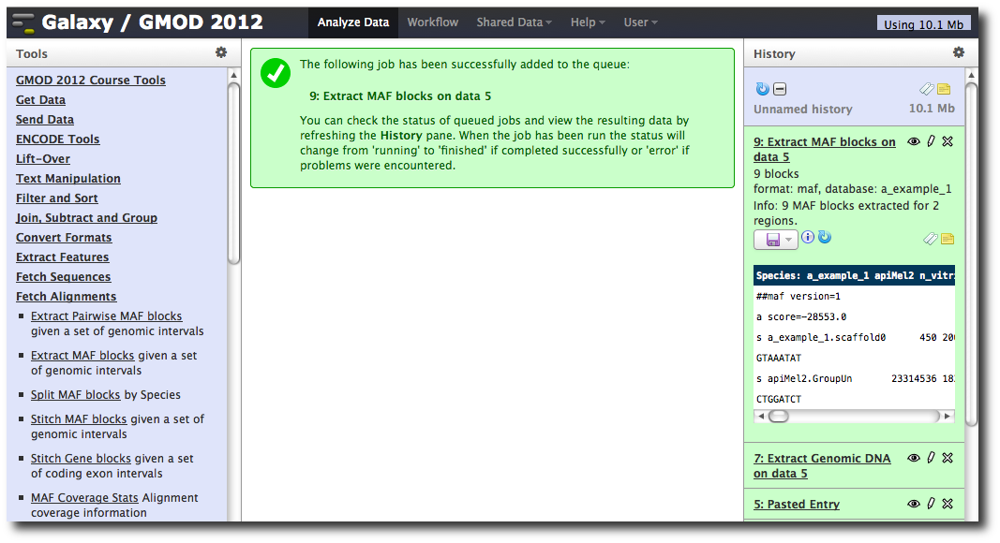

<div id="mw-page-base" class="noprint">

</div>

<div id="mw-head-base" class="noprint">

</div>

<div id="content" class="mw-body" role="main">

<span id="top"></span>

<div id="mw-js-message" style="display:none;">

</div>


# <span dir="auto">Galaxy Tutorial 2012 Extras</span>

<div id="bodyContent">

<div id="siteSub">

From GMOD

</div>

<div id="contentSub">

</div>

<div id="jump-to-nav" class="mw-jump">

Jump to: [navigation](#mw-navigation), [search](#p-search)

</div>

<div id="mw-content-text" class="mw-content-ltr" lang="en" dir="ltr">

<div class="emphasisbox">

Items shown on this page were part of earlier drafts of the [2012 Summer
School Galaxy workshop](Galaxy_Tutorial_2012 "Galaxy Tutorial 2012").
They were moved here either in the interests of time, or because they no
longer fit well with other content. However, these sections are still
informative.

</div>

<div id="toc" class="toc">

<div id="toctitle">

## Contents

</div>

- [<span class="tocnumber">1</span> <span class="toctext">Defining
  Genomes to Trackster</span>](#Defining_Genomes_to_Trackster)
- [<span class="tocnumber">2</span> <span class="toctext">Adding a new
  tool</span>](#Adding_a_new_tool)
  - [<span class="tocnumber">2.1</span> <span class="toctext">The tool
    command (script)</span>](#The_tool_command_.28script.29)
  - [<span class="tocnumber">2.2</span> <span class="toctext">The tool
    wrapper</span>](#The_tool_wrapper)
  - [<span class="tocnumber">2.3</span> <span class="toctext">Running
    the new tool</span>](#Running_the_new_tool)
- [<span class="tocnumber">3</span> <span class="toctext">Configuring
  Galaxy (2)</span>](#Configuring_Galaxy_.282.29)
  - [<span class="tocnumber">3.1</span> <span class="toctext">Tool
    dependencies</span>](#Tool_dependencies)
- [<span class="tocnumber">4</span> <span class="toctext">A second
  example with NGS data</span>](#A_second_example_with_NGS_data)
  - [<span class="tocnumber">4.1</span> <span class="toctext">1. Upload
    datasets</span>](#1._Upload_datasets)
  - [<span class="tocnumber">4.2</span> <span class="toctext">2. Run BWA
    to map reads</span>](#2._Run_BWA_to_map_reads)
- [<span class="tocnumber">5</span> <span class="toctext">Making genome
  / alignment data available to
  Galaxy</span>](#Making_genome_.2F_alignment_data_available_to_Galaxy)
  - [<span class="tocnumber">5.1</span> <span class="toctext">Python
    package management tools</span>](#Python_package_management_tools)
  - [<span class="tocnumber">5.2</span>
    <span class="toctext">bx-python</span>](#bx-python)
  - [<span class="tocnumber">5.3</span> <span class="toctext">Get
    datasets for our genome</span>](#Get_datasets_for_our_genome)
  - [<span class="tocnumber">5.4</span> <span class="toctext">Edit
    configuration files</span>](#Edit_configuration_files)
  - [<span class="tocnumber">5.5</span> <span class="toctext">Create
    dataset using new genome
    build</span>](#Create_dataset_using_new_genome_build)
  - [<span class="tocnumber">5.6</span> <span class="toctext">Extract
    sequence corresponding to these
    intervals</span>](#Extract_sequence_corresponding_to_these_intervals)
  - [<span class="tocnumber">5.7</span> <span class="toctext">Extract
    multiple alignments corresponding to these
    intervals</span>](#Extract_multiple_alignments_corresponding_to_these_intervals)

</div>

## <span id="Defining_Genomes_to_Trackster" class="mw-headline">Defining Genomes to Trackster</span>

From the <a
href="https://wiki.galaxyproject.org/Learn/Visualization#Setup_for_Local_Instances#Setup_for_Local_Instances"
class="external text" rel="nofollow">Learn/Visualization wiki page</a>

<div class="indent">

Trackster needs chrom/contig length information for builds to be able to
be visualized, either in the form of `.len` files or custom user builds.
The former option allows all users to be able to use the build.
Trackster looks for the `.len` files in the
`tool-data/shared/ucsc/chrom/` directory by default, but this location
can be configured in the `universe_wsgi.ini` file:

    # Directory where chrom len files are kept, currently mainly used by trackster
    #len_file_path = tool-data/shared/ucsc/chrom

For example, to enable visualization of hg18, a file called hg18.len
must exist in the previously specified folder. The contents of the
`.len` file is tab-delimited and specifies the length of each
chrom/contig of that build, each on a separate line, eg:

    chr1    27473282
    chr2    38882233
    ...
    chrX    28883322

To populate this directory with common UCSC builds, run the following
commands:

<div class="mw-geshi mw-code mw-content-ltr" dir="ltr">

<div class="bash source-bash">

``` de1
mkdir ./tool-data/shared/ucsc/chrom/
python ./cron/build_chrom_db.py ./tool-data/shared/ucsc/chrom/
```

</div>

</div>

To display a build's genome data (i.e. bases/nucleotides) when
sufficiently zoomed in: (a) create a 2bit file from the genome's fasta
file using `faToTwoBit`, which is available from UCSC's tools (source,
executables and (b) add an entry to the `tool-data/twobit.loc` file to
indicate that where the build's twobit file is located.

Finally, you will need to make sure your `datatypes_conf.xml` file
contains the necessary datatype converters that GTB uses, such as
`bam_to_bai.xml`, `bed_to_tabix.xml`, etc. If you have not made local
changes to `datatypes_conf.xml`, then simply copy everything from
`datatypes_conf.xml.sample` into `datatypes_conf.xml` to make sure you
have the latest copy.

</div>

**Note:** the above script will run for almost an hour

After restarting Galaxy, Trackster will now know about the size of all
chromosomes for many genome builds.

  

## <span id="Adding_a_new_tool" class="mw-headline">Adding a new tool</span>

<div class="indent">

**Note:** This was the "create a tool" example used in previous years.
This year I switched the time to cover the Galaxy Tool Shed instead.
However, this is such a nice example that I couldn't delete it
altogether. *Dave C.*

</div>

The <a href="http://samtools.sourceforge.net/" class="external text"
rel="nofollow">SAM format</a> contains 12 required fields representing
the read and the position it maps to, followed by a variable number of
optional fields of the form *`CODE:TYPE:VALUE`*. Suppose we want to
filter by these optional fields. We can whip up a quick command line
tool in Python (or perl, or awk, or...) to do this.

Let's first create a directory for our new tool:

    $ mkdir tools/gmod_2012

### <span id="The_tool_command_.28script.29" class="mw-headline">The tool command (script)</span>

And then using a [text editor](Linux_Text_Editors "Linux Text Editors"),
create `tools/gmod_2012/sam_filter.py` containing:

<div class="mw-geshi mw-code mw-content-ltr" dir="ltr">

<div class="python source-python">

``` de1
#!/usr/bin/env python
 
"""
Usage: sam_filter.py input_file output_file flag value
"""
 
import sys
 
out = open( sys.argv[2], "w" )
 
for line in open( sys.argv[1] ):
    # Strip end of line and split on tabs
    fields = line.rstrip( "\r\n" ).split( "\t" )
    # Look only at optional fields
    write_line = False
    for field in fields[12:]:
        flag, type, value = field.split( ":" )
        if flag == sys.argv[3] and value == sys.argv[4]:
            write_line = True
    # If any optional field matched, keep the read
    if write_line:
        out.write( line )
```

</div>

</div>

### <span id="The_tool_wrapper" class="mw-headline">The tool wrapper</span>

Next, we need to create the tool configuration. Edit the file
`tools/gmod_2012/sam_filter.xml` and start with the following skeleton:

<div class="mw-geshi mw-code mw-content-ltr" dir="ltr">

<div class="xml source-xml">

``` de1
<tool id="sam_filter_1" name="SAM Filter">
    <command interpreter="python">
 
    </command>
    <inputs>
 
    </inputs>
    <outputs>
 
    </outputs>
</tool>
```

</div>

</div>

First, let's define the output. This tool has a single output, of type
`sam`, so we modify the configuration to contain:

<div class="mw-geshi mw-code mw-content-ltr" dir="ltr">

<div class="xml source-xml">

``` de1
<tool id="sam_filter_1" name="SAM Filter">
    <command interpreter="python">
 
    </command>
    <inputs>
 
    </inputs>
    <outputs>
        <data name="output1" format="sam" />
    </outputs>
</tool>
```

</div>

</div>

The name can be anything, but it will be used later to identify the
output file in the command line. Second, let's define the following
inputs

- An input dataset of type `sam`
- An input flag, which is selected from a predefined set
- An input value, which can be any text

The resulting configuration:

<div class="mw-geshi mw-code mw-content-ltr" dir="ltr">

<div class="xml source-xml">

``` de1
<tool id="sam_filter_1" name="SAM Filter">
    <command interpreter="python">
 
    </command>
    <inputs>
        <param type="data" format="sam" name="input1" label="File to filter"/>
        <param type="select" name="flag" label="Optional field to filter on">
            <option value="NM">Edit Distance</option>
            <option value="MD">Mismatching positions / bases</option>
        <option value="AS">Alignment score</option>
        </param>
    <param type="text" name="value" label="Value to require for flag"/>
    </inputs>
    <outputs>
        <data name="output1" format="sam" />
    </outputs>
</tool>
```

</div>

</div>

Finally, we define how to construct our command line based on values for
the inputs. The command line is a template, where we can substitute in
the value of each input (filenames in the case of datasets). Thus our
final tool configuration is:

<div class="mw-geshi mw-code mw-content-ltr" dir="ltr">

<div class="xml source-xml">

``` de1
<tool id="sam_filter_1" name="SAM Filter">
    <command interpreter="python">
        sam_filter.py $input1 $output1 $flag $value
    </command>
    <inputs>
        <param type="data" format="sam" name="input1" label="File to filter"/>
        <param type="select" name="flag" label="Optional field to filter on">
            <option value="NM">Edit Distance</option>
            <option value="MD">Mismatching positions / bases</option>
        <option value="AS">Alignment score</option>
        </param>
    <param type="text" name="value" label="Value to require for flag"/>
    </inputs>
    <outputs>
        <data name="output1" format="sam" />
    </outputs>
</tool>
```

</div>

</div>

We now need to modify `tool_conf.xml` to register our new tool and run
Galaxy. Modify the top of `tool_conf.xml` to look like:

<div class="mw-geshi mw-code mw-content-ltr" dir="ltr">

<div class="xml source-xml">

``` de1
<?xml version="1.0"?>
<toolbox>
  <section name="GMOD 2012 Course Tools" id="gmod_2012">
    <tool file="gmod_2012/sam_filter.xml"/>
  </section>
  ...
```

</div>

</div>

and run Galaxy using

    $ sh run.sh --reload

### <span id="Running_the_new_tool" class="mw-headline">Running the new tool</span>

Return to the Galaxy web interface and from the **Tools** panel and
*select* **GMOD 2012 Course Tools → SAM Filter**.

The dataset **3: Map with BWA...** should already be **selected**.
Because we defined the type of data the tool can accept, Galaxy knows
this is the only dataset in our history that is valid.

*Select* **Edit distance** for the **flag**, *enter* **0** for the
**value**, and *click* **Execute**.

<a href="File:GalaxyExtras_SamFilter_1.png" class="image"></a>

We know have a new dataset **4: Sam Filter on data 3** which contains
only reads that mapped exactly to the reference.

<a href="File:GalaxyExtras_SamFilter_2.png" class="image"></a>

  

## <span id="Configuring_Galaxy_.282.29" class="mw-headline">Configuring Galaxy (2)</span>

### <span id="Tool_dependencies" class="mw-headline">Tool dependencies</span>

In the example above, we added a new tool to the default Galaxy
installation. This included, adding the new tool to the Tools panel.
However, many of the tools that are listed in the default Tools panel
need additional software installed before they will work (we are
currently working on an enhanced dependency management system to make
this easier).

Suppose we'd like to analyze some Illumina datasets. We see that the
**Map with BWA** tool requires us to install
<a href="http://bio-bwa.sourceforge.net/" class="external text"
rel="nofollow">BWA</a> (surprise!). To save time, BWA is already
compiled on the AMI, so let's copy it to a location on the `PATH`:

    $ sudo cp /home/ubuntu/Galaxy/BWA/bwa-0.6.2/bwa /usr/local/bin

Now `bwa` can be run from the command line:

    $ bwa

    Program: bwa (alignment via Burrows-Wheeler transformation)
    Version: 0.6.2-r126
    Contact: Heng Li <lh3@sanger.ac.uk>

    ...

The Galaxy tool also requires a `loc` file which contains the locations
of indexes for locally stored genome builds. We don't have any, so we
can just use the empty sample:

    $ cp tool-data/bwa_index.loc.sample tool-data/bwa_index.loc

and then start Galaxy

    $ sh run.sh --reload

## <span id="A_second_example_with_NGS_data" class="mw-headline">A second example with NGS data</span>

Having made these changes and restarted Galaxy, access it at <a
href="http://gmod.org/mediawiki/index.php?title=Template:YourUrlGalaxy&amp;action=edit&amp;redlink=1"
class="new"
title="Template:YourUrlGalaxy (page does not exist)">Template:YourUrlGalaxy</a>.

  
You will notice that your history has been lost. This is the result of
moving to Postgres. On startup, Galaxy will again have created a new
database from scratch.

#### <span id="1._Upload_datasets" class="mw-headline">1. Upload datasets</span>

We will again use the **Get Data → Upload File** tool to upload data
into Galaxy. You can enter multiple URLs into the **URL / Text** box.
*Enter:*

    ftp://ftp.gmod.org/pub/gmod/Courses/2012/SummerSchool/Galaxy/phiX174_genome.fa
    ftp://ftp.gmod.org/pub/gmod/Courses/2012/SummerSchool/Galaxy/phiX174_reads.fastqsanger

and *click* **Execute**:

<a href="File:GalaxyExtras_SecondAnalysis_1.png" class="image"></a>

After uploading the datasets, *expand them* in the **History**. We can
see that Galaxy has successfully detected the file formats of both
files.

<a href="File:GalaxyExtras_SecondAnalysis_2.png" class="image"></a>

However, we need to make one modification. The FASTQ format is
ill-defined, and Galaxy needs to know how the quality scores are scaled.
*Click* the **pencil icon for dataset 2**, and *change* the **datatype**
from **fastq** to **fastqsanger** (be careful, there are many similar
choices here). Finally, *click* **Save**.

### <span id="2._Run_BWA_to_map_reads" class="mw-headline">2. Run BWA to map reads</span>

In the **Tools** panel, *select* **NGS: Mapping → Map with BWA for
Illumina**.

*Change* the value of the first parameter to **Use one from the
history** and make sure that **1: ftp: // ftp.gmod.or...4_genome.fa** is
**selected**.

Make sure that for parameter **FASTQ file** that **2: ftp: //
ftp.gmod.or...fastqsanger** is selected.

*Click* **Execute**.

<a href="File:GalaxyExtras_SecondAnalysis_BWASettings.png"
class="image"></a>

A new dataset is generated containing the mapped reads in [SAM
format](Glossary#SAM "Glossary").

<a href="File:GalaxyExtras_SecondAnalysis_3.png" class="image"></a>

## <span id="Making_genome_.2F_alignment_data_available_to_Galaxy" class="mw-headline">Making genome / alignment data available to Galaxy</span>

**Note:** We probably won't do this section during class, due to time
constraints. The process for loading genome builds into Galaxy will also
be changing shortly.

Galaxy is designed so that a single Galaxy instance can work with many
genomes simultaneously. To use certain tools, Galaxy needs to be
configured to know where to find data for those genomes. As an example,
let's create a new fake genome and configure some data for it.

Every genome in Galaxy needs to have a unique identifier (called the
*build identifier* or *dbkey*). For our example, the identifier will be
`a_example_1`.

### <span id="Python_package_management_tools" class="mw-headline">Python package management tools</span>

**DO NOT DO THIS NOW**: This has already been done on the AMI.

First, install a few packages that will allow us to index our data. At
the terminal, enter:

`  $ `<span class="enter">`sudo apt-get install python-dev python-setuptools python-pip`</span>

### <span id="bx-python" class="mw-headline">bx-python</span>

**Do not do this now either.** This has already been done on your image.

This *would* install some support files needed by Python. Next type

`  $ `<span class="enter">`sudo pip install bx-python`</span>

This would install the `bx-python` package, a collection of scripts and
Python libraries for working with genomic and comparative genomic data.

### <span id="Get_datasets_for_our_genome" class="mw-headline">Get datasets for our genome</span>

Now, we will download the datasets for our example genome:

    $ mkdir tool-data/a_example_1
    $ cd tool-data/a_example_1
    $ wget ftp://ftp.gmod.org/pub/gmod/Courses/2012/SummerSchool/Galaxy/a_example_1.maf
    $ wget ftp://ftp.gmod.org/pub/gmod/Courses/2012/SummerSchool/Galaxy/a_example_1.2bit

<div style="font-size: 80%">

Note: These files are also available on the image in
`/home/ubuntu/Galaxy/Data/`.

</div>

Next, we will use the script `maf_build_index.py` (put in
`/usr/local/bin/` when `bx-python` was installed) to create a binary
index that allows fast selection of alignments from a MAF file:

    $ maf_build_index.py a_example_1.maf
    $ ls
    a_example_1.2bit  a_example_1.maf  a_example_1.maf.index
    $ cd ~/Galaxy/galaxy-dist

### <span id="Edit_configuration_files" class="mw-headline">Edit configuration files</span>

We now need to edit several configuration files to inform Galaxy of the
existence of our genome, and of these associated datasets.

**NOTE:** these are TAB separated files, and it is important that the
tabs are in the right places. If you have trouble cutting and pasting
from the wiki, you can cut and paste from this text file instead:

    ftp://ftp.gmod.org/pub/gmod/Courses/2012/SummerSchool/Galaxy/info.txt

Add this line to `tool-data/shared/ucsc/builds.txt`

``` enter
a_example_1 Example genome
```

Add this to `tool-data/alignseq.loc`

``` enter
seq a_example_1 /home/ubuntu/Galaxy/galaxy-dist/tool-data/a_example_1/a_example_1.2bit
```

Add this to `tool-data/maf_index.loc`

``` enter
a_example_1 with 3 other species    a_example_1_3way    a_example_1 a_example_1,apiMel2,n_vitripennis_20100409,dm3  /home/ubuntu/Galaxy/galaxy-dist/tool-data/a_example_1/a_example_1.maf
```

Now, stop and start your running Galaxy with

    <Control-C>
    $ sh run.sh --reload

### <span id="Create_dataset_using_new_genome_build" class="mw-headline">Create dataset using new genome build</span>

Now let's see if our new data is available in Galaxy. Click **Get Data →
Upload File**.

Paste the following into the **URL/Text** box:

    scaffold0   450 650
    scaffold0   2000    3000

Set the **File Format** to **bed**, make sure **Convert spaces to tabs**
is **selected**, and click in the **Genome:** box. You should be able to
find your genome by typing **example**.

### <span id="Extract_sequence_corresponding_to_these_intervals" class="mw-headline">Extract sequence corresponding to these intervals</span>

In the **Tools** menu, *click* **Fetch Sequences → Extract Genomic
DNA**.

<a href="File:GalaxyExtras_Fetch_1.png" class="image"></a>

The tool interface should open in the main panel. The default values are
probably fine (make sure the dataset you just created is selected).
*Click* **Execute**. A new dataset will be created containing the DNA
for your regions of interest.

<a href="File:GalaxyExtras_Fetch_ExtractedDNA.png" class="image"></a>

### <span id="Extract_multiple_alignments_corresponding_to_these_intervals" class="mw-headline">Extract multiple alignments corresponding to these intervals</span>

In the **Tools** menu, click **Fetch Alignments → Extract MAF Blocks**.

<a href="File:GalaxyExtras_Fetch_2.png" class="image"></a>

The tool interface will open in the main panel. Again, the defaults
should be reasonable, but *click* **Select All** to do alignments to all
other species. *Click* **Execute**. A new dataset will be created
containing alignments corresponding to your intervals of interest.

<a href="File:GalaxyExtras_Fetch_3.png" class="image"></a>

</div>

<div class="printfooter">

Retrieved from
"<http://gmod.org/mediawiki/index.php?title=Galaxy_Tutorial_2012_Extras&oldid=22230>"

</div>

<div id="catlinks" class="catlinks">

<div id="mw-normal-catlinks" class="mw-normal-catlinks">

[Categories](Special:Categories "Special:Categories"):

- [Galaxy](Category:Galaxy "Category:Galaxy")
- [Tutorials](Category:Tutorials "Category:Tutorials")

</div>

</div>

<div class="visualClear">

</div>

</div>

</div>

<div id="mw-navigation">

## Navigation menu

<div id="mw-head">


<div id="left-navigation">

<div id="p-namespaces" class="vectorTabs" role="navigation"
aria-labelledby="p-namespaces-label">

### Namespaces

- <span id="ca-nstab-main"><a href="Galaxy_Tutorial_2012_Extras" accesskey="c"
  title="View the content page [c]">Page</a></span>
- <span id="ca-talk"><a
  href="http://gmod.org/mediawiki/index.php?title=Talk:Galaxy_Tutorial_2012_Extras&amp;action=edit&amp;redlink=1"
  accesskey="t"
  title="Discussion about the content page [t]">Discussion</a></span>

</div>

<div id="p-variants" class="vectorMenu emptyPortlet" role="navigation"
aria-labelledby="p-variants-label">

### 

### Variants[](#)

<div class="menu">

</div>

</div>

</div>

<div id="right-navigation">


</div>


</div>

</div>

</div>

<div id="mw-panel">

<div id="p-logo" role="banner">

<a href="Main_Page"
style="background-image: url(../images/GMOD-cogs.png);"
title="Visit the main page"></a>

</div>

<div id="p-Navigation" class="portal" role="navigation"
aria-labelledby="p-Navigation-label">

### Navigation

<div class="body">

- <span id="n-GMOD-Home">[GMOD Home](Main_Page)</span>
- <span id="n-Software">[Software](GMOD_Components)</span>
- <span id="n-Categories-.2F-Tags">[Categories /
  Tags](Categories)</span>
- <span id="n-View-all-pages">[View all pages](Special:AllPages)</span>

</div>

</div>

<div id="p-Documentation" class="portal" role="navigation"
aria-labelledby="p-Documentation-label">

### Documentation

<div class="body">

- <span id="n-Overview">[Overview](Overview)</span>
- <span id="n-FAQs">[FAQs](Category:FAQ)</span>
- <span id="n-HOWTOs">[HOWTOs](Category:HOWTO)</span>
- <span id="n-Glossary">[Glossary](Glossary)</span>

</div>

</div>

<div id="p-Community" class="portal" role="navigation"
aria-labelledby="p-Community-label">

### Community

<div class="body">

- <span id="n-GMOD-News">[GMOD News](GMOD_News)</span>
- <span id="n-Training-.2F-Outreach">[Training /
  Outreach](Training_and_Outreach)</span>
- <span id="n-Support">[Support](Support)</span>
- <span id="n-GMOD-Promotion">[GMOD Promotion](GMOD_Promotion)</span>
- <span id="n-Meetings">[Meetings](Meetings)</span>
- <span id="n-Calendar">[Calendar](Calendar)</span>

</div>

</div>

<div id="p-tb" class="portal" role="navigation"
aria-labelledby="p-tb-label">

### Tools

<div class="body">

- <span id="t-whatlinkshere"><a href="Special:WhatLinksHere/Galaxy_Tutorial_2012_Extras"
  accesskey="j" title="A list of all wiki pages that link here [j]">What
  links here</a></span>
- <span id="t-recentchangeslinked"><a href="Special:RecentChangesLinked/Galaxy_Tutorial_2012_Extras"
  accesskey="k"
  title="Recent changes in pages linked from this page [k]">Related
  changes</a></span>
- <span id="t-specialpages"><a href="Special:SpecialPages" accesskey="q"
  title="A list of all special pages [q]">Special pages</a></span>
- <span id="t-print"><a
  href="http://gmod.org/mediawiki/index.php?title=Galaxy_Tutorial_2012_Extras&amp;printable=yes"
  rel="alternate" accesskey="p"
  title="Printable version of this page [p]">Printable version</a></span>
- <span id="t-permalink">[Permanent
  link](http://gmod.org/mediawiki/index.php?title=Galaxy_Tutorial_2012_Extras&oldid=22230 "Permanent link to this revision of the page")</span>
- <span id="t-info">[Page
  information](http://gmod.org/mediawiki/index.php?title=Galaxy_Tutorial_2012_Extras&action=info)</span>
- <span id="t-smwbrowselink"><a href="Special:Browse/Galaxy_Tutorial_2012_Extras"
  rel="smw-browse">Browse properties</a></span>
- <span id="t-pdf">[Print as
  PDF](http://gmod.org/mediawiki/index.php?title=Special:PdfPrint&page=Galaxy_Tutorial_2012_Extras)</span>

</div>

</div>

</div>

</div>

<div id="footer" role="contentinfo">

- <span id="footer-info-lastmod">Last updated at 21:16 on 9 October
  2012.</span>
- <span id="footer-info-viewcount">15,958 page views.</span>
- <span id="footer-info-copyright">Content is available under
  <a href="http://www.gnu.org/licenses/fdl-1.3.html" class="external"
  rel="nofollow">a GNU Free Documentation License</a> unless otherwise
  noted.</span>

<!-- -->

- <span id="footer-places-about">[About
  GMOD](GMOD:About "GMOD:About")</span>

<!-- -->

- <span id="footer-copyrightico">[](http://www.gnu.org/licenses/fdl-1.3.html)</span>
- <span id="footer-poweredbyico">[](http://www.mediawiki.org/)
  [](https://www.semantic-mediawiki.org/wiki/Semantic_MediaWiki)</span>

<div style="clear:both">

</div>

</div>
