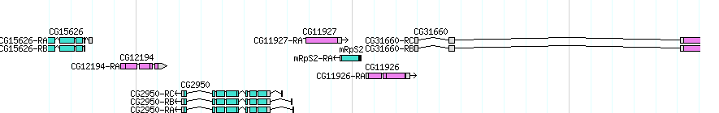
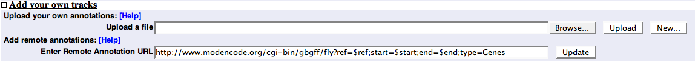
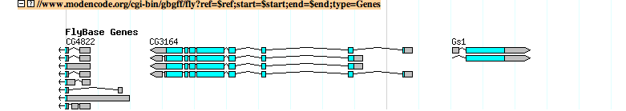

# Gbgff

From GMOD

Jump to: [navigation](#mw-navigation), [search](#p-search)

FlyBase gene models displayed as remote tracks on Gbrowse, via gbgff

***gbgff*** is a [GFF3](GFF3 "GFF3") dumper script that comes packaged
with [GBrowse](GBrowse.1 "GBrowse") version 1.69 and later.  Its purpose
is to export configured annotations from one instance of GBrowse to
another.

- It is analogous to [DAS](Category:DAS "Category:DAS"), except that:
  - It supports both server and client-side configuration of glyph
    rendering
  - It supports 3-level gene models and other multi-level features made
    possible by GFF3

# Installation

- gbgff does not require any special set-up - it is installed with
  GBrowse.
- This application has only been tested with servers using a GFF3
  back-end with <a
  href="http://doc.bioperl.org/releases/bioperl-current/bioperl-live/Bio/DB/SeqFeature/Store.html"
  class="external text" rel="nofollow">Bio::SeqFeature::Store</a>

# Configuration

## Server-side

- Tracks are configured as normal (see the
  <a href="http://cloud.gmod.org/gbrowse2/tutorial/tutorial.html"
  class="external text" rel="nofollow">GBrowse2 Admin Tutorial</a> and
  the <a href="GBrowse_Configuration_HOWTO" class="mw-redirect"
  title="GBrowse Configuration HOWTO">GBrowse Configuration HOWTO</a>
  for details)
- The config stanza for each feature type is dumped with the
  [GFF3](GFF3 "GFF3")
- The only thing to be aware of is that callbacks are disabled for
  security reasons
  - Any server-side options configured with callbacks will fall through
    to the \[TRACK DEFAULTS\] setting, if available
  - Note: server-side options will be overridden by client-side
    settings, so callbacks can still be used

## Client-side

- The GFF3 exported by gbgff can be used like a DAS source.

### as a DAS-lite remote feature

- to use the dumper as a DAS source, add the ***remote feature*** option

The URL format follows the same pattern as GBrowse:
**host/cgi-bin/gbgff/data_source?type=type1+type2;ref=\$ref;start=\$start;end=\$end**

    [mygene]
    remote feature = http://remote.host/cgi-bin/gbgff/source?type=gene;ref=$ref;start=$start;end=$end
    glyph          = gene
    bgcolor        = blue
    #etc...

- Note1: that the ***\$ref, \$start*,** and ***\$end*** variables are
  interpolated to the current segment
  - These variables are a required part of the url
- Note2: any options specified in the client-side config file will
  override remote options specified on the server

### as a remote URL

- To use as a remote uploaded URL, enter a URL with the same structure
  as above into the "remote URL" box on the GBrowse display

- which will yield a new track:

Retrieved from
"<http://gmod.org/mediawiki/index.php?title=Gbgff&oldid=9638>"

[Categories](Special:Categories "Special:Categories"):

- [GMOD Components](Category:GMOD_Components "Category:GMOD Components")
- [GBrowse](Category:GBrowse "Category:GBrowse")
- [HOWTO](Category:HOWTO "Category:HOWTO")

## Navigation menu

### Namespaces

- <a href="Gbgff" accesskey="c" title="View the content page [c]">Page</a>
- <a
  href="http://gmod.org/mediawiki/index.php?title=Talk:Gbgff&amp;action=edit&amp;redlink=1"
  accesskey="t"
  title="Discussion about the content page [t]">Discussion</a>

### 

### Variants

### Navigation

- [GMOD Home](Main_Page)
- [Software](GMOD_Components)
- [Categories /
  Tags](Categories)
- [View all pages](Special:AllPages)

### Documentation

- [Overview](Overview)
- [FAQs](Category:FAQ)
- [HOWTOs](Category:HOWTO)
- [Glossary](Glossary)

### Community

- [GMOD News](GMOD_News)
- [Training /
  Outreach](Training_and_Outreach)
- [Support](Support)
- [GMOD Promotion](GMOD_Promotion)
- [Meetings](Meetings)
- [Calendar](Calendar)

### Tools

- <a href="Special:Browse/Gbgff" rel="smw-browse">Browse properties</a>

- Last updated at 15:52 on 25 September
  2009.
<!-- - 95,495 page views. -->
- Content is available under
  <a href="http://www.gnu.org/licenses/fdl-1.3.html" class="external"
  rel="nofollow">a GNU Free Documentation License</a> unless otherwise
  noted.

<!-- -->

- [About
  GMOD](GMOD:About "GMOD:About")

<!-- -->

