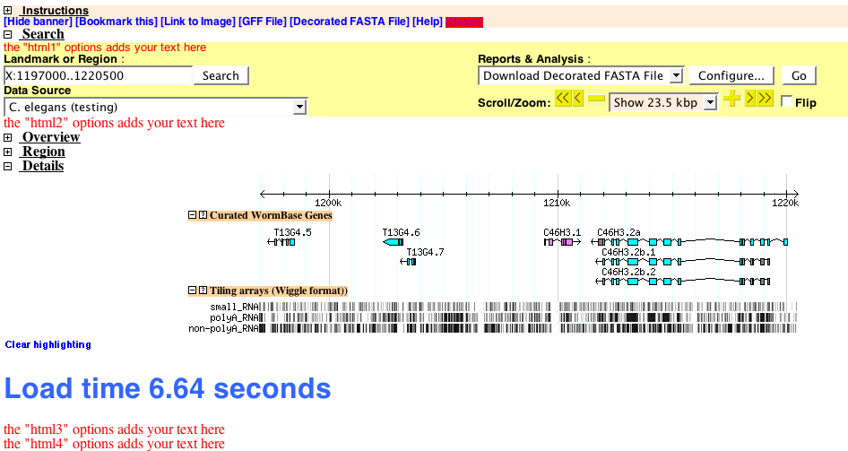

# Gbrowse Benchmarking

From GMOD

Jump to: [navigation](#mw-navigation), [search](#p-search)

# Using Javascript to Benchmark Gbrowse Image Generation and Loading

The following recipe shows how to use existing options, such as
**head**, **html2**, etc., to add javascript functionality to
[GBrowse](GBrowse.1 "GBrowse") via the configuration file. This example
is used for benchmarking page loading and image generation.  
  

  

- **Note:** When coding Javascript in GBrowse config files, there are a
  few caveats:
  - The option text gets parsed into a string with no line-breaks, so be
    sure to terminate all javascript statements with a ';'.
  - Do not add javascript style '//' or '/\*\*/' comments to the
    javascript code. They will break the script due to the way the
    configuration file is parsed.
  - You can add comments to your javascript, or anywhere else in the
    configuration file, by starting a new line with '#', which will be
    ignored by the parser and not added to the final javascript.

### First Step: Adding a simple script to the page header

- The first bit of javascript goes into the page header using the
  "**head**" option in the \[GENERAL\] section:
- Any text added with the **head** option gets added to the
  \<head\>\</head\> element, before the body of the page is printed.
- In this case, we are initializing a javascript global variable
  'start', which stores the time at which the \<head\>\</head\> element
  was printed, to a precision of .001 seconds.

<!-- -->

    head=  

### Next Step: Inserting Time Stamps into the Gbrowse Output

- The next steps use the **html*x*** options, where ***x*** = 1-6. These
  options will add HTML to strategic locations in the GBrowse output.
- **html3** and **html4** both add HTML immediately after the 'Overview,
  'Region' (if applicable) and 'Details' panels are printed and can be
  use interchangeably.
- The three panels contains all of the genome browser images.
- Once printed to the browser, the javascript code will execute and
  replace the "placeholder" text with a calculated time interval since
  the \<head\>\</head\> element was printed.
- This gives an approximation of how long it has taken to render or
  un-cache the images.
- It is useful for testing load times of different track combinations,
  new features, etc.

<!-- -->

    html3 = <h1 id=html3>placeholder</h1>
            

Retrieved from
"<http://gmod.org/mediawiki/index.php?title=Gbrowse_Benchmarking&oldid=5168>"

[Categories](Special:Categories "Special:Categories"):

- [GBrowse](Category:GBrowse "Category:GBrowse")
- [HOWTO](Category:HOWTO "Category:HOWTO")
- [Javascript](Category:Javascript "Category:Javascript")
- [Documentation](Category:Documentation "Category:Documentation")

## Navigation menu

### Namespaces

- <a href="Gbrowse_Benchmarking" accesskey="c"
  title="View the content page [c]">Page</a>
- <a
  href="http://gmod.org/mediawiki/index.php?title=Talk:Gbrowse_Benchmarking&amp;action=edit&amp;redlink=1"
  accesskey="t"
  title="Discussion about the content page [t]">Discussion</a>

### 

### Variants

### Views

- [Read](Gbrowse_Benchmarking)
- <a
  href="http://gmod.org/mediawiki/index.php?title=Gbrowse_Benchmarking&amp;action=edit"
  accesskey="e" title="This page is protected.
  You can view its source [e]">View source</a>
- <a
  href="http://gmod.org/mediawiki/index.php?title=Gbrowse_Benchmarking&amp;action=history"
  accesskey="h" title="Past revisions of this page [h]">View history</a>

### Actions

### Search

### Navigation

- [GMOD Home](Main_Page)
- [Software](GMOD_Components)
- [Categories /
  Tags](Categories)
- [View all pages](Special:AllPages)

### Documentation

- [Overview](Overview)
- [FAQs](Category:FAQ)
- [HOWTOs](Category:HOWTO)
- [Glossary](Glossary)

### Community

- [GMOD News](GMOD_News)
- [Training /
  Outreach](Training_and_Outreach)
- [Support](Support)
- [GMOD Promotion](GMOD_Promotion)
- [Meetings](Meetings)
- [Calendar](Calendar)

### Tools

- <a href="Special:WhatLinksHere/Gbrowse_Benchmarking" accesskey="j"
  title="A list of all wiki pages that link here [j]">What links here</a>
- <a href="Special:RecentChangesLinked/Gbrowse_Benchmarking" accesskey="k"
  title="Recent changes in pages linked from this page [k]">Related
  changes</a>
- <a href="Special:SpecialPages" accesskey="q"
  title="A list of all special pages [q]">Special pages</a>
- <a
  href="http://gmod.org/mediawiki/index.php?title=Gbrowse_Benchmarking&amp;printable=yes"
  rel="alternate" accesskey="p"
  title="Printable version of this page [p]">Printable version</a>
- [Permanent
  link](http://gmod.org/mediawiki/index.php?title=Gbrowse_Benchmarking&oldid=5168 "Permanent link to this revision of the page")
- [Page
  information](http://gmod.org/mediawiki/index.php?title=Gbrowse_Benchmarking&action=info)
- <a href="Special:Browse/Gbrowse_Benchmarking" rel="smw-browse">Browse
  properties</a>
- [Print as
  PDF](http://gmod.org/mediawiki/index.php?title=Special:PdfPrint&page=Gbrowse_Benchmarking)

- Last updated at 02:17 on 4 April
  2008.
- 31,585 page views.
- Content is available under
  <a href="http://www.gnu.org/licenses/fdl-1.3.html" class="external"
  rel="nofollow">a GNU Free Documentation License</a> unless otherwise
  noted.

<!-- -->

- [About
  GMOD](GMOD:About "GMOD:About")

<!-- -->

- 
- 
  

