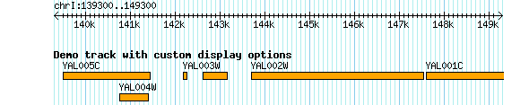
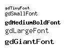
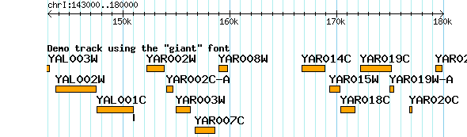
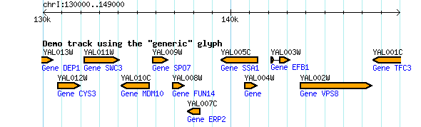
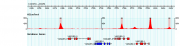
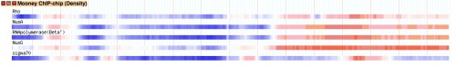
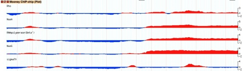

# Glyphs and Glyph Options

From GMOD

Jump to: [navigation](#mw-navigation), [search](#p-search)

## Contents

- [1 Selecting and
  Configuring Glyphs](#Selecting_and_Configuring_Glyphs)
- [2 Values Used in
  Glyph Options](#Values_Used_in_Glyph_Options)
  - [2.1
    Colors](#Colors)
    - [2.1.1 By
      Name](#By_Name)
    - [2.1.2 By
      HTML Value](#By_HTML_Value)
    - [2.1.3 Using
      CSS Notation](#Using_CSS_Notation)
    - [2.1.4 Alpha
      (Transparency) Values](#Alpha_.28Transparency.29_Values)
  - [2.2 True/False
    Values](#True.2FFalse_Values)
  - [2.3
    Fonts](#Fonts)
  - [2.4 Screen
    Measurements](#Screen_Measurements)
- [3 Glyphs and
  their Configuration
  Options](#Glyphs_and_their_Configuration_Options)
  - [3.1
    generic](#generic)
  - [3.2
    alignment](#alignment)
  - [3.3
    allele_tower](#allele_tower)
  - [3.4
    anchored_arrow](#anchored_arrow)
  - [3.5
    arrow](#arrow)
  - [3.6
    box](#box)
  - [3.7
    broken_line](#broken_line)
  - [3.8
    cds](#cds)
  - [3.9
    christmas_arrow](#christmas_arrow)
  - [3.10
    cross](#cross)
  - [3.11
    dashed_line](#dashed_line)
  - [3.12
    diamond](#diamond)
  - [3.13
    dna](#dna)
  - [3.14
    dot](#dot)
  - [3.15
    dumbbell](#dumbbell)
  - [3.16
    ellipse](#ellipse)
  - [3.17
    ex](#ex)
  - [3.18
    extending_arrow](#extending_arrow)
  - [3.19
    fixedwidth](#fixedwidth)
  - [3.20
    flag](#flag)
  - [3.21
    gene](#gene)
  - [3.22
    graded_segments](#graded_segments)
  - [3.23
    group](#group)
  - [3.24
    hat](#hat)
  - [3.25
    heat_map](#heat_map)
  - [3.26
    heat_map_ideogram](#heat_map_ideogram)
  - [3.27
    heterogeneous_segments](#heterogeneous_segments)
  - [3.28
    hidden](#hidden)
  - [3.29
    hybrid_plot](#hybrid_plot)
  - [3.30
    ideogram](#ideogram)
  - [3.31
    image](#image)
  - [3.32
    lightning](#lightning)
  - [3.33
    line](#line)
  - [3.34
    merge_parts](#merge_parts)
  - [3.35
    merged_alignment](#merged_alignment)
  - [3.36
    minmax](#minmax)
  - [3.37
    oval](#oval)
  - [3.38
    pairplot](#pairplot)
  - [3.39
    pentagram](#pentagram)
  - [3.40
    phylo_align](#phylo_align)
  - [3.41
    pinsertion](#pinsertion)
  - [3.42
    primers](#primers)
  - [3.43
    processed_transcript](#processed_transcript)
  - [3.44
    protein](#protein)
  - [3.45
    ragged_ends](#ragged_ends)
  - [3.46
    rainbow_gene](#rainbow_gene)
  - [3.47
    redgreen_box](#redgreen_box)
  - [3.48
    redgreen_segment](#redgreen_segment)
  - [3.49
    repeating_shape](#repeating_shape)
  - [3.50
    rndrect](#rndrect)
  - [3.51
    ruler_arrow](#ruler_arrow)
  - [3.52
    saw_teeth](#saw_teeth)
  - [3.53
    segmented_keyglyph](#segmented_keyglyph)
  - [3.54
    segments](#segments)
  - [3.55
    smoothing](#smoothing)
  - [3.56
    span](#span)
  - [3.57
    spectrogram](#spectrogram)
  - [3.58
    splice_site](#splice_site)
  - [3.59
    stackedplot](#stackedplot)
  - [3.60
    ternary_plot](#ternary_plot)
  - [3.61
    text_in_box](#text_in_box)
  - [3.62
    three_letters](#three_letters)
  - [3.63
    tic_tac_toe](#tic_tac_toe)
  - [3.64
    toomany](#toomany)
  - [3.65
    topoview](#topoview)
  - [3.66
    trace](#trace)
  - [3.67
    track](#track)
  - [3.68
    transcript](#transcript)
  - [3.69
    transcript2](#transcript2)
  - [3.70
    translation](#translation)
  - [3.71
    triangle](#triangle)
  - [3.72
    two_bolts](#two_bolts)
  - [3.73
    vista_plot](#vista_plot)
  - [3.74
    wave](#wave)
  - [3.75
    weighted_arrow](#weighted_arrow)
  - [3.76
    whiskerplot](#whiskerplot)
  - [3.77
    wiggle_box](#wiggle_box)
  - [3.78
    wiggle_density](#wiggle_density)
  - [3.79
    wiggle_xyplot](#wiggle_xyplot)
  - [3.80
    wiggle_minmax](#wiggle_minmax)
  - [3.81
    xyplot](#xyplot)

See also: [GBrowse
Configuration/Glyphs](GBrowse_Configuration/Glyphs "GBrowse Configuration/Glyphs")

> **This page or section needs to be edited.**
> Please help by <a
> href="http://gmod.org/mediawiki/index.php?title=Glyphs_and_Glyph_Options&amp;action=edit"
> class="external text" rel="nofollow">editing this page</a> to
> add your revisions or additions.

[GBrowse](GBrowse.1 "GBrowse") offers many different options for
displaying tracks. Tracks are generated by the Perl
<a href="http://search.cpan.org/perldoc?Bio::Graphics"
class="external text" rel="nofollow">Bio::Graphics</a> module, which is
the definitive reference for the various display options in GBrowse.
This page provides an introduction to the most commonly used glyphs.

# Selecting and Configuring Glyphs

Every GBrowse \[Track\] stanza should have a **glyph** option. This
option selects the shape and behavior of each feature rendered in the
track. Other options fine tune the glyph's appearance by selecting its
height, color, and other display properties. Several standard display
options are shared among all glyphs; others are glyph-specific.

The simplest \[Track\] stanza will look like this:

Figure 1: The "generic" glyph with all its defaults.

    [Demo]
    feature = gene
    glyph   = generic

The "generic" glyph is the basis of all other glyphs and simply draws a
solid box using the cyan color. A track rendered with this configuration
will look like Figure 1.

You can change the default appearance of the generic glyph using the
standard **height**, **bgcolor**, and **fgcolor** options. You can also
assign a longer key to the track using the **key** option. For example:

Figure 2: The "generic" glyph with changed options.

    [Demo]
    feature = gene
    glyph   = generic
    bgcolor = orange
    fgcolor = black
    height  = 9
    key     = Demo track with custom display options

Figure 2 shows how this will appear.

# Values Used in Glyph Options

Before we dive into the various glyphs and their options, we will
discuss colors, true/false flags, and other values that are used in the
options.

## Colors

Many options accept color values. You can specify colors by name, by
HTML value, or using CSS (cascading stylesheet) notation.

### By Name

GBrowse color-related options accept human readable color names like
"yellow" and "chartreuse". The full list is contained in the color chart
in Figure 3.

Figure3: Named colors

### By HTML Value

GBrowse accepts HTML style color values in the form "#RRGGBB", where RR,
GG and BB are the red, green and blue intensity values respectively. The
intensity values are expressed in hexadecimal, and range from 00
(completely off) to FF (completely on). Black is \#000000 (all colors
off), and white is \#FFFFFF (all colors at full intensity). See
<a href="http://www.w3schools.com/Html/html_colors.asp"
class="external text" rel="nofollow">HTML Colors</a> for several nice
tables of common \#RRGGBB combinations. For example, to give a glyph a
bright blue background, you could specify a **bgcolor** option like
this:

    bgcolor = #0000FF

### Using CSS Notation

GBrowse also accepts
<a href="http://www.w3.org/TR/css3-color/" class="external text"
rel="nofollow">Cascading Stylesheeet Level 3</a> color specifications,
which are in the form "rgb(r,g,b)", where r, g, b are red, green and
blue color intensities expressed as percentages or decimal values from 0
to 255. In the percentage form, a bright red background color would be
expressed as:

    bgcolor = rgb(100%,0%,0%)

in the second form, the color yellow (which is an equal combination of
red and green in rgb space) could be written as:

    bgcolor = rgb(255,255,0)

### Alpha (Transparency) Values

You can also create colors with various degrees of translucency by
specifying an alpha value. Alpha values can be specified as a
hexadecimal value, as a floating point number between 0.0 and 1.0, or as
a percentage from 0% to 100%. When using a named color, you can specify
the degree of opacity in either of these ways:

    bgcolor = blue:0.8
    bgcolor = blue:80%

Either of these forms specifies a blue value that is 80% opaque. Values
of 0.0 or 0% will create an entirely transparent color (which will
appear as a "hole" in the drawing canvas), while values of 1.0 or 100%
will create an entirely opaque color.

To specify alpha values with CSS syntax, use the "rgba(r,g,b,a)"
notation, where "a" is the value of the alpha channel expressed either
as a floating point number between 0.0 and 1.0, or as a percentage. In
this form, 80% blue can be expressed in any of these forms:

    bgcolor = rgba(0%,0%,100%,80%)
    bgcolor = rgba(0,0,255,80%)
    bgcolor = rgba(0,0,255,0.8)

Finally, you can use an extension of the HTML color format to specify
the color and alpha values as \#RRGGBBAA, where AA is the hexadecimal
representation of alpha. This format is a bit unintuitive because the
alpha channel is expressed as a hexadecimal number between 0 and 7F
(decimal 127), where 0 is completely **opaque** and 7F is completely
**transparent**. This reversal of the direction of opacity reflects how
alpha is represented in the underlying graphics data structure. In this
format, 80% blue can be expressed as:

    bgcolor = #0000FF19

## True/False Values

Many options are flags that turn certain features on or off. GBrowse
follows the Perl programming language convention of using 0 (zero) as
false, and accepting any non-zero value as true. Most commonly, people
use 0 for false and 1 for true. For example, the "gene" glyph takes a
**decorate_introns** option, which if true draws little arrowheads on
the introns of the gene's transcripts to indicate the direction of
transcription. To activate this feature, set the option to a true value:

    decorate_introns = 1

to deactivate, set it to false:

    decorate_introns = 0

## Fonts

Figure 4: Fonts available to GBrowse

Some options, such as the generic **font** option, expect a font name.
GBrowse provides a small set of fixed-width fonts provided by the
\[<a href="http://search.cpan.org/dist/GD" class="external text"
rel="nofollow">GD library package</a>\], named
"gdTinyFont","gdSmallFont", "gdMediumBoldFont","gdLargeFont" and
"gdGiantFont". They are all shown together in Figure 4.

If not specified, most glyphs default to "gdSmallFont". Figure 5 shows
the effect of changing the font to "gdLargeFont" and turning on feature
labeling, as shown in the example below:

    [Demo]
    feature = gene
    glyph   = generic
    font    = gdGiantFont
    bgcolor = orange
    fgcolor = black
    height  = 9
    key     = Demo track using the "giant" font

Figure 5: Changing the font

  

## Screen Measurements

All dimensions, such as height and margins, are given in pixel
coordinates:

    height = 12

No other measurement types, such as points, centimeters or ems are
recognized.

# Glyphs and their Configuration Options

Ths section describes each of the common glyphs, shows a sample
configuration stanza, and lists its options and possible values. A list
of some of the defined glyphs can be found in the documentation of
<a href="http://search.cpan.org/perldoc?Bio::Graphics"
class="external text" rel="nofollow">Bio::Graphics</a>.

You can find a sizable list of samples of each glyph at
<a href="http://webgbrowse.cgb.indiana.edu/glyphdoc.html"
class="external text" rel="nofollow">webgbrowse.cgb.indiana.edu</a>.

## generic

Figure 6: The generic glyph with all the trimmings

The *generic* glyph is the basis for all other glyphs and is the default
if the glyph option is not explicitly stated. The following is a
representative track stanza that uses several of generic's possible
options:

    [Demo]
    feature     = gene
    glyph       = generic
    font        = gdSmallFont
    bgcolor     = orange
    fgcolor     = black
    linewidth   = 2
    height      = 9
    stranded    = 1
    label       = 1
    connector   = solid
    description = sub {my $feature    = shift;
                       my @gene_names = $feature->get_tag_values('gene');
               return "Gene @gene_names";
               }
    link        = http://www.google.com/search?q=$name
    key         = Demo track using the "generic" glyph

The result is shown in Figure 6. This example illustrates a pair of
advanced features described in the [GBrowse 2.0
HOWTO](GBrowse_2.0_HOWTO "GBrowse 2.0 HOWTO"). The first advanced
feature is the **link** option, which specifies where to link to when
the user clicks on the feature. The example specifies
"<a href="http://www.google.com/search?q=$name" class="external free"
rel="nofollow">http://www.google.com/search?q=$name</a>". When GBrowse
renders the page, \$name will be replaced with the name of the feature
as specified in the underlying database.

A more complex example is the **description** option, which controls the
optional text printed below the feature, is a Perl subroutine callback.
It retrieves the feature from the subroutine parameter list (using the
"shift" operator) and stores it into a variable named "\$feature". It
then calls the feature's *get_tag_values()* method to retrieve
descriptive tags of type "gene", here used to store the common gene
name. The gene names are stored into an array named "@gene_names."
Lastly, the subroutine returns a string consisting of the word "Gene"
followed by the list of gene names.

The full list of options recognized by generic and all descendent glyphs
is given in the following table:

| Name | Description | Default Value |
|----|----|----|
| key | Description of the track in the tracks table. | *same as the stanza label* |
| category | The category of the track in the tracks table. You may use the format "category1:category2:category3" to specify subcategories. | *Uncategorized tracks will be placed in a hold-all named "General"* |
| fgcolor | The foreground color of the glyph; this will be used in drawing the rectangular border of the glyph. | *black* |
| bgcolor | The background color of the glyph; this will be used in filling the contents of the glyph rectangle. | *cyan* |

All the options recognized by "generic" and descendents

  

## alignment

Bio::Graphics::Glyph::alignment

## allele_tower

Bio::Graphics::Glyph::allele_tower

## anchored_arrow

Bio::Graphics::Glyph::anchored_arrow

## arrow

Bio::Graphics::Glyph::arrow

## box

Bio::Graphics::Glyph::box

## broken_line

Bio::Graphics::Glyph::broken_line

## cds

Bio::Graphics::Glyph::cds

## christmas_arrow

Bio::Graphics::Glyph::christmas_arrow

## cross

Bio::Graphics::Glyph::cross

## dashed_line

Bio::Graphics::Glyph::dashed_line

## diamond

Bio::Graphics::Glyph::diamond

## dna

Bio::Graphics::Glyph::dna

## dot

Bio::Graphics::Glyph::dot

## dumbbell

Bio::Graphics::Glyph::dumbbell

## ellipse

Bio::Graphics::Glyph::ellipse

## ex

Bio::Graphics::Glyph::ex

## extending_arrow

Bio::Graphics::Glyph::extending_arrow

## fixedwidth

Bio::Graphics::Glyph::fixedwidth

## flag

Bio::Graphics::Glyph::flag

## gene

Bio::Graphics::Glyph::gene

## graded_segments

Bio::Graphics::Glyph::graded_segments

## group

Bio::Graphics::Glyph::group

## hat

Bio::Graphics::Glyph::hat

## heat_map

Bio::Graphics::Glyph::heat_map

## heat_map_ideogram

Bio::Graphics::Glyph::heat_map_ideogram

## heterogeneous_segments

Bio::Graphics::Glyph::heterogeneous_segments

## hidden

Bio::Graphics::Glyph::hidden

## hybrid_plot

Bio::Graphics::Glyph::hybrid_plot

## ideogram

Bio::Graphics::Glyph::ideogram

## image

Bio::Graphics::Glyph::image

## lightning

Bio::Graphics::Glyph::lightning

## line

Bio::Graphics::Glyph::line

## merge_parts

Bio::Graphics::Glyph::merge_parts

## merged_alignment

Bio::Graphics::Glyph::merged_alignment

## minmax

Bio::Graphics::Glyph::minmax

## oval

Bio::Graphics::Glyph::oval

## pairplot

Bio::Graphics::Glyph::pairplot

## pentagram

Bio::Graphics::Glyph::pentagram

## phylo_align

Bio::Graphics::Glyph::phylo_align

## pinsertion

Bio::Graphics::Glyph::pinsertion

## primers

Bio::Graphics::Glyph::primers

## processed_transcript

Bio::Graphics::Glyph::processed_transcript

## protein

Bio::Graphics::Glyph::protein

## ragged_ends

Bio::Graphics::Glyph::ragged_ends

## rainbow_gene

Bio::Graphics::Glyph::rainbow_gene

## redgreen_box

Bio::Graphics::Glyph::redgreen_box

## redgreen_segment

Bio::Graphics::Glyph::redgreen_segment

## repeating_shape

Bio::Graphics::Glyph::repeating_shape

## rndrect

Bio::Graphics::Glyph::rndrect

## ruler_arrow

Bio::Graphics::Glyph::ruler_arrow

## saw_teeth

Bio::Graphics::Glyph::saw_teeth

## segmented_keyglyph

Bio::Graphics::Glyph::segmented_keyglyph

## segments

Bio::Graphics::Glyph::segments

## smoothing

Bio::Graphics::Glyph::smoothing

## span

Bio::Graphics::Glyph::span

## spectrogram

Bio::Graphics::Glyph::spectrogram

## splice_site

Bio::Graphics::Glyph::splice_site

## stackedplot

Bio::Graphics::Glyph::stackedplot

## ternary_plot

Bio::Graphics::Glyph::ternary_plot

## text_in_box

Bio::Graphics::Glyph::text_in_box

## three_letters

Bio::Graphics::Glyph::three_letters

## tic_tac_toe

Bio::Graphics::Glyph::tic_tac_toe

## toomany

Bio::Graphics::Glyph::toomany

## topoview

Bio::Graphics::Glyph::topoview

    [TOPOVIEWLOG2]                                                                                                                                                                                                                                                                                                                                                                                                                                                                               
    database      = scaffolds                                                                                                                                                                                                                                                                                                                                                                                                                                                                    
    feature       = region                                                                                                                                                                                                                                                                                                                                                                                                                                                                       
    glyph         = topoview                                                                                                                                                                                                                                                                                                                                                                                                                                                                     
    autoscale     = local                                                                                                                                                                                                                                                                                                                                                                                                                                                                        
    height        = 80                                                                                                                                                                                                                                                                                                                                                                                                                                                                          
    datadir       = /home/ubuntu/data/bam/log2                                                                                                                                                                                                                                                                                                                                                                                                                                                   
    subset order  = SRR1810778.25  FF9966                                                                                                                                                                                                                                                                                                                                                                                                                                                        
                    SRR1810779.25  FF6633                                                                                                                                                                                                                                                                                                                                                                                                                                                        
                    SRR1810780.25  FF0000                                                                                                                                                                                                                                                                                                                                                                                                                                                        
                    SRR1810781.25  00CC66                                                                                                                                                                                                                                                                                                                                                                                                                                                        
                    SRR1810782.25  009933                                                                                                                                                                                                                                                                                                                                                                                                                                                        
                    SRR1810783.25  006600                                                                                                                                                                                                                                                                                                                                                                                                                                                        
    key           = TopHat: Normalized Read Coverage (log2)                                                                                                                                                                                                                                                                                                                                                                                                                                      
    show max      = 0                                                                                                                                                                                                                                                                                                                                                                                                                                                                            
    x_step        = 2                                                                                                                                                                                                                                                                                                                                                                                                                                                                            
    y_step        = 8                                                                                                                                                                                                                                                                                                                                                                                                                                                                            
    fill opacity  = 0.8    

## trace

Bio::Graphics::Glyph::trace

## track

Bio::Graphics::Glyph::track

## transcript

Bio::Graphics::Glyph::transcript

## transcript2

Bio::Graphics::Glyph::transcript2

## translation

Bio::Graphics::Glyph::translation

## triangle

Bio::Graphics::Glyph::triangle

## two_bolts

Bio::Graphics::Glyph::two_bolts

## vista_plot

A vista_plot Track

This is a combination XY or density plot with superimposed peak calls;
it is typically used with ChIP-seq and ChIP-chip data. Please see [Using
the vista_plot
Glyph](Using_the_vista_plot_Glyph "Using the vista plot Glyph") for
instructions.

## wave

Bio::Graphics::Glyph::wave

## weighted_arrow

Bio::Graphics::Glyph::weighted_arrow

## whiskerplot

Bio::Graphics::Glyph::whiskerplot

## wiggle_box

Bio::Graphics::Glyph::wiggle_box

## wiggle_density

Sample of (5 of) the wiggle_density glyph.

A density glyph compatible with the "wig" data format. Varies the
intensity of the hues corresponding to the value of the data. You can
set a pivot point around which the color changes to more easily
visualize negative values.

    [wiggle_density]
    feature       = Mooney_wiggle
    glyph         = wiggle_density
    height        = 10
    fgcolor       = black
    bicolor_pivot = 0
    pos_color     = red
    neg_color     = blue
    key           = Mooney ChIP-chip (Density)
    category      = Experimental Data
    label         = 1

## wiggle_xyplot

Sample track containing 5 "stacked" wiggle_xyplot glyphs.

An xy-plot compatible with dense "wig" data. See the documentation for
<a
href="http://search.cpan.org/perldoc?Bio::Graphics::Glyph::wiggle_xyplot"
class="external text"
rel="nofollow">Bio::Graphics::Glyph::wiggle_xyplot</a>.

It produces the typical xyplot, but uses the wig data for dense data
sets. In the example the `bicolor_pivot` parameter has been set to `0`,
and the `pos_color` and `neg_color` were set to obtain the conditional
coloring.

    [wiggle_xyplot]
    feature       = Mooney_wiggle
    glyph         = wiggle_xyplot
    height        = 20
    fgcolor       = black
    bicolor_pivot = 0
    pos_color     = red
    neg_color     = blue
    key           = Mooney ChIP-chip (Plot)
    category      = Experimental Data
    label         = 0
    citation      = Mooney RA, Davis SE, Peters JM, Rowland JL et al.
                    Regulator trafficking on bacterial transcription units in vivo. Mol Cell 2009 Jan 16;33(1):97-108.
    label         = 1

  

## wiggle_minmax

Bio::Graphics::Glyph::wiggle_minmax

## xyplot

Bio::Graphics::Glyph::xyplot

Retrieved from
"<http://gmod.org/mediawiki/index.php?title=Glyphs_and_Glyph_Options&oldid=26651>"

[Categories](Special:Categories "Special:Categories"):

- [Needs Editing](Category:Needs_Editing "Category:Needs Editing")
- [GBrowse](Category:GBrowse "Category:GBrowse")

## Navigation menu

### Namespaces

- <a href="Glyphs_and_Glyph_Options" accesskey="c"
  title="View the content page [c]">Page</a>
- <a
  href="http://gmod.org/mediawiki/index.php?title=Talk:Glyphs_and_Glyph_Options&amp;action=edit&amp;redlink=1"
  accesskey="t"
  title="Discussion about the content page [t]">Discussion</a>

### 

### Variants

### Navigation

- [GMOD Home](Main_Page)
- [Software](GMOD_Components)
- [Categories /
  Tags](Categories)
- [View all pages](Special:AllPages)

### Documentation

- [Overview](Overview)
- [FAQs](Category:FAQ)
- [HOWTOs](Category:HOWTO)
- [Glossary](Glossary)

### Community

- [GMOD News](GMOD_News)
- [Training /
  Outreach](Training_and_Outreach)
- [Support](Support)
- [GMOD Promotion](GMOD_Promotion)
- [Meetings](Meetings)
- [Calendar](Calendar)

### Tools

- <a href="Special:Browse/Glyphs_and_Glyph_Options"
  rel="smw-browse">Browse properties</a>
- [Print as
  PDF](http://gmod.org/mediawiki/index.php?title=Special:PdfPrint&page=Glyphs_and_Glyph_Options)

- Last updated at 22:35 on 27 March
  2015.
<!-- - 253,396 page views. -->
- Content is available under
  <a href="http://www.gnu.org/licenses/fdl-1.3.html" class="external"
  rel="nofollow">a GNU Free Documentation License</a> unless otherwise
  noted.

<!-- -->

- [About
  GMOD](GMOD:About "GMOD:About")

<!-- -->

- 

