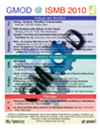

# ISMB 2010

From GMOD

Jump to: [navigation](#mw-navigation), [search](#p-search)

<table>
<colgroup>
<col style="width: 33%" />
<col style="width: 33%" />
<col style="width: 33%" />
</colgroup>
<tbody>
<tr class="odd">
<td>

GMOD will also have a strong presence at <a href="ISMB/ECCB_2011"
title="ISMB/ECCB 2011">ISMB/ECCB 2011</a>.

</td>
<td><a href="http://www.iscb.org/ismb2010" class="external text"
rel="nofollow">ISMB 2010</a> was held July 9-13 in Boston. As in past
years, there was once again significant GMOD content at ISMB, including
<ul>
<li>talks on <a href="Galaxy.1" title="Galaxy">Galaxy</a>, <a
href="GBrowse.1" title="GBrowse">GBrowse</a>, <a href="JBrowse.1"
title="JBrowse">JBrowse</a>, <a href="Pathway_Tools.1"
title="Pathway Tools">Pathway Tools</a>, ...</li>
<li>a tutorial on <a href="Galaxy.1" title="Galaxy">Galaxy</a>,</li>
<li>many posters, and</li>
<li>several Special Interest Group (SIG) meetings relevant to GMOD
members.</li>
</ul></td>
<td></td>
</tr>
</tbody>
</table>

  

## Events, Talks, and Posters

| Day | Time | Track | Title & Presenter/Organizer | Components | Slides / Poster |
|----|:--:|----|----|----|----|
| Friday & Saturday July 9-10 | 8:30-6:30 | <a href="http://www.iscb.org/ismb2010-program/satellite-meetings"
class="external text" rel="nofollow">Satellites &amp; SIGs</a> | <a href="http://www.open-bio.org/wiki/BOSC_2010" class="external text"
rel="nofollow">Bioinformatics Open Source Conference (BOSC)</a>, Kam Dahlquist | See below for specific talks | <a href="http://www.slideshare.net/bosc2010/presentations"
class="external text" rel="nofollow">SlideShare</a> |
|  |  |  | <a
href="http://www.iscb.org/ismb2010-program/satellite-meetings#BioOntologies#BioOntologies"
class="external text" rel="nofollow">Bio-Ontologies</a>, Nigam Shah, *et al.* |  |  |
|  |  |  | <a
href="http://www.iscb.org/ismb2010-program/satellite-meetings#HiTSeq#HiTSeq"
class="external text" rel="nofollow">HITSeq: High throughput
Sequencing</a>, Inanc Birol, *et al.* |  |  |
|  |  |  | <a
href="http://gensc.org/gc_wiki/images/8/87/BioSharing-SIG-Handout.pdf"
class="external text" rel="nofollow">Metagenomics, Metadata,
Meta-analysis (M3) &amp; BioSharing</a>, Ed DeLong, *et al.* |  |  |
|  |  |  |  |  |  |
| Friday July 9 | 12:15-12:30 | <a
href="http://www.iscb.org/ismb2010-program/satellite-meetings#BOSC#BOSC"
class="external text" rel="nofollow">BOSC</a> | <a href="http://www.slideshare.net/bosc2010/afgan-bosc2010-galaxycloud"
class="external text" rel="nofollow">Deploying Galaxy on the Cloud</a>, Enis Afgan, | [Galaxy](Galaxy.1 "Galaxy") | <a href="../mediawiki/images/3/3e/DeployingGalaxyCloudBOSC2010.pdf"
class="internal" title="DeployingGalaxyCloudBOSC2010.pdf">PDF</a> |
|  | 3:30-3:38 |  | <a
href="http://www.slideshare.net/bosc2010/hemmerich-bosc2010-isgaergatis"
class="external text" rel="nofollow">Automated Annotation of NGS
Transcriptome Data using ISGA and Ergatis</a>, [Chris Hemmerich](User:Chemmeri "User:Chemmeri") | <a href="Ergatis" class="mw-redirect" title="Ergatis">Ergatis</a> | <a href="../mediawiki/images/1/10/NGSTranscriptomeISGAErgatis.pdf"
class="internal" title="NGSTranscriptomeISGAErgatis.pdf">PDF</a> |
|  |  |  |  |  |  |
| Saturday July 10 | 1:30-5:30 | <a href="http://www.iscb.org/ismb2010-program/ismb2010-tutorials"
class="external text" rel="nofollow">Tutorials</a> | <a
href="http://www.iscb.org/ismb2010-program/ismb2010-tutorials#PM4#PM4"
class="external text" rel="nofollow">PM 4: Galaxy: Analyze, Visualize,
Communicate</a>, The [Galaxy](Galaxy.1 "Galaxy") Team | [Galaxy](Galaxy.1 "Galaxy") |  |
|  | 4:00-4:15 | <a
href="http://www.iscb.org/ismb2010-program/satellite-meetings#BOSC#BOSC"
class="external text" rel="nofollow">BOSC</a> | <a href="http://www.open-bio.org/w/images/d/df/34_BOSC2010.pdf"
class="external text" rel="nofollow">GBrowse2</a>, [Lincoln Stein](User:Lstein "User:Lstein") | [GBrowse](GBrowse.1 "GBrowse") | <a href="http://prezi.com/xwpsks7tnnd8/gbrowse-20-bosc-talk/"
class="external text" rel="nofollow">Prezi</a> |
|  |  |  |  |  |  |
| Sunday July 11 | 12:40-2:30 | <a
href="http://www.iscb.org/cms_addon/conferences/ismb2010/posterlist.php"
class="external text" rel="nofollow">Posters</a> | <a
href="http://www.iscb.org/cms_addon/conferences/ismb2010/posterlist.php?cat=I"
class="external text" rel="nofollow">I01: AGeS: A Software System for
Annotation and Analysis of Genome Sequences</a>, Nela Zavaljevski | [DIYA](DIYA "DIYA"), [GBrowse](GBrowse.1 "GBrowse") | <a href="../mediawiki/images/1/1c/AGesISMB2010Poster.pptx"
class="internal" title="AGesISMB2010Poster.pptx">PPT</a>, <a href="../mediawiki/images/1/14/AGesISMB2010Poster.pdf"
class="internal" title="AGesISMB2010Poster.pdf">PDF</a> |
|  |  |  | <a
href="http://www.iscb.org/cms_addon/conferences/ismb2010/posterlist.php?cat=I"
class="external text" rel="nofollow">I15: GBrowse and Next Generation
Sequencing Data</a>, [Scott Cain](User:Scott "User:Scott") | [GBrowse](GBrowse.1 "GBrowse") |  |
|  | 2:30-3:25 | <a
href="http://www.iscb.org/cms_addon/conferences/ismb2010/technologytrack.php"
class="external text" rel="nofollow">Technology</a> | <a
href="http://www.iscb.org/cms_addon/conferences/ismb2010/technologytrack.php#TT08#TT08"
class="external text" rel="nofollow">TT08: InterPro protein sequence
analysis and classification</a>, Sarah Hunter | [BioMart](BioMart "BioMart") |  |
|  |  |  |  |  |  |
| Monday July 12 | 12:40-2:30 | <a
href="http://www.iscb.org/cms_addon/conferences/ismb2010/posterlist.php"
class="external text" rel="nofollow">Posters</a> | <a
href="http://www.iscb.org/cms_addon/conferences/ismb2010/posterlist.php?cat=E"
class="external text" rel="nofollow">E02: An Advanced Web Query
Interface for Biological Databases</a>, Peter Karp | [Pathway Tools](Pathway_Tools.1 "Pathway Tools") | <a href="../mediawiki/images/b/b3/PathwayToolsPosterISMB2010.ppt"
class="internal" title="PathwayToolsPosterISMB2010.ppt">PPT</a>, <a href="../mediawiki/images/b/be/PathwayToolsPosterISMB2010.pdf"
class="internal" title="PathwayToolsPosterISMB2010.pdf">PDF</a> |
|  |  |  | <a
href="http://www.iscb.org/cms_addon/conferences/ismb2010/posterlist.php?cat=E"
class="external text" rel="nofollow">E18: ZFNGenome: A GBrowse-based
tool for identifying Zinc Finger Nuclease target sites in model
organisms</a>, Deepak Reyon | [GBrowse](GBrowse.1 "GBrowse") | <a href="../mediawiki/images/5/55/ZFNGenomeGBrowseISMB2010.pdf"
class="internal" title="ZFNGenomeGBrowseISMB2010.pdf">PDF</a> |
|  |  |  | <a
href="http://www.iscb.org/cms_addon/conferences/ismb2010/posterlist.php?cat=E"
class="external text" rel="nofollow">E30: Choosing a Genome Browser for
a Model Organism Database: Surveying the Maize Community</a>, Taner Sen | [GBrowse](GBrowse.1 "GBrowse") | <a href="../mediawiki/images/7/75/MaizeGDBGBrowseISMB2010.pdf"
class="internal" title="MaizeGDBGBrowseISMB2010.pdf">PDF</a> |
|  |  |  | <a
href="http://www.iscb.org/cms_addon/conferences/ismb2010/posterlist.php?cat=I"
class="external text" rel="nofollow">I10: Integrative Services for
Genomic Analysis (ISGA) - An Intuitive Web Server for Prokaryotic Genome
Annotation and Other Analyses</a>, [Christopher Hemmerich](User:Chemmeri "User:Chemmeri") | <a href="Ergatis" class="mw-redirect" title="Ergatis">Ergatis</a> | <a href="../mediawiki/images/7/7f/ISGAISMB2010Poster.pdf"
class="internal" title="ISGAISMB2010Poster.pdf">PDF</a> |
|  |  |  | <a
href="http://www.iscb.org/cms_addon/conferences/ismb2010/posterlist.php?cat=J"
class="external text" rel="nofollow">J60:Online Quantitative
Transcriptome Analysis</a>, Regina Bohnert | [Galaxy](Galaxy.1 "Galaxy") | <a
href="../mediawiki/images/e/ec/Oqtans_Online_Quantitative_Transcriptome_AnalysisISMB2010.pdf"
class="internal"
title="Oqtans Online Quantitative Transcriptome AnalysisISMB2010.pdf">PDF</a> |
|  |  |  | <a
href="http://www.iscb.org/cms_addon/conferences/ismb2010/posterlist.php?cat=U"
class="external text" rel="nofollow">U60: Galaxy NGS functionality from
sample tracking to SNP calling: An interactive poster</a>, Ramkrishna Chakrabarty | [Galaxy](Galaxy.1 "Galaxy") | <a href="../mediawiki/images/3/31/GalaxyNGSISMB2010.pdf"
class="internal" title="GalaxyNGSISMB2010.pdf">PDF</a> |
|  |  |  | <a
href="http://www.iscb.org/cms_addon/conferences/ismb2010/posterlist.php?cat=Z"
class="external text" rel="nofollow">Z02: WebGBrowse - A Web Server for
GBrowse</a>, Ram Podicheti | [WebGBrowse](WebGBrowse.1 "WebGBrowse") |  |
|  | 3:30-3:55 | <a
href="http://www.iscb.org/cms_addon/conferences/ismb2010/technologytrack.php"
class="external text" rel="nofollow">Technology</a> | <a
href="http://www.iscb.org/cms_addon/conferences/ismb2010/technologytrack.php#TT26#TT26"
class="external text" rel="nofollow">TT26: NGS Analysis with Galaxy on
the Cloud</a>, Anton Nekrutenko | [Galaxy](Galaxy.1 "Galaxy") |  |
|  | 4:00-4:25 |  | <a
href="http://www.iscb.org/cms_addon/conferences/ismb2010/technologytrack.php#TT28#TT28"
class="external text" rel="nofollow">TT28: Sample tracking and automated
data processing in Galaxy for NGS facilities</a>, Anton Nekrutenko | [Galaxy](Galaxy.1 "Galaxy") |  |
|  |  |  |  |  |  |
| Tuesday July 13 | 11:15-11:40 | <a
href="http://www.iscb.org/cms_addon/conferences/ismb2010/technologytrack.php"
class="external text" rel="nofollow">Technology</a> | <a
href="http://www.iscb.org/cms_addon/conferences/ismb2010/technologytrack.php#TT32#TT32"
class="external text" rel="nofollow">TT32: GMOD Presents GBrowse 2.0 and
JBrowse</a>, [Scott Cain](User:Scott "User:Scott") | [GBrowse](GBrowse.1 "GBrowse"), [JBrowse](JBrowse.1 "JBrowse") | <a href="http://prezi.com/nx4jy4etq-ug/gbrowse-20-and-jbrowse-for-ismb/"
class="external text" rel="nofollow">Prezi</a> |
|  | 11:45-?? | Lunch | Informal gathering at the ISMB lunch. Please look for [Scott Cain](User:Scott "User:Scott") in the back center of the lunch room. There will be "GMOD reserved" table tents on a few tables back there and Scott will be wearing his <a href="http://www.cafepress.com/GenericMOD" class="external text"
rel="nofollow">GMOD shirt</a>. Please stop by and chat if you are at ISMB. |  |  |
|  | 2:45-3:10 | <a
href="http://www.iscb.org/cms_addon/conferences/ismb2010/technologytrack.php"
class="external text" rel="nofollow">Technology</a> | <a
href="http://www.iscb.org/cms_addon/conferences/ismb2010/technologytrack.php#TT38#TT38"
class="external text" rel="nofollow">TT38: Demonstration of The Pathway
Tools Software and BioCyc Databases</a>, Peter Karp. ([Pathway Tools](Pathway_Tools.1 "Pathway Tools") is also featured in the <a
href="http://www.iscb.org/cms_addon/conferences/ismb2010/artscience.php"
class="external text" rel="nofollow">Art and Science Exhibition</a>.) | [Pathway Tools](Pathway_Tools.1 "Pathway Tools") | <a href="../mediawiki/images/b/b9/PathwayToolsTalkISMB2010.ppt"
class="internal" title="PathwayToolsTalkISMB2010.ppt">PPT</a>, <a href="../mediawiki/images/a/a4/PathwayToolsTalkISMB2010.pdf"
class="internal" title="PathwayToolsTalkISMB2010.pdf">PDF</a> |

## Flier

|  |  |
|----|----|
|  | A [flier](File:GMODatISMB2010.pdf "File:GMODatISMB2010.pdf") highlighting GMOD related content at ISMB 2010 is [now available](File:GMODatISMB2010.pdf "File:GMODatISMB2010.pdf"). You can print this ahead of time, or pick up a copy from several of the speakers. |

Retrieved from
"<http://gmod.org/mediawiki/index.php?title=ISMB_2010&oldid=21855>"

[Category](Special:Categories "Special:Categories"):

- [Conferences](Category:Conferences "Category:Conferences")

## Navigation menu

### Namespaces

- <a href="ISMB_2010" accesskey="c"
  title="View the content page [c]">Page</a>
- <a
  href="http://gmod.org/mediawiki/index.php?title=Talk:ISMB_2010&amp;action=edit&amp;redlink=1"
  accesskey="t"
  title="Discussion about the content page [t]">Discussion</a>

### 

### Variants

### Search

### Navigation

- [GMOD Home](Main_Page)
- [Software](GMOD_Components)
- [Categories /
  Tags](Categories)
- [View all pages](Special:AllPages)

### Documentation

- [Overview](Overview)
- [FAQs](Category:FAQ)
- [HOWTOs](Category:HOWTO)
- [Glossary](Glossary)

### Community

- [GMOD News](GMOD_News)
- [Training /
  Outreach](Training_and_Outreach)
- [Support](Support)
- [GMOD Promotion](GMOD_Promotion)
- [Meetings](Meetings)
- [Calendar](Calendar)

### Tools

- <a href="Special:WhatLinksHere/ISMB_2010" accesskey="j"
  title="A list of all wiki pages that link here [j]">What links here</a>
- <a href="Special:RecentChangesLinked/ISMB_2010" accesskey="k"
  title="Recent changes in pages linked from this page [k]">Related
  changes</a>
- <a href="Special:SpecialPages" accesskey="q"
  title="A list of all special pages [q]">Special pages</a>
- <a
  href="http://gmod.org/mediawiki/index.php?title=ISMB_2010&amp;printable=yes"
  rel="alternate" accesskey="p"
  title="Printable version of this page [p]">Printable version</a>
- [Permanent
  link](http://gmod.org/mediawiki/index.php?title=ISMB_2010&oldid=21855 "Permanent link to this revision of the page")
- [Page
  information](http://gmod.org/mediawiki/index.php?title=ISMB_2010&action=info)
- <a href="Special:Browse/ISMB_2010" rel="smw-browse">Browse
  properties</a>
- [Print as
  PDF](http://gmod.org/mediawiki/index.php?title=Special:PdfPrint&page=ISMB_2010)

- Last updated at 01:23 on 3 October
  2012.
- 106,991 page views.
- Content is available under
  <a href="http://www.gnu.org/licenses/fdl-1.3.html" class="external"
  rel="nofollow">a GNU Free Documentation License</a> unless otherwise
  noted.

<!-- -->

- [About
  GMOD](GMOD:About "GMOD:About")

<!-- -->

- 
- 
  

