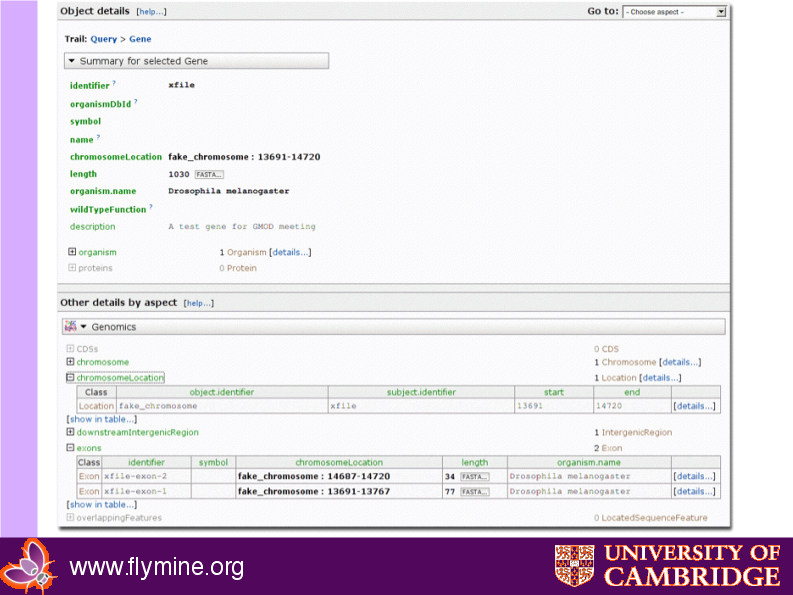

<div id="mw-page-base" class="noprint">

</div>

<div id="mw-head-base" class="noprint">

</div>

<div id="content" class="mw-body" role="main">

<span id="top"></span>

<div id="mw-js-message" style="display:none;">

</div>


# <span dir="auto">InterMine Presentation</span>

<div id="bodyContent">

<div id="siteSub">

From GMOD

</div>

<div id="contentSub">

</div>

<div id="jump-to-nav" class="mw-jump">

Jump to: [navigation](#mw-navigation), [search](#p-search)

</div>

<div id="mw-content-text" class="mw-content-ltr" lang="en" dir="ltr">

This Wiki page is an edited version of
<a href="../mediawiki/images/2/23/InterMine_middleware.pdf"
class="internal" title="InterMine middleware.pdf">Gos's presentation</a>

<div id="toc" class="toc">

<div id="toctitle">

## Contents

</div>

- [<span class="tocnumber">1</span>
  <span class="toctext">Background</span>](#Background)
- [<span class="tocnumber">2</span> <span class="toctext">Technical
  Overview</span>](#Technical_Overview)
- [<span class="tocnumber">3</span> <span class="toctext">Loading
  Data</span>](#Loading_Data)
  - [<span class="tocnumber">3.1</span> <span class="toctext">Test
    problems</span>](#Test_problems)
  - [<span class="tocnumber">3.2</span> <span class="toctext">Example
    InterMine XML for Problem 1: load genes +
    annotation</span>](#Example_InterMine_XML_for_Problem_1:_load_genes_.2B_annotation)
  - [<span class="tocnumber">3.3</span> <span class="toctext">Resulting
    webapp object page</span>](#Resulting_webapp_object_page)
- [<span class="tocnumber">4</span> <span class="toctext">Code for
  Problem 2: Print gene annotation
  report</span>](#Code_for_Problem_2:_Print_gene_annotation_report)
- [<span class="tocnumber">5</span> <span class="toctext">Quicksearch -
  Problem 4: find genes starting with
  x</span>](#Quicksearch_-_Problem_4:_find_genes_starting_with_x)
  - [<span class="tocnumber">5.1</span> <span class="toctext">Java
    API</span>](#Java_API)
  - [<span class="tocnumber">5.2</span>
    <span class="toctext">IQL</span>](#IQL)
  - [<span class="tocnumber">5.3</span> <span class="toctext">Perl
    API</span>](#Perl_API)
- [<span class="tocnumber">6</span> <span class="toctext">Larger
  Query</span>](#Larger_Query)
- [<span class="tocnumber">7</span> <span class="toctext">Implications
  of Query Optimisation</span>](#Implications_of_Query_Optimisation)
- [<span class="tocnumber">8</span>
  <span class="toctext">Acknowlegements</span>](#Acknowlegements)

</div>

#### <span id="Background" class="mw-headline">Background</span>

<a href="http://www.intermine.org" class="external text"
rel="nofollow">InterMine</a> was developed as the generic underpinnings
of the <a href="http://www.flymine.org" class="external text"
rel="nofollow">FlyMine Project</a>

- Team of 7 FTE
  - 5 developers, one sys admin,
  - 1 biologist/ bioinformatician
- Java/ postgreSQL
- SVN repository: 125,000 lines of code + 57,000 lines of tests
- Under development since 2002
- In use by others in Cambridge, Edinburgh, Vienna… + modENCODE DCC if
  funded
- modENCODE/ Chado

#### <span id="Technical_Overview" class="mw-headline">Technical Overview</span>

- Data model --\> Java classes, relational schema, mappings through
  automatic code generation
- Custom Java object/relational system
  - When we started, couldn’t select from multiple classes at one time
    using hibernate.
- Optimised for read-only performance
- Designed for big, complex queries, bulk data
- Performance optimisation
  - Transparent query re-writing
- Web application - Struts/JSP/Ajax

#### <span id="Loading_Data" class="mw-headline">Loading Data</span>

- Read-only in production environment (therefore Problems 3 and 5
  skipped)
- Load data from InterMine XML
- Parsers from standard formats
  - e.g. UniProt, GFF3, PSI, FASTA
- Powerful integration system: coarse/fine grained data source
  priorities give load-order independence

##### <span id="Test_problems" class="mw-headline">Test problems</span>

- Used SOFA as core data model - similar to Chado.
- Added Gene.description (absent from model), compiled, loaded data
  (here XML + FASTA), released webapp.

##### <span id="Example_InterMine_XML_for_Problem_1:_load_genes_.2B_annotation" class="mw-headline">Example InterMine XML for Problem 1: load genes + annotation</span>

<div class="mw-geshi mw-code mw-content-ltr" dir="ltr">

<div class="xml source-xml">

``` de1
<items>
   <item id="0_3" class=”” implements="http://www.flymine.org/model/genomic#Gene">
      <attribute name="identifier" value="xfile" />
      <attribute name="description" value="A test gene for GMOD meeting" />
      <reference name="organism" ref_id="0_1" />
      <collection name="transcripts">
         <reference ref_id="0_9" />
      </collection>
   </item>
   <item id="0_1" class="" implements="http://www.flymine.org/model/genomic#Organism">
      <attribute name="taxonId" value="7227" />
   </item>
   ...
```

</div>

</div>

##### <span id="Resulting_webapp_object_page" class="mw-headline">Resulting webapp object page</span>

<a href="File:Xfile_gene.png" class="image"
title="xfile Gene details page"></a>

#### <span id="Code_for_Problem_2:_Print_gene_annotation_report" class="mw-headline">Code for Problem 2: Print gene annotation report</span>

<div class="mw-geshi mw-code mw-content-ltr" dir="ltr">

<div class="java source-java">

``` de1
public class BakeOff {
    public static void main(String[] args) throws Exception {
        // code to get the "xfile" gene
        ObjectStore os = ObjectStoreFactory.getObjectStore("os.production");
        Query q = new Query();
        QueryClass qcObj = new QueryClass(Gene.class);
        q.addFrom(qcObj);
        QueryField qf = new QueryField(qcObj, "identifier");
        q.addToSelect(qf);
        SimpleConstraint sc = new SimpleConstraint(qf, ConstraintOp.EQUALS, new QueryValue("xfile"));
        q.setConstraint(sc);
        System.err.println("query: " + q);
        Results res = os.execute(q);
 
        // a Results object is a List of Lists
        List rr = (List) res.get(0);
        Gene gene = (Gene) rr.get(0);
 
        System.err.println ("symbol: " + gene.getIdentifier());
 
        // a BioEntity in FlyMine has a collection of Synonym objects -
        // we need Synonym.value for each Synonym
        System.err.print ("synonyms: ");
        Iterator synIter = gene.getSynonyms().iterator();
        while (synIter.hasNext()) {
            Synonym syn = (Synonym) synIter.next();
            System.err.print (syn.getValue() + ' ');
        }
 
        System.err.println ("description: " + gene.getDescription());
 
        // get the class name, but we already know that the gene is a Gene
        System.err.println ("type: " + gene.getClass().getName());
 
        // make a List from a the Set of exons for this Gene
        List exons = new ArrayList(gene.getExons());
        Exon exon1 = (Exon) exons.get(0);
        Exon exon2 = (Exon) exons.get(1);
 
        // get the start and end via the Location object
        System.err.println ("exon1 start: " + exon1.getChromosomeLocation().getStart());
        System.err.println ("exon1 end: " + exon1.getChromosomeLocation().getEnd());
        System.err.println ("exon2 start: " + exon2.getChromosomeLocation().getStart());
        System.err.println ("exon2 end: " + exon2.getChromosomeLocation().getEnd());
 
        // write out the first cds
        List cdss = new ArrayList(gene.getCDSs());
        FlyMineSequence flymineSequence = FlyMineSequenceFactory.make((CDS) cdss.get(0));
 
        // use BioJava to output the sequence
        Annotation annotation = flymineSequence.getAnnotation();
        annotation.setProperty(FastaFormat.PROPERTY_DESCRIPTIONLINE,
                               gene.getIdentifier() + " cds");
        SeqIOTools.writeFasta(System.err, flymineSequence);
    }
}
```

</div>

</div>

#### <span id="Quicksearch_-_Problem_4:_find_genes_starting_with_x" class="mw-headline">Quicksearch - Problem 4: find genes starting with x</span>

##### <span id="Java_API" class="mw-headline">Java API</span>

<div class="mw-geshi mw-code mw-content-ltr" dir="ltr">

<div class="java source-java">

``` de1
  Query q = new Query();
  QueryClass qcObj = new QueryClass(Gene.class);
  q.addFrom(qcObj);
  q.addToSelect(qcObj);
 
  QueryField qf = new QueryField(qcObj, "identifier");
 
  SimpleConstraint sc = new SimpleConstraint(qf, ConstraintOp.MATCHES, new QueryValue("x-%"));
  q.setConstraint(sc);
```

</div>

</div>

##### <span id="IQL" class="mw-headline">IQL</span>

<div class="mw-geshi mw-code mw-content-ltr" dir="ltr">

<div class="sql source-sql">

``` de1
  SELECT DISTINCT a1_.identifier AS a2_ FROM org.flymine.model.genomic.Gene AS a1_ WHERE a1_.identifier LIKE 'x-%'
```

</div>

</div>

##### <span id="Perl_API" class="mw-headline">Perl API</span>

<div class="mw-geshi mw-code mw-content-ltr" dir="ltr">

<div class="perl source-perl">

``` de1
  my $genes = InterMine::Gene::Manager->get_genes(query => [
                             identifier => { like => 'x-%' },],);
```

</div>

</div>

#### <span id="Larger_Query" class="mw-headline">Larger Query</span>

Within FlyMine: For one or more genes report:

- Gene, Transcripts, Exons, Chromosomal Locations, Lengths

<!-- -->

- Query joins 7 classes
  - all are on select list of query
  - many more tables than classes are joined

<!-- -->

- Performance:
  - One gene:
    - 2 rows in ~2 seconds
  - All genes, all organisms
    - ~300,000 rows in 36 seconds (without using pre-computation to
      enhance performance)
    - ~300,000 rows in ~1 second (using pre-computation)

#### <span id="Implications_of_Query_Optimisation" class="mw-headline">Implications of Query Optimisation</span>

- Performance optimisation not tied to schema design
- Can adapt performance optimisation to usage of live database
- Template queries pre-computed
  - ~40 template queries run per gene details page - renders in seconds

#### <span id="Acknowlegements" class="mw-headline">Acknowlegements</span>

- Richard Smith
- Kim Rutherford
- Matthew Wakeling
- Xavier Watkins
- Julie Sullivan
- Rachel Lyne
- Hilde Janssens
- François Guillier
- Philip North
- Tom Riley
- Peter Mclaren
- Mark Woodbridge
- Debashis Rana
- Wenyan Ji
- Markus Brosch
- Florian Reising
- Andrew Varley
- Gos Micklem

InterMine/FlyMine are funded by the Wellcome Trust (grant no. 067205),
awarded to M. Ashburner, G. Micklem, S. Russell, K. Lilley and K.
Mizuguchi.

</div>

<div class="printfooter">

Retrieved from
"<http://gmod.org/mediawiki/index.php?title=InterMine_Presentation&oldid=22226>"

</div>

<div id="catlinks" class="catlinks">

<div id="mw-normal-catlinks" class="mw-normal-catlinks">

[Category](Special:Categories "Special:Categories"):

- [InterMine](Category:InterMine "Category:InterMine")

</div>

</div>

<div class="visualClear">

</div>

</div>

</div>

<div id="mw-navigation">

## Navigation menu

<div id="mw-head">


<div id="left-navigation">

<div id="p-namespaces" class="vectorTabs" role="navigation"
aria-labelledby="p-namespaces-label">

### Namespaces

- <span id="ca-nstab-main"><a href="InterMine_Presentation" accesskey="c"
  title="View the content page [c]">Page</a></span>
- <span id="ca-talk"><a
  href="http://gmod.org/mediawiki/index.php?title=Talk:InterMine_Presentation&amp;action=edit&amp;redlink=1"
  accesskey="t"
  title="Discussion about the content page [t]">Discussion</a></span>

</div>

<div id="p-variants" class="vectorMenu emptyPortlet" role="navigation"
aria-labelledby="p-variants-label">

### 

### Variants[](#)

<div class="menu">

</div>

</div>

</div>

<div id="right-navigation">


</div>

<div id="p-search" role="search">

### Search

<div id="simpleSearch">

</div>

</div>

</div>

</div>

<div id="mw-panel">

<div id="p-logo" role="banner">

<a href="Main_Page"
style="background-image: url(../images/GMOD-cogs.png);"
title="Visit the main page"></a>

</div>

<div id="p-Navigation" class="portal" role="navigation"
aria-labelledby="p-Navigation-label">

### Navigation

<div class="body">

- <span id="n-GMOD-Home">[GMOD Home](Main_Page)</span>
- <span id="n-Software">[Software](GMOD_Components)</span>
- <span id="n-Categories-.2F-Tags">[Categories /
  Tags](Categories)</span>
- <span id="n-View-all-pages">[View all pages](Special:AllPages)</span>

</div>

</div>

<div id="p-Documentation" class="portal" role="navigation"
aria-labelledby="p-Documentation-label">

### Documentation

<div class="body">

- <span id="n-Overview">[Overview](Overview)</span>
- <span id="n-FAQs">[FAQs](Category:FAQ)</span>
- <span id="n-HOWTOs">[HOWTOs](Category:HOWTO)</span>
- <span id="n-Glossary">[Glossary](Glossary)</span>

</div>

</div>

<div id="p-Community" class="portal" role="navigation"
aria-labelledby="p-Community-label">

### Community

<div class="body">

- <span id="n-GMOD-News">[GMOD News](GMOD_News)</span>
- <span id="n-Training-.2F-Outreach">[Training /
  Outreach](Training_and_Outreach)</span>
- <span id="n-Support">[Support](Support)</span>
- <span id="n-GMOD-Promotion">[GMOD Promotion](GMOD_Promotion)</span>
- <span id="n-Meetings">[Meetings](Meetings)</span>
- <span id="n-Calendar">[Calendar](Calendar)</span>

</div>

</div>

<div id="p-tb" class="portal" role="navigation"
aria-labelledby="p-tb-label">

### Tools

<div class="body">

- <span id="t-whatlinkshere"><a href="Special:WhatLinksHere/InterMine_Presentation" accesskey="j"
  title="A list of all wiki pages that link here [j]">What links here</a></span>
- <span id="t-recentchangeslinked"><a href="Special:RecentChangesLinked/InterMine_Presentation"
  accesskey="k"
  title="Recent changes in pages linked from this page [k]">Related
  changes</a></span>
- <span id="t-specialpages"><a href="Special:SpecialPages" accesskey="q"
  title="A list of all special pages [q]">Special pages</a></span>
- <span id="t-print"><a
  href="http://gmod.org/mediawiki/index.php?title=InterMine_Presentation&amp;printable=yes"
  rel="alternate" accesskey="p"
  title="Printable version of this page [p]">Printable version</a></span>
- <span id="t-permalink">[Permanent
  link](http://gmod.org/mediawiki/index.php?title=InterMine_Presentation&oldid=22226 "Permanent link to this revision of the page")</span>
- <span id="t-info">[Page
  information](http://gmod.org/mediawiki/index.php?title=InterMine_Presentation&action=info)</span>
- <span id="t-smwbrowselink"><a href="Special:Browse/InterMine_Presentation" rel="smw-browse">Browse
  properties</a></span>
- <span id="t-pdf">[Print as
  PDF](http://gmod.org/mediawiki/index.php?title=Special:PdfPrint&page=InterMine_Presentation)</span>

</div>

</div>

</div>

</div>

<div id="footer" role="contentinfo">

- <span id="footer-info-lastmod">Last updated at 21:16 on 9 October
  2012.</span>
- <span id="footer-info-viewcount">62,270 page views.</span>
- <span id="footer-info-copyright">Content is available under
  <a href="http://www.gnu.org/licenses/fdl-1.3.html" class="external"
  rel="nofollow">a GNU Free Documentation License</a> unless otherwise
  noted.</span>

<!-- -->

- <span id="footer-places-about">[About
  GMOD](GMOD:About "GMOD:About")</span>

<!-- -->

- <span id="footer-copyrightico">[](http://www.gnu.org/licenses/fdl-1.3.html)</span>
- <span id="footer-poweredbyico">[](http://www.mediawiki.org/)
  [](https://www.semantic-mediawiki.org/wiki/Semantic_MediaWiki)</span>

<div style="clear:both">

</div>

</div>
