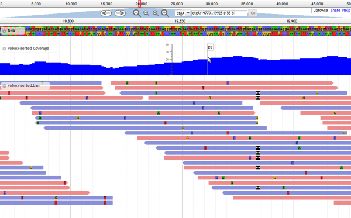

# JBrowse

From GMOD

(Redirected from
[JBrowseDev/Main](http://gmod.org/mediawiki/index.php?title=JBrowseDev/Main&redirect=no "JBrowseDev/Main"))

Jump to: [navigation](#mw-navigation), [search](#p-search)

Status

- Mature release
- Development: active
- Support: active

Licence

<a href="http://opensource.org/licenses/LGPL-3.0" class="external text"
rel="nofollow">LGPL</a>,
<a href="http://opensource.org/licenses/Artistic-2.0"
class="external text" rel="nofollow">Artistic License 2.0</a>

Resources

- <a href="http://jbrowse.org" class="external text" rel="nofollow">Home
  page</a>

<!-- -->

- <a href="http://jbrowse.org/install/" class="external text"
  rel="nofollow">Download</a>

<!-- -->

- <a href="http://github.com/GMOD/jbrowse" class="external text"
  rel="nofollow">Source code</a>

<!-- -->

- <a href="http://jbrowse.org/demos" class="external text"
  rel="nofollow">Demo server</a>

  

## Contents

- [1 About
  JBrowse](#About_JBrowse)
  - [1.1
    Features](#Features)
  - [1.2
    Screenshots](#Screenshots)
- [2
  Downloads](#Downloads)
- [3 Using
  JBrowse](#Using_JBrowse)
  - [3.1 System
    Requirements](#System_Requirements)
  - [3.2
    Installation](#Installation)
  - [3.3
    Configuration](#Configuration)
- [4 Upgrading
  JBrowse](#Upgrading_JBrowse)
- [5
  Documentation](#Documentation)
- [6 Publications,
  Tutorials, and
  Presentations](#Publications.2C_Tutorials.2C_and_Presentations)
  - [6.1
    Publications on or mentioning
    JBrowse](#Publications_on_or_mentioning_JBrowse)
  - [6.2
    Tutorials](#Tutorials)
  - [6.3
    Presentations](#Presentations)
- [7 Contacts and
  Mailing Lists](#Contacts_and_Mailing_Lists)
- [8 JBrowse in the
  wild](#JBrowse_in_the_wild)
- [9 JBrowse
  Development](#JBrowse_Development)
  - [9.1 Current
    status](#Current_status)
- [10 More on
  JBrowse](#More_on_JBrowse)

## About JBrowse

JBrowse is a genome browser with a fully dynamic AJAX interface, being
developed as the eventual successor to GBrowse. It is very fast and
scales well to large datasets. JBrowse is javascript-based and does
almost all of its work directly in the user's web browser, with minimal
requirements for the server.

### Features

- Fast, smooth scrolling and zooming. Explore your genome with
  unparalleled speed.
- Scales easily to multi-gigabase genomes and deep-coverage sequencing.
- Supports GFF3, BED, FASTA, Wiggle, BigWig, BAM, VCF (with tabix),
  REST, and more. BAM, BigWig, and VCF data are displayed directly from
  the compressed binary file with no conversion needed.
- Very light server resource requirements. In fact, JBrowse has no
  back-end server code, just tools for formatting data files to be read
  directly over HTTP. Serve huge datasets from a single low-cost cloud
  instance.

  
Visit the <a href="http://jbrowse.org" class="external text"
rel="nofollow">JBrowse website</a>.

### Screenshots

## Downloads

- <a href="http://jbrowse.org/install/" class="external text"
  rel="nofollow">Download JBrowse</a>.

<!-- -->

- <a href="http://github.com/GMOD/jbrowse" class="external text"
  rel="nofollow">Download the source code for JBrowse</a>.

## Using JBrowse

The <a href="http://jbrowse.org/code/latest-release/docs/tutorial/"
class="external text" rel="nofollow">JBrowse Quick-Start Tutorial</a>
provides a basic step-by-step recipe for quickly getting up and running
with JBrowse.

### System Requirements

JBrowse requires libpng, Zlib, and GD development libraries, plus make
and a C compiler. On Ubuntu, you can install these prerequisites using
the command:

     sudo apt-get install libpng-dev libgd2-noxpm-dev build-essential

For tips on installing these baseline libraries, see [JBrowse
Troubleshooting](../JBrowse_Troubleshooting "JBrowse Troubleshooting").

### Installation

The <a href="http://jbrowse.org/code/latest-release/docs/tutorial/"
class="external text" rel="nofollow">JBrowse Quick-Start Tutorial</a>
provides a basic step-by-step recipe for quickly getting up and running
with JBrowse.

  
1. <a href="http://jbrowse.org/install/" class="external text"
rel="nofollow">Download JBrowse</a> onto your web server.

2\. Unpack JBrowse into a directory that is served by your web browser.
On many systems, this defaults to `/var/www`.

       cd /var/www
       unzip JBrowse-*.zip

**Make sure you have permissions to write to the contents of the
`jbrowse/` directory you have just created.**

3\. Run the automated-setup script, `./setup.sh`, which will attempt to
install all of JBrowse's (modest) prerequisites for you in the
`jbrowse/` directory itself. Note that `setup.sh` does not need to be
run as root or with `sudo`. For help troubleshooting failures of
setup.sh, see [JBrowse
Troubleshooting](../JBrowse_Troubleshooting "JBrowse Troubleshooting").

4\. Visit JBrowse on your machine, substituting the
http://(your_machine/path_to_jbrowse)/index.html?data=sample_data/json/volvox.
If you can see the included Volvox example data, you are ready to
configure JBrowse to show your own data!

### Configuration

See the [JBrowse Configuration
Guide](../JBrowse_Configuration_Guide "JBrowse Configuration Guide") for
information on:

- [Formatting reference
  sequences](../JBrowse_Configuration_Guide#Reference_Sequences "JBrowse Configuration Guide")
  (e.g. from FASTA files, or a Chado database)
- [Feature
  Tracks](../JBrowse_Configuration_Guide#Feature_Tracks "JBrowse Configuration Guide")
  (e.g. from BED or GFF files, a Chado database, or the UCSC genome
  browser)
- [Image
  Tracks](../JBrowse_Configuration_Guide#Image_Tracks "JBrowse Configuration Guide")
  (e.g. from WIG files)
- [Wiggle/BigWig
  Tracks](../JBrowse_Configuration_Guide#Wiggle_Tracks "JBrowse Configuration Guide")
- [Name Search and
  Autocompletion](../JBrowse_Configuration_Guide#Name_Searching_and_Autocompletion "JBrowse Configuration Guide")
- [Removing
  tracks](../JBrowse_Configuration_Guide#Removing_Tracks "JBrowse Configuration Guide")
- [Compressing data stored on the
  server](../JBrowse_Configuration_Guide#Compressing_data_on_the_server "JBrowse Configuration Guide")
- [URL
  control](../JBrowse_Configuration_Guide#URL_Control "JBrowse Configuration Guide")
- [Faceted track
  selection](../JBrowse_Configuration_Guide#Faceted_Track_Selection "JBrowse Configuration Guide")
- [Anonymous usage
  statistics](../JBrowse_Configuration_Guide#Anonymous_Usage_Statistics "JBrowse Configuration Guide")

Additional topics:

- <a href="Using_a_Database_With_JBrowse" class="mw-redirect"
  title="JBrowseDev/Using a Database With JBrowse">Using an Existing
  Database with JBrowse</a>

## Upgrading JBrowse

To upgrade an existing JBrowse (1.3.0 or later) to the latest version,
simply move its data directory (and `jbrowse_conf.json` if you are using
it) into the directory of a newer JBrowse, and the new JBrowse will
display that data.

To upgrade a 1.2.x JBrowse, copy its data directory into the new JBrowse
directory, and point your browser at compat_121.html in the new JBrowse
directory, instead of index.html.

If you are upgrading from a version of JBrowse older than 1.2.0, a fresh
installation is required.

## Documentation

- <a href="../JBrowse_Configuration_Guide" class="external text"
  rel="nofollow">JBrowse configuration reference</a>
- <a href="http://jbrowse.org/code/latest-release/docs/tutorial"
  class="external text" rel="nofollow">JBrowse quick start</a>
- <a href="../JBrowse_FAQ" class="external text" rel="nofollow">JBrowse
  setup FAQ</a>

## Publications, Tutorials, and Presentations

### Publications on or mentioning JBrowse

- JBrowse: a next-generation genome browser
  (2009)[\[1\]](#cite_note-PMID:19570905-1)
- Setting up the JBrowse genome browser
  (2010)[\[2\]](#cite_note-PMID:21154710-2)
- Visualizing next-generation sequencing data with JBrowse
  (2013)[\[3\]](#cite_note-PMID:22411711-3)
- JBrowse: a dynamic web platform for genome visualization and analysis
  (2016)[\[4\]](#cite_note-PMID:_27072794-4)

### Tutorials

<a href="../JBrowse_Tutorial" class="mw-redirect"
title="JBrowse Tutorial">JBrowse Tutorial</a> covering installation and configuration  
part of the [2013 GMOD Summer
School](../2013_GMOD_Summer_School "2013 GMOD Summer School")

<a href="http://jbrowse.org/code/latest-release/docs/tutorial/"
class="external text" rel="nofollow">Getting Started with JBrowse
Tutorial</a>  
part of the JBrowse documentation

<a
href="../../mediawiki/images/4/44/Exploring_structural_variation_in_the_tomato_clade_using_JBrowse.pdf"
class="internal"
title="Exploring structural variation in the tomato clade using JBrowse.pdf">Exploration
of structural variation in the tomato clade using JBrowse</a>  
Tutorial explaining how to browse structural variants from the
<a href="http://www.tomatogenome.net" class="external text"
rel="nofollow">150+ tomato genome resequencing project</a> using JBrowse

### Presentations

- April 2013 - Bio-IT World, Robert Buels:
  <a href="../../mediawiki/images/0/0c/JBrowse_bioit_world_apr2013.pdf"
  class="internal" title="JBrowse bioit world apr2013.pdf">PDF</a>
- August 2012 - presentation given as part of the [2012 GMOD Summer
  School](../2012_GMOD_Summer_School "2012 GMOD Summer School"):
  <a href="../../mediawiki/images/f/fa/JBrowse_gmod_aug2012.pdf"
  class="internal" title="JBrowse gmod aug2012.pdf">PDF</a>
- April 2012 - GMOD 2012 Community Meeting, Robert Buels:
  <a href="../../mediawiki/images/b/ba/RBuels_JBrowse_apr2012.pdf"
  class="internal" title="RBuels JBrowse apr2012.pdf">PDF</a>
- January 2012 - Plant and Animal Genome (PAG) XX:
  <a href="../../mediawiki/images/e/ed/Rbuels_jbrowse_pag2012.pdf"
  class="internal" title="Rbuels jbrowse pag2012.pdf">PDF</a>
- April 2010 - UCSC genome browser group ("genecats") meeting:
  <a href="../../mediawiki/images/6/67/JBrowse-UCSC-4-21-10.pdf"
  class="internal" title="JBrowse-UCSC-4-21-10.pdf">PDF</a>
- August 2009 - [GMOD Community
  Meeting](../August_2009_GMOD_Meeting "August 2009 GMOD Meeting"):
  [Talk
  summary](../August_2009_GMOD_Meeting#JBrowse "August 2009 GMOD Meeting")

## Contacts and Mailing Lists

Please direct questions and inquiries regarding JBrowse to the mailing
lists below.*Requests for help should be directed to
<a href="mailto:gmod-ajax@lists.sourceforge.net" class="external text"
rel="nofollow">gmod-ajax@lists.sourceforge.net</a>.*

|  |  |  |  |
|----|----|----|----|
|  | Mailing List Link | Description | Archive(s) |
| **JBrowse** | <a href="https://lists.sourceforge.net/lists/listinfo/gmod-ajax"
class="external text" rel="nofollow">gmod-ajax</a> | **JBrowse** help and general questions. | <a href="http://gmod.827538.n3.nabble.com/JBrowse-Support-f815920.html"
class="external text" rel="nofollow">Nabble</a> (2010/05+), <a href="https://lists.sourceforge.net/lists/listinfo/gmod-ajax"
class="external text" rel="nofollow">Sourceforge</a> |
|  | <a
href="https://calmail.berkeley.edu/manage/list/listinfo/jbrowse-dev@lists.berkeley.edu"
class="external text" rel="nofollow">jbrowse-dev</a> | **JBrowse** development discussions. | <a
href="http://gmod.827538.n3.nabble.com/JBrowse-Development-f3296666.html"
class="external text" rel="nofollow">Nabble</a> (2011/08+) |

gmod-ajax@lists.sourceforge.net

## JBrowse in the wild

Public installations of JBrowse:

- <a href="http://genomesunzipped.org/jbrowse" class="external text"
  rel="nofollow">Genomes Unzipped: Public Personal Genomics</a>
- <a href="http://beetlebase.org" class="external text"
  rel="nofollow">BeetleBase</a>
- <a href="http://www.medicinalgenomics.com/the-jane-ome/"
  class="external text" rel="nofollow">The Jane-Ome, medicinal marijuana
  project</a>
- <a href="http://icemangenome.net/‎" class="external text"
  rel="nofollow">Ice Man Genome</a>
  Browse the genome of Ötzi the ice man

## JBrowse Development

### Current status

The <a href="http://github.com/GMOD/jbrowse" class="external text"
rel="nofollow">JBrowse source code repository</a> is kept on GitHub.
Please feel very free to fork the code on GitHub and make modifications
and improvements, submitting pull requests. GitHub has a very nice
<a href="http://help.github.com/fork-a-repo/" class="external text"
rel="nofollow">tutorial</a> on how to get started with this style of
development.

## More on JBrowse

See [Category:JBrowse](../Category:JBrowse "Category:JBrowse")

  

1.  [↑](#cite_ref-PMID:19570905_1-0)
    \*JBrowse: a next-generation genome
    browser 
2.  [↑](#cite_ref-PMID:21154710_2-0)
    \*Setting up the JBrowse genome browser
    
3.  [↑](#cite_ref-PMID:22411711_3-0)
    \* Visualizing next-generation
    sequencing data with JBrowse
4.  [↑](#cite_ref-PMID:_27072794_4-0)
    \* JBrowse: a dynamic web platform for
    genome visualization and analysis

Retrieved from
"<http://gmod.org/mediawiki/index.php?title=JBrowse&oldid=27090>"

[Categories](../Special:Categories "Special:Categories"):

- [GMOD Component](../Category:GMOD_Component "Category:GMOD Component")
- <a
  href="http://gmod.org/mediawiki/index.php?title=Category:SemanticLink&amp;action=edit&amp;redlink=1"
  class="new"
  title="Category:SemanticLink (page does not exist)">SemanticLink</a>
- [GMOD
  Components](../Category:GMOD_Components "Category:GMOD Components")
- [AJAX](../Category:AJAX "Category:AJAX")
- [JBrowse](../Category:JBrowse "Category:JBrowse")

Facts about
"[JBrowse](../Special:Browse/JBrowse "Special:Browse/JBrowse")"[RDF
feed](http://gmod.org/wiki/Special:ExportRDF/JBrowse "Special:ExportRDF/JBrowse")

[Available on platform](../Property:Available_on_platform "Property:Available on platform")

web
[+](../Special:SearchByProperty/Available-20on-20platform/web "Special:SearchByProperty/Available-20on-20platform/web")

[Has URL](../Property:Has_URL "Property:Has URL")

<a href="http://jbrowse.org/install/" class="external free"
rel="nofollow">http://jbrowse.org/install/</a>
[+](../Special:SearchByProperty/Has-20URL/http:-2F-2Fjbrowse.org-2Finstall-2F "Special:SearchByProperty/Has-20URL/http:-2F-2Fjbrowse.org-2Finstall-2F"),
<a href="http://jbrowse.org" class="external free"
rel="nofollow">http://jbrowse.org</a>
[+](../Special:SearchByProperty/Has-20URL/http:-2F-2Fjbrowse.org "Special:SearchByProperty/Has-20URL/http:-2F-2Fjbrowse.org"),
<a href="http://twitter.com/usejbrowse" class="external free"
rel="nofollow">http://twitter.com/usejbrowse</a>
[+](../Special:SearchByProperty/Has-20URL/http:-2F-2Ftwitter.com-2Fusejbrowse "Special:SearchByProperty/Has-20URL/http:-2F-2Ftwitter.com-2Fusejbrowse"),
<a href="http://github.com/GMOD/jbrowse" class="external free"
rel="nofollow">http://github.com/GMOD/jbrowse</a>
[+](../Special:SearchByProperty/Has-20URL/http:-2F-2Fgithub.com-2FGMOD-2Fjbrowse "Special:SearchByProperty/Has-20URL/http:-2F-2Fgithub.com-2FGMOD-2Fjbrowse"),
<a href="http://jbrowse.org/demos" class="external free"
rel="nofollow">http://jbrowse.org/demos</a>
[+](../Special:SearchByProperty/Has-20URL/http:-2F-2Fjbrowse.org-2Fdemos "Special:SearchByProperty/Has-20URL/http:-2F-2Fjbrowse.org-2Fdemos"),
<a href="http://icemangenome.net/%E2%80%8E" class="external free"
rel="nofollow">http://icemangenome.net/%E2%80%8E</a>
[+](../Special:SearchByProperty/Has-20URL/http:-2F-2Ficemangenome.net-2F-25E2-2580-258E "Special:SearchByProperty/Has-20URL/http:-2F-2Ficemangenome.net-2F-25E2-2580-258E"),
<a href="http://genomesunzipped.org/jbrowse" class="external free"
rel="nofollow">http://genomesunzipped.org/jbrowse</a>
[+](../Special:SearchByProperty/Has-20URL/http:-2F-2Fgenomesunzipped.org-2Fjbrowse "Special:SearchByProperty/Has-20URL/http:-2F-2Fgenomesunzipped.org-2Fjbrowse"),
<a href="http://beetlebase.org" class="external free"
rel="nofollow">http://beetlebase.org</a>
[+](../Special:SearchByProperty/Has-20URL/http:-2F-2Fbeetlebase.org "Special:SearchByProperty/Has-20URL/http:-2F-2Fbeetlebase.org")
and <a href="http://www.medicinalgenomics.com/the-jane-ome/"
class="external free"
rel="nofollow">http://www.medicinalgenomics.com/the-jane-ome/</a>
[+](../Special:SearchByProperty/Has-20URL/http:-2F-2Fwww.medicinalgenomics.com-2Fthe-2Djane-2Dome-2F "Special:SearchByProperty/Has-20URL/http:-2F-2Fwww.medicinalgenomics.com-2Fthe-2Djane-2Dome-2F")

[Has description](../Property:Has_description "Property:Has description")

JBrowse is a genome browser with a fully d …
JBrowse is a genome browser with a
fully dynamic AJAX interface, being developed as the eventual successor
to GBrowse. It is very fast and scales well to large datasets. JBrowse
is javascript-based and does almost all of its work directly in the
user's web browser, with minimal requirements for the server.

### Features\[[edit](http://gmod.org/mediawiki/index.php?title=JBrowse&action=edit&section=1 "Edit section: Features")\]

- Fast, smooth scrolling and zooming. Explore your genome with
  unparalleled speed.
- Scales easily to multi-gigabase genomes and deep-coverage sequencing.
- Supports GFF3, BED, FASTA, Wiggle, BigWig, BAM, VCF (with tabix),
  REST, and more. BAM, BigWig, and VCF data are displayed directly from
  the compressed binary file with no conversion needed.
- Very light server resource requirements. In fact, JBrowse has no
  back-end server code, just tools for formatting data files to be read
  directly over HTTP. Serve huge datasets from a single low-cost cloud
  instance.ets from a single low-cost cloud instance.
  <a
  href="http://gmod.org/mediawiki/index.php?title=Special:SearchByProperty&amp;x=Has-20description%2FJBrowse-20is-20a-20genome-20browser-20with-20a-20fully-20dynamic-20AJAX-20interface%2C-20being-20developed-20as-20the-20eventual-20successor-20to-20GBrowse.-20It-20is-20very-20fast-20and-20scales-20well-20to-20large-20datasets.-20JBrowse-20is-20javascript-2Dbased-20and-20does-20almost-20all-20of-20its-20work-20directly-20in-20the-20user%27s-20web-20browser%2C-20with-20minimal-20requirements-20for-20the-20server.-0A-0A%3D%3D%3DFeatures%3D%3D%3D-0A-0A%2AFast%2C-20smooth-20scrolling-20and-20zooming.-20Explore-20your-20genome-20with-20unparalleled-20speed.-0A%2AScales-20easily-20to-20multi-2Dgigabase-20genomes-20and-20deep-2Dcoverage-20sequencing.-0A%2ASupports-20GFF3%2C-20BED%2C-20FASTA%2C-20Wiggle%2C-20BigWig%2C-20BAM%2C-20VCF-20%28with-20tabix%29%2C-20REST%2C-20and-20more.-20-20BAM%2C-20BigWig%2C-20and-20VCF-20data-20are-20displayed-20directly-20from-20the-20compressed-20binary-20file-20with-20no-20conversion-20needed.-0A%2AVery-20light-20server-20resource-20requirements.-20In-20fact%2C-20JBrowse-20has-20no-20back-2Dend-20server-20code%2C-20just-20tools-20for-20formatting-20data-20files-20to-20be-20read-20directly-20over-20HTTP.-20Serve-20huge-20datasets-20from-20a-20single-20low-2Dcost-20cloud-20instance."
  class="external text" rel="nofollow">+</a> and Browse the
  genome of Ötzi the ice man
  [+](../Special:SearchByProperty/Has-20description/Browse-20the-20genome-20of-20%C3%96tzi-20the-20ice-20man "Special:SearchByProperty/Has-20description/Browse-20the-20genome-20of-20Ötzi-20the-20ice-20man")

## Navigation menu

### Namespaces

- <a href="../JBrowse.1" accesskey="c"
  title="View the content page [c]">Page</a>
- <a
  href="http://gmod.org/mediawiki/index.php?title=Talk:JBrowse&amp;action=edit&amp;redlink=1"
  accesskey="t"
  title="Discussion about the content page [t]">Discussion</a>

### 

### Variants

### Navigation

- [GMOD Home](../Main_Page)
- [Software](../GMOD_Components)
- [Categories /
  Tags](../Categories)
- [View all
  pages](../Special:AllPages)

### Documentation

- [Overview](../Overview)
- [FAQs](../Category:FAQ)
- [HOWTOs](../Category:HOWTO)
- [Glossary](../Glossary)

### Community

- [GMOD News](../GMOD_News)
- [Training /
  Outreach](../Training_and_Outreach)
- [Support](../Support)
- [GMOD Promotion](../GMOD_Promotion)
- [Meetings](../Meetings)
- [Calendar](../Calendar)

### Tools

- <a href="../Special:Browse/JBrowse" rel="smw-browse">Browse
  properties</a>
- [Print as
  PDF](http://gmod.org/mediawiki/index.php?title=Special:PdfPrint&page=JBrowse)

- Last updated at 19:18 on 15 April
  2016.
<!-- - 734,540 page views. -->
- Content is available under
  <a href="http://www.gnu.org/licenses/fdl-1.3.html" class="external"
  rel="nofollow">a GNU Free Documentation License</a> unless otherwise
  noted.

<!-- -->

- [About
  GMOD](../GMOD:About "GMOD:About")

<!-- -->

- 
- 
  

