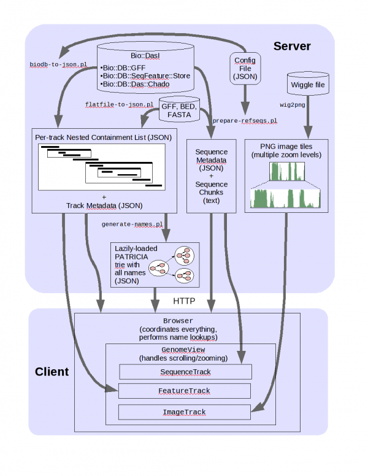

<div id="mw-page-base" class="noprint">

</div>

<div id="mw-head-base" class="noprint">

</div>

<div id="content" class="mw-body" role="main">

<span id="top"></span>

<div id="mw-js-message" style="display:none;">

</div>


# <span dir="auto">JBrowse Tutorial 2011</span>

<div id="bodyContent">

<div id="siteSub">

From GMOD

</div>

<div id="contentSub">

</div>

<div id="jump-to-nav" class="mw-jump">

Jump to: [navigation](#mw-navigation), [search](#p-search)

</div>

<div id="mw-content-text" class="mw-content-ltr" lang="en" dir="ltr">

<div id="toc" class="toc">

<div id="toctitle">

## Contents

</div>

- [<span class="tocnumber">1</span>
  <span class="toctext">Prerequisites</span>](#Prerequisites)
- [<span class="tocnumber">2</span> <span class="toctext">JBrowse
  Introduction</span>](#JBrowse_Introduction)
- [<span class="tocnumber">3</span> <span class="toctext">JBrowse
  arch</span>](#JBrowse_arch)
- [<span class="tocnumber">4</span> <span class="toctext">Setting up
  JBrowse</span>](#Setting_up_JBrowse)
  - [<span class="tocnumber">4.1</span> <span class="toctext">Getting
    JBrowse</span>](#Getting_JBrowse)
  - [<span class="tocnumber">4.2</span> <span class="toctext">Starting
    Point</span>](#Starting_Point)
  - [<span class="tocnumber">4.3</span> <span class="toctext">Basic
    Steps</span>](#Basic_Steps)
  - [<span class="tocnumber">4.4</span> <span class="toctext">Data from
    a database</span>](#Data_from_a_database)
    - [<span class="tocnumber">4.4.1</span>
      <span class="toctext">Specify reference
      sequences</span>](#Specify_reference_sequences)
    - [<span class="tocnumber">4.4.2</span> <span class="toctext">Load
      Feature Data</span>](#Load_Feature_Data)
    - [<span class="tocnumber">4.4.3</span> <span class="toctext">More
      complex track</span>](#More_complex_track)
    - [<span class="tocnumber">4.4.4</span>
      <span class="toctext">Collect feature
      names</span>](#Collect_feature_names)
  - [<span class="tocnumber">4.5</span> <span class="toctext">Data from
    flat files</span>](#Data_from_flat_files)
    - [<span class="tocnumber">4.5.1</span>
      <span class="toctext">Sequences</span>](#Sequences)
    - [<span class="tocnumber">4.5.2</span>
      <span class="toctext">Features</span>](#Features)
    - [<span class="tocnumber">4.5.3</span> <span class="toctext">BAM
      data</span>](#BAM_data)
  - [<span class="tocnumber">4.6</span>
    <span class="toctext">Quantitative data</span>](#Quantitative_data)
- [<span class="tocnumber">5</span> <span class="toctext">Common
  Problems</span>](#Common_Problems)
- [<span class="tocnumber">6</span> <span class="toctext">Other
  links</span>](#Other_links)

</div>

## <span id="Prerequisites" class="mw-headline">Prerequisites</span>

These have **already been set up** on the VM image.

Perl:

- [BioPerl 1.6](BioPerl "BioPerl")
- <a href="http://search.cpan.org/perldoc?JSON" class="external text"
  rel="nofollow">JSON</a>
- <a href="http://search.cpan.org/perldoc?JSON::XS" class="external text"
  rel="nofollow">JSON::XS</a> (optional, for speed)
- <a href="http://search.cpan.org/perldoc?PerlIO::gzip"
  class="external text" rel="nofollow">PerlIO::gzip</a>
- <a href="http://search.cpan.org/perldoc?Heap::Simple"
  class="external text" rel="nofollow">Heap::Simple</a>
- <a href="http://search.cpan.org/perldoc?Heap::Simple::XS"
  class="external text" rel="nofollow">Heap::Simple::XS</a>
- <a href="http://search.cpan.org/perldoc?Devel::Size"
  class="external text" rel="nofollow">Devel::Size</a>

  
System packages:

- libpng12-0
- libpng12-dev

Optional, for BAM files:

- samtools, and its dependency libncurses5-dev
- perl module: <a href="http://search.cpan.org/perldoc?Bio::DB::SAM"
  class="external text" rel="nofollow">Bio::DB::SAM</a>

<div class="dont">

And this is how they were installed: **(don't do this)**

``` dont
$ sudo apt-get install git-core libpng12-0 libpng12-dev libncurses5-dev
$ cd ~/Documents/Software
$ wget http://sourceforge.net/projects/samtools/files/samtools/0.1.7/samtools-0.1.7a.tar.bz2
$ tar xjf samtools-0.1.7a.tar.bz2
$ cd samtools-0.1.7a/
$ make
$ sudo cpan
cpan[1]> install Bio::DB::Das::Chado Bio::DB::Sam JSON JSON::XS PerlIO::gzip Heap::Simple Heap::Simple::XS Devel::Size
```

</div>

Also: make sure you can Copy/paste from wiki.

Shell tricks:

- Tab completion
- History
- History search

  
  
  

## <span id="JBrowse_Introduction" class="mw-headline">JBrowse Introduction</span>

How and why [JBrowse](JBrowse.1 "JBrowse") is different from most other
web-based genome browsers, including [GBrowse](GBrowse.1 "GBrowse").

More detail: <a href="http://genome.cshlp.org/content/19/9/1630.full"
class="external text" rel="nofollow">paper</a>  
  

<a
href="http://gmod.org/mediawiki/index.php?title=Special:Upload&amp;wpDestFile=JBrowse_GMOD_Meeting_2011.pdf"
class="new"
title="JBrowse GMOD Meeting 2011.pdf">Media:JBrowse_GMOD_Meeting_2011.pdf</a>

## <span id="JBrowse_arch" class="mw-headline">JBrowse arch</span>

<a href="File:Jbrowse_arch.png" class="image"></a>

## <span id="Setting_up_JBrowse" class="mw-headline">Setting up JBrowse</span>

### <span id="Getting_JBrowse" class="mw-headline">Getting JBrowse</span>

<div class="dont">

- Install git **(This has already been done in the VMware image.)**

``` dont
$ sudo apt-get install git-core
```

</div>

- prepare a directory for JBrowse

<!-- -->

    $ cd /var/www
    $ sudo mkdir jbrowse
    $ sudo chown gmod.gmod jbrowse

- download it from github

<!-- -->

    $ git clone git://github.com/jbrowse/jbrowse.git jbrowse

(or alternately)

    $ git clone https://github.com/jbrowse/jbrowse.git jbrowse

### <span id="Starting_Point" class="mw-headline">Starting Point</span>

Visit in web browser:
<a href="http://localhost/jbrowse/" class="external free"
rel="nofollow">http://localhost/jbrowse/</a>

  
You should see just a blank white page.

### <span id="Basic_Steps" class="mw-headline">Basic Steps</span>

Setting up a JBrowse instance with feature data goes in three basic
steps:

1.  Specify reference sequences
2.  Load feature data
3.  Collect feature names

  

### <span id="Data_from_a_database" class="mw-headline">Data from a database</span>

Here, we'll use the
<a href="Chado" class="mw-redirect" title="Chado">Chado</a> adapter;
other common database adapters are
<a href="http://search.cpan.org/perldoc?Bio::DB::SeqFeature::Store"
class="external text" rel="nofollow">Bio::DB::SeqFeature::Store</a> and
<a href="http://search.cpan.org/perldoc?Bio::DB::GFF"
class="external text" rel="nofollow">Bio::DB::GFF</a>.

Starting config file: `~/Documents/Data/jbrowse/first-config.json`

    {
      "description": "Pythium",
      "db_adaptor": "Bio::DB::Das::Chado",
      "db_args": { "-dsn": "dbi:Pg:dbname=chado",
                   "-user": "gmod",
                   "-pass": ""},

    ...

#### <span id="Specify_reference_sequences" class="mw-headline">Specify reference sequences</span>

The first script to run is `bin/prepare-refseqs.pl`; that script is the
way you tell JBrowse about what your reference sequences are. Running
`bin/prepare-refseqs.pl` also sets up the "DNA" track.

Run this from within the `/var/www/jbrowse` directory (you could run it
elsewhere, but you'd have to explicitly specify the location of the data
directory on the command line).

    $ cd /var/www/jbrowse
    $ bin/prepare-refseqs.pl --conf ~/Documents/Data/jbrowse/first-config.json \
        --refs scf1117875582023

Visit in web browser: you should new see the JBrowse UI (and if you zoom
all the way in, some sequence)

#### <span id="Load_Feature_Data" class="mw-headline">Load Feature Data</span>

Next, we'll use `biodb-to-json.pl` to get feature data out of the
database and turn it into <a
href="http://gmod.org/mediawiki/index.php?title=GMOD:Glossary&amp;action=edit&amp;redlink=1"
class="new" title="GMOD:Glossary (page does not exist)">JSON</a> data
that the web browser can use.

Add a basic track definition; this will tell `biodb-to-json.pl` what
features to put into the track, and how the track should look:

\<javascript\>...

     "TRACK DEFAULTS": {
       "class": "feature"
     },

     "tracks": [
       {
         "track": "gene",
         "key": "Gene",
         "feature": ["gene"],
         "autocomplete": "all",
         "class": "feature2",
         "urlTemplate": "http://www.google.com/search?q={name}"
       }
     ]

}\</javascript\>

`track` specifies the track identifier (a unique name for the track, for
the software to use). This should be just letters and numbers and - and
\_ characters; using other characters makes things less convenient.

`key` specifies a human-friendly name for the track, which can use any
characters you want.

`feature` gives a list of feature types to include in the track.

`autocomplete` including this setting makes the features in the track
searchable.

`urltemplate` specifies a URL pattern that you can use to link genomic
features to specific web pages.

`class` specifies the <a
href="http://gmod.org/mediawiki/index.php?title=GMOD:Glossary&amp;action=edit&amp;redlink=1"
class="new" title="GMOD:Glossary (page does not exist)">CSS</a> class
that describes how the feature should look. The classes are specified in
the `genome.css` file:

    $ less genome.css

For this particular track, I've specified the `"feature2"` class which
looks like this in the CSS file:

\<javascript\>.plus-feature2, .minus-feature2 {

       position:absolute;
       height: 15px;
       background-repeat: repeat-x;
       cursor: pointer;
       min-width: 1px;
       z-index: 10;

}

.plus-feature2 { background-image: url('img/plus-herringbone16.png'); }

.minus-feature2 { background-image: url('img/minus-herringbone16.png');
}\</javascript\>

Run the `bin/biodb-to-json.pl` script with this config file to set up
this track:

    $ bin/biodb-to-json.pl --conf ~/Documents/Data/jbrowse/first-config.json

(visit in web browser: you should see a new gene track)

#### <span id="More_complex_track" class="mw-headline">More complex track</span>

Now we'll add a second track; this one will have subfeatures. This
snippet is from: `~/Documents/Data/jbrowse/second-config.json`

\<javascript\>...

       {
         "track": "match",
         "key": "Matches",
         "feature": ["match"],
         "autocomplete": "all",
         "subfeatures": true,
         "class": "generic_parent",
         "subfeature_classes": {
             "match_part": "match_part"
         },
         "clientConfig": {
             "subfeatureScale": 20
         }
       }

...\</javascript\>

    $ bin/biodb-to-json.pl --conf ~/Documents/Data/jbrowse/second-config.json

(visit in web browser: you should see a new track, which has subfeatures
if you're zoomed in far enough)

#### <span id="Collect_feature_names" class="mw-headline">Collect feature names</span>

When you generate JSON for a track, if you specify `"autocomplete"` then
a listing of all of the names/IDs from that track (along with the
locations of the corresponding features) will also be generated.

The `bin/generate-names.pl` script collects those lists of names from
all the tracks and combines them into one big tree that the client uses
to search.

    $ bin/generate-names.pl -v

Visit in web browser, search for feature name: e.g.,

**maker-scf1117875582023-snap-gene-0.3**

### <span id="Data_from_flat_files" class="mw-headline">Data from flat files</span>

We're going to recreate a JBrowse instance from a different data source:
flat files.

First, wipe the slate clean by removing the `data` directory:

    $ rm -r data

If you visit your JBrowse instance in a web browser, you'll see a blank
screen again

#### <span id="Sequences" class="mw-headline">Sequences</span>

To import sequence data from a fasta file into a JBrowse instance, use
`prepare-refseqs.pl` with the `--fasta` argument:

    $ bin/prepare-refseqs.pl --fasta ~/Documents/Data/jbrowse/scf1117875582023.fasta

Visit in web browser; you should see a second reference sequence.

#### <span id="Features" class="mw-headline">Features</span>

To get feature data from flat files into JBrowse, use
`flatfile-to-json.pl`. We'll use some more of the data from the
[MAKER](MAKER.1 "MAKER") session:

    $ bin/flatfile-to-json.pl \
        --gff /home/gmod/Documents/Data/maker/example2_pyu/finished.maker.output/gff/scf1117875582023.gff \
        --type match --getSubs --tracklabel "gff_match" --key "GFF match" \
        --cssclass generic_parent --subfeatureClasses '{"match_part": "generic_part_a"}'

Visit in web browser; you should see a new "GFF match" track.

#### <span id="BAM_data" class="mw-headline">BAM data</span>

To incorporate data from a BAM source:

    $  bin/bam-to-json.pl \
        --bam ~/Documents/Data/jbrowse/simulated-sorted.bam \
        --tracklabel BAM_data --key "BAM Data"

### <span id="Quantitative_data" class="mw-headline">Quantitative data</span>

JBrowse can also display quantitative data in the wiggle format. JBrowse
processes wiggle files with a C++ program, which you have to compile:

    $ make

Now you can process the wiggle file:

    $ bin/wig-to-json.pl --wig ~/Documents/Data/jbrowse/pyu.wig \
        --tracklabel "coverage_wig" --key "Wiggle Coverage" --min 0 --max 50

Visit in web browser

  
  

## <span id="Common_Problems" class="mw-headline">Common Problems</span>

- JSON syntax errors

  
  
  

## <span id="Other_links" class="mw-headline">Other links</span>

- Config file ref:
  <a href="http://jbrowse.org/code/jbrowse-master/docs/config.html"
  class="external free"
  rel="nofollow">http://jbrowse.org/code/jbrowse-master/docs/config.html</a>
- DIV test: <a href="http://jbrowse.org/test/boatdiv/boat.html"
  class="external free"
  rel="nofollow">http://jbrowse.org/test/boatdiv/boat.html</a>

</div>

<div class="printfooter">

Retrieved from
"<http://gmod.org/mediawiki/index.php?title=JBrowse_Tutorial_2011&oldid=23076>"

</div>

<div id="catlinks" class="catlinks">

<div id="mw-normal-catlinks" class="mw-normal-catlinks">

[Categories](Special:Categories "Special:Categories"):

- [2011 Spring
  Training](Category:2011_Spring_Training "Category:2011 Spring Training")
- [Tutorials](Category:Tutorials "Category:Tutorials")
- [JBrowse](Category:JBrowse "Category:JBrowse")

</div>

</div>

<div class="visualClear">

</div>

</div>

</div>

<div id="mw-navigation">

## Navigation menu

<div id="mw-head">


<div id="left-navigation">

<div id="p-namespaces" class="vectorTabs" role="navigation"
aria-labelledby="p-namespaces-label">

### Namespaces


- <span id="ca-talk"><a
  href="http://gmod.org/mediawiki/index.php?title=Talk:JBrowse_Tutorial_2011&amp;action=edit&amp;redlink=1"
  accesskey="t"
  title="Discussion about the content page [t]">Discussion</a></span>

</div>

<div id="p-variants" class="vectorMenu emptyPortlet" role="navigation"
aria-labelledby="p-variants-label">

### 

### Variants[](#)

<div class="menu">

</div>

</div>

</div>


</div>

</div>

</div>

<div id="mw-panel">

<div id="p-logo" role="banner">

<a href="Main_Page"
style="background-image: url(../images/GMOD-cogs.png);"
title="Visit the main page"></a>

</div>

<div id="p-Navigation" class="portal" role="navigation"
aria-labelledby="p-Navigation-label">

### Navigation

<div class="body">

- <span id="n-GMOD-Home">[GMOD Home](Main_Page)</span>
- <span id="n-Software">[Software](GMOD_Components)</span>
- <span id="n-Categories-.2F-Tags">[Categories /
  Tags](Categories)</span>

</div>

</div>

<div id="p-Documentation" class="portal" role="navigation"
aria-labelledby="p-Documentation-label">

### Documentation

<div class="body">

- <span id="n-Overview">[Overview](Overview)</span>
- <span id="n-FAQs">[FAQs](Category:FAQ)</span>
- <span id="n-HOWTOs">[HOWTOs](Category:HOWTO)</span>
- <span id="n-Glossary">[Glossary](Glossary)</span>

</div>

</div>

<div id="p-Community" class="portal" role="navigation"
aria-labelledby="p-Community-label">

### Community

<div class="body">

- <span id="n-GMOD-News">[GMOD News](GMOD_News)</span>
- <span id="n-Training-.2F-Outreach">[Training /
  Outreach](Training_and_Outreach)</span>
- <span id="n-Support">[Support](Support)</span>
- <span id="n-GMOD-Promotion">[GMOD Promotion](GMOD_Promotion)</span>
- <span id="n-Meetings">[Meetings](Meetings)</span>
- <span id="n-Calendar">[Calendar](Calendar)</span>

</div>

</div>

<div id="p-tb" class="portal" role="navigation"
aria-labelledby="p-tb-label">

### Tools

<div class="body">


- <span id="t-smwbrowselink"><a href="Special%3ABrowse/JBrowse_Tutorial_2011" rel="smw-browse">Browse
  properties</a></span>


</div>

</div>

</div>

</div>

<div id="footer" role="contentinfo">

- <span id="footer-info-lastmod">Last updated at 17:58 on 14 February
  2013.</span>
<!-- - <span id="footer-info-viewcount">7,546 page views.</span> -->
- <span id="footer-info-copyright">Content is available under
  <a href="http://www.gnu.org/licenses/fdl-1.3.html" class="external"
  rel="nofollow">a GNU Free Documentation License</a> unless otherwise
  noted.</span>

<!-- -->

- <span id="footer-places-about">[About
  GMOD](GMOD:About "GMOD:About")</span>

<!-- -->


</div>
