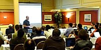
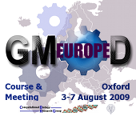

# January 2009 GMOD Meeting

From GMOD

Jump to: [navigation](#mw-navigation), [search](#p-search)

<table
style="font-size: 160%; vertical-align: middle; border: 2px solid #A6A6BC; line-height: 120%"
data-cellpadding="10">
<colgroup>
<col style="width: 33%" />
<col style="width: 33%" />
<col style="width: 33%" />
</colgroup>
<tbody>
<tr class="odd">
<td>

</td>
<td data-valign="center"><strong>January 2009 GMOD
Meeting</strong> 
January 15-16, 2009 
 
Following <a href="PAG_2009" title="PAG 2009">PAG 2009</a> 
San Diego, California, USA</td>
<td data-valign="center"></td>
</tr>
</tbody>
</table>

  
This [GMOD community meeting](Meetings "Meetings") was held January
15-16, 2009, in San Diego, immediately following [Plant and Animal
Genome (PAG 2009)](PAG_2009 "PAG 2009"). There were over [50
participants](#Meeting_Participants) at the meeting.

  

## Contents

- [1
  Agenda](#Agenda)
  - [1.1 Thursday,
    January 15](#Thursday.2C_January_15)
  - [1.2 Friday,
    January 16](#Friday.2C_January_16)
- [2 Themes and
  Discussions](#Themes_and_Discussions)
  - [2.1 Data
    Sharing](#Data_Sharing)
- [3
  Presentations](#Presentations)
  - [3.1 The State
    of GMOD](#The_State_of_GMOD)
    - [3.1.1
      Releases](#Releases)
    - [3.1.2 Howard
      Hughes Medical Institute Science Education
      Alliance](#Howard_Hughes_Medical_Institute_Science_Education_Alliance)
    - [3.1.3
      GBrowse Update](#GBrowse_Update)
  - [3.2 GMOD Help
    Desk](#GMOD_Help_Desk)
  - [3.3 A RESTful
    Interface for MODs?](#A_RESTful_Interface_for_MODs.3F)
  - [3.4 Data
    Representation in Chado: Best
    Practices](#Data_Representation_in_Chado:_Best_Practices)
  - [3.5 Generic
    Gene Page XML](#Generic_Gene_Page_XML)
  - [3.6
    BioMart](#BioMart)
  - [3.7
    JBrowse](#JBrowse)
  - [3.8 GMODWeb
    and Package Management](#GMODWeb_and_Package_Management)
  - [3.9 EcoliWiki
    and TableEdit](#EcoliWiki_and_TableEdit)
  - [3.10
    WebGBrowse: GBrowse Configuration
    Management](#WebGBrowse:_GBrowse_Configuration_Management)
  - [3.11 Drupal
    and MarineGenomics.org](#Drupal_and_MarineGenomics.org)
    - [3.11.1
      Drupal](#Drupal)
    - [3.11.2
      Drupal and Chado](#Drupal_and_Chado)
    - [3.11.3
      Tripal](#Tripal)
  - [3.12 Artemis
    and Chado at GeneDB](#Artemis_and_Chado_at_GeneDB)
  - [3.13 Chado and
    GUS at SBRI](#Chado_and_GUS_at_SBRI)
  - [3.14
    modENCODE: extending Chado, BIR-TAB, & GBrowse
    for automating data validation &
    display](#modENCODE:_extending_Chado.2C_BIR-TAB.2C_.26_GBrowse_for_automating_data_validation_.26_display)
  - [3.15
    BeeSpace](#BeeSpace)
  - [3.16 Metadata
    Input and Submission Tool and GIS linked metagenomic
    database](#Metadata_Input_and_Submission_Tool_and_GIS_linked_metagenomic_database)
  - [3.17 Bovine
    Genome Database](#Bovine_Genome_Database)
  - [3.18
    GNPAnnot](#GNPAnnot)
- [4
  Registration](#Registration)
- [5 Agenda
  Proposals](#Agenda_Proposals)
- [6 Meeting
  Participants](#Meeting_Participants)
- [7
  Feedback](#Feedback)
- [8 Next Meeting:
  August 2009 at Oxford](#Next_Meeting:_August_2009_at_Oxford)

  

## Agenda

### Thursday, January 15

| Time | Topic | Presenter(s) | Links |
|----|----|----|----|
| 10:00 AM | Registration |  |  |
| 10:30 AM | Introductions | [Scott Cain](User:Scott "User:Scott") |  |
| 11:00 AM | The State of GMOD | [Scott Cain](User:Scott "User:Scott") | <a href="../mediawiki/images/2/21/Jan2009StateOfGMOD.ppt"
class="internal" title="Jan2009StateOfGMOD.ppt">PPT</a>, [Summary](#The_State_of_GMOD) |
| 11:30 AM | A variety of [GMOD Help Desk](GMOD_Help_Desk "GMOD Help Desk") stuff | [Dave Clements](User:Clements "User:Clements") | <a href="../mediawiki/images/4/4d/Jan2009HelpDesk.pdf" class="internal"
title="Jan2009HelpDesk.pdf">PDF</a>, [Summary](#GMOD_Help_Desk) |
| 12:00 PM | Lunch | *one hour 30 minutes* |  |
| 1:30 PM | <a href="http://drupal.org" class="external text"
rel="nofollow">Drupal</a> and <a href="http://www.marinegenomics.org" class="external text"
rel="nofollow">MarineGenomics.org</a> | [Stephen Ficklin](User:Sficklin "User:Sficklin") | <a href="../mediawiki/images/0/0f/Jan2009MarineGenomics.pdf"
class="internal" title="Jan2009MarineGenomics.pdf">PDF</a>, [Summary](#Drupal_and_MarineGenomics.org) |
| 2:00 PM | <a href="http://www.sanger.ac.uk/Software/Artemis/"
class="external text" rel="nofollow">Artemis</a> and <a href="Chado" class="mw-redirect" title="Chado">Chado</a> at <a href="http://www.genedb.org/" class="external text"
rel="nofollow">GeneDB</a> | Robin Houston | <a href="../mediawiki/images/5/5c/Jan2009ArtemisChadoGeneDB.ppt"
class="internal" title="Jan2009ArtemisChadoGeneDB.ppt">PPT</a>, <a href="../mediawiki/images/8/8a/Jan2009ArtemisChadoGeneDB.pdf"
class="internal" title="Jan2009ArtemisChadoGeneDB.pdf">PDF</a>, [Summary](#Artemis_and_Chado_at_GeneDB) |
| 2:30 PM | modENCODE: extending <a href="Chado" class="mw-redirect" title="Chado">Chado</a>, BIR-TAB, & GBrowse for automating data validation & display | [Nicole Washington](User:NLWashington "User:NLWashington") | <a href="../mediawiki/images/7/70/Jan2009modENCODE.pdf" class="internal"
title="Jan2009modENCODE.pdf">PDF</a>, [Summary](#modENCODE:_extending_Chado.2C_BIR-TAB.2C_.26_GBrowse_for_automating_data_validation_.26_display) |
| 3:00 PM | Break |  |  |
| 3:30 PM | A RESTful interface for [MODs](MOD "MOD")? | [Josh Goodman](User:Jogoodma "User:Jogoodma") | <a href="../mediawiki/images/6/63/Jan2009RESTfulMODs.ppt"
class="internal" title="Jan2009RESTfulMODs.ppt">PPT</a>, <a href="../mediawiki/images/6/66/Jan2009RESTfulMODs.pdf"
class="internal" title="Jan2009RESTfulMODs.pdf">PDF</a>, [Summary](#A_RESTful_Interface_for_MODs.3F), [Discussion](#Data_Sharing) |
| 4:00 PM | Metadata Input and Submission Tool and GIS linked metagenomic database | Iddo Friedberg and Christopher Condit | <a href="../mediawiki/images/c/c7/Jan2009MIST.pdf" class="internal"
title="Jan2009MIST.pdf">PDF</a>, [Summary](#Metadata_Input_and_Submission_Tool_and_GIS_linked_metagenomic_database) |
| 4:30 PM | Data Representation in <a href="Chado" class="mw-redirect" title="Chado">Chado</a>: Best Practices | [Joshua Orvis](User:Jorvis "User:Jorvis") and/or Scott Cain | [Summary](#Data_Representation_in_Chado:_Best_Practices), [Discussion](#Data_Sharing) |
| 5:00 PM | Dinner (on your own) |  |  |

### Friday, January 16

<table class="wikitable">
<colgroup>
<col style="width: 25%" />
<col style="width: 25%" />
<col style="width: 25%" />
<col style="width: 25%" />
</colgroup>
<thead>
<tr class="header">
<th>Time</th>
<th>Topic</th>
<th>Presenter(s)</th>
<th>Links</th>
</tr>
</thead>
<tbody>
<tr class="odd">
<td>9:00 AM</td>
<td><a href="Chado" class="mw-redirect" title="Chado">Chado</a> and <a
href="http://www.gusdb.org/" class="external text"
rel="nofollow">GUS</a> at <a href="http://www.sbri.org"
class="external text" rel="nofollow">SBRI</a></td>
<td><a href="User:Sivam" title="User:Sivam">Dhileep Sivam</a> and
Isabelle Phan</td>
<td><a
href="../mediawiki/images/4/43/2009_GMOD_Meeting_Dhileep_Sivam_and_Isabelle_Phan.ppt"
class="internal"
title="2009 GMOD Meeting Dhileep Sivam and Isabelle Phan.ppt">PPT</a>,
<a
href="../mediawiki/images/7/70/2009_GMOD_Meeting_Dhileep_Sivam_and_Isabelle_Phan.pdf"
class="internal"
title="2009 GMOD Meeting Dhileep Sivam and Isabelle Phan.pdf">PDF</a>,
<a href="#Chado_and_GUS_at_SBRI">Summary</a>, <a
href="#Data_Sharing">Discussion</a></td>
</tr>
<tr class="even">
<td>9:30 AM</td>
<td><a href="BioMart" title="BioMart">BioMart</a></td>
<td>Arek Kasprzyk</td>
<td><a href="../mediawiki/images/5/5c/Jan2009BioMart.pdf"
class="internal" title="Jan2009BioMart.pdf">PDF</a>, <a
href="#BioMart">Summary</a></td>
</tr>
<tr class="odd">
<td>10:00 AM</td>
<td>BeeSpace</td>
<td>Barry Sanders, Dave Arcoleo</td>
<td><a href="../mediawiki/images/d/dc/Jan2009BeeSpace.ppt"
class="internal" title="Jan2009BeeSpace.ppt">PPT</a>, <a
href="#BeeSpace">Summary</a></td>
</tr>
<tr class="even">
<td>10:30 AM</td>
<td>Break</td>
<td></td>
<td></td>
</tr>
<tr class="odd">
<td>11:00 AM</td>
<td>WebGBrowse <a href="GBrowse_Configuration_HOWTO" class="mw-redirect"
title="GBrowse Configuration HOWTO">GBrowse configuration</a>
management, <a href="http://gmod.org/wiki/">Summary</a></td>
<td>Ram Podicheti</td>
<td><a href="../mediawiki/images/5/55/Jan2009WebGBrowse.ppt"
class="internal" title="Jan2009WebGBrowse.ppt">PPT</a>, <a
href="../mediawiki/images/3/3d/Jan2009WebBrowse.pdf" class="internal"
title="Jan2009WebBrowse.pdf">PDF</a>, <a
href="#WebGBrowse:_GBrowse_Configuration_Management">Summary</a></td>
</tr>
<tr class="even">
<td>11:30 AM</td>
<td><a href="http://genome.biowiki.org" class="external text"
rel="nofollow">JBrowse</a> (aka GBrowse 3.0)</td>
<td><a href="User:MitchSkinner" title="User:MitchSkinner">Mitch
Skinner</a></td>
<td><a href="../mediawiki/images/3/32/Jan2009JBrowse.odp"
class="internal" title="Jan2009JBrowse.odp">ODP</a>, <a
href="../mediawiki/images/c/ca/Jan2009JBrowse.pdf" class="internal"
title="Jan2009JBrowse.pdf">PDF</a>, <a href="#JBrowse">Summary</a></td>
</tr>
<tr class="odd">
<td>12:00 PM</td>
<td>Lunch</td>
<td><em>one hour 30 minutes</em></td>
<td></td>
</tr>
<tr class="even">
<td>1:30 PM</td>
<td><a href="http://ecoliwiki.net" class="external text"
rel="nofollow">EcoliWiki</a> and <a href="TableEdit.1"
title="TableEdit">TableEdit</a></td>
<td><a href="User:DanielRenfro" title="User:DanielRenfro">Daniel
Renfro</a></td>
<td>I tried, but all I get is
errors. 
And PowerPoint makes a 10MB pdf, 
which is way too big to upload. 
Contact me if you want a copy., <a
href="#EcoliWiki_and_TableEdit">Summary</a></td>
</tr>
<tr class="odd">
<td>2:00 PM</td>
<td><a href="Bio_GMOD_GenericGenePage"
title="Bio GMOD GenericGenePage">Generic Gene Page XML</a></td>
<td>Scott Cain</td>
<td><a href="../mediawiki/images/7/7d/Jan2009GenericGenePage.ppt"
class="internal" title="Jan2009GenericGenePage.ppt">PPT</a>, <a
href="../mediawiki/images/f/f3/Jan2009GenreicGenePage.pdf"
class="internal" title="Jan2009GenreicGenePage.pdf">PDF</a>, <a
href="#Generic_Gene_Page_XML">Summary</a>, <a
href="#Data_Sharing">Discussion</a></td>
</tr>
<tr class="even">
<td>2:30 PM</td>
<td><a href="GMODWeb" title="GMODWeb">GMODWeb</a> and <a
href="Biopackages_HOWTO" title="Biopackages HOWTO">package
management</a></td>
<td>Brian O'Connor</td>
<td><a href="../mediawiki/images/6/62/Jan2009GMODWebAndPackages.ppt"
class="internal" title="Jan2009GMODWebAndPackages.ppt">PPT</a>, <a
href="../mediawiki/images/a/a1/Jan2009GMODWebAndPackages.pdf"
class="internal" title="Jan2009GMODWebAndPackages.pdf">PDF</a>, <a
href="#GMODWeb_and_Package_Management">Summary</a></td>
</tr>
<tr class="odd">
<td rowspan="3">3:00 - 5:00 PM</td>
<td>MIGS and MIMS</td>
<td>Iddo Friedberg</td>
<td><a
href="#Metadata_Input_and_Submission_Tool_and_GIS_linked_metagenomic_database">Summary</a></td>
</tr>
<tr class="even">
<td>Bovine Genome Database</td>
<td>Justin Reese and Chris Childers</td>
<td><a href="../mediawiki/images/d/d5/Jan2009BovineGenomeDatabase.ppt"
class="internal" title="Jan2009BovineGenomeDatabase.ppt">PPT</a>, <a
href="../mediawiki/images/0/0b/Jan2009BovineGenomeDatabase.pdf"
class="internal" title="Jan2009BovineGenomeDatabase.pdf">PDF</a>, <a
href="#Bovine_Genome_Database">Summary</a></td>
</tr>
<tr class="odd">
<td>GNPAnnot</td>
<td>Pierre Larmande</td>
<td><a href="../mediawiki/images/f/f6/Jan2009GNPAnnotChadoMVC.ppt"
class="internal" title="Jan2009GNPAnnotChadoMVC.ppt">ChadoControler</a>,
<a href="#GNPAnnot">Summary</a></td>
</tr>
</tbody>
</table>

## Themes and Discussions

Several themes ran throughout the meeting

### Data Sharing

Several presentations touched on this:

- [A RESTful Interface for MODs?](#A_RESTful_Interface_for_MODs.3F)
- [Data Representation in Chado: Best
  Practices](#Data_Representation_in_Chado:_Best_Practices)
- [Generic Gene Page XML](#Generic_Gene_Page_XML)
- [Chado and GUS at SBRI](#Chado_and_GUS_at_SBRI)

A common question during these talks was how much should we do? Should
we implement a comprehensive data sharing protocol or start with very
modest goals, or should we aim for a sweet spot in the middle? Should we
emphasize robustness or ease of implementation? Should GMOD support
*semantic web* efforts?

[Josh Goodman](User:Jogoodma "User:Jogoodma")
[argued](#A_RESTful_Interface_for_MODs.3F) that RESTful interfaces
provide the highest payoff for the least amount of effort -- that
RESTful was both useful and the easiest to implement.

The semantic web in general and
<a href="http://sswap.info/" class="external text"
rel="nofollow">SSWAP</a> in particular was discussed. Ren Nelson of
SoyBase pointed out that SoyBase's map data is now available through
SSWAP. <a href="http://renato.iannella.it/paper/rdf-idiot/"
class="external text" rel="nofollow">RDF</a>, the
<a href="http://bio2rdf.org/" class="external text"
rel="nofollow">Bio2RDF</a> projct, and the
<a href="http://swoogle.umbc.edu/" class="external text"
rel="nofollow">Swoogle</a> semantic web search engine were also
mentioned.

**Josh Goodman, Rob Buells, Rex Nelson, and Kevin Clancy formed the [Web
services working
group](Web_services_working_group "Web services working group") and will
continue and expand this discussion with the GMOD community.**

[Joshua Orvis](User:Jorvis "User:Jorvis")'s "[Data Representation in
Chado: Best Practices](#Data_Representation_in_Chado:_Best_Practices)"
session dealt with the same issue, this time in the context of
representing biology within
<a href="Chado" class="mw-redirect" title="Chado">Chado</a> in the same
way across organizations. In this session we proposed converging on
common representations by having organizations post their current Chado
practices to the wiki, discussing them on the wiki or on the
[GMOD-Schema mailing list](GMOD_Mailing_Lists "GMOD Mailing Lists"), and
then converging on a common set of Chado best practices. Common
practices would enable both data sharing and common tools. Joshua got
the ball rolling by describing IGS's Chado practices on the [IGS Data
Representation](IGS_Data_Representation "IGS Data Representation") page.

RDF got additional discussion during [Dhileep
Sivam](User:Sivam "User:Sivam") and Isabelle Phan's session on [Chado
and GUS at SBRI](#Chado_and_GUS_at_SBRI).
<a href="http://dev.isb-sib.ch/projects/uniprot-rdf/intro.html"
class="external text" rel="nofollow">Uniprot uses RDF</a> to represent
their data. XML gives you a tree representation, while RDF gives you a
graph of RDF files. Graphs more often better reflect what is being
described. Sparql is the standard query language for accessing RDF.

## Presentations

The presentations are listed here in a very approximate order:

- GMOD Project Presentations
- GMOD Components
- GMOD User Experiences

### The State of GMOD

- <a href="../mediawiki/images/2/21/Jan2009StateOfGMOD.ppt"
  class="internal" title="Jan2009StateOfGMOD.ppt">The State of GMOD</a>,
  [Scott Cain](User:Scott "User:Scott")

[Activity](GMOD_News "GMOD News") since the [July 2008 GMOD
Meeting](July_2008_GMOD_Meeting "July 2008 GMOD Meeting"):

#### Releases

- [GBrowse](GBrowse.1 "GBrowse") 1.69 released
- [Apollo](Apollo.1 "Apollo") 1.9.? released
- [CMap](CMap.1 "CMap") 1.01 released
- [Generic Gene
  Page](Bio_GMOD_GenericGenePage "Bio GMOD GenericGenePage") released
- GMOD 1.1 (<a href="Chado" class="mw-redirect" title="Chado">Chado</a>)
  - Minor Schema changes
  - Minor fix to [GFF3](GFF3 "GFF3") preprocessing tools
  - Chris Mungall's [Materialized
    views](Materialized_views "Materialized views") of controlled
    vocabulary terms.
- Bio::Graphics split from [BioPerl](BioPerl "BioPerl")
  - Both for releases and source code repository.
  - As soon as BioPerl 1.6 is released, installing Bio::Graphics from
    CPAN should work.

#### Howard Hughes Medical Institute Science Education Alliance

A program set up by the
<a href="http://www.hhmi.org/grants/sea/" class="external text"
rel="nofollow">Science Education Alliance (SEA)</a> staff of the
<a href="http://www.hhmi.org/" class="external text"
rel="nofollow">Howard Hughes Medical Institute (HHMI)</a>, in close
collaboration with [Ed Lee](User:Elee "User:Elee") of Lawrence Berkeley
National Laboratory, uses [GMOD
Components](GMOD_Components "GMOD Components") to teach sequencing from
sample collection to annotation to submission to GenBank. College
freshmen at 12 schools isolate and then sequence *mycobacterium
smegmatis* phages, manage the sequence with
<a href="Chado" class="mw-redirect" title="Chado">Chado</a>, annotate it
with [Apollo](Apollo.1 "Apollo"), and display it with
[GBrowse](GBrowse.1 "GBrowse"). At the end of the course, each school
submits a newly sequenced and annotated phage genome to GenBank. Matt
Conte, the SEA bioinformatics specialist at the time the workflow was
developed and implemented, attended the [2008 GMOD Summer
School](2008_GMOD_Summer_School "2008 GMOD Summer School").

#### GBrowse Update

**Roadmap:**

- 1.69 released in August. Lots of new stuff
- Popups (from [Sheldon McKay](User:Mckays "User:Mckays"))
- Vertical dragging of tracks
- Rubber banding (also Sheldon)
- Quantitative data (Wiggle tracks)
- Conservation data
- Track sharing
- [Galaxy](Galaxy.1 "Galaxy") integeration

**1.70 Release:**

- Waiting on [BioPerl](BioPerl "BioPerl") 1.6 release
- Significant [GBrowse_syn](GBrowse_syn.1 "GBrowse syn") enhancements.
- Minor bug fixes.

**2.0 Release:**

- Parallelizable track data sources and rendering.
- User interface changes also make it feel quicker, even when running on
  a single CPU
  - Tracks rendered as soon as they are done.

**3.0 Release**

- What was GBrowse 3.0 is now [JBrowse - see below](#JBrowse).

  

### GMOD Help Desk

- <a href="../mediawiki/images/4/4d/Jan2009HelpDesk.pdf" class="internal"
  title="Jan2009HelpDesk.pdf">GMOD Help Desk</a>, [Dave
  Clements](User:Clements "User:Clements")

Dave gave an update on what the [GMOD Help
Desk](GMOD_Help_Desk "GMOD Help Desk") has been up to since the [July
2008 GMOD Meeting](July_2008_GMOD_Meeting "July 2008 GMOD Meeting"), and
also talked about future plans.

The [2008 GMOD Community
Survey](2008_GMOD_Community_Survey "2008 GMOD Community Survey") was
conducted in October. Dave summarized the result of the survey.

2009 will be the year that natural diversity support becomes an integral
part of GMOD,

- Dave will polish the natural diversity and fold it into production
  Chado. This was originally written for HeliconiusDB and is based on
  GDPDM, a data model used by Gramene and MaizeGenetics. This work may
  involve tweaking existing modules like Phenotype.
- Ben Faga is working on adding geolocation visualization to
  [GBrowse](GBrowse.1 "GBrowse")
- Dave is involved in a
  <a href="http://www.nescent.org" class="external text"
  rel="nofollow">NESCent</a> working group with the goal of extending
  GMOD to better support evolutionary and ecological research.
- Dave is hoping to organize a hackathon later this year to specifically
  address natural diversity needs in GMOD.

Some upcoming meetings and courses:

- The 2009 North American
  <a href="GMOD_Summer_School" class="mw-redirect"
  title="GMOD Summer School">GMOD Summer School</a> at NESCent. The date
  isn't set for this yet.
- [2009 European GMOD Week](GMOD_Europe_2009 "GMOD Europe 2009")
  - Held 3-7 August in Oxford, UK
  - ~3 day [2009 GMOD Summer School -
    Europe](2009_GMOD_Summer_School_-_Europe "2009 GMOD Summer School - Europe")
  - ~2 day [August 2009 GMOD
    Meeting](August_2009_GMOD_Meeting "August 2009 GMOD Meeting") - this
    will be the next [GMOD meeting](Meetings "Meetings").

See [below](#Next_Meeting:_August_2009_at_Oxford) for more.

Documentation and Web Site:

- A [GBrowse](GBrowse.1 "GBrowse") user tutorial will be released by
  <a href="http://www.openhelix.com" class="external text"
  rel="nofollow">OpenHelix</a> later this month. This is a Flash based
  tutorial that goes into great detail on how to use GBrowse's basic and
  advanced user features.
- GMOD for High-throughput sequencing
  - Dave will be putting time into how GMOD supports this and outreach
    to the community that is doing this.
- Web site upgrades
  - Went to
    <a href="http://mediawiki.org" class="external text">MediaWiki</a>
    1.12 in August 2008. Got better search ability and uniform URLs.
  - Planning to upgrade to 1.13 or 1.14 this spring, and maybe give the
    site a new look.

And some delayed tasks, that Dave talked about at the [July 2008 GMOD
Meeting](July_2008_GMOD_Meeting "July 2008 GMOD Meeting"):

- [Chado Documentation
  Reorganization](Chado_Documentation_Reorganization "Chado Documentation Reorganization") -
  not yet
- User Directory - not yet
- [GBrowse](GBrowse.1 "GBrowse") doc- getting there
- [Community Annotation
  System](Community_Annotation_System "Community Annotation System")
  doc - not yet
- [GMOD Logo Service](GMOD_Logo_Program "GMOD Logo Program") - still
  trying

Finally, Dave solicited feedback on what he should be doing. Some
highlights:

- Document what parts of the [GFF3](GFF3 "GFF3") standard
  [GBrowse](GBrowse.1 "GBrowse") can't currently deal with.
- Document what variables are available in
  [GBrowse](GBrowse.1 "GBrowse") callbacks.

([Russell Smithies](User:Russellsmithies "User:Russellsmithies") also
mentioned that if you put [GBrowse](GBrowse.1 "GBrowse") callbacks in a
separate file and then include them, the GBrowse parser becomes much
less fragile.)

### A RESTful Interface for MODs?

- <a href="../mediawiki/images/6/66/Jan2009RESTfulMODs.pdf"
  class="internal" title="Jan2009RESTfulMODs.pdf">A RESTful interface for
  MODs?</a>, [Josh Goodman](User:Jogoodma "User:Jogoodma")

Josh Goodman of the [FlyBase](Category:FlyBase "Category:FlyBase")
project proposed that GMOD support a
<a href="http://tomayko.com/writings/rest-to-my-wife"
class="external text" rel="nofollow">RESTful interface</a> for
biological data. Josh started by listing many of the
[APIs](Category:Middleware "Category:Middleware") that already exist in
GMOD or at GMOD user sites, and then asked the question "Why have
another one?" Here's why:

- None of the existing APIs are compatible with each other.
- Use different data models
- Some assume the
  <a href="Chado" class="mw-redirect" title="Chado">Chado</a> data model
  - and not everyone uses Chado, nor will they
- Some assume a particular language like Java or Perl.

Why go with REST?

- If adoption costs are high, people won't use a technology
- REST tends to have a low cost of adoption
- It's language neutral

What should a GMOD REST implementation have?

- Simple and lightweight (low cost of adoption)
- URL based
- Versioned URLs for stability
  - Versions refer to format/API, not to data.
- Data model neutral (that is, don't assume Chado
- Result lists in [XML](Glossary#XML "Glossary") or
  [JSON](Glossary#JSON "Glossary")
- Gene records in [Generic Gene
  Page](Bio_GMOD_GenericGenePage "Bio GMOD GenericGenePage") XML

See [Data Sharing](#Data_Sharing) for the discussion that Josh's talk
spawned, and
<a href="GMOD_REST_API" class="mw-redirect" title="GMOD REST API">GMOD
REST API</a> for a proposed standard.

### Data Representation in Chado: Best Practices

[Joshua Orvis](User:Jorvis "User:Jorvis")'s talk was the second to
specifically address [common data representations and
formats](#Data_Sharing).

The same data can be stored in
<a href="Chado" class="mw-redirect" title="Chado">Chado</a> in wildly
different ways. There are few commonly agreed on or documented best
practices. Common practices are vital for both data and tool sharing.

An example undocumented/unestablished best practice would describe how
to version features in Chado. Should you use naming conventions? Should
the [Chado Audit Module](Chado_Audit_Module "Chado Audit Module") be
used for this. Either approach (or others) may be viable, but without a
standard any one groups's implementation is likely to be incompatible
with every other group's implementation.

This led to two questions:

**Q: How do changes to the
<a href="Chado" class="mw-redirect" title="Chado">Chado</a> schema
happen?**

[Scott](User:Scott "User:Scott"): Post your ideas to the [GMOD-Schema
maililng list](GMOD_Mailing_Lists "GMOD Mailing Lists"), people will
discsuss it, and then Scott (or you) will fold the changes into Chado.

**Q: How do we establish Chado best/common practices?**

The general response here was

- Ask organizations to describe what they currently do, and how they
  think things should be represented.
  - Joshua created a page, [IGS Data
    Representation](IGS_Data_Representation "IGS Data Representation"),
    that describes how IGS uses Chado. This page is an excellent
    template for other organizations to use as a starting point for
    describing their practices.
- Use these documents as discussion points for converging on a common
  set of best practices.

Dave pointed out that once we have standards, a Chado validator could be
written to report any data in a Chado database that does not conform to
best practices.

### Generic Gene Page XML

- <a href="../mediawiki/images/7/7d/Jan2009GenericGenePage.ppt"
  class="internal" title="Jan2009GenericGenePage.ppt">Generic Gene Page
  XML</a>, [Scott Cain](User:Scott "User:Scott")

A Perl implementation of the [Generic Gene Page
XML](Bio_GMOD_GenericGenePage "Bio GMOD GenericGenePage") was released
after the [July 2008 GMOD
Meeting](July_2008_GMOD_Meeting "July 2008 GMOD Meeting").

There are now at least three servers that generate GMOD Generic Gene
Page XML:

- [SGN](Category:SGN "Category:SGN")
- [FlyBase](Category:FlyBase "Category:FlyBase")
- Sample yeast at GMOD.org

The Perl implementation has 11 or so abstract classes that need to be
implemented, and the new() method also needs to be overridden.

The [XML](Glossary#XML "Glossary") generated by this package does not
conform to [Chado XML](Chado_XML "Chado XML"), It also does not share
tags with NCBI's Gene XML. It is very close to Uniprot XML. Column 9
attributes in [GFF](GFF "GFF") becomes a comments with a type of the
attribute tag name (*e.g.*, "note").

We don't currently have an XML-Schema or documentation on this format.
The Perl package is what currently defines it. We also don't have any
code that consumes this XML. [BioPerl](BioPerl "BioPerl") code could be
written that would eat the XML and produce a Bio::SeqFeature object.

We discussed adding sequence to the XML, but did not reach a conclusion
on this.

See [Data Sharing](#Data_Sharing) above for more on this topic.

### BioMart

- <a href="../mediawiki/images/5/5c/Jan2009BioMart.pdf" class="internal"
  title="Jan2009BioMart.pdf">BioMart</a>, Arek Kasprzyk

Arek Kasperzyk described the [BioMart](BioMart "BioMart") project with a
particular emphasis on tighter integration with other [GMOD
Components](GMOD_Components "GMOD Components").

BioMart can handle very large datasets and can be configured as a
centralized data warehouse or as a federated one. BioMart also enables
you to hide your own mart while federating with others. Arek expects a
lot of future demand for BioMart to be an inhouse bioinformatics protal.

BioMart is being used by the International Cancer Genome Consortium,
which expects to do *50,000* human genomes. With this amount of data you
have to use the federated data model. They are using OpenID for
authentication and have support for versioning.

Three key concepts in BioMart are datasets, filters, and actions.
BioMart provides makes its data available through a web interface, and
Perl API, and web services. The three core concepts are used in all of
those interfaces.

In the past, BioMart has only supported
<a href="Chado" class="mw-redirect" title="Chado">Chado</a> as a data
source to feed BioMart (and a problematic one - see below). However,
could also use BioMart's interfaces as a data source for many GMOD
components such as [GBrowse](GBrowse.1 "GBrowse"),
[CMap](CMap.1 "CMap"), [Galaxy](Galaxy.1 "Galaxy"), etc. BioMart is
interested in pursuing this and Arek floated the idea of a hackathon to
help achieve this.

Arek described the current Chado to BioMart mapping as challenging
because of the extensive cross-referencing in the schema. This makes
Chado very flexible, but it makes it difficult for BioMart to tease out
relationships in the data.

Arek was asked to summarize differences between BioMart and
[InterMine](InterMine "InterMine"), another similar GMOD component.
There are many differences but two key ones are how optimization is done
and the data model that each uses.

### JBrowse

- <a href="../mediawiki/images/c/ca/Jan2009JBrowse.pdf" class="internal"
  title="Jan2009JBrowse.pdf">JBrowse</a> (aka GBrowse 3.0), [Mitch
  Skinner](User:MitchSkinner "User:MitchSkinner")

[JBrowse](JBrowse.1 "JBrowse"), formerly known as GBrowse 3.0 is a
reimplementation of GBrowse functionality in JavaScript.

JBrowse can load data from a number of data sources including
[GFF](GFF "GFF") files and Bio::DasI implementations like Bio::DB::GFF
([GFF2](GFF2 "GFF2")) and Bio::DB::SeqFeature::Store
([GFF3](GFF3 "GFF3")) databases. It then translates them into <a
href="http://bioinformatics.oxfordjournals.org/cgi/content/short/23/11/1386"
class="external text" rel="nofollow">nested containment lists</a> in
[JSON](Glossary#JSON "Glossary") format.

This strategy has number of benefits:

- using pre-generated JSON means no CGI needed for browsing
  - Thus, easier installation, and
  - Scale to large genome and large numbers of users.
- JSON is also cached by web browsers, making it fast.

The JBrowse configuration file also uses JSON syntax.

Several new features have been added since the last report at the [July
2008 GMOD Meeting](July_2008_GMOD_Meeting "July 2008 GMOD Meeting"):

- Name/ID searching
  - Names and IDs are stored in JSON using a Trie structure (a string
    prefix tree) and subtrees are loaded lazily.
- Quantitative tracks
- Subfeature support

A development version of JBrowse is
<a href="http://genome.biowiki.org" class="external text"
rel="nofollow">available for download</a>.

### GMODWeb and Package Management

- <a href="../mediawiki/images/a/a1/Jan2009GMODWebAndPackages.pdf"
  class="internal" title="Jan2009GMODWebAndPackages.pdf">GMODWeb and
  Package Management</a>, Brian O'Connor

Brian O'Connor from the
<a href="http://genomics.ctrl.ucla.edu/pmwiki/" class="external text"
rel="nofollow">Nelson Lab at UCLA</a> spoke about
[GMODWeb](GMODWeb "GMODWeb") and [RPM package
management](Biopackages_HOWTO "Biopackages HOWTO").

[GMODWeb](GMODWeb "GMODWeb") is a GMOD component for generating web
sites that are driven by a
<a href="Chado" class="mw-redirect" title="Chado">Chado</a> database. It
is based on [Turnkey](Turnkey "Turnkey"). Turnkey takes a schema and
turns it into a website. GMODWeb adds several GMOD specific widgets that
add things like support for [GBrowse](GBrowse.1 "GBrowse"). Brian
divided GMODWeb into two distinct phases. First, generating the website.
Second, load it into Apache and mod_perl and bring that web site up.
Users (see [Stephen Ficklin's talk
below](#Drupal_and_MarineGenomics.org) for an example) generally have
little trouble with the first step. However, in the second step users
often find themselves in Perl
*<a href="http://en.wikipedia.org/wiki/Dependency_hell"
class="external text" rel="nofollow">dependency hell</a>*. GMODWeb has
over 100 Perl dependencies and user success at getting them all lined up
correctly depends on a tenacious [GMOD Systems
Administrator](Computing_Requirements#GMOD_Systems_Administrator "Computing Requirements").

Can we do anything about this? Perhaps if we had package management
support ...

The second part of Brian's talk was about
<a href="http://biopackages.net" class="external text"
rel="nofollow">BioPackages.net</a>, a repository of biology software
*RPMs* for the CentOS (based on Red Hat Enterprise Linux) and Fedora
(also part of the Red Hat suite) Linux distributions. *RPMs* are
software packages that clearly specify what other RPMs they depend on.
They greatly simplify software management.

BioPackages.net was created by and is currently managed by the Nelson
Lab at UCLA. It has a build farm backing it that is used to generate the
packages. They would like to see the BioPackages build farm be
replicated somewhere else. Build farms have different virtual servers
for each version of Linux that is supported. BioPackages currently has a
rich, but somewhat dated, library of CentOS4 RPM packages. They are now
transitioning to CentOS5, and are currently packaging Chado 1.0
releases, as well as a
<a href="DAS" class="mw-redirect" title="DAS">DAS</a>/2 reference
server.

RPMs, while good on paper, have a number of implementation challenges.
It is rare that you can find all your needed software in RPM format.
Sometimes you have to install from CPAN, or from source, and as soon as
that happens the RPM infrastructure starts to lose its integrity. One
way around this is to use
<a href="VMWare_HOWTO" class="mw-redirect" title="VMWare HOWTO">virtual
machines</a>. Currently working on a prototype CentOS4 machine with
Chado 1.0, recent [BioPerl](BioPerl "BioPerl"), and Turnkey/GMODWeb 1.4
installed. After this meeting [Dave
Clements](User:Clements "User:Clements") is going to UCLA for two days
to learn about RPM generations and the BioPackages.net infrastructure.

  
Brian would like people to
<a href="mailto:briandoconnor@gmail.com" class="external text"
rel="nofollow">contact him</a> ...

- Turnkey/GMODWeb: looking to expand Java producer to eliminate Perl
  dependency problem
- BioPackages: looking for RPM developers (or Debian package builders
  for Ubuntu)
- Virtual Machines: looking to create CentOS5 machines
  - Pre-configured GMOD demo/dev kit
  - Pre-configured Biopackages dev kit
- **Anyone who is using GMOD tools for Next Gen Sequencing**
  (<a href="mailto:clements@nescent.org" class="external text"
  rel="nofollow">Dave C</a> would also like to know if you are doing
  this)

  

### EcoliWiki and TableEdit

- <a href="../mediawiki/images/d/d9/Jan2009TableEdit.pdf" class="internal"
  title="Jan2009TableEdit.pdf">EcoliWiki and TableEdit</a>, [Daniel
  Renfro](User:DanielRenfro "User:DanielRenfro")

[Daniel Renfro](User:DanielRenfro "User:DanielRenfro") of the [Jim
Hu](User:JimHu.1 "User:JimHu") lab spoke about
<a href="http://ecoliwiki.net/colipedia/index.php/Welcome_to_EcoliWiki"
class="external text" rel="nofollow">EcoliWiki</a> and the
[TableEdit](TableEdit.1 "TableEdit") MediaWiki extension.

EcoliWiki is a wiki for the *E. coli* community. One goal of wikis is to
enable any interested user to make small updates and corrections to the
web site. Wikis enable users to easily enter plain text and they support
simplified markup languages to enable users to do some basic formatting
like **bolding** or *italicization* without having to learn the more
complex (and none too intuitive) HTML or CSS markup. Wikis enable making
the unit of submission very small.

However, even simplified wiki markup for tables is, at its best tedious,
and at its worst impenetrable. [TableEdit](TableEdit.1 "TableEdit") is
an extension to the
<a href="http://mediawiki.org/" class="external text">MediaWiki</a> wiki
package that protects users from dealing with MediaWiki markup. In
addition TableEdit also supports templates so the same table format can
be reused in multiple places in a wiki (*e.g.*, on every gene page as on
EcoliWiki) and integration with backend databases, such as
<a href="Chado" class="mw-redirect" title="Chado">Chado</a>.

Recent work on TableEdit includes:

- Added a button for insert TableEdit text.
- Templates can now pull data from a table on another page.
- Better documentation.
- Support for really big tables.
- Conflict detection (simultaneous updates)
- help links 100% editable.
- Bulk loader
  - Uses <a href="TableEdit/IFALT" class="mw-redirect"
    title="TableEdit/IFALT">IFALT</a> format.

Work continues on TableEdit and version 2 is expected to have support
Chado round-tripping. That is, data from Chado can be displayed in
TableEdit tables in a wiki, and you can use the TableEdit wiki interface
to *update* data in a Chado database.

Iddo asked about uploading excel spreadsheets. This function is not
currently planned.

### WebGBrowse: GBrowse Configuration Management

- <a href="../mediawiki/images/5/55/Jan2009WebGBrowse.ppt"
  class="internal" title="Jan2009WebGBrowse.ppt">WebGBrowse GBrowse
  configuration management</a>, Ram Podicheti

Ram Podicheti spoke on WebGBrowse, a new web interface for configuring
and hosting [GBrowse](GBrowse.1 "GBrowse") instances that was developed
at Indiana University.

WebGBrowse was developed to ease GBrowse configuration. One reason for
the popularity of GBrowse is the wide range of glyphs it supports, and
the configurbility of those glyphs. However, most glyphs are not well
documented and some are not documented at all. When documentation does
exist, it is aimed at Perl programmers, and to learn all the options
supported by each glyph you need to look at the Perl code. GBrowse is
now being used in smaller organizations that may not have personnel with
relevant experience.

The aim of WebGBrowse is to make GBrowse available to biologists without
the installation or support costs. WebGBrowse allows users to upload
their own GFF3 datasets, and to use a web interface to to configure
GBrowse. It curently supports configuration options for 42 glyphs. The
information about and options for each glyph is stored in YAML.

WebGBrowse is available both at IU and as downloadable software.

The next release of WebGBrowse will add more functionality:

- Support uploading of [GFF3](GFF3 "GFF3") as tar balls
- Expand the glyph library
- Allow of loading of pre-existing configuration files and start from
  there.
- Support GENERAL section configuration
- Balloons, plugsin, etc
- Allow group feature configuration
- Categorize the glyphs
- Perl callbacks.

In a discussion afterward on how best to document glyphs, Rob Buells (I
think) suggested having the glyphs be self-documenting. That is,
Bio::Graphics::Glyph would be extended to make it possible to ask a
glyph what it can do and what options it supports. This facility could
be used by WebGBrowse to learn about glyphs, or to automatically
produces wiki documentation for each glyph, or by any other program that
cares.

Rob will look into this.

### Drupal and MarineGenomics.org

- <a href="../mediawiki/images/0/0f/Jan2009MarineGenomics.pdf"
  class="internal" title="Jan2009MarineGenomics.pdf">Drupal and
  MarineGenomics.org</a>, [Stephen
  Ficklin](User:Sficklin "User:Sficklin")

[Stephen Ficklin](User:Sficklin "User:Sficklin") of the
<a href="http://www.genome.clemson.edu/" class="external text"
rel="nofollow">Clemson Univerisity Genomics Institute (CUGI)</a> spoke
about his group's work using GMOD components to power a number of web
sites.

- <a href="http://www.marinegenomics.org" class="external text"
  rel="nofollow">MarineGenomics.org</a> - Drupal &
  <a href="Chado" class="mw-redirect" title="Chado">Chado</a>
- <a href="http://www.fagaceae.org" class="external text"
  rel="nofollow">Fagaceae Genomics Web</a> -
  [GMODWeb](GMODWeb "GMODWeb") & Chado
- <a href="http://www.coralmicrobes.org" class="external text"
  rel="nofollow">CoralMicroges.org</a> - Drupal & Chado
- <a href="http://www.bioinfo.wsu.edu/gdr" class="external text"
  rel="nofollow">Genome Database for Rosaceae (GDR)</a> - converting to
  Chado

Most of these sites use
<a href="Chado" class="mw-redirect" title="Chado">Chado</a> as the back
end database and either [GMODWeb](GMODWeb "GMODWeb") or
<a href="http://www.drupal.org" class="external text"
rel="nofollow">Drupal</a> to implement the web interface. Stephen
elaborated on the benefits and challenges of using Drupal with Chado.

#### Drupal

CUGI chose Drupal because:

- Quicker development
- Easy user contribution
- well documented.
- large user community
- plugins
- easy to customize look and feel
- social networking abilities.

Drupal uses:

- Menus, node, and blocks for organization
- PHP, CSS, JQuery and [AJAX](Glossary#AJAX "Glossary") for user
  interface.

Drupal choices:

- Not using Drupal's
  <a href="http://drupal.org/project/cck" class="external text"
  rel="nofollow">Content Construction Kit (CCK)</a>. Wrote their own.
- Using Drupal's search capability.
- Drupal's <a href="http://drupal.org/node/299" class="external text"
  rel="nofollow">taxonomy</a> categorization.
- Embed [GBrowse](GBrowse.1 "GBrowse") in an IFrame in Drupal

#### Drupal and Chado

They are using the
[sequence](Chado_Sequence_Module "Chado Sequence Module"),
[organism](Chado_Organism_Module "Chado Organism Module"), and
[library](Chado_Library_Module "Chado Library Module") modules from
Chado.

Kept Chado and Drupal schemas separate, but Drupal needs to know what is
in the Chado database. Implemented Chado_feature node in Drupal.
Correlates feature node with feature ID. Provide forms for updating
Chado

Need to synchronize Drupal and Chado databases. Some data
([GFF](GFF "GFF")) is added to Chado first and then copied to Drupal,
while other data (EST pipeline results) are added to Drupal first and
then copied to Chado.

They have large putative data sets and their BLAST results are not
stored in Chado - they are just too big. Instead they use XML formatted
resutls for each feature and then Drupal indexes this. Stored in
filesystem based on DB ID and feature ID.

#### Tripal

CUGI is calling its Drupal on
<a href="Chado" class="mw-redirect" title="Chado">Chado</a>
implementation *[Tripal](Tripal.1 "Tripal")* and they are planning to
release it to the GMOD Community in Spring of 2009 so that others can
use it to power their web sites.

### Artemis and Chado at GeneDB

- <a href="../mediawiki/images/8/8a/Jan2009ArtemisChadoGeneDB.pdf"
  class="internal" title="Jan2009ArtemisChadoGeneDB.pdf">Artemis and Chado
  at GeneDB</a>, Robin Houston

<a href="http://www.genedb.org/" class="external text"
rel="nofollow">GeneDB</a> is a core part of the Sanger Institute
Pathogen Sequencing Unit. GeneDB currently has data on 50+ pathogens and
expects that number to grow by orders of magnitude in the coming years.
GeneDB curators use [Artemis](Artemis "Artemis") to do manual genome
annotation. (Artemis serves the same purpose as
[Apollo](Apollo.1 "Apollo"), and like Apollo is also implemented in
Java.)

GeneDB is currently in the process of moving their data to
<a href="Chado" class="mw-redirect" title="Chado">Chado</a>. GeneDB is
also upgrading its web site to pull data from Chado indirectly. Data
will be read from Chado and cached in serialized Java object in a
BerkeleyDB database. This approach results in a very responsive (as in
*darn near instantaneous*) web site. The new web site will launch in the
first half of 2009.

GeneDB developed a [Hibernate
mapping](Category:Middleware "Category:Middleware") for Chado. The
feature hierarchy is represented using single table inheritance.

### Chado and GUS at SBRI

- <a
  href="../mediawiki/images/7/70/2009_GMOD_Meeting_Dhileep_Sivam_and_Isabelle_Phan.pdf"
  class="internal"
  title="2009 GMOD Meeting Dhileep Sivam and Isabelle Phan.pdf">Chado and
  GUS at SBRI</a>, [Dhileep Sivam](User:Sivam "User:Sivam") and Isabelle
  Phan

[Dhileep Sivam](User:Sivam "User:Sivam") introduced how GMOD is used at
the
<a href="http://sbri.org" class="external text" rel="nofollow">Seattle
Biomedical Research Institute (SBRI)</a>. Currently using Nimblegen's
viewer and particularly like its smooth scrolling abilities.

Chado is used in the SSGCID project to store Nimblegen microarray data.
Challenges in working with this data include normalization, scaling,
feature level aggregations, remapping and visualization. SBRI has a
pipeline for discovering protein structure that looks at 60 different
resources. Dhileep spends a lot of time writing scripts to parse
Nimblegen data, tools for BLAST searches, and scripts to export data
from Chado.

This work has led SBRI to use and extend Chado in several new ways:

- Complexity of querying BLAST searches and microarray data.
  - Use materialized views for both
- Grouping of genes
  - Use DBXREFs
- Gene Models
  - Use the simplest possible model.

Isabelle Phan discussed how SBRI uses
<a href="Chado" class="mw-redirect" title="Chado">Chado</a>, GUS,
[BioMart](BioMart "BioMart"), [Galaxy](Galaxy.1 "Galaxy"),
<a href="Ergatis" class="mw-redirect" title="Ergatis">Ergatis</a>,
[Apollo](Apollo.1 "Apollo") and Manatee to produce, annotate, and manage
their data.

SBRI uses Chado and GUS for different purposes. Chado is used (in
collaboration with IGS) to store annotation from Apollo and Manatee, and
the results of
<a href="Ergatis" class="mw-redirect" title="Ergatis">Ergatis</a>
workflows. It is used to manage internal data production. GUS (in
collaboration with UPenn) powers the web front end and is used for
external data access. SBRI uses Chado because of its data model, and GUS
because of its strong software engineerin and flexibility.

SBRI, like many others, would like to have standardized
object-relational mappings (ORMs) for mapping biological data to Chado.
They want *[RDBMS](Glossary#RDBMS "Glossary")-free* data mining. Use
[BioMart](BioMart "BioMart") and [Galaxy](Galaxy.1 "Galaxy") to do this,
rather than Chado and GUS. (Isabelle commented that it took 5 minutes to
install Galaxy.) Could also use RDF in combination with a *triple store*
(RDF represents everything with triples) plus Lucene. Want the ability
to take what you need from Chado (as little as 6 tables) and map it to
ORMs. (See the [Data Sharing](#Data_Sharing) discussion above for more
on this.)

### modENCODE: extending Chado, BIR-TAB, & GBrowse for automating data validation & display

- <a href="../mediawiki/images/7/70/Jan2009modENCODE.pdf" class="internal"
  title="Jan2009modENCODE.pdf">modENCODE: extending Chado, BIR-TAB, &amp;
  GBrowse for automating data validation &amp; display</a>, [Nicole
  Washington](User:NLWashington "User:NLWashington")

The <a href="http://modencode.org" class="external text"
rel="nofollow">modENCODE</a> project is working to identify all
functional elements and find evidence for every gene prediction in worm
and fly. They were originally using ChIP-chip, but have now switched to
ChIP-Seq technology.

[Nicole](User:NLWashington "User:NLWashington") works at the modENCODE
Data Coordination Center (DCC). The DCC is a central collection and
validation point for modENCODE's many data providers. They also provide
project statistics. The DCC uses
<a href="Chado" class="mw-redirect" title="Chado">Chado</a>,
[GBrowse](GBrowse.1 "GBrowse"), and [InterMine](InterMine "InterMine").
In addition they are also developing many new tools.

They do extensive data and metadata validation before loading both into
Chado. They link between metadata and the resulting features and have
added methods to add and drop data easily. Protocols have been
formalized in BIR-TAB, which is based on MAGE. Protocol inputs and
outputs are typed, but internals of the protocol are a black box. This
was added to Chado with a custom protocol extension.

modENCODE uses [GBrowse](GBrowse.1 "GBrowse") 2.0 for visualization. The
backing database is very large and they have added methods to easily add
and drop datasets. They would like to be able to use
[PostgreSQL](PostgreSQL "PostgreSQL") for storing Bio::SeqFeature::Store
([GFF3](GFF3 "GFF3")) databases.

modENCODE also does *track finding*. Chado is scanned looking for
features that belong together and should be shown in the same track.
Uses Heuristics to group things together. This can produce
[GFF3](GFF3 "GFF3") or Wiggle or both. Track finding code is written in
Ruby

Finally, they have a submission and publishing pipeline that is written
with Ruby on Rails. It also uses the GoogleGraph API.

Many of these tools are available at the modENCODE BIR_TAB svn
repository:

    svn://public-svn.modencode.org/modencode

### BeeSpace

- <a href="../mediawiki/images/d/dc/Jan2009BeeSpace.ppt" class="internal"
  title="Jan2009BeeSpace.ppt">BeeSpace</a>, Barry Sanders, Dave Arcoleo

Barry Sanders and Dave Arcoleo gave us an update on what's happened with
the <a href="http://www.beespace.uiuc.edu/" class="external text"
rel="nofollow">BeeSpace</a> project since the [July 2008 GMOD
Meeting](July_2008_GMOD_Meeting "July 2008 GMOD Meeting").

First, they migrated from a Java and JSF platform to a
<a href="http://python.org" class="external text"
rel="nofollow">Python</a> and
[Django](Chado_Django_HOWTO "Chado Django HOWTO") platform with lots of
[AJAX](Glossary#AJAX "Glossary") support thrown in. Django directly
consumes web services and directly supports RESTful interfaces. They are
really happy with the usability and productivity of Django. BeeSpace
also uses the
<a href="http://extjs.com" class="external text" rel="nofollow">Ext
JavaScript Library (Ext JS)</a> and are quite happy with it. Ext JS
costs real money, unless your software is GPL, in which case it is free.
They also sang the praises of the
<a href="https://addons.mozilla.org/en-US/firefox/addon/1843"
class="external text" rel="nofollow">Firefox FireBug extension</a> for
JavaScript development and debugging.

BeeSpace now supports interactive, iterative collection builing and
automatic collection version management. Currently collection sharing is
BeeSpace's only social feature, but they plan to add more in the future.

*Gene Summarizer* is a part of the BeeSpace software suite that does
automated curation of papers. It attempts to mimic what human annotators
do. In BeeSpace it currently analyzes only abstracts. Gene Summarizer
can analyze full text, but currently does not because of licensing
issues, not technical issues.

Gene Summarizer accepts text as input and produces complex output in
[JSON](Glossary#JSON "Glossary") format. It is available both as a
command line program and as a web application.

In the future BeeSpace plans to add gene ontology search tools and
provide analysis and clustering of their data. They will also add set
operation support to their collections.

### Metadata Input and Submission Tool and GIS linked metagenomic database

- <a href="../mediawiki/images/c/c7/Jan2009MIST.pdf" class="internal"
  title="Jan2009MIST.pdf">Metadata Input and Submission Tool and GIS
  linked metagenomic database</a>, Iddo Friedberg and Christopher Condit

Iddo and Christopher presented their work on the CAMERA project. CAMERA
is a metagenomics and Iddo and Chris's aim was to have the GMOD
community consider how GMOD can help metagenomics projects with their
data, and how metagenomics projects might expand what GMOD can do.

Metagenomics involves sequencing whole communities or organisms, usually
take from a spatial sample like a cube of clay, a liter of water, or an
area of the human gut. In metagenomics you frequently don't know what
organism a DNA fragment came from. The data is huge, noisy, and partial.
Metadata is also key: microbes are enormously affected by their habitat
and you need to store as much environmental data as possible.

CAMERA uses a number of data standards:

- <a href="http://gensc.org/gc_wiki/index.php/MIGS/MIMS"
  class="external text" rel="nofollow">MIGS/MIMS (Minimum Information
  about a (Meta)Genomic Sequences</a>, both sponsored by the
  <a href="http://gensc.org" class="external text" rel="nofollow">Genomic
  Standards Consortium (GSC)</a>
- Data is coded in the
  <a href="http://gensc.org/gc_wiki/index.php/GCDML" class="external text"
  rel="nofollow">Genomic Contextual Data Markup Langauge (GCDML)</a>,
  also from the GSC.
- Environment Ontology (EnvO), PATO
- <a href="http://www.cabri.org" class="external text"
  rel="nofollow">Common Access to Biological Resources and Information
  (CABRI)</a>

Things to think about:

- Visualization
  - How do we look at ”disembodied” sequence data?
  - ”Fragment recruitment” track
  - Visualization of sequence data \<--\> metadata associations
- Database: association of metadata and sequence data; queries by
  metadata

Iddo closed by emphasizing that the new high-throughput technologies
change everything and that we need to start thinking about the
challenges that come with that *right now*.

Christopher Condit showed
<a href="http://pacific.sdsc.edu/camera/" class="external text"
rel="nofollow">some ways to visualize metadata</a> associated with each
sample, and general climatic data for context. Chris used the
<a href="http://modis.gsfc.nasa.gov/" class="external text"
rel="nofollow">NASA MODIS data</a> to show both global averages and data
for a specific day, down to 4km square resolution.

### Bovine Genome Database

<a href="../mediawiki/images/0/0b/Jan2009BovineGenomeDatabase.pdf"
class="internal" title="Jan2009BovineGenomeDatabase.pdf">Bovine Genome
Database</a>, Justin Reese and Chris Childers

Justin and Chris presented the architecture and workkflow of the Bovine
Genome Database.

- Use two <a href="Chado" class="mw-redirect" title="Chado">Chado</a>
  databases, one "main Chado" to hold semi-stable data (SNPs, ESTs,
  protein alignments, gene calls) and one "incoming Chado" to hold
  incoming annotations
- One [GBrowse](GBrowse.1 "GBrowse") [MySQL](MySQL "MySQL") database (to
  serve GBrowse)
- Flat files to serve BLAST
- Annotation system
  - ~400 or so annotators, ~4,000 or so annotations so far
  - annotators pulls directly from Chado
  - no [Apollo](Apollo.1 "Apollo") writebacks to chado yet, users save
    annotations in Apollo as [Chado XML](Chado_XML "Chado XML"), and
    upload to our servers via user management/upload CGI scripts they
    wrote
  - curators curate incoming annotations, resolve conflicts, submit to
    NCBI
  - will periodically synchronize annotations between incoming Chado and
    main Chado on an ongoing basis
- Glean used to generate a non-redundant set of gene calls from a
  handful of different automated gene calls (e.g. Fgenesh, GeneMark,
  etc). This simplifies community annotation by providing an easy
  starting point for community annotators (many times they can just
  correct minor errors given Glean gene model for errors and promote to
  a manual annotation)

### GNPAnnot

<a href="../mediawiki/images/f/f6/Jan2009GNPAnnotChadoMVC.ppt"
class="internal" title="Jan2009GNPAnnotChadoMVC.ppt">ChadoControler</a>,
Pierre Larmande

GNPAnnot is a project on green genomics which intends to develop a
system of structural and functional annotation supported by comparative
genomics and dedicated to plant and bio-aggressor genomes allowing both
automatic predictions and manual curations of genomic objects. Four
community annotation systems are released on three sites: monocots
(CIRAD / Bioversity at Montpellier), insects (INRA at Rennes), fungi
(BIOGER at Versailles) and wheat / grapevine (URGI at Versailles).

Pierre gave an overview of how GNPAnnot Monocots uses GMOD. Like
[GeneDB](#Artemis_and_Chado_at_GeneDB), they use both Artemis and
[Apollo](Apollo.1 "Apollo") to do manual annotation, and the output of
both is loaded into
<a href="Chado" class="mw-redirect" title="Chado">Chado</a>.

They are evaluating the GMOD
<a href="Synteny" class="mw-redirect" title="Synteny">synteny</a>
viewers.

However, the off the shelf Chado is missing several features that they
need:

- Access privileges
- Revision History (would the [Chado Audit
  Module](Chado_Audit_Module "Chado Audit Module") work?)
- Coordination of concurrent access
- Client compatibility checks
- Network security

Finally, they are developing a MVC architecture in their website.

## Registration

Thanks to the generous support of
<a href="http://www.cshl.edu/public/SCIENCE/ware.html"
class="external text" rel="nofollow">Doreen Ware</a> and
<a href="http://www.ars.usda.gov/pandp/people/people.htm?personid=34615"
class="external text" rel="nofollow">USDA-ARS</a>, registration for this
meeting was *free*.

## Agenda Proposals

If you have something you want to be on the agenda at this meeting
please add it below.

- Natural Diversity Module in
  <a href="Chado" class="mw-redirect" title="Chado">Chado</a> --
  [Clements](User:Clements "User:Clements") 14:23, 13 November 2008
  (UTC)
- Using the [2008 GMOD Community
  Survey](2008_GMOD_Community_Survey "2008 GMOD Community Survey") for
  guidance -- [Clements](User:Clements "User:Clements") 21:46, 20
  November 2008 (UTC)
- Common data representation (best practices)
  --[Jorvis](User:Jorvis "User:Jorvis") 23:29, 20 November 2008 (UTC)
  - Including high throughput sequencing data
    --[Scott](User:Scott "User:Scott") 18:07, 8 December 2008 (UTC)
- <a href="GMOD_Summer_School" class="mw-redirect"
  title="GMOD Summer School">2009 GMOD Summer School</a>, in Durham
  North Carolina, and [possibly in Oxford,
  UK](2008_GMOD_Community_Survey#GMOD_Course_in_Europe "2008 GMOD Community Survey").
  [Clements](User:Clements "User:Clements") 19:50, 24 November 2008
  (UTC)
- <a href="http://www.beespace.uiuc.edu/" class="external text"
  rel="nofollow">Beespace</a> Navigator 4.0 and the Gene Summarizer
  automatic gene curation engine. -- Barry Sanders, 03 December 2008
- [Common Gene Page](Common_Gene_Page "Common Gene Page") XML format.
  Status update and discussion of future directions.
  --[Jogoodma](User:Jogoodma "User:Jogoodma") 18:38, 11 December 2008
  (UTC)

## Meeting Participants

| Name | Affiliation(s) |
|----|----|
| Dave Arcoleo | <a href="http://www.beespace.uiuc.edu/" class="external text"
rel="nofollow">BeeSpace</a> |
| Saravanaraj Ayyampalayam | University of Georgia |
| Hugo Berube | <a href="http://www.nrc-cnrc.gc.ca/" class="external text"
rel="nofollow">National Research Council Canada</a> |
| [Robert Buels](User:RobertBuels "User:RobertBuels") | [SGN](Category:SGN "Category:SGN") |
| Ramesh Buyyarapu | Alabama A&M University |
| [Scott Cain](User:Scott "User:Scott") | GMOD, Ontario Institute for Cancer Research (OICR) |
| Jing Chen | UCSD |
| [Chris Childers](User:Childers "User:Childers") | Georgetown University |
| Kevin Clancy | Life Technologies |
| [Dave Clements](User:Clements "User:Clements") | <a href="http://nescent.org" class="external text"
rel="nofollow">NESCent</a> / GMOD |
| Christopher Condit | <a href="http://iddo-friedberg.org" class="external text"
rel="nofollow">University of California San Diego</a> |
| Heather Estrella | Pfizer |
| Kathleen Falls | <a href="http://flybase.org/" class="external text"
rel="nofollow">FlyBase</a> |
| [Stephen Ficklin](User:Sficklin "User:Sficklin") | <a href="http://www.genome.clemson.edu" class="external text"
rel="nofollow">Clemson University Genomics Institute</a> / <a href="http://www.marinegenomics.org" class="external text"
rel="nofollow">MarineGenomics.org</a>, <a href="http://www.fagaceae.org" class="external text"
rel="nofollow">Fagaceae.org</a> |
| Brian Fox | <a href="http://www.camera.calit2.net" class="external text"
rel="nofollow">UCSD</a> |
| Iddo Friedberg | <a href="http://iddo-friedberg.org" class="external text"
rel="nofollow">University of California San Diego</a> |
| Carol Germain | Pfizer |
| [Josh Goodman](User:Jogoodma "User:Jogoodma") | <a href="http://flybase.org/" class="external text"
rel="nofollow">FlyBase</a> |
| Dong He | <a href="http://www.spbase.org/" class="external text"
rel="nofollow">CalTech, SpBase</a> |
| [Christopher Hemmerich](User:Chemmeri "User:Chemmeri") | Indiana University - Center for Genomics and Bioinformatics |
| Ian Holmes | UC Berkeley |
| [Robin Houston](User:RobinHouston "User:RobinHouston") | Pathogen Informatics, Sanger Institute |
| [Jim Hu](User:JimHu.1 "User:JimHu") | Texas A&M University/<a href="http://ecoliwiki.net" class="external text"
rel="nofollow">EcoliWiki</a> and <a href="http://gowiki.tamu.edu" class="external text"
rel="nofollow">GONUTS</a> |
| Ying Huang | University of California, San Diego |
| Arek Kasprzyk | OICR/BioMart |
| Andrei Kouranov | Protein Data Bank |
| Daniel Lang | <a href="http://www.cosmoss.org" class="external text"
rel="nofollow">University of Freiburg, cosmoss.org</a> |
| Pierre Larmande | <a href="http://umr-dap.cirad.fr" class="external text"
rel="nofollow">Joint Research Unit Plant Development and Genetic
Improvement</a> |
| Ping Ling | Pfizer |
| Dorrie Main | <a href="http://www.rosaceae.org" class="external text"
rel="nofollow">Genome Database for Rosaceae</a> |
| Weidong Mao | Virginia State Unviersity |
| [Sheldon McKay](User:Mckays "User:Mckays") | Cold Spring Harbor Laboratory iPlant/GMOD |
| Rex Nelson | <a href="http://soybase.org" class="external text"
rel="nofollow">SoyBase</a> |
| Brian O'Connor | UCLA |
| [Joshua Orvis](User:Jorvis "User:Jorvis") | <a href="http://www.igs.umaryland.edu/" class="external text"
rel="nofollow">Institute for Genome Sciences</a> |
| Georgios Pappas, Jr | EMBRAPA/Brazil |
| Isabelle Phan | <a href="http://www.sbri.org" class="external text"
rel="nofollow">SBRI</a> |
| Ram Podicheti | <a href="http://www.cgb.indiana.edu" class="external text"
rel="nofollow">Center for Genomics and Bioinformatics</a> |
| Gowthaman Ramasamy | <a href="http://www.sbri.org" class="external text"
rel="nofollow">Seattle Biomedical Research Institue (SBRI)</a>, Seattle,WA |
| Robert Reed | <a href="http://reedlab.org" class="external text" rel="nofollow">U.C.
Irvine</a> |
| Justin Reese | Georgetown University, BeeBase and Bovine Genome Database |
| [Daniel Renfro](User:DanielRenfro "User:DanielRenfro") | <a href="http://ecoliwiki.net" class="external text"
rel="nofollow">EcoliWiki</a> |
| Peter Rose | <a href="http://www.rcsb.org" class="external text" rel="nofollow">UCSD
- Protein Data Bank</a> |
| Barry Sanders | <a href="http://www.beespace.uiuc.edu/" class="external text"
rel="nofollow">BeeSpace</a> |
| Andy Schroeder | FlyBase |
| [Dhileep Sivam](User:Sivam "User:Sivam") | University of Washington & <a href="http://www.sbri.org" class="external text"
rel="nofollow">Seattle Biomedical Research Institute (SBRI)</a> |
| [Mitch Skinner](User:MitchSkinner "User:MitchSkinner") | UC Berkeley, JBrowse project |
| [Russell Smithies](User:Russellsmithies "User:Russellsmithies") | <a href="http://www.agresearch.co.nz" class="external text"
rel="nofollow">AgResearch</a> |
| Weijia Su | Tyler Applied Systems, Inc. |
| Shulei Sun | UCSD |
| Randall Svancara | <a href="http://www.bioinfo.wsu.edu/gdr/" class="external text"
rel="nofollow">Genome Database for Rosaceae</a> |
| Adrian Tivey | <a href="http://www.genedb.org/" class="external text"
rel="nofollow">Pathogen Informatics, Sanger Institute</a> |
| [Nicole Washington](User:NLWashington "User:NLWashington") | <a href="http://www.lbl.gov" class="external text"
rel="nofollow">LBNL</a>, <a href="http://www.modencode.org" class="external text"
rel="nofollow">modENCODE</a>, [GBrowse](GBrowse.1 "GBrowse"), <a href="http://www.phenote.org" class="external text"
rel="nofollow">Phenote</a> |
| John Westbrook | <a href="http://kb.psi-structuralgenomics.org" class="external text"
rel="nofollow">PSIKB</a> / <a href="http://www.rcsb.org/pdb" class="external text"
rel="nofollow">PDB</a> |
| Geoff Winsor | Pseudomonas Genome Database (Simon Fraser University) |
| Zi Yang | Pfizer |
| Andreas Zimmer | <a href="http://www.cosmoss.org" class="external text"
rel="nofollow">University of Freiburg/cosmoss.org</a> |

## Feedback

"It's tempting to see bioinformatics as a collection of potential
problems. Being at a GMOD meeting helps us see bioinformatics as a
collection of potential solutions."

Isabelle Phan, SBRI, and **January 2009 GMOD Meeting** Participant

Attendees were asked to fill out a one page evaluation of the meeting.

**Q: Please rate the meeting(s) using the following scale: 1 (not at
all) to 3 (reasonably) to 5 (exceptionally).**

|                                         | 1   | 2   | 3   | 4   | 5   |
|-----------------------------------------|-----|-----|-----|-----|-----|
| How useful was the meeting?             | 0%  | 0%  | 0%  | 25% | 75% |
| Was the meeting well run and organized? | 0%  | 0%  | 0%  | 25% | 75% |

**Q: Was the meeting what you expected?**

| Yes | Much better/more than expected. |
|-----|---------------------------------|
| 72% | 18%                             |

**Q: Would you recommend [GMOD meetings](Meetings "Meetings") to
others**

| Yes  | No  |
|------|-----|
| 100% | 0%  |

**Q: Do you have suggestions for improving GMOD meetings in the
future?**

- I think it is important to keep it at the same time as the
  [PAG](PAG_2009 "PAG 2009") (or the [ISMB](ISMB_2008 "ISMB 2008")) as
  it might be difficult for some to attend if its not related to some
  other big conference.
- Overall the meeting was pretty good and more useful for me than I
  expected. I do not think people would mind paying a small registration
  fee in order to help around with the food cost (and maybe have some
  croissant and such in the morning).
- I think speakers shouldn't be disturbed during their speech, it is
  better to question them after their presentation is done.
- Keep running them like this. Having the catered lunch on site was a
  huge plus for networking with other attendees, which is why we attend.
  Planned social events for the express purpose of mixing/networking
  would be a plus.
- I'd like to see more pure bench biologists there. It's unclear to me
  how we could accomplish this, but I think GMOD's success of failure
  will ultimately depend on the degree to which we are able to reach the
  rank and file (non-informatics) scientist.
- I think at this stage GMOD meetings should focus on a wide variety of
  subject matters and deal with people with a widely different levels of
  experience.
- Include a tutorial for first time users.
- More presentations on [GBrowse](GBrowse.1 "GBrowse") (since it's the
  most popular?)
- Better networking would have been nice.

**Additional feedback, suggestions, criticism, and praise.**

- It was a goldmine.
- Thanks for helping to organize the meeting, we really got a lot out of
  it.
- The organizers really know how to keep things casual, and
  approachable.
- We were glad to see such large attendance. The seating arrangement
  worked out well for the presentation format. Proximity to PAG was a
  benefit. Looking forward to next year!
- I liked the fact that it was a mix between presentation and open
  discussion. This way presentation usually lead to interesting
  discussions related to it.
- Thanks again for a great meeting!
- I am not a GMOD user (yet) and I came to this meeting to learn about
  GMOD. Besides clear and good presentations exploring many facets of
  GMOD, the GMOD users and developers were very accommodating in
  explaining the more basic points of GMOD.
- I was really looking forward to it, and I ended up enjoying it
  immensely.
- I think one of the more important tasks that GMOD has to face is
  finding user interface tools that will allow biologists to comfortably
  interact with data stored in a
  <a href="Chado" class="mw-redirect" title="Chado">Chado</a> database.
- The meeting is more helpful for those who use GMOD before than first
  time users.
- I like the addition of the lunch. It made things smoother.

## Next Meeting: August 2009 at Oxford

The [next GMOD
meeting](August_2009_GMOD_Meeting "August 2009 GMOD Meeting") was held
in Oxford UK as part of [GMOD Europe
2009](GMOD_Europe_2009 "GMOD Europe 2009"). The meeting was held 6-7
August at Oxford, immediately following [2009 GMOD Summer School -
Europe](2009_GMOD_Summer_School_-_Europe "2009 GMOD Summer School - Europe").

Retrieved from
"<http://gmod.org/mediawiki/index.php?title=January_2009_GMOD_Meeting&oldid=21982>"

[Categories](Special:Categories "Special:Categories"):

- [Meetings](Category:Meetings "Category:Meetings")
- [BioMart](Category:BioMart "Category:BioMart")
- [Chado](Category:Chado "Category:Chado")
- [GBrowse](Category:GBrowse "Category:GBrowse")
- [GMODWeb](Category:GMODWeb "Category:GMODWeb")
- [GMOD Project](Category:GMOD_Project "Category:GMOD Project")
- <a
  href="http://gmod.org/mediawiki/index.php?title=Category:Generic_Gene_Pages&amp;action=edit&amp;redlink=1"
  class="new"
  title="Category:Generic Gene Pages (page does not exist)">Generic Gene
  Pages</a>
- [Middleware](Category:Middleware "Category:Middleware")
- <a
  href="http://gmod.org/mediawiki/index.php?title=Category:REST&amp;action=edit&amp;redlink=1"
  class="new" title="Category:REST (page does not exist)">REST</a>
- [Semantic web](Category:Semantic_web "Category:Semantic web")
- [Turnkey](Category:Turnkey "Category:Turnkey")
- [JBrowse](Category:JBrowse "Category:JBrowse")
- [TableEdit](Category:TableEdit "Category:TableEdit")

## Navigation menu

### Namespaces

- <a href="January_2009_GMOD_Meeting" accesskey="c"
  title="View the content page [c]">Page</a>
- <a
  href="http://gmod.org/mediawiki/index.php?title=Talk:January_2009_GMOD_Meeting&amp;action=edit&amp;redlink=1"
  accesskey="t"
  title="Discussion about the content page [t]">Discussion</a>

### 

### Variants

### Views

- [Read](January_2009_GMOD_Meeting)
- <a
  href="http://gmod.org/mediawiki/index.php?title=January_2009_GMOD_Meeting&amp;action=edit"
  accesskey="e" title="This page is protected.
  You can view its source [e]">View source</a>
- <a
  href="http://gmod.org/mediawiki/index.php?title=January_2009_GMOD_Meeting&amp;action=history"
  accesskey="h" title="Past revisions of this page [h]">View history</a>

### Actions

### Search

### Navigation

- [GMOD Home](Main_Page)
- [Software](GMOD_Components)
- [Categories /
  Tags](Categories)
- [View all pages](Special:AllPages)

### Documentation

- [Overview](Overview)
- [FAQs](Category:FAQ)
- [HOWTOs](Category:HOWTO)
- [Glossary](Glossary)

### Community

- [GMOD News](GMOD_News)
- [Training /
  Outreach](Training_and_Outreach)
- [Support](Support)
- [GMOD Promotion](GMOD_Promotion)
- [Meetings](Meetings)
- [Calendar](Calendar)

### Tools

- <a href="Special:WhatLinksHere/January_2009_GMOD_Meeting" accesskey="j"
  title="A list of all wiki pages that link here [j]">What links here</a>
- <a href="Special:RecentChangesLinked/January_2009_GMOD_Meeting"
  accesskey="k"
  title="Recent changes in pages linked from this page [k]">Related
  changes</a>
- <a href="Special:SpecialPages" accesskey="q"
  title="A list of all special pages [q]">Special pages</a>
- <a
  href="http://gmod.org/mediawiki/index.php?title=January_2009_GMOD_Meeting&amp;printable=yes"
  rel="alternate" accesskey="p"
  title="Printable version of this page [p]">Printable version</a>
- [Permanent
  link](http://gmod.org/mediawiki/index.php?title=January_2009_GMOD_Meeting&oldid=21982 "Permanent link to this revision of the page")
- [Page
  information](http://gmod.org/mediawiki/index.php?title=January_2009_GMOD_Meeting&action=info)
- <a href="Special:Browse/January_2009_GMOD_Meeting"
  rel="smw-browse">Browse properties</a>
- [Print as
  PDF](http://gmod.org/mediawiki/index.php?title=Special:PdfPrint&page=January_2009_GMOD_Meeting)

- Last updated at 18:53 on 8 October
  2012.
- 455,154 page views.
- Content is available under
  <a href="http://www.gnu.org/licenses/fdl-1.3.html" class="external"
  rel="nofollow">a GNU Free Documentation License</a> unless otherwise
  noted.

<!-- -->

- [About
  GMOD](GMOD:About "GMOD:About")

<!-- -->

- 
- 
  

