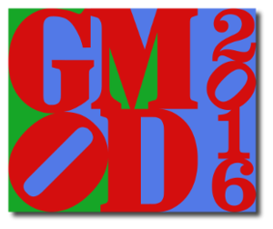

# Jun 2016 GMOD Meeting

From GMOD

Jump to: [navigation](#mw-navigation), [search](#p-search)

<table style="vertical-align: middle; border: 2px solid #A6A6BC;"
data-cellpadding="10">
<colgroup>
<col style="width: 50%" />
<col style="width: 50%" />
</colgroup>
<tbody>
<tr class="odd">
<td>

</td>
<td style="font-size: 170%; line-height: 120%"><strong>2016 GMOD
Meeting</strong> 
 
June 30 - July 1, 2016 
<a href="http://iu.edu/" class="external text" rel="nofollow">Indiana
University</a> 
Bloomington, Indiana, United States 
 
&#10;

 
 
<a href="https://twitter.com/search?q=%23GMOD2016" class="external text"
rel="nofollow">#GMOD2016</a>    <a
href="https://twitter.com/gmodproject" class="external text"
rel="nofollow">@gmodproject</a>

</td>
</tr>
</tbody>
</table>

  
GMOD will be holding a community meeting on June 30th and July 1st in
Bloomington, IN, immediately after the
<a href="https://gcc2016.iu.edu/" class="external text"
rel="nofollow">2016 Galaxy Community Conference (GCC2016)</a>. [GMOD
Meetings](Meetings "Meetings") are a mix of
[user](GMOD_Membership#Users "GMOD Membership") and
[developer](GMOD_Membership#Developers "GMOD Membership") presentations,
and are a great place to find out what is happening in the project,
what's coming up, and what others are doing.

  
Please register online at Eventbrite by June 20th 2016. **Early bird
registration ends May 21.**

For those who would like to present a talk or poster, the meeting
registration form includes a section for submitting the presentation
title and abstract.

If you have any suggestions or requests for the meeting, please contact
the
<a href="mailto:help@gmod.org" class="external text" rel="nofollow">GMOD
help desk</a>.

## Contents

- [1 About
  GMOD](#About_GMOD)
- [2
  Registration](#Registration)
- [3 Draft
  Agenda](#Draft_Agenda)
  - [3.1 Walnut
    room, Thursday, June 30](#Walnut_room.2C_Thursday.2C_June_30)
  - [3.2 Friday,
    July 1](#Friday.2C_July_1)
- [4 Agenda
  items](#Agenda_items)
- [5
  Logistics](#Logistics)
  - [5.1 Shared
    Rides](#Shared_Rides)

## About GMOD

**GMOD** is the Generic Model Organism Database project, a collection of
interoperable open-source [software
components](GMOD_Components "GMOD Components") for annotating,
visualizing, managing and analyzing biological data. GMOD is also an
active community of software developers and biologists addressing common
challenges with their data.

The GMOD suite includes widely used tools such as
[GBrowse](GBrowse.1 "GBrowse") and [JBrowse](JBrowse.1 "JBrowse") (and
[WebGBrowse](WebGBrowse.1 "WebGBrowse")) for genome browsing,
[Apollo](Apollo.1 "Apollo"), [Canto](Canto "Canto") and
[MAKER](MAKER.1 "MAKER") for genome annotation,
[GBrowse_syn](GBrowse_syn.1 "GBrowse syn") and [CMap](CMap.1 "CMap") for
comparative genomics visualization,
<a href="Chado" class="mw-redirect" title="Chado">Chado</a>,
[BioMart](BioMart "BioMart") and [InterMine](InterMine "InterMine") for
data integration, management, and querying, and
[Galaxy](Galaxy.1 "Galaxy") and
<a href="Ergatis" class="mw-redirect" title="Ergatis">Ergatis</a> (and
[ISGA](ISGA "ISGA")) for data analysis.

  

## Registration

Please register online at EventBrite. Early bird registration ends May
30th.

The registration fee includes lunch on June 30th.

## Draft Agenda

### Walnut room, Thursday, June 30

| Time | Topic | Presenter(s) | Presentation |
|----|----|----|----|
| 08:50 | Pre-meeting continental breakfast |  |  |
| 09:15 | Introductions |  |  |
| 09:40 | The State of GMOD | [Scott Cain](User:Scott "User:Scott") | <a href="../mediawiki/images/3/3e/GMOD2016_GMOD.pdf" class="internal"
title="GMOD2016 GMOD.pdf">Intro</a>, <a href="../mediawiki/images/3/34/GMOD2016_InterMine.pdf"
class="internal" title="GMOD2016 InterMine.pdf">InterMine</a>, <a
href="https://www.dropbox.com/s/7i39svwlegfr4rq/MAKER_GMOD_2016.pdf?dl=0"
class="external text" rel="nofollow">MAKER</a> |
| 10:10 | Introduction to uMOD | [Scott Cain](User:Scott "User:Scott") | <a href="../mediawiki/images/7/7e/GMOD2016_uMOD.pdf" class="internal"
title="GMOD2016 uMOD.pdf">Slides</a> |
| 10:35 | Coffee |  |  |
| 10:50 | GMOD in Action: The Legume Federation Project | Ethalinda Cannon | <a href="../mediawiki/images/2/24/LegFed_GMOD2016.pdf" class="internal"
title="LegFed GMOD2016.pdf">Slides</a> |
| 11:20 | [JBrowse](JBrowse.1 "JBrowse") Update | Eric Yao | <a
href="https://drive.google.com/a/berkeley.edu/file/d/0BzJAAJpIcu9hVFloS2R6ZUxhcUE/view?usp=sharing"
class="external text" rel="nofollow">Slides</a> |
| 11:50 | Lunch |  |  |
| 1:00 | [Apollo](Apollo.1 "Apollo"): Collaborative Manual Annotation in the GMOD Workflow | <a href="https://github.com/nathandunn" class="external text"
rel="nofollow">Nathan Dunn</a> | <a href="http://f1000research.com/slides/5-1389" class="external text"
rel="nofollow">Slides</a> |
| 1:30 | [Tripal](Tripal.1 "Tripal") Update | Lacey-Anne Sanderson |  |
| 2:30 | Coffee |  |  |
| 2:45 | [Galaxy](Galaxy.1 "Galaxy") Update | [Dave Clements](User:Clements "User:Clements"), <a href="https://github.com/bgruening" class="external text"
rel="nofollow">Bjöern Grüning</a> | [Slides](File:GMOD2016_Galaxy.pdf "File:GMOD2016 Galaxy.pdf") |
| 3:15 | EvidentialGene project at <a href="http://eugenes.org/EvidentialGene/" class="external free"
rel="nofollow">http://eugenes.org/EvidentialGene/</a> | Don Gilbert | <a
href="http://arthropods.eugenes.org/EvidentialGene/about/evigenegmod1606iu.pdf"
class="external text" rel="nofollow">Slides</a> |
| 3:45 | FlyBase Update and Chado discussion | [Josh Goodman](User:Jogoodma "User:Jogoodma") |  |

### Friday, July 1

| Time | Topic | Presenter(s) | Presentation |
|----|----|----|----|
| 08:50 | Pre-meeting continental breakfast |  |  |
| 09:15 | Tripal Expression module and search | Meg Staton | [Slides](File:GMOD_Staton.pdf "File:GMOD Staton.pdf") |
| 09:45 | Lightning talks, including Asela Dassanayake, Eric Rasche and Thoba Lose |  | <a href="../mediawiki/images/1/15/GMOD_Asela.pdf" class="internal"
title="GMOD Asela.pdf">Asela/LanzaTech</a> |
| 11:30 | Lunch (on your own) |  |  |
| 1:00 | Tripal workshop |  |  |

## Agenda items

More to be added as we confirm more speakers. If you are interested in
giving a talk please contact the
<a href="mailto:help@gmod.org" class="external text" rel="nofollow">GMOD
help desk</a>.

- GMOD project updates, including [Tripal](Tripal.1 "Tripal"),
  [Galaxy](Galaxy.1 "Galaxy"), [JBrowse](JBrowse.1 "JBrowse"),
  <a href="Chado" class="mw-redirect" title="Chado">Chado</a>,
  [MAKER](MAKER.1 "MAKER").
- Introduction to umod ([Scott Cain](User:Scott "User:Scott"))
- "Apollo: Collaborative Manual Annotation in the GMOD Workflow" (Nathan
  Dunn)
- Tripal update (Lacey Sanderson)
- Tripal Expression module and search (Ming Chen)
- EvidentialGene project at
  <a href="http://eugenes.org/EvidentialGene/" class="external free"
  rel="nofollow">http://eugenes.org/EvidentialGene/</a> ([Don
  Gilbert](User:Dongilbert "User:Dongilbert"))
- DictyBase on using and extending GMOD tools (Chado, JBrowse) and new
  infrastructure(docker and possibly kubernetes) (Siddhartha Basu)
- GMOD in Action: The Legume Federation Project (Ethalinda Cannon)
- [Tripal](Tripal.1 "Tripal") Workshop (Friday afternoon)

## Logistics

If you require lodging, we have partnered with the
<a href="https://gcc2016.iu.edu/" class="external text"
rel="nofollow">2016 Galaxy Community Conference</a>.

You DO NOT have to register for the GCC2016 conference to utilize
housing. Just check HOUSING ONLY when registering.

### Shared Rides

Please put your travel times <a
href="https://docs.google.com/spreadsheets/d/1sBD74e9DTldNshPgZzRNQspts1f9pASjMww105-m-5s/edit#gid=0#gid=0"
class="external text" rel="nofollow">here</a>.

  

"It's tempting to see bioinformatics as a collection of potential
problems. Being at a GMOD meeting helps us see bioinformatics as a
collection of potential solutions."

Isabelle Phan,
<a href="http://www.seattlebiomed.org" class="external text"
rel="nofollow">SBRI</a>, and past GMOD meeting participant

(Thanks to [Dave Clements](User:Clements "User:Clements") for the nice
logo)

Retrieved from
"<http://gmod.org/mediawiki/index.php?title=Jun_2016_GMOD_Meeting&oldid=27269>"

[Categories](Special:Categories "Special:Categories"):

- [Meetings](Category:Meetings "Category:Meetings")
- [GMOD Community](Category:GMOD_Community "Category:GMOD Community")

## Navigation menu

### Namespaces

- <a href="Jun_2016_GMOD_Meeting" accesskey="c"
  title="View the content page [c]">Page</a>
- <a
  href="http://gmod.org/mediawiki/index.php?title=Talk:Jun_2016_GMOD_Meeting&amp;action=edit&amp;redlink=1"
  accesskey="t"
  title="Discussion about the content page [t]">Discussion</a>

### 

### Variants

### Actions

### Search

### Navigation

- [GMOD Home](Main_Page)
- [Software](GMOD_Components)
- [Categories /
  Tags](Categories)
- [View all pages](Special:AllPages)

### Documentation

- [Overview](Overview)
- [FAQs](Category:FAQ)
- [HOWTOs](Category:HOWTO)
- [Glossary](Glossary)

### Community

- [GMOD News](GMOD_News)
- [Training /
  Outreach](Training_and_Outreach)
- [Support](Support)
- [GMOD Promotion](GMOD_Promotion)
- [Meetings](Meetings)
- [Calendar](Calendar)

### Tools

- <a href="Special:WhatLinksHere/Jun_2016_GMOD_Meeting" accesskey="j"
  title="A list of all wiki pages that link here [j]">What links here</a>
- <a href="Special:RecentChangesLinked/Jun_2016_GMOD_Meeting"
  accesskey="k"
  title="Recent changes in pages linked from this page [k]">Related
  changes</a>
- <a href="Special:SpecialPages" accesskey="q"
  title="A list of all special pages [q]">Special pages</a>
- <a
  href="http://gmod.org/mediawiki/index.php?title=Jun_2016_GMOD_Meeting&amp;printable=yes"
  rel="alternate" accesskey="p"
  title="Printable version of this page [p]">Printable version</a>
- [Permanent
  link](http://gmod.org/mediawiki/index.php?title=Jun_2016_GMOD_Meeting&oldid=27269 "Permanent link to this revision of the page")
- [Page
  information](http://gmod.org/mediawiki/index.php?title=Jun_2016_GMOD_Meeting&action=info)
- <a href="Special:Browse/Jun_2016_GMOD_Meeting" rel="smw-browse">Browse
  properties</a>
- [Print as
  PDF](http://gmod.org/mediawiki/index.php?title=Special:PdfPrint&page=Jun_2016_GMOD_Meeting)

- Last updated at 03:23 on 23 August
  2016.
- 210,779 page views.
- Content is available under
  <a href="http://www.gnu.org/licenses/fdl-1.3.html" class="external"
  rel="nofollow">a GNU Free Documentation License</a> unless otherwise
  noted.

<!-- -->

- [About
  GMOD](GMOD:About "GMOD:About")

<!-- -->

- 
- 
  

