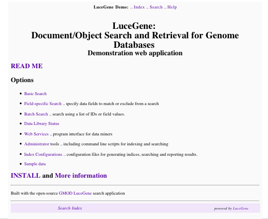
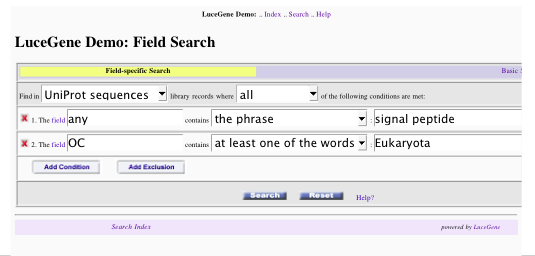
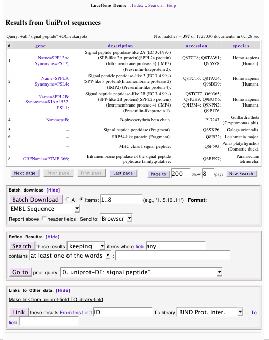
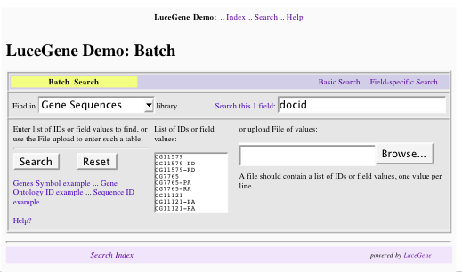
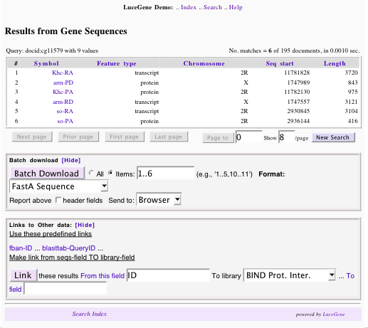
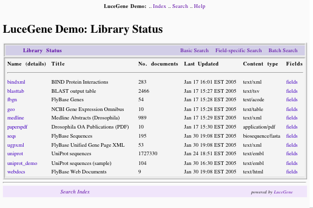

# LuceGene Screenshots

From GMOD

Jump to: [navigation](#mw-navigation), [search](#p-search)

## Contents

- [1
  Screenshots](#Screenshots)
  - [1.1
    Index](#Index)
  - [1.2 Basic
    Search: UniProt](#Basic_Search:_UniProt)
  - [1.3 Results:
    UniProt](#Results:_UniProt)
  - [1.4 Batch
    Search: Sequences](#Batch_Search:_Sequences)
  - [1.5 Results:
    Sequences](#Results:_Sequences)
  - [1.6 Data
    Library](#Data_Library)

## Screenshots

### Index

### Basic Search: UniProt

### Results: UniProt

### Batch Search: Sequences

### Results: Sequences

### Data Library

Retrieved from
"<http://gmod.org/mediawiki/index.php?title=LuceGene_Screenshots&oldid=4314>"

[Category](Special:Categories "Special:Categories"):

- [LuceGene](Category:LuceGene "Category:LuceGene")

## Navigation menu

### Namespaces

- <a href="LuceGene_Screenshots" accesskey="c"
  title="View the content page [c]">Page</a>
- <a
  href="http://gmod.org/mediawiki/index.php?title=Talk:LuceGene_Screenshots&amp;action=edit&amp;redlink=1"
  accesskey="t"
  title="Discussion about the content page [t]">Discussion</a>

### 

### Variants

### Navigation

- [GMOD Home](Main_Page)
- [Software](GMOD_Components)
- [Categories /
  Tags](Categories)
- [View all pages](Special:AllPages)

### Documentation

- [Overview](Overview)
- [FAQs](Category:FAQ)
- [HOWTOs](Category:HOWTO)
- [Glossary](Glossary)

### Community

- [GMOD News](GMOD_News)
- [Training /
  Outreach](Training_and_Outreach)
- [Support](Support)
- [GMOD Promotion](GMOD_Promotion)
- [Meetings](Meetings)
- [Calendar](Calendar)

### Tools

- <a href="Special:Browse/LuceGene_Screenshots" rel="smw-browse">Browse
  properties</a>

- Last updated at 04:53 on 28 January
  2008.
<!-- - 23,525 page views. -->
- Content is available under
  <a href="http://www.gnu.org/licenses/fdl-1.3.html" class="external"
  rel="nofollow">a GNU Free Documentation License</a> unless otherwise
  noted.

<!-- -->

- [About
  GMOD](GMOD:About "GMOD:About")

<!-- -->

- 

