<div id="mw-page-base" class="noprint">

</div>

<div id="mw-head-base" class="noprint">

</div>

<div id="content" class="mw-body" role="main">

<span id="top"></span>

<div id="mw-js-message" style="display:none;">

</div>


# <span dir="auto">MAKER Tutorial 2011</span>

<div id="bodyContent">

<div id="siteSub">

From GMOD

</div>

<div id="contentSub">

</div>

<div id="jump-to-nav" class="mw-jump">

Jump to: [navigation](#mw-navigation), [search](#p-search)

</div>

<div id="mw-content-text" class="mw-content-ltr" lang="en" dir="ltr">

This [MAKER](MAKER.1 "MAKER") tutorial was taught by [Barry
Moore](User:Bmoore "User:Bmoore") as part of the [2011 GMOD Spring
Training](2011_GMOD_Spring_Training "2011 GMOD Spring Training").

<div id="toc" class="toc">

<div id="toctitle">

## Contents

</div>

- [<span class="tocnumber">1</span> <span class="toctext">Maker
  Overview, Installation, and Basic Configuration for Annotating Genomic
  Sequence</span>](#Maker_Overview.2C_Installation.2C_and_Basic_Configuration_for_Annotating_Genomic_Sequence)
  - [<span class="tocnumber">1.1</span> <span class="toctext">About
    MAKER</span>](#About_MAKER)
  - [<span class="tocnumber">1.2</span>
    <span class="toctext">Introduction to Genome
    Annotation</span>](#Introduction_to_Genome_Annotation)
    - [<span class="tocnumber">1.2.1</span> <span class="toctext">What
      Are Annotations?</span>](#What_Are_Annotations.3F)
    - [<span class="tocnumber">1.2.2</span>
      <span class="toctext">Importance of Genome
      Annotations</span>](#Importance_of_Genome_Annotations)
    - [<span class="tocnumber">1.2.3</span> <span class="toctext">Effect
      of NextGen Sequencing on the Annotation
      Process</span>](#Effect_of_NextGen_Sequencing_on_the_Annotation_Process)
  - [<span class="tocnumber">1.3</span> <span class="toctext">MAKER
    Overview</span>](#MAKER_Overview)
    - [<span class="tocnumber">1.3.1</span> <span class="toctext">What
      does MAKER do?</span>](#What_does_MAKER_do.3F)
    - [<span class="tocnumber">1.3.2</span> <span class="toctext">What
      sets MAKER apart from tools (*ab initio* gene predictors
      etc.)?</span>](#What_sets_MAKER_apart_from_tools_.28ab_initio_gene_predictors_etc..29.3F)
    - [<span class="tocnumber">1.3.3</span>
      <span class="toctext">Emerging vs. Classic Model
      Genomes</span>](#Emerging_vs._Classic_Model_Genomes)
    - [<span class="tocnumber">1.3.4</span>
      <span class="toctext">Comparison of Algorithm Performance on Model
      vs. Emerging
      Genomes</span>](#Comparison_of_Algorithm_Performance_on_Model_vs._Emerging_Genomes)
  - [<span class="tocnumber">1.4</span>
    <span class="toctext">Installation</span>](#Installation)
    - [<span class="tocnumber">1.4.1</span>
      <span class="toctext">Prerequisites</span>](#Prerequisites)
    - [<span class="tocnumber">1.4.2</span> <span class="toctext">The
      MAKER Package</span>](#The_MAKER_Package)
  - [<span class="tocnumber">1.5</span> <span class="toctext">Getting
    Started with MAKER</span>](#Getting_Started_with_MAKER)
    - [<span class="tocnumber">1.5.1</span>
      <span class="toctext">Note</span>](#Note)
    - [<span class="tocnumber">1.5.2</span>
      <span class="toctext">RUNNING MAKER WITH EXAMPLE
      DATA</span>](#RUNNING_MAKER_WITH_EXAMPLE_DATA)
  - [<span class="tocnumber">1.6</span> <span class="toctext">Details of
    What is Going on Inside of
    MAKER</span>](#Details_of_What_is_Going_on_Inside_of_MAKER)
    - [<span class="tocnumber">1.6.1</span> <span class="toctext">Repeat
      Masking</span>](#Repeat_Masking)
    - [<span class="tocnumber">1.6.2</span> <span class="toctext">*Ab
      Initio* Gene Prediction</span>](#Ab_Initio_Gene_Prediction)
    - [<span class="tocnumber">1.6.3</span> <span class="toctext">EST
      and Protein Evidence
      Alignment</span>](#EST_and_Protein_Evidence_Alignment)
    - [<span class="tocnumber">1.6.4</span>
      <span class="toctext">Polishing Evidence
      Alignments</span>](#Polishing_Evidence_Alignments)
    - [<span class="tocnumber">1.6.5</span>
      <span class="toctext">Integrating Evidence to Synthesize
      Annotations</span>](#Integrating_Evidence_to_Synthesize_Annotations)
    - [<span class="tocnumber">1.6.6</span>
      <span class="toctext">Selecting and Revising the Final Gene
      Model</span>](#Selecting_and_Revising_the_Final_Gene_Model)
    - [<span class="tocnumber">1.6.7</span>
      <span class="toctext">Quality Control</span>](#Quality_Control)
  - [<span class="tocnumber">1.7</span> <span class="toctext">MAKER's
    Output</span>](#MAKER.27s_Output)
  - [<span class="tocnumber">1.8</span> <span class="toctext">Viewing
    MAKER Annotations</span>](#Viewing_MAKER_Annotations)
    - [<span class="tocnumber">1.8.1</span>
      <span class="toctext">Apollo</span>](#Apollo)
- [<span class="tocnumber">2</span> <span class="toctext">Advanced MAKER
  Configuration, Re-annotation Options, and Improving Annotation
  Quality</span>](#Advanced_MAKER_Configuration.2C_Re-annotation_Options.2C_and_Improving_Annotation_Quality)
  - [<span class="tocnumber">2.1</span>
    <span class="toctext">Configuration Files in
    Detail</span>](#Configuration_Files_in_Detail)
    - [<span class="tocnumber">2.1.1</span> <span class="toctext">Basic
      Input Files</span>](#Basic_Input_Files)
    - [<span class="tocnumber">2.1.2</span> <span class="toctext">Repeat
      Masking Options</span>](#Repeat_Masking_Options)
    - [<span class="tocnumber">2.1.3</span> <span class="toctext">Gene
      Prediction Options</span>](#Gene_Prediction_Options)
    - [<span class="tocnumber">2.1.4</span> <span class="toctext">Other
      MAKER Options</span>](#Other_MAKER_Options)
  - [<span class="tocnumber">2.2</span> <span class="toctext">Training
    *ab initio* Gene
    Predictors</span>](#Training_ab_initio_Gene_Predictors)
  - [<span class="tocnumber">2.3</span> <span class="toctext">MAKER Web
    Annotation Service</span>](#MAKER_Web_Annotation_Service)
  - [<span class="tocnumber">2.4</span>
    <span class="toctext">mRNAseq</span>](#mRNAseq)
  - [<span class="tocnumber">2.5</span>
    <span class="toctext">Merge/Resolve Legacy
    Annotations</span>](#Merge.2FResolve_Legacy_Annotations)
  - [<span class="tocnumber">2.6</span> <span class="toctext">MPI
    Support</span>](#MPI_Support)
  - [<span class="tocnumber">2.7</span> <span class="toctext">User
    Interface for Local MAKER
    Installation</span>](#User_Interface_for_Local_MAKER_Installation)
  - [<span class="tocnumber">2.8</span> <span class="toctext">MAKER
    Accessory Scripts</span>](#MAKER_Accessory_Scripts)

</div>

# <span id="Maker_Overview.2C_Installation.2C_and_Basic_Configuration_for_Annotating_Genomic_Sequence" class="mw-headline">Maker Overview, Installation, and Basic Configuration for Annotating Genomic Sequence</span>

The first half of this page describes the basics of
[MAKER](MAKER.1 "MAKER") - the easy-to-use genome annotation pipeline.

## <span id="About_MAKER" class="mw-headline">About MAKER</span>

MAKER is an easy-to-use genome annotation pipeline designed to be usable
by small research groups with little bioinformatics experience; however,
MAKER is also designed to be scalable and is appropriate for projects of
any size including use by large sequence centers. MAKER can be used for
*de novo* annotation of newly sequenced genomes, for updating existing
annotations to reflect new evidence, or just to combine annotations,
evidence, and quality control statistics for use in other GMOD programs
like [GBrowse](GBrowse.1 "GBrowse"), [JBrowse](JBrowse.1 "JBrowse"),
<a href="Chado" class="mw-redirect" title="Chado">Chado</a>, and
[Apollo](Apollo.1 "Apollo").

MAKER has been used in many genome annotation projects:

- The Pine genome project (A. Stambolia-Kovach, UCD). Now published.
- The Lamprey genome project (W. Li, MSU). Manuscript in preparation.
- The *Fusarium circinatum* (pine pitch canker) genome project (B.
  Wingfield, U of Pretoria). Manuscript submitted.
- Leaf-cutter Ant genome (C. Currie, U of Wis., Madison) Now published.
- Argentine Ant genome (CD. Smith, San Francisco State).
- Red Harvester Ant. Now published.
- Several parasitic nematode genomes (M. Mitreva, WASHU). Some now
  published.
- The *Conus bullatus* genome project (B. Olivera U of Utah).
  Preliminary results published.
- The *Pythium ultimum* genome project (R. Buell, MSU). Published.
- *Cardiocondyla obscurior* (ant) genome project (J. Gadau, Az. State
  University)
- Corn rootworm beetle genome project (H. Robertson, Univ. of Illinois)
- Rice re-annotation (R. Buell, MSU).
- *Arabidopsis* re-annotation (E. Huala, TAIR)
- Maize re-annotation (C. Lawrence, MaizeGDP)
- Wheat stem sawfly project (H. Robertson, Univ. of Illinois)
- Apple maggot fly (H. Robertson, Univ. of Illinois)
- Pigeon genome (M. Shapiro, Univ. of Utah)
- The fungus *Cronartium quercuum* (J. M. Davis, University of Florida)

## <span id="Introduction_to_Genome_Annotation" class="mw-headline">Introduction to Genome Annotation</span>

### <span id="What_Are_Annotations.3F" class="mw-headline">What Are Annotations?</span>

Annotations are descriptions of different features of the genome, and
they can be structural or functional in nature.

Examples:

- Structural Annotations: exons, introns, UTRs, splice forms
  etc.<a href="File:Structural.png" class="image">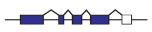</a>
- Functional Annotations: process a gene is involved in (metabolism),
  molecular function (hydrolase), location of expression (expressed in
  the mitochondria), etc.

  
It is especially important that all genome annotations include with
themselves an evidence trail that describes in detail the evidence that
was used to both suggest and support each annotation. This assists in
quality control and downstream management of genome annotations.

Examples of evidence supporting a structural annotation:

- *Ab initio* gene predictions
- ESTs
- Protein homology

### <span id="Importance_of_Genome_Annotations" class="mw-headline">Importance of Genome Annotations</span>

Why should the average biologist care about genome annotations?

<div class="thumb tnone">

<div class="thumbinner" style="width:562px;">

<a href="File:Process.png" class="image">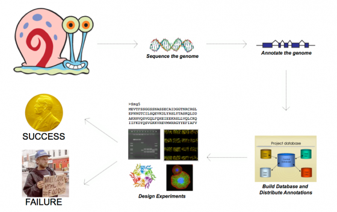</a>

<div class="thumbcaption">

<div class="magnify">

<a href="File:Process.png" class="internal" title="Enlarge"></a>

</div>

**Figure:** Genome project from sequencing to experimental application
of annotations

</div>

</div>

</div>

  
Genome sequence itself is not very useful. The first question that
occurs to most of us when a genome is sequenced is, "where are the
genes?" To identify the genes we need to annotate the genome. And while
most researchers probably don't give annotations a lot of thought, they
use them everyday.

  
Examples of Annotation Databases:

- <a href="http://uswest.ensembl.org/index.html" class="external text"
  rel="nofollow">Ensembl</a>
- <a href="http://www.ncbi.nlm.nih.gov/RefSeq/" class="external text"
  rel="nofollow">RefSeq</a>
- <a href="http://flybase.org" class="external text"
  rel="nofollow">FlyBase</a>
- <a href="http://wormbase.org" class="external text"
  rel="nofollow">WormBase</a>
- <a href="http://www.informatics.jax.org/" class="external text"
  rel="nofollow">Mouse Genome Informatics Group</a>

  
Every time we use techniques such as RNAi, PCR, gene expression arrays,
targeted gene knockout, or ChIP we are basing our experiments on the
information derived from a digitally stored genome annotation. If an
annotation is correct, then these experiments should succeed; however,
if an annotation is incorrect then the experiments that are based on
that annotation are bound to fail. Which brings up a major point:

- **Incorrect and incomplete genome annotations poison every experiment
  that uses them.**

Quality control and evidence management are therefore essential
components to any annotation process.

### <span id="Effect_of_NextGen_Sequencing_on_the_Annotation_Process" class="mw-headline">Effect of [NextGen Sequencing](Next_Generation_Sequencing "Next Generation Sequencing") on the Annotation Process</span>

It’s generally accepted that within the next few years it will be
possible to sequence even human sized genomes for as little as \$1,000
and in a short time frame. Pacific Biosciences is claiming they will be
able to sequence a human sized genome in <a
href="http://www.pacificbiosciences.com/assets/files/1-23439884-eprint.pdf"
class="external text" rel="nofollow">fifteen minutes by 2013</a>. If the
hype is to be believed, then whole genome sequencing will become
"routine" for even small labs in the not so distant future.
Unfortunately, however, advances in annotation technology have not kept
pace with genome sequencing, and annotation is rapidly becoming a major
bottleneck affecting modern genomics research.

For example:

- As of March 2011, 2002 eukaryote and 5811 prokaryote genome projects
  were underway.
- If we assume 10,000 genes per genome, that’s over 200,000,000 new
  annotations (with this many new annotations, quality control and
  maintenance become an issue).
- While there are organizations dedicated to producing and distributing
  genome annotations (i.e ENSEMBL and VectorBase), the shear volume of
  newly sequenced genomes exceeds both their capacity and stated
  purview.
- Small research groups are affected disproportionately by the
  difficulties related to genome annotation, primarily because they
  often lack bioinformatics experience and must confront the
  difficulties associated with genome annotation on their own.

  
MAKER is an easy-to-use annotation pipeline designed to help smaller
research groups convert the coming tsunami of genomic data provided by
next generation sequencing technologies into a usable resource.

## <span id="MAKER_Overview" class="mw-headline">MAKER Overview</span>

<a href="File:MAKERLogo.png" class="image"></a>

<a href="http://www.cafepress.com/dd/31169546" class="external text"
rel="nofollow">Get MAKER Bling!</a>

The easy-to-use annotation pipeline.

|  |  |
|----|----|
| User Requirements: | Can be run by a single individual with little bioinformatics experience |
| System Requirements: | Can run on laptop or desktop computers running Linux or Mac OS X (also cluster compatible) |
| Program Output: | Output is compatible with popular GMOD annotation tools like [Apollo](Apollo.1 "Apollo"), [GBrowse](GBrowse.1 "GBrowse") [JBrowse](JBrowse.1 "JBrowse") |
| Availability: | Free open source application (for academic use) |

  

### <span id="What_does_MAKER_do.3F" class="mw-headline">What does MAKER do?</span>

- Identifies and masks out repeat elements
- Aligns ESTs to the genome
- Aligns proteins to the genome
- Produces *ab initio* gene predictions
- Synthesizes these data into final annotations
- Produces evidence-based quality values for downstream annotation
  management

  

<div class="thumb tnone">

<div class="thumbinner" style="width:182px;">

<a href="File:MAKER_Apollo_view.jpg" class="image">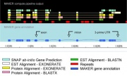</a>

<div class="thumbcaption">

<div class="magnify">

<a href="File:MAKER_Apollo_view.jpg" class="internal"
title="Enlarge"></a>

</div>

MAKER-generated annotations, shown in [Apollo](Apollo.1 "Apollo")

</div>

</div>

</div>

### <span id="What_sets_MAKER_apart_from_tools_.28ab_initio_gene_predictors_etc..29.3F" class="mw-headline">What sets MAKER apart from tools (*ab initio* gene predictors etc.)?</span>

MAKER is an annotation pipeline, not a gene predictor. MAKER does not
predict genes, rather MAKER leverages existing software tools (some of
which are gene predictors) and integrates their output to produce what
MAKER believes to be the best possible gene model for a given location
based on evidence alignments.

  

<div class="thumb tnone">

<div class="thumbinner" style="width:562px;">

<a href="File:Comparison.png" class="image">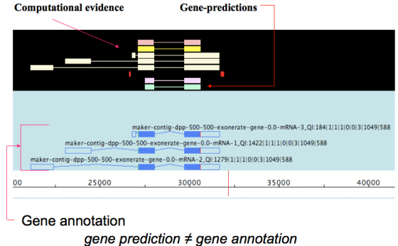</a>

<div class="thumbcaption">

<div class="magnify">

<a href="File:Comparison.png" class="internal" title="Enlarge"></a>

</div>

</div>

</div>

</div>

gene prediction ≠ gene annotation

- gene predictions are partial gene models.
- gene annotations are gene models but should include a documented
  evidence trail supporting the model in addition to quality control
  metrics.

  
This may seem like just a matter of semantics since the primary output
for both *ab initio* gene predictors and the MAKER pipeline is the same,
a collection of gene models. However there are a few very significant
consequences to the differences between these programs that I will
explain shortly.

### <span id="Emerging_vs._Classic_Model_Genomes" class="mw-headline">Emerging vs. Classic Model Genomes</span>

Emerging model organism genomes each come with there own set of issues
that are not necessarily found in classic model genomes. These include
difficulties associated with Repeat identification, gene finder
training, and other complex analyses. Unfortunately emerging model
organisms are often studied by very small research communities which
often lack the resources and bioinformatics experience necessary to
tackle these issues.

<table class="wikitable">
<colgroup>
<col style="width: 50%" />
<col style="width: 50%" />
</colgroup>
<thead>
<tr class="header">
<th>Classic Model Organisms</th>
<th>Emerging Model Organisms</th>
</tr>
</thead>
<tbody>
<tr class="odd">
<td data-valign="top"><p>Well developed experimental systems</p></td>
<td><p>New experimental systems</p>
<ul>
<li>Genome will be the central resource for work in these systems</li>
</ul></td>
</tr>
<tr class="even">
<td data-valign="top"><p>Much prior knowledge about genome</p></td>
<td><p>Little prior knowledge about genome</p>
<ul>
<li>Usually no genetics</li>
</ul></td>
</tr>
<tr class="odd">
<td>Large community</td>
<td>Small communities</td>
</tr>
<tr class="even">
<td>Big $</td>
<td>Less $</td>
</tr>
<tr class="odd">
<td>Examples: <em>D. melanogaster, C. elegans</em>, human, etc.</td>
<td>Examples: oomycetes, flat worms, cone snail, etc.</td>
</tr>
</tbody>
</table>

### <span id="Comparison_of_Algorithm_Performance_on_Model_vs._Emerging_Genomes" class="mw-headline">Comparison of Algorithm Performance on Model vs. Emerging Genomes</span>

If you have ever looked at comparisons of gene predictor performance on
classic model organisms such as *C. elegans* you would conclude that *ab
initio* gene predictors match or even outperform state of the art
annotation pipelines, and the truth is that, with enough training data,
they do. However, it is important to keep in mind that *ab initio* gene
predictors have been specifically optimized to perform well on model
organisms such as *Drosophila* and *C. elegans*, organisms for which we
have large amount of pre-existing data to both train and tweak the
prediction parameters.

<div class="thumb tnone">

<div class="thumbinner" style="width:562px;">

<a href="File:MAKER_RIP_figure.png" class="image">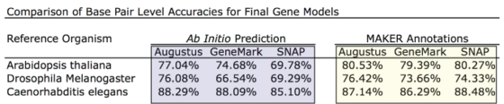</a>

<div class="thumbcaption">

<div class="magnify">

<a href="File:MAKER_RIP_figure.png" class="internal"
title="Enlarge"></a>

</div>

**Figure:** Comparison of Base-Level Accuracies For Final Gene Models

</div>

</div>

</div>

  
What about emerging model organisms for which little data is available?
Gene prediction in classic model organisms is relatively simple because
there are already a large number of experimentally determined and
verified gene models, but with emerging model organisms, we are lucky to
have a handful of gene models to train with. As a result *ab initio*
gene predictors generally perform very poorly on emerging genomes.

<div class="thumb tnone">

<div class="thumbinner" style="width:562px;">

<a href="File:Maker_performance.jpg" class="image">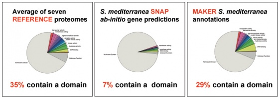</a>

<div class="thumbcaption">

<div class="magnify">

<a href="File:Maker_performance.jpg" class="internal"
title="Enlarge"></a>

</div>

**Figure:** MAKER's Performance on the *S. mediterranea* Emerging Model
Organism Genome. Pfam domain content of gene models determined using
rpsblast

</div>

</div>

</div>

By using *ab inito* gene predictors inside of the MAKER pipeline instead
of as stand alone applications you get certain benefits:

- Provide gene models as well as an evidence trail correlations for
  quality control and manual curation
- Provide a mechanism to train and retrain *ab initio* gene predictors
  for even better performance.
- Output can be easily loaded into a GMOD compatible database for
  annotation distribution (including evidence associations).
- Annotations can be automatically updated with new evidence by simply
  passing existing annotation sets back into the pipeline

## <span id="Installation" class="mw-headline">Installation</span>

### <span id="Prerequisites" class="mw-headline">Prerequisites</span>

Perl Modules

- <a href="http://search.cpan.org/perldoc?DBI" class="external text"
  rel="nofollow">DBI</a>
- <a href="http://search.cpan.org/perldoc?DBD::SQLite"
  class="external text" rel="nofollow">DBD::SQLite</a>
- <a href="http://search.cpan.org/perldoc?Proc::ProcessTable"
  class="external text" rel="nofollow">Proc::ProcessTable</a>
- <a href="http://search.cpan.org/perldoc?threads" class="external text"
  rel="nofollow">threads</a> (Optional, for MPI scripts)
- <a href="http://search.cpan.org/perldoc?IO::All" class="external text"
  rel="nofollow">IO::All</a> (Optional, for accessory scripts)
- <a href="http://search.cpan.org/perldoc?IO::Prompt"
  class="external text" rel="nofollow">IO::Prompt</a> (Optional, for
  accessory scripts)

  
External Programs

- <a href="http://www.perl.org/" class="external text"
  rel="nofollow">Perl</a> 5.8.0 or Higher
- <a href="http://www.bioperl.org/" class="external text"
  rel="nofollow">BioPerl</a> 1.6 or higher
- <a href="http://homepage.mac.com/iankorf/" class="external text"
  rel="nofollow">SNAP</a> version 2009-02-03 or higher
- <a href="http://www.repeatmasker.org/" class="external text"
  rel="nofollow">RepeatMasker</a> 3.1.6 or higher
- <a href="http://www.ebi.ac.uk/~guy/exonerate/" class="external text"
  rel="nofollow">Exonerate</a> 1.4 or higher

  
You must also install one of the following:

- <a href="http://blast.wustl.edu/" class="external text"
  rel="nofollow">WU-BLAST</a> 2.0 or higher (Now
  <a href="http://www.advbiocomp.com/" class="external text"
  rel="nofollow">AB-BLAST</a>)
- <a href="http://www.ncbi.nlm.nih.gov/Ftp/" class="external text"
  rel="nofollow">NCBI BLAST</a> 2.2.X or higher

  
Optional Components:

- <a href="http://augustus.gobics.de/" class="external text"
  rel="nofollow">Augustus</a> 2.0 or higher
- <a href="http://exon.biology.gatech.edu/" class="external text"
  rel="nofollow">GeneMark-ES</a> 2.3a or higher
- <a href="http://www.softberry.com/" class="external text"
  rel="nofollow">FGENESH</a> 2.6 or higher

  
Required for optional MPI support:

- <a href="http://www.mcs.anl.gov/research/projects/mpich2/"
  class="external text" rel="nofollow">MPICH2</a>

(Working on Amazon EC2 support. Can also start MAKER multiple times and
get parallelization without MPI. Subsequent MAKER instances will detect
already running instances and integrate seamlessly.)

### <span id="The_MAKER_Package" class="mw-headline">The MAKER Package</span>

Because of the number of prerequisites, we will not cover the details of
installing these other programs; they have already been installed for
you. But even though I did pre-install most programs for you, I'm still
going to have you perform basic post installation configurations, so
lets get started.

<div class="attn">

MAKER can be downloaded from:

- <a href="http://www.yandell-lab.org/" class="external free"
  rel="nofollow">http://www.yandell-lab.org/</a> - but it should already
  be on the image

</div>

To keep everyone from hitting the server at once though, I have already
placed MAKER in the `~/Documents/Software/maker/` directory. This is a
<a href="SVN" class="mw-redirect" title="SVN">subversion</a> repository
of MAKER, so lets make sure it is updated to the latest version, and
then look at the packages contents.

<div class="dont">

    #Don't do this today
    cd Documents/Software/maker/
    svn update
    ls -1

</div>

Note: That is a *dash one*, not a *dash el*, on the `ls` command.

You should now see the following:

    GMOD
    INSTALL
    LICENSE
    MWAS
    README
    data
    lib
    src

There are two files in particular that you would want to look at when
installing MAKER - `INSTALL` and `README`. `INSTALL` gives a brief
overview of MAKER and prerequisite installation. Lets take a look at
this.

    less INSTALL

You shouldn't need to do this if MAKER is pre-installed or if MAKER
installed all the prerequisites. But for the sake of documentation...

    ***Installation Documentation***
     
    How to Install Standard MAKER
     
    EASY INSTALL
     
    1.  Go to the .../maker/src/ directory and run 'perl Build.PL' to configure
        the install and then './Build install' to complete the installation.
     
    5.  If anything fails, either use the ./Build file commands to retry the
        failed section or follow the detailed install instructions below to
        manually install missing modules or programs.
     
     
    See the README file for details on installing mpi_maker

<div class="dont">

According to the documentation we need to add a few entries to your user
profile. So lets open it in a [text
editor](Linux_Text_Editors "Linux Text Editors").

    gedit ~/.profile

<div style="font-size: 80%; margin-top: -0.75em; margin-left: 1em">

[A word on text editors such as
gedit](Linux_Text_Editors "Linux Text Editors").

</div>

Add the following to your user profile (optional with the latest MAKER
versions).

For bash:

``` enter
 PATH=/home/gmod/Documents/Software/maker/bin:$PATH
 PATH=/usr/local/ncbi-blast/bin:$PATH
 PATH=/usr/local/exonerate/bin:$PATH
 PATH=/usr/local/augustus/bin:$PATH
 PATH=/usr/local/snap:$PATH
 PATH=/usr/local/gm_es:$PATH
 PATH=/usr/local/RepeatMasker:$PATH
 export PATH
  
 export ZOE=/usr/local/snap
 export AUGUSTUS_CONFIG_PATH=/usr/local/augustus/config
```

Now reload your profile to make the changes take hold.

    source ~/.profile

</div>

MAKER should now be installed. Let's test the executable. We should see
the usage statement.

    maker -help

    Usage:

        maker [options] <maker_opts> <maker_bopts> <maker_exe>

        Maker is a program that produces gene annotations in GFF3 file format using
        evidence such as EST alignments and protein homology.  Maker can be used to
        produce gene annotations for new genomes as well as update annoations from
        existing genome databases.

        The three input arguments are user control files that specify how maker
        should behave. All options for maker should be set in the control files,
        but a few can also be set on the command line. Command line options provide
        a convenient machanism to override commonly altered control file values.

        Input files listed in the control options files must be in fasta format.
        unless otherwise specified. Please see maker documentation to learn more
        about control file  configuration.  Maker will automatically try and locate
        the user control files in the current working directory if these arguments
        are not supplied when initializing maker.

        It is important to note that maker does not try and recalculated data that
        it has already calculated.  For example, if you run an analysis twice on
        the same dataset file you will notice that maker does not rerun any of the
        blast analyses, but instead uses the blast analyses stored from the
        previous run.  To force maker to rerun all analyses, use the -f flag.


    Options:

        -genome|g <filename> Specify the genome file.

        -RM_off|R           Turns all repeat masking off.

        -datastore/         Forcably turn on/off MAKER's use of a two deep datastore
         nodatastore        directory structure for output.  By default this option
                            turns on whenever there are more the 1,000 contigs in
                            the input genome fasta file.

        -base    <string>   Set the base name MAKER uses to save output files.
                            MAKER uses the input genome file name by default.

        -retry|r <integer>  Rerun failed contigs up to the specified count.

        -cpus|c  <integer>  Tells how many cpus to use for BLAST analysis.

        -force|f            Forces maker to delete old files before running again.
                            This will require all blast analyses to be re-run.

        -again|a            Caculate all annotations and output files again even if
                            no settings have changed. Does not delete old analyses.

        -evaluate|e         Run Evaluator on final annotations (under development).

        -fast               Causes MAKER to skip most clustering and analysis.
                            A quick way to align evidence.  You then must re-run
                            MAKER to produce full GFF3 output and annotations.

        -quiet|q            Silences most of maker's status messages.

        -qq                 Really quit. Silences everything but major errors.

        -CTL                Generate empty control files in the current directory.

        -help|?             Prints this usage statement.

## <span id="Getting_Started_with_MAKER" class="mw-headline">Getting Started with MAKER</span>

### <span id="Note" class="mw-headline">Note</span>

Before we begin with any examples. I want everyone to note that all
finished examples are located in `~/Documents/Data/maker`, so if you
fall behind you can always find MAKER control files datasets and final
results in there.

Let's just quickly take a look

``` enter
 cd ~/Documents/Data/maker
 ls -1
```

You should see five example folders

``` enter
 example1_dmel
 example2_pyu
 example3_mRNAseq
 example4_legacy
 example5_ecoli
```

Let's look inside example1

    ls -1 example1_dmel

  
You will see a directory called `finished.maker.output` which contains
all the final results for the example. Each of the other examples will
contain a similar directory.

    finished.maker.output

  
Now let's get started!

### <span id="RUNNING_MAKER_WITH_EXAMPLE_DATA" class="mw-headline">RUNNING MAKER WITH EXAMPLE DATA</span>

MAKER comes with some example input files to test the installation and
to familiarize the user with how to run MAKER. The example files are
found in the `maker/data` directory.

    ls -1 /home/gmod/Documents/Software/maker/data
    dpp_contig.fasta
    dpp_proteins.fasta
    dpp_est.fasta
    te_protein.fasta

  
The example files are in [FASTA](Glossary#FASTA "Glossary") format.
MAKER requires FASTA format for it's input files. Let's take a look at
one of theses files to see what the format looks like.

    cat /home/gmod/Documents/Software/maker/data/dpp_proteins.fasta
    >dpp-CDS-5
    MRAWLLLLAVLATFQTIVRVASTEDISQRFIAAIAPVAAHIPLASASGSGSGRSGSRSVG
    ASTSTALAKAFNPFSEPASFSDSDKSHRSKTNKKPSKSDANRQFNEVHKPRTDQLENSKN
    KSKQLVNKPNHNKMAVKEQRSHHKKSHHHRSHQPKQASASTESHQSSSIESIFVEEPTLV
    LDREVASINVPANAKAIIAEQGPSTYSKEALIKDKLKPDPSTLVEIEKSLLSLFNMKRPP
    KIDRSKIIIPEPMKKLYAEIMGHELDSVNIPKPGLLTKSANTVRSFTHKDSKIDDRFPHH
    HRFRLHFDVKSIPADEKLKAAELQLTRDALSQQVVASRSSANRTRYQVLVYDITRVGVRG
    QREPSYLLLDTKTVRLNSTDTVSLDVQPAVDRWLASPQRNYGLLVEVRTVRSLKPAPHHH
    VRLRRSADEAHERWQHKQPLLFTYTDDGRHKARSIRDVSGGEGGGKGGRNKRQPRRPTRR
    KNHDDTCRRHSLYVDFSDVGWDDWIVAPLGYDAYYCHGKCPFPLADHFNSTNHAVVQTLV
    NNMNPGKVPKACCVPTQLDSVAMLYLNDQSTVVLKNYQEMTVVGCGCR

FASTA format is fairly simple. It contains a definition line starting
with '\>' that contains a name for a sequence followed by the actual
sequence in nucleotide or amino acid format. The file we are looking at
contains protein sequences, so the sequence uses the single letter code
for amino acids. A minimal input file set for MAKER would generally
consist of a FASTA file for the genomic sequence, a FASTA file of ESTs
derived from the transcriptome, and a FASTA file of protein sequences
from the same or related organisms. I'll describe in more detail exactly
what MAKER does with each data file shortly.

  
Now we are going to copy the example files to the `example1_dmel`
directory we looked at earlier before running MAKER.

``` enter
 cd /home/gmod/Documents/Data/maker/example1_dmel
 cp /home/gmod/Documents/Software/maker/data/dpp* .
```

Next we need to tell MAKER all the details about how we want the
annotation process to proceed. Because there can be many variables and
options involved in annotation, command line options would be too
numerous and cumbersome. Instead MAKER uses a set of configuration files
which guide each run. You can create a set of generic configuration
files in the current working directory by typing the following.

    maker -CTL

  
This creates three files (type `ls -l` to see).

- `maker_exe.ctl` - contains the path information for needed
  executables.
- `maker_bopt.ctl` - contains filtering statistics for BLAST and
  Exonerate
- `maker_opt.ctl` - contains all other information for MAKER, including
  the location of the input genome file.

  
Control files are run-specific and a separate set of control files will
need to be generated for each genome annotated with MAKER. MAKER will
look for control files in the current working directory, so it is
recommended that MAKER be run in a separate directory containing unique
control files for each genome.

Let's take a look at the `maker_exe.ctl` file.

    gedit maker_exe.ctl

<div style="font-size: 80%; margin-top: -0.75em; margin-left: 1em">

[A word on text editors such as
gedit](Linux_Text_Editors "Linux Text Editors").

</div>

You will see the names of a number of MAKER supported executables as
well as the path to their location. If you followed the installation
instructions correctly, including the instructions for installing
prerequisite programs, all executable paths should show up automatically
for you. However if the location to any of the executables is not set in
your PATH environment variable, as per installation instructions, you
will have to add these manually to the `maker_exe.ctl` file every time
you run MAKER.

Lines in the MAKER control files have the format `key=value` with no
spaces before or after the equals sign(=). If the value is a file name,
you can use relative paths and environment variables, i.e.
`snap=$HOME/snap`. Note that for all control files the comments written
to help users begin with a pound sign(#). In addition, options before
the equals sign(=) can not be changed, nor should there be a space
before or after the equals sign.

Now let's take a look at the `maker_bopts.ctl` file.

    gedit maker_bopts.ctl

<div style="font-size: 80%; margin-top: -0.75em; margin-left: 1em">

[A word on text editors such as
gedit](Linux_Text_Editors "Linux Text Editors").

</div>

In this file you will find values you can edit for downstream filtering
of BLAST and Exonerate alignments. At the very top of the file you will
see that I have the option to tell MAKER whether I prefer to use
WU-BLAST or NCBI-BLAST. We want to set this to NCBI-BLAST, since that is
what is installed. We can just leave the remaining values as the
default.

    blast_type=ncbi+

Now let's take a look at the `maker_opts.ctl` file.

    gedit maker_opts.ctl

<div style="font-size: 80%; margin-top: -0.75em; margin-left: 1em">

[A word on text editors such as
gedit](Linux_Text_Editors "Linux Text Editors").

</div>

This is the primary configuration file for MAKER specific options. Here
we need to set the location of the genome, EST, and protein input files
we will be using. These come from the supplied example files. We also
need to set repeat masking options, as well as a number of other
configurations. We'll discuss these options in more detail later on, but
for now just adjust the following values.

``` enter
 genome=dpp_contig.fasta
 est=dpp_est.fasta
 protein=dpp_protein.fasta
 est2genome=1
```

*Note: Do not put spaces on either side of the `=` on the above control
file lines.*

Now let's run MAKER.

    maker

  
You should now see a large amount of status information flowing past
your screen. If you don't want to see this you can run MAKER with the
`-q` option for "quiet" on future runs.

## <span id="Details_of_What_is_Going_on_Inside_of_MAKER" class="mw-headline">Details of What is Going on Inside of MAKER</span>

### <span id="Repeat_Masking" class="mw-headline">Repeat Masking</span>

The first step in the MAKER pipeline is repeat masking. Why do we need
to do this? Repetitive elements can make up a significant portion of the
genome. Some of these repeats are simple/low-complexity repeats where
you have runs of C's or G's or maybe dinucleotide repeats. Other repeats
are more complex, i.e. transposable elements. These high-complexity
repeats often encode real proteins like retrotranscriptase or the viral
Gag, Pol, and Env proteins. Because they encode real proteins, they can
play havoc with *ab initio* gene predictors. For example, a transposable
element that occurs next to or even within the intron of a real protein
encoding gene might cause a gene predictor to include extra exons as
part of a gene model, sequence which really only belongs to the
transposable element and not to the coding sequence of the gene. You
will also get hundreds of instances where identical transportable
element proteins get annotated as part of an organisms proteome. In
addition to these issues, low-complexity repeat regions can align with
high statistical significance to low-complexity protein regions creating
a false sense of homology throughout the genome. To avoid these
complications it is convenient to identify and mask any repeat elements
before doing other analyses.

<div class="thumb tnone">

<div class="thumbinner" style="width:562px;">

<a href="File:Repeatmask.jpg" class="image">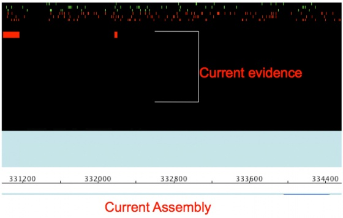</a>

<div class="thumbcaption">

<div class="magnify">

<a href="File:Repeatmask.jpg" class="internal" title="Enlarge"></a>

</div>

Identify and mask repetitive elements

</div>

</div>

</div>

MAKER identifies repeats in two steps.

- First a program called RepeatMasker is used to identify low-complexity
  and high-complexity repeats that match entries in the RepBase repeat
  library, or any species specific repeat library supplied by the user.
- Next MAKER uses RepeatRunner to identify transposable element and
  viral proteins from the RepeatRunner protein database. Because protein
  sequence diverges at a slower rate than nucleotide sequence, this step
  helps pick up the most problematic regions of divergent repeats that
  are missed by RepeatMasker, which searches in nucleotide space.

  
Regions identified during repeat analysis are masked out so as not to
complicate other downstream annotation analyses.

- High-complexity repeats are hard-masked, a technique in which
  nucleotide sequence is replaced with the letter N to prohibit any
  alignments to that region.
- Low-complexity regions are soft-masked, a technique in which
  nucleotides are made lower case so they can be treated as masked under
  certain situations without losing sequence information. I will discuss
  some of the applications and effects of soft-masking later.

  
Now the idea of masking out sequence might seem on the surface like
we're losing a lot of information, and it is true that there can be
proteins that have integrated repeats into their structure, so repeat
masking will affect our ability to annotate these proteins. However,
these proteins are rare and the number of gene models and homology
alignments improved by this step far exceed the few gene models that may
be negatively affected. You do have the option to run *ab initio* gene
predictors on both the masked and unmasked sequence if repeat masking
worries you though. You do this by setting unmask:1 in the
`maker_opt.ctl` configuration file.

### <span id="Ab_Initio_Gene_Prediction" class="mw-headline">*Ab Initio* Gene Prediction</span>

Following repeat masking, MAKER runs *ab initio* gene predictors
specified by the user to produce preliminary gene models. *Ab initio*
gene predictors produce gene predictions based on underlying
mathematical models describing patterns of intron/exon structure and
consensus start signals. Because the patterns of gene structure are
going to differ from organism to organism, you must train gene
predictors before you can use them. I will discuss how to do this later
on.

<div class="thumb tnone">

<div class="thumbinner" style="width:562px;">

<a href="File:Prediction.jpg" class="image">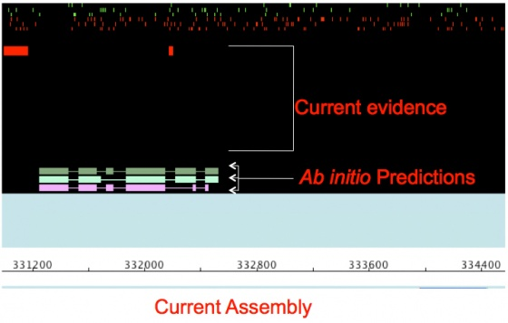</a>

<div class="thumbcaption">

<div class="magnify">

<a href="File:Prediction.jpg" class="internal" title="Enlarge"></a>

</div>

Generate *ab initio* gene predictions

</div>

</div>

</div>

  
MAKER currently supports:

- SNAP (Works good, easy to train, not as good as others especially on
  longer intron genomes).
- Augustus (Works great, hard to train, but getting better)
- GeneMark (Self training, no hints, buggy, not good for fragmented
  genomes or long introns).
- FGENESH (Works great, costs money even for training)

  
You must specify in the maker_opts.ctl file the training parameters file
you want to use use when running each of these algorithms.

### <span id="EST_and_Protein_Evidence_Alignment" class="mw-headline">EST and Protein Evidence Alignment</span>

A simple way to indicate if a sequence region is likely associated with
a gene is to identify (A) if the region is actively being transcribed or
(B) if the region has homology to a known protein. This can be done by
aligning Expressed Sequence Tags (ESTs) and proteins to the genome using
alignment algorithms.

- ESTs are sequences derived from a cDNA library. Because of the
  difficulties associated with working with mRNA and depending on how
  the cDNA library was prepared, EST databases usually represent bits
  and pieces of transcribed mRNAs with only a few full length
  transcripts. MAKER aligns these sequences to the genome using BLASTN.
  If ESTs from the organism being annotated are unavailable or sparse,
  you can use ESTs from a closely related organism. However, ESTs from
  closely related organisms are unlikely to align using BLASTN since
  nucleotide sequences can diverge quite rapidly. For these ESTs, MAKER
  uses TBLASTX to align them in protein space.
- Protein sequence generally diverges quite slowly over large
  evolutionary distances, as a result proteins from even evolutionarily
  distant organisms can be aligned against raw genomic sequence to try
  and identify regions of homology. MAKER does this using BLASTX.

  

<div class="thumb tnone">

<div class="thumbinner" style="width:562px;">

<a href="File:Evidence.jpg" class="image">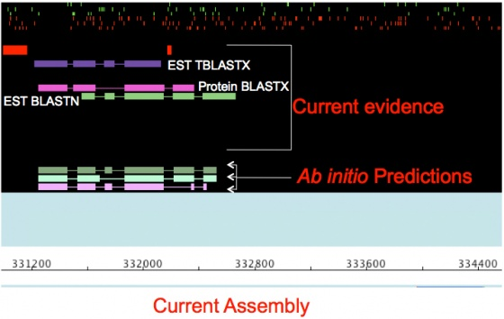</a>

<div class="thumbcaption">

<div class="magnify">

<a href="File:Evidence.jpg" class="internal" title="Enlarge"></a>

</div>

Align EST and protein evidence

</div>

</div>

</div>

Remember now that we are aligning against the repeat-masked genomic
sequence. How is this going to affect our alignments? For one thing we
won't be able to align against low-complexity regions. Some real
proteins contain low-complexity regions and it would be nice to identify
those, but if I let anything align to a low-complexity region, then I
will get spurious alignments all over the genome. Wouldn't it be nice if
there was a way to allow BLAST to extend alignments through
low-complexity regions, but only if there is is already alignment
somewhere else? You can do this with soft-masking. If you remember
soft-masking is using lower case letters to mask sequence without losing
the sequence information. BLAST allows you to use soft-masking to keep
alignments from seeding in low-complexity regions, but allows you to
extend through them. This of course will allow some of the spurious
alignments you were trying to avoid, but overall you still end up
suppressing the majority of poor alignments while letting through enough
real alignments to justify the cost. You can turn this behavior off
though if it bothers you by setting `softmask:0` in the `maker_bopt.ctl`
file.

### <span id="Polishing_Evidence_Alignments" class="mw-headline">Polishing Evidence Alignments</span>

Because of oddities associated with how BLAST statistics work, BLAST
alignments are not as informative as they could be. BLAST will align
regions any where it can, even if the algorithm aligns regions out of
order, with multiple overlapping alignments in the exact same region, or
with slight overhangs around splice sites.

  
To get more informative alignments MAKER uses the program Exonerate to
polish BLAST hits. Exonerate realigns each sequences identified by BLAST
around splice sites and forces the alignments to occur in order. The
result is a high quality alignment that can be used to suggest near
exact intron/exon positions. Polished alignments are produced using the
est2genome and protein2genome options for Exonerate.

<div class="thumb tnone">

<div class="thumbinner" style="width:562px;">

<a href="File:Polish.jpg" class="image">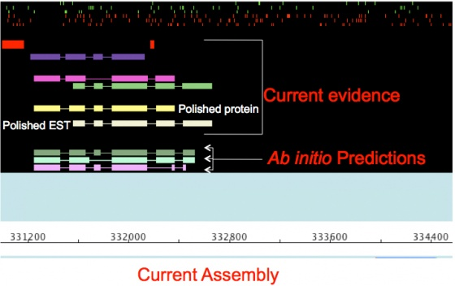</a>

<div class="thumbcaption">

<div class="magnify">

<a href="File:Polish.jpg" class="internal" title="Enlarge"></a>

</div>

Polish BLAST alignments with Exonerate

</div>

</div>

</div>

One of the benefits of polishing EST alignments is the ability to
identify the strand an EST derives from. Because of amplification steps
involved in building an EST library and limitations involved in some
high throughput sequencing technologies, you don't necessarily know
whether you're really aligning the forward or reverse transcript of an
mRNA. However, if you take splice sites into account, you can only align
to one strand correctly.

  

### <span id="Integrating_Evidence_to_Synthesize_Annotations" class="mw-headline">Integrating Evidence to Synthesize Annotations</span>

Once you have *ab initio* predictions, EST alignments, and protein
alignments you can integrate this evidence to produce even better gene
predictions. MAKER does this by "talking" to the gene prediction
programs. MAKER takes all the evidence, generates "hints" to where
splice sites and protein coding regions are located, and then passes
these "hints" to programs that will accept them.

<div class="thumb tnone">

<div class="thumbinner" style="width:562px;">

<a href="File:Hint.jpg" class="image">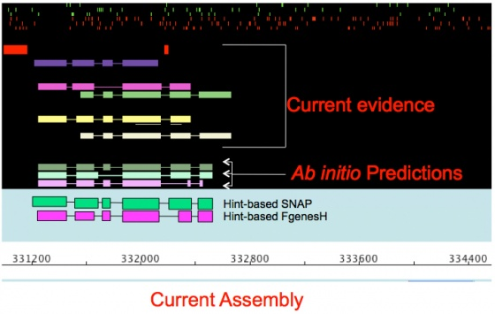</a>

<div class="thumbcaption">

<div class="magnify">

<a href="File:Hint.jpg" class="internal" title="Enlarge"></a>

</div>

Pass gene finders evidence-based ‘hints’

</div>

</div>

</div>

MAKER produces hint based predictors for:

- SNAP
- Augustus
- FGENESH
- GeneMark (under development)

  

### <span id="Selecting_and_Revising_the_Final_Gene_Model" class="mw-headline">Selecting and Revising the Final Gene Model</span>

MAKER then takes the entire pool of *ab initio* and evidence informed
gene predictions, updates features such as 5' and 3' UTRs based on EST
evidence, tries to determine alternative splice forms where EST data
permits, produces quality control metrics for each gene model (this is
included in the output), and then MAKER chooses from among all the gene
model possibilities the one that best matches the evidence. This is done
using a modified sensitivity/specificity distance metric.

<div class="thumb tnone">

<div class="thumbinner" style="width:562px;">

<a href="File:Select.jpg" class="image">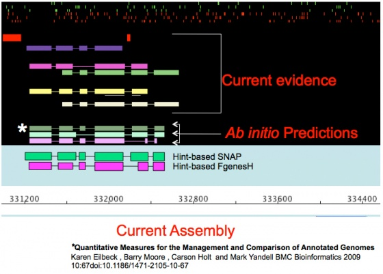</a>

<div class="thumbcaption">

<div class="magnify">

<a href="File:Select.jpg" class="internal" title="Enlarge"></a>

</div>

Identify gene model most consistent with evidence\*

</div>

</div>

</div>

MAKER can use evidence from EST alignments to revise gene models to
include features such as 5' and 3' UTRs.

<div class="thumb tnone">

<div class="thumbinner" style="width:562px;">

<a href="File:Revise.jpg" class="image">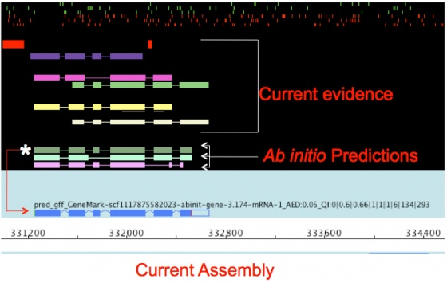</a>

<div class="thumbcaption">

<div class="magnify">

<a href="File:Revise.jpg" class="internal" title="Enlarge"></a>

</div>

Revise model further if necessary; create new annotation

</div>

</div>

</div>

### <span id="Quality_Control" class="mw-headline">Quality Control</span>

Finally MAKER calculates quality control statistics to assist in
downstream management and curation of gene models outside of MAKER.

<div class="thumb tnone">

<div class="thumbinner" style="width:562px;">

<a href="File:Statistics.jpg" class="image">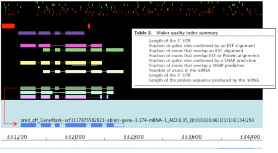</a>

<div class="thumbcaption">

<div class="magnify">

<a href="File:Statistics.jpg" class="internal" title="Enlarge"></a>

</div>

Compute support for each portion of the gene model

</div>

</div>

</div>

## <span id="MAKER.27s_Output" class="mw-headline">MAKER's Output</span>

If you look in the current working directory, you will see that MAKER
has created an output directory called `dpp_contig.maker.output`. The
name of the output directory is based on the input genomic sequence
file, which in this case was `dpp_contig.fasta`.

  
Now let's see what's inside the output directory.

``` enter
 cd dpp_contig.maker.output
 ls -1
```

You should now see a list of directories and files created by MAKER.

    dpp_contig_datastore
    dpp_contig_master_datastore_index.log
    maker_bopts.log
    maker_exe.log
    maker_opts.log
    mpi_blastdb

- The `maker_opt.log`, `maker_exe.log`, and `maker_bopts.log` files are
  logs of the control files used for this run of MAKER.
- The `mpi_blastdb` directory contains FASTA indexes and BLAST database
  files created from the input EST, protein, and repeat databases.
- The `dpp_contig_master_datastore_index.log` contains information on
  both the run status of individual contigs and information on where
  individual contig data is stored.
- The `dpp_contig_datastore` directory contains a set of subfolders,
  each containing the final MAKER output for individual contigs from the
  genomic fasta file.

  
Once a MAKER run is finished the most important file to look at is the
`dpp_contig_master_datastore_index.log` to see if there were any
failures.

    cat dpp_contig_master_datastore_index.log

  
If everything proceeded correctly you should see the following.

    contig-dpp-500-500      dpp_contig_datastore/contig-dpp-500-500 STARTED
    contig-dpp-500-500      dpp_contig_datastore/contig-dpp-500-500 FINISHED

  
There are only entries describing a single contig because there was only
one contig in the example file. These lines indicate that the contig
`contig-dpp-500-500` STARTED and then FINISHED without incident. Other
possible entries include:

- FAILED - indicates a failed run on this contig, MAKER will retry these
- RETRY - indicates that MAKER is retrying a contig that failed
- SKIPPED_SMALL - indicates the contig was too short to annotate
  (minimum contig length is specified in `maker_opt.ctl`)
- DIED_SKIPPED_PERMANENT - indicates a failed contig that MAKER will not
  attempt to retry (number of times to retry a contig is specified in
  `maker_opt.ctl`)

  
The entries in the `dpp_contig_master_datastore_index.log` file also
indicate that the output files for this contig are stored in the
directory `dpp_contig_datastore/contig-dpp-500-500/`. Knowing where the
output is stored may seem rather trivial; however, input genome fasta
files can contain thousands even hundreds-of-thousands of contigs, and
many file-systems have performance problems with large numbers of
sub-directories and files within a single directory. Even when the
underlying file-systems handle things gracefully, access via network
file-systems can be an issue. To deal with this situation, MAKER uses a
datastore module to create a hierarchy of sub-directory layers, starting
from a 'base', and mapping identifiers to corresponding sub-directories.
For situations where the input genome fasta file contains more than
1,000 contigs, the datastore structure is used automatically, and the
`master_datastore_index.log` file becomes essential for identifying
where the output for a given contig is stored.

  
Now let's take a look at what MAKER produced for the contig
'contig-dpp-500-500'.

``` enter
 cd dpp_contig_datastore/contig-dpp-500-500
 ls -1
```

The directory should contain a number of files and a directory.

    contig-dpp-500-500.gff
    contig-dpp-500-500.maker.proteins.fasta
    contig-dpp-500-500.maker.transcripts.fasta
    run.log
    theVoid.contig-dpp-500-500

  

- The `contig-dpp-500-500.gff` contains all annotations and evidence
  alignments in [GFF3](GFF3 "GFF3") format. This is the important file
  for use with [Apollo](Apollo.1 "Apollo") or
  [GBrowse](GBrowse.1 "GBrowse").
- The `contig-dpp-500-500.maker.transcripts.fasta` and
  `contig-dpp-500-500.maker.proteins.fasta` files contain the transcript
  and protein sequences for MAKER produced gene annotations.
- The `run.log` file is a log file. If you change settings and rerun
  MAKER on the same dataset, or if you are running a job on an entire
  genome and the system fails, this file lets MAKER know what analyses
  need to be deleted, rerun, or can be carried over from a previous run.
  One advantage of this is that rerunning MAKER is extremely fast, and
  your runs are virtually immune to all system failures.
- The directory `theVoid.contig-dpp-500-500` contains raw output files
  from all the programs MAKER wraps around (BLAST, SNAP, RepeatMasker,
  etc.). You can usually ignore this directory and it's contents.

## <span id="Viewing_MAKER_Annotations" class="mw-headline">Viewing MAKER Annotations</span>

Let's take a look at the [GFF3](GFF3 "GFF3") file produced by MAKER.

    less contig-dpp-500-500.gff

As you can see, manually viewing the raw GFF3 file produced by MAKER
really isn't that meaningful. While you can identify individual features
such as genes, mRNAs, and exons, trying to interpret those features in
the context of thousands of other genes and thousands of bases of
sequence really can't be done by directly looking at the GFF3 file.

  
For sanity check purposes it would be nice to have a graphical view of
what's in the GFF3 file. To do that, GFF3 files can be loaded into
programs like [Apollo](Apollo.1 "Apollo") and
[GBrowse](GBrowse.1 "GBrowse").

  

### <span id="Apollo" class="mw-headline">Apollo</span>

Let's load the `contig-dpp-500-500.gff` into [Apollo](Apollo.1 "Apollo")
and take a look at what MAKER produced. Copy the
`contig-dpp-500-500.gff` file to your home directory to make it easy to
locate.

    cp contig-dpp-500-500.gff ~

Now before starting Apollo, MAKER comes with a configuration file that
will allow Apollo to display MAKER annotations and evidence in nice
color (otherwise everything will be the same color of white). Copy the
configuration file to the `~/.apollo` directory, to make the
configuration file available to Apollo.

    cp /home/gmod/Documents/Software/maker/GMOD/Apollo/gff3.tiers ~/.apollo/

  
Now open Apollo and select our [GFF3](GFF3 "GFF3") file.

    /home/gmod/Documents/Software/Apollo/bin/apollo

  
You will notice that there are a number of bars representing the gene
annotations and the evidence alignments supporting those annotations.
Annotations are in the middle light colored panel, and evidence
alignments are in the dark panels at the top and bottom. As you have
probably realized, this view is much easier to interpret than looking
directly at the GFF3 file.

Now click on each piece of evidence and you will see it's source in the
table at the bottom of the Apollo screen.

Possible Sources Include:

- BLASTN - BLASTN alignment of EST evidence
- BLASTX - BLASTX alignment of protein evidence
- TBLASTX - TBLASTX alignment of EST evidence from closely related
  organisms
- EST2Genome - Polished EST alignment from Exonerate
- Protein2Genome - Polished protein alignment from Exonerate
- SNAP - SNAP *ab inito* gene prediction
- GENEMARK - GeneMark*ab inito* gene prediction
- Augustus - Augustus *ab inito* gene prediction
- FgenesH - FGENESH *ab inito* gene prediction
- Repeatmasker - RepeatMasker identified repeat
- RepeatRunner - RepeatRunner identified repeat from the repeat protein
  database

# <span id="Advanced_MAKER_Configuration.2C_Re-annotation_Options.2C_and_Improving_Annotation_Quality" class="mw-headline">Advanced MAKER Configuration, Re-annotation Options, and Improving Annotation Quality</span>

The remainder of this page addresses issues that can be encountered
during the annotation process. I then describe how MAKER can be used to
resolve each issue.

  

## <span id="Configuration_Files_in_Detail" class="mw-headline">Configuration Files in Detail</span>

Let's take a closer look at the configuration options in the
`maker_opt.ctl` file.

``` enter
 cd /home/gmod/Documents/Data/maker/example1_dmel
 gedit maker_opts.ctl
```

### <span id="Basic_Input_Files" class="mw-headline">Basic Input Files</span>

All the basic input files for MAKER should be in FASTA format.

- *genome* - Genomic sequence file
- *est* - ESTs from the same organism or from a very very closely
  related organism (i.e. chimpanzee to human). These are aligned first
  via BLASTN with very strict filtering so any sequence divergence can
  prohibit the alignment.
- *altest* - These are ESTs from other closely related organisms (i.e.
  mouse to human). They are aligned via TBLASTX in protein space, so
  greater sequence divergence is permitted.
- *protein* - proteins from the same or other organisms. These are
  aligned via BLASTX against the genome. Proteins that align to a region
  will not necessarily be orthologous or paralogous. The alignment may
  just be based on short regions such as a shared domain. You may also
  get alignments to pseudogenes. Polishing BLASTX hits with Exonerate
  helps identify what are likely true paralogs and orthologs.

  

### <span id="Repeat_Masking_Options" class="mw-headline">Repeat Masking Options</span>

Repeat masking is important for improving gene predictor performance and
avoiding protein alignments to what are likely just retrotransposons.
You also expect a certain amount of genomic contamination in the EST
database, much of this contamination maps back to repeat regions. By
repeat masking we can avoid issues with all types of input data.

  

- *model_org* - This is a RepeatMasker option that lets you limit the
  repeat database to specific organisms or groups of organisms (i.e.
  vertebrates, Nematodes, *Drosophila*, primates etc). By default MAKER
  sets this to 'all'.
- *repeat_protein* - This is a fasta file of transposon and virus
  related proteins. MAKER has an internal RepeatRunner database it uses
  by default.
- *rmlib* - This is a fasta file of nucleotide repeats provided by the
  user. You can create a species specific repeat database using programs
  like PILER.

### <span id="Gene_Prediction_Options" class="mw-headline">Gene Prediction Options</span>

Gene prediction options affect the final gene annotations more than any
other option type. This brings up the point that electronically produced
gene annotations will only be as good as the gene predictions they are
based on.

  

- *predictor* - This tells MAKER what programs to run for generating
  annotations.
  - est2genome - Allows high quality spliced Exonerate EST alignments to
    become gene annotations. This only happens when there is no gene
    prediction overlapping the region. This is useful for generating
    gene annotations in the absence of a trained gene predictor.
  - protein2genome - Attempts to build gene models directly from protein
    alignments (works on prokaryotes only)
  - model_gff - This allows user defined gene models to be used
  - pred_gff - This allows user provided *ab initio* predictions
  - snap
  - augustus
  - genemark
  - fgenesh
- *unmask* - Produce *ab initio* gene predictions for unmasked sequence
  as well as for masked sequence
- *snaphmm* - SNAP training file (SNAP has some species files already
  available in the snap/HMM/ directory)
- *gmhmm* - GeneMark training file (GeneMark self-trains and produces
  the resulting training file in the output mod/ directory)
- *augustus_species* - Augustus species ID (Augustus uses an internal
  species index rather than a simple set of training files. Type
  'augustus --species=help' to see the values you can choose)
- *fgenesh_par_file* - FGENESH training file

### <span id="Other_MAKER_Options" class="mw-headline">Other MAKER Options</span>

- *evaluate* - runs an experimental annotation quality analysis program
  (Evaluator) on each annotation. Provides quantitative metrics for
  ranking annotations and identifying the features most in need of
  review. I'd like to emphasize that this is experimental.
- *max_dna_len* - sets the length for dividing up contigs into chunks
  for processing. Larger chunks require more memory; smaller chunks
  require less memory. Allows the user to control system memory usage.
- *min_contig* - sets the minimum length a contig must have or else it
  will be skipped.
- *min_protein* - sets the minimum length a predicted protein must have
  (in amino acids) to be annotated.
- *split_hit* - sets the expected max intron size for evidence
  alignments
- *pred_flank* - sets the length for the sequence surrounding clusters
  of EST and protein evidence that will be used when building hint based
  gene predictions.
- *single_exon* - tells MAKER to consider single exon EST evidence when
  generating annotations. Single exon ESTs are more likely to be genomic
  contamination.
- *single_length* - sets the minimum length required for single exon
  ESTs if 'single_exon' is enabled
- *keep_preds* - adds non-overlapping ab-inito gene prediction to the
  final annotation set rather than pushing them off into a separate file
  for the user to analyse. These predictions by definition do not
  overlap any form of supporting evidence.
- *retry* - sets the number of times to retry a contig if there is a
  failure
- *clean_try* - removes all data from previous MAKER runs before
  retrying a contig
- *clean_up* - removes theVoid directory with individual raw analysis
  files at the end of the MAKER run
- *TMP* - specifies a directory other than the system default temporary
  directory (`/tmp`) for writing temporary files. On some Linux systems
  the primary hard drive that also holds the default temporary directory
  is small, and most of the systems storage space is located on
  secondary hard drives mounted in directories elsewhere on the system.
  This is often true of computer clusters where each node has it's own
  small hard drive for booting purposes, and most storage space is
  network mounted. Temporary files created by MAKER are deleted as the
  program advances, but individual files related to BLAST jobs can be
  quite large, so setting TMP to another location can be useful.

## <span id="Training_ab_initio_Gene_Predictors" class="mw-headline">Training *ab initio* Gene Predictors</span>

If you are involved in a genome project for an emerging model organism,
you should already have an EST database which would have been generated
as part of the original sequencing project. A protein database can be
collected from closely related organism genome databases or by using the
UniProt/SwissProt protein database or the NCBI NR protein database.
However a trained *ab initio* gene predictor is a much more difficult
thing to generate. Gene predictors require existing gene models on which
to base prediction parameters. However, with emerging model organisms
you are not likely to have any pre-existing gene models. So how then are
you supposed to train your gene prediction programs?

  
MAKER gives the user the option to produce gene annotations directly
from the EST evidence. You can then use these imperfect gene models to
train gene predictor program. Once you have re-run MAKER with the newly
trained gene predictor, you can use the second set of gene annotations
to train the gene predictors yet again. This boot-strap process allows
you to iteratively improve the performance of *ab initio* gene
predictors.

  
I've created an example file set so you can learn to train the gene
predictor SNAP using this procedure.

  
First let's move to the example directory.

``` enter
 cd /home/gmod/Documents/Data/maker/example2_pyu
 ls -1
```

You should see the following files (plus others) in the directory

    pyu-contig.fasta
    pyu-est.fasta
    pyu-protein.fasta

  
We need to build maker configuration files and populate the appropriate
values.

``` enter
 maker -CTL
 gedit maker_opts.ctl
```

<div style="font-size: 80%; margin-top: -0.75em; margin-left: 1em">

[A word on text editors such as
gedit](Linux_Text_Editors "Linux Text Editors").

</div>

  
Edit the following:

``` enter
 genome=pyu-contig.fasta
 est=pyu-est.fasta
 protein=pyu-protein.fasta
 est2genome=1
```

MAKER is now configured to generate annotations from the EST data, so
start the program (this will take a minute to run).

``` enter
 maker
```

Once finished load the file
`pyu-contig.maker.output/pyu-contig_datastore/scf1117875581239.gff` into
[Apollo](Apollo.1 "Apollo"). You will see that there are far more
regions with evidence alignments than there are gene annotations. This
is because there are so few spliced ESTs that are capable of generating
gene models.

  
Now exit [Apollo](Apollo.1 "Apollo"). We now need to convert the
[GFF3](GFF3 "GFF3") gene models to ZFF format. This is the format SNAP
requires for training. To do this wee need to collect all GFF3 files
into a single directory.

``` enter
 mkdir gff
 cp pyu-contig.maker.output/pyu-contig_datastore/09/14/scf1117875582023/scf1117875582023.gff gff/
 cd gff
 maker2zff scf1117875582023.gff
 ls -1
```

There should now be two new files. The first is the ZFF format file and
the second is a FASTA file the coordinates can be referenced against.
These will be used to train SNAP.

    genome.dna

The basic steps for training SNAP are first to filter the input gene
models, then capture genomic sequence immediately surrounding each model
locus, and finally uses those captured segments to produce the HMM. You
can explore the internal SNAP documentation for more details if you
wish.

``` enter
 fathom -categorize 1000 genome.ann genome.dna
 fathom -export 1000 -plus uni.ann uni.dna
 forge export.ann export.dna
 hmm-assembler.pl Pult . > Pult.hmm
 cd ..
```

  
The final training parameters file is `Pult.hmm`. We do not expect SNAP
to perform that well with this training file because it is based on
incomplete gene models; however, this file is a good starting point for
further training.

  
We need to run MAKER again with the new HMM file we just built for SNAP.

``` enter
 gedit maker_opts.ctl
```

<div style="font-size: 80%; margin-top: -0.75em; margin-left: 1em">

[A word on text editors such as
gedit](Linux_Text_Editors "Linux Text Editors").

</div>

And set:

``` enter
 snaphmm=gff/Pult.hmm
 est2genome=0
```

And run

``` enter
 maker
```

Now lets look at the output once again in [Apollo](Apollo.1 "Apollo").
When you examine the annotations you should notice that final MAKER gene
models displayed in light blue, are more abundant now and are in
relatively good agreement with the evidence alignments. However the SNAP
*ab initio* gene predictions in the evidence tier do not yet match the
evidence that well. This is because SNAP predictions are based solely on
the mathematic descriptions in the HMM; whereas, MAKER models also use
evidence alignments to help further inform gene models. This
demonstrates why you get better performance by running *ab initio* gene
predictors like SNAP inside of MAKER rather than producing gene models
by themselves for emerging model organism genomes. The fact that the
MAKER models are in better agreement with the evidence than the current
SNAP models also means I can use the MAKER models to retrain SNAP in a
bootstrap fashion, thereby improving SNAP's performance and
consequentially MAKER's performance.

  
Close Apollo, retrain SNAP, and run MAKER again.

``` enter
 mkdir gff2
 cp pyu-contig.maker.output/pyu-contig_datastore/scf1117875582023/scf1117875582023.gff gff2/
 cd gff2
 maker2zff.pl scf1117875582023.gff
 fathom -categorize 1000 genome.ann genome.dna
 fathom -export 1000 -plus uni.ann uni.dna
 forge export.ann export.dna
 hmm-assembler.pl Pult . > Pult2.hmm
 cd ..
 gedit maker_opts.ctl
```

Change configuration file.

``` enter
 snaphmm:gff2/Pult2.hmm
```

Run maker.

``` enter
 maker
```

Let's examine the [GFF3](GFF3 "GFF3") file one last time in
[Apollo](Apollo.1 "Apollo"). As you can see there, there is now a marked
degree of improvement in both the MAKER and SNAP gene models, and both
models are in more agreement with each other.

## <span id="MAKER_Web_Annotation_Service" class="mw-headline">MAKER Web Annotation Service</span>

As you have all experienced with the previous examples, running programs
on the command line can seem difficult. Many users might feel
overwhelmed by trying to install and run a program like MAKER locally,
especially if they are not very familiar with Linux. For those
individuals, our lab has produced the MAKER Web Annotation Service
(MWAS). MWAS is a website where you can run MAKER over the web without
having to install any software locally, and you are provided with a much
more user friendly interface for configuring MAKER and viewing results.

- Go to <a href="http://www.yandell-lab.org" class="external free"
  rel="nofollow">http://www.yandell-lab.org</a> and select MWAS from the
  tabbed menu. You will see a link at the bottom of the page to access
  the MAKER Web Annotation Server. On the MWAS server page log in as a
  guest, then select 'New Job' from the top of the page.

  
Scrolling down the page, you should notice there are options to select
the genome file, EST and protein evidence files, and choose *ab initio*
gene predictors. At the top of the page select **Example Jobs** → **D.
melanogaster :Dpp'** and click '**Load**.

<a href="File:MAKERselect_dpp.jpg" class="image">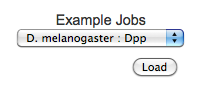</a>

  
Now if you scroll down, you should notice that the values for your
genome, EST and protein files has been filled out for you. At the bottom
of the page click **Add Job to Queue**. You will now be sent to the job
status page.

<div class="thumb tnone">

<div class="thumbinner" style="width:562px;">

<a href="File:MAKERstatus.jpg" class="image">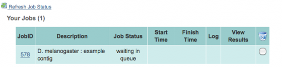</a>

<div class="thumbcaption">

<div class="magnify">

<a href="File:MAKERstatus.jpg" class="internal" title="Enlarge"></a>

</div>

</div>

</div>

</div>

  
You will need to click **Refresh Job Status**, a couple of times until
your job finishes. When your job is finished you will see an **icon** in
the column marked **Log**. Click it. A window will come up displaying
any errors that occurred for your job, so ideally this window will be
blank. Next click on the **View Results icon**.

<a href="File:MAKERresults.jpg" class="image">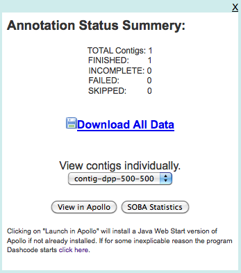</a>

The results window will provide a brief summary of the status of each
contig in your job, and will give you the opportunity to download the
data, or view the results for individual contigs. Click on **View in
Apollo**. This will open your data in Apollo ([Ed
Lee](User:Elee "User:Elee") will describe just how launching Apollo over
the web works during the [Apollo](Apollo.1 "Apollo") section). Then
close Apollo and click on **SOBA statistics**. This will open up a tool
from the Sequence Ontology Consortium that provides simple summary
statistics of features in a [GFF3](GFF3 "GFF3") file.

## <span id="mRNAseq" class="mw-headline">mRNAseq</span>

mRNAseq is a high throughput technique for sequencing the entire
transcriptome, and it holds the promise of allowing researchers to
identify all exons and alternative splice forms for every gene in the
genome with a single experiment. It may soon make gene predictors
(mostly) a thing of the past.

- Still need to de-convolute reads & evidence (for now)
- Still need to archive, manage, and distribute annotations

  

<div class="thumb tnone">

<div class="thumbinner" style="width:562px;">

<a href="File:MRNAseq.jpg" class="image">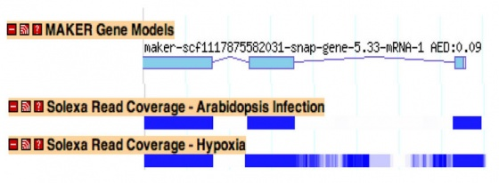</a>

<div class="thumbcaption">

<div class="magnify">

<a href="File:MRNAseq.jpg" class="internal" title="Enlarge"></a>

</div>

</div>

</div>

</div>

  
By mapping mRNAseq reads using programs like
<a href="http://tophat.cbcb.umd.edu/" class="external text"
rel="nofollow">TopHat</a> and
<a href="http://bowtie-bio.sourceforge.net/index.shtml"
class="external text" rel="nofollow">Bowtie</a>, you can create
[GFF3](GFF3 "GFF3") files of read islands and junctions. This data can
then be passed in as EST evidence and will be used for generating hint
based gene prediction and for choosing final annotations.

Load example on MWAS site.
<a href="http://derringer.genetics.utah.edu/MWAS/" class="external free"
rel="nofollow">http://derringer.genetics.utah.edu/MWAS/</a>

## <span id="Merge.2FResolve_Legacy_Annotations" class="mw-headline">Merge/Resolve Legacy Annotations</span>

Legacy annotations

- Many are no longer maintained by original creators
- In some cases more than one group has annotated the same genome, using
  very different procedures, even different assemblies
- Many investigators have their own genome-scale data and would like a
  private set of annotations that reflect these data
- There will be a need to revise, merge, evaluate, and verify legacy
  annotation sets in light of RNA-seq and other data

  

<div class="thumb tnone">

<div class="thumbinner" style="width:562px;">

<a href="File:Legacy.png" class="image">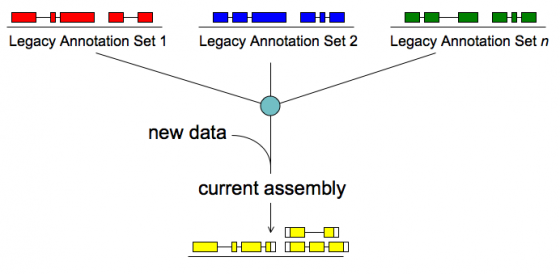</a>

<div class="thumbcaption">

<div class="magnify">

<a href="File:Legacy.png" class="internal" title="Enlarge"></a>

</div>

</div>

</div>

</div>

  
MAKER will:

- Identify legacy annotation most consistent with new data
- Automatically revise it in light of new data
- If no existing annotation, create new one

  

Load example on MWAS class site.
<a href="http://derringer.genetics.utah.edu/MWAS/" class="external free"
rel="nofollow">http://derringer.genetics.utah.edu/MWAS/</a>

## <span id="MPI_Support" class="mw-headline">MPI Support</span>

[MAKER](MAKER.1 "MAKER") optionally supports Message Passing Interface
(MPI), a parallel computation communication protocol primarily used on
computer clusters. This allows MAKER jobs to be broken up across
multiple nodes/processors for increased performance and scalability.

  

<div class="thumb tnone">

<div class="thumbinner" style="width:562px;">

<a href="File:Mpi_maker.png" class="image">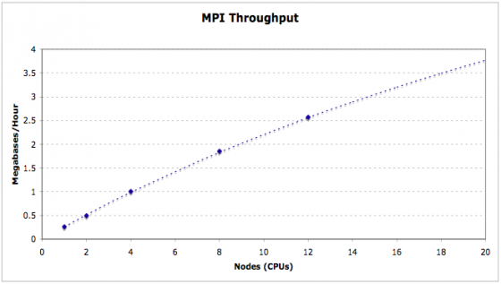</a>

<div class="thumbcaption">

<div class="magnify">

<a href="File:Mpi_maker.png" class="internal" title="Enlarge"></a>

</div>

</div>

</div>

</div>

  
To use this feature, you must have MPICH2 installed with the the
`--enable-sharedlibs` flag set during installation (See MPICH2
Installer's Guide). I have installed this for you. So lets set up
MPI_MAKER and run the example file that comes with MAKER.

``` enter
 cd ~/Documents/Software/maker/src
 perl Build.PL
```

Accept the default that we want to build for MPI support

``` enter
 ./Build install
```

You should now see the executable `mpi_maker` listed among the MAKER
scripts (`/maker/bin`). Let's run some example data to see if MPI_MAKER
is working properly.

``` enter
 cd ~
 mkdir ~/maker_run2
 cd maker_run2
 cp ~Documents/Software/maker/data/dpp_* ~/maker_run2
 maker -CTL
 gedit maker_opts.ctl
```

Set values in maker configuration files.

``` enter
 genome=dpp_contig.fasta
 est=dpp_est.fasta
 protein=dpp_protein.fasta
 snap=/home/gmod/Documents/Software/maker/exe/snap/HMM/fly
```

We need to set up a few more things for MPI to work. Type `mpd` to see a
list of instructions.

``` enter
 mpd
```

You should see the following.

    configuration file /home/gmod/mpd.conf not found
    A file named .mpd.conf file must be present in the user's home
    directory (/etc/mpd.conf if root) with read and write access
    only for the user, and must contain at least a line with:
    MPD_SECRETWORD=<secretword>
    One way to safely create this file is to do the following:
      cd $HOME
      touch .mpd.conf
      chmod 600 .mpd.conf
    and then use an editor to insert a line like
      MPD_SECRETWORD=mr45-j9z
    into the file.  (Of course use some other secret word than mr45-j9z.)

  
Follow the instructions to set this file up, and start the mpi
environment with `mpdboot`. Then run `mpi_maker` through the MPI manager
`mpiexec`.

``` enter
 mpdboot
 mpiexec -n 2 mpi_maker
```

`mpiexec` is a wrapper that handles the MPI environment. The `-n 2` flag
tells `mpiexec` to use 2 cpus/nodes when running `mpi_maker`. For a
large cluster, this could be set to something like 100. You should now
know how to start a MAKER job via MPI.

## <span id="User_Interface_for_Local_MAKER_Installation" class="mw-headline">User Interface for Local MAKER Installation</span>

<div class="emphasisbox">

This example did not work during class because a conflict with the
version of Apache that was installed. The issue has since been fixed.
Before beginning the example, open a terminal and remove the following
files otherwise the subversion update of maker fails.

``` enter
 rm ~/Documents/Software/maker/MWAS/bin/mwas_server
 rm ~/Documents/Software/maker/MWAS/cgi-bin/tt_templates/apollo_webstart.tt
```

Then update maker via subversion.

``` enter
 svn update ~/Documents/Software/maker/
```

</div>

The MWAS interface provides a very convenient method for running MAKER
and viewing results; however, because compute resources are limited
users are only allowed to submit a maximum of 2 megabases of sequence
per job. So while MWAS might be suitable for some analyses (i.e.
annotating BACs and short preliminary assemblies), if you plan on
annotating an entire genome you will need to install MAKER locally. But
if you like the convenience of the MWAS user interface, you can
optionally install the interface on top of a locally installed version
of MAKER for use in your own lab.

  
First under the `maker` directory there is a subdirectory called `MWAS`.
`MWAS` contains all the needed files to build the MAKER web interface.
The `maker/MWAS/bin/mwas_server` file is used to setup and run this web
interface. Lets configure that now. There are three steps to setting up
the server. First you must create and edit a server configuration file,
then load all other configuration files, and then install all files to
the appropriate web accessible directory.

``` enter
 cd /home/gmod/Documents/Software/maker/MWAS/
 bin/mwas_server PREP
```

This will create a file in `/maker/MWAS/config/` called `server.ctl`. We
will need to edit this file before continuing.

``` enter
 gedit config/server.ctl
```

Set:

``` enter
 apache_user:www-data
 web_address:http://localhost
 cgi_dir:/usr/lib/cgi-bin/maker
 cgi_web:/cgi-bin/maker
 html_dir:/var/www/maker
 html_web:/maker
 data_dir:/var/www/maker/data
 use_login:0
```

Now we need to generate other settings that are dependent on the values
in

`server_opts.ctl`.

``` enter
 bin/mwas_server CONFIG
```

Several new configuration files should now be loaded in the `config/`
directory. These new files define default MAKER options for the server
and the location of files for the server dropdown menus.

    maker_bopts.ctl
    maker_exe.ctl
    maker_opts.ctl
    menus.ctl

We shouldn't need to edit any of these file. So lets copy files to the
appropriate web accessible directories. This must be done as root or
using `sudo`.

``` enter
  sudo bin/mwas_server SETUP
```

If you set `APOLLO_ROOT` in the `server.ctl` file, then you can now
setup a special Java Web Start version of [Apollo](Apollo.1 "Apollo") to
view results directly from the web interface. Web Start will be
described in more detail in the Apollo session. This must be done as
root or using `sudo`.

``` enter
 sudo bin/mwas_server APOLLO
```

We can now run MAKER examples using this web interface, but first we
need to launch a server to monitor for new job submissions.

``` enter
 sudo bin/mwas_server START
```

And then go to

<a href="http://localhost/maker" class="external free"
rel="nofollow">http://localhost/maker</a>

## <span id="MAKER_Accessory_Scripts" class="mw-headline">MAKER Accessory Scripts</span>

MAKER comes with a number of accessory scripts that are meant to assist
in manipulations of the MAKER input and output files.

  
Scripts:

- *add_utr_start_stop_gff* - Adds explicit 5' and 3' UTR as well as
  start and stop codon features to the GFF3 output file

<!-- -->

     add_utr_start_stop_gff <gff3_file>

- *add_utr_to_gff3.pl* - Adds explicit 5' and 3' UTR features to the
  [GFF3](GFF3 "GFF3") output file

<!-- -->

     add_utr_gff.pl <gff3_directory>

- *cegma2zff' - This script converts the output of a GFF file from CEGMA
  into ZFF format for use in SNAP training. Output files are always
  genome.ann and genome.dna*

<!-- -->

     cegma2zff <cegma_gff> <genome_fasta>

- *chado2gff3* - This script takes default CHADO database content and
  produces GFF3 files for each contig/chromosome.

<!-- -->

     chado2gff3 [OPTION] <database_name>

- *compare* - This script compares the contents of a GFF3 file to a
  CHADO database to look for merged, split and missing genes.

<!-- -->

     compare [OPTION] <database_name> <gff3_file>

- *cufflinks2gff3* - This script converts the cufflinks output
  transcripts.gtf file into GFF3 format for use in MAKER via GFF3
  passthrough. By default standless features which correspond to single
  exon cufflinks models will be ignored. This is because these features
  can correspond to repetative elements and pseudogenes. Ouput is to
  STDOUT so you will need to redirect to a file.

<!-- -->

     cufflinks2gff3 <transcripts1.gtf> <transcripts2.gtf> ...

- *evaluator* - Evaluate the the quality of an annotation set.

<!-- -->

      mpi_evaluator [options] <eval_opts> <eval_bopts> <eval_exe>

- *fasta_merge* - Collects all of MAKER's fasta file output for each
  contig and merges them to make genome level fastas

<!-- -->

     fasta_merge -d <datastore_index> -o <outfile>

- *fasta_tool* - The script can search, reformat, and manipulate a fasta
  file in a variety of ways.

<!-- -->

- *fix_fasta* - Deprecated, use fasta_tool

<!-- -->

- *genemark_gtf2gff3* - This converts genemark's GTF output into GFF3
  format. The script prints to STDOUT. Use the '\>' character to
  redirect output into a file.

<!-- -->

     genemark_gtf2gff3 <filename><pre>


    ''gff3_2_gtf'' - Converts MAKER GFF3 files to GTF format (run add_utr_start_stop_gff first to get UTR features)


    <pre> gff3_2_gtf <gff3_file>

- *gff3_merge* - Collects all of MAKER's GFF3 file output for each
  contig and merges them to make a single genome level GFF3

<!-- -->

     gff3_merge -d <datastore_index> -o <outfile>

- *gff3_preds2models* - Converts the gene prediction match/match_part
  format to annotation gene/mRNA/exon/CDS format

<!-- -->

     gff3_preds2models <gff3 file> <pred list>

- *gff3_to_eval_gtf* - This script converts MAKER GFF3 files into GTF
  formated files for the program EVAL (an annotation
  sensitivity/specificity evaluating program). The script will only
  extract features explicitly declared in the GFF3 file, and will skip
  implicit features (i.e. UTR, start codons, and stop codons). To
  extract implicit features to the GTF file, you will first need to
  expicitly declare them in the GFF3 file. This can be done by calling
  the script add_utr_to_gff3 to add formal declaration lines to the GFF3
  file.

<!-- -->

     gff3_to_eval_gtf <maker_gff3_file>

- *iprscan2gff3* - Takes InerproScan (iprscan) output and generates GFF3
  features representing domains. Interesting tier for GBrowse.

<!-- -->

     iprscan2gff3 <iprscan_file> <gff3_fasta>

- *iprscan_batch* - Wrapper for iprscan to take advantage of
  multiprocessor systems.

<!-- -->

     iprscan_batch <file_name> <cpus> <log_file>

- *iprscan_wrap* - A wrapper that will run iprscan

<!-- -->

- *ipr_update_gff* - Takes InterproScan (iptrscan) output and maps
  domain IDs and GO terms to the Dbxref and Ontology_term attributes in
  the GFF3 file.

<!-- -->

     ipr_update_gff <gff3_file> <iprscan_file>

- *maker2chado* - This script takes MAKER produced GFF3 files and dumps
  them into a
  <a href="Chado" class="mw-redirect" title="Chado">Chado</a> database.
  You must set the database up first according to CHADO installation
  instructions. CHADO provides its own methods for loading GFF3, but
  this script makes it easier for MAKER specific data. You can either
  provide the datastore index file produced by MAKER to the script or
  add the GFF3 files as command line arguments.

<!-- -->

      maker2chado [OPTION] <database_name> <gff3file1> <gff3file2> ...

- *maker2jbrowse* - This script will produce a JBrowse data set from
  MAKER gff3 files.

<!-- -->

       maker2chado [OPTION] <database_name> <gff3file1> <gff3file2> ...

- *maker2zff.pl* - Pulls out MAKER gene models from the MAKER GFF3
  output and convert them into ZFF format for SNAP training.

<!-- -->

     maker2zff.pl <gff3_file>

- *maker_functional*

<!-- -->

- *maker_functional_fasta* - Maps putative functions identified from
  BLASTP against UniProt/SwissProt to the MAKER produced tarnscript and
  protein fasta files.

<!-- -->

     maker_functional_fasta <uniprot_fasta> <blast_output> <fasta1> <fasta2> <fasta3> ...

- *maker_functional_gff* - Maps putative functions identified from
  BLASTP against UniProt/SwissProt to the MAKER produced GFF3 files in
  the Note attribute.

<!-- -->

     maker_functional_gff <uniprot_fasta> <blast_output> <gff3_1>

- *maker_map_ids* - Build shorter IDs/Names for MAKER genes and
  transcripts following the NCBI suggested naming format.

<!-- -->

     maker_map_ids --prefix PYU1_ --justify 6 genome.all.gff > genome.all.id.map

- *map2assembly* - Maps old gene models to a new assembly where
  possible.

<!-- -->

      map2assembly <genome.fasta> <transcripts.fasta>

- *map_data_ids* - This script takes a id map file and changes the name
  of the ID in a data file. The map file is a two column tab delimited
  file with two columns: old_name and new_name. The data file is assumed
  to be tab delimited by default, but this can be altered with the
  delimit option. The ID in the data file can be in any column and is
  specified by the col option which defaults to the first column.

<!-- -->

     map_data_ids genome.all.id.map data.txt

- *map_fasta_ids* - Maps short IDs/Names to MAKER fasta files.

<!-- -->

     map_fasta_ids <map_file> <fasta_file>

- *map_gff_ids* - Maps short IDs/Names to MAKER GFF3 files, old
  IDs/Names are mapped to to the Alias attribute.

<!-- -->

     map_gff_ids <map_file> <gff3_file>

- *split_fasta* - Splits multi-fasta files into the number of files
  specified by the user. Useful for breaking up MAKER jobs.

<!-- -->

     split_fasta [count] <input_fasta>

- *tophat2gff3* - This script converts the juctions file producted by
  TopHat into GFF3 format for use with MAKER.

<!-- -->

     tophat2gff3 <junctions.bed>

</div>

<div class="printfooter">

Retrieved from
"<http://gmod.org/mediawiki/index.php?title=MAKER_Tutorial_2011&oldid=24438>"

</div>

<div id="catlinks" class="catlinks">

<div id="mw-normal-catlinks" class="mw-normal-catlinks">

[Categories](Special:Categories "Special:Categories"):

- [2011 Spring
  Training](Category:2011_Spring_Training "Category:2011 Spring Training")
- [MAKER](Category:MAKER "Category:MAKER")
- [Tutorials](Category:Tutorials "Category:Tutorials")

</div>

</div>

<div id="mw-data-after-content">

<div class="smwfact">

<span class="smwfactboxhead">Facts about
"<span class="swmfactboxheadbrowse">[MAKER Tutorial
2011](Special:Browse/MAKER-20Tutorial-202011 "Special:Browse/MAKER-20Tutorial-202011")</span>"</span><span class="smwrdflink"><span class="rdflink">[RDF
feed](http://gmod.org/wiki/Special:ExportRDF/MAKER_Tutorial_2011 "Special:ExportRDF/MAKER Tutorial 2011")</span></span>

|  |  |
|----|----|
| [Has topic](Property:Has_topic "Property:Has topic") | [MAKER](MAKER.1 "MAKER") <span class="smwsearch">[+](Special:SearchByProperty/Has-20topic/MAKER "Special:SearchByProperty/Has-20topic/MAKER")</span> |

</div>

</div>

<div class="visualClear">

</div>

</div>

</div>

<div id="mw-navigation">

## Navigation menu

<div id="mw-head">


<div id="left-navigation">

<div id="p-namespaces" class="vectorTabs" role="navigation"
aria-labelledby="p-namespaces-label">

### Namespaces

- <span id="ca-nstab-main"><a href="MAKER_Tutorial_2011" accesskey="c"
  title="View the content page [c]">Page</a></span>
- <span id="ca-talk"><a
  href="http://gmod.org/mediawiki/index.php?title=Talk:MAKER_Tutorial_2011&amp;action=edit&amp;redlink=1"
  accesskey="t"
  title="Discussion about the content page [t]">Discussion</a></span>

</div>

<div id="p-variants" class="vectorMenu emptyPortlet" role="navigation"
aria-labelledby="p-variants-label">

### 

### Variants[](#)

<div class="menu">

</div>

</div>

</div>

<div id="right-navigation">


</div>


</div>

</div>

</div>

<div id="mw-panel">

<div id="p-logo" role="banner">

<a href="Main_Page"
style="background-image: url(../images/GMOD-cogs.png);"
title="Visit the main page"></a>

</div>

<div id="p-Navigation" class="portal" role="navigation"
aria-labelledby="p-Navigation-label">

### Navigation

<div class="body">

- <span id="n-GMOD-Home">[GMOD Home](Main_Page)</span>
- <span id="n-Software">[Software](GMOD_Components)</span>
- <span id="n-Categories-.2F-Tags">[Categories /
  Tags](Categories)</span>
- <span id="n-View-all-pages">[View all pages](Special:AllPages)</span>

</div>

</div>

<div id="p-Documentation" class="portal" role="navigation"
aria-labelledby="p-Documentation-label">

### Documentation

<div class="body">

- <span id="n-Overview">[Overview](Overview)</span>
- <span id="n-FAQs">[FAQs](Category:FAQ)</span>
- <span id="n-HOWTOs">[HOWTOs](Category:HOWTO)</span>
- <span id="n-Glossary">[Glossary](Glossary)</span>

</div>

</div>

<div id="p-Community" class="portal" role="navigation"
aria-labelledby="p-Community-label">

### Community

<div class="body">

- <span id="n-GMOD-News">[GMOD News](GMOD_News)</span>
- <span id="n-Training-.2F-Outreach">[Training /
  Outreach](Training_and_Outreach)</span>
- <span id="n-Support">[Support](Support)</span>
- <span id="n-GMOD-Promotion">[GMOD Promotion](GMOD_Promotion)</span>
- <span id="n-Meetings">[Meetings](Meetings)</span>
- <span id="n-Calendar">[Calendar](Calendar)</span>

</div>

</div>

<div id="p-tb" class="portal" role="navigation"
aria-labelledby="p-tb-label">

### Tools

<div class="body">

- <span id="t-whatlinkshere"><a href="Special:WhatLinksHere/MAKER_Tutorial_2011" accesskey="j"
  title="A list of all wiki pages that link here [j]">What links here</a></span>
- <span id="t-recentchangeslinked"><a href="Special:RecentChangesLinked/MAKER_Tutorial_2011" accesskey="k"
  title="Recent changes in pages linked from this page [k]">Related
  changes</a></span>
- <span id="t-specialpages"><a href="Special:SpecialPages" accesskey="q"
  title="A list of all special pages [q]">Special pages</a></span>
- <span id="t-print"><a
  href="http://gmod.org/mediawiki/index.php?title=MAKER_Tutorial_2011&amp;printable=yes"
  rel="alternate" accesskey="p"
  title="Printable version of this page [p]">Printable version</a></span>
- <span id="t-permalink">[Permanent
  link](http://gmod.org/mediawiki/index.php?title=MAKER_Tutorial_2011&oldid=24438 "Permanent link to this revision of the page")</span>
- <span id="t-info">[Page
  information](http://gmod.org/mediawiki/index.php?title=MAKER_Tutorial_2011&action=info)</span>
- <span id="t-smwbrowselink"><a href="Special:Browse/MAKER_Tutorial_2011" rel="smw-browse">Browse
  properties</a></span>
- <span id="t-pdf">[Print as
  PDF](http://gmod.org/mediawiki/index.php?title=Special:PdfPrint&page=MAKER_Tutorial_2011)</span>

</div>

</div>

</div>

</div>

<div id="footer" role="contentinfo">

- <span id="footer-info-lastmod">Last updated at 20:52 on 27 August
  2013.</span>
- <span id="footer-info-viewcount">16,409 page views.</span>
- <span id="footer-info-copyright">Content is available under
  <a href="http://www.gnu.org/licenses/fdl-1.3.html" class="external"
  rel="nofollow">a GNU Free Documentation License</a> unless otherwise
  noted.</span>

<!-- -->

- <span id="footer-places-about">[About
  GMOD](GMOD:About "GMOD:About")</span>

<!-- -->

- <span id="footer-copyrightico">[](http://www.gnu.org/licenses/fdl-1.3.html)</span>
- <span id="footer-poweredbyico">[](http://www.mediawiki.org/)
  [](https://www.semantic-mediawiki.org/wiki/Semantic_MediaWiki)</span>

<div style="clear:both">

</div>

</div>
