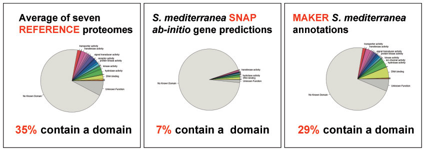
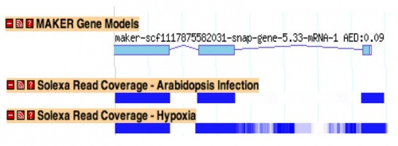
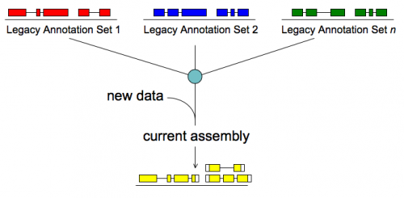

# MWAS Tutorial

From GMOD

Jump to: [navigation](#mw-navigation), [search](#p-search)

## Contents

- [1 Maker Web
  Annotation Service](#Maker_Web_Annotation_Service)
- [2 Understanding
  MWAS](#Understanding_MWAS)
  - [2.1
    Introduction to Genome
    Annotation](#Introduction_to_Genome_Annotation)
    - [2.1.1 What
      Are Annotations?](#What_Are_Annotations.3F)
    - [2.1.2
      Importance of Genome
      Annotations](#Importance_of_Genome_Annotations)
    - [2.1.3 Effect
      of Next Generation Sequencing on the Annotation
      Process](#Effect_of_Next_Generation_Sequencing_on_the_Annotation_Process)
  - [2.2 What does
    MWAS do?](#What_does_MWAS_do.3F)
  - [2.3 What sets
    MAKER and MWAS apart from other tools (*ab initio* gene predictors
    etc.)?](#What_sets_MAKER_and_MWAS_apart_from_other_tools_.28ab_initio_gene_predictors_etc..29.3F)
    - [2.3.1
      Emerging vs. Model
      Genomes](#Emerging_vs._Model_Genomes)
    - [2.3.2
      Comparison of Algorithm Performance on Model
      vs. Emerging
      Genomes](#Comparison_of_Algorithm_Performance_on_Model_vs._Emerging_Genomes)
- [3 Getting
  Started with MWAS](#Getting_Started_with_MWAS)
  - [3.1
    Registration](#Registration)
  - [3.2 Running
    MWAS with Example Data](#Running_MWAS_with_Example_Data)
  - [3.3 Details of
    What is Going on Inside of
    MWAS](#Details_of_What_is_Going_on_Inside_of_MWAS)
    - [3.3.1 Repeat
      Masking](#Repeat_Masking)
    - [3.3.2 *Ab
      Initio* Gene Prediction](#Ab_Initio_Gene_Prediction)
    - [3.3.3 EST
      and Protein Evidence
      Alignment](#EST_and_Protein_Evidence_Alignment)
    - [3.3.4
      Polishing Evidence
      Alignments](#Polishing_Evidence_Alignments)
    - [3.3.5
      Integrating Evidence to Synthesize Final
      Annotations](#Integrating_Evidence_to_Synthesize_Final_Annotations)
  - [3.4 Running
    MWAS with your Own Data](#Running_MWAS_with_your_Own_Data)
  - [3.5 MWAS Job
    Configuration](#MWAS_Job_Configuration)
    - [3.5.1 Basic
      Input Files](#Basic_Input_Files)
    - [3.5.2 Repeat
      Masking Options](#Repeat_Masking_Options)
    - [3.5.3 Gene
      Prediction Options](#Gene_Prediction_Options)
    - [3.5.4 Other
      MAKER Options](#Other_MAKER_Options)
  - [3.6 MWAS
    Results](#MWAS_Results)
  - [3.7 Viewing
    MAKER Annotations](#Viewing_MAKER_Annotations)
    - [3.7.1
      Apollo](#Apollo)
  - [3.8 Training
    *ab initio* Gene
    Predictors](#Training_ab_initio_Gene_Predictors)
  - [3.9 GFF3
    Pass-through](#GFF3_Pass-through)
  - [3.10
    mRNAseq](#mRNAseq)
  - [3.11
    Merge/Resolve Legacy
    Annotations](#Merge.2FResolve_Legacy_Annotations)

## Maker Web Annotation Service

The MAKER Web Annotation Service (MWAS) is an easily configurable
web-accesible genome annotation pipeline. It's purpose is to allow
research groups with small to intermediate amounts of eukaryotic and
prokaryotic genome sequence (i.e. BAC clones, small whole genomes,
preliminary sequencing data, etc.) to independently annotate and analyse
their data and produce output that can be loaded into a genome database.
MWAS is build on the stand alone genome annotation pipeline
[MAKER](MAKER.1 "MAKER"), and users who wish to annotate datasets that
are too large to submit to MWAS are free to
<a href="http://www.yandell-lab.org/software/" class="external text"
rel="nofollow">download MAKER</a> for use on their own systems.

  

## Understanding MWAS

The first half of this page gives general background to genome
annotation as well as describes validation data for the
[MAKER](MAKER.1 "MAKER") Web Annotation Service, MWAS. The stand alone
annotation pipeline MAKER is at the heart of MWAS, and MWAS has been
configured to present the user with configuration options that match
those of the command line program MAKER as closely as possible.

  

### Introduction to Genome Annotation

#### What Are Annotations?

Annotations are descriptions of different features of the genome, and
they can be both structural or functional in nature.

Examples:

- Structural Annotations: exons, introns, UTRs, splice forms etc.
- Functional Annotations: process a gene is involved in (metabolism),
  molecular function (hydrolase), location of expression (expressed in
  the mitochondria), etc.

  
It is especially important that all genome annotations include with
themselves an evidence trail that describes in detail the evidence that
was used to both suggest and support each annotation. This assists in
quality control and downstream management of genome annotations.

Examples of evidence supporting a structural annotation:

- *Ab initio* gene predictions
- ESTs
- Protein homology

#### Importance of Genome Annotations

Why should the average biologist care about genome annotations? Genome
sequence itself is not very useful. The main question when any genome is
sequenced is, "where are the genes?" To identify the genes we need to
annotate the genome. And while most researchers probably don't give
annotations a lot of thought, they use them everyday.

  
Examples of Annotation Databases:

- [FlyBase](Category:FlyBase "Category:FlyBase")
- [WormBase](Category:WormBase "Category:WormBase")
- [Mouse Genome Informatics Group](Category:MGI "Category:MGI")

  
Every time we use techniques such as RNAi, PCR, gene expression arrays,
targeted gene knockout, or CHIP we are basing our experiments on the
information derived from a digitally stored genome annotation. If the
annotation is correct, then these experiments should succeed; however,
if an annotation is incorrect these experiments are bound to fail. Which
brings up a major point:

- **Incorrect and incomplete genome annotations poison every experiment
  that uses them.**

Quality control and evidence management are therefore essential
components to any annotation process.

#### Effect of [Next Generation Sequencing](Next_Generation_Sequencing "Next Generation Sequencing") on the Annotation Process

It’s generally accepted that within the next few years it will be
possible to sequence even human sized genomes for as little as \$1,000
and in a short time frame. When these expectations finally become
reality, then whole genome sequencing will likely become *routine* for
even small laboratories. Unfortunately, advances in annotation
technology have not kept pace with genome sequencing, and annotation is
rapidly becoming a major bottleneck affecting modern genomics research.

For example:

- As of October 2009, 222 eukaryotic genomes were fully sequenced yet
  unpublished (this is an ever growing backlog).
- Currently *(Jan 2010)* there are over 900 eukaryotic genome projects
  underway, assuming 10,000 genes per genome, that’s 9,000,000 new
  annotations (with this many new annotations, quality control and
  maintenance become an issue).
- While there are organizations dedicated to producing and distributing
  genome annotations (i.e ENSEMBL and VectorBase), the shear volume of
  newly sequenced genomes exceeds both their capacity and stated
  purview.
- Many small research groups (which often lack bioinformatics
  experience) must therefore confront the difficulties associated with
  genome annotation on their own.

  
The MAKER Web Annotation Service is a tool to assist research groups in
converting the mountain of genomic data provided by next generation
sequencing technologies into a usable resource, and for larger datasets,
research groups can use a local installation of the annotation pipeline
MAKER.

### What does MWAS do?

- Identifies and masks out repeat elements
- Aligns ESTs to the genome
- Aligns proteins to the genome
- Produces *ab initio* gene predictions
- Synthesizes these data into final annotations
- Produces evidence-based quality values for downstream annotation
  management

  

<a
href="http://gmod.org/mediawiki/index.php?title=Special:Upload&amp;wpDestFile=Apollo_view.jpg"
class="new" title="File:Apollo view.jpg">File:Apollo view.jpg</a>

MAKER generated annotations, shown in [Apollo](Apollo.1 "Apollo").

  

### What sets MAKER and MWAS apart from other tools (*ab initio* gene predictors etc.)?

MAKER is an annotation pipeline, not a gene predictor. MAKER does not
predict genes, rather MAKER leverages existing software tools (some of
which are gene predictors) and integrates their output to produce what
MAKER believes to be the best possible gene model for a given location
based on evidence alignments.

  
gene prediction ≠ gene annotation

- gene predictions are gene models.
- gene annotations are gene models but should include a documented
  evidence trail supporting the model in addition to quality control
  metrics.

  
This may seem like just a matter of semantics since the primary output
for both *ab initio* gene predictors and the MAKER pipeline is the same,
a collection of gene models. However there are a few very significant
consequences to the differences between these programs that I will
explain shortly.

  

#### Emerging vs. Model Genomes

Emerging model organism genomes each come with there own set of issues
that are not necessarily found in classic model genomes. These include
difficulties associated with Repeat identification, gene finder
training, and other complex analyses. Unfortunately emerging model
organisms are often studied by very small research communities which
often lack the resources and bioinformatics experience necessary to
tackle these issues.

<table class="wikitable">
<colgroup>
<col style="width: 50%" />
<col style="width: 50%" />
</colgroup>
<thead>
<tr class="header">
<th>Classic Model Organisms</th>
<th>Emerging Model Organisms</th>
</tr>
</thead>
<tbody>
<tr class="odd">
<td data-valign="top">
Well developed experimental systems
</td>
<td>
New experimental systems

<ul>
<li>Genome will be the central resource for work in these systems</li>
</ul></td>
</tr>
<tr class="even">
<td data-valign="top">
Much prior knowledge about genome
</td>
<td>
Little prior knowledge about genome

<ul>
<li>Usually no genetics</li>
</ul></td>
</tr>
<tr class="odd">
<td>Large community</td>
<td>Small communities</td>
</tr>
<tr class="even">
<td>Big $</td>
<td>Less $</td>
</tr>
<tr class="odd">
<td>Examples: <em>D. melanogaster</em>, <em>C. elegans</em>, human,
etc.</td>
<td>Examples: oomycetes, flat worms, cone snail, etc.</td>
</tr>
</tbody>
</table>

#### Comparison of Algorithm Performance on Model vs. Emerging Genomes

If you have ever looked at comparisons of gene predictor performance on
classic model organisms such as *C. elegans* you would conclude that *ab
initio* gene predictors match or even outperform state of the art
annotation pipelines, and the truth is that, with enough training data,
they do. However, it is important to keep in mind that *ab initio* gene
predictors have been specifically optimized to perform well on model
organisms such as *Drosophila* and *C. elegans*, organisms for which we
have large amount of pre-existing data to both train and tweak the
prediction parameters.

  

<table class="wikitable">
<colgroup>
<col style="width: 20%" />
<col style="width: 20%" />
<col style="width: 20%" />
<col style="width: 20%" />
<col style="width: 20%" />
</colgroup>
<thead>
<tr class="header">
<th colspan="5">Table: MAKER's Performance on the <em>C. elegans</em>
genome</th>
</tr>
</thead>
<tbody>
<tr class="odd">
<th rowspan="2">
Performance

Category
</th>
<th colspan="2">Ab initio</th>
<th colspan="2">Evidence Based</th>
</tr>
<tr class="header">
<th>SNAP</th>
<th>Augustus</th>
<th>MAKER</th>
<th>Gramene</th>
</tr>
&#10;<tr class="odd">
<td colspan="5"><em>Genomic Overlap (gene)</em></td>
</tr>
<tr class="even">
<td>SP</td>
<td>82.48</td>
<td>88.09</td>
<td>91.69</td>
<td>93.49</td>
</tr>
<tr class="odd">
<td>SN</td>
<td>95.44</td>
<td>96.78</td>
<td>89.81</td>
<td>88.74</td>
</tr>
<tr class="even">
<td colspan="5"><em>Exon Overlap</em></td>
</tr>
<tr class="odd">
<td>SP</td>
<td>18.88</td>
<td>22.87</td>
<td>25.58</td>
<td>27.38</td>
</tr>
<tr class="even">
<td>SN</td>
<td>87.63</td>
<td>93.09</td>
<td>91.17</td>
<td>94.84</td>
</tr>
</tbody>
</table>

What about emerging model organisms for which little data is available?
Gene prediction in classic model organisms is relatively simple because
there are already a large number of experimentally determined and
verified gene models, but with emerging model organisms, we are lucky to
have a handful of gene models to train with. As a result *ab initio*
gene predictors generally perform very poorly on emerging genomes.

MAKER's Performance on the *S. mediterranea* Emerging Model Organism
Genome. Pfam domain content of gene models determined using rpsblast

  
By using *ab inito* gene predictors inside of the MAKER pipeline instead
of as stand alone applications you get certain benefit:

- Provide gene models as well as an evidence trail correlations for
  quality control and manual curation
- Provide a mechanism to train and retrain *ab initio* gene predictors
  for even better performance.
- Output can be easily loaded into a GMOD compatible database for
  annotation distribution (including evidence associations).
- Annotations can be automatically updated with new evidence by simply
  passing existing annotation sets back into the pipeline

## Getting Started with MWAS

#### Registration

MWAS is free to all users for academic use and has no login requirement,
but registration is recommended as it allows for easier file and job
management and registered users are allowed to upload more sequence.

### Running MWAS with Example Data

MWAS comes with some example files to familiarize the user with how to
run an annotation job. You can pre-load the fields for an example job by
selecting one of the examples from the drop down menu on the "New Job"
page and then selecting "Load". This will fill out options on the "New
Job" form for you. Review the options carefully, and then submit the
example job for execution by pressing the "Submit to Queue" button at
the bottom of the page.

Start with the "Drosophila melanogaster : DPP example". This will load
the region of the D. melanogaster genome encoding decapentaplegic along
with cDNA and protein evidence overlapping the region. Select
"Drosophila melanogaster : DPP example" from the drop down example menu.
Then select load to fill in the form.

If you scroll down through the form, you will notice that the genome
file, EST file, protein file, and prediction method sections have been
filled out for you. Click on "Submit to Queue", to start the job.

You should be redirected to the MWAS start page upon submisssion, and
the job you have submitted should be visible in the job status section.
Click "Refresh Job Status" to update the run status of your job. Within
a few moments, your job will complete, at which point you can view the
results

Click on "View Results". You can now download the results for local
analysis on your own system or you can click on "View in Apollo" to seen
gene models loaded directly in the Apollo genome browser. This option
will install a Java Web Start version of Apollo if it is not already
installed. You can also view summery statistics of the annotation from
the Sequence Ontologies SOBA tool by clickin on "SOBA Statistics".

  

### Details of What is Going on Inside of MWAS

#### Repeat Masking

MWAS runs MAKER internally, an the first step to MAKER is repeat
masking, but why do we need to do this? Repetitive elements can make up
a significant portion of the genome. Some of these repeats are
simple/low-complexity repeats where you have runs of C's or G's or maybe
even something like AAGGAAGGAAGG. Other repeats are more complex, *i.e.*
transposable elements. These high-complexity repeats often encode real
proteins like rerotranscriptase or even Gag, Pol, and Env viral
proteins. Because they encode real proteins, they can play havoc with
*ab initio* gene predictors. For example, a transposable element that
occurs next to or even within the intron of a real protein encoding gene
might cause a gene predictor to include extra exons as part of a gene
model, sequence which really only belongs to the transposable element
and not to the coding sequence of the gene. You will also get hundreds
of instances where identical transportable element proteins get
annotated as being part of an organisms proteome. In addition these
issues, low-complexity repeat regions can align with high statistical
significance to low-complexity protein regions creating a false sense of
homology throughout the genome. To avoid these complications it is
convenient to identify and mask any repeat elements before doing other
analyses.

  
MAKER identifies repeats in two steps.

- First a program called RepeatMasker is used to identify low-complexity
  and high-complexity repeats that match entries in the RepBase repeat
  library, or any species specific repeat library supplied by the user.
- Next MAKER uses RepeatRunner to identify transposable element and
  viral proteins from the RepeatRunner protein database. Because protein
  sequence diverges at a slower rate than nucleotide sequence, this step
  helps pick up the most problematic regions of divergent repeats that
  are missed by RepeatMasker, which searches in nucleotide space.

  
Regions identified during repeat analysis are masked out so as not to
complicate other downstream annotation analyses.

- High-complexity repeats are hard-masked, a technique in which
  nucleotide sequence is replaced with the letter N to prohibit any
  alignments to that region.
- Low-complexity regions are soft-masked, a technique in which
  nucleotides are made lower case so they can be treated as masked under
  certain situations without losing sequence information. I will discuss
  some of the applications and effects of soft-masking later.

  
Now the idea of masking out sequence might seem on the surface like
we're losing a lot of information, and it is true that there can be
proteins that have integrated repeats into their structure, so repeat
masking will affect our ability to annotate these proteins. However,
these proteins are rare and the number of gene models and homology
alignments improved by this step far exceed the few gene models that may
be negatively affected.

#### *Ab Initio* Gene Prediction

Following repeat masking, MAKER runs *ab initio* gene predictors
specified by the user to produce preliminary gene models. *Ab initio*
gene predictors produce gene predictions based on underlying
mathematical models describing patterns of intron/exon structure and
consensus start signals. Gene models are not produced by directly using
experimental evidence. Because the patterns of gene structure are going
to differ from organism to organism, you must train gene predictors
before you can use them. I will discuss how to do this later on.

  
MAKER currently supports:

- SNAP
- Augustus
- GeneMark
- FGENESH (Disabled on public MWAS site)

  
You must specify HMM files you want to use use when running each of
these algorithms.

#### EST and Protein Evidence Alignment

A simple way to indicate if a sequence region is likely associated with
a gene is to identify (A) if the region is actively being transcribed or
(B) if the region has homology to a known protein. This can be done by
aligning Expressed Sequence Tags (ESTs) and proteins to the genome using
alignment algorithms.

- ESTs are sequences derived from a cDNA library. Because of the
  difficulties associated with working with mRNA and depending on how
  the cDNA library was prepared, EST databases usually represent bits
  and pieces of transcribed mRNAs with only a few full length
  transcripts. MAKER aligns these sequences to the genome using BLASTN.
  If ESTs from the organism being annotated are unavailable or sparse,
  you can use ESTs from a closely related organism. However, ESTs from
  closely related organisms are unlikely to align using BLASTN since
  nucleotide sequences can diverge quite rapidly. For these ESTs, MAKER
  uses TBLASTX to align them in protein space.
- Protein sequence generally diverges quite slowly over large
  evolutionary distances, as a result proteins from even evolutionarily
  distant organisms can be aligned against raw genomic sequence to try
  and identify regions of homology. MAKER does this using BLASTX.

  
Remember now that we are aligning against the repeat-masked genomic
sequence. How is this going to affect our alignments? For one thing we
won't be able to align against low-complexity regions. Some real
proteins contain low-complexity regions and it would be nice to identify
those, but if I let anything align to a low-complexity region, then I
will get spurious alignments all over the genome. Wouldn't it be nice if
there was a way to allow BLAST to extend alignments through
low-complexity regions, but only if there is is already alignment
somewhere else? You can do this with soft-masking. If you remember
soft-masking is using lower case letters to mask sequence without losing
the sequence information. BLAST allows you to use soft-masking to keep
alignments from seeding in low-complexity regions, but allows you to
extend through them. This of course will allow some of the spurious
alignments you were trying to avoid, but overall you still end up
suppressing the majority of poor alignments while letting through enough
real alignments to justify the cost.

#### Polishing Evidence Alignments

Because of oddities associated with how BLAST statistics work, BLAST
alignments are not as informative as they could be. BLAST will align
regions any where it can, even if the algorithm aligns regions out of
order, with multiple overlapping alignments in the exact same region, or
with slight overhangs around splice sites.

  
To get more informative alignments MAKER uses the program Exonerate to
polish BLAST hits. Exonerate realigns each sequences identified by BLAST
around splice sites and forces the alignments to occur in order. The
result is a high quality alignment that can be used to suggest near
exact intron/exon positions. Polished alignments are produced using the
`est2genome` and `protein2genome` options for Exonerate.

  
One of the benefits of polishing EST alignments is the ability to
identify the strand an EST derives from. Because of amplification steps
involved in building an EST library and limitations involved in some
high throughput sequencing technologies, you don't necessarily know
whether you're really aligning the forward or reverse transcript of an
mRNA. However, if you take splice sites into account, you can only align
to one strand correctly.

  

#### Integrating Evidence to Synthesize Final Annotations

Once you have *ab initio* predictions, EST alignments, and protein
alignments you can integrate this evidence to produce even better gene
predictions. MAKER does this by "talking" to the gene prediction
programs. MAKER takes all the evidence, generates "hints" to where
splice sites and protein coding regions are located, and then passes
these "hints" to programs that will accept them.

  
MAKER produces hint based predictors for:

- SNAP
- Augustus
- FGENESH
- GeneMark (under development)

  
MAKER then takes the entire pool of *ab initio* and evidence informed
gene predictions, updates features such as 5' and 3' UTRs based on EST
evidence, tries to determine alternative splice forms where EST data
permits, produces quality control metrics for each gene model (this is
included in the output), and then MAKER chooses from among all the gene
model possibilities the one that best matches the evidence. This is done
using a modified sensitivity/specificity distance metric.

  

  

### Running MWAS with your Own Data

When using your own data, you need to tell MWAS all the details about
how you want the annotation process to proceed. Because there can be
many variables and options involved in annotation you will need to
review each option carefully. At the very least you should provide a
genome sequence file, an EST sequence file, and a protein homology
sequence file for new annotation jobs.

### MWAS Job Configuration

#### Basic Input Files

All the basic input files for MWAS should be in fasta format.

- *genome* - Genomic sequence file
- *est* - ESTs from the same organism or from a very very closely
  related organism (i.e. chimpanzee to human). These are aligned first
  via BLASTN with very strict filtering so any sequence divergence can
  prohibit the alignment.
- *altest* - These are ESTs from other closely related organisms (i.e.
  mouse to human). They are aligned via TBLASTX in protein space, so
  greater sequence divergence is permitted.
- *protein* - proteins from the same or other organisms. These are
  aligned via BLASTX against the genome. Proteins that align to a region
  will not necessarily be orthologous or paralogous. The alignment may
  just be based on short regions such as a shared domain. You may also
  get alignments to pseudogenes. Polishing BLASTX hits with Exonerate
  helps identify what are likely true paralogs and orthologs.

  

#### Repeat Masking Options

Repeat masking is important for improving gene predictor performance and
avoiding protein alignments to what are likely just transposons. You
also expect a certain amount of genomic contamination in the EST
database, much of this contamination maps back to repeat regions. By
repeat masking we can avoid issues with all types of input data.

  

- *RepeatMasker* - Performs repeat masking using the RepBase libraries.
- *RepeatRunner* - This is a fasta file of transposon and virus related
  proteins. The serve provides an internal database to use by default.
- Users can also supply a fasta file of species specific nucleotide
  repeats or a GFF3 file of pre-defined repeat regions. Species specific
  repeat database can be built using programs like PILER and uploaded
  for use with MAKER.

  

#### Gene Prediction Options

Gene prediction options affect the final gene annotations more than any
other option type. This brings up the point that electronically produced
gene annotations will only be as good as the gene predictions they are
based on.

  

- *Predictor Options* - Tell MWAS which programs to use when generating
  gene models.
  - SNAP
  - Augustus
  - GeneMark
  - Est2Genome - Allows high quality spliced Exonerate EST alignments to
    become gene annotations. This only happens when there is no gene
    prediction overlapping the region. This is useful for generating
    gene annotations in the absence of a trained gene predictor.
  - Protein2Genome - Used only for Prokaryotic genomes. Will try and
    build gene models based solely on the presence of open reading
    frames and protein alignments to other species.
  - User supplied gene predictions - These are gene predictions in GFF3
    format from any source you have available to you. They will be
    treated the same as any gene predictions derived from MWAS supported
    sources.
  - User supplied gene models - These are pre-existing gene models from
    the same assembly as the contigs being annotated. They can be
    integrated and automatically updated by MAKER to reflect new
    evidence (i.e. add UTR etc.). MAKER can also pull names forward from
    these pre-existing gene models onto new updated genome annotations.

#### Other MAKER Options

- Sets the minimum length a contig must have or else it will be skipped.
- Sets the minimum length a predicted protein must have (in amino acids)
  to be annotated.
- Set the expected max intron size for evidence alignments
- Tells MAKER to consider single exon EST evidence when generating
  annotations. Single exon ESTs are more likely to be genomic
  contamination.
- 'Sets the minimum length required for single exon ESTs if
  'single_exon' is enabled

### MWAS Results

The results provided to the user from the MWAS can either be downloaded
or directly viewed online using a Java Web Start version of the Apollo
genome annotation curration tool.

If you choose to download your data you will be presented with a tarball
that when unpacked will produce an output directory called something
like `2434.maker.output`. The name of the output directory is based off
of the job id assigned to your sequence file.

  
When you examine the contents of this directory, you should see a list
of directories and files created by MAKER.

    drwxr-xr-x 3 gmod gmod 4096 2009-07-12 23:23 2434_datastore
    -rw-r--r-- 1 gmod gmod  135 2009-07-12 23:27 2434_master_datastore_index.log
    -rw-r--r-- 1 gmod gmod 1579 2009-07-12 23:23 maker_bopts.log
    -rw-r--r-- 1 gmod gmod 1250 2009-07-12 23:23 maker_exe.log
    -rw-r--r-- 1 gmod gmod 4016 2009-07-12 23:23 maker_opts.log
    drwxr-xr-x 2 gmod gmod 4096 2009-07-12 23:23 mpi_blastdb

- The `maker_opt.log`, `maker_exe.log`, and `maker_bopts.log` files are
  logs of the control files used for this run of MAKER.
- The `mpi_blastdb` directory contains
  [fasta](Glossary#FASTA "Glossary") indexes and BLAST database files
  created from the input EST, protein, and repeat databases.
- The `2434_master_datastore_index.log` contains information on both the
  run status of individual contigs and information on where individual
  contig data is stored.
- The `2434_datastore` directory contains a set of subfolders, each
  containing the final MAKER output for individual contigs from the
  genomic fasta file.

  
Once a MAKER run is finished the most important file to look at is the
`2434_master_datastore_index.log` to see if there were any failures.

    less 2434_master_datastore_index.log.  MWAS provides a summery of this file when you click on results to download a job.  MWAS also displays run errors in the log option button that you can click on when in the MWAS main queue page.

If everything proceeded correctly you should see the following in your
2434_master_datastore_index.log file.

    contig-dpp-500-500      2434_datastore/contig-dpp-500-500 STARTED
    contig-dpp-500-500      2434_datastore/contig-dpp-500-500 FINISHED

  
There are only entries describing a single contig because there was only
one contig in the example file. These lines indicate that the contig
'contig-dpp-500-500' STARTED and then FINISHED without incident. Other
possible entries include:

- DIED - indicates a failed run on this contig, MAKER will retry these
- RETRY - indicates that MAKER is retrying a contig that failed
- SKIPPED_SMALL - indicates the contig was too short
- DIED_SKIPPED_PERMANENT - indicates a failed contig that MAKER will not
  attempt to retry

  
The entries in the `2434_master_datastore_index.log` file also indicate
that the output files for this contig are stored in the directory
dpp_contig_datastore/contig-dpp-500-500/. Knowing where the output is
stored may seem rather trivial; however, input genome fasta files can
contain thousands even hundreds-of-thousands of contigs, and many
file-systems have performance problems with large numbers of
sub-directories and files within a single directory. Even when the
underlying file-systems handle things gracefully, access via network
file-systems can be an issue. To deal with this situation, MAKER uses a
datastore module to create a hierarchy of sub-directory layers, starting
from a 'base', and mapping identifiers to corresponding sub-directories.
For situations where the input genome fasta file contains more than
1,000 contigs, the datastore structure is used automatically, and the
`master_datastore_index.log` file becomes essential for identifying
where the output for a given contig is stored.

  
now let's take a look at what MAKER produced for the contig
'contig-dpp-500-500'.

    cd 2434_datastore/contig-dpp-500-500
    ls -l

The directory should contain a number of files.

    -rw-r--r-- 1 gmod gmod 47437 2009-07-12 23:27 contig-dpp-500-500.gff
    -rw-r--r-- 1 gmod gmod   189 2009-07-12 23:27 contig-dpp-500-500.maker.non_overlapping_ab_initio.proteins.fasta
    -rw-r--r-- 1 gmod gmod   399 2009-07-12 23:27 contig-dpp-500-500.maker.non_overlapping_ab_initio.transcripts.fasta
    -rw-r--r-- 1 gmod gmod   704 2009-07-12 23:27 contig-dpp-500-500.maker.proteins.fasta
    -rw-r--r-- 1 gmod gmod   901 2009-07-12 23:27 contig-dpp-500-500.maker.snap_masked.proteins.fasta
    -rw-r--r-- 1 gmod gmod  4837 2009-07-12 23:27 contig-dpp-500-500.maker.snap_masked.transcripts.fasta
    -rw-r--r-- 1 gmod gmod  4430 2009-07-12 23:27 contig-dpp-500-500.maker.transcripts.fasta

  

- The `contig-dpp-500-500.gff` contains all annotations and evidence
  alignments in [GFF3](GFF3 "GFF3") format. This is the important file
  for use with [Apollo](Apollo.1 "Apollo") or
  [GBrowse](GBrowse.1 "GBrowse").
- The `contig-dpp-500-500.maker.transcripts.fasta` and
  `contig-dpp-500-500.maker.proteins.fasta` files contain the transcript
  and protein sequences for MAKER produced gene annotations.
- The `contig-dpp-500-500.maker.snap_masked.transcripts.fasta` and
  `contig-dpp-500-500.maker.snap_masked.proteins.fasta` files contain
  the transcript and protein sequences for all SNAP *ab initio* gene
  predictions. If you use other *ab initio* gene predictors, those
  sequence files will follow a similar naming pattern.
- The
  `contig-dpp-500-500.maker.non_overlapping_ab_initio.transcripts.fasta`
  and
  `contig-dpp-500-500.maker.non_overlapping_ab_initio.proteins.fasta`
  files contain the set of best *ab initio* gene predictions that do not
  overlap a MAKER gene annotation. These files can be analyzed to see if
  there is any reason to promote them to the status of gene annotations.
  For example: you can run iprscan to see if they contain known protein
  domains.

### Viewing MAKER Annotations

Viewing the raw [GFF3](GFF3 "GFF3") file produced by MAKER really isn't
that meaningful.

  
For sanity checking purposes it would be nice to have a graphical view
of what's in the GFF3 file. To do this GFF3 files can be loaded into
programs like [Apollo](Apollo.1 "Apollo") and
[GBrowse](GBrowse.1 "GBrowse"). MWAS allows you to view the files in
Apollo directly on the website. You can also get summery statistics of
annotation features using the tool SOBA from the Sequence Ontology
Consortium.

  

#### Apollo

On the results screen choose a contig from a job and click "View in
Apollo". A Java Web Start version of Apollo will then install itself
automatically on your computer, if not already installed. Apollo will
then automatically load the contig you indicated into the browser. You
will notice that there are a number of bars representing the gene
annotations and the evidence alignments supporting those annotations.
Annotations are in the middle light colored panel, and evidence
alignments are in the dark panels at the top and bottom.

  
All the evidence in the dark panels will be a different color depending
on the source each piece of evidence was derived from (i.e.
RepeatMasker, BLASTX, etc.). To identify which source a feature belongs
to, just manually clicking on one and the name of the source will be
displayed in the table at the bottom of the Apollo screen.

Possible Sources Include:

- BLASTN - BLASTN alignment of EST evidence
- BLASTX - BLASTX alignment of protein evidence
- TBLASTX - TBLASTX alignment of EST evidence from closely related
  organisms
- EST2Genome - Polished EST alignment from Exonerate
- Protein2Genome - Polished protein alignment from Exonerate
- SNAP - SNAP *ab inito* gene prediction
- GENEMARK - GeneMark*ab inito* gene prediction
- Augustus - Augustus *ab inito* gene prediction
- FgenesH - FGENESH *ab inito* gene prediction
- Repeatmasker - RepeatMasker identified repeat
- RepeatRunner - RepeatRunner identified repeat from the repeat protein
  database

### Training *ab initio* Gene Predictors

If you are involved in a genome project for an emerging model organism,
you should already have an EST database which would have been generated
as part of the original sequencing project. A protein database can be
collected from closely related organism genome databases or by using the
UniProt/SwissProt protein database or the NCBI NR protein database.
However a trained *ab initio* gene predictor is a much more difficult
thing to generate. Gene predictors require existing gene models on which
to base prediction parameters. However, with emerging model organisms
there are no pre-existing gene models. So how then are you supposed to
train your gene prediction programs?

  
MWAS gives the user the option to produce gene annotations directly from
the EST evidence. You can then use these imperfect gene models to train
gene predictor program. Once you have re-run MWAS with the newly trained
gene predictor, you can use the second set of gene annotations to train
the gene predictors yet again. This boot-strap process allows you to
iteratively improve the performance of *ab initio* gene predictors.

### GFF3 Pass-through

What if I'm not working on a new genome project, but rather I have an
existing annotation set, and I just want to update my genome database to
reflect new protein and EST evidence. Here you can use a feature in
MAKER called GFF3 pass-through, which allows you to pass existing
annotations into the program and combine them with new evidence for use
in the annotation process.

### mRNAseq

mRNAseq is a high throughput technique for sequencing the entire
transcriptome, and it holds the promise of allowing researchers to
identify all exons and alternative splice forms for every gene in the
genome with a single experiment. It may soon make gene predictors
(mostly) a thing of the past.

- Still need to de-convolute reads & evidence (for now)
- Still need to archive, manage, and distribute annotations

  

  
We are currently working on native support for mRNAseq data within the
MAKER pipeline. However, because of the GFF3 pass-through option, there
is a way to take advantage of mRNAseq reads right now. By mapping
mRNAseq reads using BowTie and TopHat, you can create GFF3 files of read
islands and junctions. This data can then be passed in as EST evidence
and will be used for generating hint based gene prediction and for
choosing final annotations.

  

### Merge/Resolve Legacy Annotations

Legacy annotations

- Many are no longer maintained by original creators
- In some cases more than one group has annotated the same genome, using
  very different procedures, even different assemblies
- Many investigators have their own genome-scale data and would like a
  private set of annotations that reflect these data
- There will be a need to revise, merge, evaluate, and verify legacy
  annotation sets in light of RNA-seq and other data

  

  
MAKER will:

- Identify legacy annotation most consistent with new data
- Automatically revise it in light of new data
- If no existing annotation, create new one

Retrieved from
"<http://gmod.org/mediawiki/index.php?title=MWAS_Tutorial&oldid=21887>"

[Categories](Special:Categories "Special:Categories"):

- <a
  href="http://gmod.org/mediawiki/index.php?title=Category:Pages_with_broken_file_links&amp;action=edit&amp;redlink=1"
  class="new"
  title="Category:Pages with broken file links (page does not exist)">Pages
  with broken file links</a>
- [MAKER](Category:MAKER "Category:MAKER")
- [Tutorials](Category:Tutorials "Category:Tutorials")

## Navigation menu

### Namespaces

- <a
  href="http://gmod.org/mediawiki/index.php?title=Talk:MWAS_Tutorial&amp;action=edit&amp;redlink=1"
  accesskey="t"
  title="Discussion about the content page [t]">Discussion</a>

### 

### Variants

### Navigation

- [GMOD Home](Main_Page)
- [Software](GMOD_Components)
- [Categories /
  Tags](Categories)

### Documentation

- [Overview](Overview)
- [FAQs](Category:FAQ)
- [HOWTOs](Category:HOWTO)
- [Glossary](Glossary)

### Community

- [GMOD News](GMOD_News)
- [Training /
  Outreach](Training_and_Outreach)
- [Support](Support)
- [GMOD Promotion](GMOD_Promotion)
- [Meetings](Meetings)
- [Calendar](Calendar)

### Tools

- <a href="Special:Browse/MWAS_Tutorial" rel="smw-browse">Browse
  properties</a>

- Last updated at 22:03 on 3 October
  2012.
<!-- - 119,997 page views. -->
- Content is available under
  <a href="http://www.gnu.org/licenses/fdl-1.3.html" class="external"
  rel="nofollow">a GNU Free Documentation License</a> unless otherwise
  noted.

<!-- -->

- [About
  GMOD](GMOD:About "GMOD:About")

<!-- -->

