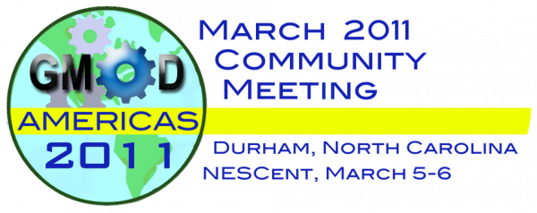
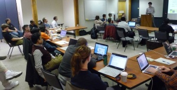
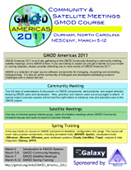

# March 2011 GMOD Meeting

From GMOD

Jump to: [navigation](#mw-navigation), [search](#p-search)

  

  
This [GMOD community meeting](Meetings "Meetings") was held March 5-6
2011, at <a href="http://www.nescent.org/" class="external text"
rel="nofollow">NESCent</a> in Durham, North Carolina, as part of [GMOD
Americas 2011](GMOD_Americas_2011 "GMOD Americas 2011"), which also
included [Satellite
Meetings](Satellite_Meetings_-_GMOD_Americas_2011 "Satellite Meetings - GMOD Americas 2011"),
and a [GMOD
Course](2011_GMOD_Spring_Training "2011 GMOD Spring Training").

For the first time, the meeting was preceded by a GMOD Overview session
the night before. This session was intended to help GMOD newcomers (of
which there are usually many) learn the big picture in GMOD and get the
most out of the meeting that follows.

This meeting was [hosted and
sponsored](GMOD_Americas_2011#Sponsor "GMOD Americas 2011") by
<a href="http://www.nescent.org" class="external text"
rel="nofollow">NESCent</a>.

[GMOD Meetings](Meetings "Meetings") are a mix of
[user](GMOD_Membership#Users "GMOD Membership") and
[developer](GMOD_Membership#Developers "GMOD Membership") presentations,
and are a great place to find out what is happening in the project,
what's coming up, and what others are doing.

The next meeting will be held in [October
2011](October_2011_GMOD_Meeting "October 2011 GMOD Meeting") at the
<a href="http://oicr.on.ca/" class="external text"
rel="nofollow">Ontario Institute for Cancer Research (OICR)</a> in
Toronto, Canada. OICR is the current home of both
[GBrowse](GBrowse.1 "GBrowse") and [BioMart](BioMart "BioMart").

  

## Contents

- [1 About
  GMOD](#About_GMOD)
- [2
  Registration](#Registration)
- [3 GMOD Americas
  Events](#GMOD_Americas_Events)
- [4
  Agenda](#Agenda)
  - [4.1 Friday:
    Introduction to GMOD](#Friday:_Introduction_to_GMOD)
  - [4.2 Saturday:
    Day 1](#Saturday:_Day_1)
  - [4.3 Sunday:
    Day 2](#Sunday:_Day_2)
  - [4.4 Monday:
    Satellite Meetings](#Monday:_Satellite_Meetings)
- [5
  Participants](#Participants)
- [6 Help Get the
  Word Out](#Help_Get_the_Word_Out)
- [7
  Logistics](#Logistics)
- [8
  Feedback](#Feedback)

# About GMOD

**GMOD** is the Generic Model Organism Database project, a collection of
interoperable open-source [software
components](GMOD_Components "GMOD Components") for annotating,
visualizing, managing and analyzing biological data. GMOD is also an
active community of software developers and biologists addressing common
challenges with their data.

The GMOD suite includes widely used tools such as
[GBrowse](GBrowse.1 "GBrowse") and [JBrowse](JBrowse.1 "JBrowse") (and
[WebGBrowse](WebGBrowse.1 "WebGBrowse")) for genome browsing,
[Apollo](Apollo.1 "Apollo") and [MAKER](MAKER.1 "MAKER") for genome
annotation, [GBrowse_syn](GBrowse_syn.1 "GBrowse syn") and
[CMap](CMap.1 "CMap") for comparative genomics visualization,
<a href="Chado" class="mw-redirect" title="Chado">Chado</a>,
[BioMart](BioMart "BioMart") and [InterMine](InterMine "InterMine") for
data integration, management, and querying, and
[Galaxy](Galaxy.1 "Galaxy") and
<a href="Ergatis" class="mw-redirect" title="Ergatis">Ergatis</a> (and
[ISGA](ISGA "ISGA")) for data analysis.

# Registration

The registration fee for the **March 2011 GMOD Meeting** was

- **\$80 on or before February 18**
- **\$95 after February 18**

The [Satellite
Meetings](Satellite_Meetings_-_GMOD_Americas_2011 "Satellite Meetings - GMOD Americas 2011")
were free and were attended by over 20 people.

# GMOD Americas Events

The schedule of events is below. This is subject to slight revisions.

<table class="wikitable" data-border="1" data-cellpadding="5"
data-cellspacing="0">
<colgroup>
<col style="width: 20%" />
<col style="width: 20%" />
<col style="width: 20%" />
<col style="width: 20%" />
<col style="width: 20%" />
</colgroup>
<thead>
<tr class="header">
<th width="5%"
style="background-color: #99ccff; font-size: 140%; line-height: 130%"><a
href="GMOD_Americas_2011" title="GMOD Americas 2011">G 
M 
O 
D 
  
A 
M 
E 
R 
I 
C 
A 
S 
  
2 
0 
1 
1 
</a></th>
<th width="12%" style="background-color: #99ccff">Date</th>
<th width="15%" style="background-color: #99ccff">Time</th>
<th colspan="2" width="68%" style="background-color: #99ccff">Event</th>
</tr>
</thead>
<tbody>
<tr class="odd">
<td colspan="4"></td>
<td></td>
</tr>
<tr class="even">
<td style="background-color: #bbffff">Friday 
March 4</td>
<td style="background-color: #ccffff">7pm-9pm</td>
<td colspan="2"
style="text-align: center; background-color: #ddffff;"><strong><a
href="March_2011_GMOD_Meeting#Friday:_Introduction_to_GMOD"
title="March 2011 GMOD Meeting">Introduction to GMOD</a></strong> 
An overview of the GMOD project for GMOD newcomers, the night before the
meeting starts. If you are new to GMOD this will give you the background
you need to get the most out of the Community Meeting.</td>
<td></td>
</tr>
<tr class="odd">
<td colspan="4"></td>
<td></td>
</tr>
<tr class="even">
<td style="background-color: #bbffff">Saturday 
March 5</td>
<td style="background-color: #ccffff">9am-5pm</td>
<td colspan="2" rowspan="2"
style="text-align: center; background-color: #ddffff;"><strong><strong>GMOD
Community Meeting</strong></strong> 
Talks and discussions on <a href="GMOD_Components"
title="GMOD Components">GMOD Components</a>, project direction and
planning, best practices, recent developments, extensions, ... 
&#10;
<strong>See <a href="#Agenda">Agenda</a> and <a
href="#Agenda_Proposals">Agenda Proposals</a> for
details.</strong>
</td>
<td></td>
</tr>
<tr class="odd">
<td style="background-color: #bbffff">Sunday 
March 6</td>
<td style="background-color: #ccffff">9am-5pm</td>
<td></td>
</tr>
<tr class="even">
<td colspan="4"></td>
<td></td>
</tr>
<tr class="odd">
<td style="background-color: #bbffcc">Monday 
March 7</td>
<td style="background-color: #ccffdd">8:30am-5pm</td>
<td style="text-align: center; background-color: #ddffdd;"><strong><a
href="Satellite_Meetings_-_GMOD_Americas_2011"
title="Satellite Meetings - GMOD Americas 2011">Satellite
Meetings</a></strong> 
GMOD special interest groups and birds-of-a-feather meetings where GMOD
community members can discuss topics of common interest. 
&#10;
If you are attending the Community Meeting, you are strongly
encouraged to also attend a <a
href="Satellite_Meetings_-_GMOD_Americas_2011"
title="Satellite Meetings - GMOD Americas 2011">Satellite Meeting</a> as
well.
</td>
<td></td>
<td></td>
</tr>
<tr class="even">
<td colspan="4"></td>
<td></td>
</tr>
<tr class="odd">
<td style="background-color: #ffffaa">Tue-Sat 
March 8-12</td>
<td style="background-color: #ffffbb">All Day</td>
<td style="text-align: center; background-color: #ffffcc;"><strong><a
href="2011_GMOD_Spring_Training" title="2011 GMOD Spring Training">2011
GMOD Spring Training</a></strong>

A week long hands-on course on GMOD Component installation,
configuration, and usage. The course will cover these components in
detail:

<strong><a href="Apollo.1" title="Apollo">Apollo</a> • <a
href="MAKER.1" title="MAKER">MAKER</a> • <a href="GBrowse.1"
title="GBrowse">GBrowse</a> • <a href="Chado" class="mw-redirect"
title="Chado">Chado</a> • <a href="InterMine"
title="InterMine">InterMine</a> • <a href="JBrowse.1"
title="JBrowse">JBrowse</a> • <a href="GBrowse_syn.1"
title="GBrowse syn">GBrowse_syn</a> • <a href="Tripal.1"
title="Tripal">Tripal</a> • <a href="Galaxy.1"
title="Galaxy">Galaxy</a></strong>

</td>
<td></td>
<td></td>
</tr>
</tbody>
</table>

# Agenda

Guest Speaker:
<a href="http://www4.ncsu.edu/~eastone2/" class="external text"
rel="nofollow">Dr. Eric Stone</a>

Assistant Professor of
<a href="http://www4.ncsu.edu/~eastone2/" class="external text"
rel="nofollow">Genetics</a> and
<a href="http://www.stat.ncsu.edu/people/stone/" class="external text"
rel="nofollow">Statistics</a>  
<a href="http://statgen.ncsu.edu/brcwebsite/home.php"
class="external text" rel="nofollow">Bioinformatics Research Center</a>  
<a href="http://www.ncsu.edu/" class="external text"
rel="nofollow">North Carolina State University</a>

Our guest speaker was
<a href="http://www4.ncsu.edu/~eastone2/" class="external text"
rel="nofollow">Dr. Eric Stone</a> of North Carolina State University.
Eric will speak on his experience with the <a
href="http://service004.hpc.ncsu.edu/mackay/Good_Mackay_site/DBRP.html"
class="external text" rel="nofollow"><em>Drosophila</em> Genetic
Reference Panel (DGRP)</a>, a project using 192 inbred lines to detect
"polymorphisms (SNPs and indels) with a minor allele frequency of 0.02
or greater." A project with the scope of the DGRP poses unique
challenges in areas that GMOD focuses on. Eric discussed the scope of
the project, the types of data being generated, some of the scientific
goals, and community needs and solutions with respect to visualization,
data management, annotation, and providing useful and informative access
to that much data. As sequencing prices continue to drop, many GMOD
users may be doing similarly large projects in the not too distant
future.

  

## Friday: Introduction to GMOD

This session the night before the meting gave an introduction to the
GMOD project, community, and components. It gave GMOD newcomers a
clearer picture of the project in advance of the meeting.

| Time   | Topic                    | Presenter(s)                          | Links |
|--------|--------------------------|---------------------------------------|-------|
| 7pm-9m | **Introduction to GMOD** | [Scott Cain](User:Scott "User:Scott") |       |

## Saturday: Day 1

| Time | Topic | Presenter(s) | Links |
|----|----|----|----|
| 9:15 | Introductions | [Scott Cain](User:Scott "User:Scott") |  |
| 9:35 | Welcome to NESCent, & opportunities at the center | [Todd Vision](User:Tjvision "User:Tjvision") | <a href="../mediawiki/images/c/c8/Tjv.gmod11.pdf" class="internal"
title="Tjv.gmod11.pdf">slides</a> |
| 9:50 | The State of GMOD | [Scott Cain](User:Scott "User:Scott") | <a href="../mediawiki/images/a/a5/State_of_gmod.ppt" class="internal"
title="State of gmod.ppt">PPT</a> |
| 10:35 | Coffee |  |  |
| 10:50 | [GMOD Help Desk](GMOD_Help_Desk "GMOD Help Desk") Update | [Dave Clements](User:Clements "User:Clements") | <a href="../mediawiki/images/6/69/March2011GMODHelpDesk.ppt"
class="internal" title="March2011GMODHelpDesk.ppt">PPT</a> |
| 11:55 | Lunch |  |  |
| 1:15 | *Drosophila* Genetic Reference Panel (DGRP) | Eric Stone |  |
| 2:00 | GSA and GMOD | Elizabeth Ruedi | <a href="../mediawiki/images/f/fd/March2011GSAandGMOD.pptx"
class="internal" title="March2011GSAandGMOD.pptx">PPT</a> |
| 2:30 | Coffee |  |  |
| 3:00 | Mashing up InterMine: An introduction to the new InterMine webservice features | [Alex Kalderimis](User:Alexkalderimis "User:Alexkalderimis") | Slides? |
| 3:45 | Mimosa: Miniature Model Organism Sequence Aligner | [Jonathan "Duke" Leto](User:Dukeleto "User:Dukeleto") | <a
href="https://github.com/leto/presentations/raw/master/2011/GMOD/pres.pdf"
class="external text" rel="nofollow">Slides</a> |
| 4:30 | Head out for dinner |  |  |

## Sunday: Day 2

This agenda will be finalized prior to the meeting. In the meantime,
please see the [confirmed speakers list](#Confirmed_Speakers).

| Time | Topic | Presenter(s) | Links |
|----|----|----|----|
| 9:15 | [JBrowse](JBrowse.1 "JBrowse") Project Update | [Mitch Skinner](User:MitchSkinner "User:MitchSkinner") | <a
href="http://jbrowse.org/info/GMOD_Mar_2011/JBrowse_GMOD_Meeting_2011.pdf"
class="external text" rel="nofollow">Slides</a> |
| 10:00 | [Tripal](Tripal.1 "Tripal") Project Update | Lacey Sanderson | <a
href="../mediawiki/images/e/ef/LaceySanderson_Tripal_GMODAmericas2011.pptx"
class="internal"
title="LaceySanderson Tripal GMODAmericas2011.pptx">Slides</a> |
| 10:45 | Break |  |  |
| 11:10 | [Galaxy](Galaxy.1 "Galaxy") for high-throughput sequence data analysis | [Dave Clements](User:Clements "User:Clements") |  |
| 12:00 | Lunch |  |  |
| 1:00 | Implementation of RNA-Seq data in <a href="Chado" class="mw-redirect" title="Chado">Chado</a> at FlyBase | Dave Emmert | <a
href="../mediawiki/images/5/52/DaveEmmert_RNAseq_Tripal_GMODAmericas2011.pdf"
class="internal"
title="DaveEmmert RNAseq Tripal GMODAmericas2011.pdf">Slides</a> |
| 2:00 | Lightning talks: |  |  |
|  | <a href="Ergatis" class="mw-redirect" title="Ergatis">Ergatis</a> | [Chris Hemmerich](User:Chemmeri "User:Chemmeri") |  |
|  | [ISGA](ISGA "ISGA") | [Chris Hemmerich](User:Chemmeri "User:Chemmeri") |  |
|  | Coffee break |  |  |
|  | [Modware](Modware "Modware"): Its latest development using Moose and [Bio::Chado::Schema](Bio::Chado::Schema "Bio::Chado::Schema") | Siddhartha Basu | <a href="../mediawiki/images/6/6e/March2011Modware.ppt" class="internal"
title="March2011Modware.ppt">PPT</a>, <a href="http://slidesha.re/i3WYZ1" class="external text"
rel="nofollow">Slideshare</a> |
|  | Developing genome sequencing for identification, detection, and control of *Bactrocera dorsalis (Hendel)* and other Tephritid pests | Tom Walk | <a href="../mediawiki/images/4/44/March20111TomWalk.pptx"
class="internal" title="March20111TomWalk.pptx">PPT</a> |
|  | <a href="http://cas-bioinfo.cas.unt.edu/gsv" class="external text"
rel="nofollow">Genome Synteny Viewer</a> | Kashi Ravenna | [PPT](March2011GenomeSyntenyViewer.pptx "March2011GenomeSyntenyViewer.pptx") |

## Monday: [Satellite Meetings](Satellite_Meetings_-_GMOD_Americas_2011 "Satellite Meetings - GMOD Americas 2011")

[GMOD Americas 2011](GMOD_Americas_2011 "GMOD Americas 2011") continued
on Monday with partial and full day [Satellite
Meetings](Satellite_Meetings_-_GMOD_Americas_2011 "Satellite Meetings - GMOD Americas 2011").

# Participants

| First | Last | Affiliation |
|----|----|----|
| Siddhartha | Basu | Northwestern university |
| [Robert](User:RobertBuels "User:RobertBuels") | [Buels](User:RobertBuels "User:RobertBuels") | <a href="http://solgenomics.net" class="external text"
rel="nofollow">Sol Genomics Network</a> - Boyce Thompson Institute |
| [Scott](User:Scott "User:Scott") | [Cain](User:Scott "User:Scott") | Ontario Institute for Cancer Research (OICR), GMOD |
| [Dave](User:Clements "User:Clements") | [Clements](User:Clements "User:Clements") | <a href="http://emory.edu" class="external text" rel="nofollow">Emory
University</a>, [Galaxy](Galaxy.1 "Galaxy") |
| James | Collett | Pacific Northwest National Laboratory |
| David | Emmert | FlyBase - Harvard University |
| Madhavan | Ganesh | University of California, Berkeley |
| Eric | Ganko | Syngenta Biotech |
| Steve | Graham | Syngenta |
| [Christopher](User:Chemmeri "User:Chemmeri") | [Hemmerich](User:Chemmeri "User:Chemmeri") | Center for Genomics and Bioinformatics |
| Joe | Horton | GSK |
| [Alex](User:Alexkalderimis "User:Alexkalderimis") | [Kalderimis](User:Alexkalderimis "User:Alexkalderimis") | <a href="http://www.cam.ac.uk" class="external text"
rel="nofollow">University of Cambridge</a>, <a href="http://flymine.org" class="external text"
rel="nofollow">FlyMine</a>, [InterMine](InterMine "InterMine") |
| Jonathan | Leto | <a href="http://solgenomics.net" class="external text"
rel="nofollow">Sol Genomics Network</a> - Boyce Thompson Institute |
| Zhanji | Liu | Delaware State University |
| Olaf | Mueller | Duke University |
| Trevor | Newell | Delaware State University |
| Daniel | Quest | Oak Ridge National Lab (JGI) |
| Kashi | Revanna | UNT |
| Elizabeth | Ruedi | <a href="http://www.genetics-gsa.org/" class="external text"
rel="nofollow">Genetics Society of America (GSA)</a> |
| Victor | Ruotti | Morgridge Institute for Research |
| Surya | Saha | Cornell University |
| Lacey-anne | Sanderson | University of Saskatchewan |
| Sheena | Scroggins | Polytechnic of NYU |
| [Mitchell](User:MitchSkinner "User:MitchSkinner") | [Skinner](User:MitchSkinner "User:MitchSkinner") | UC Berkeley |
| Olen | Sluder | <a href="http://txbiomed.org/" class="external text"
rel="nofollow">Texas Biomedical Research Institute</a> |
| Tomasz | Smolinski | Delaware State University |
| Eric | Stone | North Carolina State University |
| Yaqoob | Thurston | Delaware State University |
| Todd | Vision | <a href="http://nescent.org" class="external text"
rel="nofollow">NESCent</a> |
| Tom | Walk | USDA ARS |
| Gary | xie | LANL |

# Help Get the Word Out

<table>
<colgroup>
<col style="width: 50%" />
<col style="width: 50%" />
</colgroup>
<tbody>
<tr class="odd">
<td data-valign="top">Help spread the word about <a
href="GMOD_Americas_2011" title="GMOD Americas 2011">GMOD Americas
2011</a> events by posting and distributing <a
href="File:GMODAmericas2011Flier.pdf"
title="File:GMODAmericas2011Flier.pdf">this flier</a>, or the <a
href="News/March_2011_GMOD_Meeting"
title="News/March 2011 GMOD Meeting">event announcements</a> to your
communities, mailing lists, and organizations.

There are many organizations out there that are struggling to cope
with the volume of data that they have and will continue to get in the
future. GMOD provides excellent options for helping these groups get a
grip on and exploit their data.
</td>
<td></td>
</tr>
</tbody>
</table>

# Logistics

See the [GMOD Americas
2011](GMOD_Americas_2011#Logistics "GMOD Americas 2011") page for
information on lodging, transportation and meals.

# Feedback

Attendees were asked to provide feedback at the end of the meeting.

**Q: Would you recommend [GMOD meetings](Meetings "Meetings") to
others**

| Yes | Maybe | No  |
|-----|-------|-----|
| 95% | 5%    | 0%  |

"Maybe" Response:

- Yes for newcomers, those with new developments that are relevant, and
  for those looking for potential help/collaboration

  
**Q: Please rate the meeting(s) using the following scale: 1 (not at
all) to 3 (reasonably) to 5 (exceptionally).**

|                                         | 1   | 2   | 3   | 4   | 5   |
|-----------------------------------------|-----|-----|-----|-----|-----|
| How useful was the meeting?             | 0%  | 0%  | 5%  | 33% | 62% |
| Was the meeting well run and organized? | 0%  | 0%  | 14% | 38% | 48% |

  
**Q: Was the meeting what you expected?**

| No  | Somewhat | Yes | Other |
|-----|----------|-----|-------|
| 5%  | 9%       | 86% | 0%    |

Longer responses:

- Yes, the crowd is always a bit of a surprise, but having so many new
  and prospective users made for a very interactive session.
- yes- good to hear about new developments and network with others
- Yes and more then i expected.
- Yes, and much more!
- Yes: I came into the meeting hoping to learn about the software, but
  also to understand the community. Mission accomplished!
- it exceeded my expectations in terms of relevance to my current job.
- First meeting but more than expected. Nescent is a great location to
  foster discussion.
- Yes, absolutely. I will attend again. It is one of the most productive
  meetings of the year for me.
- Yes. I really appreciated the efforts that were made to get us to
  gether and talk about not only technical but also the anthropological
  issues in the development and adoption of open source bioinformatics
  software.
- In part, but there was a surprising lack of discussion of GMOD-wide
  issues (e.g. component integration, user support, next steps, etc),
  which concerned me.
- No, it was better!

*Note: Next time, we should reword this question to: Did the meeting
meet your expectations? (possible answers: Exceed, Met, Almost, No, and
an explanation box.*

  
**Q: Which [presentations and sessions](#Agenda) at this meeting were
the most useful or interesting?**

- Tripal update.
- DGRP, Galaxy, RNAseq in Chado
- GMOD state, JBrowse, Tripal, Galaxy
- Ergatis, Tripal, Galaxy
- The state of gmod
- Intermine \* Mimosa \* keynote (Drosophila) \* RNA-seq data at Flybase
- Intro session was great to get a background of the GMOD project. Eric
  Stone's drosophila presentation and Lacey Sanderson's Tripal/Drupal
  presentation were the most interesting.
- Tripal Project Update
- Evo Hackathon jbrowse satellite meeting.
- All the sessions were very interesting and useful. I enjoyed the intro
  to GMOD session tremendously, as it was a very nice setup for the rest
  of the meeting. I found the 'showcasing' of different GMOD modules
  very useful--since we are at the stage of making decisions as to which
  components to start our project with, that was very useful. The most
  useful, however, were many of the conversations and discussions I had
  throughout the meeting, as well as the satellite session on JBrowse.
- The component presentations (JBrowse, Tripal, Galaxy, etc).
- Honestly, all of the presentations were useful. While coming at things
  from an IT perspective, hearing the real life practical applications
  of the software was important.
- JBrowse, State of GMOD, Tripal, Flybase.
- Besides the updates, Eric Stone's presentation was fascinating. I
  enjoyed the discussions in the break out groups on Monday. Great
  interaction among attendees and with speakers.
- I enjoyed and learned a lot from the the Intermine, modware and Tripal
  presentations.
- Dave E from flybase, Eric Stone, Scott Cain, Mitch JBrowse, Intermine,
  ..., the list goes on and on very very good.
- Satellite Meetings because is allows a more straight line of
  communication instead of a presentation. It is more dynamic and it
  tends to address the questions on less casual manner.
- Mimosa & JBrowse presentations
- All were interesting. The most useful for my work directly were as
  follows. Introductions The State of GMOD GMOD Help Desk Update Mashing
  up InterMine: An introduction to the new InterMine webservice features
  JBrowse Project Update Tripal Project Update Galaxy for
  high-throughput sequence data analysis Implementation of RNA-Seq data
  in Chado at FlyBase
- I'm new to GMOD, so they were all useful! For me, GBrowse and Chado
  are the core applications that I'm seeking to implement, so the
  presentations by Scott Cain and Dave Emmert were especially
  interesting to me

  
**Q: Do you have suggestions for improving GMOD meetings in the
future?**

- Scott could stand to be slightly more ... not cutting people off, but
  maybe keeping people moving at some slow points.
- Figure out agenda earlier
- Maybe more tutorials of the software being presented.
- I would recommend having a more diverse organizing committee, one with
  a collectively broad view, and to include more unconference elements.
- Not at this time: I think it strikes a good balance.
- The lightning talks probably ought to be truly lightning (short) and
  maybe limited to a time frame.
- Depending on the skill level/interests of attendees, it might be
  useful to present a list of satellite meetings before the meeting.
  People can then vote even before they come.
- No, they seem to be well run. Perhaps getting people to think about
  hackathon-ish ideas before the meeting would be useful.
- I think GMOD needs to grow it's prestige and team with a Journal to
  publish papers on bioinformatics databases and system integration. As
  we enter the world of data driven science, tools and complex
  algorithms are no longer sufficient... we need better data models and
  better ways to integrate biology. Funding and advancement comes from
  sharing... and management looks at sharing/support of software as less
  important than sharing scientific results. GMOD as a community is one
  of the few organisations who can change this.
- Kidnap Dave.
- Great organization, not really (*I'm not sure if this is a positive or
  a negative comment.*)
- This meeting was a little disorganized. I would like to have the
  schedule finalized more than 1 week before the conference. I really
  liked the introduction to GMOD on Friday night. I think a little bit
  more about how the various programs interact and compare/contrast
  between those that do similar things would be Really useful!
- More examples, especially for plant, will be better.
- More veggies for snacks!

Retrieved from
"<http://gmod.org/mediawiki/index.php?title=March_2011_GMOD_Meeting&oldid=24476>"

[Category](Special:Categories "Special:Categories"):

- [Meetings](Category:Meetings "Category:Meetings")

## Navigation menu

### Namespaces

- <a href="March_2011_GMOD_Meeting" accesskey="c"
  title="View the content page [c]">Page</a>
- <a
  href="http://gmod.org/mediawiki/index.php?title=Talk:March_2011_GMOD_Meeting&amp;action=edit&amp;redlink=1"
  accesskey="t"
  title="Discussion about the content page [t]">Discussion</a>

### 

### Variants

### Navigation

- [GMOD Home](Main_Page)
- [Software](GMOD_Components)
- [Categories /
  Tags](Categories)
- [View all pages](Special:AllPages)

### Documentation

- [Overview](Overview)
- [FAQs](Category:FAQ)
- [HOWTOs](Category:HOWTO)
- [Glossary](Glossary)

### Community

- [GMOD News](GMOD_News)
- [Training /
  Outreach](Training_and_Outreach)
- [Support](Support)
- [GMOD Promotion](GMOD_Promotion)
- [Meetings](Meetings)
- [Calendar](Calendar)

### Tools

- <a href="Special:WhatLinksHere/March_2011_GMOD_Meeting" accesskey="j"
  title="A list of all wiki pages that link here [j]">What links here</a>
- <a href="Special:RecentChangesLinked/March_2011_GMOD_Meeting"
  accesskey="k"
  title="Recent changes in pages linked from this page [k]">Related
  changes</a>
- <a href="Special:SpecialPages" accesskey="q"
  title="A list of all special pages [q]">Special pages</a>
- <a
  href="http://gmod.org/mediawiki/index.php?title=March_2011_GMOD_Meeting&amp;printable=yes"
  rel="alternate" accesskey="p"
  title="Printable version of this page [p]">Printable version</a>
- [Permanent
  link](http://gmod.org/mediawiki/index.php?title=March_2011_GMOD_Meeting&oldid=24476 "Permanent link to this revision of the page")
- [Page
  information](http://gmod.org/mediawiki/index.php?title=March_2011_GMOD_Meeting&action=info)
- <a href="Special:Browse/March_2011_GMOD_Meeting" rel="smw-browse">Browse
  properties</a>
- [Print as
  PDF](http://gmod.org/mediawiki/index.php?title=Special:PdfPrint&page=March_2011_GMOD_Meeting)

- Last updated at 19:19 on 4 September
  2013.
- 324,727 page views.
- Content is available under
  <a href="http://www.gnu.org/licenses/fdl-1.3.html" class="external"
  rel="nofollow">a GNU Free Documentation License</a> unless otherwise
  noted.

<!-- -->

- [About
  GMOD](GMOD:About "GMOD:About")

<!-- -->

- 
- 
  

