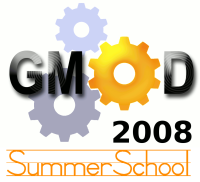

# News/2008 Summer School Report

From GMOD

Jump to: [navigation](#mw-navigation), [search](#p-search)

Or, *what 29 people did with their summer vacation.*

The first annual <a href="../GMOD_Summer_School" class="mw-redirect"
title="GMOD Summer School">GMOD Summer Schoolsummer</a> was held July
11-13, 2008 at NESCent in Durham, NC. It was attended by 25 students and
4 instructors from 19 different states plus France and The Netherlands.
Researchers came from the arthropod, vertebrate, prokaryote, plant,
fungus, and virus communities. The questions and discussions were lively
and participants were fully involved in the hands-on class. Students
started the class with a minimal install of Linux and finished 2 1/2
(sometimes bumpy) days later with a system that was running
<a href="../Chado" class="mw-redirect" title="Chado">Chado</a>,
[GBrowse](../GBrowse.1 "GBrowse"), [Apollo](../Apollo.1 "Apollo"), and
[CMap](../CMap.1 "CMap").

I would like to thank the participants, the instructors
([Scott](../User%3AScott "User%3AScott"), [Ben](../User%3AFaga "User%3AFaga")
and Ed) and the folks at NESCent for getting the GMOD Summer School off
to a fabulous start.

We will be having a Second Annual Summer School in 2009 at NESCent. We
will use what we learned at this year's course to make next year's even
better. Watch this space for information on that course as next summer
gets closer.

There has also been some discussion of holding the course in Europe. If
you would be interested in attending a several day course on GMOD in
Europe please send me an e-mail. If we get enough interest, we might try
and pull it off.

Thanks,

[Dave Clements](../User%3AClements "User%3AClements")  
[GMOD Help Desk](../GMOD_Help_Desk "GMOD Help Desk")

  

*Posted to the [GMOD News](../GMOD_News "GMOD News") on 2008/07/15*

Retrieved from
"<http://gmod.org/mediawiki/index.php?title=News/2008_Summer_School_Report&oldid=22238>"

[Category](../Special%3ACategories "Special%3ACategories"):

- [News Items](../Category%3ANews_Items "Category%3ANews Items")

## Navigation menu

### Namespaces

- <a
  href="http://gmod.org/mediawiki/index.php?title=Talk:News/2008_Summer_School_Report&amp;action=edit&amp;redlink=1"
  accesskey="t"
  title="Discussion about the content page [t]">Discussion</a>

### 

### Variants

### Navigation

- [GMOD Home](../Main_Page)
- [Software](../GMOD_Components)
- [Categories /
  Tags](../Categories)
- [View all
  pages](../Special:AllPages)

### Documentation

- [Overview](../Overview)
- [FAQs](../Category%3AFAQ)
- [HOWTOs](../Category%3AHOWTO)
- [Glossary](../Glossary)

### Community

- [GMOD News](../GMOD_News)
- [Training /
  Outreach](../Training_and_Outreach)
- [Support](../Support)
- [GMOD Promotion](../GMOD_Promotion)
- [Meetings](../Meetings)
- [Calendar](../Calendar)

### Tools

- <a href="../Special%3ABrowse/News-2F2008_Summer_School_Report"
  rel="smw-browse">Browse properties</a>

- Last updated at 23:06 on 9 October
  2012.
<!-- - 7,881 page views. -->
- Content is available under
  <a href="http://www.gnu.org/licenses/fdl-1.3.html" class="external"
  rel="nofollow">a GNU Free Documentation License</a> unless otherwise
  noted.

<!-- -->

- [About
  GMOD](../GMOD%3AAbout "GMOD%3AAbout")

<!-- -->

