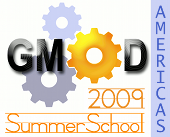

# News/2009 GMOD Summer Schools

From GMOD

Jump to: [navigation](#mw-navigation), [search](#p-search)

We are now accepting applications for the
<a href="../GMOD_Summer_School" class="mw-redirect"
title="GMOD Summer School">2009 GMOD Summer Schools</a>. GMOD Summer
Schools are hands-on multi-day courses aimed at teaching new GMOD users
how to get up and running with GMOD. Summer schools introduce
participants to the GMOD project and focus on installation,
configuration and integration of popular [GMOD
Components](../GMOD_Components "GMOD Components"). In 2009 we are proud
to offer two schools, one on each side of the Atlantic:

<table style="vertical-align: middle; width=80%" data-cellpadding="10">
<colgroup>
<col style="width: 25%" />
<col style="width: 25%" />
<col style="width: 25%" />
<col style="width: 25%" />
</colgroup>
<tbody>
<tr class="odd">
<td style="text-align: center;"></td>
<td><strong><a
href="../2009_GMOD_Summer_School_-_Americas"
title="2009 GMOD Summer School - Americas">Americas</a></strong> 
16-19 July 
NESCent 
Durham NC</td>
<td rowspan="2" data-bgcolor="#eeeeee" width="2px"></td>
<td rowspan="2">
The courses include sessions on these popular GMOD
components:

<ul>
<li><a href="../GBrowse.1" title="GBrowse">GBrowse</a> - the Generic
Genome Browser</li>
<li><a href="../Chado" class="mw-redirect" title="Chado">Chado</a> - a
modular and extensible database schema</li>
<li><a href="../Apollo.1" title="Apollo">Apollo</a> - genome annotation
editor</li>
<li><a href="../BioMart" title="BioMart">BioMart</a> - biological data
warehouse system</li>
<li><a href="../GBrowse_syn.1" title="GBrowse syn">GBrowse_syn</a> - a
GBrowse based synteny viewer</li>
<li><a href="../JBrowse.1" title="JBrowse">JBrowse</a> - a brand new Web
2.0 genome browser</li>
<li><a href="../Artemis" title="Artemis">Artemis</a> - <a
href="../Chado" class="mw-redirect" title="Chado">Chado</a> Integration
(<a href="../2009_GMOD_Summer_School_-_Europe"
title="2009 GMOD Summer School - Europe">Europe</a> only)</li>
<li><a href="../MAKER.1" title="MAKER">MAKER</a> - Genome annotation
pipeline (<a href="../2009_GMOD_Summer_School_-_Americas"
title="2009 GMOD Summer School - Americas">Americas</a> only)</li>
<li><a href="../Tripal.1" title="Tripal">Tripal</a> - Web front end for
Chado (<a href="../2009_GMOD_Summer_School_-_Americas"
title="2009 GMOD Summer School - Americas">Americas</a> only)</li>
</ul></td>
</tr>
<tr class="even">
<td style="text-align: center;"></td>
<td><strong><a
href="../2009_GMOD_Summer_School_-_Europe"
title="2009 GMOD Summer School - Europe">Europe</a></strong> 
3-6 August 
Oxford University 
Oxford UK</td>
</tr>
</tbody>
</table>

The [European summer
school](../2009_GMOD_Summer_School_-_Europe "2009 GMOD Summer School - Europe")
is part of [GMOD Europe 2009](../GMOD_Europe_2009 "GMOD Europe 2009"), a
week long event which also includes the [August 2009 GMOD
Meeting](../August_2009_GMOD_Meeting "August 2009 GMOD Meeting"). This
is the first time a <a href="../GMOD_Summer_School" class="mw-redirect"
title="GMOD Summer School">GMOD Summer School</a> or [GMOD
meeting](../Meetings "Meetings") will be held outside of North America.

Thanks,

[Dave Clements](../User:Clements "User:Clements")  
[GMOD Help Desk](../GMOD_Help_Desk "GMOD Help Desk")

  

*Posted to the [GMOD News](../GMOD_News "GMOD News") on 2009/03/15,
updated 2009/04/06, 2008/04/27*

Retrieved from
"<http://gmod.org/mediawiki/index.php?title=News/2009_GMOD_Summer_Schools&oldid=21914>"

[Category](../Special:Categories "Special:Categories"):

- [News Items](../Category:News_Items "Category:News Items")

## Navigation menu

### Namespaces

- <a href="2009_GMOD_Summer_Schools" accesskey="c"
  title="View the content page [c]">Page</a>
- <a
  href="http://gmod.org/mediawiki/index.php?title=Talk:News/2009_GMOD_Summer_Schools&amp;action=edit&amp;redlink=1"
  accesskey="t"
  title="Discussion about the content page [t]">Discussion</a>

### 

### Variants

### Navigation

- [GMOD Home](../Main_Page)
- [Software](../GMOD_Components)
- [Categories /
  Tags](../Categories)
- [View all
  pages](../Special:AllPages)

### Documentation

- [Overview](../Overview)
- [FAQs](../Category:FAQ)
- [HOWTOs](../Category:HOWTO)
- [Glossary](../Glossary)

### Community

- [GMOD News](../GMOD_News)
- [Training /
  Outreach](../Training_and_Outreach)
- [Support](../Support)
- [GMOD Promotion](../GMOD_Promotion)
- [Meetings](../Meetings)
- [Calendar](../Calendar)

### Tools

- <a href="../Special:WhatLinksHere/News/2009_GMOD_Summer_Schools"
  accesskey="j" title="A list of all wiki pages that link here [j]">What
  links here</a>
- <a href="../Special:RecentChangesLinked/News/2009_GMOD_Summer_Schools"
  accesskey="k"
  title="Recent changes in pages linked from this page [k]">Related
  changes</a>
- <a href="../Special:SpecialPages" accesskey="q"
  title="A list of all special pages [q]">Special pages</a>
- <a
  href="http://gmod.org/mediawiki/index.php?title=News/2009_GMOD_Summer_Schools&amp;printable=yes"
  rel="alternate" accesskey="p"
  title="Printable version of this page [p]">Printable version</a>
- [Permanent
  link](http://gmod.org/mediawiki/index.php?title=News/2009_GMOD_Summer_Schools&oldid=21914 "Permanent link to this revision of the page")
- [Page
  information](http://gmod.org/mediawiki/index.php?title=News/2009_GMOD_Summer_Schools&action=info)
- <a href="../Special:Browse/News-2F2009_GMOD_Summer_Schools"
  rel="smw-browse">Browse properties</a>
- [Print as
  PDF](http://gmod.org/mediawiki/index.php?title=Special:PdfPrint&page=News/2009_GMOD_Summer_Schools)

- Last updated at 23:41 on 3 October
  2012.
- 9,380 page views.
- Content is available under
  <a href="http://www.gnu.org/licenses/fdl-1.3.html" class="external"
  rel="nofollow">a GNU Free Documentation License</a> unless otherwise
  noted.

<!-- -->

- [About
  GMOD](../GMOD:About "GMOD:About")

<!-- -->

- 
- 
  

