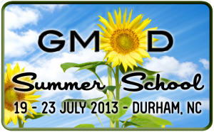

# News/Accepting Applications For GMOD Summer School 2013

From GMOD

Jump to: [navigation](#mw-navigation), [search](#p-search)

**Applications are now open for the 2013 GMOD Summer School!**

This year's course will be held from July 19th to 23rd at the
<a href="http://nescent.org" class="external text"
rel="nofollow">National Evolutionary Synthesis Center (NESCent)</a>, in
Durham, North Carolina.

The GMOD Summer School is the best way to learn how to install,
configure, and use popular GMOD tools, including
[GBrowse](../GBrowse.1 "GBrowse"), [JBrowse](../JBrowse.1 "JBrowse"),
[Galaxy](../Galaxy.1 "Galaxy"), [MAKER](../MAKER.1 "MAKER"),
[Tripal](../Tripal.1 "Tripal"), [WebApollo](../WebApollo.1 "WebApollo"),
and <a href="../Chado" class="mw-redirect" title="Chado">Chado</a>;
courses are taught by the tool developers, and there will be evening
sessions for those who want to work on their own data or troubleshoot
issues with the developers.

  
**[More information and online application
form](../2013_GMOD_Summer_School "2013 GMOD Summer School")**

  
Applications are competitive, so we encourage you to apply well before
the deadline, June 10th.

If you have any questions, please contact
<a href="mailto:help@gmod.org" class="external text"
rel="nofollow">help@gmod.org</a> and we will be happy to answer them.

Retrieved from
"<http://gmod.org/mediawiki/index.php?title=News/Accepting_Applications_For_GMOD_Summer_School_2013&oldid=23444>"

[Categories](../Special:Categories "Special:Categories"):

- [News Items](../Category:News_Items "Category:News Items")
- [GMOD Schools](../Category:GMOD_Schools "Category:GMOD Schools")
- <a
  href="http://gmod.org/mediawiki/index.php?title=Category:2013_Summer_School&amp;action=edit&amp;redlink=1"
  class="new"
  title="Category:2013 Summer School (page does not exist)">2013 Summer
  School</a>

## Navigation menu

### Namespaces

- <a
  href="http://gmod.org/mediawiki/index.php?title=Talk:News/Accepting_Applications_For_GMOD_Summer_School_2013&amp;action=edit&amp;redlink=1"
  accesskey="t"
  title="Discussion about the content page [t]">Discussion</a>

### 

### Variants

### Navigation

- [GMOD Home](../Main_Page)
- [Software](../GMOD_Components)
- [Categories /
  Tags](../Categories)
- [View all
  pages](../Special:AllPages)

### Documentation

- [Overview](../Overview)
- [FAQs](../Category:FAQ)
- [HOWTOs](../Category:HOWTO)
- [Glossary](../Glossary)

### Community

- [GMOD News](../GMOD_News)
- [Training /
  Outreach](../Training_and_Outreach)
- [Support](../Support)
- [GMOD Promotion](../GMOD_Promotion)
- [Meetings](../Meetings)
- [Calendar](../Calendar)

### Tools

- <a
  href="../Special%3ABrowse/News-2FAccepting_Applications_For_GMOD_Summer_School_2013"
  rel="smw-browse">Browse properties</a>

- Last updated at 18:24 on 17 April
  2013.
<!-- - 13,344 page views. -->
- Content is available under
  <a href="http://www.gnu.org/licenses/fdl-1.3.html" class="external"
  rel="nofollow">a GNU Free Documentation License</a> unless otherwise
  noted.

<!-- -->

- [About
  GMOD](../GMOD:About "GMOD:About")

<!-- -->

