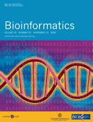

# News/CMap Paper in Bioinformatics

From GMOD

Jump to: [navigation](#mw-navigation), [search](#p-search)

A <a
href="http://bioinformatics.oxfordjournals.org/cgi/content/full/25/22/3040"
class="external text" rel="nofollow">paper</a> describing the
[CMap](../CMap.1 "CMap") comparative map viewer is in the <a
href="http://bioinformatics.oxfordjournals.org/content/vol25/issue22/index.dtl"
class="external text" rel="nofollow">current issue</a> of
*<a href="http://bioinformatics.oxfordjournals.org/"
class="external text" rel="nofollow">Bioinformatics</a>*:

<a
href="http://bioinformatics.oxfordjournals.org/cgi/content/full/25/22/3040"
class="external text" rel="nofollow">CMap 1.01: a comparative mapping
application for the Internet</a>, by Ken Youens-Clark, [Ben
Faga](../User:Faga "User:Faga"), Immanuel V. Yap, [Lincoln
Stein](../User:Lstein "User:Lstein") and Doreen Ware.

[CMap](../CMap.1 "CMap") is a web-based tool for displaying and
comparing maps of any type and from any species. Users can compare an
arbitrary number of maps, view pair-wise comparisons of known
correspondences, and search for maps or for features by name, species,
type and accession.

See the [CMap page](../CMap.1 "CMap") to learn more. CMap will also be
covered in the <a href="http://www.intl-pag.org/18/18-gramene.html"
class="external text" rel="nofollow">Gramene workshop</a> and in a
poster at [PAG 2010](../PAG_2010 "PAG 2010").

[Dave Clements](../User:Clements "User:Clements")  
[GMOD Help Desk](../GMOD_Help_Desk "GMOD Help Desk")

  

*Posted to the [GMOD News](../GMOD_News "GMOD News") on 2009/11/14*

Retrieved from
"<http://gmod.org/mediawiki/index.php?title=News/CMap_Paper_in_Bioinformatics&oldid=22245>"

[Category](../Special:Categories "Special:Categories"):

- [News Items](../Category:News_Items "Category:News Items")

## Navigation menu

### Namespaces

- <a href="CMap_Paper_in_Bioinformatics" accesskey="c"
  title="View the content page [c]">Page</a>
- <a
  href="http://gmod.org/mediawiki/index.php?title=Talk:News/CMap_Paper_in_Bioinformatics&amp;action=edit&amp;redlink=1"
  accesskey="t"
  title="Discussion about the content page [t]">Discussion</a>

### 

### Variants

### Navigation

- [GMOD Home](../Main_Page)
- [Software](../GMOD_Components)
- [Categories /
  Tags](../Categories)
- [View all
  pages](../Special:AllPages)

### Documentation

- [Overview](../Overview)
- [FAQs](../Category:FAQ)
- [HOWTOs](../Category:HOWTO)
- [Glossary](../Glossary)

### Community

- [GMOD News](../GMOD_News)
- [Training /
  Outreach](../Training_and_Outreach)
- [Support](../Support)
- [GMOD Promotion](../GMOD_Promotion)
- [Meetings](../Meetings)
- [Calendar](../Calendar)

### Tools

- <a href="../Special:Browse/News-2FCMap_Paper_in_Bioinformatics"
  rel="smw-browse">Browse properties</a>
- [Print as
  PDF](http://gmod.org/mediawiki/index.php?title=Special:PdfPrint&page=News/CMap_Paper_in_Bioinformatics)

- Last updated at 23:07 on 9 October
  2012.
<!-- - 7,126 page views. -->
- Content is available under
  <a href="http://www.gnu.org/licenses/fdl-1.3.html" class="external"
  rel="nofollow">a GNU Free Documentation License</a> unless otherwise
  noted.

<!-- -->

- [About
  GMOD](../GMOD:About "GMOD:About")

<!-- -->

- 
- 
  

