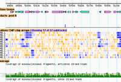

# News/GBrowse 2.0

From GMOD

Jump to: [navigation](#mw-navigation), [search](#p-search)

With thanks to the many people who have worked long and hard on this
project, as well as the people who found and reported bugs during the
prerelease stage, I am happy I announce that [GBrowse
2.00](../GBrowse_2.0_HOWTO "GBrowse 2.0 HOWTO") is now available for
downloading from
<a href="http://search.cpan.org/dist/GBrowse/" class="external text"
rel="nofollow">CPAN</a>, and
<a href="https://sourceforge.net/projects/gmod/files/"
class="external text" rel="nofollow">SourceForge</a>.

The following are highlights of the many new features that have been
added since the 1.70 release:

- A completely rewritten internal rearchitecture loads tracks
  asynchronously, providing a more responsive user experience.
- Different [database
  backends](../GBrowse_2.0_HOWTO#Database_Definitions "GBrowse 2.0 HOWTO")
  can be associated with each track, making backend management much
  simpler.
- A revamped user interface for a less cluttered and more functional
  end-user experience.
- A [UI theming system](../GBrowse_2.0_HOWTO#Themes "GBrowse 2.0 HOWTO")
  with three predefined themes, including a cool "transparent" theme.
- A custom [track upload and management
  system](../GBrowse_2.0_HOWTO#Configuring_the_Uploaded_Track_Database "GBrowse 2.0 HOWTO")
  gives users much greater control over custom tracks.
- An optional [admin
  interface](../GBrowse_2.0_HOWTO#The_Admin_Interface "GBrowse 2.0 HOWTO")
  allows an authorized user to upload and manage public tracks without
  editing config files.
- An optional [user registration and login
  system](../GBrowse_2.0_HOWTO#Configuring_the_User_Account_Database "GBrowse 2.0 HOWTO")
  allows users to register stable GBrowse accounts and to keep their
  settings and custom tracks when they move from one computer to
  another.
- Support for named subtracks (tracks within tracks) and filtering of
  those subtracks.
- Support for [next generation
  sequencing](../GBrowse_NGS_Tutorial "GBrowse NGS Tutorial") data.

There are also a number of features that *didn't* make it into the 2.00
release, most notably:

- The internal <a href="../DAS" class="mw-redirect" title="DAS">DAS</a>
  server does not work, although the DAS client (ability to import DAS
  tracks) does. This will be added in a 2.01 release.
- Internationalization has lagged way behind, and so most of the new
  features will be presented in English rather than in the user's
  preferred language (volunteers are needed to help with translations).

Please send help queries to the
<a href="https://lists.sourceforge.net/lists/listinfo/gmod-gbrowse"
class="external text" rel="nofollow">GBrowse mailing list</a>, and file
<a
href="https://sourceforge.net/tracker/?group_id=27707&amp;atid=391291"
class="external text" rel="nofollow">bug reports at SourceForge</a>.

On behalf of the GMOD team,

[Lincoln Stein](../User:Lstein "User:Lstein")

  

*Posted to the [GMOD News](../GMOD_News "GMOD News") on 2010/01/28*

Retrieved from
"<http://gmod.org/mediawiki/index.php?title=News/GBrowse_2.0&oldid=22371>"

[Category](../Special:Categories "Special:Categories"):

- [News Items](../Category:News_Items "Category:News Items")

## Navigation menu

### Namespaces

- <a href="GBrowse_2.0" accesskey="c"
  title="View the content page [c]">Page</a>
- <a
  href="http://gmod.org/mediawiki/index.php?title=Talk:News/GBrowse_2.0&amp;action=edit&amp;redlink=1"
  accesskey="t"
  title="Discussion about the content page [t]">Discussion</a>

### 

### Variants

### Navigation

- [GMOD Home](../Main_Page)
- [Software](../GMOD_Components)
- [Categories /
  Tags](../Categories)
- [View all
  pages](../Special:AllPages)

### Documentation

- [Overview](../Overview)
- [FAQs](../Category:FAQ)
- [HOWTOs](../Category:HOWTO)
- [Glossary](../Glossary)

### Community

- [GMOD News](../GMOD_News)
- [Training /
  Outreach](../Training_and_Outreach)
- [Support](../Support)
- [GMOD Promotion](../GMOD_Promotion)
- [Meetings](../Meetings)
- [Calendar](../Calendar)

### Tools

- <a href="../Special:WhatLinksHere/News/GBrowse_2.0" accesskey="j"
  title="A list of all wiki pages that link here [j]">What links here</a>
- <a href="../Special:RecentChangesLinked/News/GBrowse_2.0" accesskey="k"
  title="Recent changes in pages linked from this page [k]">Related
  changes</a>
- <a href="../Special:SpecialPages" accesskey="q"
  title="A list of all special pages [q]">Special pages</a>
- <a
  href="http://gmod.org/mediawiki/index.php?title=News/GBrowse_2.0&amp;printable=yes"
  rel="alternate" accesskey="p"
  title="Printable version of this page [p]">Printable version</a>
- [Permanent
  link](http://gmod.org/mediawiki/index.php?title=News/GBrowse_2.0&oldid=22371 "Permanent link to this revision of the page")
- [Page
  information](http://gmod.org/mediawiki/index.php?title=News/GBrowse_2.0&action=info)
- <a href="../Special:Browse/News-2FGBrowse_2.0" rel="smw-browse">Browse
  properties</a>
- [Print as
  PDF](http://gmod.org/mediawiki/index.php?title=Special:PdfPrint&page=News/GBrowse_2.0)

- Last updated at 23:25 on 9 October
  2012.
- 7,129 page views.
- Content is available under
  <a href="http://www.gnu.org/licenses/fdl-1.3.html" class="external"
  rel="nofollow">a GNU Free Documentation License</a> unless otherwise
  noted.

<!-- -->

- [About
  GMOD](../GMOD:About "GMOD:About")

<!-- -->

- 
- 
  

