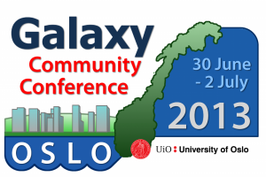
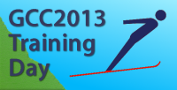

# News/GCC2013: Register! Present!

From GMOD

Jump to: [navigation](#mw-navigation), [search](#p-search)

**We are pleased to announce that
<a href="http://galaxyproject.org/events/GCC2013/Register"
class="external text" rel="nofollow">early registration</a> and
<a href="http://galaxyproject.org/events/GCC2013/Abstracts"
class="external text" rel="nofollow">paper and poster abstract
submission</a> are now open for the
<a href="http://galaxyproject.org/events/GCC2013" class="external text"
rel="nofollow">2013 Galaxy Community Conference (GCC2013)</a>.**
 GCC2013 will be held 30 June through July 2 in Oslo Norway, at the
<a href="http://uio.no" class="external text" rel="nofollow">University
of Oslo</a>.

<a href="http://galaxyproject.org/events/GCC2013" class="external text"
rel="nofollow">GCC2013</a> is an opportunity to participate in two full
days of presentations, discussions, poster sessions, keynotes, lightning
talks and breakouts, all about high-throughput biology and the tools
that support it. The conference also includes a
<a href="http://galaxyproject.org/events/GCC2013/TrainingDay"
class="external text" rel="nofollow">Training Day</a> for the second
year in a row, this year with more in-depth topic coverage, more
concurrent sessions, and more topics.

If you are a biologist or bioinformatician performing or enabling
high-throughput biological research, then please consider attending.
 GCC2013 is aimed at:

- Bioinformatics tool developers and data providers
- Workflow developers and power bioinformatics users
- Sequencing and Bioinformatics core staff
- Data archival and analysis reproducibility specialists

**<a href="http://galaxyproject.org/events/GCC2013/Register"
class="external text" rel="nofollow">Early registration</a>** *saves up
to 75% off regular registration costs,*  and is very affordable, with
combined registration
(<a href="http://galaxyproject.org/events/GCC2013/TrainingDay"
class="external text" rel="nofollow">Training Day</a> + main meeting)
starting at ~ €95 for post-docs and students.  Registering early also
assures you a spot in the Training Day workshops you want to attend.
 Once a Training Day session becomes full, it will be closed to new
registrations.  Early registration closes 24 May. 

**<a href="http://galaxyproject.org/vents/GCC2013/Abstracts"
class="external text" rel="nofollow">Abstract submission</a>** for oral
presentations closes 12 April, and for poster submissions on 3 May.
 Please consider presenting your work. If you are working with big
biological data, then this meeting wants to hear about your work.

Thanks, and hope to see you in Oslo!

The <a href="http://galaxyproject.org/events/GCC2013/Organizers"
class="external text" rel="nofollow">GCC2013 Organizing Committee</a>

PS: And please help
<a href="http://galaxyproject.org/events/GCC2013/Promotion"
class="external text" rel="nofollow">get the word out</a>!

  

*Posted to the [GMOD News](../GMOD_News "GMOD News") on 2013/02/24*

Retrieved from
"<http://gmod.org/mediawiki/index.php?title=News/GCC2013%3A_Register!_Present!&oldid=23164>"

[Categories](../Special:Categories "Special:Categories"):

- [News Items](../Category:News_Items "Category:News Items")
- [Galaxy](../Category:Galaxy "Category:Galaxy")
- [Events](../Category:Events "Category:Events")

## Navigation menu

### Namespaces

- <a
  href="http://gmod.org/mediawiki/index.php?title=Talk:News/GCC2013%3A_Register!_Present!&amp;action=edit&amp;redlink=1"
  accesskey="t"
  title="Discussion about the content page [t]">Discussion</a>

### 

### Variants

### Navigation

- [GMOD Home](../Main_Page)
- [Software](../GMOD_Components)
- [Categories /
  Tags](../Categories)
- [View all
  pages](../Special:AllPages)

### Documentation

- [Overview](../Overview)
- [FAQs](../Category:FAQ)
- [HOWTOs](../Category:HOWTO)
- [Glossary](../Glossary)

### Community

- [GMOD News](../GMOD_News)
- [Training /
  Outreach](../Training_and_Outreach)
- [Support](../Support)
- [GMOD Promotion](../GMOD_Promotion)
- [Meetings](../Meetings)
- [Calendar](../Calendar)

### Tools

- <a href="../Special:Browse/News-2FGCC2013%3A_Register!_Present!"
  rel="smw-browse">Browse properties</a>

- Last updated at 03:37 on 25 February
  2013.
<!-- - 11,026 page views. -->
- Content is available under
  <a href="http://www.gnu.org/licenses/fdl-1.3.html" class="external"
  rel="nofollow">a GNU Free Documentation License</a> unless otherwise
  noted.

<!-- -->

- [About
  GMOD](../GMOD:About "GMOD:About")

<!-- -->

