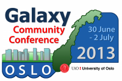

# News/GCC2013 Early Reg closes 24 May

From GMOD

Jump to: [navigation](#mw-navigation), [search](#p-search)

<a href="http://wiki.galaxyproject.org/Events/GCC2013/Register"
class="external text" rel="nofollow">Early registration</a> for the
<a href="http://wiki.galaxyproject.org/Events/GCC2013"
class="external text" rel="nofollow">2013 Galaxy Community Conference
(GCC2013)</a> ends this Friday, 24 May. Early registration *saves up to
75% off* regular registration costs, and is downright affordable, with
combined registration
(<a href="http://wiki.galaxyproject.org/Events/GCC2013/TrainingDay"
class="external text" rel="nofollow">Training Day</a> +
<a href="http://wiki.galaxyproject.org/Events/GCC2013/Program"
class="external text" rel="nofollow">main meeting</a>) starting at ~ €95
for post-docs and students. Registering early also assures you a spot in
the Training Day workshops you want to attend. Once a Training Day
session becomes full, it will be closed to new registrations.

<a href="http://wiki.galaxyproject.org/Events/GCC2013"
class="external text" rel="nofollow">GCC2013</a> is an opportunity to
participate in two full days of presentations, discussions, poster
sessions, keynote, and lightning talks, all about high-throughput
biology and the tools that support it. The conference also includes a
Training Day with in-depth topic coverage of twelve different topics in
15 sessions across 5 tracks.

An <a href="http://wiki.galaxyproject.org/Events/GCC2013/Program"
class="external text" rel="nofollow">early program</a> is available
featuring 25 oral presentations, lightning talks and poster sessions,
and the just added Birds-of-a-Feather gatherings.

If you are a biologist or bioinformatician performing or enabling
high-throughput biological research, then this conference is for you.

Thanks,

<a href="http://wiki.galaxyproject.org/Events/GCC2013/Organizers"
class="external text" rel="nofollow">GCC2013 Organizing Committee</a>

PS: And <a href="http://wiki.galaxyproject.org/Events/GCC2013/Promotion"
class="external text" rel="nofollow">please help get the word out!</a>

  

*Posted to the [GMOD News](../GMOD_News "GMOD News") on 2013/05/20*

Retrieved from
"<http://gmod.org/mediawiki/index.php?title=News/GCC2013_Early_Reg_closes_24_May&oldid=23578>"

[Categories](../Special:Categories "Special:Categories"):

- [News Items](../Category:News_Items "Category:News Items")
- [Galaxy](../Category:Galaxy "Category:Galaxy")

## Navigation menu

### Namespaces

- <a href="GCC2013_Early_Reg_closes_24_May" accesskey="c"
  title="View the content page [c]">Page</a>
- <a
  href="http://gmod.org/mediawiki/index.php?title=Talk:News/GCC2013_Early_Reg_closes_24_May&amp;action=edit&amp;redlink=1"
  accesskey="t"
  title="Discussion about the content page [t]">Discussion</a>

### 

### Variants

### Navigation

- [GMOD Home](../Main_Page)
- [Software](../GMOD_Components)
- [Categories /
  Tags](../Categories)
- [View all
  pages](../Special:AllPages)

### Documentation

- [Overview](../Overview)
- [FAQs](../Category:FAQ)
- [HOWTOs](../Category:HOWTO)
- [Glossary](../Glossary)

### Community

- [GMOD News](../GMOD_News)
- [Training /
  Outreach](../Training_and_Outreach)
- [Support](../Support)
- [GMOD Promotion](../GMOD_Promotion)
- [Meetings](../Meetings)
- [Calendar](../Calendar)

### Tools

- <a href="../Special:WhatLinksHere/News/GCC2013_Early_Reg_closes_24_May"
  accesskey="j" title="A list of all wiki pages that link here [j]">What
  links here</a>
- <a
  href="../Special:RecentChangesLinked/News/GCC2013_Early_Reg_closes_24_May"
  accesskey="k"
  title="Recent changes in pages linked from this page [k]">Related
  changes</a>
- <a href="../Special:SpecialPages" accesskey="q"
  title="A list of all special pages [q]">Special pages</a>
- <a
  href="http://gmod.org/mediawiki/index.php?title=News/GCC2013_Early_Reg_closes_24_May&amp;printable=yes"
  rel="alternate" accesskey="p"
  title="Printable version of this page [p]">Printable version</a>
- [Permanent
  link](http://gmod.org/mediawiki/index.php?title=News/GCC2013_Early_Reg_closes_24_May&oldid=23578 "Permanent link to this revision of the page")
- [Page
  information](http://gmod.org/mediawiki/index.php?title=News/GCC2013_Early_Reg_closes_24_May&action=info)
- <a href="../Special:Browse/News-2FGCC2013_Early_Reg_closes_24_May"
  rel="smw-browse">Browse properties</a>
- [Print as
  PDF](http://gmod.org/mediawiki/index.php?title=Special:PdfPrint&page=News/GCC2013_Early_Reg_closes_24_May)

- Last updated at 20:44 on 20 May
  2013.
- 15,198 page views.
- Content is available under
  <a href="http://www.gnu.org/licenses/fdl-1.3.html" class="external"
  rel="nofollow">a GNU Free Documentation License</a> unless otherwise
  noted.

<!-- -->

- [About
  GMOD](../GMOD:About "GMOD:About")

<!-- -->

- 
- 
  

