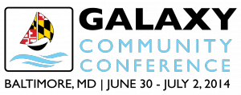
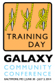

# News/GCC2014 Registration is Open

From GMOD

Jump to: [navigation](#mw-navigation), [search](#p-search)

**We are pleased to announce that
<a href="https://wiki.galaxyproject.org/Events/GCC2014/Register"
class="external text" rel="nofollow">Early Registration</a> and
<a href="https://wiki.galaxyproject.org/Events/GCC2014/Abstracts"
class="external text" rel="nofollow">Talk and Poster Abstract
Submission</a> are now open for the
<a href="https://wiki.galaxyproject.org/Events/GCC2014"
class="external text" rel="nofollow">2014 Galaxy Community Conference
(GCC2014)</a>.**

<a href="https://wiki.galaxyproject.org/Events/GCC2014"
class="external text" rel="nofollow">GCC2014</a> will be held at the <a
href="http://webapps.jhu.edu/jhuniverse/information_about_hopkins/campuses/homewood_campus/"
class="external text" rel="nofollow">Homewood Campus</a> of
<a href="http://jhu.edu" class="external text" rel="nofollow">Johns
Hopkins University</a>, in
<a href="http://visitors.baltimorecity.gov/" class="external text"
rel="nofollow">Baltimore, Maryland</a>, United States, from June 30
through July 2, 2014.
<a href="https://wiki.galaxyproject.org/Events/GCC2014"
class="external text" rel="nofollow">GCC2014</a> starts with a
<a href="https://wiki.galaxyproject.org/Events/GCC2014/TrainingDay"
class="external text" rel="nofollow">Training Day</a> featuring *five*
parallel tracks, each with three, two and half hour long workshops.
There are 13 different topics spanning the full Galactic spectrum of
topics.
<a href="https://wiki.galaxyproject.org/Events/GCC2014/TrainingDay"
class="external text" rel="nofollow">Take a look!</a>

**<a href="https://wiki.galaxyproject.org/Events/GCC2014/Register"
class="external text" rel="nofollow">Early registration</a>** is now
open. Register early and *avoid paying 70% more for regular registration
costs.*  Early registration is very affordable, with combined
registration
(<a href="https://wiki.galaxyproject.org/Events/GCC2014/TrainingDay"
class="external text" rel="nofollow">Training Day</a> + main meeting)
starting at \$140 for post-docs and students. Registration is capped
this year at 250 participants, *and we expect to hit that limit*.
Registering early assures you a place at the conference and also a spot
in the Training Day workshops you want to attend.

You can also book affordable conference housing at the same time you
register. See the conference
<a href="https://wiki.galaxyproject.org/Events/GCC2014/Logistics"
class="external text" rel="nofollow">Logistics page</a> for details on
this and other housing options.

**<a href="https://wiki.galaxyproject.org/Events/GCC2014/Abstracts"
class="external text" rel="nofollow">Abstract submission</a>** for both
oral presentations and posters is also open.  Abstract submission for
oral presentations closes April 4, while poster submission closes April
25. Poster authors will be notified of acceptance status within two
weeks of submission, while presentation authors will be notified no
later than May2.  *Please consider presenting your work. If you are
dealing with big biological data, then this meeting wants to hear about
your work.*

The *<a href="http://www.gigasciencejournal.com/" class="external text"
rel="nofollow">GigaScience</a>* "Galaxy: Data Intensive and Reproducible
Research" series announced for the last conference has published its
<a href="http://www.gigasciencejournal.com/series/Galaxy"
class="external text" rel="nofollow">first papers</a>, *and is
continuing to take submissions for this year's meeting and beyond*. BGI
is also continuing to cover the article processing charges until the end
of the year, and for more information see their <a
href="http://blogs.biomedcentral.com/gigablog/2014/02/06/rewarding-reproducibility-first-papers-in-our-galaxy-series-utilizing-our-gigagalaxy-platform/"
class="external text" rel="nofollow">latest update</a>.

Thanks, and hope to see you in Baltimore!

The
http:<a href="https://wiki.galaxyproject.org/Events/GCC2014/Organizers"
class="external text" rel="nofollow">GCC2014 Organizing Committee</a>

  

*Posted to the [GMOD News](../GMOD_News "GMOD News") on 2014/02/14*

Retrieved from
"<http://gmod.org/mediawiki/index.php?title=News/GCC2014_Registration_is_Open&oldid=25351>"

[Categories](../Special:Categories "Special:Categories"):

- [News Items](../Category:News_Items "Category:News Items")
- [Galaxy](../Category:Galaxy "Category:Galaxy")

## Navigation menu

### Namespaces

- <a href="GCC2014_Registration_is_Open" accesskey="c"
  title="View the content page [c]">Page</a>
- <a
  href="http://gmod.org/mediawiki/index.php?title=Talk:News/GCC2014_Registration_is_Open&amp;action=edit&amp;redlink=1"
  accesskey="t"
  title="Discussion about the content page [t]">Discussion</a>

### 

### Variants

### Navigation

- [GMOD Home](../Main_Page)
- [Software](../GMOD_Components)
- [Categories /
  Tags](../Categories)
- [View all
  pages](../Special:AllPages)

### Documentation

- [Overview](../Overview)
- [FAQs](../Category:FAQ)
- [HOWTOs](../Category:HOWTO)
- [Glossary](../Glossary)

### Community

- [GMOD News](../GMOD_News)
- [Training /
  Outreach](../Training_and_Outreach)
- [Support](../Support)
- [GMOD Promotion](../GMOD_Promotion)
- [Meetings](../Meetings)
- [Calendar](../Calendar)

### Tools

- <a href="../Special:Browse/News-2FGCC2014_Registration_is_Open"
  rel="smw-browse">Browse properties</a>

- Last updated at 05:14 on 17 February
  2014.
<!-- - 23,169 page views. -->
- Content is available under
  <a href="http://www.gnu.org/licenses/fdl-1.3.html" class="external"
  rel="nofollow">a GNU Free Documentation License</a> unless otherwise
  noted.

<!-- -->

- [About
  GMOD](../GMOD:About "GMOD:About")

<!-- -->

- 

