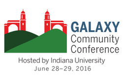
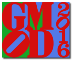

# News/GCC2016

From GMOD

Jump to: [navigation](#mw-navigation), [search](#p-search)

**The <a href="https://gcc2016.iu.edu/" class="external text"
rel="nofollow">2016 Galaxy Community Conference (GCC2016)</a> will be
held June 25-29, at
<a href="https://gcc2016.iu.edu/location/" class="external text"
rel="nofollow">Indiana University</a> in Bloomington, Indiana, United
states, immediately before the [June 2016 GMOD
Meeting](../Jun_2016_GMOD_Meeting "Jun 2016 GMOD Meeting"), also in
Bloomington.** [Galaxy](../Galaxy.1 "Galaxy") is a GMOD Component which
interacts with many other [GMOD
Components](../GMOD_Components "GMOD Components"), including:

- [Tripal](../Tripal.1 "Tripal"): A web front end for
  <a href="../Chado" class="mw-redirect" title="Chado">Chado</a>
  databases. Galaxy is working with the Tripal project to make Galaxy be
  Tripal's analysis engine.
- [JBrowse](../JBrowse.1 "JBrowse"): A client-side genome browser and
  successor to the venerable [GBrowse](../GBrowse.1 "GBrowse"). <a
  href="http://gcc2015.tsl.ac.uk/Lightning/#JBrowse_as_a_Galaxy_Tool#JBrowse_as_a_Galaxy_Tool"
  class="external text" rel="nofollow">JBrowse as a Galaxy Tool</a> was
  presented by Eric Rasche at
  <a href="http://gcc2015.tsl.ac.uk/" class="external text"
  rel="nofollow">GCC2015</a>. Ian Holmes, the JBrowse PI, has put
  JBrowse-Galaxy integration at "top of the list" for JBrowse's
  infrastructure upcoming infrastructure work.
- [MAKER](../MAKER.1 "MAKER"): A genome annotation pipeline that
  integrates several gene annotation engines, and combines them to
  produce annotation that is better than any individual tool produces. A
  <a
  href="https://wiki.galaxyproject.org/Documents/Posters?action=AttachFile&amp;do=view&amp;target=ISMB2014_Kandalaft_GenomeAnnotation.pdf"
  class="external text" rel="nofollow">MAKER-Galaxy</a> by Agriculture
  and Agri-Food Canada was presented at ISMB 2014.
- [InterMine](../InterMine "InterMine") and
  [BioMart](../BioMart "BioMart"): These are both popular data sources
  that are integrated with Galaxy.

Galaxy Community Conferences are an opportunity to participate in
presentations, discussions, poster sessions, lightning talks and
breakouts, all about high-throughput biology and the tools that support
it.  The conference also includes
<a href="https://gcc2016.iu.edu/training" class="external text"
rel="nofollow">two days of training</a> offering in-depth topic coverage
across several concurrent sessions, and
<a href="https://gcc2016.iu.edu/hacks/" class="external text"
rel="nofollow">two days of hackathons</a>.

**<a href="https://gcc2016.iu.edu/abstracts/" class="external text"
rel="nofollow">Oral presentation abstract submission</a> closes April 8;
<a href="https://gcc2016.iu.edu/abstracts/" class="external text"
rel="nofollow">poster and demo abstract submission</a> close May 20; and
<a href="https://wiki.galaxyproject.org/News/GCC2016Scholarships"
class="external text" rel="nofollow">scholarship applications</a> close
May 1.**

  

*Posted to the [GMOD News](../GMOD_News "GMOD News") on 2016/04/04*

Retrieved from
"<http://gmod.org/mediawiki/index.php?title=News/GCC2016&oldid=27080>"

[Category](../Special%3ACategories "Special%3ACategories"):

- [News Items](../Category%3ANews_Items "Category%3ANews Items")

## Navigation menu

### Namespaces

- <a
  href="http://gmod.org/mediawiki/index.php?title=Talk:News/GCC2016&amp;action=edit&amp;redlink=1"
  accesskey="t"
  title="Discussion about the content page [t]">Discussion</a>

### 

### Variants

### Navigation

- [GMOD Home](../Main_Page)
- [Software](../GMOD_Components)
- [Categories /
  Tags](../Categories)
- [View all
  pages](../Special:AllPages)

### Documentation

- [Overview](../Overview)
- [FAQs](../Category%3AFAQ)
- [HOWTOs](../Category%3AHOWTO)
- [Glossary](../Glossary)

### Community

- [GMOD News](../GMOD_News)
- [Training /
  Outreach](../Training_and_Outreach)
- [Support](../Support)
- [GMOD Promotion](../GMOD_Promotion)
- [Meetings](../Meetings)
- [Calendar](../Calendar)

### Tools

- <a href="../Special%3ABrowse/News-2FGCC2016" rel="smw-browse">Browse
  properties</a>

- Last updated at 21:56 on 4 April
  2016.
<!-- - 28,432 page views. -->
- Content is available under
  <a href="http://www.gnu.org/licenses/fdl-1.3.html" class="external"
  rel="nofollow">a GNU Free Documentation License</a> unless otherwise
  noted.

<!-- -->

- [About
  GMOD](../GMOD:About "GMOD:About")

<!-- -->

