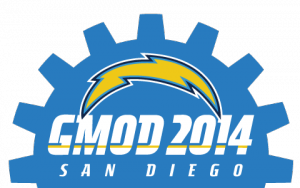

# News/GMOD 2014 San Diego: Save the Date

From GMOD

Jump to: [navigation](#mw-navigation), [search](#p-search)

The [next GMOD Community
Meeting](../Jan_2014_GMOD_Meeting "Jan 2014 GMOD Meeting") will be held
in San Diego, CA, on January 16-17, directly after
<a href="http://intl-pag.org" class="external text" rel="nofollow">PAG
XXII</a>. In addition to the usual talks and updates, we plan to have a
poster session, and a workshop on migrating from GBrowse to JBrowse. If
you have items or ideas for the agenda, please feel free to
<a href="mailto:help@gmod.org" class="external text"
rel="nofollow">contact the GMOD helpdesk</a>.

GMOD will also have a big presence at PAG, with a day-long workshop
covering many of the actively-developed GMOD components.

More details on both the GMOD community meeting and GMOD at PAG will be
posted on the wiki closer to the time.

  

*Posted to the [GMOD News](../GMOD_News "GMOD News") on 2013-09-10*

Retrieved from
"<http://gmod.org/mediawiki/index.php?title=News/GMOD_2014_San_Diego%3A_Save_the_Date&oldid=24533>"

[Categories](../Special%3ACategories "Special%3ACategories"):

- [News Items](../Category%3ANews_Items "Category%3ANews Items")
- [Conferences](../Category%3AConferences "Category%3AConferences")
- [Meetings](../Category%3AMeetings "Category%3AMeetings")

## Navigation menu

### Namespaces

- <a
  href="http://gmod.org/mediawiki/index.php?title=Talk:News/GMOD_2014_San_Diego%3A_Save_the_Date&amp;action=edit&amp;redlink=1"
  accesskey="t"
  title="Discussion about the content page [t]">Discussion</a>

### 

### Variants

### Navigation

- [GMOD Home](../Main_Page)
- [Software](../GMOD_Components)
- [Categories /
  Tags](../Categories)
- [View all
  pages](../Special:AllPages)

### Documentation

- [Overview](../Overview)
- [FAQs](../Category%3AFAQ)
- [HOWTOs](../Category%3AHOWTO)
- [Glossary](../Glossary)

### Community

- [GMOD News](../GMOD_News)
- [Training /
  Outreach](../Training_and_Outreach)
- [Support](../Support)
- [GMOD Promotion](../GMOD_Promotion)
- [Meetings](../Meetings)
- [Calendar](../Calendar)

### Tools

- <a href="../Special%3ABrowse/News-2FGMOD_2014_San_Diego%3A_Save_the_Date"
  rel="smw-browse">Browse properties</a>

- Last updated at 20:00 on 10 September
  2013.
<!-- - 15,409 page views. -->
- Content is available under
  <a href="http://www.gnu.org/licenses/fdl-1.3.html" class="external"
  rel="nofollow">a GNU Free Documentation License</a> unless otherwise
  noted.

<!-- -->

- [About
  GMOD](../GMOD%3AAbout "GMOD%3AAbout")

<!-- -->

