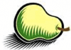

# News/GMOD @ BOSC 2011

From GMOD

Jump to: [navigation](#mw-navigation), [search](#p-search)

A tentative schedule for the
<a href="http://www.open-bio.org/wiki/BOSC_2011" class="external text"
rel="nofollow">2011 Bioinformatics Open Source Conference (BOSC)</a> has
been published and it features at least 8 GMOD related talks, covering
[Galaxy](../Galaxy.1 "Galaxy"), [InterMine](../InterMine "InterMine"),
[BioMart](../BioMart "BioMart"),
[WebApollo](../WebApollo.1 "WebApollo"), SADI for GMOOD, and the project
as a whole.

BOSC is being held as a satellite to [ISMB/ECCB
2011](../ISMB/ECCB_2011 "ISMB/ECCB 2011"). If you are giving a GMOD
related talk or poster at any ISMB/ECCB event, please add it to the
[ISMB/ECCB 2011](../ISMB/ECCB_2011 "ISMB/ECCB 2011") page.

Thanks,

[Dave Clements](../User%3AClements "User%3AClements")  
[Galaxy](../Galaxy.1 "Galaxy") Project

  

*Posted to the [GMOD News](../GMOD_News "GMOD News") on 2011/06/21*

Retrieved from
"<http://gmod.org/mediawiki/index.php?title=News/GMOD_@_BOSC_2011&oldid=22322>"

[Category](../Special:Categories "Special:Categories"):

- [News Items](../Category%3ANews_Items "Category%3ANews Items")

## Navigation menu

### Namespaces

- <a
  href="http://gmod.org/mediawiki/index.php?title=Talk:News/GMOD_@_BOSC_2011&amp;action=edit&amp;redlink=1"
  accesskey="t"
  title="Discussion about the content page [t]">Discussion</a>

### 

### Variants

### Navigation

- [GMOD Home](../Main_Page)
- [Software](../GMOD_Components)
- [Categories /
  Tags](../Categories)
- [View all
  pages](../Special:AllPages)

### Documentation

- [Overview](../Overview)
- [FAQs](../Category%3AFAQ)
- [HOWTOs](../Category%3AHOWTO)
- [Glossary](../Glossary)

### Community

- [GMOD News](../GMOD_News)
- [Training /
  Outreach](../Training_and_Outreach)
- [Support](../Support)
- [GMOD Promotion](../GMOD_Promotion)
- [Meetings](../Meetings)
- [Calendar](../Calendar)

### Tools

- <a href="../Special%3ABrowse/News-2FGMOD_@_BOSC_2011"
  rel="smw-browse">Browse properties</a>

- Last updated at 23:10 on 9 October
  2012.
<!-- - 9,132 page views. -->
- Content is available under
  <a href="http://www.gnu.org/licenses/fdl-1.3.html" class="external"
  rel="nofollow">a GNU Free Documentation License</a> unless otherwise
  noted.

<!-- -->

- [About
  GMOD](../GMOD:About "GMOD:About")

<!-- -->

