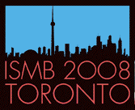

# News/GMOD @ ISMB and BOSC

From GMOD

Jump to: [navigation](#mw-navigation), [search](#p-search)

GMOD has a [strong presence](../ISMB_2008 "ISMB 2008") at the
<a href="http://www.iscb.org/ismb2008/" class="external text"
rel="nofollow">ISMB 2008</a> and
<a href="http://open-bio.org/wiki/BOSC_2008" class="external text"
rel="nofollow">BOSC 2008</a> meetings, getting under way this week in
Toronto. There are over a dozen talks and posters at the BOSC and ISMB
conferences about [GMOD
Components](../GMOD_Components "GMOD Components"), or that feature
research that using GMOD components. See [ISMB
2008](../ISMB_2008 "ISMB 2008") for a complete list and for a
<a href="../../mediawiki/images/2/2e/GMODatISMB2008.pdf"
class="internal" title="GMODatISMB2008.pdf">flier we'll be distributing
at the conference</a>.

[Dave Clements](../User:Clements "User:Clements")  
[GMOD Help Desk](../GMOD_Help_Desk "GMOD Help Desk")

  

*Posted to the [GMOD News](../GMOD_News "GMOD News") on 2008/07/16*

Retrieved from
"<http://gmod.org/mediawiki/index.php?title=News/GMOD_@_ISMB_and_BOSC&oldid=22254>"

[Category](../Special:Categories "Special:Categories"):

- [News Items](../Category:News_Items "Category:News Items")

## Navigation menu

### Namespaces

- <a
  href="http://gmod.org/mediawiki/index.php?title=Talk:News/GMOD_@_ISMB_and_BOSC&amp;action=edit&amp;redlink=1"
  accesskey="t"
  title="Discussion about the content page [t]">Discussion</a>

### 

### Variants

### Navigation

- [GMOD Home](../Main_Page)
- [Software](../GMOD_Components)
- [Categories /
  Tags](../Categories)
- [View all
  pages](../Special:AllPages)

### Documentation

- [Overview](../Overview)
- [FAQs](../Category:FAQ)
- [HOWTOs](../Category:HOWTO)
- [Glossary](../Glossary)

### Community

- [GMOD News](../GMOD_News)
- [Training /
  Outreach](../Training_and_Outreach)
- [Support](../Support)
- [GMOD Promotion](../GMOD_Promotion)
- [Meetings](../Meetings)
- [Calendar](../Calendar)

### Tools

- <a href="../Special:Browse/News-2FGMOD_@_ISMB_and_BOSC"
  rel="smw-browse">Browse properties</a>

- Last updated at 23:07 on 9 October
  2012.
<!-- - 7,526 page views. -->
- Content is available under
  <a href="http://www.gnu.org/licenses/fdl-1.3.html" class="external"
  rel="nofollow">a GNU Free Documentation License</a> unless otherwise
  noted.

<!-- -->

- [About
  GMOD](../GMOD:About "GMOD:About")

<!-- -->

