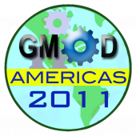

# News/GMOD Americas 2011 Report

From GMOD

Jump to: [navigation](#mw-navigation), [search](#p-search)

[GMOD Americas 2011](../GMOD_Americas_2011 "GMOD Americas 2011") is now
over. Almost 60 people participated in one or more events during the
week.

The newly offered **Introduction to GMOD** session introduced the *GMOD
big picture* to over 20 attendees. The two-day **[March 2011 GMOD
Meeting](../March_2011_GMOD_Meeting "March 2011 GMOD Meeting")**
featured group discussions, Eric Stone's talk on the challenges of the
*Drosophila* Genetic Reference Panel, and 15 other talks on project
status and direction, component updates, and best practices. The
**[Satellite
Meetings](../Satellite_Meetings_-_GMOD_Americas_2011 "Satellite Meetings - GMOD Americas 2011")**
were more popular than ever before, with over 20 people participating.
Finally, **[2011 GMOD Spring
Training](../2011_GMOD_Spring_Training "2011 GMOD Spring Training")**
course offered 25 participants five days of hands-on training on
installing, configuring and using popular GMOD components. This [GMOD
course](../GMOD_Schools "GMOD Schools") featured new sessions on
[InterMine](../InterMine "InterMine") and [SOBA](../SOBA.1 "SOBA") as
well as updated sessions on [Apollo](../Apollo.1 "Apollo"),
<a href="../Chado" class="mw-redirect" title="Chado">Chado</a>,
[Galaxy](../Galaxy.1 "Galaxy"), [GBrowse](../GBrowse.1 "GBrowse"),
[GBrowse_syn](../GBrowse_syn.1 "GBrowse syn"),
[JBrowse](../JBrowse.1 "JBrowse"), [MAKER](../MAKER.1 "MAKER"), and
[Tripal](../Tripal.1 "Tripal"). Feedback on the events will be published
shortly.

Don't despair if you missed this event as the the next GMOD meeting is
scheduled for [October,
2011](../October_2011_GMOD_Meeting "October 2011 GMOD Meeting") at the
<a href="http://oicr.on.ca/" class="external text"
rel="nofollow">Ontario Institute for Cancer Research (OICR)</a> in
Toronto, Canada. OICR was the site of the [July 2008 GMOD
Meeting](../July_2008_GMOD_Meeting "July 2008 GMOD Meeting") and is the
home of the [BioMart](../BioMart "BioMart") and
[GBrowse](../GBrowse.1 "GBrowse") projects.

See you in October,

[Scott Cain](../User:Scott "User:Scott") and [Dave
Clements](../User:Clements "User:Clements")

  

*Posted to the [GMOD News](../GMOD_News "GMOD News") on 2011/03/17*

Retrieved from
"<http://gmod.org/mediawiki/index.php?title=News/GMOD_Americas_2011_Report&oldid=22326>"

[Category](../Special:Categories "Special:Categories"):

- [News Items](../Category:News_Items "Category:News Items")

## Navigation menu

### Namespaces

- <a
  href="http://gmod.org/mediawiki/index.php?title=Talk:News/GMOD_Americas_2011_Report&amp;action=edit&amp;redlink=1"
  accesskey="t"
  title="Discussion about the content page [t]">Discussion</a>

### 

### Variants

### Navigation

- [GMOD Home](../Main_Page)
- [Software](../GMOD_Components)
- [Categories /
  Tags](../Categories)
- [View all
  pages](../Special:AllPages)

### Documentation

- [Overview](../Overview)
- [FAQs](../Category:FAQ)
- [HOWTOs](../Category:HOWTO)
- [Glossary](../Glossary)

### Community

- [GMOD News](../GMOD_News)
- [Training /
  Outreach](../Training_and_Outreach)
- [Support](../Support)
- [GMOD Promotion](../GMOD_Promotion)
- [Meetings](../Meetings)
- [Calendar](../Calendar)

### Tools

- <a href="../Special:Browse/News-2FGMOD_Americas_2011_Report"
  rel="smw-browse">Browse properties</a>

- Last updated at 23:10 on 9 October
  2012.
<!-- - 14,397 page views. -->
- Content is available under
  <a href="http://www.gnu.org/licenses/fdl-1.3.html" class="external"
  rel="nofollow">a GNU Free Documentation License</a> unless otherwise
  noted.

<!-- -->

- [About
  GMOD](../GMOD:About "GMOD:About")

<!-- -->

