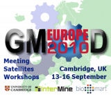
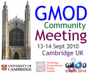

# News/GMOD Europe 2010

From GMOD

Jump to: [navigation](#mw-navigation), [search](#p-search)

  
  
  
  

We are pleased to announce *[GMOD Europe
2010](../GMOD_Europe_2010 "GMOD Europe 2010")*, four days of GMOD events
being held 13-16 September 2010, at the University of Cambridge. GMOD
Europe 2010 includes:

<table class="wikitable">
<colgroup>
<col style="width: 33%" />
<col style="width: 33%" />
<col style="width: 33%" />
</colgroup>
<thead>
<tr class="header">
<th>Event</th>
<th>Date</th>
<th>Description</th>
</tr>
</thead>
<tbody>
<tr class="odd">
<td><strong><a href="../September_2010_GMOD_Meeting"
title="September 2010 GMOD Meeting">September 2010 GMOD
Meeting</a></strong></td>
<td>Mon-Tues 
13-14 Sept</td>
<td data-valign="top">A two day <a href="../Meetings"
title="Meetings">community meeting</a> featuring project updates,
developer and user presentations and best practices, and project
planning. See the <a href="../January_2010_GMOD_Meeting"
title="January 2010 GMOD Meeting">January 2010 GMOD Meeting</a> for an
idea of what goes on at GMOD meetings.</td>
</tr>
<tr class="even">
<td><strong><a href="../Satellite_Meetings_-_GMOD_Europe_2010"
title="Satellite Meetings - GMOD Europe 2010">Satellite
Meetings</a></strong></td>
<td rowspan="2">Wednesday 
15 Sept</td>
<td data-valign="top"><a href="../Satellite_Meetings_-_GMOD_Europe_2010"
title="Satellite Meetings - GMOD Europe 2010">Special interest
groups</a> where GMOD community members meet to discuss specific topics
of interest. If you have topics you want covered please add them.</td>
</tr>
<tr class="odd">
<td><strong><a href="../InterMine_Workshop_-_GMOD_Europe_2010"
title="InterMine Workshop - GMOD Europe 2010">InterMine
Workshop</a></strong></td>
<td data-valign="top">A <a
href="../InterMine_Workshop_-_GMOD_Europe_2010"
title="InterMine Workshop - GMOD Europe 2010">one day workshop</a> on
installing, configuring and using the <a href="../InterMine"
title="InterMine">InterMine</a> biological data warehouse system.</td>
</tr>
<tr class="even">
<td><strong><a href="../BioMart_Workshop_-_GMOD_Europe_2010"
title="BioMart Workshop - GMOD Europe 2010">BioMart
Workshop</a></strong></td>
<td>Thursday 
16 Sept</td>
<td data-valign="top">A <a href="../BioMart_Workshop_-_GMOD_Europe_2010"
title="BioMart Workshop - GMOD Europe 2010">one day workshop</a> on
using the <a href="../BioMart" title="BioMart">BioMart</a> biological
data warehouse system, including accessing data through <a
href="../Glossary#API" title="Glossary">APIs</a>.</td>
</tr>
</tbody>
</table>

[Registration is now
open](../GMOD_Europe_2010#Registration "GMOD Europe 2010") for these
events. There is a £50 registration fee for the [GMOD
Meeting](../September_2010_GMOD_Meeting "September 2010 GMOD Meeting")
to cover catered lunches, coffee/tee breaks, and other expenses.
Registration for all other events is free. Please register soon, as
space is limited.

See you in Cambridge!

[Scott Cain](../User%3AScott "User%3AScott") and [Dave
Clements](../User%3AClements "User%3AClements")

*PS: If you have topics you want to have covered (or you want to cover)
at the [GMOD
Meeting](../September_2010_GMOD_Meeting "September 2010 GMOD Meeting"),
or at the [Satellite
Meetings](../Satellite_Meetings_-_GMOD_Europe_2010 "Satellite Meetings - GMOD Europe 2010"),
please add them to the
[meeting](../September_2010_GMOD_Meeting#Agenda_Proposals "September 2010 GMOD Meeting")
page, or to the [Satellite
Meetings](../Satellite_Meetings_-_GMOD_Europe_2010 "Satellite Meetings - GMOD Europe 2010")
list, or <a href="mailto:help@gmod.org" class="external text"
rel="nofollow">contact us</a>. We are also looking for [guest speaker
nominations](../September_2010_GMOD_Meeting#Guest_Speaker_Nominations "September 2010 GMOD Meeting")
for the meeting.*

  

*Posted to the [GMOD News](../GMOD_News "GMOD News") on 2010/08/04*

Retrieved from
"<http://gmod.org/mediawiki/index.php?title=News/GMOD_Europe_2010&oldid=21906>"

[Category](../Special:Categories "Special:Categories"):

- [News Items](../Category%3ANews_Items "Category%3ANews Items")

## Navigation menu

### Namespaces

- <a
  href="http://gmod.org/mediawiki/index.php?title=Talk:News/GMOD_Europe_2010&amp;action=edit&amp;redlink=1"
  accesskey="t"
  title="Discussion about the content page [t]">Discussion</a>

### 

### Variants

### Navigation

- [GMOD Home](../Main_Page)
- [Software](../GMOD_Components)
- [Categories /
  Tags](../Categories)
- [View all
  pages](../Special:AllPages)

### Documentation

- [Overview](../Overview)
- [FAQs](../Category%3AFAQ)
- [HOWTOs](../Category%3AHOWTO)
- [Glossary](../Glossary)

### Community

- [GMOD News](../GMOD_News)
- [Training /
  Outreach](../Training_and_Outreach)
- [Support](../Support)
- [GMOD Promotion](../GMOD_Promotion)
- [Meetings](../Meetings)
- [Calendar](../Calendar)

### Tools

- <a href="../Special%3ABrowse/News-2FGMOD_Europe_2010"
  rel="smw-browse">Browse properties</a>

- Last updated at 23:36 on 3 October
  2012.
<!-- - 7,359 page views. -->
- Content is available under
  <a href="http://www.gnu.org/licenses/fdl-1.3.html" class="external"
  rel="nofollow">a GNU Free Documentation License</a> unless otherwise
  noted.

<!-- -->

- [About
  GMOD](../GMOD:About "GMOD:About")

<!-- -->

