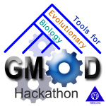

# News/GMOD Evo Hackathon Open Call

From GMOD

Jump to: [navigation](#mw-navigation), [search](#p-search)

We are [seeking
participants](../GMOD_Evo_Hackathon_Open_Call "GMOD Evo Hackathon Open Call")
for the [GMOD Tools for Evolutionary Biology
Hackathon](../GMOD_Evo_Hackathon "GMOD Evo Hackathon"), being held
November 8-12, 2010 at the
<a href="http://nescent.org" class="external text" rel="nofollow">US
National Evolutionary Synthesis Center (NESCent)</a> in Durham, NC.

This hackathon targets three critical gaps in the capabilities of the
GMOD toolbox that currently limit its utility for evolutionary research:

1.  Visualization of comparative genomics data
2.  Visualization of phylogenetic data and trees
3.  Support for population diversity and phenotype data

If you are interested in these areas and have relevant expertise, you
are strongly encouraged to apply. Relevant areas of expertise include
more than just software development: if you are a GMOD power user,
visualization guru, domain expert (comparative, phylogenetics,
population, ...), or documentation wizard, then your skills are needed!

See the [GMOD Evo Hackathon Open
Call](../GMOD_Evo_Hackathon_Open_Call "GMOD Evo Hackathon Open Call")
for details, and for a link to the application form. Applications are
due August 25.

The GMOD Evo Hackathon Organizing Committee:

[Nicole Washington](../User%3ANLWashington "User%3ANLWashington"), [Robert
Buels](../User%3ARobertBuels "User%3ARobertBuels"), [Scott
Cain](../User%3AScott "User%3AScott"), [Dave
Clements](../User%3AClements "User%3AClements"), [Hilmar
Lapp](../User%3AHlapp "User%3AHlapp"), and [Sheldon
McKay](../User%3AMckays "User%3AMckays")

  

*Posted to the [GMOD News](../GMOD_News "GMOD News") on 2010/08/01*

Retrieved from
"<http://gmod.org/mediawiki/index.php?title=News/GMOD_Evo_Hackathon_Open_Call&oldid=22328>"

[Category](../Special%3ACategories "Special%3ACategories"):

- [News Items](../Category%3ANews_Items "Category%3ANews Items")

## Navigation menu

### Namespaces

- <a
  href="http://gmod.org/mediawiki/index.php?title=Talk:News/GMOD_Evo_Hackathon_Open_Call&amp;action=edit&amp;redlink=1"
  accesskey="t"
  title="Discussion about the content page [t]">Discussion</a>

### 

### Variants

### Navigation

- [GMOD Home](../Main_Page)
- [Software](../GMOD_Components)
- [Categories /
  Tags](../Categories)
- [View all
  pages](../Special:AllPages)

### Documentation

- [Overview](../Overview)
- [FAQs](../Category%3AFAQ)
- [HOWTOs](../Category%3AHOWTO)
- [Glossary](../Glossary)

### Community

- [GMOD News](../GMOD_News)
- [Training /
  Outreach](../Training_and_Outreach)
- [Support](../Support)
- [GMOD Promotion](../GMOD_Promotion)
- [Meetings](../Meetings)
- [Calendar](../Calendar)

### Tools

- <a href="../Special%3ABrowse/News-2FGMOD_Evo_Hackathon_Open_Call"
  rel="smw-browse">Browse properties</a>

- Last updated at 23:11 on 9 October
  2012.
<!-- - 7,159 page views. -->
- Content is available under
  <a href="http://www.gnu.org/licenses/fdl-1.3.html" class="external"
  rel="nofollow">a GNU Free Documentation License</a> unless otherwise
  noted.

<!-- -->

- [About
  GMOD](../GMOD:About "GMOD:About")

<!-- -->

