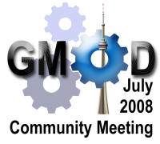

# News/GMOD Meeting Registration

From GMOD

Jump to: [navigation](#mw-navigation), [search](#p-search)

<a href="../July_2008_GMOD_Meeting_Registration" class="mw-redirect"
title="July 2008 GMOD Meeting Registration">Registration</a> is now open
for the [July 2008 GMOD
Meeting](../July_2008_GMOD_Meeting "July 2008 GMOD Meeting"). The
meeting is scheduled for July 16-17, 2008 at the University of Toronto,
immediately before
<a href="http://www.iscb.org/ismb2008/" class="external text"
rel="nofollow">ISMB 2008</a> (also in Toronto), and just a few days
after the 2008 <a href="../GMOD_Summer_School" class="mw-redirect"
title="GMOD Summer School">GMOD Summer School</a>.

Watch the [July 2008 GMOD
Meeting](../July_2008_GMOD_Meeting "July 2008 GMOD Meeting") page for
more information as the meeting draws nearer. If you have any questions
or requests about the July 2008 meeting, please contact the [GMOD Help
Desk](../GMOD_Help_Desk "GMOD Help Desk") at
<a href="mailto:help@gmod.org" class="external text"
rel="nofollow">help@gmod.org</a>. See the [notes from previous
meetings](../Category%3AMeetings "Category%3AMeetings") for an idea of what
is discussed at GMOD meetings.

  

*Posted to the [GMOD News](../GMOD_News "GMOD News") on 2008/06/09*

Retrieved from
"<http://gmod.org/mediawiki/index.php?title=News/GMOD_Meeting_Registration&oldid=22258>"

[Category](../Special%3ACategories "Special%3ACategories"):

- [News Items](../Category%3ANews_Items "Category%3ANews Items")

## Navigation menu

### Namespaces

- <a
  href="http://gmod.org/mediawiki/index.php?title=Talk:News/GMOD_Meeting_Registration&amp;action=edit&amp;redlink=1"
  accesskey="t"
  title="Discussion about the content page [t]">Discussion</a>

### 

### Variants

### Navigation

- [GMOD Home](../Main_Page)
- [Software](../GMOD_Components)
- [Categories /
  Tags](../Categories)
- [View all
  pages](../Special:AllPages)

### Documentation

- [Overview](../Overview)
- [FAQs](../Category%3AFAQ)
- [HOWTOs](../Category%3AHOWTO)
- [Glossary](../Glossary)

### Community

- [GMOD News](../GMOD_News)
- [Training /
  Outreach](../Training_and_Outreach)
- [Support](../Support)
- [GMOD Promotion](../GMOD_Promotion)
- [Meetings](../Meetings)
- [Calendar](../Calendar)

### Tools

- <a href="../Special%3ABrowse/News-2FGMOD_Meeting_Registration"
  rel="smw-browse">Browse properties</a>

- Last updated at 23:08 on 9 October
  2012.
<!-- - 6,819 page views. -->
- Content is available under
  <a href="http://www.gnu.org/licenses/fdl-1.3.html" class="external"
  rel="nofollow">a GNU Free Documentation License</a> unless otherwise
  noted.

<!-- -->

- [About
  GMOD](../GMOD:About "GMOD:About")

<!-- -->

