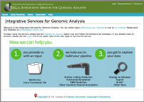

# News/GMOD Nomination: ISGA

From GMOD

Jump to: [navigation](#mw-navigation), [search](#p-search)

I would like to nominate [ISGA](../ISGA "ISGA") for [GMOD
Membership](../GMOD_Membership "GMOD Membership"). ISGA is a
bioinformatics pipeline service based on the
<a href="../Ergatis" class="mw-redirect" title="Ergatis">Ergatis</a>
workflow system. ISGA comes with prokaryotic annotation and assembly
pipelines and offers an intuitive interface for biologists to run and
customize pipelines. ISGA also integrates tools such as
[GBrowse](../GBrowse.1 "GBrowse") and BLAST for visualizing and
analyzing pipeline results. Since ISGA utilizes Ergatis, ISGA pipelines
can be submitted back to the Ergatis community and Ergatis pipelines can
be adapted to use ISGA.

ISGA (pronounced "I-S-G-A") was created at
<a href="http://cgb.indiana.edu/" class="external text"
rel="nofollow">Indiana University's Center for Genomics and
Bioinformatics (CGB)</a> by [Chris
Hemmerich](../User:Chemmeri "User:Chemmeri"), Aaron Buechlein, Ram
Podicheti, Kashi Revanna, and Qunfeng Dong. CGB also hosts a
<a href="http://isga.cgb.indiana.edu/" class="external text"
rel="nofollow">public installation of ISGA</a>.

I believe that ISGA meets all of [GMOD's membership
requirements](../GMOD_Membership#Requirements "GMOD Membership"). The
CGB is willing to support ISGA for at least 2 years. ISGA could be
useful to anyone working with complex pipelines and is directly
applicable to existing and potential
<a href="../Ergatis" class="mw-redirect" title="Ergatis">Ergatis</a>
users. Please see the [ISGA](../ISGA "ISGA") page for more information.

If you have any feedback or comments on ISGA becoming a part of GMOD,
please send
<a href="mailto:help@gmod.org" class="external text" rel="nofollow">send
it to the help desk</a> by August 6.

Thanks,

[Dave Clements](../User:Clements "User:Clements")  
[GMOD Help Desk](../GMOD_Help_Desk "GMOD Help Desk")

  

*Posted to the [GMOD News](../GMOD_News "GMOD News") on 2010/07/29*

Retrieved from
"<http://gmod.org/mediawiki/index.php?title=News/GMOD_Nomination:_ISGA&oldid=22259>"

[Category](../Special:Categories "Special:Categories"):

- [News Items](../Category:News_Items "Category:News Items")

## Navigation menu

### Namespaces

- <a href="GMOD_Nomination:_ISGA" accesskey="c"
  title="View the content page [c]">Page</a>
- <a
  href="http://gmod.org/mediawiki/index.php?title=Talk:News/GMOD_Nomination:_ISGA&amp;action=edit&amp;redlink=1"
  accesskey="t"
  title="Discussion about the content page [t]">Discussion</a>

### 

### Variants

### Navigation

- [GMOD Home](../Main_Page)
- [Software](../GMOD_Components)
- [Categories /
  Tags](../Categories)
- [View all
  pages](../Special:AllPages)

### Documentation

- [Overview](../Overview)
- [FAQs](../Category:FAQ)
- [HOWTOs](../Category:HOWTO)
- [Glossary](../Glossary)

### Community

- [GMOD News](../GMOD_News)
- [Training /
  Outreach](../Training_and_Outreach)
- [Support](../Support)
- [GMOD Promotion](../GMOD_Promotion)
- [Meetings](../Meetings)
- [Calendar](../Calendar)

### Tools

- <a href="../Special:Browse/News-2FGMOD_Nomination:_ISGA"
  rel="smw-browse">Browse properties</a>
- [Print as
  PDF](http://gmod.org/mediawiki/index.php?title=Special:PdfPrint&page=News/GMOD_Nomination:_ISGA)

- Last updated at 23:08 on 9 October
  2012.
<!-- - 6,631 page views. -->
- Content is available under
  <a href="http://www.gnu.org/licenses/fdl-1.3.html" class="external"
  rel="nofollow">a GNU Free Documentation License</a> unless otherwise
  noted.

<!-- -->

- [About
  GMOD](../GMOD:About "GMOD:About")

<!-- -->

- 
- 
  

