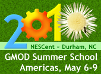

# News/GMOD Summer School - Americas

From GMOD

Jump to: [navigation](#mw-navigation), [search](#p-search)

We are now [accepting
applications](../2010_GMOD_Summer_School_-_Americas "2010 GMOD Summer School - Americas")
for the [2010 GMOD Summer School -
Americas](../2010_GMOD_Summer_School_-_Americas "2010 GMOD Summer School - Americas").
This will be a hands-on multi-day course aimed at teaching new GMOD
administrators how to get [GMOD
Components](../GMOD_Components "GMOD Components") up and running. The
course will introduce participants to the GMOD project and then focus on
installation, configuration and integration of popular [GMOD
Components](../GMOD_Components "GMOD Components").

The course will be held May 6-9, at
<a href="http://nescent.org" class="external text"
rel="nofollow">NESCent</a> in Durham, NC. These [GMOD
Components](../GMOD_Components "GMOD Components") will be covered:

<table>
<colgroup>
<col style="width: 33%" />
<col style="width: 33%" />
<col style="width: 33%" />
</colgroup>
<tbody>
<tr class="odd">
<td>

 
&#10;

<strong><a href="../2010_GMOD_Summer_School_-_Americas"
title="2010 GMOD Summer School - Americas">Apply Now</a></strong>

</td>
<td>  </td>
<td><ul>
<li><a href="../Apollo.1" title="Apollo">Apollo</a> - genome annotation
editor</li>
<li><a href="../Chado" class="mw-redirect" title="Chado">Chado</a> - a
modular and extensible database schema</li>
<li><a href="../Galaxy.1" title="Galaxy">Galaxy</a> - workflow
system</li>
<li><a href="../GBrowse.1" title="GBrowse">GBrowse</a> - the Generic
Genome Browser</li>
<li><a href="../GBrowse_syn.1" title="GBrowse syn">GBrowse_syn</a> - A
generic synteny browser</li>
<li><a href="../JBrowse.1" title="JBrowse">JBrowse</a> - genome
browser</li>
<li><a href="../MAKER.1" title="MAKER">MAKER</a> - Genome annotation
pipeline</li>
<li><a href="../Tripal.1" title="Tripal">Tripal</a> - Web front end for
<a href="../Chado" class="mw-redirect" title="Chado">Chado</a></li>
</ul></td>
</tr>
</tbody>
</table>

**The deadline for applying is the end of Friday, February 22. Admission
is competitive and is based on the strength of the application
(especially the statement of interest).** In 2009 there were over 50
applications for the 25 slots. Any applications received after the
deadline will be automatically placed on the waiting list.

Thanks,

[Dave Clements](../User:Clements "User:Clements")  
[GMOD Help Desk](../GMOD_Help_Desk "GMOD Help Desk")

|  |  |
|----|----|
| PS: | We are also investigating holding a GMOD course in the Asia/Pacific region, sometime this fall. Watch the [GMOD Mailing Lists](../GMOD_Mailing_Lists "GMOD Mailing Lists") and the [GMOD News](../GMOD_News "GMOD News") for updates. |

  

*Posted to the [GMOD News](../GMOD_News "GMOD News") on 2010/01/29*

Retrieved from
"<http://gmod.org/mediawiki/index.php?title=News/GMOD_Summer_School_-_Americas&oldid=21917>"

[Category](../Special:Categories "Special:Categories"):

- [News Items](../Category:News_Items "Category:News Items")

## Navigation menu

### Namespaces

- <a href="GMOD_Summer_School_-_Americas" accesskey="c"
  title="View the content page [c]">Page</a>
- <a
  href="http://gmod.org/mediawiki/index.php?title=Talk:News/GMOD_Summer_School_-_Americas&amp;action=edit&amp;redlink=1"
  accesskey="t"
  title="Discussion about the content page [t]">Discussion</a>

### 

### Variants

### Views

- [Read](GMOD_Summer_School_-_Americas)
- <a
  href="http://gmod.org/mediawiki/index.php?title=News/GMOD_Summer_School_-_Americas&amp;action=edit"
  accesskey="e" title="This page is protected.
  You can view its source [e]">View source</a>
- <a
  href="http://gmod.org/mediawiki/index.php?title=News/GMOD_Summer_School_-_Americas&amp;action=history"
  accesskey="h" title="Past revisions of this page [h]">View history</a>

### Actions

### Search

### Navigation

- [GMOD Home](../Main_Page)
- [Software](../GMOD_Components)
- [Categories /
  Tags](../Categories)
- [View all
  pages](../Special:AllPages)

### Documentation

- [Overview](../Overview)
- [FAQs](../Category:FAQ)
- [HOWTOs](../Category:HOWTO)
- [Glossary](../Glossary)

### Community

- [GMOD News](../GMOD_News)
- [Training /
  Outreach](../Training_and_Outreach)
- [Support](../Support)
- [GMOD Promotion](../GMOD_Promotion)
- [Meetings](../Meetings)
- [Calendar](../Calendar)

### Tools

- <a href="../Special:WhatLinksHere/News/GMOD_Summer_School_-_Americas"
  accesskey="j" title="A list of all wiki pages that link here [j]">What
  links here</a>
- <a
  href="../Special:RecentChangesLinked/News/GMOD_Summer_School_-_Americas"
  accesskey="k"
  title="Recent changes in pages linked from this page [k]">Related
  changes</a>
- <a href="../Special:SpecialPages" accesskey="q"
  title="A list of all special pages [q]">Special pages</a>
- <a
  href="http://gmod.org/mediawiki/index.php?title=News/GMOD_Summer_School_-_Americas&amp;printable=yes"
  rel="alternate" accesskey="p"
  title="Printable version of this page [p]">Printable version</a>
- [Permanent
  link](http://gmod.org/mediawiki/index.php?title=News/GMOD_Summer_School_-_Americas&oldid=21917 "Permanent link to this revision of the page")
- [Page
  information](http://gmod.org/mediawiki/index.php?title=News/GMOD_Summer_School_-_Americas&action=info)
- <a href="../Special:Browse/News-2FGMOD_Summer_School_-2D_Americas"
  rel="smw-browse">Browse properties</a>
- [Print as
  PDF](http://gmod.org/mediawiki/index.php?title=Special:PdfPrint&page=News/GMOD_Summer_School_-_Americas)

- Last updated at 23:44 on 3 October
  2012.
- 7,363 page views.
- Content is available under
  <a href="http://www.gnu.org/licenses/fdl-1.3.html" class="external"
  rel="nofollow">a GNU Free Documentation License</a> unless otherwise
  noted.

<!-- -->

- [About
  GMOD](../GMOD:About "GMOD:About")

<!-- -->

- 
- 
  

