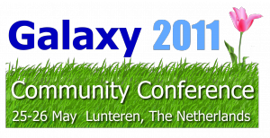

# News/Galaxy Events: April 2011

From GMOD

Jump to: [navigation](#mw-navigation), [search](#p-search)

There are a number of [Galaxy](../Galaxy.1 "Galaxy")-related events
going on this month:

- *<a
  href="http://gmod.827538.n3.nabble.com/Around-Pittsburgh-on-April-6-Attend-the-Intro-to-Galaxy-Sessions-Pitt-td2760070.html"
  class="external text" rel="nofollow">Intro to Galaxy</a>* workshops,
  April 6 at University of Pittsburgh, [Dan
  Blankenberg](../User:DanB "User:DanB")
- *<a
  href="http://www.bio-itworldexpo.com/Bio-It_Expo_Content.aspx?id=101298"
  class="external text" rel="nofollow">Dynamically Scalable, Accessible
  Analysis for High-Throughput Sequence Data</a>*, April 13 talk at
  <a href="http://www.bio-itworldexpo.com/" class="external text"
  rel="nofollow">BioIT World</a>, Boston, Enis Afgan
- <a href="https://wiki.nbic.nl/index.php/NBIC_Galaxy_Hackathon_project"
  class="external text" rel="nofollow">NBIC Galaxy Hackathon</a>, April
  13-14, Belgium; this is now full but they are still <a
  href="https://wiki.nbic.nl/index.php/NBIC_Galaxy_Hackathon_project#Potential_subjects#Potential_subjects"
  class="external text" rel="nofollow">accepting proposals to work on</a>.
- Early registration closes for
  <a href="http://galaxy.psu.edu/gcc2011/" class="external text"
  rel="nofollow">2011 Galaxy Community Conference</a>, April 24.
  Register early and save 20%.

[Dave Clements](../User:Clements "User:Clements")  
[Galaxy](../Galaxy.1 "Galaxy") Project

  

*Posted to the [GMOD News](../GMOD_News "GMOD News") on 2011/04/04*

Retrieved from
"<http://gmod.org/mediawiki/index.php?title=News/Galaxy_Events%3A_April_2011&oldid=22334>"

[Category](../Special:Categories "Special:Categories"):

- [News Items](../Category%3ANews_Items "Category%3ANews Items")

## Navigation menu

### Namespaces

- <a
  href="http://gmod.org/mediawiki/index.php?title=Talk:News/Galaxy_Events%3A_April_2011&amp;action=edit&amp;redlink=1"
  accesskey="t"
  title="Discussion about the content page [t]">Discussion</a>

### 

### Variants

### Navigation

- [GMOD Home](../Main_Page)
- [Software](../GMOD_Components)
- [Categories /
  Tags](../Categories)
- [View all
  pages](../Special:AllPages)

### Documentation

- [Overview](../Overview)
- [FAQs](../Category%3AFAQ)
- [HOWTOs](../Category%3AHOWTO)
- [Glossary](../Glossary)

### Community

- [GMOD News](../GMOD_News)
- [Training /
  Outreach](../Training_and_Outreach)
- [Support](../Support)
- [GMOD Promotion](../GMOD_Promotion)
- [Meetings](../Meetings)
- [Calendar](../Calendar)

### Tools

- <a href="../Special%3ABrowse/News-2FGalaxy_Events%3A_April_2011"
  rel="smw-browse">Browse properties</a>

- Last updated at 23:11 on 9 October
  2012.
<!-- - 8,807 page views. -->
- Content is available under
  <a href="http://www.gnu.org/licenses/fdl-1.3.html" class="external"
  rel="nofollow">a GNU Free Documentation License</a> unless otherwise
  noted.

<!-- -->

- [About
  GMOD](../GMOD:About "GMOD:About")

<!-- -->

