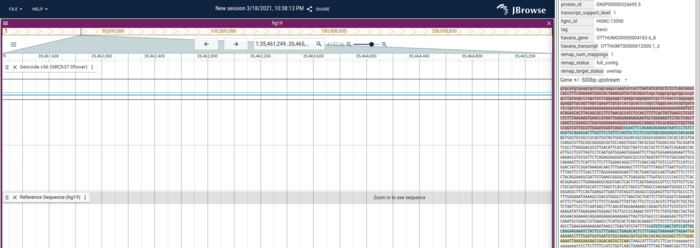
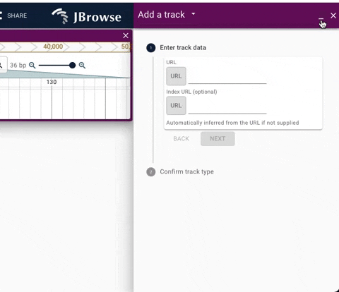

# News/JBrowse2 v1.1.0 Released

From GMOD

Jump to: [navigation](#mw-navigation), [search](#p-search)

## Contents

- [1 We're pleased
  to announce a new release of JBrowse
  Web!](#We.27re_pleased_to_announce_a_new_release_of_JBrowse_Web.21)
  - [1.1 Changed
    callbacks language from JavaScript to
    Jexl](#Changed_callbacks_language_from_JavaScript_to_Jexl)
  - [1.2 Fetch
    intron and upstream/downstream
    sequences](#Fetch_intron_and_upstream.2Fdownstream_sequences)
  - [1.3
    Interactive documentation using
    Storybook](#Interactive_documentation_using_Storybook)
  - [1.4 Enhanced
    navigation to drawer widget
    stack](#Enhanced_navigation_to_drawer_widget_stack)
  - [1.5
    Downloads](#Downloads)
  - [1.6 1.1.0
    (2021-03-29)](#1.1.0_.282021-03-29.29)
    - [1.6.1 🚀
      Enhancement](#.F0.9F.9A.80_Enhancement)
    - [1.6.2 🐛 Bug
      Fix](#.F0.9F.90.9B_Bug_Fix)
    - [1.6.3 📝
      Documentation](#.F0.9F.93.9D_Documentation)
    - [1.6.4 🏠
      Internal](#.F0.9F.8F.A0_Internal)
    - [1.6.5
      Committers: 6](#Committers:_6)

## We're pleased to announce a new release of JBrowse Web!

(Reposted by permission from
<a href="https://jbrowse.org/jb2/blog/2021/03/29/v1.1.0-release"
class="external free"
rel="nofollow">https://jbrowse.org/jb2/blog/2021/03/29/v1.1.0-release</a>

### Changed callbacks language from JavaScript to Jexl

To allow users to safely and seamlessly share advanced configurations in
sessions, we now use Jexl to express configuration callbacks. Note that
this is a breaking change, function()-style callbacks will no longer
work.

For details, see the <a
href="https://jbrowse.org/jb2/docs/config_guide#configuration-callbacks#configuration-callbacks"
class="external text" rel="nofollow">callbacks section of our
configuration guide</a>.

### Fetch intron and upstream/downstream sequences

We also have several other improvements including the ability to get
intron and upstream/downstream sequence in the feature details

### Interactive documentation using Storybook

Another new update is the first release of our interactive Storybook
docs for the embeddable React Linear Genome View. The docs contain live
examples of how the LGV component can be used, along with source-code
examples. The site can be found
<a href="https://jbrowse.org/storybook/lgv/v1.1.0" class="external text"
rel="nofollow">here</a>.

### Enhanced navigation to drawer widget stack

We have added a dropdown to enhance navigation between stack of active
widgets. The update also adds a minimize button to allow quick access to
full screen JBrowse web.

See below for demos of the new navigation UI.

Demo of using the minimize button in the drawer

### Downloads

- <a href="https://github.com/GMOD/jbrowse-components/releases/tag/v1.1.0"
  class="external text" rel="nofollow">v1.1.0</a>

To install JBrowse 2 for the web, you can download the link above, or
you can use the JBrowse CLI to automatically download the latest
version. See the JBrowse web quick start for more details.

### 1.1.0 (2021-03-29)

#### 🚀 Enhancement

core

1.  1846 Improve copy+paste in the data grids for feature details
    (@cmdcolin)
2.  1814 Add ability to get promoter sequence and intron sequence for
    genes from the feature details panel (@cmdcolin)
3.  1816 Remove some animation effects (@cmdcolin)
4.  1778 Adds dropdown to show drawer widget stack (@teresam856)
5.  1685 Change callbacks language from JavaScript to Jexl (@peterkxie)

Other

1.  1831 Add dialog for launching breakpoint split view from variant
    feature details (@cmdcolin)
2.  1803 Transcript and gene glyphs can now display implied UTRs, active
    by default (@cmdcolin)
3.  1808 Add another heuristic for returning gene features from BigBed
    (@cmdcolin)
4.  1774 Add warning dialog in LGV before returning to import form to
    prevent accidentally losing the current view (@cmdcolin)

#### 🐛 Bug Fix

core

1.  1811 Check for existence of window more robustly to allow in SSR or
    node applications (@elliothershberg)
2.  1793 Fix dotplot rendering outside it's allowed bounds (@cmdcolin)
3.  1783 Add hic aborting and fix remoteAbort signal propagation
    (@cmdcolin)
4.  1723 A few bugfixes (@garrettjstevens)

Other

1.  1815 Clear tracks when using "Return to import form" (@cmdcolin)
2.  1819 Standardized sentence casing on drawer widget titles
    (@cmdcolin)
3.  1796 Bump generic-filehandle for fixing CORS errors from Chrome
    cache pollution (@cmdcolin)

#### 📝 Documentation

1.  1824 Add storybook docs page for nextjs usage (@elliothershberg)
2.  1770 1469 storybook deploy (@elliothershberg)
3.  1807 Update developer guide to cover displays, and highlight working
    external plugins (@cmdcolin)
4.  1779 Collaborative release announcement editing (@rbuels)
5.  1791 Add a couple more demos for our live version with MDX
    (@cmdcolin)

#### 🏠 Internal

Other

1.  1820 Create v1.1.0.md, draft of release announcements
    (@garrettjstevens)
2.  1823 Add note about previewing changelog to CONTRIBUTING.md
    (@garrettjstevens)

core

1.  1834 Change jbrowse-components monorepo default branch from 'master'
    to 'main' (@rbuels)

#### Committers: 6

- Colin Diesh (@cmdcolin)
- Elliot Hershberg (@elliothershberg)
- Garrett Stevens (@garrettjstevens)
- Peter Xie (@peterkxie)
- Robert Buels (@rbuels)
- Teresa Martinez (@teresam856)

  

*Posted to the [GMOD News](../GMOD_News "GMOD News") on 2021/03/30*

Retrieved from
"<http://gmod.org/mediawiki/index.php?title=News/JBrowse2_v1.1.0_Released&oldid=27953>"

[Category](../Special:Categories "Special:Categories"):

- [News Items](../Category:News_Items "Category:News Items")

## Navigation menu

### Namespaces

- <a href="JBrowse2_v1.1.0_Released" accesskey="c"
  title="View the content page [c]">Page</a>
- <a
  href="http://gmod.org/mediawiki/index.php?title=Talk:News/JBrowse2_v1.1.0_Released&amp;action=edit&amp;redlink=1"
  accesskey="t"
  title="Discussion about the content page [t]">Discussion</a>

### 

### Variants

### Navigation

- [GMOD Home](../Main_Page)
- [Software](../GMOD_Components)
- [Categories /
  Tags](../Categories)
- [View all
  pages](../Special:AllPages)

### Documentation

- [Overview](../Overview)
- [FAQs](../Category:FAQ)
- [HOWTOs](../Category:HOWTO)
- [Glossary](../Glossary)

### Community

- [GMOD News](../GMOD_News)
- [Training /
  Outreach](../Training_and_Outreach)
- [Support](../Support)
- [GMOD Promotion](../GMOD_Promotion)
- [Meetings](../Meetings)
- [Calendar](../Calendar)

### Tools

- <a href="../Special:Browse/News-2FJBrowse2_v1.1.0_Released"
  rel="smw-browse">Browse properties</a>

- Last updated at 20:28 on 30 March
  2021.
<!-- - 13,736 page views. -->
- Content is available under
  <a href="http://www.gnu.org/licenses/fdl-1.3.html" class="external"
  rel="nofollow">a GNU Free Documentation License</a> unless otherwise
  noted.

<!-- -->

- [About
  GMOD](../GMOD:About "GMOD:About")

<!-- -->

