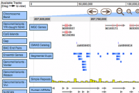

# News/JBrowse 1.1 Released

From GMOD

Jump to: [navigation](#mw-navigation), [search](#p-search)

<a href="http://jbrowse.org/?p=56" class="external text"
rel="nofollow">JBrowse version 1.1 is released!</a> You can
<a href="http://jbrowse.org/releases/jbrowse-1.1.zip"
class="external text" rel="nofollow">find the code here</a>.

What's new:

- **Scalability:** [JBrowse](../JBrowse.1 "JBrowse") can now handle very
  large data tracks, including human EST/SNP tracks, or tracks of
  next-gen sequence reads. Large datasets are broken into smaller
  chunks, so there is no loading delay for big tracks.
- **Extensibility:** A Perl module (`ImageTrackRenderer.pm`) for
  creating user-drawn image tracks is now available, based on the CPAN
  <a href="http://search.cpan.org/perldoc?GD.pm" class="external text"
  rel="nofollow">GD.pm</a> module. An example program is provided,
  `draw-basepair-track.pl`, that uses this module to draw arcs over a
  sequence representing the base-pairing interactions of RNA secondary
  structure.
- **Bug fixes:** Numerous display glitches have been fixed, including
  issues with wide-screen monitors and long mostly-offscreen features.

Note: The [JSON](../Glossary#JSON "Glossary") format used by 1.1 *is not
backward compatible with previous releases. If you are upgrading from an
older version of JBrowse, you will have to regenerate all the JSON files
on your server.*

See the <a href="http://jbrowse.org/?p=56" class="external text"
rel="nofollow">release notes</a> for full details.

[Mitch Skinner](../User:MitchSkinner "User:MitchSkinner")

  

*Posted to the [GMOD News](../GMOD_News "GMOD News") on 2010/09/12*

Retrieved from
"<http://gmod.org/mediawiki/index.php?title=News/JBrowse_1.1_Released&oldid=22346>"

[Category](../Special:Categories "Special:Categories"):

- [News Items](../Category:News_Items "Category:News Items")

## Navigation menu

### Namespaces

- <a href="JBrowse_1.1_Released" accesskey="c"
  title="View the content page [c]">Page</a>
- <a
  href="http://gmod.org/mediawiki/index.php?title=Talk:News/JBrowse_1.1_Released&amp;action=edit&amp;redlink=1"
  accesskey="t"
  title="Discussion about the content page [t]">Discussion</a>

### 

### Variants

### Navigation

- [GMOD Home](../Main_Page)
- [Software](../GMOD_Components)
- [Categories /
  Tags](../Categories)
- [View all
  pages](../Special:AllPages)

### Documentation

- [Overview](../Overview)
- [FAQs](../Category:FAQ)
- [HOWTOs](../Category:HOWTO)
- [Glossary](../Glossary)

### Community

- [GMOD News](../GMOD_News)
- [Training /
  Outreach](../Training_and_Outreach)
- [Support](../Support)
- [GMOD Promotion](../GMOD_Promotion)
- [Meetings](../Meetings)
- [Calendar](../Calendar)

### Tools

- <a href="../Special:Browse/News-2FJBrowse_1.1_Released"
  rel="smw-browse">Browse properties</a>

- Last updated at 23:12 on 9 October
  2012.
<!-- - 5,885 page views. -->
- Content is available under
  <a href="http://www.gnu.org/licenses/fdl-1.3.html" class="external"
  rel="nofollow">a GNU Free Documentation License</a> unless otherwise
  noted.

<!-- -->

- [About
  GMOD](../GMOD:About "GMOD:About")

<!-- -->

